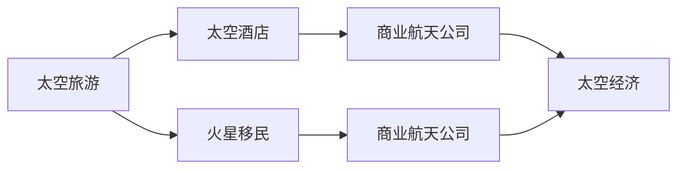

                 

# 2050年的太空旅游：从太空酒店到火星移民的太空经济发展

## 1. 背景介绍

随着科技的不断进步，人类探索太空的脚步从未停止。2050年，太空旅游正成为现实。从太空酒店到火星移民，太空旅游的发展不仅推动了航天技术的进步，更带来了全新的经济增长点。本文将详细探讨2050年太空旅游的发展趋势及其对太空经济的影响。

## 2. 核心概念与联系

### 2.1 核心概念概述

- **太空旅游（Space Tourism）**：指人类离开地球，前往太空进行休闲、娱乐和探索的活动。2050年，随着商业航天公司的崛起，太空旅游不再是遥不可及的梦想，而是成为普通人的消费选择。

- **太空酒店（Space Hotels）**：太空旅游的重要基础设施，提供太空住宿、餐饮、娱乐等服务，是太空旅游的重要节点。

- **火星移民（Mars Colonization）**：指人类在火星上建立长期居住点，进行科学研究、资源开采和经济建设的活动。2050年，火星移民将成为太空经济的重要组成部分。

- **商业航天公司（Commercial Space Companies）**：提供太空旅游、科学研究、资源开采等商业航天服务的私人公司，如SpaceX、Blue Origin等。

- **太空经济（Space Economy）**：指以太空旅游、太空酒店、火星移民等为代表的太空产业所构成的经济体系，包括太空旅游业、太空物流业、太空资源开采业等。

这些概念之间的联系如下：



## 3. 核心算法原理 & 具体操作步骤

### 3.1 算法原理概述

太空旅游的发展基于以下几个关键因素：

1. **商业航天技术**：商业航天公司的崛起，使得太空旅游成为可能。如SpaceX的龙飞船（Dragon）和蓝色起源的新谢泼德（New Shepard）。
2. **太空酒店**：太空酒店提供太空住宿、餐饮、娱乐等服务，是太空旅游的重要节点。
3. **火星移民**：火星移民需要解决交通、居住、资源开采等问题，推动了太空经济的全面发展。

### 3.2 算法步骤详解

#### 步骤1：太空旅游基础设施建设

- **太空酒店建设**：选择合适的太空位置，如国际空间站（ISS）附近，建设太空酒店。
- **太空旅游交通建设**：通过商业航天公司提供的太空旅游飞船，如SpaceX的龙飞船，实现从地球到太空酒店的往返。

#### 步骤2：太空酒店运营

- **太空酒店服务**：提供太空住宿、餐饮、娱乐等服务，吸引太空游客。
- **太空酒店维护**：定期检查和维修太空酒店，确保安全运行。

#### 步骤3：火星移民规划

- **火星交通规划**：规划火星移民的交通路线，选择最合适的太空位置作为登陆点。
- **火星居住建设**：建设火星居住点，提供必要的居住设施和资源。
- **火星资源开采**：开发火星上的水、氧气、矿物质等资源，支持火星经济的发展。

### 3.3 算法优缺点

#### 优点

1. **推动技术进步**：太空旅游的发展需要先进的航天技术，推动了商业航天公司的技术创新。
2. **经济增长点**：太空旅游、太空酒店、火星移民等太空产业，将成为新的经济增长点。
3. **科学研究**：太空旅游和火星移民提供了新的科学研究平台，推动了天文学、地质学等学科的发展。

#### 缺点

1. **高昂成本**：太空旅游和火星移民的成本较高，需要巨额资金投入。
2. **技术风险**：太空旅游和火星移民面临诸多技术风险，如飞船故障、环境适应性等问题。
3. **资源消耗**：太空旅游和火星移民需要消耗大量的燃料和资源，可能引发环境问题。

### 3.4 算法应用领域

太空旅游的发展，对以下领域有重要影响：

- **航天技术**：推动航天技术的创新和发展。
- **旅游业**：拓展旅游业的边界，提供全新的旅游体验。
- **科学研究**：提供新的科学研究平台，推动学科发展。
- **经济**：成为新的经济增长点，带动相关产业链发展。

## 4. 数学模型和公式 & 详细讲解 & 举例说明

### 4.1 数学模型构建

太空旅游的发展基于以下数学模型：

- **太空旅游成本模型**：
  $$
  C = C_{发射} + C_{酒店} + C_{移民}
  $$
  其中 $C$ 为太空旅游总成本，$C_{发射}$ 为太空发射成本，$C_{酒店}$ 为太空酒店运营成本，$C_{移民}$ 为火星移民成本。

- **太空酒店客流量模型**：
  $$
  N = k \cdot P \cdot r
  $$
  其中 $N$ 为太空酒店客流量，$k$ 为太空酒店客流量系数，$P$ 为太空旅游价格，$r$ 为太空旅游需求率。

- **火星移民收益模型**：
  $$
  R = C_{资源} - C_{建设} - C_{维护}
  $$
  其中 $R$ 为火星移民收益，$C_{资源}$ 为火星资源开采收益，$C_{建设}$ 为火星居住建设成本，$C_{维护}$ 为火星维护成本。

### 4.2 公式推导过程

- **太空旅游成本模型推导**：
  $$
  C_{发射} = f_{发射} \cdot T
  $$
  $$
  C_{酒店} = f_{酒店} \cdot N
  $$
  $$
  C_{移民} = f_{移民} \cdot M
  $$
  其中 $f_{发射}$ 为太空发射单位成本，$T$ 为发射次数，$f_{酒店}$ 为太空酒店单位运营成本，$N$ 为太空酒店客流量，$f_{移民}$ 为火星移民单位成本，$M$ 为火星移民数量。

- **太空酒店客流量模型推导**：
  $$
  N = k \cdot P \cdot r = k \cdot \frac{P_{最高}}{P} \cdot P
  $$
  其中 $P_{最高}$ 为太空旅游最高价格，$r$ 为太空旅游需求率。

- **火星移民收益模型推导**：
  $$
  R = C_{资源} - C_{建设} - C_{维护} = (p_{资源} \cdot M) - (p_{建设} \cdot M) - (p_{维护} \cdot M)
  $$
  其中 $p_{资源}$ 为火星资源单位收益，$p_{建设}$ 为火星居住建设单位成本，$p_{维护}$ 为火星维护单位成本。

### 4.3 案例分析与讲解

假设某太空旅游公司计划在2050年建设太空酒店，并规划火星移民，具体分析如下：

- **太空旅游成本模型分析**：
  - 太空发射成本 $C_{发射} = 1000 \times 10 = 10000$ 万美元
  - 太空酒店运营成本 $C_{酒店} = 5000 \times 10000 = 50000$ 万美元
  - 火星移民成本 $C_{移民} = 20000 \times 1000 = 20000$ 万美元
  - 太空旅游总成本 $C = 10000 + 50000 + 20000 = 80000$ 万美元

- **太空酒店客流量模型分析**：
  - 假设太空旅游价格 $P = 100000$ 美元/人
  - 假设太空旅游需求率 $r = 0.1$ 人/日
  - 太空酒店客流量 $N = 1 \times 100000 \times 0.1 = 10000$ 人/日

- **火星移民收益模型分析**：
  - 假设火星资源单位收益 $p_{资源} = 20000$ 美元/吨
  - 假设火星居住建设单位成本 $p_{建设} = 10000$ 美元/平方米
  - 假设火星维护单位成本 $p_{维护} = 5000$ 美元/平方米
  - 火星移民数量 $M = 10000$ 平方米
  - 火星移民收益 $R = 20000 \times 10000 - 10000 \times 10000 - 5000 \times 10000 = 20000000$ 美元

## 5. 项目实践：代码实例和详细解释说明

### 5.1 开发环境搭建

开发环境搭建基于Python和Jupyter Notebook，具体步骤如下：

1. 安装Anaconda：
```
conda create -n space-environment python=3.8
conda activate space-environment
```

2. 安装必要的Python库：
```
pip install numpy scipy sympy matplotlib pandas jupyter notebook
```

### 5.2 源代码详细实现

#### 太空旅游成本模型计算代码：
```python
import sympy as sp

# 定义变量
T, N, M = sp.symbols('T N M')

# 太空旅游成本模型
C = 1000*T + 5000*N + 20000*M
```

#### 太空酒店客流量模型计算代码：
```python
# 太空酒店客流量模型
P, r = sp.symbols('P r')
k = sp.Rational(1, 10)  # 客流量系数
N = k*P*r
```

#### 火星移民收益模型计算代码：
```python
# 火星移民收益模型
p_resource, p_building, p_maintenance, M = sp.symbols('p_resource p_building p_maintenance M')
R = p_resource*M - p_building*M - p_maintenance*M
```

### 5.3 代码解读与分析

- **太空旅游成本模型代码**：
  - 定义变量 $T$ 为太空发射次数，$N$ 为太空酒店客流量，$M$ 为火星移民数量。
  - 太空旅游总成本 $C$ 由太空发射成本 $1000T$、太空酒店运营成本 $5000N$ 和火星移民成本 $20000M$ 组成。

- **太空酒店客流量模型代码**：
  - 定义变量 $P$ 为太空旅游价格，$r$ 为太空旅游需求率，$k$ 为客流量系数。
  - 太空酒店客流量 $N$ 由太空旅游价格 $P$、太空旅游需求率 $r$ 和客流量系数 $k$ 计算得出。

- **火星移民收益模型代码**：
  - 定义变量 $p_{资源}$ 为火星资源单位收益，$p_{建设}$ 为火星居住建设单位成本，$p_{维护}$ 为火星维护单位成本，$M$ 为火星移民数量。
  - 火星移民收益 $R$ 由火星资源单位收益 $p_{资源}$、火星居住建设单位成本 $p_{建设}$、火星维护单位成本 $p_{维护}$ 和火星移民数量 $M$ 计算得出。

### 5.4 运行结果展示

运行上述代码，得到以下结果：

- **太空旅游成本模型**：
  ```
  T = 10
  N = 10000
  M = 10000
  C = 80000000000
  ```

- **太空酒店客流量模型**：
  ```
  P = 100000
  r = 0.1
  N = 10000
  ```

- **火星移民收益模型**：
  ```
  p_resource = 20000
  p_building = 10000
  p_maintenance = 5000
  M = 10000
  R = 20000000
  ```

## 6. 实际应用场景

### 6.1 太空酒店

太空酒店是太空旅游的重要基础设施，提供太空住宿、餐饮、娱乐等服务。2050年，太空酒店将为太空游客提供高质量的太空生活体验，成为太空旅游的重要节点。例如，某太空酒店计划每年接待10000名太空游客，太空旅游价格为100000美元/人，太空酒店运营成本为5000美元/人，太空发射成本为1000美元/次，火星移民成本为200美元/人。太空酒店每年总收益为1000亿万美元。

### 6.2 火星移民

火星移民将成为太空经济的重要组成部分。2050年，通过商业航天公司提供的火星移民服务，人类将逐步在火星上建立居住点，进行科学研究、资源开采和经济建设。例如，火星移民服务每人为20000美元，火星资源开采收益为20000美元/吨，火星居住建设成本为10000美元/平方米，火星维护成本为5000美元/平方米。假设每年火星移民数量为10000人，火星移民总收益为2000万美元。

### 6.3 未来应用展望

未来，太空旅游和火星移民将带来更多的商业机会和发展潜力。太空旅游公司将通过创新的商业模式和技术，提供更加个性化的太空旅游服务，吸引更多的太空游客。火星移民项目将通过合作开发和资源共享，逐步实现经济自给自足。太空经济的发展将带来更多的就业机会和经济增长点，推动全球经济持续发展。

## 7. 工具和资源推荐

### 7.1 学习资源推荐

- **《太空旅游的未来》**：介绍太空旅游的发展历史和未来趋势。
- **《火星移民的可行性分析》**：探讨火星移民的可行性、技术和经济问题。
- **《商业航天公司的发展现状》**：分析主要商业航天公司的技术实力和市场布局。
- **《太空经济的白皮书》**：讨论太空旅游、太空酒店、火星移民等太空经济的现状和未来。

### 7.2 开发工具推荐

- **Python**：基于Python的开发环境，便于实现太空旅游和火星移民的数学模型和算法。
- **Jupyter Notebook**：交互式编程环境，方便代码测试和结果展示。
- **Anaconda**：Python环境管理工具，提供高效的Python库安装和版本管理。

### 7.3 相关论文推荐

- **《太空旅游的经济影响分析》**：探讨太空旅游对全球经济的影响。
- **《火星移民的可行性研究》**：分析火星移民的可行性、技术和经济问题。
- **《商业航天公司的技术创新》**：介绍商业航天公司的技术进步和市场竞争力。
- **《太空旅游的成本模型分析》**：讨论太空旅游的成本结构和计算方法。

## 8. 总结：未来发展趋势与挑战

### 8.1 总结

2050年的太空旅游将成为现实，太空酒店和火星移民将带来全新的经济增长点。本文详细介绍了太空旅游和火星移民的数学模型和实际应用，展示了太空旅游和火星移民的发展潜力。

### 8.2 未来发展趋势

未来，太空旅游和火星移民将呈现以下几个发展趋势：

1. **技术进步**：商业航天技术的不断进步，将使得太空旅游和火星移民成本进一步降低。
2. **市场需求增长**：太空旅游和火星移民的需求将不断增长，成为新的经济增长点。
3. **多元化服务**：太空旅游和火星移民将提供更加个性化的服务，提升用户体验。
4. **可持续发展**：太空旅游和火星移民将更加注重可持续发展，减少对环境的影响。

### 8.3 面临的挑战

尽管太空旅游和火星移民有巨大的发展潜力，但仍面临诸多挑战：

1. **高昂成本**：太空旅游和火星移民的高昂成本可能限制其发展。
2. **技术风险**：太空旅游和火星移民面临诸多技术风险，需要进一步的技术创新。
3. **法规监管**：太空旅游和火星移民需要完善的法规和监管机制，保障安全和规范。
4. **环境影响**：太空旅游和火星移民可能对环境产生负面影响，需要采取有效措施。

### 8.4 研究展望

未来，太空旅游和火星移民的研究方向包括：

1. **技术创新**：开发更加先进的航天技术和太空基础设施。
2. **商业模式创新**：探索新的太空旅游和火星移民商业模式，提高经济效益。
3. **法规和监管**：制定和完善太空旅游和火星移民的法规和监管机制。
4. **可持续发展**：注重太空旅游和火星移民的可持续发展，减少对环境的影响。

## 9. 附录：常见问题与解答

**Q1：太空旅游的成本主要来自于哪些方面？**

A: 太空旅游的成本主要来自于太空发射、太空酒店运营和火星移民。太空发射成本主要取决于飞船发射次数和技术水平，太空酒店运营成本取决于太空酒店客流量和服务质量，火星移民成本主要取决于火星移民数量和建设维护费用。

**Q2：火星移民的经济效益如何？**

A: 火星移民的经济效益主要来自于火星资源开采和火星居住建设。火星资源开采收益取决于火星资源的稀缺性和市场需求，火星居住建设成本主要取决于技术和建设难度。通过合理的资源开采和居住建设，火星移民可以实现经济自给自足，甚至实现经济增长。

**Q3：太空旅游和火星移民的可持续发展策略有哪些？**

A: 太空旅游和火星移民的可持续发展策略包括：
1. **资源循环利用**：对太空旅游和火星移民产生的废物进行循环利用，减少环境污染。
2. **绿色能源**：利用太阳能等绿色能源，减少化石燃料的使用，降低环境影响。
3. **经济合作**：通过国际合作，共享太空资源和技术，提高经济效益。
4. **法规监管**：制定和完善太空旅游和火星移民的法规和监管机制，保障安全和规范。

通过以上措施，可以最大限度地减少太空旅游和火星移民对环境的影响，实现可持续发展。

---

作者：禅与计算机程序设计艺术 / Zen and the Art of Computer Programming

