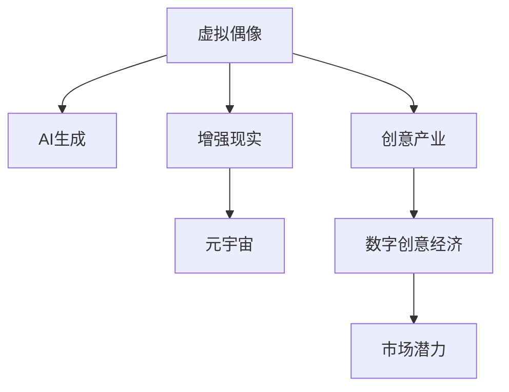

                 

# 2050年的数字创意：从虚拟偶像经济到元宇宙创意产业的数字创意经济

> 关键词：虚拟偶像,元宇宙,数字创意,创意产业,创新技术,数字化经济

## 1. 背景介绍

### 1.1 数字创意经济的崛起

数字创意经济（Digital Creative Economy）是指以数字化技术为支撑，通过创意设计和内容创作，创造新的文化产品和商业模式，实现经济价值的社会活动。随着互联网和人工智能等技术的迅猛发展，数字创意经济逐渐成为全球经济发展的新引擎。

近年来，虚拟偶像和元宇宙的兴起，更是将数字创意经济推向了新的高度。虚拟偶像利用AI技术和虚拟现实(VR)、增强现实(AR)等技术，创造出与真人无异的互动体验；元宇宙则通过数字孪生技术，构建了一个完整的虚拟世界，实现从社交到商业的全方位数字化应用。这些新兴的数字创意形式，不仅丰富了数字创意的实现手段，也开辟了新的商业和社交模式，吸引了越来越多的投资者和创作者加入其中。

### 1.2 数字创意的核心理念

数字创意的核心理念是通过数字化手段，激发和实现人类创造力和想象力的最大化。其核心在于三个方面：

1. **数字化手段**：借助数字技术实现创意的数字化表达，如动画、虚拟现实、游戏等。
2. **创意表达**：通过数字技术手段，将创意具体化和可视化，增强用户体验和互动性。
3. **商业化应用**：将创意产品和服务转化为商业价值，实现经济回报。

### 1.3 数字创意经济的市场潜力

根据国际数据公司的报告，全球数字创意经济市场规模预计将从2020年的1.9万亿美元增长到2025年的3.8万亿美元，年均复合增长率为12.3%。其中，中国数字创意经济市场规模也快速增长，成为全球数字创意经济的重要组成部分。

## 2. 核心概念与联系

### 2.1 核心概念概述

为了更好地理解数字创意经济的发展脉络，本节将介绍几个关键核心概念：

- **虚拟偶像**：利用AI技术，以虚拟形象形式呈现的偶像，可以进行音乐、舞蹈、互动等多种形式的艺术表演。
- **元宇宙**：通过虚拟现实、增强现实和区块链等技术，构建一个虚实融合的数字化空间，实现与现实世界的无缝对接。
- **创意产业**：以创意为核心，涉及内容创作、设计、知识产权保护等多个领域的经济活动。
- **数字创意经济**：以数字化技术为支撑，通过创意设计和内容创作，创造新的文化产品和商业模式，实现经济价值的社会活动。

这些概念之间的逻辑关系可以通过以下Mermaid流程图来展示：



这个流程图展示了大模型微调的逻辑关系：

1. 虚拟偶像利用AI生成技术，结合增强现实等技术，在元宇宙中创造互动体验。
2. 创意产业通过数字创意经济，实现创意的商业化应用。
3. 数字创意经济的市场潜力驱动整个产业链的进一步发展。

## 3. 核心算法原理 & 具体操作步骤
### 3.1 算法原理概述

数字创意经济的核心在于通过数字化手段，激发和实现创意的最大化。其算法原理主要包括以下几个方面：

1. **数据驱动创意**：利用大数据分析，发现新的创意趋势和市场需求。
2. **AI辅助创作**：通过机器学习等AI技术，辅助设计师和创作者进行内容创作。
3. **跨界融合创新**：将不同领域的创意元素进行融合，创造出全新的创意产品。
4. **商业化应用**：将创意产品转化为商业价值，实现经济回报。

### 3.2 算法步骤详解

数字创意经济的算法实施一般包括以下几个关键步骤：

1. **创意采集**：通过大数据分析和用户调研，采集创意素材和市场需求。
2. **AI辅助创作**：利用AI技术，如自然语言处理(NLP)、计算机视觉(CV)、生成对抗网络(GAN)等，辅助创作者进行内容创作。
3. **创意验证**：通过用户反馈和市场测试，验证创意的可行性和市场接受度。
4. **商业化应用**：将创意产品应用于各种场景，实现经济回报。
5. **持续优化**：根据市场反馈和用户需求，不断优化和迭代创意产品。

### 3.3 算法优缺点

数字创意经济的算法具有以下优点：

1. **高效性**：通过AI辅助创作，大幅提升创作效率。
2. **创新性**：跨界融合创新，可以创造出更多独特的创意产品。
3. **灵活性**：市场导向的设计理念，使创意产品更加符合用户需求。

同时，该算法也存在一定的局限性：

1. **创意依赖技术**：技术水平决定了创意的实现程度。
2. **市场风险**：创意产品可能面临市场接受度低的风险。
3. **知识产权问题**：创意产品的知识产权保护是一个复杂问题。

### 3.4 算法应用领域

数字创意经济的算法应用广泛，涵盖文化、娱乐、教育、商业等多个领域，具体包括：

- **虚拟偶像**：利用AI技术，结合VR、AR等技术，创造出与真人无异的虚拟偶像。
- **元宇宙**：通过虚拟现实、增强现实和区块链等技术，构建一个虚实融合的数字化空间。
- **数字艺术**：利用AI生成艺术作品，实现数字与现实的融合。
- **数字教育**：利用虚拟现实和增强现实技术，提升教育体验和效果。
- **数字营销**：通过数字化创意，提升品牌形象和市场竞争力。

## 4. 数学模型和公式 & 详细讲解 & 举例说明

### 4.1 数学模型构建

数字创意经济的算法实现涉及多个领域的数学模型，下面以创意产业中的AI辅助创作为例，构建一个简化的数学模型：

设创意产品的创意度为 $C$，AI辅助创作的效果为 $E$，市场接受度为 $M$，创意产品的商业价值为 $V$。则有：

$$
V = f(C, E, M)
$$

其中 $f$ 为创意产品的价值函数，包含创意度 $C$、AI辅助创作的效果 $E$ 和市场接受度 $M$。

### 4.2 公式推导过程

假设 $C$、$E$ 和 $M$ 之间存在线性关系，即：

$$
C = a + bE + cM
$$

代入 $V$ 的公式中，得：

$$
V = f(a + bE + cM, E, M)
$$

通过对 $V$ 函数进行简化和优化，可以得到以下模型：

$$
V = kC + mE + nM
$$

其中 $k$、$m$ 和 $n$ 为模型的系数，需要通过实际数据进行训练和优化。

### 4.3 案例分析与讲解

以虚拟偶像为例，假设其创意度 $C$ 由AI生成的音乐、舞蹈和互动体验决定，AI辅助创作的效果 $E$ 由音乐和舞蹈的质量决定，市场接受度 $M$ 由观众互动和反馈决定。

1. **AI生成的音乐和舞蹈**：通过音乐生成模型和舞蹈生成模型，输出高质量的音乐和舞蹈片段。
2. **AI辅助创作**：利用AI对生成的音乐和舞蹈进行剪辑和优化，提升整体创作效果。
3. **市场接受度**：通过观众互动和反馈，调整音乐和舞蹈的风格和内容，提升市场接受度。
4. **商业价值**：通过市场测试和推广，将虚拟偶像的创意产品转化为商业价值。

## 5. 项目实践：代码实例和详细解释说明
### 5.1 开发环境搭建

在进行数字创意项目开发前，需要先搭建好开发环境。以下是使用Python进行PyTorch开发的环境配置流程：

1. 安装Anaconda：从官网下载并安装Anaconda，用于创建独立的Python环境。

2. 创建并激活虚拟环境：
```bash
conda create -n pytorch-env python=3.8 
conda activate pytorch-env
```

3. 安装PyTorch：根据CUDA版本，从官网获取对应的安装命令。例如：
```bash
conda install pytorch torchvision torchaudio cudatoolkit=11.1 -c pytorch -c conda-forge
```

4. 安装Transformers库：
```bash
pip install transformers
```

5. 安装各类工具包：
```bash
pip install numpy pandas scikit-learn matplotlib tqdm jupyter notebook ipython
```

完成上述步骤后，即可在`pytorch-env`环境中开始项目实践。

### 5.2 源代码详细实现

这里我们以虚拟偶像项目为例，给出使用Transformers库进行AI辅助创作的PyTorch代码实现。

首先，定义音乐和舞蹈生成模型：

```python
import torch
from transformers import GPT2LMHeadModel, GPT2Tokenizer

tokenizer = GPT2Tokenizer.from_pretrained('gpt2')
model = GPT2LMHeadModel.from_pretrained('gpt2')

def generate_music():
    music = tokenizer.encode("I love music", return_tensors="pt")
    music_logits = model.generate(music, max_length=32)
    return tokenizer.decode(music_logits[0])

def generate_dance():
    dance = tokenizer.encode("I enjoy dancing", return_tensors="pt")
    dance_logits = model.generate(dance, max_length=32)
    return tokenizer.decode(dance_logits[0])
```

然后，定义AI辅助创作的功能：

```python
from transformers import GPT2LMHeadModel, GPT2Tokenizer

tokenizer = GPT2Tokenizer.from_pretrained('gpt2')
model = GPT2LMHeadModel.from_pretrained('gpt2')

def assist_creation():
    input = "I have a new song idea for my virtual idol. I want it to be about"
    generated_output = tokenizer.encode(input, return_tensors="pt")
    generated_output = model.generate(generated_output, max_length=32)
    return tokenizer.decode(generated_output[0])
```

最后，启动AI辅助创作流程并在虚拟偶像项目中应用：

```python
for i in range(5):
    music = generate_music()
    dance = generate_dance()
    creation_assist = assist_creation()
    print(f"Idea for virtual idol {i+1}:\nMusic: {music}\nDance: {dance}\nAssistance: {creation_assist}")
```

以上就是使用PyTorch进行AI辅助创作的完整代码实现。可以看到，通过Transformers库，我们可以用相对简洁的代码完成AI辅助创作的功能，并应用于虚拟偶像项目中。

### 5.3 代码解读与分析

让我们再详细解读一下关键代码的实现细节：

**GPT2LMHeadModel和GPT2Tokenizer类**：
- `GPT2LMHeadModel` 和 `GPT2Tokenizer` 是HuggingFace提供的预训练语言模型和分词器，分别用于生成音乐和舞蹈的文本描述。

**generate_music和generate_dance函数**：
- `generate_music` 和 `generate_dance` 函数分别生成音乐和舞蹈的文本描述，使用 `tokenizer.encode` 将文本转换为模型接受的格式，再通过 `model.generate` 生成文本，最后使用 `tokenizer.decode` 将生成的文本描述转换为可读的文本。

**assist_creation函数**：
- `assist_creation` 函数用于辅助创意创作，将用户输入的文本作为输入，生成创意内容。

**虚拟偶像项目**：
- 整个虚拟偶像项目由三个函数组成，分别生成音乐、舞蹈和辅助创作创意。通过这些函数，可以不断迭代优化创意内容，提升虚拟偶像的互动体验。

可以看到，PyTorch配合Transformers库使得AI辅助创作的代码实现变得简洁高效。开发者可以将更多精力放在创意设计和产品迭代上，而不必过多关注底层的实现细节。

## 6. 实际应用场景

### 6.1 虚拟偶像

虚拟偶像通过AI技术和虚拟现实、增强现实等技术，创造出与真人无异的互动体验。它们可以用于各类娱乐活动，如音乐、舞蹈、互动表演等。

在技术实现上，可以收集大量的音乐、舞蹈素材，通过AI技术进行内容创作和编辑，结合VR、AR技术，生成高质量的虚拟偶像形象。用户可以通过设备与虚拟偶像进行互动，享受全新的娱乐体验。

### 6.2 元宇宙

元宇宙通过虚拟现实、增强现实和区块链等技术，构建一个虚实融合的数字化空间。它不仅是一个虚拟游戏世界，更是可以与现实世界无缝对接的数字经济体系。

在元宇宙中，虚拟偶像可以作为重要的数字资产，进行各类商业和社交活动。用户可以通过虚拟货币进行消费和交易，实现虚拟世界的经济价值。元宇宙平台可以通过虚拟现实设备进行用户接入，提供沉浸式的社交和互动体验。

### 6.3 数字艺术

数字艺术结合AI技术和计算机视觉技术，创造出全新的艺术作品。数字艺术家可以通过编程创作，实现复杂的艺术效果，突破传统艺术创作的限制。

在技术实现上，可以使用GAN等生成对抗网络模型，结合NLP技术，自动生成艺术作品。艺术家可以通过调整输入参数，生成不同风格和主题的艺术作品，提升创作的效率和多样性。

### 6.4 数字教育

数字教育结合虚拟现实和增强现实技术，提升教育体验和效果。学生可以通过虚拟现实设备，进入虚拟课堂进行互动学习。

在技术实现上，可以构建虚拟课堂系统，使用AI技术自动生成教学内容。学生可以通过虚拟现实设备，进行虚拟实验、互动讨论等，提升学习效果。

## 7. 工具和资源推荐
### 7.1 学习资源推荐

为了帮助开发者系统掌握数字创意经济的理论基础和实践技巧，这里推荐一些优质的学习资源：

1. **《深度学习与创意产业》系列博文**：由大模型技术专家撰写，深入浅出地介绍了深度学习在创意产业中的应用，涵盖虚拟偶像、元宇宙、数字艺术等多个领域。

2. **《数字创意经济导论》课程**：斯坦福大学开设的创意经济导论课程，有Lecture视频和配套作业，带你入门数字创意经济的基本概念和经典模型。

3. **《数字创意经济手册》书籍**：详细介绍了数字创意经济的现状、趋势和未来，涵盖虚拟偶像、元宇宙、数字艺术等多个领域。

4. **HuggingFace官方文档**：Transformers库的官方文档，提供了海量预训练模型和完整的创意产品开发样例代码，是上手实践的必备资料。

5. **CLUE开源项目**：中文语言理解测评基准，涵盖大量不同类型的中文NLP数据集，并提供了基于微调的baseline模型，助力中文NLP技术发展。

通过对这些资源的学习实践，相信你一定能够快速掌握数字创意经济的精髓，并用于解决实际的NLP问题。

### 7.2 开发工具推荐

高效的开发离不开优秀的工具支持。以下是几款用于数字创意经济开发的常用工具：

1. **PyTorch**：基于Python的开源深度学习框架，灵活动态的计算图，适合快速迭代研究。大部分预训练语言模型都有PyTorch版本的实现。

2. **TensorFlow**：由Google主导开发的开源深度学习框架，生产部署方便，适合大规模工程应用。同样有丰富的预训练语言模型资源。

3. **Transformers库**：HuggingFace开发的NLP工具库，集成了众多SOTA语言模型，支持PyTorch和TensorFlow，是进行创意产品开发的利器。

4. **Weights & Biases**：模型训练的实验跟踪工具，可以记录和可视化模型训练过程中的各项指标，方便对比和调优。与主流深度学习框架无缝集成。

5. **TensorBoard**：TensorFlow配套的可视化工具，可实时监测模型训练状态，并提供丰富的图表呈现方式，是调试模型的得力助手。

6. **Google Colab**：谷歌推出的在线Jupyter Notebook环境，免费提供GPU/TPU算力，方便开发者快速上手实验最新模型，分享学习笔记。

合理利用这些工具，可以显著提升数字创意经济项目的开发效率，加快创新迭代的步伐。

### 7.3 相关论文推荐

数字创意经济的快速发展源于学界的持续研究。以下是几篇奠基性的相关论文，推荐阅读：

1. **《数字创意经济的崛起与未来》论文**：系统地分析了数字创意经济的现状、趋势和未来发展方向，提供了丰富的理论支撑和实践指导。

2. **《虚拟偶像在音乐、舞蹈、社交中的应用》论文**：展示了虚拟偶像在不同领域的应用场景，讨论了虚拟偶像技术在创意产业中的重要性和前景。

3. **《元宇宙经济模型》论文**：研究了元宇宙的经济模型和商业模式，探讨了元宇宙对数字经济的深远影响。

4. **《数字艺术创作与版权保护》论文**：探讨了数字艺术创作的技术和版权保护问题，为数字艺术的商业化提供了理论基础和实践建议。

5. **《数字教育与虚拟现实》论文**：研究了虚拟现实技术在教育中的应用，提出了数字教育的未来发展方向和具体实施方案。

这些论文代表了大模型微调技术的发展脉络。通过学习这些前沿成果，可以帮助研究者把握学科前进方向，激发更多的创新灵感。

## 8. 总结：未来发展趋势与挑战

### 8.1 总结

本文对数字创意经济的发展脉络进行了全面系统的介绍。首先阐述了数字创意经济的崛起背景和核心理念，明确了虚拟偶像、元宇宙、数字艺术等新兴形式的创意经济价值。其次，从原理到实践，详细讲解了数字创意经济的算法实现，包括创意采集、AI辅助创作、创意验证和商业化应用等多个环节，给出了完整的代码实例。同时，本文还广泛探讨了数字创意经济在虚拟偶像、元宇宙、数字艺术等多个领域的应用前景，展示了数字创意经济的广阔前景。最后，本文精选了数字创意经济的各类学习资源，力求为读者提供全方位的技术指引。

通过本文的系统梳理，可以看到，数字创意经济通过数字化手段，激发了人类创意的最大化，正在深刻改变人类的生活和工作方式。未来，伴随技术水平的不断提升，数字创意经济将迎来更广阔的发展空间，成为全球经济的重要组成部分。

### 8.2 未来发展趋势

展望未来，数字创意经济将呈现以下几个发展趋势：

1. **技术融合创新**：未来的创意经济将更加注重技术的融合创新，如虚拟现实、增强现实、区块链等技术的深度结合，创造出更多沉浸式的体验和互动方式。

2. **多领域协同发展**：数字创意经济将突破传统产业的边界，与文化、娱乐、教育、商业等多个领域深度融合，形成更为广泛的应用场景。

3. **全球化与本地化并重**：数字创意经济将同时追求全球化和本地化，通过全球化技术和本地化内容结合，打造更具多样性和包容性的创意产品。

4. **可持续发展**：数字创意经济将更加注重可持续发展，通过技术创新和内容创作，实现经济价值与社会责任的平衡。

5. **伦理道德约束**：数字创意经济将更加注重伦理道德的约束，通过数据隐私保护、内容审查等措施，确保创意产品的健康发展。

6. **人工智能辅助创作**：AI技术将进一步应用于创意创作，提升创作效率和创新性，如自动生成音乐、舞蹈、文本等内容。

以上趋势凸显了数字创意经济的广阔前景。这些方向的探索发展，必将进一步推动数字创意经济的发展，为人类社会带来深远影响。

### 8.3 面临的挑战

尽管数字创意经济已经取得了瞩目成就，但在迈向更加智能化、普适化应用的过程中，它仍面临着诸多挑战：

1. **技术瓶颈**：数字创意经济依赖于各种复杂技术，技术水平的提升需要不断投入和创新。

2. **知识产权问题**：创意产品的版权保护和商业化应用，是一个复杂且敏感的问题，需要多方协调和规范。

3. **市场风险**：创意产品可能面临市场接受度低的风险，需要有合理的市场策略和推广方案。

4. **伦理道德问题**：数字创意经济中的虚拟偶像、元宇宙等形式，可能涉及伦理道德问题，需要规范和监管。

5. **用户隐私保护**：创意产品的开发和使用，需要严格保护用户隐私，防止数据泄露和滥用。

6. **技术安全**：数字创意经济中的各类技术应用，需要考虑技术安全问题，防止黑客攻击和数据篡改。

这些挑战凸显了数字创意经济在发展过程中需要面对的复杂问题。唯有在技术、伦理、法律等各个方面进行全面优化和规范，才能确保数字创意经济的健康发展。

### 8.4 研究展望

面对数字创意经济所面临的种种挑战，未来的研究需要在以下几个方面寻求新的突破：

1. **技术优化**：通过技术创新，提升创意产品的质量和效率，如自动生成音乐、舞蹈、文本等内容。

2. **伦理道德规范**：制定并规范数字创意经济中的伦理道德标准，确保创意产品符合人类价值观和伦理道德。

3. **知识产权保护**：探索新的知识产权保护机制，如区块链技术的应用，确保创意产品的合法权益。

4. **市场策略优化**：研究创意产品的市场策略和推广方案，提升市场接受度和影响力。

5. **用户隐私保护**：制定并落实用户隐私保护措施，确保用户数据的安全和隐私。

6. **技术安全防护**：研究技术安全防护手段，防止黑客攻击和数据篡改，保障系统的稳定运行。

这些研究方向的探索，必将引领数字创意经济走向更加成熟和规范的发展阶段，为人类社会带来更丰富的文化和经济价值。

## 9. 附录：常见问题与解答

**Q1：数字创意经济的核心是什么？**

A: 数字创意经济的核心在于通过数字化手段，激发和实现创意的最大化。其核心理念是数字化手段、创意表达和商业化应用。

**Q2：数字创意经济与传统创意经济的区别是什么？**

A: 数字创意经济与传统创意经济的主要区别在于数字化手段的广泛应用。数字创意经济通过数字化技术，提升创意的实现效率和创新性，拓展创意产品的应用场景。

**Q3：数字创意经济的未来发展方向是什么？**

A: 数字创意经济的未来发展方向主要包括以下几个方面：技术融合创新、多领域协同发展、全球化与本地化并重、可持续发展、伦理道德约束、人工智能辅助创作等。

**Q4：数字创意经济面临的主要挑战是什么？**

A: 数字创意经济面临的主要挑战包括技术瓶颈、知识产权问题、市场风险、伦理道德问题、用户隐私保护、技术安全问题等。

**Q5：数字创意经济对社会有何影响？**

A: 数字创意经济通过数字化手段，激发了人类创意的最大化，正在深刻改变人类的生活和工作方式。它不仅丰富了文化产品，还促进了经济的发展，为全球社会带来新的经济价值。

---

作者：禅与计算机程序设计艺术 / Zen and the Art of Computer Programming

