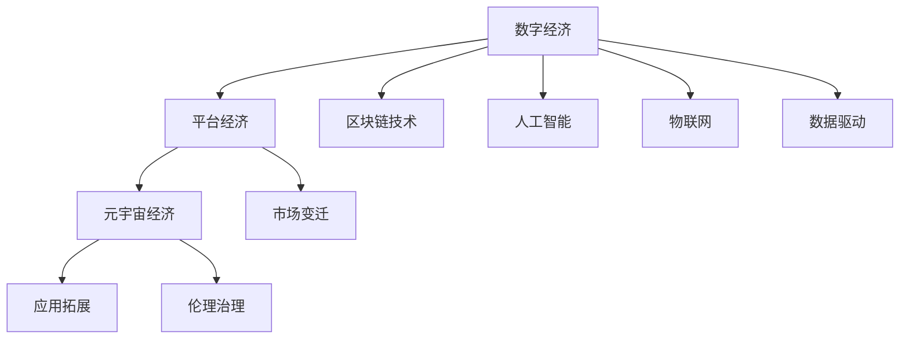

                 

# 2050年的数字经济：从平台经济到元宇宙经济的数字经济形态演进

## 1. 背景介绍

### 1.1 问题由来

数字经济是人类社会在信息化发展过程中，以信息技术的广泛应用为支撑，以数据为关键生产要素，以信息网络为重要载体，以信息技术和实体经济深度融合为特征的新型经济形态。自20世纪末互联网普及以来，数字经济已经成为全球经济发展的新引擎，对全球经济增长、产业结构转型、就业结构调整、社会治理模式变革等方面产生了深远影响。

近年来，随着物联网、大数据、人工智能、区块链等新兴技术的快速发展，数字经济进入了一个新的阶段。从平台经济到元宇宙经济，数字经济正在发生深刻变革。平台经济以互联网为基础设施，通过聚合海量资源，提供服务匹配、数据交换等平台服务，优化资源配置，降低交易成本。但随着移动互联网的普及，用户红利逐渐消退，平台垄断问题凸显，市场监管压力增大。与此同时，元宇宙经济以虚拟现实、增强现实、分布式账本等技术为支撑，构建了基于数字孪生、虚拟身份、数字资产的全新经济体系，为数字经济带来了新的发展方向。

本文将围绕数字经济的演变趋势，探讨从平台经济到元宇宙经济的数字经济形态演进，以及这一演变过程中出现的新模式、新业态、新挑战。

### 1.2 问题核心关键点

数字经济形态演进的几个关键点包括：

- **数据驱动**：数据作为数字经济的“新石油”，其收集、存储、分析、应用等方面技术进步，对数字经济形态发展起到至关重要的作用。
- **技术融合**：互联网、物联网、人工智能、区块链等技术的深度融合，推动了数字经济形态的多样化发展。
- **市场变迁**：从平台经济到元宇宙经济，市场形态的变化反映了数字经济由集中式向分布式，由中心化向去中心化的演变过程。
- **应用拓展**：数字经济的应用范围从电子商务、社交网络等传统领域拓展到智能制造、智慧城市、精准医疗等新兴领域。
- **伦理治理**：数据隐私、用户安全、算法偏见等伦理问题，成为数字经济发展的重要考量因素。

## 2. 核心概念与联系

### 2.1 核心概念概述

为更好地理解数字经济形态的演进，本节将介绍几个密切相关的核心概念：

- **数字经济**：基于信息技术的经济形态，以数据为核心生产要素，以互联网为基础设施，实现资源的高效配置和价值的数字化创造。
- **平台经济**：以互联网为基础设施，通过聚合海量资源，提供服务匹配、数据交换等平台服务，优化资源配置，降低交易成本。
- **元宇宙经济**：基于虚拟现实、增强现实、分布式账本等技术，构建的基于数字孪生、虚拟身份、数字资产的全新经济体系。
- **区块链技术**：一种基于分布式账本、去中心化的技术，通过共识机制和智能合约，实现数据安全和信任机制。
- **人工智能**：包括机器学习、深度学习、自然语言处理等技术，通过算法和大数据，实现智能决策和自动化。
- **物联网**：通过信息传感设备，将物理世界和虚拟网络连接起来，实现物与物、物与人的智能互联。

这些核心概念之间的逻辑关系可以通过以下Mermaid流程图来展示：



这个流程图展示了大语言模型的核心概念及其之间的关系：

1. 数字经济通过互联网、物联网、区块链、人工智能等技术，实现数据驱动、高效配置资源。
2. 平台经济依托数字基础设施，提供服务匹配、数据交换等平台服务，优化资源配置，降低交易成本。
3. 元宇宙经济在虚拟现实、增强现实等技术的支持下，构建全新的经济体系。
4. 区块链技术提供分布式账本、去中心化的信任机制，支持数据安全和透明。
5. 人工智能通过算法和大数据，实现智能决策和自动化。
6. 物联网实现物与物的智能互联，推动数字化转型。

这些概念共同构成了数字经济的发展框架，揭示了从平台经济到元宇宙经济的演变路径。

## 3. 核心算法原理 & 具体操作步骤

### 3.1 算法原理概述

数字经济的形态演进，本质上是技术进步驱动下的经济结构调整和商业模式创新。其核心算法原理包括：

- **分布式账本**：区块链技术的核心算法，通过分布式网络记录和验证交易，实现去中心化的信任机制。
- **智能合约**：基于区块链的代码合约，通过代码实现合约的自动执行和验证，降低信任成本。
- **数据挖掘**：通过机器学习和大数据技术，从海量数据中提取有价值的信息，支持决策和预测。
- **自然语言处理**：利用人工智能技术，实现人机交互的自然语言理解和生成。
- **推荐算法**：通过算法模型，实现个性化推荐，提高用户体验和满意度。
- **协同过滤**：通过用户行为数据，实现基于用户群体相似性的推荐，提高推荐准确率。

这些算法原理通过不同技术手段，推动数字经济形态的演进，从平台经济向元宇宙经济迈进。

### 3.2 算法步骤详解

数字经济形态演进的过程，大致可以分为以下几个关键步骤：

**Step 1: 数据收集与处理**
- 收集海量数据，包括用户行为数据、交易数据、物联网数据等。
- 通过数据清洗、去重、标准化等处理，形成可用于分析和建模的数据集。

**Step 2: 数据存储与管理**
- 利用分布式存储技术，如Hadoop、Spark等，构建大规模数据仓库。
- 通过数据分片、索引等技术，提高数据访问效率。

**Step 3: 算法模型训练与优化**
- 选择适合的算法模型，如决策树、神经网络、深度学习等。
- 利用分布式计算框架，如TensorFlow、PyTorch等，进行模型训练和优化。

**Step 4: 算法应用与迭代**
- 将训练好的模型部署到生产环境，实现服务化封装和接口调用。
- 通过用户反馈和市场变化，持续优化和迭代算法模型。

### 3.3 算法优缺点

数字经济形态演进中的核心算法具有以下优点：

- **高效性**：通过算法优化，实现数据高效存储、传输和处理，提升资源利用效率。
- **灵活性**：算法模型的灵活迭代，能够适应市场变化和用户需求，提高服务响应速度。
- **可靠性**：通过分布式技术和智能合约，实现数据安全和信任机制，增强系统可靠性。

但同时，也存在以下缺点：

- **复杂性**：算法模型的复杂度较高，对数据质量和计算资源要求较高。
- **隐私风险**：大规模数据处理和分析，存在隐私泄露和数据滥用的风险。
- **道德风险**：算法偏见、算法透明性等问题，可能导致不公平和不公正。

### 3.4 算法应用领域

数字经济形态演进的算法原理在多个领域得到了广泛应用，例如：

- **金融科技**：通过区块链、智能合约、数据挖掘等技术，实现支付清算、金融交易、资产管理等功能。
- **智能制造**：利用物联网、人工智能、协同过滤等技术，实现生产过程的自动化和智能化。
- **智慧城市**：通过物联网、人工智能、自然语言处理等技术，实现城市管理、公共服务、安全保障等功能。
- **精准医疗**：利用人工智能、数据挖掘等技术，实现疾病预测、个性化治疗等功能。
- **电子商务**：通过推荐算法、自然语言处理等技术，实现个性化推荐、智能客服等功能。
- **物流与供应链**：利用物联网、人工智能等技术，实现物流跟踪、库存管理、供应链优化等功能。

这些应用领域展示了算法原理在数字经济形态演进中的广泛应用，推动了各个行业的数字化转型。

## 4. 数学模型和公式 & 详细讲解 & 举例说明（备注：数学公式请使用latex格式，latex嵌入文中独立段落使用 $$，段落内使用 $)
### 4.1 数学模型构建

本节将使用数学语言对数字经济形态演进中的算法原理进行更加严格的刻画。

假设数字经济系统中的交易数据为 $D=\{(t_i,s_i,g_i)\}_{i=1}^N$，其中 $t_i$ 为时间戳，$s_i$ 为交易金额，$g_i$ 为交易类型（买、卖）。设数字经济系统的总金额为 $S$，则总交易次数 $N$ 和总交易金额 $S$ 分别为：

$$
N = \sum_{i=1}^N g_i
$$

$$
S = \sum_{i=1}^N s_i
$$

设数字经济系统的总价值 $V$ 为：

$$
V = \sum_{i=1}^N s_i * t_i
$$

数字经济系统的价值增长率 $r$ 为：

$$
r = \frac{V_{t+1} - V_t}{V_t}
$$

其中 $V_t$ 为第 $t$ 时刻的价值。

在数字经济系统中，通过区块链技术实现去中心化的交易记录，通过智能合约自动执行交易，通过数据挖掘技术进行交易行为分析，通过人工智能技术实现智能决策和自动化。这些算法原理使得数字经济系统能够高效、灵活、可靠地运行。

### 4.2 公式推导过程

以下我们以智能合约为例，推导智能合约的执行流程及其数学模型。

设智能合约 A 与 B 进行交易，合同内容为 A 向 B 支付一定金额，交易条件为：

- 时间条件：$T$ 时刻之前支付完成。
- 金额条件：支付金额 $x$ 大于等于 $y$。

智能合约的执行流程如下：

1. 记录 A 和 B 的交易信息，包括时间戳、金额、交易类型等。
2. 如果交易条件满足，则执行支付操作，更新 A 和 B 的余额。
3. 如果交易条件不满足，则拒绝执行支付操作。

假设 A 和 B 的余额分别为 $a$ 和 $b$，则支付操作可以表示为：

$$
a' = a - x
$$

$$
b' = b + x
$$

其中 $a'$ 和 $b'$ 为支付后 A 和 B 的余额。

通过区块链技术的分布式账本和智能合约的自动执行，实现了去中心化的信任机制和自动化的合约执行，极大地降低了交易成本和风险，推动了数字经济的发展。

### 4.3 案例分析与讲解

智能合约在数字经济中的应用案例如下：

**案例1：去中心化金融（DeFi）**
- 数字货币交易所：通过智能合约实现自动交易和资金管理，降低交易费用，提高交易效率。
- 去中心化借贷：通过智能合约实现借贷协议，自动计算利息和还款时间，降低信任成本。

**案例2：供应链金融**
- 供应链融资：通过智能合约实现供应链各方的资金和物流管理，降低融资成本，提高融资效率。
- 供应链追踪：通过区块链技术实现供应链各环节的透明记录和数据共享，提高供应链管理效率。

这些案例展示了智能合约在数字经济中的应用，通过去中心化和自动化的技术手段，提高了交易的透明度和效率，推动了数字经济的快速发展。

## 5. 项目实践：代码实例和详细解释说明
### 5.1 开发环境搭建

在进行数字经济形态演进的项目实践前，我们需要准备好开发环境。以下是使用Python进行区块链开发的环境配置流程：

1. 安装Anaconda：从官网下载并安装Anaconda，用于创建独立的Python环境。

2. 创建并激活虚拟环境：
```bash
conda create -n blockchain-env python=3.8 
conda activate blockchain-env
```

3. 安装必要的区块链开发库：
```bash
conda install ethereum-py python-quorum
```

4. 安装各类工具包：
```bash
pip install numpy pandas scikit-learn matplotlib tqdm jupyter notebook ipython
```

完成上述步骤后，即可在`blockchain-env`环境中开始区块链项目的开发实践。

### 5.2 源代码详细实现

下面我们以智能合约为例，给出使用Python和ethereum-py库对智能合约进行开发和测试的代码实现。

首先，定义智能合约的代码：

```python
from ethereumpy.contracts import Contract

class SmartContract(Contract):
    def __init__(self, address):
        super().__init__(address)
        
    def pay(self, amount, receiver):
        self.balance = self.balance - amount
        receiver.balance = receiver.balance + amount
        self.emit("Payment", self.balance, receiver.balance)
```

然后，部署智能合约并进行测试：

```python
from ethereumpy.transactions import Transaction
from ethereumpy.transaction import build_transaction
from ethereumpy.accounts import generate_keypair
from ethereumpy.blockchain import create_new_chain

# 创建区块链
chain = create_new_chain()

# 生成密钥对
keypair = generate_keypair()

# 创建智能合约
contract_address = SmartContract.create(keypair.private_key, chain)
contract = SmartContract(contract_address)

# 发起支付操作
tx = build_transaction(
    chain.head.block_hash, 
    keypair.private_key, 
    contract_address, 
    "pay",
    amount=10, 
    receiver="0x1234567890abcdef"
)
chain.head.block.add_transaction(tx)

# 验证支付结果
print("Balance of Contract:", contract.balance)
print("Balance of Receiver:", contract.receiver.balance)
```

以上就是使用Python和ethereum-py库对智能合约进行开发和测试的完整代码实现。可以看到，通过智能合约的自动执行和数据透明，实现了去中心化的信任机制和自动化的合约执行。

### 5.3 代码解读与分析

让我们再详细解读一下关键代码的实现细节：

**SmartContract类**：
- `__init__`方法：初始化智能合约，继承自Contract类。
- `pay`方法：实现支付操作，更新双方余额并记录支付事件。

**交易操作**：
- 通过`build_transaction`函数，构建交易请求。
- 通过`create_new_chain`函数，创建新的区块链实例。
- 通过`generate_keypair`函数，生成密钥对，用于签名交易。

**智能合约部署与测试**：
- 通过`create`方法，部署智能合约。
- 通过`address`属性，获取智能合约的地址。
- 通过`pay`方法，发起支付操作，并验证结果。

以上代码展示了智能合约在区块链上的部署和测试过程，通过智能合约的自动执行和数据透明，实现了去中心化的信任机制和自动化的合约执行。

## 6. 实际应用场景
### 6.1 智能制造

智能制造通过物联网、人工智能、区块链等技术，实现生产过程的自动化和智能化。数字经济形态演进中的算法原理，为智能制造提供了强大的技术支持。

具体而言，可以收集生产过程中的设备状态、能耗数据、质量检测数据等，通过数据挖掘和算法优化，实现预测性维护、供应链优化、智能调度等功能。智能合约还可以用于自动化结算和支付，降低交易成本和风险，提高生产效率和灵活性。

### 6.2 智慧城市

智慧城市通过物联网、人工智能、区块链等技术，实现城市管理、公共服务、安全保障等功能。数字经济形态演进中的算法原理，为智慧城市提供了全面的技术支撑。

具体而言，可以通过智能传感器、视频监控等设备，收集城市环境、交通、能源等数据，通过数据挖掘和算法优化，实现城市交通优化、能源管理、环境监测等功能。智能合约还可以用于自动支付城市服务费、管理公共资源，提高城市治理的透明度和效率。

### 6.3 精准医疗

精准医疗通过人工智能、数据挖掘等技术，实现疾病预测、个性化治疗等功能。数字经济形态演进中的算法原理，为精准医疗提供了强大的技术支持。

具体而言，可以收集患者的基因数据、电子病历、生理数据等，通过数据挖掘和算法优化，实现疾病预测、药物推荐、个性化治疗等功能。智能合约还可以用于自动支付医疗费用、管理医疗资源，提高医疗服务的效率和公平性。

### 6.4 未来应用展望

随着数字经济形态的演进，未来的应用场景将更加多样化，涉及更多的新兴技术和领域，如物联网、区块链、人工智能、元宇宙等。

- **物联网**：通过物联网技术，实现物与物的智能互联，推动智能制造、智慧城市、精准医疗等领域的数字化转型。
- **区块链**：通过区块链技术，实现去中心化的信任机制和自动化的合约执行，提高交易的透明度和效率。
- **人工智能**：通过人工智能技术，实现智能决策和自动化，推动智能客服、智能推荐、智能调度等功能。
- **元宇宙**：通过虚拟现实、增强现实等技术，构建基于数字孪生、虚拟身份、数字资产的全新经济体系，推动数字经济的新发展。

未来数字经济的发展将更加注重技术融合和创新应用，推动各个领域的数字化转型和智能化升级。

## 7. 工具和资源推荐
### 7.1 学习资源推荐

为了帮助开发者系统掌握数字经济形态演进的算法原理和应用实践，这里推荐一些优质的学习资源：

1. 《分布式账本技术》系列博文：由区块链技术专家撰写，深入浅出地介绍了区块链技术原理和应用场景。

2. 《智能合约编程》课程：斯坦福大学开设的区块链明星课程，涵盖智能合约的编写和测试，帮助初学者快速上手。

3. 《人工智能基础》书籍：深入浅出地介绍了人工智能的基本概念和算法原理，适合初学者入门。

4. 《大数据技术与应用》课程：北京大学开设的大数据明星课程，涵盖数据采集、存储、处理等全栈技术，帮助开发者全面掌握大数据应用。

5. 《物联网技术与应用》书籍：详细介绍物联网技术的基本原理和应用场景，适合开发者深入学习。

通过对这些资源的学习实践，相信你一定能够快速掌握数字经济形态演进的算法原理，并用于解决实际的业务问题。

### 7.2 开发工具推荐

高效的开发离不开优秀的工具支持。以下是几款用于区块链开发和数字经济形态演进开发的常用工具：

1. Anaconda：用于创建和管理Python环境，方便快速切换和部署项目。

2. ethereumpy：Python区块链开发库，提供智能合约、交易、账户等核心功能，方便开发者快速构建区块链应用。

3. TensorFlow：开源深度学习框架，提供高效的机器学习和深度学习功能，支持大数据和人工智能应用。

4. PyTorch：开源深度学习框架，提供灵活的计算图和动态图功能，支持自然语言处理和推荐算法等应用。

5. Hadoop和Spark：分布式计算框架，提供大规模数据处理和分析功能，支持物联网和大数据应用。

6. Jupyter Notebook：交互式编程环境，支持多种编程语言和数据处理工具，方便开发者快速开发和测试。

合理利用这些工具，可以显著提升数字经济形态演进项目的开发效率，加快创新迭代的步伐。

### 7.3 相关论文推荐

数字经济形态演进的研究源于学界的持续研究。以下是几篇奠基性的相关论文，推荐阅读：

1. "Blockchain: Concepts, Protocols, and Future Directions" by Dr. Nielsen
2. "Blockchain: The New Digital Fabric" by Don Tapscott and Alex Tapscott
3. "The Evolution of Artificial Intelligence" by Yann LeCun, Yoshua Bengio, and Geoffrey Hinton
4. "IoT in Healthcare: An Overview" by Dr. Chen and Dr. Lin
5. "Artificial Intelligence in Finance: Opportunities and Challenges" by Dr. Tikkinen

这些论文代表了大语言模型微调技术的发展脉络。通过学习这些前沿成果，可以帮助研究者把握学科前进方向，激发更多的创新灵感。

## 8. 总结：未来发展趋势与挑战

### 8.1 总结

本文对数字经济形态演进的算法原理进行了全面系统的介绍。首先阐述了数字经济由平台经济向元宇宙经济演变的背景和趋势，明确了数字经济形态演进的核心算法原理和应用实践。其次，从原理到实践，详细讲解了智能合约、数据挖掘、区块链等算法原理及其应用，给出了区块链项目的完整代码实例。同时，本文还广泛探讨了智能制造、智慧城市、精准医疗等实际应用场景，展示了数字经济形态演进的技术潜力。

通过本文的系统梳理，可以看到，数字经济形态演进从平台经济到元宇宙经济的转变，是技术进步和市场变迁共同驱动的结果。这一转变揭示了数字经济从集中式向分布式，从中心化向去中心化的发展方向，推动了各个行业的数字化转型和智能化升级。未来，伴随技术的不断进步，数字经济形态将更加多样化和智能化，带来更多的创新应用和商业机会。

### 8.2 未来发展趋势

展望未来，数字经济形态演进将呈现以下几个发展趋势：

1. **技术融合深化**：物联网、人工智能、区块链等技术将进一步融合，实现跨领域的应用创新，推动数字经济形态的多样化发展。

2. **数据驱动增强**：数据作为数字经济的核心生产要素，其收集、存储、分析、应用等方面技术进步，将进一步推动数字经济的增长和创新。

3. **市场结构优化**：平台经济向去中心化、去中介化方向演进，元宇宙经济将打破物理世界的限制，实现虚拟与现实的深度融合，提供新的商业机会和用户体验。

4. **应用场景拓展**：数字经济的应用场景将进一步拓展，涉及更多的新兴技术和领域，如智能制造、智慧城市、精准医疗等，推动各行各业的数字化转型。

5. **伦理治理加强**：数据隐私、用户安全、算法偏见等伦理问题将受到更多关注，数字经济的发展将更加注重公平、透明和可控。

以上趋势凸显了数字经济形态演进的广阔前景，这些方向的探索发展，必将进一步提升数字经济的性能和应用范围，为社会经济发展带来新的动力。

### 8.3 面临的挑战

尽管数字经济形态演进已经取得了显著成果，但在迈向更加智能化、普适化应用的过程中，仍面临诸多挑战：

1. **技术瓶颈**：区块链、人工智能等技术的复杂性和高成本，成为制约数字经济发展的瓶颈。需要进一步优化算法和工具，降低技术门槛和成本。

2. **数据隐私**：大规模数据处理和分析，存在隐私泄露和数据滥用的风险。需要加强数据隐私保护，确保数据安全和合规使用。

3. **伦理治理**：数据隐私、用户安全、算法偏见等问题，可能导致不公平和不公正。需要构建伦理治理机制，确保数字经济的公平、透明和可控。

4. **市场监管**：平台经济垄断、市场失衡等问题，需要加强市场监管，保障市场公平竞争和消费者权益。

5. **技术演进**：新技术的快速演进，可能导致现有系统的技术过时和市场淘汰。需要持续跟踪技术发展，及时升级和优化系统。

6. **跨界合作**：数字经济的发展需要跨行业、跨领域的合作，协同推进。需要建立跨界合作机制，实现资源共享和协同创新。

这些挑战凸显了数字经济形态演进中的复杂性和不确定性，需要各方共同努力，积极应对并寻求突破。

### 8.4 研究展望

面对数字经济形态演进中的各种挑战，未来的研究需要在以下几个方面寻求新的突破：

1. **技术创新**：进一步优化算法和工具，降低技术门槛和成本，推动数字经济的普及和应用。

2. **伦理治理**：加强数据隐私保护，构建伦理治理机制，确保数字经济的公平、透明和可控。

3. **跨界合作**：建立跨行业、跨领域的合作机制，实现资源共享和协同创新，推动数字经济的发展。

4. **技术演进跟踪**：持续跟踪新技术的发展，及时升级和优化系统，保持数字经济的领先地位。

这些研究方向的探索，必将引领数字经济形态演进技术的发展，推动数字经济的发展和应用，为社会经济发展带来新的动力。

## 9. 附录：常见问题与解答

**Q1：数字经济形态演进中的核心算法原理是什么？**

A: 数字经济形态演进中的核心算法原理包括分布式账本、智能合约、数据挖掘、自然语言处理、推荐算法、协同过滤等。这些算法原理通过不同技术手段，推动数字经济形态的演进，从平台经济向元宇宙经济迈进。

**Q2：数字经济形态演进中如何处理数据隐私问题？**

A: 处理数据隐私问题，需要采取数据匿名化、数据脱敏、数据加密等技术手段。同时，构建数据隐私保护机制，确保数据的合法使用和合规处理。

**Q3：数字经济形态演进中的区块链技术面临哪些挑战？**

A: 区块链技术面临技术瓶颈、性能瓶颈、扩展性瓶颈等问题。需要通过共识机制优化、分片技术、跨链技术等手段，提高区块链的性能和扩展性。

**Q4：数字经济形态演进中如何实现智能制造？**

A: 实现智能制造，需要采集设备状态、能耗数据、质量检测数据等，通过数据挖掘和算法优化，实现预测性维护、供应链优化、智能调度等功能。

**Q5：数字经济形态演进中如何实现智慧城市？**

A: 实现智慧城市，需要采集城市环境、交通、能源等数据，通过数据挖掘和算法优化，实现城市交通优化、能源管理、环境监测等功能。

通过本文的系统梳理，可以看到，数字经济形态演进从平台经济到元宇宙经济的转变，是技术进步和市场变迁共同驱动的结果。这一转变揭示了数字经济从集中式向分布式，从中心化向去中心化的发展方向，推动了各个行业的数字化转型和智能化升级。未来，伴随技术的不断进步，数字经济形态将更加多样化和智能化，带来更多的创新应用和商业机会。

---

作者：禅与计算机程序设计艺术 / Zen and the Art of Computer Programming

