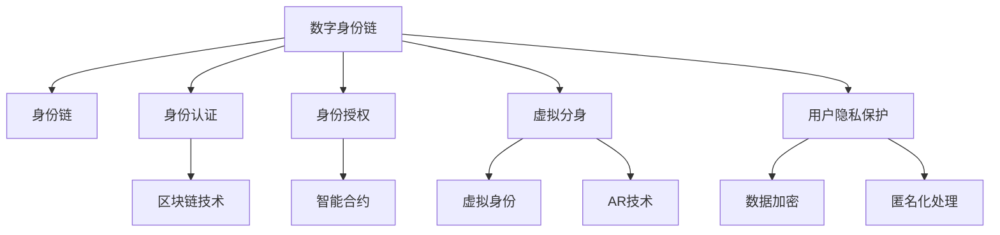

                 

# 2050年的数字身份：从数字身份链到虚拟分身的身份数字化

## 1. 背景介绍

在未来的数字社会中，数字身份将成为人类生活的重要组成部分。一个集成了身份验证、授权管理、数据存储等功能的全面数字身份系统，将成为连接现实世界与虚拟世界的关键桥梁。随着人工智能、区块链、虚拟现实等技术的不断成熟，未来的数字身份将具备更高的安全性、可控性和灵活性。本文将探讨2050年的数字身份系统，从数字身份链到虚拟分身的身份数字化，全面剖析未来的数字身份生态。

## 2. 核心概念与联系

### 2.1 核心概念概述

在构建未来的数字身份系统时，我们需要理解以下几个关键概念：

- **数字身份**：以数字化形式存在的身份，包括个人身份、组织身份等，用于身份验证、授权管理等场景。
- **身份链**：一种基于区块链技术的身份管理系统，可以实现身份信息的不可篡改、可追溯和去中心化管理。
- **虚拟分身**：利用人工智能、增强现实(AR)等技术，创建与真实身份相匹配的虚拟形象，用于虚拟世界中的人机交互和身份验证。

这些概念相互关联，共同构成了未来的数字身份生态。通过数字身份链，我们可以实现身份信息的高度安全性和可控性；通过虚拟分身，我们可以在虚拟世界中模拟真实身份，进行更加丰富和高效的人机交互。

### 2.2 核心概念原理和架构的 Mermaid 流程图



该流程图展示了数字身份链与虚拟分身之间的技术联系。数字身份链通过区块链技术实现身份信息的不可篡改和去中心化管理，并利用智能合约进行身份认证和授权管理。虚拟分身利用增强现实技术创建与真实身份相匹配的虚拟形象，并在虚拟身份和现实身份之间建立映射关系，从而实现高效的人机交互。同时，用户隐私保护技术如数据加密、匿名化处理等，确保了身份信息的安全性和匿名性。

## 3. 核心算法原理 & 具体操作步骤

### 3.1 算法原理概述

未来的数字身份系统将基于分布式账本技术构建，主要利用区块链技术实现身份信息的不可篡改和去中心化管理。数字身份链通过智能合约实现身份认证和授权管理，确保身份信息的透明性和安全性。同时，虚拟分身技术利用人工智能和增强现实技术，创建与真实身份相匹配的虚拟形象，用于虚拟世界中的人机交互。

### 3.2 算法步骤详解

1. **身份注册与认证**：用户通过数字身份链进行身份注册，并利用智能合约完成身份认证。智能合约通过预设的规则对身份信息进行验证，确保身份的真实性和一致性。

2. **身份授权与访问控制**：在身份认证通过后，智能合约根据预定义的权限规则进行身份授权，并限制对敏感信息的访问。

3. **身份信息存储与查询**：数字身份链采用分布式账本技术，将身份信息存储在多个节点上，确保数据的安全性和可用性。用户可以通过身份链查询和管理自己的身份信息。

4. **虚拟分身创建与映射**：利用增强现实技术，根据真实身份创建虚拟分身，并在虚拟身份和现实身份之间建立映射关系，用于虚拟世界中的身份验证和人机交互。

5. **身份数据加密与匿名化处理**：对身份信息进行数据加密和匿名化处理，确保用户隐私和数据安全。

### 3.3 算法优缺点

#### 优点：

- **安全性高**：基于区块链技术的数字身份链实现了身份信息的不可篡改和去中心化管理，确保了身份信息的安全性。
- **可控性强**：智能合约实现了身份认证和授权管理，可以灵活控制身份的访问权限。
- **灵活性高**：虚拟分身技术可以实现与真实身份相匹配的虚拟形象，用于虚拟世界中的人机交互。

#### 缺点：

- **技术复杂度高**：数字身份链和虚拟分身技术涉及多领域知识，实现难度较大。
- **成本高**：初始投资和维护成本较高，需要高性能的区块链节点和增强现实设备。
- **隐私问题**：尽管采用了数据加密和匿名化处理，但虚拟分身和身份链技术仍存在一定的隐私风险。

### 3.4 算法应用领域

未来的数字身份系统将广泛应用于以下领域：

- **金融科技**：用于身份验证、交易授权等场景，确保金融交易的安全性和合规性。
- **医疗健康**：用于患者身份认证、电子病历管理等，确保医疗数据的隐私和安全。
- **政府服务**：用于电子政务、公共安全等，提供高效便捷的身份管理和服务。
- **电子商务**：用于在线购物、物流跟踪等，提供安全的身份验证和授权管理。
- **娱乐与社交**：用于虚拟现实、增强现实等虚拟世界，提供沉浸式的人机交互体验。

## 4. 数学模型和公式 & 详细讲解 & 举例说明

### 4.1 数学模型构建

未来的数字身份系统将涉及多个子系统，如身份认证、授权管理、数据存储等。以身份认证系统为例，假设用户数量为 $N$，每个用户对应的身份信息为 $x_i$，其身份验证过程可以通过以下数学模型表示：

$$
\mathcal{V}(x_i) = \begin{cases}
1, & \text{if } x_i \text{ is valid} \\
0, & \text{if } x_i \text{ is invalid}
\end{cases}
$$

其中 $\mathcal{V}(x_i)$ 表示对用户 $x_i$ 进行身份验证的结果，$x_i$ 为身份信息，$N$ 为用户数量。

### 4.2 公式推导过程

在数字身份链中，身份信息的验证和授权管理通常通过智能合约实现。智能合约是一种自动执行的计算机程序，用于确保身份信息的透明性和安全性。以下是一个简单的智能合约示例：

```solidity
pragma solidity ^0.8.0;

contract IdentityContract {
    struct User {
        string name;
        bool isVerified;
    }

    mapping(uint256 => User) public users;

    function createAccount(uint256 account) public {
        users[account].name = msg.sender;
        users[account].isVerified = false;
    }

    function verifyAccount(uint256 account) public view returns (bool) {
        return users[account].isVerified;
    }

    function setVerified(uint256 account) public {
        users[account].isVerified = true;
    }
}
```

该智能合约实现了用户身份的创建、验证和授权管理。用户通过调用 `createAccount` 函数创建身份，`verifyAccount` 函数用于验证身份，`setVerified` 函数用于设置身份验证状态。

### 4.3 案例分析与讲解

假设某公司需要为员工创建一个身份认证系统，利用上述智能合约实现身份验证和授权管理。具体步骤如下：

1. 员工通过调用 `createAccount` 函数创建身份，初始状态为未验证。
2. 公司管理员通过调用 `verifyAccount` 函数验证员工身份，根据预设规则设置验证状态。
3. 经过身份验证后，员工通过调用 `setVerified` 函数设置身份验证状态为已验证。
4. 公司管理员通过智能合约进行权限授权，确保员工只能访问其权限范围内的信息。

通过上述步骤，员工身份的创建、验证和授权管理得以实现，确保了公司内部信息的安全性和合规性。

## 5. 项目实践：代码实例和详细解释说明

### 5.1 开发环境搭建

在进行数字身份系统开发前，我们需要搭建一个完整的开发环境。以下是基本的开发环境搭建步骤：

1. 安装区块链开发框架，如Ethereum、Hyperledger Fabric等。
2. 安装智能合约开发工具，如Solidity、Truffle等。
3. 搭建区块链节点，配置网络环境。
4. 安装增强现实开发工具，如ARKit、ARCore等。
5. 搭建虚拟分身创建和映射平台。

### 5.2 源代码详细实现

以下是一个简单的智能合约示例，用于身份验证和授权管理：

```solidity
pragma solidity ^0.8.0;

contract IdentityContract {
    struct User {
        string name;
        bool isVerified;
    }

    mapping(uint256 => User) public users;

    function createAccount(uint256 account) public {
        users[account].name = msg.sender;
        users[account].isVerified = false;
    }

    function verifyAccount(uint256 account) public view returns (bool) {
        return users[account].isVerified;
    }

    function setVerified(uint256 account) public {
        users[account].isVerified = true;
    }
}
```

### 5.3 代码解读与分析

该智能合约实现了一个简单的身份认证和授权管理系统。通过映射关系存储每个用户的身份信息，`createAccount` 函数用于创建身份，`verifyAccount` 函数用于验证身份，`setVerified` 函数用于设置身份验证状态。

该合约使用Solidity语言编写，具有易读性和可扩展性。通过智能合约，可以实现身份信息的自动化验证和授权管理，确保身份信息的安全性和透明性。

### 5.4 运行结果展示

假设某公司需要对员工进行身份验证，员工通过调用智能合约进行身份注册和验证。具体步骤如下：

1. 员工通过调用 `createAccount` 函数创建身份，返回成功信息。
2. 公司管理员通过调用 `verifyAccount` 函数验证员工身份，根据预设规则设置验证状态。
3. 员工通过调用 `setVerified` 函数设置身份验证状态为已验证。
4. 公司管理员通过智能合约进行权限授权，确保员工只能访问其权限范围内的信息。

通过上述步骤，员工身份的创建、验证和授权管理得以实现，确保了公司内部信息的安全性和合规性。

## 6. 实际应用场景

### 6.1 金融科技

数字身份系统在金融科技领域有着广泛的应用前景。通过数字身份链，金融机构可以实现高效的身份验证和授权管理，确保交易的安全性和合规性。例如，在金融交易中，用户需要进行身份验证和授权，才能进行资金操作。利用数字身份链，金融机构可以实时验证用户身份，确保交易的合法性和安全性。

### 6.2 医疗健康

在医疗健康领域，数字身份系统可以用于患者身份认证、电子病历管理等。通过身份链技术，患者的信息可以在不同医疗机构间共享，确保医疗数据的完整性和安全性。虚拟分身技术可以用于虚拟医疗咨询，提高医疗服务的便捷性和效率。

### 6.3 政府服务

政府服务领域是数字身份系统的重要应用场景之一。通过数字身份链，政府可以提供高效便捷的身份管理和服务。例如，在电子政务中，用户需要进行身份验证和授权，才能访问政府服务。数字身份系统可以实现身份信息的自动化验证和授权管理，提高政府服务的效率和透明度。

### 6.4 电子商务

在电子商务领域，数字身份系统可以用于在线购物、物流跟踪等。通过身份链技术，用户的信息可以在不同电商平台间共享，确保交易的安全性和可信度。虚拟分身技术可以用于虚拟购物体验，提高用户的沉浸式体验。

### 6.5 娱乐与社交

数字身份系统在娱乐与社交领域也有着广泛的应用。通过虚拟分身技术，用户可以在虚拟世界中模拟真实身份，进行沉浸式的人机交互。例如，在虚拟现实游戏中，用户可以通过虚拟分身进行身份验证和互动，体验全新的社交和娱乐方式。

## 7. 工具和资源推荐

### 7.1 学习资源推荐

为了帮助开发者掌握数字身份系统的开发技术，以下是一些推荐的学习资源：

1. **区块链开发教程**：学习区块链技术和智能合约开发，可以参考Ethereum官方文档、Hyperledger Fabric官方文档等。
2. **增强现实开发教程**：学习增强现实技术和虚拟分身创建，可以参考ARKit官方文档、ARCore官方文档等。
3. **数字身份系统架构设计**：学习数字身份系统的架构设计和应用场景，可以参考NIST（美国国家标准与技术研究院）发布的数字身份标准和最佳实践。
4. **智能合约设计**：学习智能合约的设计原则和最佳实践，可以参考Ethereum官方开发者指南、Solidity官方开发者指南等。

### 7.2 开发工具推荐

数字身份系统的开发需要多领域的工具支持，以下是一些推荐的开发工具：

1. **区块链开发框架**：如Ethereum、Hyperledger Fabric等。
2. **智能合约开发工具**：如Solidity、Truffle等。
3. **增强现实开发工具**：如ARKit、ARCore等。
4. **虚拟分身创建平台**：如MetaVR、Oculus等。
5. **数字身份管理系统**：如IdentityNet、LDAP等。

### 7.3 相关论文推荐

以下是一些推荐的相关论文，深入探讨数字身份系统的理论和应用：

1. **《区块链技术在数字身份中的应用》**：探讨区块链技术在身份认证、授权管理等场景中的应用。
2. **《智能合约在金融交易中的应用》**：研究智能合约在金融交易的身份验证和授权管理中的应用。
3. **《虚拟分身在虚拟现实中的应用》**：探讨虚拟分身技术在虚拟现实中的人机交互和身份验证。
4. **《数字身份系统的安全性和隐私保护》**：研究数字身份系统的安全性和隐私保护技术，如数据加密、匿名化处理等。

## 8. 总结：未来发展趋势与挑战

### 8.1 研究成果总结

本文系统地探讨了2050年的数字身份系统，从数字身份链到虚拟分身的身份数字化。通过数字身份链，我们实现了身份信息的不可篡改和去中心化管理，确保了身份信息的安全性和透明性。利用虚拟分身技术，我们可以在虚拟世界中模拟真实身份，进行沉浸式的人机交互。

### 8.2 未来发展趋势

未来的数字身份系统将呈现以下发展趋势：

1. **去中心化身份**：基于区块链技术的去中心化身份管理将成为主流，确保身份信息的透明性和安全性。
2. **身份融合技术**：数字身份系统将与其他技术进行深度融合，如人工智能、大数据、物联网等，提供更全面的身份服务。
3. **虚拟身份生态**：虚拟分身和虚拟身份将逐步普及，用于虚拟世界中的身份验证和人机交互。
4. **隐私保护技术**：数据加密和匿名化处理技术将进一步完善，确保用户隐私和数据安全。
5. **跨平台互操作**：数字身份系统将实现跨平台互操作，确保身份信息在不同平台间的无缝流动。

### 8.3 面临的挑战

尽管数字身份系统具备广泛的应用前景，但也面临诸多挑战：

1. **技术复杂度高**：数字身份系统涉及多领域技术，实现难度较大。
2. **成本高**：初始投资和维护成本较高，需要高性能的区块链节点和增强现实设备。
3. **隐私问题**：尽管采用了数据加密和匿名化处理，但虚拟分身和身份链技术仍存在一定的隐私风险。
4. **安全问题**：数字身份系统面临身份伪造、信息篡改等安全威胁，需要持续优化安全防护措施。

### 8.4 研究展望

未来的研究需要在以下几个方面寻求新的突破：

1. **去中心化身份管理**：进一步探索基于区块链技术的去中心化身份管理方法，确保身份信息的安全性和透明性。
2. **隐私保护技术**：研究更高效的数据加密和匿名化处理技术，确保用户隐私和数据安全。
3. **身份融合技术**：探索数字身份系统与其他技术的深度融合，提供更全面的身份服务。
4. **跨平台互操作**：实现数字身份系统的跨平台互操作，确保身份信息在不同平台间的无缝流动。

## 9. 附录：常见问题与解答

### Q1: 数字身份系统如何确保身份信息的安全性？

A: 数字身份系统通过区块链技术实现身份信息的不可篡改和去中心化管理，确保身份信息的安全性。智能合约用于身份认证和授权管理，通过预设的规则对身份信息进行验证，确保身份的真实性和一致性。

### Q2: 虚拟分身技术有哪些应用场景？

A: 虚拟分身技术可以用于虚拟现实中的身份验证和人机交互，广泛应用于虚拟游戏、虚拟购物、虚拟会议等场景。

### Q3: 如何缓解数字身份系统中的隐私问题？

A: 采用数据加密和匿名化处理技术，确保用户隐私和数据安全。同时，数字身份系统还需要建立严格的访问控制机制，限制敏感信息的访问权限。

### Q4: 数字身份系统的未来发展方向有哪些？

A: 数字身份系统的未来发展方向包括去中心化身份管理、隐私保护技术、身份融合技术、跨平台互操作等。这些方向将进一步提升数字身份系统的安全性和可用性。

---

作者：禅与计算机程序设计艺术 / Zen and the Art of Computer Programming

