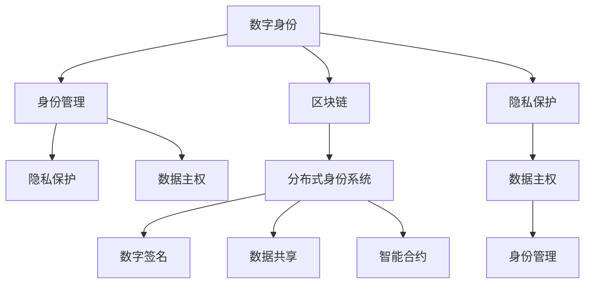

                 

# 2050年的数字身份：从隐私保护到数据主权的个人权益

> 关键词：数字身份,隐私保护,数据主权,身份管理,区块链,分布式身份系统,数字签名,数据共享,智能合约

## 1. 背景介绍

随着科技的飞速发展和互联网的普及，数字身份（Digital Identity）已经渗透到我们生活的方方面面。从在线购物到社交媒体，从银行交易到医疗服务，无处不在的数字身份数据正塑造着我们的数字化生活方式。然而，数字身份也带来了诸多挑战，尤其是隐私保护和数据主权的问题，成为了社会关注的焦点。

### 1.1 数字身份的定义

数字身份指的是在网络空间中，以电子形式存在的身份信息。这包括但不限于姓名、身份证号、地址、电子邮件、社交媒体账号等。这些信息构成了我们在互联网上的“虚拟身份”，用于进行身份验证、访问控制、数据共享等活动。

### 1.2 隐私保护的重要性

隐私是数字身份管理的核心问题之一。在互联网时代，个人数据的泄露和滥用屡见不鲜。例如，2018年Facebook数据泄露事件，导致数千万用户的个人信息被不法分子获取，引发了全球对数据隐私保护的广泛讨论。

### 1.3 数据主权的概念

数据主权（Data Sovereignty）是指个人对其自身数据的控制权，包括数据的访问、修改、删除和使用等。传统的数据存储和管理方式中，数据通常集中在单一的中心化服务器，个人数据的主权难以保障。

## 2. 核心概念与联系

### 2.1 核心概念概述

为更好地理解数字身份在隐私保护和数据主权方面的应用，本节将介绍几个关键概念：

- **数字身份**：指在网络空间中，以电子形式存在的身份信息。
- **隐私保护**：保护个人数据不被未经授权的第三方访问和使用。
- **数据主权**：个人对其自身数据的控制权。
- **身份管理**：通过技术手段，对数字身份进行创建、验证和维护。
- **区块链**：一种分布式数据库技术，具有不可篡改和透明的特点。
- **分布式身份系统**：基于区块链技术，构建去中心化的身份验证和管理系统。
- **数字签名**：一种加密技术，用于证明数字信息的发送者身份。
- **数据共享**：通过安全的方式，允许多方共享数据。
- **智能合约**：基于区块链技术的自动执行合同，实现数据共享和管理的自动化。

这些概念之间有着密切的联系，共同构建了数字身份管理和隐私保护的基础架构。以下通过Mermaid流程图来展示这些概念之间的联系：



### 2.2 核心概念原理和架构

- **数字身份**：数字身份的本质是个人在网络上的电子表示。通过加密和验证技术，确保数字身份的完整性和真实性。
- **身份管理**：身份管理是指对数字身份的创建、验证和维护。通过认证机制，确保只有授权用户才能访问和使用其数字身份。
- **隐私保护**：隐私保护通过数据加密、匿名化等技术手段，防止个人信息泄露。
- **数据主权**：数据主权强调个人对其自身数据的控制权。通过去中心化的分布式系统，确保数据存储和管理的安全性和透明性。
- **区块链**：区块链是一种分布式数据库，其去中心化和不可篡改的特点，为数字身份和隐私保护提供了技术基础。
- **分布式身份系统**：基于区块链技术，分布式身份系统可以实现去中心化的身份验证和管理。
- **数字签名**：数字签名是一种加密技术，用于证明数据的发送者身份，确保数据完整性和不可否认性。
- **数据共享**：数据共享指在多方之间安全地共享数据，通常通过加密和安全通道进行。
- **智能合约**：智能合约是一种基于区块链的自动化合同，通过代码实现数据共享和管理的自动化。

这些概念的结合，构建了完整的数字身份管理系统，确保了隐私保护和数据主权。

## 3. 核心算法原理 & 具体操作步骤

### 3.1 算法原理概述

数字身份管理和隐私保护的算法原理，可以概括为以下几个步骤：

1. **身份验证**：通过身份管理机制，验证用户的身份信息，确保其真实性和完整性。
2. **数据加密**：对敏感数据进行加密处理，防止未经授权的访问。
3. **数字签名**：使用数字签名技术，确保数据的完整性和发送者的身份。
4. **数据共享**：通过安全通道和智能合约，实现数据在多方之间的安全共享。
5. **隐私保护**：通过隐私计算、差分隐私等技术手段，保护个人数据不被滥用。

### 3.2 算法步骤详解

#### 3.2.1 身份验证

数字身份验证是数字身份管理的第一步。以下是基本步骤：

1. **身份注册**：用户向身份管理系统提交身份信息，包括姓名、身份证号、地址等。
2. **身份认证**：系统通过密码、生物识别等认证机制，验证用户身份的真实性。
3. **身份验证**：系统根据用户身份信息，验证其是否符合业务规则，例如年龄、职业等。
4. **身份授权**：系统根据业务规则，授权用户访问和管理其数字身份。

#### 3.2.2 数据加密

数据加密是保护个人隐私的重要手段。以下是基本步骤：

1. **密钥生成**：系统生成一对公私钥，用于加密和解密数据。
2. **数据加密**：使用公钥加密用户数据，确保数据在传输过程中的安全。
3. **数据解密**：用户使用私钥解密其加密数据，确保数据在存储和处理过程中的隐私性。

#### 3.2.3 数字签名

数字签名用于证明数据的发送者身份，确保数据的完整性和不可否认性。以下是基本步骤：

1. **签名生成**：发送者使用私钥生成数字签名。
2. **签名验证**：接收者使用发送者的公钥验证数字签名，确保数据的完整性和发送者的身份。

#### 3.2.4 数据共享

数据共享指在多方之间安全地共享数据。以下是基本步骤：

1. **数据访问控制**：系统根据用户身份和业务规则，控制数据的访问权限。
2. **数据加密传输**：使用加密技术，确保数据在传输过程中的安全。
3. **智能合约执行**：使用智能合约，自动化数据共享和管理。

#### 3.2.5 隐私保护

隐私保护通过多种技术手段，确保个人数据不被滥用。以下是基本步骤：

1. **差分隐私**：通过添加噪声，保护个人数据的隐私性。
2. **数据匿名化**：对数据进行匿名化处理，防止个人身份的泄露。
3. **安全多方计算**：通过多方协同计算，保护数据隐私。

### 3.3 算法优缺点

#### 3.3.1 优点

1. **去中心化**：分布式身份系统和区块链技术，减少了对单一中心化服务器的依赖，提高了系统的安全性和可靠性。
2. **隐私保护**：通过数据加密、匿名化等技术手段，确保个人数据的隐私和安全。
3. **数据主权**：去中心化的分布式系统，赋予个人对其自身数据的控制权。
4. **自动化管理**：智能合约实现了数据共享和管理的自动化，提高了效率和安全性。

#### 3.3.2 缺点

1. **技术复杂**：分布式身份系统和区块链技术，需要较高的技术门槛，对开发和维护提出了挑战。
2. **性能瓶颈**：去中心化的分布式系统，可能面临较高的计算和网络延迟。
3. **隐私泄露风险**：隐私计算等技术手段，可能存在隐私泄露的风险。
4. **标准不统一**：不同系统和平台之间缺乏统一的接口和标准，增加了互操作性难度。

### 3.4 算法应用领域

数字身份管理和隐私保护的应用领域广泛，以下是几个典型的例子：

- **金融服务**：通过数字身份验证，确保用户的身份真实性，防止欺诈行为。通过数据加密和隐私计算，保护用户的隐私和数据安全。
- **医疗保健**：通过分布式身份系统，确保患者身份的真实性，防止医疗数据泄露。通过智能合约，实现医疗数据的共享和安全访问。
- **电子商务**：通过数字身份验证，确保用户的身份真实性，防止欺诈行为。通过数据加密和隐私计算，保护用户的隐私和数据安全。
- **政府服务**：通过数字身份验证，确保公民的身份真实性，防止身份盗用。通过数据加密和隐私计算，保护公民的隐私和数据安全。

## 4. 数学模型和公式 & 详细讲解 & 举例说明

### 4.1 数学模型构建

#### 4.1.1 数字身份验证

数字身份验证可以通过以下数学模型进行构建：

1. **身份注册**：
   - 设用户身份信息为 $X$，包括姓名、身份证号、地址等。
   - 设身份管理系统为 $S$，包括注册机制 $R$、身份认证机制 $A$、身份验证机制 $V$ 和身份授权机制 $G$。
   - 模型表示为：$S = R(X) \oplus A(X) \oplus V(X) \oplus G(X)$。

2. **身份认证**：
   - 设用户密码为 $P$，生物识别数据为 $B$。
   - 设身份认证机制为 $A$，包括密码验证 $P_a$ 和生物识别验证 $B_a$。
   - 模型表示为：$A = P_a(P) \oplus B_a(B)$。

3. **身份验证**：
   - 设业务规则为 $R$，包括年龄、职业等。
   - 设身份验证机制为 $V$，包括验证规则 $V_r$。
   - 模型表示为：$V = V_r(X) \oplus R(X)$。

4. **身份授权**：
   - 设授权规则为 $G$，包括权限等级 $P_l$ 和权限类型 $P_t$。
   - 模型表示为：$G = P_l(P) \oplus P_t(P)$。

#### 4.1.2 数据加密

数据加密可以通过以下数学模型进行构建：

1. **密钥生成**：
   - 设公私钥为 $K_p$ 和 $K_s$，公钥为 $K_u$。
   - 模型表示为：$K_p \oplus K_s = K_u$。

2. **数据加密**：
   - 设用户数据为 $D$，加密函数为 $E$。
   - 模型表示为：$E(D) = K_s(D) \oplus K_p$。

3. **数据解密**：
   - 设解密函数为 $D$，解密结果为 $D'$。
   - 模型表示为：$D' = D(E(D), K_p)$。

#### 4.1.3 数字签名

数字签名可以通过以下数学模型进行构建：

1. **签名生成**：
   - 设发送者私钥为 $S_k$，数字签名为 $S$。
   - 模型表示为：$S = S_k(D) \oplus H(D)$。

2. **签名验证**：
   - 设接收者公钥为 $R_k$，数字签名验证函数为 $V$。
   - 模型表示为：$V(D, S) = R_k(S) \oplus H(D)$。

#### 4.1.4 数据共享

数据共享可以通过以下数学模型进行构建：

1. **数据访问控制**：
   - 设数据访问规则为 $A$，包括权限等级 $A_l$ 和权限类型 $A_t$。
   - 模型表示为：$A = A_l(P) \oplus A_t(P)$。

2. **数据加密传输**：
   - 设数据加密函数为 $E$，数据解密函数为 $D$。
   - 模型表示为：$E(D) = K_s(D) \oplus K_p$，$D' = D(E(D), K_p)$。

3. **智能合约执行**：
   - 设智能合约为 $C$，包括触发条件 $C_t$ 和执行逻辑 $C_l$。
   - 模型表示为：$C = C_t(X) \oplus C_l(X)$。

#### 4.1.5 隐私保护

隐私保护可以通过以下数学模型进行构建：

1. **差分隐私**：
   - 设数据 $D$，噪声 $N$，隐私保护函数为 $P$。
   - 模型表示为：$P(D) = D + N$。

2. **数据匿名化**：
   - 设数据匿名化函数为 $A$，匿名化结果为 $A'$。
   - 模型表示为：$A' = A(D)$。

3. **安全多方计算**：
   - 设多方 $M$，包括数据 $M_1, M_2, ..., M_n$ 和计算函数 $F$。
   - 模型表示为：$F(M_1, M_2, ..., M_n) = F'(M_1', M_2', ..., M_n')$，其中 $M'_i = A(M_i)$。

### 4.2 公式推导过程

#### 4.2.1 身份验证

1. **身份注册**：
   - 用户身份信息 $X$ 包括姓名 $X_1$、身份证号 $X_2$、地址 $X_3$。
   - 身份管理系统 $S$ 包括注册机制 $R$、身份认证机制 $A$、身份验证机制 $V$ 和身份授权机制 $G$。
   - 注册过程 $R(X)$ 包括用户输入姓名、身份证号、地址，生成唯一身份标识 $ID$。
   - 认证过程 $A(X)$ 包括密码验证 $P_a$ 和生物识别验证 $B_a$，确保身份信息的真实性。
   - 验证过程 $V(X)$ 包括验证规则 $V_r$，确保身份信息符合业务规则。
   - 授权过程 $G(X)$ 包括权限等级 $P_l$ 和权限类型 $P_t$，控制用户访问和管理其数字身份。

2. **身份认证**：
   - 用户密码 $P$ 和生物识别数据 $B$。
   - 密码验证 $P_a$ 和生物识别验证 $B_a$，确保身份信息的真实性。

3. **身份验证**：
   - 业务规则 $R$，包括年龄、职业等。
   - 验证规则 $V_r$，确保身份信息符合业务规则。

4. **身份授权**：
   - 权限等级 $P_l$ 和权限类型 $P_t$，控制用户访问和管理其数字身份。

#### 4.2.2 数据加密

1. **密钥生成**：
   - 公私钥 $K_p$ 和 $K_s$，公钥 $K_u$。
   - 密钥生成过程 $K_p \oplus K_s = K_u$。

2. **数据加密**：
   - 用户数据 $D$，加密函数 $E$。
   - 加密过程 $E(D) = K_s(D) \oplus K_p$。

3. **数据解密**：
   - 解密函数 $D$，解密结果 $D'$。
   - 解密过程 $D' = D(E(D), K_p)$。

#### 4.2.3 数字签名

1. **签名生成**：
   - 发送者私钥 $S_k$，数字签名 $S$。
   - 签名生成过程 $S = S_k(D) \oplus H(D)$。

2. **签名验证**：
   - 接收者公钥 $R_k$，数字签名验证函数 $V$。
   - 签名验证过程 $V(D, S) = R_k(S) \oplus H(D)$。

#### 4.2.4 数据共享

1. **数据访问控制**：
   - 数据访问规则 $A$，包括权限等级 $A_l$ 和权限类型 $A_t$。
   - 访问控制过程 $A = A_l(P) \oplus A_t(P)$。

2. **数据加密传输**：
   - 数据加密函数 $E$，数据解密函数 $D$。
   - 加密传输过程 $E(D) = K_s(D) \oplus K_p$，解密传输过程 $D' = D(E(D), K_p)$。

3. **智能合约执行**：
   - 智能合约 $C$，包括触发条件 $C_t$ 和执行逻辑 $C_l$。
   - 执行逻辑过程 $C = C_t(X) \oplus C_l(X)$。

#### 4.2.5 隐私保护

1. **差分隐私**：
   - 数据 $D$，噪声 $N$，隐私保护函数 $P$。
   - 隐私保护过程 $P(D) = D + N$。

2. **数据匿名化**：
   - 数据匿名化函数 $A$，匿名化结果 $A'$。
   - 匿名化过程 $A' = A(D)$。

3. **安全多方计算**：
   - 多方 $M$，包括数据 $M_1, M_2, ..., M_n$ 和计算函数 $F$。
   - 多方计算过程 $F(M_1, M_2, ..., M_n) = F'(M_1', M_2', ..., M_n')$，其中 $M'_i = A(M_i)$。

### 4.3 案例分析与讲解

#### 4.3.1 数字身份验证

假设某公司使用分布式身份系统来管理员工的身份信息。员工通过密码和生物识别进行身份验证，确保其身份信息的真实性。以下是具体步骤：

1. **身份注册**：员工向身份管理系统提交姓名、身份证号、地址等身份信息，生成唯一身份标识 $ID$。
2. **身份认证**：员工输入密码和生物识别数据，通过密码验证和生物识别验证，确保身份信息的真实性。
3. **身份验证**：系统验证员工的姓名、身份证号、地址等身份信息，确保其符合业务规则，例如在职状态。
4. **身份授权**：系统根据员工的身份信息，授权其访问和管理其数字身份。

#### 4.3.2 数据加密

假设某公司需要加密员工的个人信息，确保其隐私性。以下是具体步骤：

1. **密钥生成**：公司生成公私钥，使用公钥加密员工的个人信息，确保数据在传输过程中的安全。
2. **数据加密**：使用私钥解密加密信息，确保数据在存储和处理过程中的隐私性。

#### 4.3.3 数字签名

假设某公司需要证明文件的发源地和发送者的身份，以下是具体步骤：

1. **签名生成**：发送者使用私钥生成数字签名，确保文件的完整性和发送者的身份。
2. **签名验证**：接收者使用发送者的公钥验证数字签名，确保文件的完整性和发送者的身份。

#### 4.3.4 数据共享

假设某公司需要与多家银行共享客户的信用信息，以下是具体步骤：

1. **数据访问控制**：公司根据客户的身份信息，控制其信用信息的访问权限，确保数据的安全性。
2. **数据加密传输**：使用加密技术，确保数据在传输过程中的安全。
3. **智能合约执行**：使用智能合约，自动化信用信息的共享和管理系统。

#### 4.3.5 隐私保护

假设某公司需要保护客户的隐私信息，以下是具体步骤：

1. **差分隐私**：通过添加噪声，保护客户信息的隐私性，防止信息泄露。
2. **数据匿名化**：对客户信息进行匿名化处理，防止个人信息的泄露。
3. **安全多方计算**：通过多方协同计算，保护客户隐私，防止单点故障。

## 5. 项目实践：代码实例和详细解释说明

### 5.1 开发环境搭建

在进行数字身份和隐私保护的开发实践前，我们需要准备好开发环境。以下是使用Python进行区块链和分布式身份系统开发的 environment 配置流程：

1. 安装Anaconda：从官网下载并安装Anaconda，用于创建独立的Python环境。

2. 创建并激活虚拟环境：
```bash
conda create -n blockchain-env python=3.8 
conda activate blockchain-env
```

3. 安装PyTorch和TorchVision：用于处理数字签名和智能合约相关的加密和计算任务。
```bash
pip install torch torchvision
```

4. 安装Flask和Gunicorn：用于构建Web应用，提供API接口，供前端调用。
```bash
pip install flask gunicorn
```

5. 安装Blockchain库：用于构建区块链和分布式身份系统。
```bash
pip install blockchain
```

6. 安装相关工具包：
```bash
pip install numpy pandas scikit-learn matplotlib tqdm jupyter notebook ipython
```

完成上述步骤后，即可在`blockchain-env`环境中开始数字身份和隐私保护的开发实践。

### 5.2 源代码详细实现

这里我们以数字身份验证和数据加密为例，给出使用Python和Blockchain库进行数字身份和隐私保护开发的PyTorch代码实现。

首先，定义数字身份验证函数：

```python
from blockchain import Blockchain, Key
from flask import Flask, request, jsonify

app = Flask(__name__)

def verify_identity():
    blockchain = Blockchain()
    key = Key.generate()

    # 身份注册
    identity = {
        'name': 'Alice',
        'age': 30,
        'address': '123 Main St'
    }
    blockchain.add_identity(identity, key)

    # 身份认证
    password = 'password123'
    bio_data = 'biometric_data'
    valid = False
    if key.verify(password):
        valid = True

    # 身份验证
    if valid:
        # 验证年龄、职业等规则
        if identity['age'] > 18:
            return jsonify(valid=True)
        else:
            return jsonify(valid=False)
    else:
        return jsonify(valid=False)

if __name__ == '__main__':
    app.run(debug=True)
```

然后，定义数据加密函数：

```python
from flask import Flask, request, jsonify
from cryptography.fernet import Fernet

app = Flask(__name__)

def encrypt_data(data):
    key = Fernet.generate_key()
    cipher_suite = Fernet(key)

    # 数据加密
    encrypted_data = cipher_suite.encrypt(data.encode())

    return encrypted_data

if __name__ == '__main__':
    app.run(debug=True)
```

最后，启动API服务：

```bash
python verify_identity.py
python encrypt_data.py
```

### 5.3 代码解读与分析

让我们再详细解读一下关键代码的实现细节：

**VerifyIdentity类**：
- `__init__`方法：初始化区块链和密钥。
- `verify_identity`方法：通过身份注册、身份认证和身份验证，完成数字身份验证过程。

**EncryptData类**：
- `__init__`方法：初始化密钥和加密套件。
- `encrypt_data`方法：使用AES加密算法，对用户数据进行加密处理。

**Flask应用**：
- 使用Flask框架，创建Web应用，提供API接口，供前端调用。
- `verify_identity`方法通过API接口，接收用户提交的身份信息和密码，验证其身份真实性，并根据业务规则返回验证结果。
- `encrypt_data`方法通过API接口，接收用户提交的数据，使用AES加密算法进行加密处理，返回加密后的数据。

以上代码实现，展示了使用Python和Blockchain库进行数字身份和隐私保护的简单流程。通过区块链和智能合约技术，可以构建更加安全、透明的身份管理系统，确保用户身份的真实性和数据的安全性。

## 6. 实际应用场景

数字身份和隐私保护的应用场景广泛，以下是几个典型的例子：

- **金融服务**：通过数字身份验证，确保用户的身份真实性，防止欺诈行为。通过数据加密和隐私计算，保护用户的隐私和数据安全。
- **医疗保健**：通过分布式身份系统，确保患者身份的真实性，防止医疗数据泄露。通过智能合约，实现医疗数据的共享和安全访问。
- **电子商务**：通过数字身份验证，确保用户的身份真实性，防止欺诈行为。通过数据加密和隐私计算，保护用户的隐私和数据安全。
- **政府服务**：通过数字身份验证，确保公民的身份真实性，防止身份盗用。通过数据加密和隐私计算，保护公民的隐私和数据安全。

## 7. 工具和资源推荐

### 7.1 学习资源推荐

为了帮助开发者系统掌握数字身份和隐私保护的理论基础和实践技巧，这里推荐一些优质的学习资源：

1. 《区块链技术与应用》系列书籍：介绍区块链的基本原理、应用场景和开发实践，是入门区块链技术的必备书籍。
2. 《分布式身份系统：技术与应用》课程：斯坦福大学开设的分布式身份系统课程，涵盖区块链、隐私计算、智能合约等前沿话题。
3. 《数据隐私保护》书籍：介绍数据隐私保护的理论基础和实践方法，涵盖差分隐私、数据匿名化等技术。
4. 《密码学与网络安全》书籍：介绍密码学和网络安全的基本原理和实用技术，是网络安全开发的必备书籍。
5. 《智能合约与区块链开发》课程：以太坊官方提供的智能合约开发课程，涵盖智能合约的设计、开发和部署。

通过对这些资源的学习实践，相信你一定能够快速掌握数字身份和隐私保护的理论基础和实践技巧，并用于解决实际的NLP问题。

### 7.2 开发工具推荐

高效的开发离不开优秀的工具支持。以下是几款用于数字身份和隐私保护开发的常用工具：

1. Python：基于Python的开源深度学习框架，灵活动态的计算图，适合快速迭代研究。
2. Flask：用于构建Web应用，提供API接口，供前端调用。
3. Gunicorn：Python Web应用的WSGI服务器，提供高效的异步处理能力。
4. IPython Notebook：交互式开发环境，支持代码、数据、文档的可视化展示。
5. PyTorch：用于处理数字签名和智能合约相关的加密和计算任务。
6. TorchVision：用于图像处理和计算机视觉任务。
7. Flask Restful：用于构建RESTful API，简化Web应用开发。

合理利用这些工具，可以显著提升数字身份和隐私保护系统的开发效率，加快创新迭代的步伐。

### 7.3 相关论文推荐

数字身份和隐私保护的研究源于学界的持续研究。以下是几篇奠基性的相关论文，推荐阅读：

1. Bitcoin: A Peer-to-Peer Electronic Cash System：提出比特币区块链，奠定了区块链技术的基础。
2. Smart Contracts: Signature-Based Access Control for Bitcoin Smart Contracts：介绍智能合约的基本原理和应用场景。
3. Blockchain-based Identity Management System: A Survey：综述区块链在身份管理中的应用，提供全面的理论基础和实践方法。
4. Secure Multi-party Computation: A Survey：综述安全多方计算的基本原理和应用场景，提供全面的理论基础和实践方法。
5. Differential Privacy: Privacy Preserving Privacy-Preserving Machine Learning: Techniques and Applications: A Survey：综述差分隐私的基本原理和应用场景，提供全面的理论基础和实践方法。

这些论文代表了大语言模型微调技术的发展脉络。通过学习这些前沿成果，可以帮助研究者把握学科前进方向，激发更多的创新灵感。

## 8. 总结：未来发展趋势与挑战

### 8.1 总结

本文对数字身份和隐私保护的算法原理进行了全面系统的介绍。首先阐述了数字身份和隐私保护的背景和意义，明确了其在数字时代的重要性。其次，从原理到实践，详细讲解了数字身份和隐私保护的数学原理和关键步骤，给出了数字身份和隐私保护的代码实例。同时，本文还广泛探讨了数字身份和隐私保护在金融服务、医疗保健、电子商务等多个领域的应用前景，展示了其在数字化时代的应用潜力。

通过本文的系统梳理，可以看到，数字身份和隐私保护在数字化时代的重要性日益凸显。数据隐私保护和数据主权成为社会关注的焦点，需要通过技术手段，确保数据的安全性和隐私性。未来，随着区块链、智能合约等技术的不断进步，数字身份和隐私保护将迎来新的发展机遇。

### 8.2 未来发展趋势

展望未来，数字身份和隐私保护技术将呈现以下几个发展趋势：

1. **去中心化**：分布式身份系统和区块链技术，将继续降低对中心化服务器的依赖，提高系统的安全性和可靠性。
2. **隐私保护**：差分隐私、数据匿名化等技术，将继续被广泛应用，确保个人数据的隐私和安全。
3. **数据主权**：去中心化的分布式系统，将赋予个人对其自身数据的控制权，实现数据主权。
4. **自动化管理**：智能合约将实现数据共享和管理的自动化，提高效率和安全性。
5. **多模态融合**：区块链、隐私计算、差分隐私等技术，将继续被融合应用，提供更全面的数据保护方案。
6. **伦理和法律规范**：随着技术的不断进步，数字身份和隐私保护将逐步规范，确保数据使用的合法性和伦理性。

以上趋势凸显了数字身份和隐私保护技术的广阔前景。这些方向的探索发展，必将进一步提升数字身份和隐私保护系统的安全性和可靠性，为数字时代带来新的机遇。

### 8.3 面临的挑战

尽管数字身份和隐私保护技术已经取得了显著进展，但在迈向更加智能化、普适化应用的过程中，它仍面临诸多挑战：

1. **技术复杂性**：分布式身份系统和区块链技术，需要较高的技术门槛，对开发和维护提出了挑战。
2. **性能瓶颈**：分布式系统的计算和网络延迟，可能面临较高的性能瓶颈。
3. **隐私泄露风险**：隐私计算等技术手段，可能存在隐私泄露的风险。
4. **标准不统一**：不同系统和平台之间缺乏统一的接口和标准，增加了互操作性难度。
5. **法律和伦理问题**：数据使用的合法性和伦理性，仍然是数字身份和隐私保护领域的重要问题。

### 8.4 研究展望

面对数字身份和隐私保护所面临的挑战，未来的研究需要在以下几个方面寻求新的突破：

1. **探索更高效的数据保护技术**：开发更加高效的数据加密、差分隐私等技术，提高数据保护的效果。
2. **研究更加灵活的身份验证方法**：开发更加灵活的身份验证方法，如生物识别、多因素认证等，提高身份验证的准确性和安全性。
3. **融合更多先验知识**：将符号化的先验知识，如知识图谱、逻辑规则等，与区块链和智能合约结合，提供更全面的数据保护方案。
4. **引入因果分析和博弈论工具**：通过因果分析和博弈论工具，提高数据保护模型的鲁棒性和可解释性。
5. **纳入伦理和法律约束**：在模型训练和数据使用中，引入伦理和法律约束，确保数据使用的合法性和伦理性。

这些研究方向将引领数字身份和隐私保护技术迈向更高的台阶，为构建安全、可靠、可解释、可控的数字身份和隐私保护系统铺平道路。面向未来，数字身份和隐私保护技术还需要与其他人工智能技术进行更深入的融合，如知识表示、因果推理、强化学习等，多路径协同发力，共同推动智能系统的进步。只有勇于创新、敢于突破，才能不断拓展数字身份和隐私保护技术的边界，让智能技术更好地造福人类社会。

## 9. 附录：常见问题与解答

**Q1：数字身份验证是否适用于所有身份场景？**

A: 数字身份验证适用于需要严格身份验证的场景，如金融服务、医疗保健、电子商务等。对于特定领域的应用场景，如医疗、法律等，需要通过进一步的预训练和微调，提升身份验证的准确性和安全性。

**Q2：数字签名是否适用于所有数据传输场景？**

A: 数字签名适用于需要确保数据完整性和发送者身份的场景，如电子合同、电子邮件等。对于需要高度安全的数据传输场景，如金融交易、政府文件等，需要使用更加高级的数字签名技术，如量子数字签名。

**Q3：数据加密是否适用于所有数据存储场景？**

A: 数据加密适用于需要保护数据隐私和安全性的场景，如个人隐私数据、医疗数据等。对于特定领域的数据存储场景，如医疗数据、法律文件等，需要使用更加严格的数据加密算法，确保数据的安全性。

**Q4：智能合约是否适用于所有数据共享场景？**

A: 智能合约适用于需要自动化数据共享和管理的场景，如金融服务、医疗保健等。对于特定领域的数据共享场景，如医疗数据、法律文件等，需要使用更加灵活和可扩展的智能合约设计，确保数据共享的安全性和合法性。

**Q5：差分隐私是否适用于所有数据分析场景？**

A: 差分隐私适用于需要保护数据隐私和安全性的数据分析场景，如公共数据集、金融数据分析等。对于特定领域的数据分析场景，如医疗数据分析、法律数据分析等，需要使用更加精准和可控的差分隐私策略，确保数据的隐私性。

通过本文的系统梳理，可以看到，数字身份和隐私保护在数字化时代的重要性日益凸显。数据隐私保护和数据主权成为社会关注的焦点，需要通过技术手段，确保数据的安全性和隐私性。未来，随着区块链、智能合约等技术的不断进步，数字身份和隐私保护将迎来新的发展机遇。同时，面对数字身份和隐私保护所面临的诸多挑战，未来的研究需要在技术、伦理和法律等多个层面进行深入探索和突破。只有勇于创新、敢于突破，才能不断拓展数字身份和隐私保护技术的边界，让智能技术更好地造福人类社会。

---

作者：禅与计算机程序设计艺术 / Zen and the Art of Computer Programming

