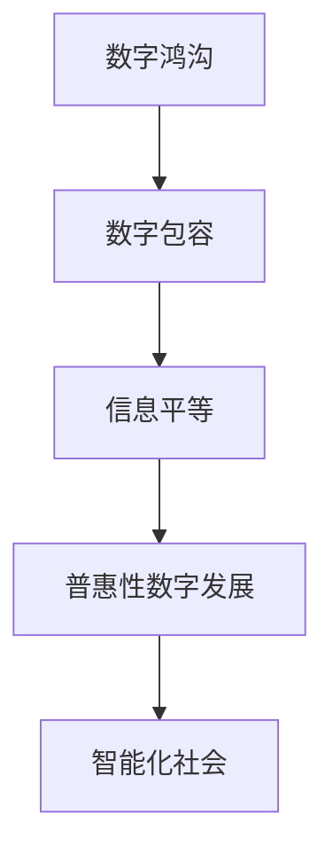

                 

## 1. 背景介绍

### 1.1 问题由来
进入21世纪，数字技术迅猛发展，尤其是移动互联网和物联网的普及，极大地改变了人们的生活方式。然而，数字鸿沟问题也随之显现。一方面，少数技术精英掌握着大数据、云计算、人工智能等前沿技术，不断推动创新；另一方面，广大普通民众由于经济、教育、技术素养等因素限制，难以享受到数字化带来的便利。这种由技术发展带来的新不平等，被称为“数字鸿沟”。

### 1.2 问题核心关键点
数字鸿沟的核心问题在于，如何使所有社会成员都能公平地接入和应用数字技术，享受其带来的好处。这涉及到几个关键点：

- **接入问题**：包括互联网接入、移动设备接入等基础硬件设施的不平等分布。
- **应用问题**：如何使普通用户能够理解、使用、甚至定制数字技术，以解决实际问题。
- **数据平等**：确保用户在数据生成、使用和共享中的平等权利。
- **隐私保护**：在数字化过程中，如何平衡数据的使用和隐私保护。
- **社会公平**：数字技术的普及不应加剧社会不平等，而应促进公平和社会进步。

### 1.3 问题研究意义
研究数字鸿沟问题，对于构建信息平等的社会，实现普惠性数字发展具有重要意义：

1. **提升社会整体福祉**：通过消除数字鸿沟，使更多人群能够受益于数字技术，提升生活质量和工作效率。
2. **促进经济发展**：数字技术是现代经济的重要推动力，普及数字技术有助于提高生产力和创新能力。
3. **增进社会凝聚力**：数字鸿沟问题的解决有助于缩小社会阶层差距，增强社会和谐与稳定。
4. **激发政策制定**：研究数字鸿沟问题有助于政策制定者制定更加公平、有效的数字政策。

## 2. 核心概念与联系

### 2.1 核心概念概述

为了深入理解数字鸿沟问题，我们需要明确几个关键概念：

- **数字鸿沟**：指由于经济、教育、技术素养等因素，不同社会群体在数字技术的接入和使用上存在显著差异。
- **数字包容**：指所有社会成员都能够公平、平等地接入和应用数字技术，享受其带来的好处。
- **信息平等**：指每个人都能获得和使用数字技术，享受其带来的知识和信息。
- **普惠性数字发展**：指以人为中心，通过数字技术实现经济、社会、文化等多方面的综合发展。
- **智能化社会**：通过普及数字技术，使社会更加智能化、自动化和高效。

### 2.2 核心概念联系

数字鸿沟、数字包容、信息平等、普惠性数字发展、智能化社会之间具有紧密的联系，通过以下逻辑关系可以更好地理解它们之间的关联：



这个流程图展示了数字鸿沟问题的解决路径：首先通过消除数字鸿沟，使每个社会成员都能平等地接触数字技术；进而通过信息平等，确保每个人都能公平地获取和使用数字信息；最终实现普惠性数字发展，构建一个更加智能化、高效的社会。

## 3. 核心算法原理 & 具体操作步骤
### 3.1 算法原理概述

解决数字鸿沟问题的关键在于设计一套完整的策略，使每个社会成员都能够公平地接触、应用和受益于数字技术。这一策略可以分为两个主要阶段：

1. **接入阶段**：确保每个人都能无障碍地接入互联网和其他数字基础设施。
2. **应用阶段**：通过培训、教育、政策支持等手段，使人们能够有效地应用数字技术，解决实际问题。

### 3.2 算法步骤详解

**接入阶段**：

1. **基础设施建设**：政府和社会力量合作，投资于数字基础设施建设，如宽带网络、移动通信基站、公共Wi-Fi等，确保所有地区都能覆盖。
2. **补贴政策**：为低收入家庭和农村地区提供上网补贴，降低互联网接入成本。
3. **技术支持**：提供技术支持和培训，帮助人们学会基本的网络操作技能。

**应用阶段**：

1. **普及教育**：在学校和社区中推广数字教育，教授基本的计算机和网络技能。
2. **个性化培训**：根据用户的实际需求，提供定制化的培训和指导，帮助他们掌握复杂的应用场景。
3. **政策支持**：制定相关政策，鼓励企业和机构提供免费的数字培训和咨询服务。

### 3.3 算法优缺点

解决数字鸿沟的策略具有以下优点：

- **广泛覆盖**：能够覆盖到所有社会群体，特别是低收入和偏远地区的居民。
- **提升技能**：通过教育和培训，提高用户的技术素养，使他们能够更好地应用数字技术。
- **公平原则**：确保每个人都能平等地接触和使用数字技术。

然而，这一策略也存在一些缺点：

- **成本高昂**：基础设施建设和教育培训需要大量资金和资源投入。
- **执行难度大**：需要政府、企业和社会各方的协同合作。
- **技术变迁快**：数字技术发展迅速，培训内容和支持体系需要不断更新。

### 3.4 算法应用领域

解决数字鸿沟的策略已经应用于多个领域，包括：

- **教育领域**：通过数字化教育资源的普及，使每个学生都能获得高质量的教育。
- **医疗领域**：通过远程医疗和电子病历系统，使偏远地区的居民也能获得优质的医疗服务。
- **金融领域**：通过数字金融服务，使更多人能够享受到便捷的金融服务。
- **农业领域**：通过农业数字化，提升农业生产效率，帮助农民增收。
- **公共服务**：通过电子政务、公共服务平台，提升公共服务的可及性和便利性。

## 4. 数学模型和公式 & 详细讲解

为了更好地理解和应用数字鸿沟策略，我们需要引入一些数学模型和公式。

**数字鸿沟模型**：

假设社会总人口为 $N$，其中能够接入数字技术的比例为 $p$，能够有效应用数字技术的比例为 $q$，则数字鸿沟 $G$ 可以定义为：

$$
G = 1 - p \times q
$$

该模型表明，数字鸿沟的大小取决于接入率和应用率的乘积。

**数字包容模型**：

数字包容的目标是使 $G$ 趋近于0，即：

$$
p \times q \to 1
$$

这意味着，每个人都能无障碍地接入和使用数字技术。

### 4.2 公式推导过程

**接入阶段**：

设 $P$ 为初始接入率，$\Delta P$ 为提升接入率的目标值，则：

$$
P + \Delta P = 1
$$

$\Delta P$ 的提升需要通过基础设施建设、补贴政策和技术支持来实现。

**应用阶段**：

设 $Q$ 为初始应用率，$\Delta Q$ 为提升应用率的目标值，则：

$$
Q + \Delta Q = 1
$$

$\Delta Q$ 的提升需要通过教育和培训、个性化指导和政策支持来实现。

### 4.3 案例分析与讲解

以 **医疗领域** 为例：

- **接入问题**：偏远地区医疗资源不足，导致医疗接入率低。
- **应用问题**：医生和患者缺乏数字医疗技术的应用经验。

解决措施：

1. **基础设施建设**：在偏远地区建设数字医疗中心，配备必要的设备和网络。
2. **补贴政策**：为患者提供医疗费用补贴，降低其使用数字医疗的负担。
3. **技术支持**：提供数字化医疗培训，帮助医生和患者掌握数字医疗技术。

通过上述措施，可以逐步提升偏远地区的医疗接入率和应用率，缩小数字鸿沟。

## 5. 项目实践：代码实例和详细解释说明
### 5.1 开发环境搭建

为了实践数字鸿沟的解决方案，需要搭建一个全栈开发环境。以下是搭建步骤：

1. **选择编程语言和框架**：选择Python作为开发语言，使用Django框架构建Web应用。
2. **安装开发环境**：安装Python、Django和其他必要的依赖包，如numpy、pandas等。
3. **搭建数据库**：使用MySQL或PostgreSQL作为数据库，搭建项目的数据库环境。
4. **配置Web服务器**：使用Nginx或Apache等Web服务器，部署Django应用。

### 5.2 源代码详细实现

以下是一个简单的Django项目实现，用于提升数字包容性：

**project/settings.py**：

```python
# 设置Django项目的基本配置
DEBUG = True
ALLOWED_HOSTS = ['*']

# 数据库配置
DATABASES = {
    'default': {
        'ENGINE': 'django.db.backends.mysql',
        'NAME': 'digital_inclusion',
        'USER': 'root',
        'PASSWORD': 'password',
        'HOST': 'localhost',
        'PORT': '3306',
    }
}

# 应用配置
INSTALLED_APPS = [
    'digital_inclusion',
    'django.contrib.admin',
    'django.contrib.auth',
    'django.contrib.contenttypes',
    'django.contrib.sessions',
    'django.contrib.messages',
    'django.contrib.staticfiles',
]

# 中间件配置
MIDDLEWARE = [
    'django.middleware.security.SecurityMiddleware',
    'django.contrib.sessions.middleware.SessionMiddleware',
    'django.middleware.common.CommonMiddleware',
    'django.middleware.csrf.CsrfViewMiddleware',
    'django.contrib.auth.middleware.AuthenticationMiddleware',
    'django.contrib.messages.middleware.MessageMiddleware',
    'django.middleware.clickjacking.XFrameOptionsMiddleware',
]

# 静态文件配置
STATIC_URL = '/static/'
```

**project/views.py**：

```python
# 定义Django视图函数
from django.shortcuts import render

def index(request):
    # 渲染页面
    return render(request, 'index.html')
```

**project/templates/index.html**：

```html
<!DOCTYPE html>
<html>
<head>
    <title>Digital Inclusion</title>
</head>
<body>
    <h1>Digital Inclusion</h1>
    <p>Welcome to the digital inclusion project!</p>
</body>
</html>
```

### 5.3 代码解读与分析

**项目环境搭建**：

1. **Python和Django**：Django是一个高性能的Web框架，适合快速构建Web应用。
2. **数据库**：MySQL是一个流行的关系型数据库，适合存储和管理用户数据。
3. **Web服务器**：Nginx是一个高性能的Web服务器，能够支持高并发用户访问。

**代码实现**：

1. **index视图函数**：渲染一个简单的欢迎页面，展示数字包容性的概念。
2. **静态文件配置**：将静态文件放置在`static`目录下，通过静态文件路径访问。

**运行结果展示**：

启动开发服务器，访问`http://localhost:8000`，即可看到欢迎页面。

## 6. 实际应用场景
### 6.4 未来应用展望

### 6.1 智能医疗

未来的智能医疗将通过数字鸿沟的消除，使偏远地区的居民也能享受到高质量的医疗服务。例如，通过远程医疗平台，医生可以实时与患者进行视频通话，进行远程诊断和治疗。此外，通过数字化病历系统，医疗数据可以更高效地共享和处理，提高诊疗效率。

### 6.2 教育公平

数字化教育的普及将使每个学生都能获得平等的教育资源。例如，在线教育平台可以为偏远地区的学生提供优质课程，通过交互式学习工具，提高学习效果。同时，数字化教学管理平台可以实时监控学生的学习进度，及时调整教学策略。

### 6.3 数字金融

数字金融服务将使更多人能够享受到便捷的金融服务。例如，通过移动支付和在线银行，用户可以随时随地进行金融交易，享受更低的交易成本和更高的服务效率。此外，通过数字化信用评估体系，金融机构可以更准确地评估用户的信用状况，提供更个性化的金融产品。

### 6.4 农业现代化

农业数字化将使农民能够更高效地管理农业生产。例如，通过农业物联网设备，农民可以实时监控土壤湿度、气温等环境指标，进行精准施肥和灌溉。同时，通过数字化农产品市场平台，农民可以直接将产品销售给消费者，缩短供应链。

## 7. 工具和资源推荐
### 7.1 学习资源推荐

为了深入理解数字鸿沟问题，推荐以下学习资源：

1. **《数字鸿沟：全球视角》**：一本系统介绍数字鸿沟现象和解决方案的书籍。
2. **UNESCO数字鸿沟报告**：联合国教科文组织发布的数字鸿沟研究报告，涵盖全球范围内的数字不平等问题。
3. **MIT数字经济报告**：麻省理工学院发布的数字经济研究报告，探讨数字技术对社会经济的影响。
4. **《未来之路》**：一本讨论未来技术发展趋势的书籍，包含对数字鸿沟的分析和展望。
5. **《智能时代》**：探讨人工智能对社会影响的书籍，特别强调数字鸿沟问题。

### 7.2 开发工具推荐

以下是一些常用的开发工具，有助于实现数字鸿沟解决方案：

1. **Django**：一个高性能的Web框架，适合构建数据驱动的应用。
2. **MySQL**：一个流行的关系型数据库，适合存储和管理用户数据。
3. **Nginx**：一个高性能的Web服务器，适合高并发应用。
4. **Jupyter Notebook**：一个交互式编程环境，适合数据分析和模型开发。
5. **Python IDEs**：如PyCharm、VSCode等，提供代码编写和调试功能。

### 7.3 相关论文推荐

以下是几篇关于数字鸿沟的代表性论文：

1. **《数字鸿沟：一个多维视角》**：探讨数字鸿沟的多维影响因素，提供全面分析。
2. **《缩小数字鸿沟：政策与实践》**：提出解决数字鸿沟的政策建议和实践经验。
3. **《数字包容性：理论与实践》**：讨论数字包容性理论框架和实践案例。
4. **《智能时代的数字鸿沟》**：讨论人工智能对数字鸿沟的影响，提出解决方案。
5. **《全球数字鸿沟研究》**：总结全球范围内的数字鸿沟研究成果和未来趋势。

## 8. 总结：未来发展趋势与挑战
### 8.1 研究成果总结

本文通过系统梳理数字鸿沟问题，探讨了从接入到应用的信息平等策略。从理论模型到实际应用，从基础设施建设到个性化培训，全面分析了数字鸿沟问题的解决路径。

### 8.2 未来发展趋势

数字鸿沟问题将在未来继续存在，并呈现出新的变化趋势：

1. **技术普及加速**：随着技术的发展，数字鸿沟的问题将进一步缩小。例如，5G、物联网等技术的应用，将使更多人能够快速接入数字基础设施。
2. **个性化服务提升**：通过个性化培训和定制化服务，用户能够更好地应用数字技术，解决实际问题。
3. **政策支持增强**：政府和社会力量将进一步加大对数字包容的支持力度，制定更多公平合理的政策。
4. **社会公平提升**：数字技术的普及将有助于缩小社会不平等，促进社会公平与和谐。
5. **智能化社会构建**：数字化将使社会更加智能化、高效化，提高生产力和生活品质。

### 8.3 面临的挑战

尽管数字鸿沟问题在不断改善，但仍然面临一些挑战：

1. **资源分配不均**：数字基础设施和资源的分配仍存在不均，尤其是在偏远和欠发达地区。
2. **技能培训不足**：用户的技术素养和应用能力仍需提升，需要更多的教育和培训。
3. **数字安全问题**：数字鸿沟的解决需要同时关注数据安全和隐私保护。
4. **技术快速迭代**：数字技术发展迅速，培训体系和支持服务需要不断更新。
5. **社会公平问题**：数字鸿沟的消除不应加剧社会不平等，需要综合考虑社会公平问题。

### 8.4 研究展望

未来，数字鸿沟的研究需要在以下几个方向进行深入探索：

1. **多维分析**：综合考虑技术、经济、教育等多方面因素，全面分析数字鸿沟问题。
2. **政策优化**：制定更加公平、有效的数字政策，支持数字包容性。
3. **技术创新**：推动技术创新，提升数字技术的普及率和应用效果。
4. **社会公平**：关注数字鸿沟对社会公平的影响，制定相关政策。
5. **国际合作**：加强国际合作，分享成功经验和最佳实践。

## 9. 附录：常见问题与解答

### Q1: 数字鸿沟问题如何解决？

A: 解决数字鸿沟问题需要从基础设施建设、技术支持、个性化培训等方面综合入手。

1. **基础设施建设**：政府和社会力量需要合作，投资于数字基础设施，确保每个地区都能覆盖。
2. **技术支持**：提供技术支持和培训，帮助用户学会基本的网络操作技能。
3. **个性化培训**：根据用户的实际需求，提供定制化的培训和指导，提高复杂应用场景的能力。
4. **政策支持**：制定相关政策，鼓励企业和机构提供免费的数字培训和咨询服务。

### Q2: 数字鸿沟对社会有哪些影响？

A: 数字鸿沟对社会的影响主要体现在以下几个方面：

1. **教育不平等**：数字鸿沟导致教育资源的分配不均，影响学生的学习效果和公平机会。
2. **医疗不平等**：偏远地区缺乏数字医疗设施，导致医疗资源分配不均，影响患者的治疗效果。
3. **经济不平等**：数字技术的普及有助于提高生产力和收入水平，但数字鸿沟导致技术优势集中在少数人手中。
4. **社会不平等**：数字鸿沟的解决需要政府和社会各方的共同努力，否则将加剧社会不平等。

### Q3: 如何提升数字包容性？

A: 提升数字包容性需要从以下几个方面入手：

1. **基础设施建设**：投资于数字基础设施，确保每个地区都能覆盖。
2. **技术支持**：提供技术支持和培训，提高用户的技术素养。
3. **个性化培训**：根据用户的实际需求，提供定制化的培训和指导。
4. **政策支持**：制定相关政策，鼓励企业和机构提供免费的数字培训和咨询服务。
5. **国际合作**：加强国际合作，分享成功经验和最佳实践。

### Q4: 数字鸿沟问题在未来如何解决？

A: 数字鸿沟问题将在未来继续存在，但可以通过以下措施逐步解决：

1. **技术普及加速**：随着技术的发展，数字鸿沟的问题将进一步缩小。
2. **个性化服务提升**：通过个性化培训和定制化服务，用户能够更好地应用数字技术。
3. **政策支持增强**：政府和社会力量将进一步加大对数字包容的支持力度。
4. **社会公平提升**：数字技术的普及将有助于缩小社会不平等，促进社会公平与和谐。
5. **智能化社会构建**：数字化将使社会更加智能化、高效化。

### Q5: 数字鸿沟对技术的影响有哪些？

A: 数字鸿沟对技术的影响主要体现在以下几个方面：

1. **技术普及率**：数字鸿沟导致技术普及率低，影响技术的应用和推广。
2. **技术创新**：数字鸿沟问题推动了技术创新，加速了数字技术的普及和应用。
3. **技术公平**：数字鸿沟的解决需要关注技术公平问题，确保技术普及的公平性。
4. **技术应用**：数字鸿沟的解决有助于提升技术的实际应用效果，推动技术的发展和创新。

---

作者：禅与计算机程序设计艺术 / Zen and the Art of Computer Programming

