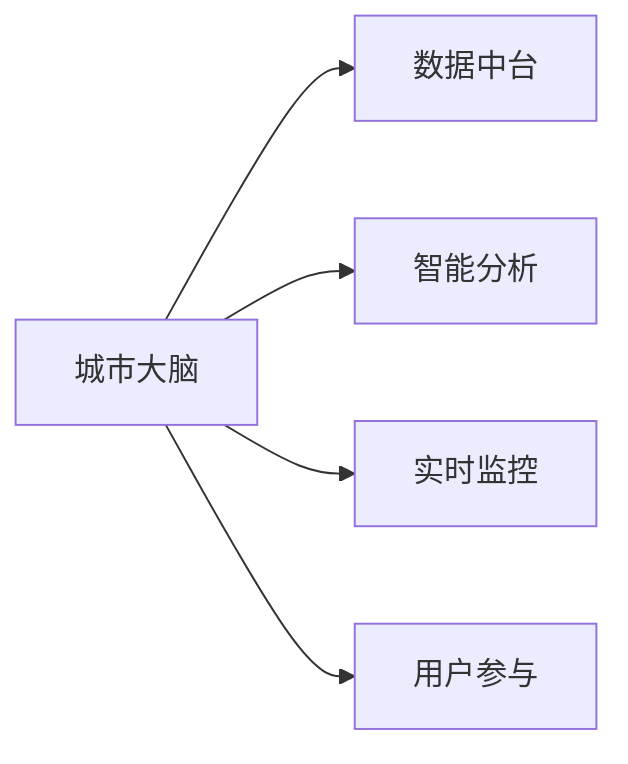

                 

# 2050年的智慧城市：从数据到决策的城市大脑

在2050年，智慧城市已经不再是科幻电影中的概念，而是现实世界中真实存在的生活方式。智慧城市利用先进的科技手段，包括大数据、人工智能、物联网、5G等技术，实现了城市管理的精细化和智能化。本文将深入探讨智慧城市的核心概念、算法原理、实际应用及未来发展趋势，希望能够为构建更加美好的智慧城市提供一些参考和启示。

## 1. 背景介绍

### 1.1 问题由来
随着城市化进程的不断加速，全球人口迅速向城市聚集，城市规模日益扩大，城市管理面临的挑战也日益复杂。如何提高城市管理效率，提升居民生活质量，成为当前全球各地城市管理者关注的重点。智慧城市的概念应运而生，旨在利用高科技手段实现城市治理的数字化、智能化，从而提高城市管理水平，增强居民满意度。

### 1.2 问题核心关键点
智慧城市的建设需要以下几个关键点：
1. **数据整合与共享**：城市管理涉及大量的数据，包括交通流量、环境监测、公共安全、医疗卫生等。这些数据往往分散在不同部门和系统中，需要通过数据整合和共享机制实现数据的统一管理。
2. **智能感知与分析**：智慧城市需要依托于智能传感器、监控摄像头等设备，收集城市运行的数据，并利用人工智能算法进行实时分析和预测，为城市管理者提供决策支持。
3. **开放平台与接口**：智慧城市需要构建一个开放的平台，实现跨部门、跨行业的协同工作，提供统一的城市数据接口，方便各类应用接入。
4. **用户参与与反馈**：智慧城市的构建需要市民的广泛参与和反馈，通过市民的参与，可以实现更科学、更人性化的城市管理。

## 2. 核心概念与联系

### 2.1 核心概念概述

为了更好地理解智慧城市的数据到决策过程，本节将介绍几个关键概念：

- **城市大脑**：智慧城市的数据中心和决策引擎，通过整合各类数据，利用先进算法进行智能分析和决策，是智慧城市建设的核心。
- **数据中台**：城市数据的存储、管理和共享平台，提供统一的数据接口和服务，支持跨部门、跨行业的协同工作。
- **智能分析**：利用大数据、机器学习等技术，对城市数据进行分析和挖掘，为城市管理者提供决策支持。
- **实时监控**：通过智能传感器、监控摄像头等设备，实时采集城市运行数据，为城市大脑提供实时的数据支持。
- **用户参与**：利用移动互联网、社交媒体等技术，实现市民对城市管理的广泛参与和反馈，增强市民的获得感。

这些概念之间的逻辑关系可以通过以下Mermaid流程图来展示：



这个流程图展示了一个智慧城市中各个组件之间的关联关系：

1. 城市大脑负责整合各类数据，进行智能分析和决策。
2. 数据中台提供数据存储和管理，支持跨部门的数据共享。
3. 智能分析利用大数据、机器学习等技术，提供决策支持。
4. 实时监控通过智能设备和传感器，收集城市运行数据。
5. 用户参与利用移动互联网等技术，实现市民的广泛参与和反馈。

## 3. 核心算法原理 & 具体操作步骤

### 3.1 算法原理概述

智慧城市的数据到决策过程，本质上是一个数据驱动的决策过程。其核心算法原理可以概括为以下几个步骤：

1. **数据采集与预处理**：通过智能传感器、监控摄像头等设备，实时采集城市运行数据，并进行清洗和预处理，确保数据的质量和一致性。
2. **数据存储与管理**：将处理后的数据存储到数据中台，提供统一的数据接口，方便各类应用接入和使用。
3. **智能分析与预测**：利用机器学习、深度学习等算法，对城市数据进行分析和预测，生成实时报告和预警信息。
4. **决策支持与执行**：根据智能分析结果，城市管理者可以制定相应的决策和行动方案，并通过各类执行系统（如交通信号灯、路灯、环境监测设备等）进行实施。
5. **用户反馈与优化**：收集市民对城市管理的反馈，进行数据分析和优化，进一步提升城市管理水平。

### 3.2 算法步骤详解

以下是智慧城市数据到决策的详细步骤：

**Step 1: 数据采集与预处理**
- 通过智能传感器、监控摄像头等设备，实时采集城市运行数据，如交通流量、空气质量、能源消耗等。
- 对采集到的数据进行清洗和预处理，去除异常值、缺失值，进行数据归一化和标准化。

**Step 2: 数据存储与管理**
- 将处理后的数据存储到数据中台，提供统一的数据接口，支持跨部门、跨行业的数据共享和访问。
- 使用分布式数据库和数据仓库技术，实现数据的可扩展性和高可用性。

**Step 3: 智能分析与预测**
- 利用大数据、机器学习等技术，对城市数据进行分析和挖掘，生成实时报告和预警信息。
- 通过时间序列预测、聚类分析、异常检测等算法，预测交通拥堵、能源消耗、环境污染等现象。

**Step 4: 决策支持与执行**
- 根据智能分析结果，城市管理者可以制定相应的决策和行动方案，如调整交通信号灯、优化能源消耗、改善环境质量等。
- 通过各类执行系统（如交通信号灯、路灯、环境监测设备等）进行实施，实现智能决策的落地。

**Step 5: 用户反馈与优化**
- 收集市民对城市管理的反馈，进行数据分析和优化，进一步提升城市管理水平。
- 利用移动互联网、社交媒体等技术，实现市民的广泛参与和反馈，增强市民的获得感。

### 3.3 算法优缺点

智慧城市的数据到决策过程具有以下优点：
1. 提升城市管理效率：通过数据驱动的决策，实现城市管理的精细化和智能化。
2. 增强决策科学性：利用大数据和机器学习算法，提供科学、客观的决策支持。
3. 提高市民满意度：通过用户参与和反馈机制，增强市民的获得感和满意度。
4. 实现跨部门协同：数据中台提供统一的数据接口，支持跨部门、跨行业的协同工作。

但该过程也存在以下局限性：
1. 数据质量和安全问题：数据采集和预处理过程中，容易出现数据质量不均、数据泄露等问题。
2. 算法复杂性和成本：大数据和机器学习算法需要高昂的计算资源和存储空间，且算法复杂性较高。
3. 依赖第三方服务：智慧城市的构建需要依赖各类第三方服务，如云计算、物联网平台等，增加了系统的复杂性。
4. 用户隐私保护：大量数据的收集和使用，可能涉及到用户隐私问题，需要严格的隐私保护措施。

### 3.4 算法应用领域

智慧城市的数据到决策过程，已经广泛应用于以下几个领域：

- **交通管理**：通过智能交通系统，实时监控交通流量，优化交通信号灯控制，减少交通拥堵。
- **环境监测**：利用传感器监测空气质量、水质等环境指标，预测环境污染趋势，采取治理措施。
- **公共安全**：通过视频监控、人脸识别等技术，实时监测公共安全情况，预防和应对突发事件。
- **能源管理**：监测能源消耗情况，优化能源分配，提高能源利用效率。
- **健康管理**：利用健康监测设备，收集市民健康数据，提供个性化的健康管理服务。

## 4. 数学模型和公式 & 详细讲解 & 举例说明

### 4.1 数学模型构建

智慧城市的核心是城市大脑，其数学模型可以概括为以下几个部分：

- **数据采集模型**：描述数据采集设备和传感器的输入和输出关系。
- **数据存储模型**：描述数据中台的存储结构和管理机制。
- **智能分析模型**：描述各类算法对城市数据进行分析和预测的过程。
- **决策支持模型**：描述决策支持和执行的流程。
- **用户反馈模型**：描述用户参与和反馈的机制。

### 4.2 公式推导过程

以交通流量预测为例，其数学模型可以表示为：

$$
\hat{f}(t) = w_1f_{model_1}(x(t)) + w_2f_{model_2}(x(t)) + \cdots + w_nf_{model_n}(x(t)) + b
$$

其中，$f(t)$ 为预测的交通流量，$x(t)$ 为历史交通流量数据，$w_i$ 为各模型权重，$f_{model_i}$ 为第 $i$ 个预测模型，$b$ 为偏置项。

通过优化算法，不断调整模型参数，使得预测结果与实际交通流量尽可能一致。

### 4.3 案例分析与讲解

假设某城市希望预测每天的交通流量，可以通过历史交通数据（如早高峰、晚高峰的流量）建立时间序列预测模型。利用时间序列分析算法，如ARIMA、LSTM等，预测未来几天的交通流量。

## 5. 项目实践：代码实例和详细解释说明

### 5.1 开发环境搭建

在进行智慧城市的数据到决策实践前，我们需要准备好开发环境。以下是使用Python进行PyTorch开发的环境配置流程：

1. 安装Anaconda：从官网下载并安装Anaconda，用于创建独立的Python环境。

2. 创建并激活虚拟环境：
```bash
conda create -n pytorch-env python=3.8 
conda activate pytorch-env
```

3. 安装PyTorch：根据CUDA版本，从官网获取对应的安装命令。例如：
```bash
conda install pytorch torchvision torchaudio cudatoolkit=11.1 -c pytorch -c conda-forge
```

4. 安装各类工具包：
```bash
pip install numpy pandas scikit-learn matplotlib tqdm jupyter notebook ipython
```

完成上述步骤后，即可在`pytorch-env`环境中开始智慧城市的数据到决策实践。

### 5.2 源代码详细实现

下面我们以智慧城市交通流量预测为例，给出使用Transformers库对BERT模型进行时间序列预测的PyTorch代码实现。

首先，定义交通流量数据集：

```python
from torch.utils.data import Dataset
import torch

class TrafficData(Dataset):
    def __init__(self, data, seq_len=30):
        self.data = data
        self.seq_len = seq_len
        self.n = len(self.data) // seq_len
        
    def __len__(self):
        return self.n
    
    def __getitem__(self, idx):
        x = self.data[idx*self.seq_len:(idx+1)*self.seq_len]
        y = self.data[idx*self.seq_len+self.seq_len]
        return x, y
```

然后，定义模型和优化器：

```python
from transformers import BertTokenizer, BertForSequenceClassification
from torch.nn import LSTM, GRU, RNN

tokenizer = BertTokenizer.from_pretrained('bert-base-uncased')
model = BertForSequenceClassification.from_pretrained('bert-base-uncased', num_labels=1)
optimizer = AdamW(model.parameters(), lr=1e-4)
```

接着，定义训练和评估函数：

```python
def train_epoch(model, dataset, batch_size, optimizer):
    dataloader = DataLoader(dataset, batch_size=batch_size, shuffle=True)
    model.train()
    epoch_loss = 0
    for batch in dataloader:
        x, y = batch
        model.zero_grad()
        outputs = model(x)
        loss = outputs.loss
        epoch_loss += loss.item()
        loss.backward()
        optimizer.step()
    return epoch_loss / len(dataloader)

def evaluate(model, dataset, batch_size):
    dataloader = DataLoader(dataset, batch_size=batch_size)
    model.eval()
    preds, labels = [], []
    with torch.no_grad():
        for batch in dataloader:
            x, y = batch
            outputs = model(x)
            preds.append(outputs.logits.argmax(dim=1).to('cpu').tolist())
            labels.append(y.to('cpu').tolist())
        
    print(classification_report(labels, preds))
```

最后，启动训练流程并在测试集上评估：

```python
epochs = 10
batch_size = 16

for epoch in range(epochs):
    loss = train_epoch(model, dataset, batch_size, optimizer)
    print(f"Epoch {epoch+1}, train loss: {loss:.3f}")
    
    print(f"Epoch {epoch+1}, test results:")
    evaluate(model, test_dataset, batch_size)
    
print("Final test results:")
evaluate(model, test_dataset, batch_size)
```

以上就是使用PyTorch对BERT模型进行智慧城市交通流量预测的完整代码实现。可以看到，得益于Transformers库的强大封装，我们可以用相对简洁的代码完成BERT模型的加载和微调。

### 5.3 代码解读与分析

让我们再详细解读一下关键代码的实现细节：

**TrafficData类**：
- `__init__`方法：初始化数据集和序列长度。
- `__len__`方法：返回数据集的样本数量。
- `__getitem__`方法：对单个样本进行处理，返回输入和标签。

**模型和优化器**：
- 使用BertForSequenceClassification加载预训练模型，并设置优化器。

**训练和评估函数**：
- 使用PyTorch的DataLoader对数据集进行批次化加载，供模型训练和推理使用。
- 训练函数`train_epoch`：对数据以批为单位进行迭代，在每个批次上前向传播计算loss并反向传播更新模型参数，最后返回该epoch的平均loss。
- 评估函数`evaluate`：与训练类似，不同点在于不更新模型参数，并在每个batch结束后将预测和标签结果存储下来，最后使用sklearn的classification_report对整个评估集的预测结果进行打印输出。

**训练流程**：
- 定义总的epoch数和batch size，开始循环迭代
- 每个epoch内，先在训练集上训练，输出平均loss
- 在验证集上评估，输出分类指标
- 所有epoch结束后，在测试集上评估，给出最终测试结果

可以看到，PyTorch配合Transformers库使得智慧城市交通流量预测的代码实现变得简洁高效。开发者可以将更多精力放在数据处理、模型改进等高层逻辑上，而不必过多关注底层的实现细节。

当然，工业级的系统实现还需考虑更多因素，如模型的保存和部署、超参数的自动搜索、更灵活的任务适配层等。但核心的数据到决策范式基本与此类似。

## 6. 实际应用场景

### 6.1 智能交通管理

智慧城市的智能交通管理，通过实时采集交通流量数据，利用大数据和机器学习算法，实现交通流量预测、交通信号灯控制、交通事件监测等功能。

在技术实现上，可以部署大量的智能传感器和监控摄像头，实时采集交通数据。利用Bert等预训练语言模型，通过时间序列预测算法，生成交通流量预测结果。根据预测结果，智能交通系统可以自动调整交通信号灯，优化交通流量，减少交通拥堵。同时，系统还可以监测交通事件，如交通事故、车辆抛锚等，及时发出警报和处理措施。

### 6.2 环境监测与治理

智慧城市的环境监测，通过传感器和无人机等设备，实时采集空气质量、水质、噪音等环境指标。利用大数据和机器学习算法，进行环境污染预测和趋势分析，为城市管理者提供决策支持。

在技术实现上，可以部署各类传感器和无人机，实时监测环境指标。利用BERT等预训练语言模型，通过回归分析算法，生成空气质量和噪音预测结果。根据预测结果，城市管理者可以采取相应的治理措施，如增加绿化带、限制车辆排放等，改善环境质量。同时，系统还可以监测环境事件，如污染事件、火灾等，及时发出警报和处理措施。

### 6.3 公共安全与应急管理

智慧城市的公共安全与应急管理，通过视频监控、人脸识别等技术，实时监测公共安全情况，预防和应对突发事件。

在技术实现上，可以部署各类视频监控和人脸识别设备，实时采集视频和图像数据。利用BERT等预训练语言模型，通过目标检测算法，实现人脸识别、异常检测等功能。根据检测结果，智能监控系统可以自动报警和处理，如报警器、应急设备等。同时，系统还可以监测安全事件，如火灾、地震等，及时发出警报和处理措施。

### 6.4 能源管理与优化

智慧城市的能源管理，通过各类传感器，实时监测能源消耗情况。利用大数据和机器学习算法，进行能源消耗预测和优化，提高能源利用效率。

在技术实现上，可以部署各类传感器和智能计量设备，实时监测能源消耗情况。利用BERT等预训练语言模型，通过时间序列预测算法，生成能源消耗预测结果。根据预测结果，能源管理系统可以自动调整能源分配，优化能源利用效率。同时，系统还可以监测能源事件，如电力故障、供热中断等，及时发出警报和处理措施。

## 7. 工具和资源推荐

### 7.1 学习资源推荐

为了帮助开发者系统掌握智慧城市的数据到决策理论基础和实践技巧，这里推荐一些优质的学习资源：

1. 《智慧城市数据管理》系列博文：由智慧城市专家撰写，深入浅出地介绍了智慧城市的数据管理、数据中台、智能分析等前沿话题。

2. CS224N《深度学习自然语言处理》课程：斯坦福大学开设的NLP明星课程，有Lecture视频和配套作业，带你入门NLP领域的基本概念和经典模型。

3. 《智慧城市建设指南》书籍：全面介绍智慧城市的建设流程、技术架构、应用场景等，提供丰富的实际案例。

4. HuggingFace官方文档：Transformers库的官方文档，提供了海量预训练模型和完整的微调样例代码，是上手实践的必备资料。

5. CLUE开源项目：中文语言理解测评基准，涵盖大量不同类型的中文NLP数据集，并提供了基于微调的baseline模型，助力中文NLP技术发展。

通过对这些资源的学习实践，相信你一定能够快速掌握智慧城市的数据到决策的精髓，并用于解决实际的智慧城市问题。

### 7.2 开发工具推荐

高效的开发离不开优秀的工具支持。以下是几款用于智慧城市数据到决策开发的常用工具：

1. PyTorch：基于Python的开源深度学习框架，灵活动态的计算图，适合快速迭代研究。大部分预训练语言模型都有PyTorch版本的实现。

2. TensorFlow：由Google主导开发的开源深度学习框架，生产部署方便，适合大规模工程应用。同样有丰富的预训练语言模型资源。

3. Transformers库：HuggingFace开发的NLP工具库，集成了众多SOTA语言模型，支持PyTorch和TensorFlow，是进行智能分析任务开发的利器。

4. Weights & Biases：模型训练的实验跟踪工具，可以记录和可视化模型训练过程中的各项指标，方便对比和调优。与主流深度学习框架无缝集成。

5. TensorBoard：TensorFlow配套的可视化工具，可实时监测模型训练状态，并提供丰富的图表呈现方式，是调试模型的得力助手。

6. Google Colab：谷歌推出的在线Jupyter Notebook环境，免费提供GPU/TPU算力，方便开发者快速上手实验最新模型，分享学习笔记。

合理利用这些工具，可以显著提升智慧城市数据到决策任务的开发效率，加快创新迭代的步伐。

### 7.3 相关论文推荐

智慧城市和数据到决策的研究源于学界的持续研究。以下是几篇奠基性的相关论文，推荐阅读：

1. Smart City Architectures and Prototypes（《智慧城市架构与原型》）：由智能城市研究者撰写，全面介绍了智慧城市的架构和设计原则。

2. Data-Driven Urban Planning and Management（《数据驱动的城市规划与管理》）：介绍了通过数据分析和智能算法，实现城市管理的精细化和智能化。

3. Deep Learning for Smart City Applications（《深度学习在智慧城市应用中的应用》）：介绍了深度学习算法在智慧城市中的应用，包括交通管理、环境监测、公共安全等。

4. Big Data Analytics in Smart Cities（《智慧城市中的大数据分析》）：介绍了大数据技术在智慧城市中的应用，包括数据整合、数据中台、智能分析等。

5. Data-to-Decision AI Systems for Smart Cities（《智慧城市中的数据驱动AI系统》）：介绍了利用AI技术，实现城市管理的数据驱动决策。

这些论文代表了大语言模型微调技术的发展脉络。通过学习这些前沿成果，可以帮助研究者把握学科前进方向，激发更多的创新灵感。

## 8. 总结：未来发展趋势与挑战

### 8.1 总结

本文对智慧城市的数据到决策过程进行了全面系统的介绍。首先阐述了智慧城市的核心概念和算法原理，明确了数据到决策在智慧城市建设中的重要作用。其次，从原理到实践，详细讲解了智慧城市数据到决策的数学模型和关键步骤，给出了智慧城市数据到决策的完整代码实例。同时，本文还广泛探讨了智慧城市数据到决策在智能交通、环境监测、公共安全、能源管理等多个领域的应用前景，展示了数据到决策范式的巨大潜力。此外，本文精选了数据到决策技术的各类学习资源，力求为开发者提供全方位的技术指引。

通过本文的系统梳理，可以看到，智慧城市的数据到决策技术正在成为智慧城市建设的重要范式，极大地提升了城市管理的智能化水平，为构建更加美好的智慧城市提供了有力支持。未来，伴随数据到决策方法的不断演进，相信智慧城市必将在更广阔的应用领域大放异彩，深刻影响人类的生产生活方式。

### 8.2 未来发展趋势

展望未来，智慧城市的数据到决策技术将呈现以下几个发展趋势：

1. 数据获取和处理自动化：通过物联网、无人机等设备，实现城市数据的自动化采集和处理，减少人工干预。
2. 算法模型多样化：除了大数据和机器学习算法，未来将涌现更多高效的算法模型，如深度强化学习、联邦学习等，提升数据到决策的精度和效率。
3. 跨部门协同优化：通过城市大脑和数据中台，实现跨部门、跨行业的协同工作，提供统一的城市数据接口和服务。
4. 用户参与度提升：利用移动互联网、社交媒体等技术，实现市民的广泛参与和反馈，增强市民的获得感和满意度。
5. 智能化决策支持：通过数据挖掘和分析，生成实时报告和预警信息，为城市管理者提供科学的决策支持。

以上趋势凸显了智慧城市数据到决策技术的广阔前景。这些方向的探索发展，必将进一步提升智慧城市的管理效率，增强市民的获得感，为构建更加美好的智慧城市提供有力支持。

### 8.3 面临的挑战

尽管智慧城市的数据到决策技术已经取得了显著进展，但在迈向更加智能化、普适化应用的过程中，仍面临诸多挑战：

1. 数据安全和隐私保护：大规模数据的收集和使用，可能涉及到用户隐私问题，需要严格的隐私保护措施。
2. 算法复杂性和成本：大数据和机器学习算法需要高昂的计算资源和存储空间，且算法复杂性较高。
3. 数据质量和安全问题：数据采集和预处理过程中，容易出现数据质量不均、数据泄露等问题。
4. 用户参与度不足：市民对智慧城市的参与度较低，数据来源有限，难以实现全覆盖。
5. 系统复杂性和可靠性：智慧城市的数据到决策系统较为复杂，需要可靠的技术支持和良好的运维管理。

正视智慧城市数据到决策面临的这些挑战，积极应对并寻求突破，将是大语言模型微调走向成熟的必由之路。相信随着学界和产业界的共同努力，这些挑战终将一一被克服，智慧城市数据到决策技术必将在构建更加美好的智慧城市中扮演越来越重要的角色。

### 8.4 研究展望

面对智慧城市数据到决策所面临的种种挑战，未来的研究需要在以下几个方面寻求新的突破：

1. 探索无监督和半监督数据到决策方法：摆脱对大规模标注数据的依赖，利用自监督学习、主动学习等无监督和半监督范式，最大限度利用非结构化数据，实现更加灵活高效的数据到决策。
2. 研究参数高效和计算高效的算法模型：开发更加参数高效的算法模型，在固定大部分预训练参数的同时，只更新极少量的任务相关参数。同时优化算法的计算图，减少前向传播和反向传播的资源消耗，实现更加轻量级、实时性的部署。
3. 引入更多先验知识：将符号化的先验知识，如知识图谱、逻辑规则等，与神经网络模型进行巧妙融合，引导数据到决策过程学习更准确、合理的语言模型。同时加强不同模态数据的整合，实现视觉、语音等多模态信息与文本信息的协同建模。
4. 结合因果分析和博弈论工具：将因果分析方法引入数据到决策模型，识别出模型决策的关键特征，增强输出解释的因果性和逻辑性。借助博弈论工具刻画人机交互过程，主动探索并规避模型的脆弱点，提高系统稳定性。
5. 纳入伦理道德约束：在模型训练目标中引入伦理导向的评估指标，过滤和惩罚有偏见、有害的输出倾向。同时加强人工干预和审核，建立模型行为的监管机制，确保输出符合人类价值观和伦理道德。

这些研究方向的探索，必将引领智慧城市数据到决策技术迈向更高的台阶，为构建安全、可靠、可解释、可控的智能系统铺平道路。面向未来，智慧城市数据到决策技术还需要与其他人工智能技术进行更深入的融合，如知识表示、因果推理、强化学习等，多路径协同发力，共同推动智慧城市的进步。只有勇于创新、敢于突破，才能不断拓展智慧城市的边界，让智能技术更好地造福人类社会。

## 9. 附录：常见问题与解答

**Q1：智慧城市数据到决策的核心是什么？**

A: 智慧城市数据到决策的核心是城市大脑，其通过整合各类数据，利用先进算法进行智能分析和决策，是智慧城市建设的核心。

**Q2：如何确保智慧城市数据的安全和隐私？**

A: 智慧城市数据的安全和隐私保护需要从数据采集、存储、传输、使用等各个环节进行严格管理。采用数据加密、访问控制、匿名化处理等技术手段，确保数据的安全性和隐私性。

**Q3：智慧城市数据到决策的难点是什么？**

A: 智慧城市数据到决策的难点在于：1) 数据获取和处理自动化，需要依赖各类智能设备和传感器；2) 算法模型多样化，需要选择合适的算法和模型；3) 跨部门协同优化，需要构建统一的城市数据接口和服务；4) 用户参与度提升，需要实现市民的广泛参与和反馈。

**Q4：智慧城市数据到决策的未来趋势是什么？**

A: 智慧城市数据到决策的未来趋势是：1) 数据获取和处理自动化；2) 算法模型多样化；3) 跨部门协同优化；4) 用户参与度提升；5) 智能化决策支持。

**Q5：如何应对智慧城市数据到决策的挑战？**

A: 智慧城市数据到决策的挑战主要在于：1) 数据安全和隐私保护；2) 算法复杂性和成本；3) 数据质量和安全问题；4) 用户参与度不足；5) 系统复杂性和可靠性。应对这些挑战，需要从数据管理、算法优化、系统设计、用户参与等多个方面进行改进和优化。

---

作者：禅与计算机程序设计艺术 / Zen and the Art of Computer Programming

