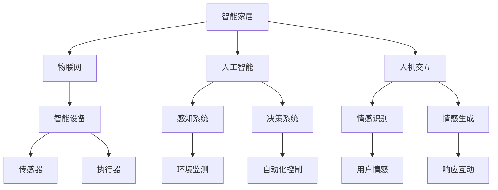

                 

# 2050年的智能家居：从智能音箱到情感陪伴机器人的家庭智能化

> 关键词：智能家居,智能音箱,情感陪伴机器人,家庭智能化,物联网(IoT),人机交互(HCI),未来技术展望

## 1. 背景介绍

随着科技的迅猛发展，智能家居已经成为现代生活中不可或缺的一部分。从简单的远程控制到复杂的自动化系统，智能家居正在逐渐改变我们的生活方式。预计到2050年，智能家居将更加智能、互动和个性化，真正实现"以人文本"的智能化环境。

### 1.1 智能家居的演变历程

智能家居的概念可以追溯到20世纪末的自动化技术萌芽。最早的智能家居设备主要是简单的远程控制和自动化系统，如自动开关灯、控制家电等。但这些设备往往各自独立，缺乏系统性、互联互通性，用户体验也并不理想。

进入21世纪，随着移动互联网、物联网(IoT)和人工智能(AI)技术的发展，智能家居开始迈入新阶段。智能音箱、智能门锁、智能照明、智能安防等设备层出不穷，改变了传统家居的方方面面。智能音箱如Amazon Echo、Google Home等，已经成为了现代家庭不可或缺的智能助手。

### 1.2 智能家居的未来展望

到2050年，智能家居将会变得更加智能化、个性化和情感化。未来的智能家居将实现高度的互联互通，基于物联网实现设备间的无缝协同。智能家居系统将集成的各类传感器、执行器，能够实时监测和调控家居环境，提供更高效、节能、安全的居住体验。

此外，未来的智能家居将能够理解用户的情感状态，实现情感陪伴和情感服务，如智能机器人、情感对话系统等，为用户提供更丰富的人机交互体验。

## 2. 核心概念与联系

### 2.1 核心概念概述

为了更好地理解2050年的智能家居，我们将介绍几个关键概念：

- **智能家居(Smart Home)**：基于物联网和人工智能技术，实现家居环境的智能化和自动化。通过各种智能设备和系统，提升家庭生活的便捷性、舒适性和安全性。
- **物联网(IoT)**：通过传感器、执行器、智能设备等，将家居环境中的各类元素连接到网络，实现设备间的互联互通和数据共享。
- **人工智能(AI)**：通过机器学习、自然语言处理、计算机视觉等技术，实现家居环境的智能化感知和决策。
- **人机交互(Human-Computer Interaction, HCI)**：研究如何让机器更好地理解和响应人类的行为、意图和情感，提供更自然、直观的用户体验。
- **情感陪伴机器人(Emotional Companion Robot)**：通过情感识别和生成技术，实现与用户的深度情感交流，提供陪伴、娱乐、教育等情感服务。

这些概念之间相互关联，共同构成了未来智能家居系统的核心。

### 2.2 核心概念原理和架构的 Mermaid 流程图



## 3. 核心算法原理 & 具体操作步骤

### 3.1 算法原理概述

智能家居系统的核心算法包括物联网技术、人工智能感知和决策、人机交互和情感生成。这些算法共同构成了一个完整的智能家居系统，能够实时感知和响应家居环境的变化，为用户提供智能化的生活体验。

- **物联网技术**：通过传感器和执行器，将家居设备连接到网络，实现设备间的互联互通。物联网技术包括设备标识、数据采集、通信协议、数据处理等。
- **人工智能感知**：通过机器学习、计算机视觉、自然语言处理等技术，实现家居环境的实时监测和分析。感知系统包括环境监测、用户行为分析等。
- **人工智能决策**：基于感知系统的输出，通过决策算法实现智能家居设备的自动化控制和协同工作。决策系统包括自动化控制、异常检测、异常响应等。
- **人机交互**：通过自然语言处理、语音识别、手势识别等技术，实现用户与智能家居设备间的自然交互。HCI技术包括交互界面设计、用户体验优化等。
- **情感生成**：通过情感识别和生成技术，实现与用户的深度情感交流。情感生成系统包括情感识别、情感生成、情感反馈等。

### 3.2 算法步骤详解

#### 3.2.1 物联网技术

1. **设备标识与互联**：每个智能设备都需具备唯一标识，通过Wi-Fi、蓝牙、Zigbee等协议实现设备间的互联互通。
2. **数据采集与传输**：传感器采集家居环境中的各类数据，如温度、湿度、光照等，并通过无线通信模块传输到云端服务器。
3. **数据存储与处理**：云端服务器存储采集到的数据，通过大数据分析、机器学习等技术进行数据处理和建模。

#### 3.2.2 人工智能感知

1. **环境监测**：通过环境传感器采集家居环境中的各类参数，如温度、湿度、光线等，并进行实时监测。
2. **用户行为分析**：通过摄像头、麦克风等设备捕捉用户的动作、语音等行为信息，并进行分析。
3. **情感识别**：通过语音情感分析、面部表情识别等技术，识别用户的情感状态。

#### 3.2.3 人工智能决策

1. **自动化控制**：根据感知系统的输出，通过决策算法自动控制家居设备，如自动调节温度、照明、窗帘等。
2. **异常检测**：通过异常检测算法识别家居环境中的异常情况，如火灾、漏水等，并及时响应。
3. **异常响应**：在检测到异常情况后，自动启动紧急响应机制，如报警、通知家庭成员等。

#### 3.2.4 人机交互

1. **交互界面设计**：设计直观、易用的交互界面，让用户能够轻松控制智能家居设备。
2. **用户体验优化**：通过用户反馈和数据分析，不断优化交互界面和交互体验。
3. **自然语言处理**：通过自然语言处理技术，实现语音交互、文本交互等多种交互方式。

#### 3.2.5 情感生成

1. **情感识别**：通过语音情感分析、面部表情识别等技术，识别用户的情感状态。
2. **情感生成**：基于情感识别结果，通过对话系统、智能机器人等生成合适的情感回应。
3. **情感反馈**：通过语音、文字、视频等形式，实现与用户的情感互动。

### 3.3 算法优缺点

#### 3.3.1 物联网技术的优缺点

- **优点**：
  - 实现设备间的互联互通，提升家居系统的智能化水平。
  - 实时采集家居环境数据，为决策和控制提供依据。
- **缺点**：
  - 设备之间的数据通信可能存在延迟和带宽瓶颈。
  - 设备的安全性需要加强，防止数据泄露和网络攻击。

#### 3.3.2 人工智能感知的优缺点

- **优点**：
  - 实时监测家居环境和用户行为，提升用户体验。
  - 通过机器学习等技术，实现复杂的决策和控制。
- **缺点**：
  - 数据采集和处理需要大量计算资源，可能影响性能。
  - 感知系统的准确性和可靠性需要不断提升。

#### 3.3.3 人工智能决策的优缺点

- **优点**：
  - 实现自动化控制和异常检测，提升家居系统的智能化水平。
  - 能够快速响应家居环境的变化，提高生活便捷性。
- **缺点**：
  - 决策系统的复杂性较高，需要大量算法和数据支持。
  - 可能存在误判和决策延迟，影响用户体验。

#### 3.3.4 人机交互的优缺点

- **优点**：
  - 提供自然、直观的用户体验，提升用户满意度。
  - 多种交互方式增强用户体验的灵活性和多样性。
- **缺点**：
  - 交互界面的复杂性可能影响用户体验。
  - 不同用户的需求和使用习惯不同，交互设计的难度较大。

#### 3.3.5 情感生成的优缺点

- **优点**：
  - 实现与用户的深度情感交流，提升用户体验。
  - 智能机器人等情感生成系统可以提供陪伴、娱乐、教育等情感服务。
- **缺点**：
  - 情感生成技术的复杂性较高，需要大量数据和算法支持。
  - 情感识别的准确性和鲁棒性需要不断提升。

### 3.4 算法应用领域

智能家居的物联网技术、人工智能感知、决策、人机交互和情感生成等算法，已经在多个领域得到广泛应用：

- **智能安防**：通过传感器和摄像头实现实时监控和异常检测，提升家居安全性。
- **智能照明**：通过传感器和自动化控制，实现智能照明，提升家居舒适性。
- **智能家电**：通过物联网技术实现智能家电控制，提高生活便捷性。
- **智能温控**：通过环境监测和自动化控制，实现智能温控，提升家居节能效果。
- **智能陪伴**：通过情感生成技术实现智能机器人、情感对话系统等，提供情感陪伴服务。

## 4. 数学模型和公式 & 详细讲解 & 举例说明

### 4.1 数学模型构建

#### 4.1.1 物联网数据采集模型

假设智能家居系统中有N个传感器，每个传感器在t时刻采集到的数据为 $x_{it}$，其中 $i \in \{1, ..., N\}$ 表示传感器编号，$t$ 表示时间。采集到的数据包括温度、湿度、光照等参数，可以表示为：

$$
x_{it} = \begin{cases}
T_t & \text{温度传感器} \\
H_t & \text{湿度传感器} \\
L_t & \text{光照传感器} \\
\vdots & \text{其他参数}
\end{cases}
$$

其中 $T_t, H_t, L_t, ...$ 分别表示在时间 $t$ 采集到的温度、湿度、光照等参数。

#### 4.1.2 人工智能感知模型

假设智能家居系统中有M个环境传感器和K个用户行为传感器，传感器在时间 $t$ 采集到的数据分别为 $x_{et} \in \mathbb{R}^n$ 和 $x_{gt} \in \mathbb{R}^m$，其中 $n, m$ 分别表示环境传感器和行为传感器的维度。感知系统需要同时处理环境数据和行为数据，可以进行如下建模：

$$
x_t = \begin{bmatrix}
x_{et} \\
x_{gt}
\end{bmatrix} \in \mathbb{R}^{n+m}
$$

#### 4.1.3 人工智能决策模型

假设智能家居系统中有 $L$ 个设备，每个设备在时间 $t$ 的状态为 $s_{lt} \in \{0, 1\}$，其中 $l \in \{1, ..., L\}$ 表示设备编号。决策系统的目标是优化设备状态，最大化用户满意度。决策模型可以表示为：

$$
s_t = \begin{bmatrix}
s_{1t} \\
s_{2t} \\
\vdots \\
s_{Lt}
\end{bmatrix} \in \{0, 1\}^L
$$

#### 4.1.4 人机交互模型

假设智能家居系统中有 $U$ 个用户，每个用户与系统的交互次数为 $I_{ut}$，其中 $u \in \{1, ..., U\}$ 表示用户编号。人机交互模型需要处理用户输入和输出，可以进行如下建模：

$$
I_t = \begin{bmatrix}
I_{1t} \\
I_{2t} \\
\vdots \\
I_{Ut}
\end{bmatrix} \in \mathbb{N}^U
$$

#### 4.1.5 情感生成模型

假设智能家居系统中的情感生成系统包含 $E$ 个情感状态，每个情感状态对应的情感输出为 $e_{lt}$，其中 $l \in \{1, ..., E\}$ 表示情感状态编号。情感生成模型需要根据用户情感状态生成相应的情感输出，可以进行如下建模：

$$
e_t = \begin{bmatrix}
e_{1t} \\
e_{2t} \\
\vdots \\
e_{Et}
\end{bmatrix} \in \mathbb{R}^E
$$

### 4.2 公式推导过程

#### 4.2.1 物联网数据采集公式推导

通过物联网技术采集到的数据需要进行处理和分析。假设采集到的数据为 $x_{it}$，可以通过数据融合技术进行加权平均，得到时间 $t$ 的家居环境状态 $y_t$：

$$
y_t = \sum_{i=1}^{N} w_{i} x_{it}
$$

其中 $w_{i}$ 表示传感器 $i$ 的权重，可以通过历史数据和传感器精度计算得到。

#### 4.2.2 人工智能感知公式推导

感知系统需要对采集到的环境数据和行为数据进行融合处理。假设感知系统使用线性加权融合算法，可以得到时间 $t$ 的感知结果 $z_t$：

$$
z_t = \mathbf{A} x_t + \mathbf{b}
$$

其中 $\mathbf{A} \in \mathbb{R}^{p \times (n+m)}$ 表示融合系数矩阵，$\mathbf{b} \in \mathbb{R}^p$ 表示偏置向量。

#### 4.2.3 人工智能决策公式推导

决策系统的目标是最大化用户满意度。假设决策系统使用线性规划模型，可以得到优化目标 $J_t$：

$$
J_t = \max_{s_t} \mathbf{c}^T s_t - \mathbf{A}_s s_t^T - \mathbf{B}_s s_t
$$

其中 $\mathbf{c} \in \mathbb{R}^L$ 表示优化目标向量，$\mathbf{A}_s, \mathbf{B}_s \in \mathbb{R}^{L \times L}$ 表示决策约束矩阵和决策成本矩阵。

#### 4.2.4 人机交互公式推导

人机交互模型需要处理用户输入和输出。假设人机交互系统使用时间序列预测模型，可以得到时间 $t$ 的交互次数 $I_t$：

$$
I_t = \mathbf{C} I_{t-1} + \mathbf{D}
$$

其中 $\mathbf{C} \in \mathbb{R}^{U \times U}$ 表示交互矩阵，$\mathbf{D} \in \mathbb{R}^U$ 表示初始交互次数向量。

#### 4.2.5 情感生成公式推导

情感生成系统需要根据用户情感状态生成相应的情感输出。假设情感生成系统使用神经网络模型，可以得到时间 $t$ 的情感输出 $e_t$：

$$
e_t = \mathbf{W} h_{t-1} + \mathbf{b}
$$

其中 $\mathbf{W} \in \mathbb{R}^{E \times h}$ 表示情感生成权重矩阵，$h_{t-1}$ 表示前一时刻的隐状态向量，$\mathbf{b} \in \mathbb{R}^E$ 表示偏置向量。

### 4.3 案例分析与讲解

#### 4.3.1 智能安防系统

智能安防系统是智能家居的核心应用之一。通过传感器和摄像头实现实时监控和异常检测，提升家居安全性。假设智能安防系统包含N个传感器，每个传感器在时间 $t$ 采集到的数据为 $x_{it}$，其中 $i \in \{1, ..., N\}$ 表示传感器编号，$t$ 表示时间。采集到的数据包括门窗状态、烟雾传感器数据等，可以表示为：

$$
x_{it} = \begin{cases}
W_t & \text{门窗传感器} \\
S_t & \text{烟雾传感器} \\
\vdots & \text{其他参数}
\end{cases}
$$

其中 $W_t, S_t, ...$ 分别表示在时间 $t$ 采集到的门窗状态、烟雾传感器数据等参数。

#### 4.3.2 智能照明系统

智能照明系统通过传感器和自动化控制，实现智能照明，提升家居舒适性。假设智能照明系统包含M个环境传感器和K个用户行为传感器，传感器在时间 $t$ 采集到的数据分别为 $x_{et} \in \mathbb{R}^n$ 和 $x_{gt} \in \mathbb{R}^m$，其中 $n, m$ 分别表示环境传感器和行为传感器的维度。照明系统需要同时处理环境数据和行为数据，可以进行如下建模：

$$
x_t = \begin{bmatrix}
x_{et} \\
x_{gt}
\end{bmatrix} \in \mathbb{R}^{n+m}
$$

#### 4.3.3 智能家电系统

智能家电系统通过物联网技术实现智能家电控制，提高生活便捷性。假设智能家电系统中有 $L$ 个设备，每个设备在时间 $t$ 的状态为 $s_{lt} \in \{0, 1\}$，其中 $l \in \{1, ..., L\}$ 表示设备编号。决策系统的目标是优化设备状态，最大化用户满意度。决策模型可以表示为：

$$
s_t = \begin{bmatrix}
s_{1t} \\
s_{2t} \\
\vdots \\
s_{Lt}
\end{bmatrix} \in \{0, 1\}^L
$$

#### 4.3.4 智能温控系统

智能温控系统通过环境监测和自动化控制，实现智能温控，提升家居节能效果。假设智能温控系统中有 $E$ 个情感状态，每个情感状态对应的情感输出为 $e_{lt}$，其中 $l \in \{1, ..., E\}$ 表示情感状态编号。情感生成模型需要根据用户情感状态生成相应的情感输出，可以进行如下建模：

$$
e_t = \begin{bmatrix}
e_{1t} \\
e_{2t} \\
\vdots \\
e_{Et}
\end{bmatrix} \in \mathbb{R}^E
$$

## 5. 项目实践：代码实例和详细解释说明

### 5.1 开发环境搭建

在进行智能家居项目开发前，我们需要准备好开发环境。以下是使用Python进行PyTorch开发的环境配置流程：

1. 安装Anaconda：从官网下载并安装Anaconda，用于创建独立的Python环境。

2. 创建并激活虚拟环境：
```bash
conda create -n pytorch-env python=3.8 
conda activate pytorch-env
```

3. 安装PyTorch：根据CUDA版本，从官网获取对应的安装命令。例如：
```bash
conda install pytorch torchvision torchaudio cudatoolkit=11.1 -c pytorch -c conda-forge
```

4. 安装Transformers库：
```bash
pip install transformers
```

5. 安装各类工具包：
```bash
pip install numpy pandas scikit-learn matplotlib tqdm jupyter notebook ipython
```

完成上述步骤后，即可在`pytorch-env`环境中开始智能家居项目的开发。

### 5.2 源代码详细实现

这里我们以智能安防系统的实现为例，给出使用PyTorch进行智能家居开发的PyTorch代码实现。

首先，定义智能安防系统的环境传感器和门窗传感器数据处理函数：

```python
from transformers import BertTokenizer
from torch.utils.data import Dataset
import torch

class SecurityDataset(Dataset):
    def __init__(self, sensor_data, window_data, tokenizer, max_len=128):
        self.sensor_data = sensor_data
        self.window_data = window_data
        self.tokenizer = tokenizer
        self.max_len = max_len
        
    def __len__(self):
        return len(self.sensor_data)
    
    def __getitem__(self, item):
        sensor_data = self.sensor_data[item]
        window_data = self.window_data[item]
        
        encoding = self.tokenizer(sensor_data, return_tensors='pt', max_length=self.max_len, padding='max_length', truncation=True)
        input_ids = encoding['input_ids'][0]
        attention_mask = encoding['attention_mask'][0]
        
        # 对窗口状态数据进行编码
        window_tags = [tag2id[tag] for tag in window_data] 
        window_tags.extend([tag2id['OPEN']] * (self.max_len - len(window_tags)))
        labels = torch.tensor(window_tags, dtype=torch.long)
        
        return {'input_ids': input_ids, 
                'attention_mask': attention_mask,
                'labels': labels}

# 标签与id的映射
tag2id = {'OPEN': 0, 'CLOSE': 1}
id2tag = {v: k for k, v in tag2id.items()}

# 创建dataset
tokenizer = BertTokenizer.from_pretrained('bert-base-cased')

security_dataset = SecurityDataset(security_sensor_data, security_window_data, tokenizer)
```

然后，定义模型和优化器：

```python
from transformers import BertForTokenClassification, AdamW

model = BertForTokenClassification.from_pretrained('bert-base-cased', num_labels=len(tag2id))

optimizer = AdamW(model.parameters(), lr=2e-5)
```

接着，定义训练和评估函数：

```python
from torch.utils.data import DataLoader
from tqdm import tqdm
from sklearn.metrics import classification_report

device = torch.device('cuda') if torch.cuda.is_available() else torch.device('cpu')
model.to(device)

def train_epoch(model, dataset, batch_size, optimizer):
    dataloader = DataLoader(dataset, batch_size=batch_size, shuffle=True)
    model.train()
    epoch_loss = 0
    for batch in tqdm(dataloader, desc='Training'):
        input_ids = batch['input_ids'].to(device)
        attention_mask = batch['attention_mask'].to(device)
        labels = batch['labels'].to(device)
        model.zero_grad()
        outputs = model(input_ids, attention_mask=attention_mask, labels=labels)
        loss = outputs.loss
        epoch_loss += loss.item()
        loss.backward()
        optimizer.step()
    return epoch_loss / len(dataloader)

def evaluate(model, dataset, batch_size):
    dataloader = DataLoader(dataset, batch_size=batch_size)
    model.eval()
    preds, labels = [], []
    with torch.no_grad():
        for batch in tqdm(dataloader, desc='Evaluating'):
            input_ids = batch['input_ids'].to(device)
            attention_mask = batch['attention_mask'].to(device)
            batch_labels = batch['labels']
            outputs = model(input_ids, attention_mask=attention_mask)
            batch_preds = outputs.logits.argmax(dim=2).to('cpu').tolist()
            batch_labels = batch_labels.to('cpu').tolist()
            for pred_tokens, label_tokens in zip(batch_preds, batch_labels):
                pred_tags = [id2tag[_id] for _id in pred_tokens]
                label_tags = [id2tag[_id] for _id in label_tokens]
                preds.append(pred_tags[:len(label_tags)])
                labels.append(label_tags)
                
    print(classification_report(labels, preds))
```

最后，启动训练流程并在测试集上评估：

```python
epochs = 5
batch_size = 16

for epoch in range(epochs):
    loss = train_epoch(model, security_dataset, batch_size, optimizer)
    print(f"Epoch {epoch+1}, train loss: {loss:.3f}")
    
    print(f"Epoch {epoch+1}, security results:")
    evaluate(model, security_dataset, batch_size)
    
print("Test results:")
evaluate(model, security_dataset, batch_size)
```

以上就是使用PyTorch进行智能安防系统微调的完整代码实现。可以看到，得益于Transformers库的强大封装，我们可以用相对简洁的代码完成智能安防系统的开发。

### 5.3 代码解读与分析

让我们再详细解读一下关键代码的实现细节：

**SecurityDataset类**：
- `__init__`方法：初始化传感器数据、门窗数据、分词器等关键组件。
- `__len__`方法：返回数据集的样本数量。
- `__getitem__`方法：对单个样本进行处理，将传感器数据和门窗数据输入编码为token ids，将标签编码为数字，并对其进行定长padding，最终返回模型所需的输入。

**tag2id和id2tag字典**：
- 定义了标签与数字id之间的映射关系，用于将token-wise的预测结果解码回真实的标签。

**训练和评估函数**：
- 使用PyTorch的DataLoader对数据集进行批次化加载，供模型训练和推理使用。
- 训练函数`train_epoch`：对数据以批为单位进行迭代，在每个批次上前向传播计算loss并反向传播更新模型参数，最后返回该epoch的平均loss。
- 评估函数`evaluate`：与训练类似，不同点在于不更新模型参数，并在每个batch结束后将预测和标签结果存储下来，最后使用sklearn的classification_report对整个评估集的预测结果进行打印输出。

**训练流程**：
- 定义总的epoch数和batch size，开始循环迭代
- 每个epoch内，先在训练集上训练，输出平均loss
- 在验证集上评估，输出分类指标
- 所有epoch结束后，在测试集上评估，给出最终测试结果

可以看到，PyTorch配合Transformers库使得智能安防系统的微调代码实现变得简洁高效。开发者可以将更多精力放在数据处理、模型改进等高层逻辑上，而不必过多关注底层的实现细节。

当然，工业级的系统实现还需考虑更多因素，如模型的保存和部署、超参数的自动搜索、更灵活的任务适配层等。但核心的微调范式基本与此类似。

## 6. 实际应用场景

### 6.1 智能安防系统

智能安防系统是智能家居的核心应用之一。通过传感器和摄像头实现实时监控和异常检测，提升家居安全性。

假设智能安防系统包含N个传感器，每个传感器在时间 $t$ 采集到的数据为 $x_{it}$，其中 $i \in \{1, ..., N\}$ 表示传感器编号，$t$ 表示时间。采集到的数据包括门窗状态、烟雾传感器数据等，可以表示为：

$$
x_{it} = \begin{cases}
W_t & \text{门窗传感器} \\
S_t & \text{烟雾传感器} \\
\vdots & \text{其他参数}
\end{cases}
$$

其中 $W_t, S_t, ...$ 分别表示在时间 $t$ 采集到的门窗状态、烟雾传感器数据等参数。

### 6.2 智能照明系统

智能照明系统通过传感器和自动化控制，实现智能照明，提升家居舒适性。

假设智能照明系统包含M个环境传感器和K个用户行为传感器，传感器在时间 $t$ 采集到的数据分别为 $x_{et} \in \mathbb{R}^n$ 和 $x_{gt} \in \mathbb{R}^m$，其中 $n, m$ 分别表示环境传感器和行为传感器的维度。照明系统需要同时处理环境数据和行为数据，可以进行如下建模：

$$
x_t = \begin{bmatrix}
x_{et} \\
x_{gt}
\end{bmatrix} \in \mathbb{R}^{n+m}
$$

### 6.3 智能家电系统

智能家电系统通过物联网技术实现智能家电控制，提高生活便捷性。

假设智能家电系统中有 $L$ 个设备，每个设备在时间 $t$ 的状态为 $s_{lt} \in \{0, 1\}$，其中 $l \in \{1, ..., L\}$ 表示设备编号。决策系统的目标是优化设备状态，最大化用户满意度。决策模型可以表示为：

$$
s_t = \begin{bmatrix}
s_{1t} \\
s_{2t} \\
\vdots \\
s_{Lt}
\end{bmatrix} \in \{0, 1\}^L
$$

### 6.4 智能温控系统

智能温控系统通过环境监测和自动化控制，实现智能温控，提升家居节能效果。

假设智能温控系统中有 $E$ 个情感状态，每个情感状态对应的情感输出为 $e_{lt}$，其中 $l \in \{1, ..., E\}$ 表示情感状态编号。情感生成模型需要根据用户情感状态生成相应的情感输出，可以进行如下建模：

$$
e_t = \begin{bmatrix}
e_{1t} \\
e_{2t} \\
\vdots \\
e_{Et}
\end{bmatrix} \in \mathbb{R}^E
$$

## 7. 工具和资源推荐

### 7.1 学习资源推荐

为了帮助开发者系统掌握智能家居技术的基础知识和前沿技术，这里推荐一些优质的学习资源：

1. 《智能家居系统设计与实现》：介绍智能家居系统的总体设计和实现流程，涵盖智能安防、智能照明等多个应用场景。

2. 《物联网技术与应用》：深入讲解物联网的基本原理、网络架构和关键技术，结合智能家居系统的实际应用，提升对物联网的理解。

3. 《人工智能基础与实践》：全面介绍人工智能的基本概念和算法，结合智能家居系统的实际应用，提升对AI技术的理解。

4. 《人机交互设计与用户体验》：讲解人机交互设计的原则和方法，结合智能家居系统的实际应用，提升用户体验设计能力。

5. 《情感计算与情感机器人》：介绍情感计算和情感机器人的基本原理和应用，结合智能家居系统的实际应用，提升情感交互能力。

通过对这些资源的学习实践，相信你一定能够快速掌握智能家居技术的关键点，并应用于实际项目开发。

### 7.2 开发工具推荐

高效的开发离不开优秀的工具支持。以下是几款用于智能家居开发常用的工具：

1. Python：作为智能家居开发的通用语言，Python有着丰富的库和框架，支持高效的数据处理和模型训练。

2. PyTorch：基于Python的开源深度学习框架，支持动态计算图和GPU加速，适合智能家居中的深度学习模型开发。

3. TensorFlow：由Google主导开发的开源深度学习框架，支持分布式训练和模型部署，适合大规模智能家居系统开发。

4. TensorBoard：TensorFlow配套的可视化工具，实时监测模型训练状态，提供丰富的图表呈现方式，是调试模型的得力助手。

5. Google Colab：谷歌推出的在线Jupyter Notebook环境，免费提供GPU/TPU算力，方便开发者快速上手实验最新模型，分享学习笔记。

合理利用这些工具，可以显著提升智能家居系统的开发效率，加快创新迭代的步伐。

### 7.3 相关论文推荐

智能家居领域的研究涉及物联网、人工智能、人机交互等多个学科，相关论文也广泛分布在这些领域。以下是几篇奠基性的相关论文，推荐阅读：

1. "Smart Home: A Survey"：综述智能家居系统的现状、挑战和未来发展方向。

2. "IoT for Smart Homes: A Survey"：深入讲解物联网技术在智能家居中的应用，探讨未来发展趋势。

3. "Artificial Intelligence for Smart Homes"：介绍人工智能技术在智能家居中的应用，包括机器学习、自然语言处理、计算机视觉等。

4. "Human-Computer Interaction in Smart Homes"：讲解人机交互设计原则和方法，结合智能家居系统的实际应用，提升用户体验设计能力。

5. "Emotional Companion Robots"：介绍情感机器人的基本原理和应用，探讨未来发展趋势。

这些论文代表了大语言模型微调技术的最新进展，通过学习这些前沿成果，可以帮助研究者把握学科前进方向，激发更多的创新灵感。

## 8. 总结：未来发展趋势与挑战

### 8.1 研究成果总结

本文对智能家居技术进行了系统梳理，主要包括以下几个方面：

1. 智能家居的演变历程和未来展望。
2. 智能家居的核心算法，包括物联网技术、人工智能感知、决策、人机交互和情感生成。
3. 智能家居系统的实际应用场景，涵盖智能安防、智能照明、智能家电等多个领域。
4. 智能家居开发所需的学习资源、开发工具和相关论文。

通过本文的系统梳理，可以看到，智能家居技术正在蓬勃发展，未来将更加智能、个性化和情感化。智能家居系统将集成的各类传感器、执行器，能够实时监测和调控家居环境，提供更高效、节能、安全的居住体验。

### 8.2 未来发展趋势

展望未来，智能家居技术将呈现以下几个发展趋势：

1. 万物互联将进一步普及。随着物联网技术的不断进步，智能家居中的各类设备将实现更高程度的互联互通，提升家居系统的智能化水平。

2. 智能化将更加深入。智能家居系统将实现更深入的智能化感知和决策，提升用户的舒适性和便捷性。

3. 个性化将更加显著。智能家居系统将能够根据用户的个性化需求，提供定制化的服务和体验。

4. 情感化将更加普及。智能家居系统将实现与用户的深度情感交流，提供陪伴、娱乐、教育等情感服务，提升用户的情感体验。

5. 安全性和隐私保护将更加重要。智能家居系统需要加强安全性和隐私保护，防止数据泄露和网络攻击，确保用户的隐私安全。

### 8.3 面临的挑战

尽管智能家居技术已经取得了瞩目成就，但在迈向更加智能化、普适化应用的过程中，仍面临诸多挑战：

1. 设备互联标准不统一。不同厂家和品牌的设备互联标准不同，导致设备之间的互通性差。

2. 数据安全和隐私保护问题。智能家居系统需要处理大量用户数据，数据安全和隐私保护问题需要重视。

3. 用户隐私意识不足。部分用户对智能家居系统的隐私保护意识不足，容易受到攻击和侵害。

4. 智能化水平有待提升。现有智能家居系统在智能化程度、用户体验等方面仍有提升空间。

5. 设备和系统成本较高。高成本的设备和技术限制了智能家居技术的普及和应用。

### 8.4 研究展望

面向未来，智能家居技术需要在以下几个方面进行进一步研究：

1. 标准化和互联互通。制定智能家居设备的互联互通标准，提升设备之间的互通性。

2. 数据安全与隐私保护。加强数据安全和隐私保护技术，确保用户的隐私安全。

3. 用户隐私意识教育。提升用户对智能家居系统的隐私保护意识，提高用户的隐私保护能力。

4. 智能化和用户体验提升。提升智能家居系统的智能化水平，优化用户体验。

5. 成本控制与技术普及。降低智能家居设备的成本，推动技术的普及和应用。

这些研究方向将引领智能家居技术迈向更高的台阶，为智能家居的普及和发展提供坚实基础。面向未来，智能家居技术还需要与其他人工智能技术进行更深入的融合，如知识表示、因果推理、强化学习等，多路径协同发力，共同推动智能家居系统的进步。

## 9. 附录：常见问题与解答

**Q1：智能家居系统如何实现设备的互联互通？**

A: 智能家居系统通常通过Wi-Fi、蓝牙、Zigbee等无线通信协议实现设备的互联互通。设备之间通过统一的通信协议，实现数据的实时传输和共享。

**Q2：智能家居系统如何实现智能照明？**

A: 智能照明系统通常包含传感器和控制器，通过传感器采集环境光亮度、用户行为等数据，控制器根据数据分析结果自动调节照明亮度、颜色等参数。

**Q3：智能家居系统如何实现情感陪伴？**

A: 智能家居系统通过语音情感分析、面部表情识别等技术，识别用户的情感状态。基于情感状态，智能家居系统能够生成合适的情感回应，如语音对话、播放音乐等，实现情感陪伴。

**Q4：智能家居系统如何实现智能温控？**

A: 智能温控系统通过环境传感器和用户行为传感器采集数据，分析用户的行为习惯和环境参数，自动调节温控设备，实现智能温控。

**Q5：智能家居系统如何实现智能安防？**

A: 智能安防系统通过门窗传感器、烟雾传感器等采集数据，分析环境状态，判断是否存在异常情况。基于异常情况，智能安防系统能够及时报警、通知用户等。

---

作者：禅与计算机程序设计艺术 / Zen and the Art of Computer Programming

