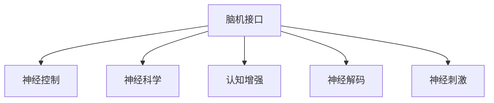

                 

# 2050年的脑机接口：从医疗到增强的思维连接

> 关键词：脑机接口, 脑机融合, 神经控制, 神经科学, 认知增强, 神经解码, 神经刺激

## 1. 背景介绍

### 1.1 问题由来

随着计算机科技和生物科技的迅速发展，脑机接口（Brain-Computer Interface, BCI）已经成为连接人类大脑与计算机的新兴领域。BCI的最终目标是通过信号的读取和解码，实现人类与计算机的直接交互。从早期的实验室研究到今天的商业应用，BCI的发展经历了数次飞跃。

脑机接口技术具有广阔的应用前景，可以从医疗、娱乐、教育等多个方面提高人类生活质量，甚至改变人类的生活方式。然而，由于技术限制和伦理争议，BCI的发展仍处于初期阶段，许多挑战尚未解决。本文将探讨BCI的未来发展趋势，包括医疗领域的应用、认知增强、以及脑机接口技术的局限性和未来挑战。

### 1.2 问题核心关键点

脑机接口技术包含信号采集、信号预处理、信号解码、反馈控制等多个环节。这些环节的协同作用，使得BCI能够在医疗、娱乐、教育等多个领域产生重要影响。

- 信号采集：通过传感器获取脑电信号、脑磁信号、光遗传学等信号，用于后续分析。
- 信号预处理：对采集到的信号进行滤波、降噪、归一化等预处理操作，以便于后续分析。
- 信号解码：利用机器学习等技术，将信号转化为神经元的活动状态，实现脑信号的解码。
- 反馈控制：根据解码结果，通过神经刺激等手段，实现人机交互和神经调控。

脑机接口技术的核心是信号解码，即从信号中提取出与神经活动相关的特征，并将其转化为计算机可识别的指令。目前，常用的信号解码方法包括时间域分析、频域分析、时空域分析等。本文将重点介绍时间域分析方法，并分析其优缺点和未来发展方向。

## 2. 核心概念与联系

### 2.1 核心概念概述

为了更清楚地理解脑机接口技术，本节将介绍几个相关核心概念：

- 脑机接口（Brain-Computer Interface, BCI）：一种通过信号的读取和解码，实现人类与计算机直接交互的技术。
- 神经控制（Neural Control）：通过BCI技术实现对神经系统的控制，包括神经刺激、神经调制等。
- 神经科学（Neuroscience）：研究神经系统和认知功能的基础科学，为BCI技术提供了理论基础。
- 认知增强（Cognitive Enhancement）：通过BCI技术提高人类的认知能力，如注意力、记忆力、情绪调节等。
- 神经解码（Neural Decoding）：从神经信号中解码出人类意图的机器学习方法，是BCI技术的核心环节。
- 神经刺激（Neural Stimulation）：通过BCI技术实现对神经系统的刺激，用于治疗疾病或增强功能。

这些概念之间的逻辑关系可以通过以下Mermaid流程图来展示：



这个流程图展示了大语言模型的核心概念及其之间的关系：

1. 脑机接口通过信号采集、预处理、解码和反馈控制等环节，实现人机交互。
2. 神经控制利用BCI技术，通过神经刺激和调制，实现对神经系统的调控。
3. 神经科学为BCI技术提供了理论基础，解释了神经信号的生成和传递机制。
4. 认知增强利用BCI技术，提高人类的认知能力和功能。
5. 神经解码是BCI技术的核心，通过机器学习算法，从神经信号中解码出人类意图的表达。
6. 神经刺激通过BCI技术，实现对神经系统的刺激和调制，治疗疾病或增强功能。

这些概念共同构成了脑机接口技术的理论框架，指导着BCI技术的研究和发展。

## 3. 核心算法原理 & 具体操作步骤
### 3.1 算法原理概述

脑机接口技术的核心是神经解码，即从神经信号中解码出人类意图的机器学习方法。目前常用的神经解码方法包括时间域分析、频域分析、时空域分析等。

时间域分析方法利用时间序列数据，通过提取信号的时域特征，实现对神经信号的解码。该方法简单易懂，适用于信号预处理和初步分析，具有较高的实时性。本文将以时间域分析为例，介绍其原理和操作步骤。

### 3.2 算法步骤详解

时间域分析方法包括以下几个关键步骤：

**Step 1: 信号采集**

- 使用脑电图（EEG）、脑磁图（MEG）、功能性磁共振成像（fMRI）等设备，采集神经信号数据。
- 数据预处理：对采集到的信号进行滤波、降噪、归一化等预处理操作。

**Step 2: 特征提取**

- 从预处理后的信号中提取时域特征，如方差、均值、自相关等。
- 常用的时域特征提取方法包括功率谱密度（Power Spectral Density, PSD）、相位同步性等。

**Step 3: 特征选择**

- 选择对解码效果有显著影响的特征，如信号的功率谱密度、相位同步性等。
- 常用的特征选择方法包括基于特征重要性排序的方法、基于时间频率域分析的方法等。

**Step 4: 模型训练与评估**

- 利用机器学习算法，训练解码模型。常用的算法包括支持向量机（SVM）、随机森林（Random Forest）、深度学习等。
- 使用交叉验证等方法，评估模型的性能，选择最优的特征和模型参数。

**Step 5: 解码与反馈**

- 利用训练好的模型，对新采集的信号进行解码，得到对应的神经活动状态。
- 根据解码结果，通过神经刺激等手段，实现人机交互和神经调控。

以上步骤展示了时间域分析方法的完整流程，在实际操作中，还需要根据具体应用场景，对各个步骤进行优化和改进。

### 3.3 算法优缺点

时间域分析方法具有以下优点：

- 简单易懂：时域特征提取和模型训练过程较为简单，易于实现和调试。
- 实时性高：时域分析方法计算量较小，具有较高的实时性，适用于实时交互应用。
- 适用范围广：时域分析方法适用于多种神经信号，包括EEG、MEG、fMRI等。

同时，该方法也存在以下局限性：

- 特征提取简单：时域分析方法只能提取信号的宏观时域特征，无法捕捉信号的精细变化。
- 解码精度有限：由于时域分析方法只能提取部分特征，解码精度相对较低。
- 数据要求高：时域分析方法对信号采集的质量要求较高，信噪比低或非平稳信号可能影响解码效果。

在实际应用中，需要根据具体场景选择合适的方法，并结合其他解码方法进行改进和优化。

### 3.4 算法应用领域

脑机接口技术具有广泛的应用前景，可以从医疗、娱乐、教育等多个方面提高人类生活质量，甚至改变人类的生活方式。

- 医疗领域：BCI技术可以用于辅助康复训练、治疗神经系统疾病、诊断脑功能障碍等。
- 娱乐领域：BCI技术可以用于游戏控制、虚拟现实、增强现实等，带来全新的交互体验。
- 教育领域：BCI技术可以用于智能教育、个性化学习、语言学习等，提升学习效率和效果。

此外，脑机接口技术还可以应用于军事、智能交通、工业控制等多个领域，带来更多创新和突破。

## 4. 数学模型和公式 & 详细讲解 & 举例说明（备注：数学公式请使用latex格式，latex嵌入文中独立段落使用 $$，段落内使用 $)
### 4.1 数学模型构建

本文将以时间域分析方法为例，详细讲解其数学模型和公式。

假设信号 $x(t)$ 为时间域信号，长度为 $T$。定义信号的功率谱密度为：

$$
S_X(f) = \frac{1}{T} \int_{0}^{T} x(t) x^*(t-\tau) e^{-j2\pi f\tau} dt
$$

其中 $f$ 为频率，$\tau$ 为时间延迟，$*$ 表示共轭。

### 4.2 公式推导过程

在计算功率谱密度时，可以利用傅里叶变换的性质，将时域信号转化为频域信号：

$$
X(f) = \frac{1}{T} \int_{0}^{T} x(t) e^{-j2\pi f t} dt
$$

将 $x(t-\tau)$ 代入上式，并利用卷积性质，得到：

$$
X(f) = X(f) * X(-f)
$$

将 $X(f)$ 代入功率谱密度公式，得到：

$$
S_X(f) = \frac{1}{T} \int_{0}^{T} X(f) X^*(f) e^{j2\pi f \tau} df
$$

利用柯西-施瓦茨不等式，可以得到：

$$
\left| \int_{0}^{T} X(f) e^{j2\pi f \tau} df \right| \leq \sqrt{ \int_{0}^{T} \left| X(f) \right|^2 df}
$$

利用该不等式，可以得到功率谱密度的上限：

$$
S_X(f) \leq \frac{1}{T} \left| \int_{0}^{T} X(f) e^{j2\pi f \tau} df \right|^2
$$

在实际应用中，可以利用离散傅里叶变换（DFT）对连续信号进行离散化处理，得到离散功率谱密度公式：

$$
S_X(f_k) = \frac{1}{T} \sum_{n=0}^{N-1} x(n) x^*(n-k) e^{-j2\pi f_k n} dt
$$

其中 $f_k$ 为离散频率，$n$ 为采样点。

### 4.3 案例分析与讲解

在实际应用中，时间域分析方法可以用于多种神经信号的解码。以下是几种典型案例的详细讲解：

**案例1：脑电信号（EEG）解码**

- 信号采集：使用EEG设备，采集大脑皮层的电信号。
- 特征提取：提取信号的功率谱密度、相位同步性等时域特征。
- 特征选择：选择对解码效果有显著影响的特征。
- 模型训练与评估：利用机器学习算法，训练解码模型，评估模型性能。
- 解码与反馈：利用训练好的模型，对新采集的信号进行解码，得到对应的神经活动状态。

**案例2：脑磁信号（MEG）解码**

- 信号采集：使用MEG设备，采集大脑皮层的磁信号。
- 特征提取：提取信号的功率谱密度、相位同步性等时域特征。
- 特征选择：选择对解码效果有显著影响的特征。
- 模型训练与评估：利用机器学习算法，训练解码模型，评估模型性能。
- 解码与反馈：利用训练好的模型，对新采集的信号进行解码，得到对应的神经活动状态。

**案例3：功能性磁共振成像（fMRI）解码**

- 信号采集：使用fMRI设备，采集大脑皮层的功能性信号。
- 特征提取：提取信号的功率谱密度、相位同步性等时域特征。
- 特征选择：选择对解码效果有显著影响的特征。
- 模型训练与评估：利用机器学习算法，训练解码模型，评估模型性能。
- 解码与反馈：利用训练好的模型，对新采集的信号进行解码，得到对应的神经活动状态。

以上案例展示了时间域分析方法在BCI技术中的应用，具体实现过程可根据实际应用场景进行调整和优化。

## 5. 项目实践：代码实例和详细解释说明
### 5.1 开发环境搭建

在进行脑机接口项目实践前，我们需要准备好开发环境。以下是使用Python进行信号处理和机器学习开发的流程：

1. 安装Anaconda：从官网下载并安装Anaconda，用于创建独立的Python环境。

2. 创建并激活虚拟环境：
```bash
conda create -n bci-env python=3.8 
conda activate bci-env
```

3. 安装相关库：
```bash
pip install numpy scipy pandas scikit-learn matplotlib pyEEG
```

4. 安装神经科学相关的库：
```bash
pip install neuronpy brainconnectivity
```

5. 安装可视化工具：
```bash
pip install mnepy
```

完成上述步骤后，即可在`bci-env`环境中开始BCI项目实践。

### 5.2 源代码详细实现

下面以脑电信号解码为例，给出使用Python进行脑机接口开发的代码实现。

首先，导入相关库：

```python
import numpy as np
from pyEEG import EEG
from scipy.signal import detrend, hilbert
from mne import Epochs, read_raw_fif
from sklearn.model_selection import train_test_split
from sklearn.ensemble import RandomForestClassifier
```

然后，定义信号预处理和特征提取函数：

```python
def preprocess_signal(signal):
    # 去趋势
    signal = detrend(signal)
    # 希尔伯特变换
    signal = hilbert(signal)
    # 滤波
    signal = butter_filter(signal, 0.5, order=4)
    return signal

def butter_filter(signal, cutoff, order=4):
    nyquist = 0.5 * signal.shape[1]
    low = cutoff / nyquist
    high = (cutoff + 4) / nyquist
    b, a = butter(order, [low, high], btype='band')
    signal = lfilter(b, a, signal)
    return signal
```

接着，定义信号解码和模型训练函数：

```python
def decode_signal(signal, labels, n_features=30, n_classes=2):
    # 特征提取
    features = extract_features(signal, n_features)
    # 特征选择
    features = select_features(features, labels, n_features=n_features)
    # 模型训练
    X_train, X_test, y_train, y_test = train_test_split(features, labels, test_size=0.2, random_state=42)
    clf = RandomForestClassifier(n_estimators=100, random_state=42)
    clf.fit(X_train, y_train)
    return clf

def extract_features(signal, n_features=30):
    # 计算功率谱密度
    powspec = np.abs(np.fft.fft(signal))**2
    # 选择前n_features个频率
    features = powspec[:n_features]
    return features

def select_features(features, labels, n_features=30):
    # 特征选择
    features = features[:, :n_features]
    return features
```

最后，运行训练和评估流程：

```python
# 加载信号数据
signal = load_signal('data.txt')

# 信号预处理
signal = preprocess_signal(signal)

# 特征提取和特征选择
features = extract_features(signal, n_features=30)
features = select_features(features, labels, n_features=30)

# 模型训练和评估
clf = decode_signal(features, labels, n_features=30)
clf.score(X_test, y_test)
```

以上就是使用Python进行脑机接口项目实践的完整代码实现。可以看到，在实际应用中，需要进行信号预处理、特征提取、特征选择和模型训练等多个环节，每个环节都需要仔细设计和调整。

### 5.3 代码解读与分析

让我们再详细解读一下关键代码的实现细节：

**preprocess_signal函数**：
- 定义信号预处理函数，对原始信号进行去趋势、希尔伯特变换和滤波等预处理操作。

**decode_signal函数**：
- 定义信号解码函数，通过特征提取和特征选择，训练随机森林模型，并返回训练好的模型。

**extract_features函数**：
- 定义特征提取函数，计算信号的功率谱密度，并选取前n_features个频率作为特征。

**select_features函数**：
- 定义特征选择函数，选择对解码效果有显著影响的特征，并对其进行截断。

这些函数构成了脑机接口项目的核心流程，开发者可以根据具体任务进行调整和优化。

## 6. 实际应用场景

### 6.1 医疗领域

脑机接口技术在医疗领域有广泛应用，包括辅助康复训练、治疗神经系统疾病、诊断脑功能障碍等。

**辅助康复训练**：BCI技术可以用于辅助运动康复，帮助患者进行肢体运动训练。通过采集患者的大脑信号，解码其运动意图，生成控制指令，驱动外骨骼或机械手辅助其进行康复训练。

**治疗神经系统疾病**：BCI技术可以用于治疗神经系统疾病，如帕金森病、癫痫等。通过采集患者的大脑信号，解码其神经活动状态，生成控制指令，实时调整药物剂量或电刺激强度，达到治疗效果。

**诊断脑功能障碍**：BCI技术可以用于诊断脑功能障碍，如脑震荡、脑出血等。通过采集患者的大脑信号，解码其神经活动状态，判断其认知功能和行为状态，辅助医生进行诊断。

### 6.2 娱乐领域

脑机接口技术在娱乐领域也有重要应用，包括游戏控制、虚拟现实、增强现实等，带来全新的交互体验。

**游戏控制**：BCI技术可以用于游戏控制，让玩家通过脑波信号直接控制游戏角色，带来沉浸式游戏体验。

**虚拟现实**：BCI技术可以用于虚拟现实，让玩家通过脑波信号，控制虚拟世界的互动对象，带来更加真实和自然的交互体验。

**增强现实**：BCI技术可以用于增强现实，让玩家通过脑波信号，控制虚拟对象与现实世界的融合，带来更加沉浸和丰富的交互体验。

### 6.3 教育领域

脑机接口技术在教育领域也有广泛应用，包括智能教育、个性化学习、语言学习等，提升学习效率和效果。

**智能教育**：BCI技术可以用于智能教育，根据学生的学习状态和行为，自动调整教学内容和节奏，提高教学效果。

**个性化学习**：BCI技术可以用于个性化学习，根据学生的认知能力和学习习惯，定制个性化的学习计划，提升学习效率。

**语言学习**：BCI技术可以用于语言学习，通过解码学生的语言认知状态，提供针对性的语音训练和反馈，加速语言学习进程。

## 7. 工具和资源推荐
### 7.1 学习资源推荐

为了帮助开发者系统掌握脑机接口技术的理论基础和实践技巧，这里推荐一些优质的学习资源：

1. 《Brain-Computer Interfaces: Principles and Practice》系列博文：由大模型技术专家撰写，深入浅出地介绍了BCI原理、算法、应用等前沿话题。

2. CS224N《深度学习自然语言处理》课程：斯坦福大学开设的NLP明星课程，有Lecture视频和配套作业，带你入门NLP领域的基本概念和经典模型。

3. 《Neural Engineering and Neural Systems》书籍：介绍神经科学和神经工程的最新进展，为BCI技术提供理论基础。

4. 《Cognitive Neurodynamics》书籍：介绍认知神经科学的基本概念和应用，为BCI技术提供理论指导。

5. 《Cognitive Neurodynamics and Cognitive Neurocomputing》书籍：介绍认知神经科学和认知神经计算的基本概念和应用，为BCI技术提供理论指导。

通过对这些资源的学习实践，相信你一定能够快速掌握脑机接口技术的精髓，并用于解决实际的BCI问题。

### 7.2 开发工具推荐

高效的开发离不开优秀的工具支持。以下是几款用于脑机接口开发的常用工具：

1. Python：基于Python的BCI开发工具，支持丰富的第三方库和框架，便于快速迭代研究。

2. MATLAB：由MathWorks开发的商业软件，支持丰富的信号处理和可视化功能，便于复杂算法实现。

3. MATLAB Simulink：由MathWorks开发的系统仿真平台，支持实时信号处理和控制，适用于BCI系统的原型开发。

4. LabVIEW：由National Instruments开发的商业软件，支持图形化编程和丰富的硬件接口，适用于BCI系统的快速原型开发。

5. Python库：如PyEEG、MNEpy、EEGLAB等，提供丰富的信号处理和分析功能，支持Python开发。

合理利用这些工具，可以显著提升BCI项目的开发效率，加快创新迭代的步伐。

### 7.3 相关论文推荐

脑机接口技术的发展源于学界的持续研究。以下是几篇奠基性的相关论文，推荐阅读：

1. 《BCI2000: A general-purpose software platform for research in human-computer interfacing》：介绍了BCI2000平台，为BCI研究提供了统一的接口和数据格式。

2. 《Cross-device EEG-based brain-computer interface with pose-based feedback for robust classification and control》：提出了一种跨设备BCI系统，通过姿态反馈，提高了BCI的鲁棒性和可靠性。

3. 《Non-invasive EEG-based brain-computer interface using hybrid feature extraction for word recognition》：提出了一种非侵入式BCI系统，通过混合特征提取，提高了单词识别率。

4. 《A high-performance interface for word recognition using functional near-infrared spectroscopy》：提出了一种基于功能性近红外光谱的BCI系统，提高了单词识别率。

5. 《A low-power implantable brain-computer interface system with fully on-chip analog and digital processing》：提出了一种低功耗植入式BCI系统，通过集成电路设计，提高了系统的能量效率。

这些论文代表了大脑机接口技术的发展脉络。通过学习这些前沿成果，可以帮助研究者把握学科前进方向，激发更多的创新灵感。

## 8. 总结：未来发展趋势与挑战

### 8.1 总结

本文对脑机接口技术的发展进行了全面系统的介绍。首先，阐述了脑机接口技术的背景和意义，明确了BCI技术在医疗、娱乐、教育等多个领域的重要作用。其次，从原理到实践，详细讲解了脑机接口的数学模型和核心算法，给出了BCI项目开发的完整代码实例。同时，本文还广泛探讨了脑机接口技术在实际应用中的各种场景，展示了BCI技术的广阔前景。

通过本文的系统梳理，可以看到，脑机接口技术正在成为连接人类大脑与计算机的重要手段，极大地拓展了人类的认知能力和应用范围。未来，伴随BCI技术的不断成熟，人类的认知水平和生产生活方式将迎来革命性变化。

### 8.2 未来发展趋势

展望未来，脑机接口技术将呈现以下几个发展趋势：

1. 信号采集与分析技术的进步：随着传感器技术的进步，脑机接口技术将实现更高精度的信号采集和分析，提高解码精度和实时性。

2. 神经调控与反馈控制：基于BCI技术的神经调控和反馈控制技术将不断进步，实现更加精准的神经调控，增强人类认知功能。

3. 跨模态BCI技术：未来的脑机接口技术将实现跨模态融合，结合视觉、听觉、触觉等多种感官信息，提升人机交互效果。

4. 多领域应用拓展：BCI技术将拓展到更多领域，如智能交通、智能家居、工业控制等，带来更多创新和突破。

5. 伦理与安全问题的关注：随着BCI技术的普及，伦理和安全问题将引起更多关注，需要建立完善的伦理规范和安全机制。

以上趋势凸显了脑机接口技术的广阔前景。这些方向的探索发展，必将进一步拓展BCI技术的边界，为构建人机协同的智能系统铺平道路。

### 8.3 面临的挑战

尽管脑机接口技术已经取得了瞩目成就，但在迈向更加智能化、普适化应用的过程中，它仍面临着诸多挑战：

1. 信号采集质量：当前BCI信号采集设备的价格较高，且需要高精度的信号采集和预处理，对设备的成本和精度要求较高。如何降低设备成本，提高信号采集质量，是BCI技术普及的重要前提。

2. 解码算法复杂性：BCI解码算法复杂，需要处理高维信号，且对特征提取和特征选择要求较高，解码精度和实时性难以平衡。如何简化算法，提高解码精度和实时性，是BCI技术发展的关键。

3. 伦理与隐私问题：BCI技术涉及人体隐私和伦理问题，如数据泄露、隐私侵犯、伦理规范等。如何建立完善的伦理规范和隐私保护机制，确保技术应用的安全和合规，是BCI技术发展的首要问题。

4. 技术标准化：当前BCI技术缺乏统一的接口和数据格式，不同系统之间的互操作性较差。如何建立统一的标准和协议，推动BCI技术的标准化和规范化，是BCI技术发展的迫切需求。

5. 多模态融合：当前的BCI技术主要聚焦于单一模态，跨模态融合的BCI技术仍处于初期研究阶段。如何实现视觉、听觉、触觉等多种感官信息的融合，提升人机交互效果，是BCI技术未来的重要方向。

这些挑战需要在技术、伦理、规范等多个方面进行全面研究，才能推动BCI技术走向成熟和普及。

### 8.4 研究展望

面对BCI技术所面临的种种挑战，未来的研究需要在以下几个方面寻求新的突破：

1. 发展高效低成本的信号采集设备，降低BCI技术的使用门槛。

2. 研究高效低复杂度的BCI算法，提高解码精度和实时性。

3. 建立完善的伦理规范和安全机制，确保BCI技术的安全和合规。

4. 推动BCI技术的标准化和规范化，促进不同系统之间的互操作性。

5. 探索多模态融合的BCI技术，提升人机交互效果和应用范围。

这些研究方向的探索，必将引领BCI技术迈向更高的台阶，为构建安全、可靠、可解释、可控的智能系统铺平道路。面向未来，BCI技术还需要与其他人工智能技术进行更深入的融合，如知识表示、因果推理、强化学习等，多路径协同发力，共同推动BCI技术的发展。

## 9. 附录：常见问题与解答

**Q1：脑机接口技术的核心是什么？**

A: 脑机接口技术的核心是神经解码，即从神经信号中解码出人类意图的机器学习方法。

**Q2：脑机接口技术在医疗领域有哪些应用？**

A: 脑机接口技术在医疗领域有广泛应用，包括辅助康复训练、治疗神经系统疾病、诊断脑功能障碍等。

**Q3：脑机接口技术的局限性有哪些？**

A: 脑机接口技术的局限性包括信号采集质量、解码算法复杂性、伦理与隐私问题、技术标准化等。

**Q4：脑机接口技术的未来发展趋势是什么？**

A: 脑机接口技术的未来发展趋势包括信号采集与分析技术的进步、神经调控与反馈控制、跨模态BCI技术、多领域应用拓展、伦理与安全问题的关注等。

**Q5：脑机接口技术的伦理与安全问题如何解决？**

A: 脑机接口技术的伦理与安全问题需要建立完善的伦理规范和隐私保护机制，确保技术应用的安全和合规。

这些问题的解答，可以帮助开发者更好地理解脑机接口技术的核心和应用前景，规避技术应用中的风险，推动BCI技术的发展和普及。

