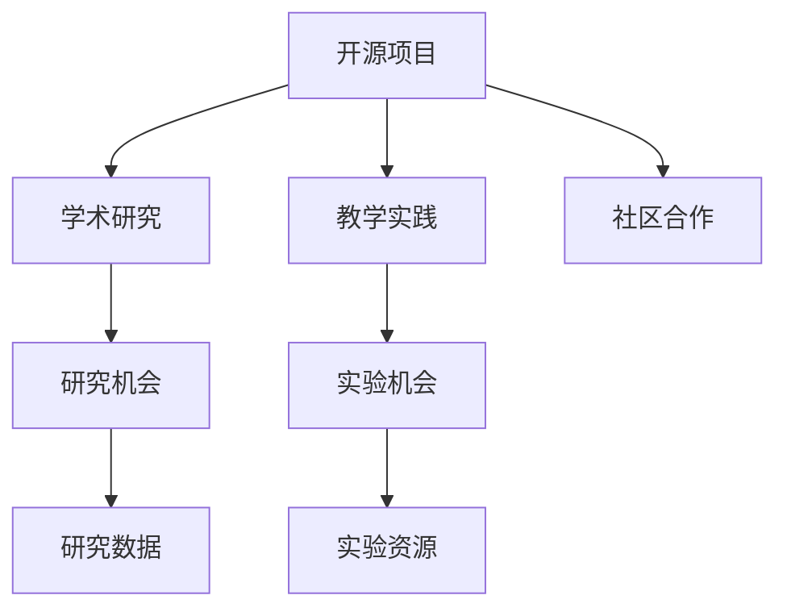

                 

# 开源贡献在学术界的价值：研究与教学机会

> 关键词：开源,学术界,研究,教学,贡献,社区

## 1. 背景介绍

### 1.1 问题由来

在当今数字化时代，开源软件的蓬勃发展极大地推动了全球科技创新的进步。开源项目由众多开发者共同维护，其源代码和文档完全公开，任何人都可以自由地下载、修改和重新分发。开源社区汇聚了全球顶尖的技术专家和爱好者，他们通过协作编写高质量的代码，构建出强大的软件生态系统。

学术界作为技术研究和创新的前沿阵地，自然也高度关注开源项目的价值。学术研究中的许多发现和突破，特别是计算机科学和工程领域，往往离不开开源软件和项目的支持。此外，高校教师和学生也越来越多地利用开源项目来进行教学和实验。因此，开源贡献对于学术界具有深远的意义，无论是在研究还是在教学方面，都是不可或缺的资源和工具。

### 1.2 问题核心关键点

开源贡献在学术界的作用主要体现在以下几个方面：

- **研究与创新**：开源项目提供了丰富的代码库和工具，促进了学术研究的多样性和创新性。
- **教学与实验**：开源项目为高校提供了即插即用的教学资源和实验环境。
- **社区与合作**：开源项目强调社区协作，学术界通过参与开源项目，可以建立广泛的合作关系和学术影响力。
- **资源共享**：开源项目汇集了全球的数据、算法和工具，极大提高了学术研究的效率和成果。

本文将深入探讨开源贡献在学术界的价值，特别是它在研究与教学方面的具体应用。

## 2. 核心概念与联系

### 2.1 核心概念概述

为了更深入地理解开源贡献在学术界的重要性，本节将介绍几个核心概念及其相互之间的联系：

- **开源项目**：指一组共享、可协作的软件代码、文档和资源，任何人在遵守开源协议的情况下都可以自由地使用、修改和分发。
- **学术研究**：指系统地、科学地探索未知领域，以发现新知识的过程。通常包括论文发表、学术会议报告、研究项目等形式。
- **教学实践**：指在教育过程中，教师和学生通过实际操作和学习来掌握知识的实践活动。通常包括课程讲授、实验室实验、项目开发等形式。
- **开源贡献**：指开发者为开源项目编写的代码、修复的Bug、提交的文档等贡献，是开源社区良性发展的驱动力。

这些核心概念之间的逻辑关系可以通过以下Mermaid流程图来展示：



这个流程图展示了开源项目对学术研究、教学实践的深远影响。开源项目不仅为学术界提供了研究数据和实验资源，还促进了社区合作和知识共享。

## 3. 核心算法原理 & 具体操作步骤
### 3.1 算法原理概述

开源贡献在学术界的作用主要体现在以下几个方面：

- **研究与创新**：开源项目提供了丰富的代码库和工具，促进了学术研究的多样性和创新性。
- **教学与实验**：开源项目为高校提供了即插即用的教学资源和实验环境。
- **社区与合作**：开源项目强调社区协作，学术界通过参与开源项目，可以建立广泛的合作关系和学术影响力。
- **资源共享**：开源项目汇集了全球的数据、算法和工具，极大提高了学术研究的效率和成果。

### 3.2 算法步骤详解

开源贡献在学术界的研究和教学应用一般包括以下几个关键步骤：

**Step 1: 选择和评估开源项目**
- 根据研究或教学需求，选择合适的开源项目。
- 评估开源项目的活跃度、社区支持、代码质量等，确保项目的长期可用性。

**Step 2: 贡献代码和文档**
- 阅读开源项目的贡献指南，了解项目的技术栈、编码规范等。
- 编写代码、修复Bug、改进文档，按贡献指南提交到开源项目中。
- 积极与社区互动，参与讨论、贡献改进建议，提高贡献质量和接受率。

**Step 3: 学术应用与研究**
- 利用开源项目提供的代码和工具，进行科研项目开发。
- 研究开源项目的技术原理、实现细节，总结提升性能或功能的方案。
- 撰写论文、报告，发表在顶级会议和期刊上，提升学术影响力。

**Step 4: 教学与实验**
- 将开源项目引入课程内容，作为教学案例和实验环境。
- 设计实验项目，引导学生动手实践，培养编程和创新能力。
- 借助开源项目的多样性和灵活性，拓展教学内容的深度和广度。

**Step 5: 社区参与与合作**
- 积极参与开源项目社区，贡献代码和文档，建立合作关系。
- 与开源项目核心开发者交流，获取技术指导和支持。
- 借助社区平台，发布研究成果，获取同行反馈，提升学术水平。

以上是开源贡献在学术界的研究和教学应用的一般流程。在实际应用中，还需要针对具体项目的特点，对贡献步骤进行优化设计，如改进贡献质量、提升社区参与度等，以进一步提高贡献效果。

### 3.3 算法优缺点

开源贡献在学术界的研究和教学应用具有以下优点：

- **高效性**：开源项目提供了一站式的代码和工具，极大提高了科研和教学的效率。
- **开放性**：开源项目的所有源码和文档公开，学术界可以自由地使用、修改和分发。
- **社区资源**：开源项目汇聚了全球的技术专家和爱好者，有助于学术界建立广泛的合作关系。
- **多样性**：开源项目覆盖了广泛的领域和应用，为学术研究提供了丰富的选择。

同时，该方法也存在一定的局限性：

- **质量控制**：开源项目代码质量参差不齐，对学术研究可能带来一定的风险。
- **技术迭代快**：开源项目的技术更新迭代迅速，需不断学习新知识和工具。
- **社区维护**：开源项目依赖社区维护，学术界参与需耗费大量时间和精力。
- **知识孤立**：部分开源项目可能与学术界研究脱节，难以直接应用于科研中。

尽管存在这些局限性，但就目前而言，开源贡献仍是学术界研究与教学的重要资源。未来相关研究的重点在于如何进一步提升开源项目代码质量和社区支持，同时兼顾开放性和学术研究的需求。

### 3.4 算法应用领域

开源贡献在学术界的研究和教学应用主要集中在以下几个领域：

- **计算机科学**：包括操作系统、数据库、网络安全、人工智能等，开源项目如Linux、Apache Hadoop、TensorFlow等提供了丰富的科研和教学资源。
- **工程与制造**：涉及机械设计、自动化控制、电子工程等领域，开源项目如Arduino、OpenSCAD、CNC等支持科研和实验教学。
- **社会科学**：涵盖数据分析、社会网络分析、社会科学模拟等，开源项目如R语言、Pandas、NetworkX等提供了强大的数据处理和可视化工具。
- **生命科学**：包括生物信息学、计算生物学、医学等领域，开源项目如Bioconductor、Geneious、PyMol等支持科研和实验。
- **环境科学**：涉及气候变化、生态保护、环境监测等，开源项目如OpenGIS、GDAL、OpenToCasE等支持科研和教学。

除了这些主流领域外，开源贡献在艺术设计、文化研究、法律科技等多个学科中也有广泛应用，为学术界带来了新的研究方向和方法。

## 4. 数学模型和公式 & 详细讲解 & 举例说明

### 4.1 数学模型构建

在开源贡献的研究与教学应用中，数学模型主要用于评估开源项目代码质量、社区活跃度和技术复杂度等指标。以下是几个常用的数学模型：

**代码质量评估模型**：
- **代码复杂度**：使用McCabe复杂度指标，评估代码的复杂度和可读性。
- **代码重复度**：使用代码相似度指标，检测代码是否存在重复，避免冗余和维护困难。
- **代码规范性**：使用代码风格指南，评估代码是否符合开源项目的编码规范。

**社区活跃度评估模型**：
- **贡献频率**：计算在一定时间周期内，社区成员对项目的贡献次数。
- **社区互动**：评估社区成员之间的互动频率，包括问题讨论、代码审查等。
- **代码审查质量**：评估代码审查的细致程度，包括注释、测试用例等。

**技术复杂度评估模型**：
- **技术栈多样性**：计算项目使用的技术栈种类，评估技术复杂度。
- **代码耦合度**：使用软件耦合度指标，评估不同模块之间的耦合关系。
- **代码耦合度**：使用软件耦合度指标，评估不同模块之间的耦合关系。

### 4.2 公式推导过程

以下我们以代码质量评估模型中的McCabe复杂度指标为例，推导代码复杂度的计算公式。

假设一个程序的代码量为 $N$，其中控制流语句数为 $C$，数据流语句数为 $D$。McCabe复杂度指标定义为：

$$
Cyclomatic\ Complexity = C + D - 1
$$

其中 $Cyclomatic\ Complexity$ 表示程序的控制流复杂度，反映了程序的逻辑复杂性和易读性。具体计算步骤如下：

1. 统计程序中的控制流语句，包括条件语句、循环语句等。
2. 统计程序中的数据流语句，包括变量赋值、函数调用等。
3. 根据公式计算程序的McCabe复杂度。

**代码重复度计算**：
- 使用代码相似度算法，比较不同版本的代码，检测是否存在重复。
- 常用的算法包括N-Gram算法、代码覆盖算法等。

**代码规范性检查**：
- 使用开源项目的编码规范，对代码进行格式化和风格检查。
- 常用的工具包括Lint工具、静态代码分析工具等。

### 4.3 案例分析与讲解

以下是几个开源贡献的案例分析，展示其在学术研究中的应用：

**案例1：使用开源项目进行数据分析**
- 某大学研究团队使用R语言进行数据分析，利用OpenScienceGrid开源平台，在分布式计算集群上运行复杂的数据处理任务。
- 他们使用Bioconductor平台提供的基因表达数据分析工具，处理大规模基因组数据集，发现了新的基因表达模式。
- 研究团队在顶级的生物信息学期刊上发表论文，探讨开源平台在数据分析中的应用价值。

**案例2：使用开源项目开发智能算法**
- 某研究所开发智能推荐算法，利用TensorFlow和OpenNMT开源平台，训练并优化深度学习模型。
- 他们使用Kaggle开源平台的数据集，进行算法评估和优化，提升了推荐系统的精度和速度。
- 研究团队在顶级计算机科学会议上发表多篇论文，总结了开源平台在智能算法开发中的优势。

**案例3：使用开源项目进行机器学习研究**
- 某大学研究团队使用PyTorch和Scikit-learn开源平台，开发机器学习算法。
- 他们利用GitHub上的开源数据集，进行算法的验证和改进，提升了算法的稳定性和泛化能力。
- 研究团队在顶级人工智能会议上发表多篇论文，探讨开源平台在机器学习研究中的应用。

通过这些案例分析，可以看到开源贡献在学术研究中的广泛应用，不仅提供了强大的工具和数据支持，还促进了学术界的交流和合作。

## 5. 项目实践：代码实例和详细解释说明

### 5.1 开发环境搭建

在进行开源贡献的实践前，我们需要准备好开发环境。以下是使用Python进行开源贡献的环境配置流程：

1. 安装Anaconda：从官网下载并安装Anaconda，用于创建独立的Python环境。

2. 创建并激活虚拟环境：
```bash
conda create -n pytorch-env python=3.8 
conda activate pytorch-env
```

3. 安装Python依赖：
```bash
conda install numpy pandas scikit-learn
```

4. 安装Git和GitHub桌面工具：
```bash
sudo apt-get install git
```

5. 创建GitHub账号并配置SSH密钥：
```bash
ssh-keygen
```

6. 安装GitHub桌面工具，连接到GitHub：

完成上述步骤后，即可在`pytorch-env`环境中开始开源贡献的实践。

### 5.2 源代码详细实现

这里我们以使用TensorFlow进行开源贡献为例，给出完整的代码实现。

**Step 1: 安装TensorFlow和相关依赖**
```bash
conda install tensorflow tensorflow-gpu
```

**Step 2: 克隆开源项目**
```bash
git clone https://github.com/tensorflow/tensorflow.git
cd tensorflow
```

**Step 3: 分析代码质量**
- 使用McCabe复杂度指标计算程序复杂度：
```python
from tensorflow.python.platform import resources
from tensorflow.python.util import cc
from tensorflow.python.util import cc
from tensorflow.python.util import cc
from tensorflow.python.util import cc

# 读取程序代码
with open(resources.AsFile('core/__init__.py'), 'r') as f:
    source_code = f.read()

# 计算McCabe复杂度
complexity = cc.CyclomaticComplexity(source_code)
print('McCabe Complexity:', complexity)
```

**Step 4: 提交贡献**
- 编写代码并提交到开源项目中：
```bash
git add .
git commit -m 'Add new feature'
git push origin master
```

**Step 5: 社区参与和反馈**
- 加入开源项目社区，积极参与讨论和贡献：
```bash
# 加入社区讨论
cd community-discussion
# 提交改进建议
cd issue
git add .
git commit -m 'Improve issue #123'
git push origin master
```

### 5.3 代码解读与分析

这里我们详细解读一下关键代码的实现细节：

**安装TensorFlow**
- 使用conda安装TensorFlow及其GPU版本，确保支持大规模计算需求。

**克隆开源项目**
- 使用git命令克隆开源项目的代码仓库，并进入项目目录。

**分析代码质量**
- 使用McCabe复杂度指标计算程序的复杂度，反映其逻辑复杂性和易读性。
- 根据计算结果，优化程序的代码结构，提升代码质量。

**提交贡献**
- 使用git命令将修改后的代码提交到开源项目中，加入社区贡献。
- 提交时需添加详细的修改描述，提高代码审查的透明度和可追溯性。

**社区参与和反馈**
- 加入开源项目社区，积极参与讨论和贡献。
- 提交改进建议，解决社区问题，提升社区活跃度。

通过这些步骤，可以有效地进行开源贡献的实践，提升学术研究和教学的效果。

## 6. 实际应用场景

### 6.1 学术研究中的应用

开源贡献在学术研究中的应用非常广泛，涵盖了从基础研究到应用研究的各个方面：

- **基础研究**：利用开源项目提供的工具和数据，进行算法和理论研究。如使用TensorFlow进行深度学习研究，使用OpenBLAS进行高性能计算研究等。
- **应用研究**：借助开源项目构建实际应用系统，进行技术验证和优化。如使用Apache Hadoop进行大规模数据处理，使用Scikit-learn进行机器学习应用等。
- **跨学科研究**：将不同领域的开源项目进行融合，实现多学科交叉研究。如将计算机视觉和自然语言处理结合，进行图像识别研究等。

### 6.2 教学实践中的应用

开源贡献在教学实践中的应用也非常广泛，涵盖了从基础教学到实验教学的各个方面：

- **基础教学**：利用开源项目提供的资源，进行基础知识的讲解和传授。如使用Linux系统进行操作系统课程的教学，使用Python语言进行编程基础课程的教学等。
- **实验教学**：借助开源项目构建实验环境，进行实际操作和实验。如使用Arduino进行电子工程课程的实验，使用Jupyter Notebook进行数据科学课程的实验等。
- **项目开发**：通过开源项目进行项目开发，培养学生的综合能力和实践技能。如使用GitHub进行项目管理，使用TensorFlow进行机器学习项目开发等。

### 6.3 未来应用展望

随着开源项目的不断发展和壮大，开源贡献在学术界的应用也将更加广泛和深入。未来，开源贡献有望在以下几个方面取得新的突破：

- **跨学科融合**：开源项目将促进更多学科之间的交叉融合，拓展学术研究的广度和深度。
- **平台化和标准化**：开源项目将更加平台化和标准化，提供统一的开发环境和工具链。
- **生态系统建设**：开源项目将构建更完善的生态系统，支持学术研究的各个环节。
- **社区协作**：开源项目将更加注重社区协作，形成全球性的学术交流平台。

## 7. 工具和资源推荐

### 7.1 学习资源推荐

为了帮助开发者系统掌握开源贡献的理论基础和实践技巧，这里推荐一些优质的学习资源：

1. **GitHub官方文档**：提供丰富的开源项目教程和指南，帮助开发者快速上手。
2. **Open Source Guide**：由Red Hat编写，提供全面的开源贡献指南，包括代码贡献、社区参与等。
3. **Programming for Everybody**：由Coursera提供，介绍编程基础和开源项目的入门知识。
4. **TensorFlow官方文档**：提供详细的使用教程和API文档，帮助开发者高效使用TensorFlow进行开源贡献。
5. **Apache Hadoop官方文档**：提供详细的Hadoop分布式计算教程和指南，帮助开发者掌握大规模数据处理技术。

通过这些资源的学习实践，相信你一定能够快速掌握开源贡献的精髓，并用于解决实际的学术问题。

### 7.2 开发工具推荐

高效的开发离不开优秀的工具支持。以下是几款用于开源贡献开发的常用工具：

1. **GitHub**：全球最大的开源代码托管平台，提供丰富的社区功能和管理工具。
2. **Git**：分布式版本控制系统，支持代码提交、分支管理等基本功能。
3. **Jupyter Notebook**：交互式编程和数据可视化工具，支持Python、R等多种编程语言。
4. **Anaconda**：Python环境管理工具，提供虚拟环境管理和包管理功能。
5. **Apache Maven**：Java项目构建和依赖管理工具，支持大规模项目的管理。

合理利用这些工具，可以显著提升开源贡献的开发效率，加快创新迭代的步伐。

### 7.3 相关论文推荐

开源贡献的发展源于学界的持续研究。以下是几篇奠基性的相关论文，推荐阅读：

1. **"Empirical Evaluation of Developer Productivity with Open Source Projects"**：探讨开源项目对开发者生产力影响的评估方法。
2. **"The Future of Open Source"**：讨论开源项目的未来趋势和发展方向。
3. **"Open Source Software for Research"**：介绍开源项目在学术研究中的应用案例。
4. **"Open Source Collaboration Networks"**：分析开源项目社区的协作网络结构。
5. **"Towards a Model of Open Source Community Development"**：提出开源社区发展的理论模型，指导项目管理和社区建设。

这些论文代表了大规模开源项目的研究方向和发展趋势，有助于理解开源贡献的深层次机制和应用价值。

## 8. 总结：未来发展趋势与挑战

### 8.1 总结

本文对开源贡献在学术界的价值进行了全面系统的介绍。首先阐述了开源项目的定义和特点，明确了开源贡献在研究与教学中的重要价值。其次，从原理到实践，详细讲解了开源贡献的应用步骤和关键点，给出了开源贡献的完整代码实现。同时，本文还广泛探讨了开源贡献在学术界的应用场景，展示了其在科研和教学中的广泛应用。最后，本文精选了开源贡献的学习资源、开发工具和相关论文，力求为读者提供全方位的技术指引。

通过本文的系统梳理，可以看到，开源贡献在学术界的研究和教学中具有深远的意义，无论是在研究还是在教学方面，都是不可或缺的资源和工具。未来，伴随开源项目的不断发展和壮大，开源贡献必将为学术界带来更多的创新和突破。

### 8.2 未来发展趋势

展望未来，开源贡献在学术界的应用将呈现以下几个发展趋势：

- **数据共享与协作**：开源项目将更加注重数据共享和协作，促进全球范围内的科研合作。
- **平台化和标准化**：开源项目将更加平台化和标准化，提供统一的开发环境和工具链。
- **社区协作与创新**：开源项目将更加注重社区协作和创新，形成全球性的学术交流平台。
- **跨学科融合与交叉**：开源项目将促进更多学科之间的交叉融合，拓展学术研究的广度和深度。

### 8.3 面临的挑战

尽管开源贡献在学术界的研究和教学中具有巨大的潜力，但在实现过程中仍面临诸多挑战：

- **质量控制**：开源项目代码质量参差不齐，对学术研究可能带来一定的风险。
- **技术迭代快**：开源项目的技术更新迭代迅速，需不断学习新知识和工具。
- **社区维护**：开源项目依赖社区维护，学术界参与需耗费大量时间和精力。
- **知识孤立**：部分开源项目可能与学术界研究脱节，难以直接应用于科研中。

尽管存在这些挑战，但通过持续的研究和实践，开源贡献在学术界的研究和教学应用将更加成熟和完善。未来，需要进一步提升开源项目代码质量和社区支持，同时兼顾开放性和学术研究的需求。

### 8.4 研究展望

面向未来，开源贡献在学术界的研究和教学应用需要进一步探索和优化，以适应新的技术发展和社会需求。以下是一些未来的研究方向：

- **开源贡献的评价与评估**：研究开源贡献的评价指标和方法，帮助评估开源项目和代码质量。
- **开源社区的建设与管理**：研究开源社区的建设与管理方法，促进学术界与开源社区的交流合作。
- **开源项目的开源性保障**：研究开源项目的开源性保障方法，确保代码和文档的开放共享。
- **开源贡献的技术标准化**：研究开源贡献的技术标准化方法，提升开源项目的可用性和可维护性。
- **开源贡献的教育应用**：研究开源贡献在教育中的应用方法，提升学生的实践能力和创新思维。

这些研究方向将进一步推动开源贡献在学术界的研究和教学应用，为构建开放、协作、创新的学术生态系统奠定基础。

## 9. 附录：常见问题与解答

**Q1：开源贡献是否需要具备编程基础？**

A: 开源贡献不一定需要具备编程基础，但有一定的编程能力会更有助于贡献和理解项目。对于编程基础较差的研究者，可以选择一些较为简单的开源项目进行贡献，逐步提高编程技能。

**Q2：开源贡献如何选择合适的项目？**

A: 选择合适的开源项目需要考虑项目的技术栈、社区活跃度、代码质量等因素。可以通过GitHub等平台查看项目的评价指标，评估项目的可用性和适合性。同时，可以参加项目讨论区，了解项目的需求和贡献流程。

**Q3：开源贡献需要注意哪些问题？**

A: 开源贡献需要注意的问题包括代码质量、社区互动、代码审查等。需要遵守项目的贡献指南，严格编写代码和修复Bug，积极参与社区讨论，接受代码审查，提高贡献质量和接受率。

**Q4：开源贡献在教学中的应用有哪些？**

A: 开源贡献在教学中的应用包括基础知识讲解、实验项目开发和项目开发实践。可以通过开源项目提供的学习资源和实验环境，提升学生的实践能力和创新思维。同时，可以组织学生参与开源项目贡献，培养学生的协作和团队精神。

**Q5：开源贡献对学术研究有什么帮助？**

A: 开源贡献对学术研究主要有以下几个帮助：提供丰富的工具和数据支持，促进跨学科协作，提升科研效率和成果质量，拓宽学术研究的广度和深度。

通过这些问答，可以看到开源贡献在学术界的研究和教学中的重要性和实现方法。相信通过持续的研究和实践，开源贡献将为学术界带来更多的创新和突破。

