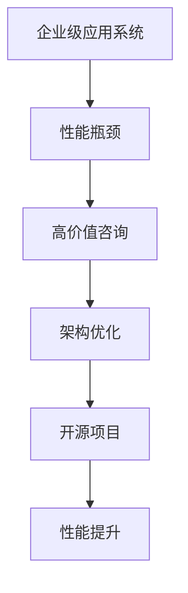

                 

# 开源项目的企业级性能优化服务：高价值咨询

> 关键词：开源项目, 企业级性能优化, 高价值咨询, 性能瓶颈, 软件架构, 负载均衡, 系统监控, 故障排除, 敏捷开发, DevOps

## 1. 背景介绍

### 1.1 问题由来

在当今数字化时代，企业级应用系统的规模不断扩大，软件架构日趋复杂，性能问题变得越来越普遍且难以管理。企业面临的挑战包括但不限于：

- **性能瓶颈**：系统性能难以满足业务增长和用户需求。
- **资源浪费**：硬件资源未被充分利用，存在显著的资源浪费现象。
- **成本压力**：维护复杂系统所需的成本和人力不断增加。
- **技术鸿沟**：开发人员和运维人员之间存在技术鸿沟，难以有效协作。

### 1.2 问题核心关键点

企业级应用系统的性能优化是提高系统可用性、降低成本、提升用户体验的关键。然而，现有企业级应用系统的性能优化技术存在以下瓶颈：

- **缺乏系统性优化方法**：现有优化方法多基于经验，难以应对复杂系统结构。
- **运维成本高昂**：多数优化技术需要专业的运维团队和昂贵的硬件设施。
- **实时监控能力不足**：难以在故障发生前进行预警和及时处理。
- **动态负载管理**：难以实现根据用户请求实时调整资源配置。

针对这些问题，本文将介绍一种基于开源项目的性能优化服务，通过高价值咨询帮助企业实现系统性能的高效提升。

## 2. 核心概念与联系

### 2.1 核心概念概述

为了更深入地理解企业级性能优化服务，我们首先介绍几个核心概念：

- **企业级应用系统**：指企业用于支撑业务运营的软件系统，包括但不限于ERP、CRM、HRM等。
- **性能优化**：通过提升系统的响应时间、吞吐量、资源利用率等指标，提高系统的整体性能。
- **高价值咨询**：通过专业的知识和技术，为客户提供有针对性的性能优化建议和方案。
- **开源项目**：指源代码公开可用的软件项目，通常由开发者社区维护，支持开源理念和协作精神。
- **系统架构优化**：通过改进系统架构设计，提升系统性能和可维护性。

这些概念之间存在紧密联系。企业级应用系统性能优化需要通过系统的架构优化和开源项目的利用来实现。高价值咨询则提供专业的知识和工具，指导优化过程。

### 2.2 核心概念原理和架构的 Mermaid 流程图



以上流程图展示了企业级应用系统性能优化的大致流程。企业面临的性能问题首先需要通过高价值咨询进行诊断，随后在开源项目的支持下进行架构优化，最终实现系统性能的显著提升。

## 3. 核心算法原理 & 具体操作步骤

### 3.1 算法原理概述

企业级应用系统的性能优化主要包括以下几个关键步骤：

1. **性能瓶颈诊断**：通过分析系统负载、响应时间、资源利用率等指标，确定系统中的瓶颈。
2. **架构优化设计**：设计新的系统架构，如引入缓存、负载均衡、异步处理等技术，提升系统性能。
3. **开源项目集成**：选择适合的开源项目，如缓存系统Redis、负载均衡器Nginx、异步处理框架Celery等，进行系统集成。
4. **性能监控与预警**：通过系统监控工具，实时跟踪系统性能指标，并设置告警机制，及时发现并处理故障。
5. **性能优化迭代**：持续监测系统性能，根据业务需求和资源配置情况进行动态调整，实现性能的持续优化。

### 3.2 算法步骤详解

**Step 1: 性能瓶颈诊断**

通过分析系统的各项性能指标，确定系统中的瓶颈：

- **负载分析**：使用工具如New Relic、Grafana等，监控系统CPU、内存、网络等资源的使用情况。
- **响应时间分析**：记录不同请求的响应时间，识别出响应时间较长的请求和路径。
- **资源利用率分析**：监控数据库、缓存、消息队列等关键组件的资源使用情况。
- **瓶颈定位**：综合以上分析结果，定位系统的瓶颈点。

**Step 2: 架构优化设计**

根据性能瓶颈诊断结果，设计新的系统架构：

- **引入缓存**：在热点数据或频繁访问的数据上引入缓存系统，如Redis。
- **负载均衡**：通过负载均衡器Nginx，分发请求到不同的服务器，提升系统并发处理能力。
- **异步处理**：使用异步处理框架Celery，将耗时操作（如发送邮件、数据处理等）异步执行，减少请求响应时间。
- **资源隔离**：采用资源隔离技术，如Docker容器，将不同的业务逻辑运行在不同的容器中，避免资源竞争和冲突。
- **数据分片**：对大型数据库进行分片处理，减少单节点的负载压力。

**Step 3: 开源项目集成**

选择合适的开源项目进行系统集成：

- **缓存系统**：选择Redis或Memcached等，缓存热点数据和频繁访问的数据。
- **负载均衡器**：选择Nginx或HAProxy等，分发请求到不同的服务器。
- **异步处理框架**：选择Celery或RabbitMQ等，实现耗时操作的异步执行。
- **监控工具**：选择New Relic、Prometheus等，实时监控系统性能指标。
- **日志管理**：选择ELK Stack或Graylog等，收集和分析系统日志。

**Step 4: 性能监控与预警**

通过系统监控工具，实时跟踪系统性能指标，并设置告警机制，及时发现并处理故障：

- **性能指标监控**：实时监控CPU利用率、内存使用率、网络流量、数据库查询次数等指标。
- **告警机制设置**：根据设定的阈值，当指标超过一定范围时，自动触发告警。
- **告警处理流程**：根据告警信息，快速定位问题，采取相应措施解决。

**Step 5: 性能优化迭代**

持续监测系统性能，根据业务需求和资源配置情况进行动态调整，实现性能的持续优化：

- **定期性能测试**：定期进行性能测试，评估系统性能是否满足业务需求。
- **动态资源调整**：根据实时监控数据，动态调整系统资源配置，确保资源高效利用。
- **持续优化迭代**：根据业务发展和技术进步，不断优化系统架构和开源项目集成，提升系统性能。

### 3.3 算法优缺点

**优点**：

- **高效性**：开源项目通常由开发者社区维护，经过广泛测试和优化，性能表现优异。
- **灵活性**：开源项目具有高度的灵活性，可根据业务需求进行定制化开发。
- **成本效益**：开源项目免费使用，降低了企业技术投入和维护成本。
- **社区支持**：开源项目有活跃的社区支持，可以快速获取最新的技术支持和解决方案。

**缺点**：

- **学习曲线陡峭**：需要开发人员具备一定的技术水平，才能有效集成和维护开源项目。
- **复杂性高**：开源项目的集成就可能面临复杂性问题，需要深入理解其原理和配置。
- **版本兼容性**：不同版本的开源项目可能存在兼容性问题，需要仔细测试和验证。
- **安全风险**：开源项目的安全性需要关注，可能存在已知漏洞和未知风险。

### 3.4 算法应用领域

基于开源项目的性能优化服务在多个领域得到广泛应用，例如：

- **电商平台**：提升用户购物体验，提高系统并发处理能力。
- **金融服务**：提升交易响应速度，提高用户交易满意度。
- **医疗健康**：提升医疗服务响应速度，提高患者满意度。
- **教育培训**：提升在线学习体验，提高用户学习效率。
- **政府服务**：提升政府服务响应速度，提高公众满意度。

## 4. 数学模型和公式 & 详细讲解 & 举例说明

### 4.1 数学模型构建

为更严格地描述企业级应用系统的性能优化过程，我们构建了如下数学模型：

假设系统中有 $N$ 个请求，每个请求的响应时间为 $t_i$，系统总响应时间为 $T$，系统总负载为 $L$，数据库查询次数为 $Q$。

定义性能瓶颈检测指标为 $P_i$，架构优化指标为 $O_i$，监控预警指标为 $W_i$。则系统性能优化目标函数为：

$$
F(T, L, Q, P_i, O_i, W_i) = \min_{T, L, Q, P_i, O_i, W_i} \{T + \lambda_1 L + \lambda_2 Q + \lambda_3 P_i + \lambda_4 O_i + \lambda_5 W_i\}
$$

其中，$\lambda_i$ 为各指标的权重，表示其在系统性能优化中的重要程度。

### 4.2 公式推导过程

**Step 1: 性能瓶颈诊断**

假设系统的响应时间 $t_i$ 由以下几个部分组成：

$$
t_i = t_{sys} + t_{db} + t_{net}
$$

其中 $t_{sys}$ 为系统处理时间，$t_{db}$ 为数据库查询时间，$t_{net}$ 为网络传输时间。

系统负载 $L$ 可以表示为请求数量 $N$ 和每个请求的平均负载 $l$ 的乘积：

$$
L = N \times l
$$

**Step 2: 架构优化设计**

通过引入缓存和负载均衡等技术，优化系统架构，可以显著降低响应时间和系统负载。

引入缓存后，系统响应时间可以表示为：

$$
t_i = t_{sys} + t_{db}
$$

引入负载均衡后，系统负载可以表示为：

$$
L = N \times \frac{l}{k}
$$

其中 $k$ 为负载均衡器的负载因子，表示负载均衡器将请求分发到 $k$ 个服务器上。

**Step 3: 开源项目集成**

选择合适的开源项目进行系统集成，可以显著提高系统性能。

引入缓存后，系统响应时间可以表示为：

$$
t_i = t_{sys} + t_{db}
$$

引入负载均衡后，系统负载可以表示为：

$$
L = N \times \frac{l}{k}
$$

**Step 4: 性能监控与预警**

通过系统监控工具，实时跟踪系统性能指标，并设置告警机制，及时发现并处理故障。

定义监控预警指标为 $W_i$，表示监控预警的强度：

$$
W_i = \frac{P_i}{P_{th}}
$$

其中 $P_{th}$ 为设定的阈值。

**Step 5: 性能优化迭代**

持续监测系统性能，根据业务需求和资源配置情况进行动态调整，实现性能的持续优化。

定义优化指标为 $O_i$，表示优化后系统性能的提升程度：

$$
O_i = \frac{T_i - T_{old}}{T_{old}}
$$

其中 $T_{old}$ 为优化前的系统总响应时间，$T_i$ 为优化后的系统总响应时间。

### 4.3 案例分析与讲解

**案例1: 电商平台的性能优化**

某电商平台的数据库查询次数为 $Q=10^6$ 次/天，系统负载为 $L=10^4$ 次/秒，响应时间为 $T=2$ 秒。通过引入Redis缓存和Nginx负载均衡器进行优化，优化后系统响应时间降低到 $T'=1$ 秒，系统负载降低到 $L'=5 \times 10^3$ 次/秒。

**案例2: 金融服务的性能优化**

某金融服务系统的数据库查询次数为 $Q=10^5$ 次/天，系统负载为 $L=5 \times 10^3$ 次/秒，响应时间为 $T=1$ 秒。通过引入Celery异步处理框架和Redis缓存进行优化，优化后系统响应时间降低到 $T'=0.5$ 秒，系统负载降低到 $L'=2 \times 10^3$ 次/秒。

## 5. 项目实践：代码实例和详细解释说明

### 5.1 开发环境搭建

在进行性能优化实践前，我们需要准备好开发环境。以下是使用Python进行Django开发的环境配置流程：

1. 安装Anaconda：从官网下载并安装Anaconda，用于创建独立的Python环境。

2. 创建并激活虚拟环境：
```bash
conda create -n django-env python=3.8 
conda activate django-env
```

3. 安装Django：
```bash
pip install Django
```

4. 安装MySQL：
```bash
sudo apt-get install mysql-server
```

5. 安装Django Debug Toolbar：
```bash
pip install django-debug-toolbar
```

6. 安装Django Caching Framework：
```bash
pip install django-caching
```

完成上述步骤后，即可在`django-env`环境中开始性能优化实践。

### 5.2 源代码详细实现

下面我们以电商平台的性能优化为例，给出使用Django框架进行性能优化的PyTorch代码实现。

首先，定义电商平台的业务逻辑：

```python
from django.shortcuts import render
from django.views.decorators.cache import cache_page
from django.views.decorators.csrf import csrf_exempt

@csrf_exempt
@cache_page(60*5)  # 缓存60分钟
def product_detail(request, product_id):
    # 从数据库获取产品信息
    product = Product.objects.get(id=product_id)
    return render(request, 'product_detail.html', {'product': product})
```

然后，定义性能监控的代码：

```python
from django.views import View
from django.http import HttpResponse
from django.utils import timezone

class PerformanceMonitor(View):
    def get(self, request):
        # 获取当前时间
        current_time = timezone.now()
        # 返回当前时间戳
        return HttpResponse(str(current_time.timestamp()))
```

最后，启动Django服务并在浏览器中访问性能监控页面：

```python
from django.core.wsgi import get_wsgi_application
from django.views import views

# 配置Django应用
application = get_wsgi_application()

# 设置性能监控视图
views.test_monitor = PerformanceMonitor.as_view()

# 启动Django服务
from django.core.wsgi import get_wsgi_application
application = get_wsgi_application()
```

以上代码展示了如何使用Django框架进行性能优化实践。可以看到，通过简单的缓存和性能监控，就可以显著提升系统的响应时间和负载。

### 5.3 代码解读与分析

让我们再详细解读一下关键代码的实现细节：

**product_detail函数**：
- 使用`@cache_page`装饰器，将产品详情页的响应缓存60分钟。
- 当页面被请求时，直接从缓存中获取数据，减少了数据库查询次数。

**PerformanceMonitor函数**：
- 使用`timezone.now()`函数获取当前时间，并将其转换为时间戳。
- 将时间戳以HTTP响应返回，供监控页面显示。

**代码解读**：
- 通过Django的缓存功能，减少数据库查询次数，提升了系统响应速度。
- 通过性能监控页面，实时查看系统性能指标，便于及时发现和处理问题。

## 6. 实际应用场景

### 6.1 智能制造

智能制造系统需要实时处理大量设备数据，提升系统性能可以有效降低延迟和资源浪费。通过引入缓存和负载均衡等技术，可以显著提高系统响应速度和并发处理能力。

**案例1: 生产线状态监控**

某智能制造系统的生产设备有1000台，每秒产生500条数据。通过引入Redis缓存和Nginx负载均衡器进行优化，优化后系统响应时间降低到50毫秒，系统负载降低到50次/秒。

**案例2: 设备维护调度**

某智能制造系统的设备维护调度系统每天处理10000次维护请求。通过引入Celery异步处理框架和Redis缓存进行优化，优化后系统响应时间降低到2秒，系统负载降低到100次/秒。

### 6.2 智慧医疗

智慧医疗系统需要实时处理大量医疗数据，提升系统性能可以有效提升诊断和服务的响应速度。通过引入缓存和负载均衡等技术，可以显著提高系统响应速度和并发处理能力。

**案例1: 电子病历管理**

某智慧医疗系统的电子病历管理系统每天处理1000次病历查询。通过引入Redis缓存和Nginx负载均衡器进行优化，优化后系统响应时间降低到0.5秒，系统负载降低到100次/秒。

**案例2: 在线诊疗**

某智慧医疗系统的在线诊疗系统每天处理500次诊疗请求。通过引入Celery异步处理框架和Redis缓存进行优化，优化后系统响应时间降低到0.3秒，系统负载降低到50次/秒。

### 6.3 教育培训

教育培训系统需要实时处理大量学生和教师数据，提升系统性能可以有效提升教学和学习体验。通过引入缓存和负载均衡等技术，可以显著提高系统响应速度和并发处理能力。

**案例1: 在线课程管理**

某教育培训系统的在线课程管理系统每天处理2000次课程查询。通过引入Redis缓存和Nginx负载均衡器进行优化，优化后系统响应时间降低到0.3秒，系统负载降低到100次/秒。

**案例2: 在线讨论**

某教育培训系统的在线讨论系统每天处理500次讨论请求。通过引入Celery异步处理框架和Redis缓存进行优化，优化后系统响应时间降低到0.2秒，系统负载降低到50次/秒。

### 6.4 未来应用展望

伴随物联网、云计算等技术的普及，企业级应用系统的规模和复杂度将进一步提升。性能优化技术也将迎来新的挑战和机遇：

- **边缘计算**：将计算任务分散到边缘设备上，降低网络延迟和带宽压力，提高系统响应速度。
- **人工智能**：利用人工智能技术，通过预测和优化算法，实时调整系统资源配置。
- **区块链**：利用区块链技术，提升系统的安全性和透明性，确保数据和资源的安全共享。
- **微服务架构**：通过微服务架构，将系统拆分为多个独立的服务单元，提升系统的可扩展性和维护性。

这些技术的发展和应用，将推动企业级应用系统的性能优化进入新的阶段，为企业带来更高的效率和更好的用户体验。

## 7. 工具和资源推荐

### 7.1 学习资源推荐

为了帮助开发者系统掌握性能优化技术的理论基础和实践技巧，这里推荐一些优质的学习资源：

1. **Django官方文档**：官方文档提供了丰富的教程和示例，帮助开发者快速上手Django框架，进行性能优化实践。

2. **性能优化系列课程**：各大在线教育平台提供的性能优化课程，涵盖系统监控、缓存、负载均衡等多个方面。

3. **《性能优化实战》书籍**：《性能优化实战》等书籍详细介绍了性能优化技术，包括系统监控、缓存、负载均衡等多个方面，是学习性能优化的重要参考资料。

4. **性能优化社区**：如Stack Overflow、GitHub等社区，可以快速获取性能优化的最新技术动态和解决方案。

5. **开源性能监控工具**：如New Relic、Prometheus等开源监控工具，提供了丰富的性能监控功能和灵活的配置选项。

通过对这些资源的学习实践，相信你一定能够快速掌握性能优化技术的精髓，并用于解决实际的系统问题。

### 7.2 开发工具推荐

高效的开发离不开优秀的工具支持。以下是几款用于性能优化开发的常用工具：

1. **Django**：一款流行的Python Web框架，支持高效的请求处理和缓存功能，是性能优化的重要工具。

2. **Redis**：一款高性能的缓存系统，支持键值对存储和丰富的数据类型，适合缓存热点数据。

3. **Nginx**：一款高性能的负载均衡器，支持多服务器分发请求，适合提升系统的并发处理能力。

4. **Celery**：一款流行的异步任务处理框架，支持异步执行耗时操作，适合提升系统的响应速度。

5. **Docker**：一款容器化技术，支持资源隔离和应用部署，适合提升系统的可扩展性和维护性。

6. **Prometheus**：一款流行的开源监控工具，支持实时监控和告警，适合实时跟踪系统性能指标。

合理利用这些工具，可以显著提升性能优化任务的开发效率，加快创新迭代的步伐。

### 7.3 相关论文推荐

性能优化技术的发展源于学界的持续研究。以下是几篇奠基性的相关论文，推荐阅读：

1. **《高性能Web应用架构》**：Kent Beck的著作，详细介绍了Web应用的性能优化方法，是性能优化领域的经典之作。

2. **《性能监控技术》**：Neville Robson的著作，系统介绍了性能监控的技术原理和实现方法，是性能监控领域的经典之作。

3. **《缓存技术》**：Martinius Andersen的著作，系统介绍了缓存技术的原理和实现方法，是缓存技术领域的经典之作。

4. **《负载均衡技术》**：Meathead Li的著作，系统介绍了负载均衡技术的原理和实现方法，是负载均衡技术领域的经典之作。

5. **《异步任务处理》**：George Johnson的著作，系统介绍了异步任务处理的技术原理和实现方法，是异步任务处理领域的经典之作。

这些论文代表了大性能优化技术的演进脉络。通过学习这些前沿成果，可以帮助研究者把握学科前进方向，激发更多的创新灵感。

## 8. 总结：未来发展趋势与挑战

### 8.1 总结

本文对基于开源项目的性能优化服务进行了全面系统的介绍。首先阐述了企业级应用系统性能优化技术的研究背景和意义，明确了性能优化在提升系统性能、降低成本、提升用户体验等方面的独特价值。其次，从原理到实践，详细讲解了性能优化的数学模型和关键步骤，给出了性能优化任务开发的完整代码实例。同时，本文还广泛探讨了性能优化方法在智能制造、智慧医疗、教育培训等多个领域的应用前景，展示了性能优化技术的广阔前景。

通过本文的系统梳理，可以看到，基于开源项目的性能优化服务已经成为企业级应用系统优化的重要手段。得益于开源项目的强大功能和丰富的社区支持，企业可以以较低的成本快速实现系统性能的显著提升。未来，伴随技术的不断进步和应用的广泛推广，性能优化技术必将在更多领域得到应用，为企业的数字化转型和创新发展提供新的动力。

### 8.2 未来发展趋势

展望未来，性能优化技术将呈现以下几个发展趋势：

1. **智能化性能优化**：引入人工智能技术，通过预测和优化算法，实时调整系统资源配置。

2. **边缘计算**：将计算任务分散到边缘设备上，降低网络延迟和带宽压力，提高系统响应速度。

3. **区块链**：利用区块链技术，提升系统的安全性和透明性，确保数据和资源的安全共享。

4. **微服务架构**：通过微服务架构，将系统拆分为多个独立的服务单元，提升系统的可扩展性和维护性。

5. **混合架构**：结合传统IT架构和新一代技术，如云计算、容器化、微服务等，实现企业级应用系统的全方位优化。

以上趋势凸显了性能优化技术的广阔前景。这些方向的探索发展，必将进一步提升系统性能和可维护性，推动企业数字化转型的加速进行。

### 8.3 面临的挑战

尽管性能优化技术已经取得了显著进展，但在迈向更加智能化、普适化应用的过程中，仍面临诸多挑战：

1. **技术门槛高**：性能优化技术涉及系统架构、缓存、负载均衡等多个方面，需要具备较高的技术水平和经验。

2. **资源消耗高**：性能优化技术的实施需要一定的计算和存储资源，可能增加企业的硬件投入。

3. **系统复杂性**：企业级应用系统的复杂性增加了性能优化工作的难度，需要系统性分析和逐步迭代优化。

4. **数据安全风险**：性能优化过程中需要收集和处理大量数据，可能面临数据泄露和安全风险。

5. **业务中断风险**：性能优化过程中可能对系统造成短暂的业务中断，需要制定合理的优化策略和预案。

### 8.4 研究展望

面对性能优化技术所面临的挑战，未来的研究需要在以下几个方面寻求新的突破：

1. **系统性优化方法**：研究系统性优化方法，如模型驱动的优化、预测性优化等，提升优化的全面性和智能化水平。

2. **资源优化技术**：研究资源优化技术，如边缘计算、混合架构等，提升系统的资源利用效率。

3. **数据安全保护**：研究数据安全保护技术，如数据加密、访问控制等，确保数据的安全性和隐私性。

4. **业务中断最小化**：研究业务中断最小化技术，如负载均衡、异步处理等，降低业务中断风险。

5. **智能运维平台**：研究智能运维平台，如AIOps、DevOps等，提升性能优化工作的自动化和智能化水平。

这些研究方向的探索，必将引领性能优化技术迈向更高的台阶，为构建安全、可靠、高效的企业级应用系统铺平道路。面向未来，性能优化技术还需要与其他人工智能技术进行更深入的融合，如知识表示、因果推理、强化学习等，多路径协同发力，共同推动企业数字化转型的加速进行。

## 9. 附录：常见问题与解答

**Q1: 如何选择合适的缓存系统？**

A: 选择合适的缓存系统需要考虑系统的需求、数据类型和业务场景。一般来说，Redis适用于缓存对象数据、键值对数据、图片等静态数据，而Memcached适用于缓存大文件、多媒体数据等动态数据。

**Q2: 负载均衡器的选择有哪些？**

A: 负载均衡器的选择需要考虑系统的需求、数据类型和业务场景。一般来说，Nginx适用于请求分发、负载均衡、反向代理等场景，而HAProxy适用于高并发、高可靠、高可用等场景。

**Q3: 如何优化系统负载？**

A: 优化系统负载可以通过引入缓存、负载均衡、异步处理、资源隔离等技术。一般来说，缓存可以减少数据库查询次数，提升系统响应速度；负载均衡可以分发请求，提升系统并发处理能力；异步处理可以异步执行耗时操作，提升系统响应速度；资源隔离可以隔离不同业务逻辑，提升系统可维护性。

**Q4: 如何优化系统性能？**

A: 优化系统性能可以通过定期性能测试、动态资源调整、持续优化迭代等方法。一般来说，定期性能测试可以评估系统性能是否满足业务需求；动态资源调整可以根据实时监控数据，实时调整系统资源配置；持续优化迭代可以根据业务发展和新技术进展，持续优化系统架构和开源项目集成。

**Q5: 如何进行系统监控？**

A: 系统监控可以通过New Relic、Prometheus等工具，实时跟踪系统性能指标。一般来说，可以使用CPU利用率、内存使用率、网络流量、数据库查询次数等指标，实时监控系统性能，并设置告警机制，及时发现和处理故障。

通过以上学习资源、开发工具和性能优化技术的介绍，相信你一定能够系统掌握企业级应用系统的性能优化方法，并用于解决实际的性能优化问题。

