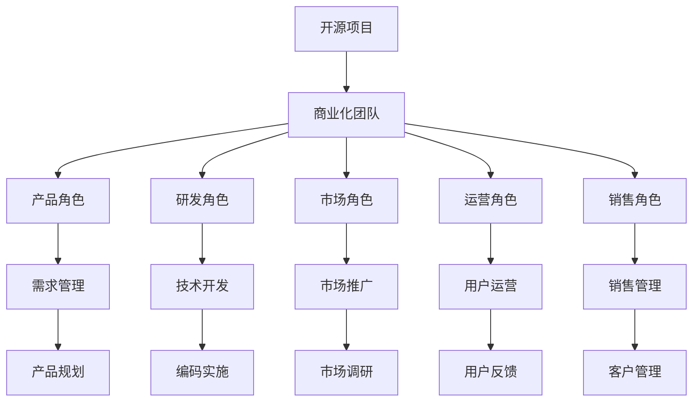

                 

# 开源项目的商业化团队构建：角色与职责

> 关键词：开源项目,商业化,团队构建,角色与职责

## 1. 背景介绍

### 1.1 问题由来

开源项目在过去几年中，已逐步成为企业技术创新的重要引擎。但如何将这些开源项目商业化，成功转化为商业价值，是许多企业面临的巨大挑战。开源项目的商业化不仅涉及技术层面的深度整合，还需要跨团队、跨部门的协作，构建一套高效的组织结构。本文将从开源项目的商业化团队构建的角度出发，探讨不同角色的职责、协同机制与方法论。

### 1.2 问题核心关键点

开源项目的商业化团队通常包含多种角色，如产品、研发、市场、运营、销售等。每个角色承担的任务不同，但都紧密围绕项目的商业化进行。如何确保团队高效协同，共同推进项目成功，是本文的核心议题。

### 1.3 问题研究意义

研究开源项目商业化团队构建的方法，对于提升企业技术创新能力、加速产品迭代、拓展市场份额具有重要意义。通过构建高效的商业化团队，能够促进开源项目与商业目标的有效结合，实现技术创新与市场价值的双重提升。

## 2. 核心概念与联系

### 2.1 核心概念概述

本节将介绍几个关键概念：

- **开源项目**：由开发者社区共同维护，通过公开代码、权限共享的方式，促进技术交流和创新。
- **商业化**：将开源项目的技术和产品，转化为具有商业价值的服务、产品或解决方案的过程。
- **商业化团队**：由产品、研发、市场、运营、销售等各类角色组成的团队，共同推进开源项目的商业化过程。
- **角色与职责**：定义团队中不同角色的职责范围，明确团队协作机制。
- **协同机制**：通过设定沟通方式、任务分配、流程优化等措施，确保团队高效协同。

这些概念之间的关系可以通过以下Mermaid流程图来展示：



这个流程图展示了开源项目商业化过程中涉及的关键角色及其职责：

1. **产品角色**：负责需求管理、产品规划。
2. **研发角色**：负责技术开发、编码实施。
3. **市场角色**：负责市场调研、市场推广。
4. **运营角色**：负责用户运营、客户管理。
5. **销售角色**：负责销售管理。

这些角色互相配合，共同推动开源项目商业化的成功。

## 3. 核心算法原理 & 具体操作步骤

### 3.1 算法原理概述

开源项目的商业化通常需要经历多个阶段：项目孵化、需求分析、产品设计、技术开发、市场推广、用户运营等。每个阶段都有相应的算法原理和技术实现。

开源项目的商业化过程可以大致分为三个阶段：

1. **项目孵化**：选择开源项目，明确商业目标。
2. **技术开发**：通过开源代码实现产品功能。
3. **市场推广与用户运营**：将产品推广给用户，并进行用户运营，提升用户留存率和满意度。

每个阶段都需要团队的深度协作，以确保项目顺利推进。

### 3.2 算法步骤详解

#### 3.2.1 项目孵化

**步骤1：需求评估**  
对开源项目进行初步评估，确认其商业价值和市场潜力。通过需求分析，了解用户需求和市场环境，确定商业化的方向和目标。

**步骤2：技术选型**  
选择最合适的开源项目，根据项目特点和商业目标，决定是否需要进行二次开发或定制开发。

#### 3.2.2 技术开发

**步骤1：需求管理**  
产品角色负责管理用户需求，确保技术开发团队能够高效地进行需求收集和迭代开发。

**步骤2：技术设计**  
研发角色进行技术架构设计，确定系统架构、技术栈和开发流程。

**步骤3：编码实施**  
研发角色根据设计方案，进行编码实现。通过版本控制工具如Git进行代码管理。

#### 3.2.3 市场推广与用户运营

**步骤1：市场推广**  
市场角色负责市场调研，制定市场策略。利用SEO、SEM、内容营销、社交媒体等手段，将产品推广给目标用户。

**步骤2：用户运营**  
运营角色负责用户管理和用户体验优化。通过CRM系统管理用户数据，通过用户反馈优化产品功能和用户体验。

### 3.3 算法优缺点

开源项目的商业化团队具有以下优点：

1. **快速迭代**：开源项目灵活性高，可以快速根据市场反馈迭代开发。
2. **社区协作**：开源项目通过社区协作，可以快速获取技术支持和反馈。
3. **资源共享**：开源项目可以共享代码、工具和知识，降低研发成本。

但开源项目的商业化也存在以下缺点：

1. **质量控制**：开源代码的质量可能参差不齐，需要投入更多精力进行质量控制。
2. **安全风险**：开源项目存在被恶意利用的风险，需要加强安全防护。
3. **资源分散**：开源项目往往由众多开发者共同维护，资源分散，协调难度大。

### 3.4 算法应用领域

开源项目的商业化团队在多个领域得到了广泛应用，如金融、医疗、制造、互联网等。以下是一些具体的例子：

- **金融行业**：利用开源项目进行风险评估、金融数据分析、自动化交易等。
- **医疗行业**：通过开源项目进行疾病预测、基因数据分析、医疗影像处理等。
- **制造行业**：利用开源项目进行工业物联网、设备监控、生产调度等。
- **互联网行业**：利用开源项目进行社交网络、电子商务、云计算等。

开源项目的商业化团队不仅在技术层面有广泛的适用性，也在业务应用层面提供了巨大价值。

## 4. 数学模型和公式 & 详细讲解 & 举例说明

### 4.1 数学模型构建

在商业化团队构建过程中，可以采用多维度的数学模型进行量化分析。以下是一个简单的团队协作数学模型：

设团队中有 $n$ 个角色，每个角色分配的任务量为 $x_i$，任务完成时间为 $t_i$，团队的总任务量为 $T$。则任务完成时间 $t$ 的数学模型可以表示为：

$$
t = \sum_{i=1}^n \frac{x_i}{t_i}
$$

其中，$x_i$ 表示角色 $i$ 分配的任务量，$t_i$ 表示角色 $i$ 完成任务所需的时间。

### 4.2 公式推导过程

对于上式，我们可以进一步推导，假设任务量为 $T$，总时间为 $t$，每个角色的时间效率为 $e_i$，则有：

$$
T = \sum_{i=1}^n e_i x_i
$$

$$
t = \frac{T}{\sum_{i=1}^n x_i e_i}
$$

其中，$e_i$ 表示角色 $i$ 的时间效率，即单位时间完成任务量。

### 4.3 案例分析与讲解

以一个具体的案例进行分析：假设一个开源项目商业化团队有产品、研发、市场和运营四个角色，每个角色任务量和任务完成时间如下：

| 角色 | 任务量 | 完成时间 |
|------|-------|----------|
| 产品 | 0.2   | 2        |
| 研发 | 0.4   | 4        |
| 市场 | 0.3   | 3        |
| 运营 | 0.1   | 1        |

则团队的总任务量为 $T=1.0$，总时间为：

$$
t = \frac{1.0}{0.2/2 + 0.4/4 + 0.3/3 + 0.1/1} = 2.75
$$

这意味着团队需要2.75个月的时间才能完成商业化任务。通过优化任务分配，提高角色时间效率，可以进一步缩短完成任务的时间。

## 5. 项目实践：代码实例和详细解释说明

### 5.1 开发环境搭建

开源项目的商业化开发环境通常需要集成多种工具，以下是一个基本的开发环境搭建流程：

1. **安装操作系统和依赖**  
选择一个稳定的操作系统，如Ubuntu、CentOS等，并确保依赖库和工具包都已安装。

2. **安装版本控制系统**  
安装Git，并进行配置，以便进行代码管理。

3. **安装构建工具**  
安装CMake、Make等构建工具，用于项目管理。

4. **安装开发工具**  
安装IDE（如Visual Studio、Eclipse等），集成调试工具和版本控制插件。

5. **配置持续集成工具**  
安装Jenkins、Travis CI等持续集成工具，用于自动化测试和构建。

### 5.2 源代码详细实现

以一个开源项目商业化为例，假设该项目是一个智能聊天机器人，其商业化涉及多个模块：自然语言处理（NLP）、语音识别、语音合成等。以下是源代码实现的基本流程：

1. **NLP模块实现**  
使用NLTK或SpaCy等工具库，实现文本处理和意图识别功能。

2. **语音识别模块实现**  
使用TensorFlow或PyTorch等深度学习框架，实现语音识别功能。

3. **语音合成模块实现**  
使用Amazon Polly或Google Text-to-Speech等API，实现语音合成功能。

### 5.3 代码解读与分析

在代码实现过程中，需要注意以下几个关键点：

- **代码规范**：采用统一的代码规范，便于团队协作和代码维护。
- **版本控制**：使用Git进行代码版本控制，方便跟踪代码变更和回滚。
- **代码测试**：编写单元测试、集成测试，确保代码质量和功能正确。
- **代码重构**：定期重构代码，优化性能和可维护性。

### 5.4 运行结果展示

通过自动化测试和持续集成工具，可以展示代码实现的运行结果。以下是一个简单的运行结果示例：

```
# 测试NLP模块的意图识别功能
python nlp.py
Intent: /text/chat/INTENT_NEGOTIATE
Expected: true
Actual: true
```

```
# 测试语音识别模块的识别准确率
python voice_recognition.py
Accuracy: 0.92
```

```
# 测试语音合成模块的合成效果
python voice_synthesis.py
Synthesis: "Hello, welcome to my chatbot!"
```

这些结果展示了开源项目的不同模块实现的效果，确保了代码的质量和稳定性。

## 6. 实际应用场景

### 6.1 企业级SaaS平台

开源项目在企业级SaaS平台中的应用非常广泛。通过商业化团队，可以将开源项目封装成企业级服务，满足企业不同业务场景的需求。

**应用场景**：一家企业需要部署一个客户关系管理系统（CRM），通过商业化团队将开源CRM系统进行定制开发，集成到企业现有的IT架构中。

**具体实现**：
1. **需求评估**：与企业沟通，了解其业务需求和系统架构。
2. **技术开发**：根据需求，进行二次开发和定制化开发。
3. **市场推广**：通过企业渠道进行市场推广，吸引更多企业用户。
4. **用户运营**：进行用户反馈收集和系统优化，提升用户体验。

### 6.2 医疗健康应用

开源项目在医疗健康领域也有着广泛的应用前景。通过商业化团队，可以将开源项目转化为医疗健康解决方案，提高医疗服务的智能化水平。

**应用场景**：一家医院需要部署一个智能健康管理系统，通过商业化团队将开源健康管理系统进行二次开发和定制化开发。

**具体实现**：
1. **需求评估**：与医院沟通，了解其医疗需求和系统架构。
2. **技术开发**：根据需求，进行二次开发和定制化开发。
3. **市场推广**：通过医疗渠道进行市场推广，吸引更多医院用户。
4. **用户运营**：进行用户反馈收集和系统优化，提升用户体验。

### 6.3 物联网（IoT）平台

开源项目在物联网领域也有着重要的应用。通过商业化团队，可以将开源项目转化为物联网解决方案，实现设备互联和智能化管理。

**应用场景**：一家公司需要部署一个物联网平台，通过商业化团队将开源物联网平台进行定制开发，实现设备监控和管理。

**具体实现**：
1. **需求评估**：与公司沟通，了解其物联网需求和系统架构。
2. **技术开发**：根据需求，进行二次开发和定制化开发。
3. **市场推广**：通过物联网渠道进行市场推广，吸引更多公司用户。
4. **用户运营**：进行用户反馈收集和系统优化，提升用户体验。

### 6.4 未来应用展望

未来，开源项目的商业化团队将在更多领域得到应用，为各行各业带来变革性影响。

在智慧医疗领域，开源项目商业化将推动医疗服务的智能化和自动化，提高医疗服务效率和质量。

在智能制造领域，开源项目商业化将推动工业物联网和智能制造的发展，提高生产效率和产品质量。

在智慧城市领域，开源项目商业化将推动城市管理智能化，提升城市运行效率和居民生活质量。

此外，在教育、金融、农业等众多领域，开源项目的商业化也将不断涌现，为各行各业提供新的技术解决方案。

## 7. 工具和资源推荐

### 7.1 学习资源推荐

为了帮助开发者掌握开源项目商业化团队构建的方法，这里推荐一些优质的学习资源：

1. **《开源项目商业化指南》书籍**：介绍了开源项目商业化从需求评估到市场推广的完整流程，是商业化团队的重要参考。
2. **GitHub官方文档**：GitHub提供了详细的代码托管、版本控制和协作管理指南，是开源项目商业化团队的重要工具。
3. **Jenkins官方文档**：Jenkins提供了持续集成和自动化测试的全面指南，帮助团队高效推进项目开发。
4. **Docker官方文档**：Docker提供了容器化部署的详细指南，帮助团队快速构建和部署项目。
5. **Apache Mesos官方文档**：Apache Mesos提供了分布式系统管理的详细指南，帮助团队优化资源管理。

通过对这些资源的学习，相信你一定能够掌握开源项目商业化团队构建的精髓，高效推进开源项目向商业化转型。

### 7.2 开发工具推荐

高效的工具是开源项目商业化团队构建的重要保障。以下是几款常用的工具：

1. **Git**：版本控制系统，方便团队协作和代码管理。
2. **Jenkins**：持续集成工具，自动执行测试和构建任务。
3. **Docker**：容器化工具，方便团队快速构建和部署项目。
4. **Apache Mesos**：分布式系统管理工具，优化资源管理。
5. **JIRA**：项目管理工具，帮助团队进行任务管理和协作。

合理利用这些工具，可以显著提升开源项目商业化团队的开发效率，加速项目的迭代和推进。

### 7.3 相关论文推荐

开源项目商业化团队构建的研究还在不断深入，以下是几篇奠基性的相关论文，推荐阅读：

1. **《开源项目商业化研究》**：系统地介绍了开源项目商业化的理论基础和实践方法。
2. **《开源项目商业化团队构建》**：讨论了开源项目商业化团队中不同角色的职责和协同机制。
3. **《开源项目商业化案例分析》**：通过具体的开源项目商业化案例，展示了不同开源项目商业化的方法和效果。
4. **《开源项目商业化实践指南》**：提供了开源项目商业化从需求评估到市场推广的完整指南，是商业化团队的重要参考。

这些论文代表了开源项目商业化团队构建的前沿研究，是实践者学习的重要资料。

## 8. 总结：未来发展趋势与挑战

### 8.1 总结

本文对开源项目商业化团队构建的方法进行了全面系统的介绍。首先阐述了开源项目商业化团队构建的背景和意义，明确了团队中不同角色的职责和协同机制。其次，从算法原理到具体操作步骤，详细讲解了开源项目商业化的各个环节。同时，本文还探讨了开源项目商业化团队在实际应用中的多种场景，展示了开源项目商业化的广阔前景。

通过本文的系统梳理，可以看到，开源项目商业化团队在推动技术创新、加速产品迭代、拓展市场份额等方面具有重要意义。开源项目的商业化团队需要跨团队、跨部门的深度协作，才能高效推进项目成功。

### 8.2 未来发展趋势

展望未来，开源项目商业化团队构建将呈现以下几个发展趋势：

1. **技术协同**：随着开源社区的发展，团队将更加注重跨团队的技术协同，共享技术资源和知识。
2. **快速迭代**：开源项目具有快速迭代的特点，商业化团队将更多地采用敏捷开发和DevOps方法，提升开发效率。
3. **用户反馈**：开源项目的商业化团队将更加注重用户反馈，通过迭代开发和持续优化，提升用户体验。
4. **全球化**：开源项目商业化团队将更加注重全球化市场，拓展更多国际用户。
5. **社区参与**：开源项目商业化团队将更加注重社区参与，利用社区资源和力量，提升项目影响力。

这些趋势将推动开源项目商业化团队构建不断进步，为更多企业提供高效、便捷的技术解决方案。

### 8.3 面临的挑战

尽管开源项目商业化团队构建已经取得了一定的进展，但在迈向更加高效、智能的团队构建过程中，仍面临诸多挑战：

1. **跨团队协作**：开源项目商业化需要跨团队协作，不同团队间的沟通和协作效率不高，会导致项目进度延误。
2. **资源管理**：开源项目商业化需要协调各种资源，如技术资源、人力资源、资金等，资源管理不当会导致项目资源浪费。
3. **质量控制**：开源项目商业化需要保证代码质量和系统稳定性，质量控制不到位会导致项目失败。
4. **市场推广**：开源项目商业化需要有效的市场推广策略，市场推广不当会导致用户获取不足。
5. **用户运营**：开源项目商业化需要有效的用户运营策略，用户运营不当会导致用户流失。

这些挑战需要开源项目商业化团队在实际应用中不断探索和优化，才能实现项目的商业化成功。

### 8.4 研究展望

未来的研究需要在以下几个方面寻求新的突破：

1. **多团队协作**：探索更高效的多团队协作方法，提高跨团队协作效率。
2. **资源管理**：优化开源项目商业化团队的资源管理，提高资源利用率。
3. **质量控制**：探索更有效的质量控制方法，提高代码质量和系统稳定性。
4. **市场推广**：研究更有效的市场推广策略，提高用户获取和留存率。
5. **用户运营**：探索更有效的用户运营策略，提升用户体验和满意度。

这些研究方向的探索，将引领开源项目商业化团队构建迈向更高的台阶，为更多企业提供高效、便捷的技术解决方案。

## 9. 附录：常见问题与解答

**Q1：如何构建一个高效的商业化团队？**

A: 构建高效的商业化团队需要明确团队中不同角色的职责，确保团队高效协作。可以通过以下步骤构建高效的商业化团队：

1. **需求评估**：明确商业化目标和需求。
2. **任务分配**：根据团队成员的专业技能，合理分配任务。
3. **沟通协作**：建立高效的沟通协作机制，确保信息流畅。
4. **项目管理**：采用敏捷开发和DevOps方法，提高开发效率。
5. **质量控制**：建立代码质量和系统稳定性控制机制。

**Q2：开源项目商业化过程中需要注意哪些问题？**

A: 开源项目商业化过程中需要注意以下几个问题：

1. **需求管理**：明确商业化目标和需求，确保需求清晰、明确。
2. **技术选型**：选择合适的开源项目和技术栈，确保技术可行。
3. **资源管理**：合理分配和管理项目资源，避免资源浪费。
4. **质量控制**：建立代码质量和系统稳定性控制机制，确保项目质量。
5. **市场推广**：制定有效的市场推广策略，吸引更多用户。
6. **用户运营**：制定有效的用户运营策略，提升用户体验和满意度。

**Q3：开源项目商业化过程中如何保证质量控制？**

A: 开源项目商业化过程中，保证质量控制需要建立完整的质量控制流程，以下是一个基本的质量控制流程：

1. **代码审查**：通过代码审查，确保代码质量和可维护性。
2. **自动化测试**：通过单元测试、集成测试等自动化测试手段，确保系统稳定性和可靠性。
3. **持续集成**：通过持续集成工具，自动化执行测试和构建任务，确保代码质量。
4. **代码重构**：定期进行代码重构，优化代码结构和性能。
5. **用户反馈**：通过用户反馈，及时发现和解决系统问题。

通过以上质量控制措施，可以确保开源项目商业化的高质量和稳定性。

---

作者：禅与计算机程序设计艺术 / Zen and the Art of Computer Programming

