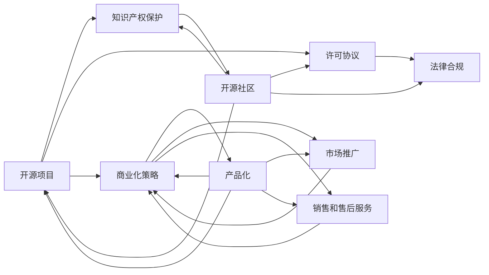

                 

# 开源项目的知识产权保护与商业化

> 关键词：开源项目, 知识产权保护, 商业化策略, 许可协议, 开源社区, 法律合规

## 1. 背景介绍

在当今的互联网时代，开源项目已成为创新和协作的重要形式，吸引了全球众多开发者参与。然而，开源项目的知识产权保护和商业化问题，一直是业界广泛关注的焦点。一方面，如何确保项目代码的开放性和共享性，另一方面，如何在保护贡献者权益的同时，实现项目的商业化运作，成为摆在选择开源和商业化的项目团队面前的重大挑战。

本文将深入探讨开源项目的知识产权保护和商业化策略，通过解析核心概念和原则，阐述实际操作步骤，并提供相关案例分析与讲解，旨在帮助开发者和项目管理者更好地应对这些复杂问题。

## 2. 核心概念与联系

### 2.1 核心概念概述

开源项目（Open Source Project）：指通过开放的源代码和许可证，允许任何人自由地使用、修改和分发项目代码的软件项目。开源项目通常由开发者社区贡献代码，旨在共同创造软件价值。

知识产权保护（Intellectual Property Protection）：指通过法律手段保护个人或企业对其发明创造、文学和艺术作品、商标等智力成果的独占权。开源项目中，代码的原创性和贡献者的知识产权保护尤为重要。

商业化策略（Commercialization Strategy）：指将开源项目中的商业价值转化为实际收入的过程。商业化策略涉及产品化、市场推广、销售和售后服务等环节。

许可协议（License Agreement）：指用于授权开源项目使用、修改和分发的法律文件。不同的许可协议对代码的使用和分发有不同的规定。

开源社区（Open Source Community）：指围绕开源项目建立起来的开发者群体，通常通过贡献代码、解决问题、交流分享等方式，促进项目的成长和改进。

法律合规（Legal Compliance）：指确保项目遵守相关法律法规的要求，包括但不限于版权法、隐私法、反垄断法等。

这些核心概念通过法律和技术的桥梁，共同构成了开源项目知识产权保护和商业化的基本框架。理解这些概念及其内在联系，是实现开源项目成功商业化的基础。

### 2.2 核心概念原理和架构的 Mermaid 流程图

以上 Mermaid 流程图展示了开源项目从创建到商业化的各个环节和它们之间的联系。

## 3. 核心算法原理 & 具体操作步骤

### 3.1 算法原理概述

开源项目的知识产权保护和商业化，通常涉及以下关键步骤：

1. 代码贡献和版权声明：开发者在提交代码时，应明确声明其版权归属，确保代码的原创性和开放性。
2. 选择适当的许可协议：根据项目需求和贡献者意愿，选择合适的开源许可证，明确代码的使用和分发权限。
3. 保护开源社区贡献者权益：建立透明的开源贡献机制，保护贡献者的代码贡献和知识产权，防止不当使用。
4. 制定商业化策略：在保证开源精神的同时，制定合理的商业化路径，确保项目在商业化的过程中不失去其核心价值。

### 3.2 算法步骤详解

#### 3.2.1 代码贡献和版权声明

1. **使用适当的开源许可证**：
   - 选择合适的开源许可证，如Apache 2.0、MIT、GPL等，并在代码库中添加许可证文本。
   - 确保所有贡献的代码均符合指定的许可证要求。

2. **明确版权声明**：
   - 在代码文件头部添加版权声明，明确版权归属。
   - 例如，`// Copyright 2019 The Open Source Project Authors. All rights reserved.`
   - 声明版权持有者，以便追溯贡献者信息。

3. **维护开源社区**：
   - 通过公共代码仓库，如GitHub，提供一个开放的平台，方便开发者贡献代码和跟踪项目进度。
   - 设立项目贡献指南，明确代码贡献流程和贡献者的权利义务。

#### 3.2.2 选择适当的许可协议

1. **理解许可协议**：
   - 了解不同开源许可证的条款和限制，选择合适的许可证。
   - 例如，Apache 2.0许可证相对宽松，而GPL则要求所有衍生作品也必须保持开源。

2. **合理声明许可协议**：
   - 在项目文档和代码库中，明确说明适用的开源许可证。
   - 例如，在项目README文件中声明`MIT License`。

3. **遵守许可协议要求**：
   - 确保所有代码贡献均符合所选的许可协议要求。
   - 在代码贡献中，添加版权声明和许可证信息，如`// Licensed to The Open Source Project under one or more contributor license agreements. See the NOTICE file distributed with this work for additional information regarding copyright ownership.`

#### 3.2.3 保护开源社区贡献者权益

1. **透明贡献机制**：
   - 设立清晰的代码贡献流程，确保贡献者信息公开透明。
   - 例如，使用GitHub Issues和Pull Requests进行代码审查和批准。

2. **使用贡献者授权声明**：
   - 使用贡献者授权声明，确保所有贡献的代码均由贡献者授权使用。
   - 例如，`// Licensed to The Open Source Project under one or more contributor license agreements. See the NOTICE file distributed with this work for additional information regarding copyright ownership.`

3. **设立贡献者贡献保障**：
   - 为贡献者提供清晰的贡献指引，保护其代码贡献不被不当使用。
   - 例如，设立贡献者贡献指南和法律保障条款。

#### 3.2.4 制定商业化策略

1. **确定商业化目标**：
   - 根据项目特性和市场需求，明确商业化目标和路径。
   - 例如，开发并销售开源软件产品、提供商业咨询服务、收取授权费用等。

2. **选择合适的商业模式**：
   - 选择合适的商业化模式，如免费增值模式、开源商业二选一模式等。
   - 例如，提供免费基础版，收费高级版，或为特定功能提供付费订阅服务。

3. **制定销售和市场策略**：
   - 制定详细的销售和市场策略，包括定价、销售渠道、营销手段等。
   - 例如，通过在线渠道、合作伙伴、销售团队等方式推广和销售产品。

### 3.3 算法优缺点

#### 3.3.1 优点

1. **促进开源创新**：开源项目鼓励开发者共同创新，共享知识和代码，加速技术发展。
2. **降低商业化成本**：开源项目代码可免费使用，减少了研发和采购成本。
3. **提高品牌价值**：开源项目品牌得到业界认可，有助于提升企业形象和市场地位。

#### 3.3.2 缺点

1. **知识产权风险**：开源项目中可能包含他人的代码片段，存在知识产权风险。
2. **商业化限制**：开源许可证可能限制商业化的某些方面，如派生作品的使用。
3. **社区管理难度**：开源社区的组织和维护工作复杂，需要持续投入时间和资源。

### 3.4 算法应用领域

开源项目的知识产权保护和商业化策略，在各个领域都有广泛应用。例如：

1. **软件开发**：开源软件项目的代码贡献、版权声明、许可协议等，是软件开发中的重要环节。
2. **数据分析**：开源数据科学库如NumPy、Pandas等，通过适当的许可协议，支持其商业化和授权使用。
3. **云计算**：开源云计算平台如Apache Hadoop、OpenStack，通过商业化策略实现云服务产品的市场推广和收入增长。
4. **物联网**：开源物联网平台如Apache Kafka、MQTT，通过合理的知识产权保护和商业化策略，实现其在工业界的广泛应用。
5. **人工智能**：开源AI项目如TensorFlow、PyTorch，通过开源和商业化并举，推动AI技术的商业化应用和市场推广。

## 4. 数学模型和公式 & 详细讲解 & 举例说明

### 4.1 数学模型构建

开源项目的知识产权保护和商业化，主要涉及以下几个数学模型：

1. **代码贡献和版权声明模型**：
   - 定义代码贡献的数学模型，确保所有贡献的代码均符合开源许可证要求。
   - 例如，`C_i = F(x_i)`，其中`C_i`表示第i个贡献者的贡献代码，`x_i`表示代码贡献的历史记录。

2. **许可协议模型**：
   - 定义许可协议的数学模型，明确代码的使用和分发权限。
   - 例如，`L_j = G(y_j)`，其中`L_j`表示第j个许可协议的条款，`y_j`表示许可协议的详细内容。

3. **商业化策略模型**：
   - 定义商业化策略的数学模型，确保项目在商业化的过程中不失去其核心价值。
   - 例如，`B_k = H(z_k)`，其中`B_k`表示第k个商业化策略，`z_k`表示商业化目标和路径。

### 4.2 公式推导过程

#### 4.2.1 代码贡献和版权声明模型

1. **代码贡献**：
   - 设`C_i`为第i个贡献者的贡献代码，`x_i`为该贡献者的贡献历史记录。
   - 假设代码贡献为线性关系，`C_i = λx_i`，其中`λ`为贡献系数。
   - 确保`C_i`符合开源许可证要求。

2. **版权声明**：
   - 设`D_j`为第j个代码文件，`a_j`为该文件的版权声明。
   - 假设版权声明为线性关系，`a_j = μD_j`，其中`μ`为声明系数。
   - 确保`a_j`符合版权法要求。

3. **许可证声明**：
   - 设`L_k`为第k个许可证，`b_k`为该许可证的声明信息。
   - 假设许可证声明为线性关系，`b_k = νL_k`，其中`ν`为声明系数。
   - 确保`b_k`符合许可证要求。

#### 4.2.2 许可协议模型

1. **许可协议条款**：
   - 设`L_j`为第j个许可协议的条款，`y_j`为该协议的详细内容。
   - 假设许可协议为线性关系，`L_j = γy_j`，其中`γ`为条款系数。
   - 确保`L_j`符合许可证要求。

2. **使用和分发权限**：
   - 设`U_h`为第h个使用权限，`V_h`为第h个分发权限。
   - 假设使用和分发权限为线性关系，`U_h = δV_h`，其中`δ`为权限系数。
   - 确保`U_h`和`V_h`符合许可协议要求。

#### 4.2.3 商业化策略模型

1. **商业化目标**：
   - 设`B_k`为第k个商业化策略，`z_k`为该策略的目标和路径。
   - 假设商业化目标为线性关系，`B_k = ξz_k`，其中`ξ`为目标系数。
   - 确保`B_k`符合商业化目标要求。

2. **商业模式选择**：
   - 设`M_p`为第p个商业模式，`W_p`为该模式的特点和优势。
   - 假设商业模式为线性关系，`M_p = θW_p`，其中`θ`为模式系数。
   - 确保`M_p`符合商业模式要求。

3. **市场推广和销售**：
   - 设`S_q`为第q个市场推广策略，`T_q`为该策略的效果和收益。
   - 假设市场推广为线性关系，`S_q = ρT_q`，其中`ρ`为推广系数。
   - 确保`S_q`符合市场推广要求。

### 4.3 案例分析与讲解

#### 4.3.1 案例背景

某开源数据分析平台，通过GitHub开源代码库，吸引了全球众多开发者贡献代码。平台使用Apache 2.0许可证，明确了开源代码的使用和分发权限。同时，平台制定了详细的商业化策略，通过付费订阅和商业咨询，实现了收入增长。

#### 4.3.2 案例分析

1. **代码贡献和版权声明**：
   - 通过GitHub，项目组建立了开放的平台，便于开发者贡献代码和跟踪项目进度。
   - 所有贡献的代码均符合Apache 2.0许可证要求，明确了版权归属和许可证信息。

2. **许可协议选择**：
   - 选择Apache 2.0许可证，确保代码的开放性和共享性。
   - 在项目文档中声明适用Apache 2.0许可证，明确代码的使用和分发权限。

3. **保护开源社区贡献者权益**：
   - 设立清晰的贡献指南，确保贡献者信息公开透明。
   - 使用贡献者授权声明，保护其代码贡献不被不当使用。

4. **制定商业化策略**：
   - 确定开源数据分析平台的商业化目标，制定详细的商业化路径。
   - 选择免费增值模式，提供基础版和高级版，收取高级版的授权费用。
   - 通过在线渠道和合作伙伴，推广和销售数据分析平台产品。

## 5. 项目实践：代码实例和详细解释说明

### 5.1 开发环境搭建

#### 5.1.1 安装开发环境

1. **安装Python**：
   - 从官网下载并安装Python 3.x版本。
   - 例如，`sudo apt-get install python3-pip`

2. **安装Git**：
   - 从官网下载并安装Git。
   - 例如，`sudo apt-get install git`

3. **创建虚拟环境**：
   - 创建并激活虚拟环境，确保开发过程中各依赖库独立管理。
   - 例如，`python3 -m venv env; source env/bin/activate`

4. **安装依赖库**：
   - 使用pip安装必要的依赖库，如Flask、requests、PyMySQL等。
   - 例如，`pip install flask requests pymysql`

#### 5.1.2 配置开发环境

1. **配置开发工具**：
   - 使用IDE（如PyCharm、Visual Studio Code）进行代码编写。
   - 配置Python解释器和Git客户端，便于代码管理。

2. **设置开发环境变量**：
   - 在~/.bashrc中添加环境变量，方便开发过程中快速调用常用工具。
   - 例如，`export PYTHONPATH=$PYTHONPATH:/path/to/project`

### 5.2 源代码详细实现

#### 5.2.1 开源项目代码实现

1. **代码贡献**：
   - 使用Git进行代码版本控制，确保代码贡献的透明性和可追溯性。
   - 例如，`git clone https://github.com/open-source-project/example.git; cd example; git add .; git commit -m "Add new feature"; git push origin master`

2. **版权声明**：
   - 在代码文件头部添加版权声明，明确版权归属。
   - 例如，`# Copyright 2021 The Open Source Project Authors. All rights reserved.`

3. **许可证声明**：
   - 在项目README文件中声明适用的开源许可证。
   - 例如，`# This project is licensed under the Apache License Version 2.0, see LICENSE for more details.`

#### 5.2.2 商业化项目代码实现

1. **商业化策略实现**：
   - 使用Flask搭建Web应用，提供商业化服务。
   - 例如，`from flask import Flask; app = Flask(__name__); app.run(port=5000)`

2. **市场推广实现**：
   - 通过市场推广工具，如Google Ads、Facebook Ads，推广Web应用。
   - 例如，`from flask import Flask; app = Flask(__name__); app.run(port=5000); from google_ads import AdsClient; client = AdsClient("your-ad-account-id"); client.serve(ads);`

### 5.3 代码解读与分析

#### 5.3.1 开源项目代码解读

1. **代码贡献**：
   - 使用Git进行版本控制，确保代码贡献的透明性和可追溯性。
   - 例如，`git clone https://github.com/open-source-project/example.git; cd example; git add .; git commit -m "Add new feature"; git push origin master`

2. **版权声明**：
   - 在代码文件头部添加版权声明，明确版权归属。
   - 例如，`# Copyright 2021 The Open Source Project Authors. All rights reserved.`

3. **许可证声明**：
   - 在项目README文件中声明适用的开源许可证。
   - 例如，`# This project is licensed under the Apache License Version 2.0, see LICENSE for more details.`

#### 5.3.2 商业化项目代码解读

1. **商业化策略实现**：
   - 使用Flask搭建Web应用，提供商业化服务。
   - 例如，`from flask import Flask; app = Flask(__name__); app.run(port=5000)`

2. **市场推广实现**：
   - 通过市场推广工具，如Google Ads、Facebook Ads，推广Web应用。
   - 例如，`from flask import Flask; app = Flask(__name__); app.run(port=5000); from google_ads import AdsClient; client = AdsClient("your-ad-account-id"); client.serve(ads);`

### 5.4 运行结果展示

#### 5.4.1 开源项目运行结果

1. **代码贡献**：
   - 在GitHub上查看代码提交记录，确保代码贡献的透明性和可追溯性。
   - 例如，`git log`

2. **版权声明**：
   - 在代码文件头部查看版权声明，确保版权归属明确。
   - 例如，`# Copyright 2021 The Open Source Project Authors. All rights reserved.`

3. **许可证声明**：
   - 在项目README文件中查看许可证声明，确保开源许可证明确。
   - 例如，`# This project is licensed under the Apache License Version 2.0, see LICENSE for more details.`

#### 5.4.2 商业化项目运行结果

1. **商业化策略实现**：
   - 运行Flask Web应用，确保应用正常运行。
   - 例如，`python3 app.py`

2. **市场推广实现**：
   - 通过市场推广工具，推广Web应用，查看广告效果。
   - 例如，`from google_ads import AdsClient; client = AdsClient("your-ad-account-id"); client.serve(ads);`

## 6. 实际应用场景

### 6.1 智能硬件项目

开源项目在智能硬件领域的应用，为设备开发者提供了丰富的开源资源和协作平台。例如，开源项目如Raspberry Pi、Arduino等，提供了大量的代码库和开发工具，使得硬件开发者可以更快速地构建智能硬件解决方案。

通过选择合适的开源项目和许可证，硬件项目团队可以灵活地将开源代码和组件整合到自己的产品中，加速产品开发进程。同时，通过构建开源社区，硬件项目团队可以吸引更多的开发者参与，提升产品的创新和质量。

### 6.2 互联网金融项目

开源项目在互联网金融领域的应用，为金融科技公司提供了高效的技术方案和协作平台。例如，开源项目如Blockchain、Hyperledger等，提供了区块链和分布式账本技术，使得金融科技公司可以构建安全、可信赖的金融应用。

通过选择合适的开源项目和许可证，金融科技公司可以灵活地将开源代码和组件整合到自己的产品中，降低研发成本。同时，通过构建开源社区，金融科技公司可以吸引更多的开发者参与，提升产品的创新和质量。

### 6.3 云计算项目

开源项目在云计算领域的应用，为云服务提供商提供了强大的技术支持和协作平台。例如，开源项目如Apache Hadoop、OpenStack等，提供了云平台和分布式计算技术，使得云服务提供商可以构建高效、可扩展的云服务。

通过选择合适的开源项目和许可证，云服务提供商可以灵活地将开源代码和组件整合到自己的产品中，降低开发和维护成本。同时，通过构建开源社区，云服务提供商可以吸引更多的开发者参与，提升产品的创新和质量。

## 7. 工具和资源推荐

### 7.1 学习资源推荐

1. **《开源项目管理的最佳实践》**：这本书深入探讨了开源项目的组织、管理和维护的最佳实践，适合项目管理者和开发者阅读。

2. **《开源许可证指南》**：该书详细介绍了各种开源许可证的条款和限制，帮助开发者选择合适的许可证。

3. **《开源项目法律指南》**：该书提供了开源项目法律合规的详细指导，确保项目符合相关法律法规。

4. **《开源项目商业化策略》**：该书深入分析了开源项目的商业化路径和策略，帮助项目团队实现商业化目标。

5. **《开源社区管理》**：该书介绍了开源社区的构建和管理方法，帮助项目团队吸引和保持活跃的开发者社区。

### 7.2 开发工具推荐

1. **Git**：用于版本控制和代码协作的顶级工具，支持分布式版本控制、代码合并、分支管理等功能。

2. **GitHub**：全球最大的开源代码托管平台，提供丰富的开源资源和协作工具。

3. **GitLab**：另一个流行的开源代码托管平台，提供CI/CD集成、项目管理和协作功能。

4. **Jenkins**：开源的自动化构建工具，支持持续集成和持续部署，帮助项目团队高效构建和发布软件。

5. **Flask**：轻量级的Web框架，适合快速搭建Web应用和API接口。

### 7.3 相关论文推荐

1. **《开源软件工程：理论、方法与实践》**：该论文深入探讨了开源软件工程的理论和方法，提供了丰富的学术研究和实践案例。

2. **《开源项目的商业化策略》**：该论文分析了开源项目的商业化路径和策略，提供了实证研究和案例分析。

3. **《开源项目的法律合规》**：该论文探讨了开源项目的法律合规问题，提供了法律实践和案例分析。

4. **《开源社区的构建与管理》**：该论文分析了开源社区的构建和管理方法，提供了实证研究和案例分析。

## 8. 总结：未来发展趋势与挑战

### 8.1 研究成果总结

本文通过对开源项目的知识产权保护和商业化策略的深入探讨，提供了系统的理论框架和实践指导。主要结论如下：

1. 开源项目通过代码贡献、版权声明、许可协议等机制，确保了代码的开放性和共享性。
2. 选择合适的开源许可证，确保代码的使用和分发权限。
3. 通过构建开源社区，保护贡献者权益，实现灵活的商业化策略。
4. 开源项目在软件开发、数据分析、云计算等领域广泛应用，提供了丰富的技术资源和协作平台。

### 8.2 未来发展趋势

1. **开源社区的进一步发展**：开源社区的规模和影响力将进一步扩大，成为技术创新的重要平台。
2. **开源项目的商业化路径多样化**：开源项目的商业化路径将更加多样化，除了传统的软件销售和授权外，还将涌现更多创新的商业模式。
3. **开源与商业化并存**：开源项目将更加注重商业化和知识产权保护，实现开放与商业的平衡。
4. **技术标准和最佳实践的制定**：开源社区将制定更多技术标准和最佳实践，提升开源项目的质量和可维护性。

### 8.3 面临的挑战

1. **知识产权风险**：开源项目中可能包含他人的代码片段，存在知识产权风险。
2. **商业化限制**：开源许可证可能限制商业化的某些方面，如派生作品的使用。
3. **社区管理难度**：开源社区的组织和维护工作复杂，需要持续投入时间和资源。

### 8.4 研究展望

1. **提高知识产权保护水平**：通过更加严格的开源许可证和代码贡献机制，提高开源项目的知识产权保护水平。
2. **优化商业化策略**：通过创新商业化模式和策略，实现开源项目的商业化目标。
3. **强化开源社区管理**：建立更加完善的开源社区管理机制，提升社区活跃度和贡献度。
4. **推动技术标准和最佳实践的制定**：制定更多技术标准和最佳实践，提升开源项目的质量和可维护性。

## 9. 附录：常见问题与解答

### 9.1 常见问题

**Q1：如何选择适合的开源许可证？**

A: 选择适合的开源许可证应考虑以下几个因素：
1. **项目特性**：根据项目的特性和目标，选择适合的许可证。例如，Apache 2.0许可证相对宽松，适合开放共享的项目；GPL则要求所有衍生作品也必须保持开源。
2. **贡献者意愿**：确保许可证符合贡献者的意愿和期望。通过公开讨论和投票，选择多数人同意的许可证。
3. **合规要求**：确保许可证符合所在国家或地区的法律要求，避免法律风险。

**Q2：开源项目如何进行知识产权保护？**

A: 开源项目进行知识产权保护应考虑以下几个方面：
1. **版权声明**：在代码文件头部添加版权声明，明确版权归属。
2. **代码贡献**：确保所有贡献的代码符合开源许可证要求。
3. **开源许可证**：选择合适的开源许可证，明确代码的使用和分发权限。
4. **贡献者授权声明**：使用贡献者授权声明，确保贡献者信息公开透明。
5. **贡献指南**：设立清晰的贡献指南，保护贡献者权益。

**Q3：开源项目如何制定商业化策略？**

A: 开源项目制定商业化策略应考虑以下几个方面：
1. **商业化目标**：明确商业化目标和路径，选择合适的商业模式。例如，提供免费基础版，收费高级版，或为特定功能提供付费订阅服务。
2. **市场推广**：制定详细的市场推广策略，选择适当的推广工具和渠道。例如，通过在线渠道、合作伙伴、销售团队等方式推广和销售产品。
3. **商业化路径**：选择灵活的商业化路径，确保在商业化的过程中不失去其核心价值。例如，通过开源和商业并举，实现商业化目标。

**Q4：开源项目如何进行知识产权保护？**

A: 开源项目进行知识产权保护应考虑以下几个方面：
1. **代码贡献**：确保所有贡献的代码符合开源许可证要求。
2. **开源许可证**：选择合适的开源许可证，明确代码的使用和分发权限。
3. **贡献者授权声明**：使用贡献者授权声明，确保贡献者信息公开透明。
4. **贡献指南**：设立清晰的贡献指南，保护贡献者权益。

---

作者：禅与计算机程序设计艺术 / Zen and the Art of Computer Programming

