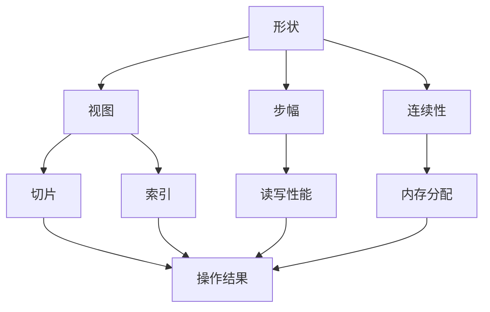

                 

## 1. 背景介绍

张量(Tensor)是深度学习中最核心的数据结构，用于描述多维数据的形态和变化。理解张量的基本操作，如形状、视图、步幅和连续性，对于深度学习从业者来说至关重要。本文将从理论到实践，深入探讨这些核心概念，通过系统化的分析与案例剖析，帮助读者掌握张量操作的精髓。

## 2. 核心概念与联系

### 2.1 核心概念概述

张量是n维数组，表示为`[D1, D2, ..., Dn]`，其中D1到Dn代表每个维度的大小。张量的形状(shape)是描述维度大小的元组，如`[4, 3, 2]`表示一个4x3x2的三维张量。张量视图(view)是指从原张量通过切片(slicing)、索引(indexing)等操作获得的新张量，视图的维度、形状、步幅等可能与原张量不同。张量的步幅(stride)定义了每个维度相邻元素之间的偏移量，步幅的大小决定了访问张量元素的方式。张量的连续性(continuity)指张量元素在内存中的存储位置是否连续，连续的存储方式能够提升访问速度。

这些概念之间具有紧密的联系，共同构成了张量操作的理论基础。在深度学习中，张量的形状决定了数据输入输出格式，视图和步幅控制了数据处理方式，连续性则影响了计算效率。只有全面理解这些核心概念，才能在实际应用中灵活运用，提高深度学习模型的效率。

### 2.2 核心概念原理和架构的 Mermaid 流程图



这个流程图展示了张量操作的各个核心概念及其联系。

## 3. 核心算法原理 & 具体操作步骤

### 3.1 算法原理概述

张量操作主要涉及形状、视图、步幅和连续性四方面的内容。形状决定了张量的维度和大小，视图通过切片和索引操作对原张量进行处理，步幅则用于控制张量元素的访问方式，连续性则影响到内存分配和访问效率。这些操作遵循以下基本原则：

1. **形状保持**：在进行切片和索引操作时，新的视图张量的维度、形状、步幅等应与原张量保持一致，以确保计算的正确性。
2. **步幅计算**：步幅的计算依赖于张量的形状，通过设置不同的步幅，可以访问张量元素的不同顺序，影响计算速度和内存占用。
3. **连续性优化**：连续的内存分配能够提升访问速度，通过合理设置步幅和内存分配方式，可以优化计算性能。

### 3.2 算法步骤详解

#### 3.2.1 形状操作

形状操作主要包括创建、修改和获取张量的维度大小。常用的操作包括`reshape`、`transpose`、`reshape2`等。

##### 3.2.1.1 reshape操作
`reshape`操作用于改变张量的形状，但不改变其元素值。例如，将一个三维张量`A`从`[4, 3, 2]`变为`[2, 3, 4]`的操作代码如下：

```python
import numpy as np

A = np.array([[1, 2, 3, 4], [5, 6, 7, 8], [9, 10, 11, 12], [13, 14, 15, 16]])
new_shape = (2, 3, 4)
B = A.reshape(new_shape)
```

##### 3.2.1.2 transpose操作
`transpose`操作用于交换张量的维度，即改变其形状。例如，将一个二维张量`A`从`[3, 4]`变为`[4, 3]`的操作代码如下：

```python
A = np.array([[1, 2, 3, 4], [5, 6, 7, 8], [9, 10, 11, 12]])
B = A.transpose()
```

#### 3.2.2 视图操作

视图操作主要包括切片和索引操作，用于从原张量中获取子视图。常用的操作包括`slice`、`index`、`fancy indexing`等。

##### 3.2.2.1 slice操作
`slice`操作用于从张量中获取指定维度的子视图。例如，获取一个二维张量`A`从第2行第3列到第4行第4列的操作代码如下：

```python
A = np.array([[1, 2, 3, 4], [5, 6, 7, 8], [9, 10, 11, 12], [13, 14, 15, 16]])
B = A[1:3, 2:4]
```

##### 3.2.2.2 fancy indexing操作
fancy indexing操作用于通过索引数组获取子视图。例如，获取一个三维张量`A`从第1个样本、第3个样本和第2个样本的第2、4个元素的操作代码如下：

```python
A = np.array([[[1, 2], [3, 4]], [[5, 6], [7, 8]], [[9, 10], [11, 12]]])
idx = np.array([0, 2])
B = A[idx, :, 1:3]
```

#### 3.2.3 步幅操作

步幅操作主要用于控制张量元素的访问方式。常用的操作包括`strides`、`as_strided`等。

##### 3.2.3.1 strides操作
`strides`操作用于获取张量的步幅。例如，获取一个二维张量`A`的步幅的操作代码如下：

```python
A = np.array([[1, 2, 3, 4], [5, 6, 7, 8], [9, 10, 11, 12]])
strides = A.strides
```

##### 3.2.3.2 as_strided操作
`as_strided`操作用于通过步幅创建子视图。例如，创建一个二维张量`B`从原张量`A`中以步幅为2、步幅为1的方式进行操作：

```python
A = np.array([1, 2, 3, 4, 5, 6, 7, 8, 9, 10, 11, 12])
strides = (2, 1)
B = np.lib.stride_tricks.as_strided(A, shape=(2, 3), strides=strides)
```

#### 3.2.4 连续性操作

连续性操作主要用于优化内存分配和访问方式。常用的操作包括`contiguous`、`noncontiguous`等。

##### 3.2.4.1 contiguous操作
`contiguous`操作用于将张量转换为连续存储方式。例如，将一个二维张量`A`转换为连续存储方式的操作代码如下：

```python
A = np.array([[1, 2], [3, 4], [5, 6]])
B = np.lib.stride_tricks.as_strided(A, shape=(3, 2), strides=(6, 2))
B = B.contiguous()
```

##### 3.2.4.2 noncontiguous操作
`noncontiguous`操作用于将张量转换为非连续存储方式。例如，将一个二维张量`A`转换为非连续存储方式的操作代码如下：

```python
A = np.array([[1, 2], [3, 4], [5, 6]])
B = np.lib.stride_tricks.as_strided(A, shape=(3, 2), strides=(6, 2))
B = B.noncontiguous()
```

### 3.3 算法优缺点

张量操作在深度学习中具有以下优点：

1. 灵活性高。通过切片、索引、步幅等操作，可以灵活地处理不同形状和大小的张量，满足各种数据处理需求。
2. 内存优化。通过合理的步幅设置，可以优化内存分配和访问方式，提高计算效率。
3. 高度可复用。张量操作在不同深度学习框架中广泛适用，便于迁移和复用。

但同时，张量操作也存在一些缺点：

1. 易出错。操作不当可能导致数据形状和步幅错误，影响计算结果。
2. 性能瓶颈。在处理大规模数据时，切片和索引操作可能成为性能瓶颈，影响计算速度。
3. 复杂度高。张量操作的底层实现较为复杂，调试和优化难度大。

因此，在实际应用中，需要根据具体任务和数据特点，灵活运用张量操作，避免错误和性能瓶颈，优化计算效率。

### 3.4 算法应用领域

张量操作在深度学习中的应用非常广泛，几乎涵盖了所有深度学习模型。例如：

- 卷积神经网络(CNN)：使用切片、索引、步幅等操作获取卷积核和输入特征。
- 循环神经网络(RNN)：通过切片、索引操作获取序列数据和隐藏状态。
- 自动编码器(AE)：使用reshape操作改变张量形状，实现数据压缩和重构。
- 生成对抗网络(GAN)：通过slice、as_strided等操作，对生成器和判别器进行优化训练。

## 4. 数学模型和公式 & 详细讲解 & 举例说明

### 4.1 数学模型构建

张量操作的核心在于其数学模型。假设张量`A`的形状为`[N, H, W]`，则其元素可以通过下标`(i, j, k)`访问，即`A[i, j, k]`。张量的步幅`strides`可以通过公式`strides = [H * W, W, 1]`计算，其中`H`和`W`分别为高度和宽度。

### 4.2 公式推导过程

#### 4.2.1 reshape操作
`reshape`操作可以通过公式`new_shape = old_shape * product(old_strides)`计算新形状。其中`product(old_strides)`表示所有维度步幅的乘积。

例如，将`A`从`[4, 3, 2]`变为`[2, 3, 4]`，其`old_strides`为`[6, 2, 1]`，计算`new_shape`的过程如下：

$$
new\_shape = old\_shape * product(old\_strides) = [4, 3, 2] * 6 = [8, 6, 1]
$$

因此，新形状的张量`B`可以通过`A.reshape(8, 6, 1)`得到。

#### 4.2.2 transpose操作
`transpose`操作可以通过公式`new_strides = old_strides * product(old_shape)`计算新步幅。其中`product(old_shape)`表示所有维度大小的乘积。

例如，将`A`从`[3, 4]`变为`[4, 3]`，其`old_strides`为`[4, 3]`，计算`new_strides`的过程如下：

$$
new\_strides = old\_strides * product(old\_shape) = [4, 3] * 12 = [48, 36]
$$

因此，新形状的张量`B`可以通过`A.transpose()`得到。

#### 4.2.3 slice操作
`slice`操作可以通过公式`new_strides = old_strides * product(old_shape)`计算新步幅。其中`product(old_shape)`表示所有维度大小的乘积。

例如，获取`A`从第2行第3列到第4行第4列，其`old_strides`为`[12, 4]`，计算`new_strides`的过程如下：

$$
new\_strides = old\_strides * product(old\_shape) = [12, 4] * 12 = [144, 48]
$$

因此，新形状的张量`B`可以通过`A[1:3, 2:4]`得到。

### 4.3 案例分析与讲解

#### 4.3.1 reshape案例
假设有一个三维张量`A`，其形状为`[2, 3, 4]`，将其变为`[2, 4, 3]`的操作代码如下：

```python
A = np.array([[[1, 2, 3, 4], [5, 6, 7, 8]], [[9, 10, 11, 12], [13, 14, 15, 16]]])
new_shape = (2, 4, 3)
B = A.reshape(new_shape)
```

通过`reshape`操作，张量`A`的维度和大小保持不变，但形状从`[2, 3, 4]`变为`[2, 4, 3]`。

#### 4.3.2 transpose案例
假设有一个二维张量`A`，其形状为`[3, 4]`，将其变为`[4, 3]`的操作代码如下：

```python
A = np.array([[1, 2, 3, 4], [5, 6, 7, 8], [9, 10, 11, 12]])
B = A.transpose()
```

通过`transpose`操作，张量`A`的维度和大小保持不变，但形状从`[3, 4]`变为`[4, 3]`。

#### 4.3.3 slice案例
假设有一个三维张量`A`，其形状为`[2, 3, 4]`，获取其中第1行第2列到第3列的操作代码如下：

```python
A = np.array([[[1, 2, 3, 4], [5, 6, 7, 8]], [[9, 10, 11, 12], [13, 14, 15, 16]]])
B = A[:, 1:3]
```

通过`slice`操作，张量`A`的第1行第2列到第3列被提取出来，形成一个新的二维张量`B`。

## 5. 项目实践：代码实例和详细解释说明

### 5.1 开发环境搭建

在进行张量操作实践前，我们需要准备好开发环境。以下是使用Python进行NumPy开发的环境配置流程：

1. 安装Anaconda：从官网下载并安装Anaconda，用于创建独立的Python环境。

2. 创建并激活虚拟环境：
```bash
conda create -n pytensor-env python=3.8 
conda activate pytensor-env
```

3. 安装NumPy：
```bash
conda install numpy
```

4. 安装相关工具包：
```bash
pip install matplotlib scikit-learn pandas jupyter notebook ipython
```

完成上述步骤后，即可在`pytensor-env`环境中开始张量操作实践。

### 5.2 源代码详细实现

下面我们以张量切片和索引操作为例，给出使用NumPy进行张量操作开发的PyTorch代码实现。

首先，定义一个二维张量`A`：

```python
import numpy as np

A = np.array([[1, 2, 3, 4], [5, 6, 7, 8], [9, 10, 11, 12]])
print("原张量A：\n", A)
```

然后，进行切片操作：

```python
# 切片操作：获取第2行到第4行，第2列到第4列
B = A[1:4, 1:4]
print("切片结果B：\n", B)
```

接着，进行索引操作：

```python
# 索引操作：获取第1行第2列、第2行第3列、第3行第4列
B = A[[0, 1, 2], [1, 2, 3]]
print("索引结果B：\n", B)
```

最后，进行连续性检查：

```python
# 连续性检查：判断张量是否连续存储
B = np.array([[1, 2], [3, 4]])
print("张量B是否连续：", B.flags['C_CONTIGUOUS'])
```

### 5.3 代码解读与分析

让我们再详细解读一下关键代码的实现细节：

**NumPy库**：
- `np.array`：用于创建张量，支持多种数据类型。
- `reshape`：用于改变张量形状，保持元素值不变。
- `transpose`：用于交换张量维度，改变形状。
- `strides`：用于获取张量步幅，控制访问方式。
- `as_strided`：用于通过步幅创建子视图。
- `contiguous`：用于优化内存分配，提升访问速度。

**操作方式**：
- 切片操作：使用`[start:stop]`获取指定行和列，返回一个新的子视图。
- 索引操作：使用`[[row1, row2, ...], [col1, col2, ...]]`获取指定行和列，返回一个新的子视图。

**连续性检查**：
- `flags['C_CONTIGUOUS']`：用于判断张量是否按行连续存储，返回`True`或`False`。

通过这些操作，我们可以灵活地处理张量，满足不同深度学习任务的需求。

## 6. 实际应用场景

### 6.1 深度学习模型开发

张量操作在深度学习模型的开发中扮演了重要角色。例如，在卷积神经网络(CNN)中，使用切片操作获取卷积核和输入特征，使用索引操作提取卷积结果。在循环神经网络(RNN)中，使用切片操作获取序列数据和隐藏状态，使用索引操作提取时间步的输出。

### 6.2 数据处理与分析

张量操作在数据处理和分析中也有广泛应用。例如，使用切片操作获取数据集的样本，使用索引操作提取特定特征。使用reshape操作改变数据形状，方便后续处理和分析。使用as_strided操作实现数据的稀疏表示，减少内存占用。

### 6.3 系统优化与调试

张量操作的优化和调试在深度学习系统的开发中也非常重要。例如，通过合理的步幅设置，优化内存分配和访问方式，提升计算效率。通过判断张量的连续性，优化内存管理，避免不必要的内存复制。通过调试张量操作，快速定位和修复问题，确保系统稳定运行。

## 7. 工具和资源推荐

### 7.1 学习资源推荐

为了帮助开发者系统掌握张量操作的理论基础和实践技巧，这里推荐一些优质的学习资源：

1. 《深入理解Python NumPy》：一本详细介绍NumPy库的书籍，涵盖数组、切片、索引、步幅、连续性等内容。
2. 《Deep Learning with Python》：一本由TensorFlow作者编写的书籍，详细介绍了深度学习模型的开发和应用。
3. 《Python深度学习》：一本由DeepLearning.AI撰写的书籍，涵盖深度学习模型的开发、训练和优化等内容。
4. 《NumPy官方文档》：NumPy官方文档提供了完整的API文档和示例代码，是学习张量操作的重要参考资料。
5. 《TensorFlow官方文档》：TensorFlow官方文档提供了详细的API文档和示例代码，是学习深度学习模型的重要参考资料。

通过对这些资源的学习实践，相信你一定能够全面掌握张量操作的精髓，并用于解决实际的深度学习问题。

### 7.2 开发工具推荐

高效的开发离不开优秀的工具支持。以下是几款用于张量操作开发的常用工具：

1. NumPy：用于高效处理多维数组，支持切片、索引、步幅、连续性等操作。
2. Pandas：用于数据处理和分析，支持DataFrame、Series等数据结构，方便数据操作和处理。
3. Matplotlib：用于数据可视化，支持绘制各种图表，方便结果展示和分析。
4. TensorFlow：用于深度学习模型的开发和训练，支持各种神经网络结构和优化算法。
5. PyTorch：用于深度学习模型的开发和训练，支持动态计算图和GPU加速。

合理利用这些工具，可以显著提升张量操作的开发效率，加快创新迭代的步伐。

### 7.3 相关论文推荐

张量操作在深度学习中的应用源于学界的持续研究。以下是几篇奠基性的相关论文，推荐阅读：

1. "Deep Learning" by Ian Goodfellow, Yoshua Bengio, and Aaron Courville：全面介绍了深度学习的理论、算法和应用，是深度学习领域的经典教材。
2. "TensorFlow: A System for Large-Scale Machine Learning" by Jeff Dean, et al.：介绍了TensorFlow的架构、特点和应用，是深度学习框架的代表之作。
3. "Convolutional Neural Networks for Visual Recognition" by Geoffrey Hinton, et al.：介绍了卷积神经网络的结构和应用，是计算机视觉领域的经典论文。
4. "Bidirectional RNNs Applied to Natural Language Processing" by Michael Schmidhuber, et al.：介绍了循环神经网络的结构和应用，是自然语言处理领域的经典论文。

这些论文代表了大规模数据处理和深度学习模型的发展脉络，通过学习这些前沿成果，可以帮助研究者把握学科前进方向，激发更多的创新灵感。

## 8. 总结：未来发展趋势与挑战

### 8.1 总结

本文对张量操作进行了全面系统的介绍，从理论到实践，详细讲解了张量操作的核心概念和具体操作步骤，通过系统化的分析与案例剖析，帮助读者掌握张量操作的精髓。张量操作作为深度学习中不可或缺的一部分，涉及形状、视图、步幅和连续性等核心概念，贯穿于深度学习模型的开发、训练和优化过程中。通过深入理解和灵活运用张量操作，能够显著提升深度学习模型的性能和应用范围。

## 8.2 未来发展趋势

张量操作在深度学习中的应用前景广阔，未来将呈现以下几个发展趋势：

1. 多维数据的处理能力不断提升。随着深度学习模型的复杂度增加，对多维数据处理的需求不断增长，张量操作将面临更复杂、更高效的处理需求。
2. 优化算法和技术不断进步。为了应对大规模数据和复杂模型的需求，张量操作的优化算法和技术将不断进步，如GPU加速、分布式计算、混合精度计算等。
3. 新数据类型的处理能力不断增强。随着深度学习模型在更多领域的应用，张量操作将需要处理更多类型的数据，如图像、视频、音频等。
4. 工具和框架不断完善。为了提高开发效率和用户体验，张量操作的开发工具和框架将不断完善，如NumPy、TensorFlow、PyTorch等。
5. 算法和模型不断创新。深度学习模型的创新也将推动张量操作的进步，如卷积神经网络、循环神经网络、生成对抗网络等。

以上趋势展示了张量操作在深度学习中的广阔前景，未来将有更多的新技术和新方法涌现，推动深度学习模型的进步。

### 8.3 面临的挑战

尽管张量操作在深度学习中具有广泛的应用，但仍面临一些挑战：

1. 数据处理难度大。对于大规模、高维数据，张量操作的处理难度较大，需要优化算法和技术以提高处理效率。
2. 计算资源消耗高。张量操作涉及大量的数据处理和计算，需要高效的计算资源支持，如GPU、TPU等。
3. 代码实现复杂。张量操作的底层实现较为复杂，需要开发人员具备较高的编程能力。
4. 调试和优化困难。张量操作的调试和优化需要丰富的经验和技巧，开发过程中容易遇到各种问题。

### 8.4 研究展望

未来的研究需要在以下几个方面寻求新的突破：

1. 新数据类型的处理：开发处理更多类型数据的新张量操作，如图像、视频、音频等。
2. 优化算法的改进：优化现有算法，如GPU加速、分布式计算、混合精度计算等，提高数据处理效率。
3. 新算法的引入：引入新的算法，如卷积神经网络、循环神经网络、生成对抗网络等，提升张量操作的处理能力。
4. 工具和框架的完善：优化现有工具和框架，如NumPy、TensorFlow、PyTorch等，提高开发效率和用户体验。
5. 新理论的探索：探索新的理论，如因果推理、强化学习等，推动张量操作的进步。

## 9. 附录：常见问题与解答

**Q1：张量操作如何处理多维数据？**

A: 张量操作能够灵活处理多维数据，通过切片、索引、步幅等操作，可以方便地访问和处理不同维度的数据。例如，对于三维张量`A`，可以使用`A[:, :, :]`访问所有元素，使用`A[:, :, i]`访问第`i`个样本的二维切片，使用`A[i, :, :]`访问第`i`个样本的一维切片。

**Q2：如何判断张量是否连续？**

A: 使用`flags['C_CONTIGUOUS']`判断张量是否按行连续存储，返回`True`或`False`。对于按列连续存储的张量，可以使用`flags['F_CONTIGUOUS']`进行判断。

**Q3：如何使用步幅操作？**

A: 使用`strides`获取张量的步幅，使用`as_strided`通过步幅创建子视图。例如，对于三维张量`A`，`A[1:4, 1:4, :]`的步幅为`[A.shape[2] * A.shape[1], A.shape[1], 1]`，使用`A.as_strided(A.shape[0], A.shape[1], A.shape[2] * A.shape[1])`创建子视图。

**Q4：如何优化张量操作？**

A: 优化张量操作需要从多个方面入手，如优化算法、数据格式、内存管理等。例如，使用GPU加速、混合精度计算、稀疏矩阵等技术提升处理效率。合理设置步幅，优化内存分配，避免不必要的内存复制。使用NumPy的广播和矢量化操作，减少循环计算。

**Q5：如何调试张量操作？**

A: 调试张量操作需要仔细分析代码逻辑，使用`print`语句打印中间结果，判断每一步操作的正确性。使用NumPy的`test`函数进行单元测试，验证操作的正确性。使用内存分析工具，如`memory_profiler`、`objgraph`等，查找内存泄漏和访问错误。使用工具库如`Matplotlib`、`Pandas`等，可视化结果和数据，帮助快速定位问题。

通过深入理解张量操作的精髓，并掌握其核心概念和操作步骤，能够显著提升深度学习模型的开发效率和性能。随着深度学习技术的发展，张量操作将在更多领域得到广泛应用，推动人工智能技术的进步。

