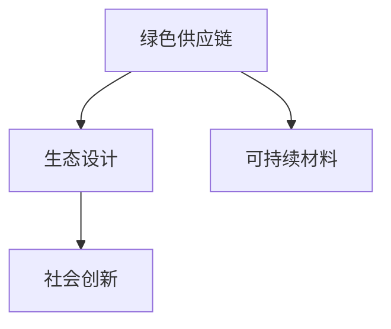
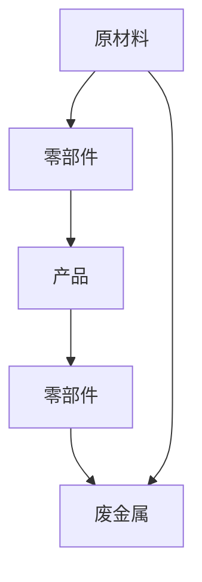
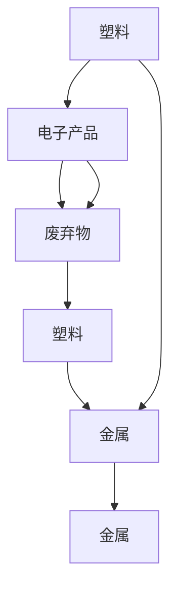

                 

# 循环经济创业：可持续发展的商业实践

> 关键词：循环经济, 可持续发展, 商业实践, 生态设计, 绿色供应链, 可持续材料, 社会创新

## 1. 背景介绍

### 1.1 问题由来

循环经济（Circular Economy），也称为循环可持续经济，是一种通过再利用和循环使用材料，最小化资源浪费，推动环境、经济和社会可持续发展的经济模式。循环经济已成为全球企业和社会广泛关注的热点。然而，如何实现循环经济，尤其是在商业实践中，存在诸多挑战。本博客旨在介绍循环经济在商业中的具体实践，并探讨如何通过技术手段和商业模式创新，实现商业活动的可持续发展。

### 1.2 问题核心关键点

循环经济的核心在于资源的高效利用和生态系统的健康维护。在商业实践层面，主要关注以下几个关键点：

- **绿色供应链**：确保供应链的各个环节都符合环境保护要求，减少环境影响。
- **生态设计**：从产品设计阶段就考虑环境因素，实现产品生命周期的全过程的资源节约和环境友好。
- **可持续材料**：选择可再生、可循环利用的材料，减少对环境的负担。
- **社会创新**：通过商业模式和技术创新，推动社会各界共同参与循环经济的发展。

### 1.3 问题研究意义

循环经济不仅是响应环境保护的必然选择，更是推动经济和社会持续健康发展的关键途径。通过商业实践，可以有效减少资源消耗和环境污染，提高企业竞争力和品牌价值，同时也为消费者提供更优质的产品和服务。

在研究循环经济商业实践的过程中，可以从企业、消费者和社会三个层面，全面审视如何通过商业行为推动可持续发展。这不仅有助于提升企业的环境意识和社会责任，也为广大消费者提供了更绿色、更健康的生活方式选择。同时，社会创新的深入推进，有助于构建一个更加和谐、可持续发展的社会。

## 2. 核心概念与联系

### 2.1 核心概念概述

为更好地理解循环经济在商业中的实践，本节将介绍几个关键核心概念：

- **绿色供应链**：指在供应链管理中，通过减少资源浪费、优化物流、提高能效等措施，实现环境友好的商业活动。
- **生态设计**：强调产品设计的可持续性，从材料选择、生产工艺到使用后的回收和再利用，全程考虑环境影响。
- **可持续材料**：指在产品设计和制造过程中，选择可再生、可循环利用的材料，减少对环境的影响。
- **社会创新**：通过商业模式和技术创新，推动社会各界共同参与和支持循环经济的发展。

这些核心概念通过以下Mermaid流程图展示其联系：



这个流程图展示了绿色供应链、生态设计、可持续材料和社会创新之间的相互关系：

1. 绿色供应链提供了管理和减少环境影响的基础设施。
2. 生态设计在此基础上，优化产品设计，实现全生命周期的资源节约。
3. 可持续材料为生态设计提供原材料支持，减少对环境的影响。
4. 社会创新通过商业模式和技术创新，推动各方的参与和支持。

这些概念共同构成了循环经济在商业实践中的核心框架，有助于推动企业和社会共同实现可持续发展的目标。

## 3. 核心算法原理 & 具体操作步骤

### 3.1 算法原理概述

循环经济的商业实践涉及多个领域的优化和创新，包括供应链管理、产品设计、材料选择和社会合作等。这里介绍一个基于系统动力学（System Dynamics）原理的框架，用于指导循环经济的商业实践。

系统动力学是一种研究复杂系统行为和管理的科学方法，通过构建因果反馈环路，揭示系统行为的内在规律。在循环经济中，系统动力学可以用于建模和分析资源流动、能量转化和环境影响等关键因素，从而优化商业实践。

### 3.2 算法步骤详解

基于系统动力学原理的循环经济商业实践步骤如下：

**Step 1: 系统建模**
- 识别关键变量：如资源输入、产品输出、环境排放等。
- 建立因果反馈环路：描述变量之间的关系，如资源消耗、生产过程、废物处理等。

**Step 2: 数据收集与分析**
- 收集供应链、生产和环境相关的数据。
- 分析数据，识别改进点和优化方向。

**Step 3: 方案设计与评估**
- 提出优化方案，如改进生产工艺、采用可回收材料等。
- 通过模拟和测试，评估方案的可行性及环境影响。

**Step 4: 实施与监控**
- 在生产或供应链中实施优化方案。
- 持续监控关键指标，确保目标达成。

**Step 5: 反馈与调整**
- 根据监控数据，调整方案，持续优化。

### 3.3 算法优缺点

基于系统动力学原理的循环经济商业实践，有以下优点：

1. **系统性思考**：通过系统建模，全面考虑各环节的相互关系和影响。
2. **数据驱动**：以数据为基础，优化决策和改进方案。
3. **持续改进**：通过持续监控和调整，确保长期目标的实现。

同时，也存在以下缺点：

1. **建模复杂**：需要专业知识，对数据的准确性和全面性要求高。
2. **实施成本**：模型构建和优化需要投入大量资源和时间。
3. **变量依赖**：系统动态受到多因素影响，模型需要不断更新。

### 3.4 算法应用领域

基于系统动力学原理的循环经济商业实践，适用于以下领域：

- **制造业**：优化生产工艺，提高资源利用效率。
- **物流业**：优化运输和仓储，减少资源浪费。
- **零售业**：提升产品回收和再利用率，延长产品寿命。
- **农业**：优化农业生产，减少化肥和农药的使用。
- **建筑业**：使用可再生材料，降低能耗和废弃物排放。

## 4. 数学模型和公式 & 详细讲解 & 举例说明

### 4.1 数学模型构建

循环经济商业实践的数学模型主要关注资源的流动和转化，通过构建资源流图（Resource Flow Diagram）来描述不同环节之间的资源流动。资源流图由资源节点、转换节点和流向关系构成，其中资源节点表示资源输入和输出，转换节点表示资源的加工和转换过程。

### 4.2 公式推导过程

以一个简单的制造业为例，假设其原材料为金属，产品为零部件，废弃物为废金属，构建如下资源流图：



其中，原材料通过加工成为零部件，再通过装配成为产品。产品使用后，废弃物又重新成为原材料。

根据资源流图，可以构建如下方程组：

1. 资源输入方程：$In = S_{原材料} + S_{废金属}$，其中 $In$ 为输入资源总量，$S_{原材料}$ 为原材料使用量，$S_{废金属}$ 为废金属回收量。
2. 资源输出方程：$Out = C_{零部件} + C_{产品}$，其中 $Out$ 为输出资源总量，$C_{零部件}$ 为零部件使用量，$C_{产品}$ 为产品使用量。
3. 资源转化方程：$S_{原材料} = C_{零部件}$，$C_{零部件} = C_{产品} + S_{废金属}$，其中 $S_{原材料}$ 为原材料使用量，$C_{零部件}$ 为零部件使用量，$C_{产品}$ 为产品使用量，$S_{废金属}$ 为废金属回收量。

### 4.3 案例分析与讲解

以一家电子产品制造企业为例，假设其原材料为塑料和金属，产品为电子产品，废弃物为塑料和金属。构建如下资源流图：



其中，原材料通过加工成为电子产品，产品使用后，废弃物又重新成为原材料。

假设原材料使用量为 $S_{原材料}=100kg$，产品使用量为 $C_{产品}=50kg$，废金属回收量为 $S_{废金属}=20kg$。根据上述方程组，可以计算出：

1. 资源输入方程：$In = S_{原材料} + S_{废金属} = 100kg + 20kg = 120kg$
2. 资源输出方程：$Out = C_{零部件} + C_{产品} = C_{产品} + S_{废金属} = 50kg + 20kg = 70kg$
3. 资源转化方程：$S_{原材料} = C_{零部件} = C_{产品} + S_{废金属} = 50kg + 20kg = 70kg$

通过对比输入输出资源，可以发现，企业的资源使用效率为 $70kg / 120kg = 0.5833$，即每单位产品输出，需要0.5833单位原材料输入。若通过优化生产工艺，提高废金属回收率，减少原材料使用量，可以实现更高效的资源利用。

## 5. 项目实践：代码实例和详细解释说明

### 5.1 开发环境搭建

在进行循环经济商业实践的代码实践前，我们需要准备好开发环境。以下是使用Python进行数据分析和建模的环境配置流程：

1. 安装Anaconda：从官网下载并安装Anaconda，用于创建独立的Python环境。

2. 创建并激活虚拟环境：
```bash
conda create -n circular-economy python=3.8 
conda activate circular-economy
```

3. 安装Python库：
```bash
pip install pandas numpy matplotlib seaborn scipy
```

4. 安装系统动力学库：
```bash
pip install pyodes
```

完成上述步骤后，即可在`circular-economy`环境中开始循环经济商业实践的代码实现。

### 5.2 源代码详细实现

下面以一个简单的制造业为例，给出使用Python和系统动力学库进行循环经济商业实践的代码实现。

首先，定义资源节点和转换节点：

```python
from pyodes import Model, State

# 定义资源节点
original_material = State('原材料')
product = State('产品')
waste_material = State('废弃物')

# 定义转换节点
material_process = State('加工过程')
product_assembly = State('装配过程')
waste_material_process = State('废金属处理')

# 建立因果反馈环路
original_material >> material_process >> product
product >> product_assembly >> waste_material
waste_material >> waste_material_process >> original_material
```

然后，定义输入和输出方程：

```python
# 资源输入方程
In = original_material + waste_material

# 资源输出方程
Out = product + waste_material

# 资源转化方程
original_material >> material_process >> product
product >> product_assembly >> waste_material
waste_material >> waste_material_process >> original_material
```

接着，进行数据收集和分析：

```python
# 收集数据
original_material_value = 100
product_value = 50
waste_material回收量 = 20

# 分析数据
In_value = original_material_value + waste_material回收量
Out_value = product_value + waste_material回收量
S原材料使用量 = C零部件使用量 = product_value + waste_material回收量
```

最后，运行模型并输出结果：

```python
# 运行模型
model = Model()
model.add(original_material)
model.add(product)
model.add(waste_material)
model.add(material_process)
model.add(product_assembly)
model.add(waste_material_process)

# 设置方程
model.set_in_equation(In_value, In)
model.set_in_equation(Out_value, Out)
model.set_in_equation(S原材料使用量, original_material)
model.set_in_equation(C零部件使用量, product)
model.set_in_equation(S废金属回收量, waste_material)

# 输出结果
model.run()
print(f'资源输入: {In_value}kg')
print(f'资源输出: {Out_value}kg')
print(f'原材料使用量: {S原材料使用量}kg')
```

以上代码实现了基于系统动力学的循环经济商业实践的模拟和分析，展示了如何通过构建和运行模型，优化资源利用效率。

### 5.3 代码解读与分析

让我们再详细解读一下关键代码的实现细节：

**资源节点和转换节点**：
- 通过`State`类定义了资源节点和转换节点，分别表示不同的变量。
- 通过箭头`>>`表示不同节点之间的转换关系。

**方程定义**：
- 通过`set_in_equation`方法，定义了资源输入、输出和转化的方程。
- 注意，资源输入和输出方程是单独定义的，而资源转化方程则通过箭头关系自然生成。

**数据收集与分析**：
- 通过变量赋值，收集了不同节点的初始值。
- 通过计算，得到了资源输入、输出和转化方程的值。

**模型运行与输出**：
- 通过`Model`类构建了整个资源流图模型。
- 通过`run`方法运行模型，输出关键指标的值。

可以看到，通过Python和系统动力学库，可以方便地构建和运行循环经济商业实践的模型，并进行资源的优化和分析。这为循环经济在实际商业应用中的实践提供了有力的工具支持。

## 6. 实际应用场景

### 6.1 智能制造

循环经济的商业实践在智能制造领域具有重要应用。通过构建和优化资源流图，可以提升制造系统的效率和资源利用率，减少浪费和环境污染。

以汽车制造为例，通过循环经济的商业实践，可以实现以下几个目标：

- **资源高效利用**：优化原材料使用，提高回收率，减少资源浪费。
- **减少环境排放**：通过改进工艺和设备，减少能源消耗和废弃物排放。
- **社会责任**：推动企业履行环保责任，提升品牌形象。

### 6.2 智能农业

循环经济的商业实践在智能农业中同样具有广泛应用。通过优化资源流图，可以实现农业生产的可持续性，减少化肥和农药的使用，提高土地和水资源的利用效率。

以有机农业为例，通过循环经济的商业实践，可以实现以下几个目标：

- **减少污染**：通过使用有机肥料和生物农药，减少对环境的污染。
- **提高产量**：通过生态设计，优化种植和养殖过程，提高作物和家禽的产量。
- **社会效益**：推动农业向绿色、环保方向发展，提升农民生活水平。

### 6.3 智能物流

循环经济的商业实践在智能物流领域也有重要应用。通过优化供应链和物流链，可以提升资源利用效率，减少运输和仓储成本，减少环境影响。

以电商物流为例，通过循环经济的商业实践，可以实现以下几个目标：

- **减少包装**：通过优化包装设计和材料选择，减少包装废弃物的产生。
- **提高运输效率**：通过优化路线和仓储管理，减少运输成本和能耗。
- **社会效益**：推动物流行业向绿色、环保方向发展，提升消费者和社会的满意度。

## 7. 工具和资源推荐

### 7.1 学习资源推荐

为了帮助开发者系统掌握循环经济的商业实践，这里推荐一些优质的学习资源：

1. 《循环经济概论》：详细介绍循环经济的基本概念、原则和应用案例。
2. 《绿色供应链管理》：讲解绿色供应链的设计、实施和优化方法。
3. 《可持续材料设计与开发》：介绍可持续材料的分类、选择和应用。
4. 《社会创新与可持续发展》：探讨社会创新在推动循环经济中的应用。

这些资源涵盖了循环经济的不同方面，有助于全面理解循环经济在商业实践中的核心内容和实际应用。

### 7.2 开发工具推荐

循环经济的商业实践涉及多方面的数据处理和分析，以下是几款推荐的开发工具：

1. Python和Anaconda：灵活且强大的数据分析和建模工具，适用于循环经济模型的构建和运行。
2. Matplotlib和Seaborn：可视化工具，帮助绘制资源流图和分析结果。
3. PyODES：系统动力学库，用于构建和运行循环经济的商业实践模型。

合理利用这些工具，可以显著提升循环经济商业实践的开发效率，加速创新迭代的步伐。

### 7.3 相关论文推荐

循环经济在商业实践中的发展离不开学界的持续研究。以下是几篇奠基性的相关论文，推荐阅读：

1. "A Life Cycle Cost Model of Eco-Design"：提出生态设计生命周期成本模型，为循环经济提供理论支持。
2. "Circular Economy 3.0: A Triple Helix Approach to Sustainable Business"：探讨三重螺旋模型，推动循环经济的社会创新。
3. "The Role of Supply Chain in Circular Economy"：分析供应链在循环经济中的作用，提出优化策略。
4. "Sustainable Materials: A Review"：综述可持续材料的分类和应用，为循环经济的商业实践提供材料支持。

这些论文代表了大循环经济商业实践的研究方向，通过学习这些前沿成果，可以帮助研究者把握学科前进方向，激发更多的创新灵感。

## 8. 总结：未来发展趋势与挑战

### 8.1 总结

本文对循环经济在商业中的具体实践进行了全面系统的介绍。首先阐述了循环经济的背景和重要性，明确了循环经济在商业实践中的关键点。其次，从原理到实践，详细讲解了循环经济的系统动力学建模和优化方法，给出了循环经济商业实践的代码实例。同时，本文还探讨了循环经济在智能制造、智能农业、智能物流等多个行业领域的应用前景，展示了循环经济商业实践的广泛潜力。此外，本文精选了相关资源和学习工具，力求为读者提供全方位的技术指引。

通过本文的系统梳理，可以看到，循环经济在商业实践中的实现，不仅可以提升企业的资源利用效率，减少环境影响，还能提升企业的竞争力和品牌价值。未来的发展方向将更加注重社会创新和可持续发展，推动各界的共同参与和支持。

### 8.2 未来发展趋势

展望未来，循环经济在商业实践中的发展趋势如下：

1. **技术融合**：循环经济将与其他新兴技术，如人工智能、区块链等进行深度融合，推动智能制造、智能农业、智能物流等领域的创新应用。
2. **数据驱动**：大数据和物联网技术将进一步推动循环经济的商业实践，实时监测和优化资源流图，提升资源利用效率。
3. **公众参与**：循环经济的商业实践将更加注重公众的参与和反馈，推动社会的可持续发展。
4. **国际合作**：循环经济的商业实践将跨国界合作，共享资源和经验，推动全球的可持续发展。

### 8.3 面临的挑战

尽管循环经济在商业实践中的发展前景广阔，但仍面临诸多挑战：

1. **数据获取难度**：循环经济的商业实践需要大量的数据支持，而数据获取和处理往往需要高昂的成本。
2. **技术门槛高**：循环经济的系统动力学建模和优化需要专业知识和技能，存在技术门槛。
3. **市场接受度**：尽管绿色环保理念日益普及，但消费者和市场对循环经济产品的接受度仍有待提高。
4. **政策法规**：循环经济的商业实践需要相应的政策法规支持，推动企业和社会的共同参与。

### 8.4 研究展望

未来的研究需要在以下几个方面进行突破：

1. **数据融合与共享**：通过大数据和物联网技术，实现跨行业、跨地域的数据融合和共享，提升资源利用效率。
2. **技术创新**：开发更加高效、便捷的循环经济建模和优化工具，降低技术门槛。
3. **市场推广**：通过教育宣传和政策引导，提升公众对循环经济的认知和接受度。
4. **政策支持**：制定和完善相关的政策和法规，推动循环经济的商业实践。

这些研究方向的探索，必将引领循环经济商业实践走向成熟，为构建绿色、可持续发展的商业环境铺平道路。面向未来，循环经济需要多方协同发力，共同推动社会的可持续发展。

## 9. 附录：常见问题与解答

**Q1：循环经济的商业实践是否适用于所有行业？**

A: 循环经济的商业实践在制造业、农业、物流业等许多行业均有广泛应用。但具体应用需要根据行业特性和资源特点进行适配和优化。例如，在农业中，循环经济实践更多关注资源的循环利用和生态系统的保护；在制造业中，则侧重于绿色供应链和节能减排；在物流业中，则注重运输和仓储环节的环保和效率提升。

**Q2：循环经济在商业实践中需要考虑哪些关键因素？**

A: 循环经济在商业实践中需要考虑以下关键因素：

1. **资源流图**：通过构建资源流图，全面理解资源输入、输出和转化过程。
2. **环境影响**：通过评估环境影响，优化资源利用效率，减少污染排放。
3. **社会效益**：通过推动社会创新，提升企业的社会责任感和品牌价值。
4. **技术支持**：通过采用先进技术，如系统动力学、大数据分析等，提高资源利用效率。

这些因素共同决定了循环经济在商业实践中的实现效果和可持续性。

**Q3：循环经济在商业实践中如何平衡成本和效益？**

A: 循环经济在商业实践中，需要通过合理的资源配置和优化，平衡成本和效益。具体方法包括：

1. **优化生产工艺**：通过改进生产工艺和设备，减少资源消耗和环境影响。
2. **提高回收率**：通过优化废弃物处理和再利用，减少资源浪费和成本。
3. **使用可持续材料**：选择可再生、可回收的环保材料，降低原材料成本。
4. **数据驱动决策**：通过大数据和物联网技术，实时监测和优化资源流图，提升资源利用效率。

通过这些方法，可以实现循环经济在商业实践中的成本效益平衡。

**Q4：循环经济在商业实践中如何确保资源的高效利用？**

A: 循环经济在商业实践中，确保资源高效利用的方法包括：

1. **系统动力学建模**：通过构建资源流图和优化模型，全面理解资源输入、输出和转化过程，识别优化点。
2. **数据驱动分析**：通过收集和分析数据，实时监测资源利用效率，及时调整和优化。
3. **持续改进机制**：建立持续改进机制，定期评估资源利用效率，进行优化。
4. **技术支持**：采用先进技术，如物联网、人工智能等，提升资源利用效率。

通过这些方法，可以确保循环经济在商业实践中的资源高效利用。

**Q5：循环经济在商业实践中如何应对环境风险？**

A: 循环经济在商业实践中，应对环境风险的方法包括：

1. **风险评估**：通过环境风险评估，识别潜在的资源和环境风险。
2. **应急预案**：制定应急预案，应对突发环境事件，减少环境影响。
3. **合规性管理**：确保各项环境保护措施符合法律法规要求，减少环境风险。
4. **社会责任**：推动企业履行社会责任，提升环境意识，减少环境风险。

通过这些方法，可以应对循环经济在商业实践中的环境风险。

---

作者：禅与计算机程序设计艺术 / Zen and the Art of Computer Programming

