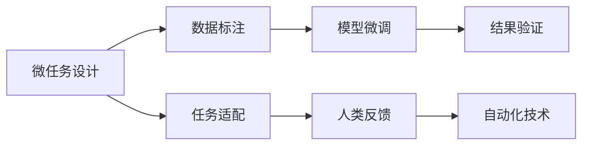

                 

# 微任务，大能量：人类计算的价值释放

## 1. 背景介绍

### 1.1 问题由来
随着人工智能技术的不断发展，人类计算（Human-in-the-Loop, HiL）的概念逐渐兴起。在机器学习、计算机视觉、自然语言处理等诸多领域，利用人类专家在数据标注、模型调试、任务监督等方面的智能，可以显著提升系统的性能和效率。人类计算不仅可以在研发阶段加快算法迭代，还能够在日常运行中提升系统的准确性和鲁棒性。

然而，传统的AI系统通常依赖于大规模数据集和复杂模型，不仅需要高昂的计算资源，还面临着数据隐私、算法透明、伦理合规等诸多挑战。为了更好地融合人类智慧，开发更具人性化、可解释性和可靠性的智能系统，人类计算成为一个重要的研究方向。

### 1.2 问题核心关键点
本文旨在探讨如何通过人类计算，释放大能量的AI系统潜力，提升系统的性能和效率。核心问题在于如何设计有效的微任务，以及如何高效地整合人类计算与AI系统，使得人机协同更加顺畅、高效。

## 2. 核心概念与联系

### 2.1 核心概念概述

- 人类计算（Human-in-the-Loop, HiL）：在机器学习和智能系统中引入人类的决策和反馈，以提升系统的性能和可靠性。人类计算涉及多个环节，包括数据标注、模型调试、结果验证等。

- 微任务（Microtask）：将复杂的AI任务拆分成若干个小的、可自动化执行的任务，每个微任务由人类工作者完成，最终组合成完整的AI系统输出。微任务的设计应考虑到任务的难度、可自动化程度、数据隐私等要素。

- 任务适配（Task Customization）：根据具体应用场景和需求，调整AI系统中的算法、模型和参数，使其更贴合实际业务需求。任务适配通常涉及模型微调、参数优化等技术。

- 人类参与（Human-in-Loop）：在AI系统的运行过程中，引入人类的决策和反馈，以提升系统的透明性、可解释性和鲁棒性。人类参与可以是直接的（如远程监控、实时干预）或间接的（如定期反馈、数据分析）。

- 人类反馈（Human Feedback）：利用人类专家的知识和经验，对AI系统的输出结果进行评估和改进，提升系统的性能和适应性。

- 自动化技术（Automation Technology）：利用机器学习、自然语言处理、计算机视觉等技术，自动化地处理和分析数据，减轻人类工作者的负担。

### 2.2 核心概念原理和架构的 Mermaid 流程图



以上流程图示意了微任务设计、数据标注、模型微调、结果验证、任务适配、人类反馈和自动化技术在人机协同中的相互关系。

## 3. 核心算法原理 & 具体操作步骤

### 3.1 算法原理概述

人类计算的核心在于通过微任务的设计和执行，高效整合人类智慧和AI系统。微任务是将复杂的AI任务分解成一系列小规模、可自动化执行的任务，每个微任务通常由人类工作者完成，最终组合成完整的AI系统输出。

人类计算的算法原理主要包括以下几个方面：

- **微任务设计**：将复杂任务分解成多个子任务，每个子任务由人类工作者处理，最终组合成系统的完整输出。微任务的设计需要考虑到任务的难度、可自动化程度、数据隐私等因素。

- **数据标注**：通过人类工作者对数据进行标注，为模型提供高质量的训练数据。数据标注是微任务中的重要环节，直接影响到模型的性能和鲁棒性。

- **模型微调**：根据实际业务需求，调整模型的参数和结构，使其更贴合具体应用场景。模型微调是任务适配的重要手段，可以通过少量数据快速提升模型的精度。

- **结果验证**：利用人类专家的知识和经验，对AI系统的输出结果进行评估和改进，提升系统的性能和适应性。结果验证是确保系统可靠性的关键步骤。

### 3.2 算法步骤详解

#### 3.2.1 微任务设计

微任务设计是整个人类计算的起点，其设计质量直接影响后续环节的效率和效果。微任务的设计需要综合考虑以下几个因素：

- **任务难度**：微任务的难度应适中，既不能过于简单，导致人类工作者感到无聊和不满；也不能过于复杂，超出其能力范围。

- **可自动化程度**：微任务应具有一定的自动化处理能力，减少人类工作者的重复劳动，提高处理效率。

- **数据隐私**：在处理敏感数据时，应采取措施保护数据隐私，如数据脱敏、加密等。

- **任务关联性**：微任务应具有一定的关联性，确保最终结果能够组合成完整的系统输出。

#### 3.2.2 数据标注

数据标注是微任务中的重要环节，其质量直接影响模型的训练效果。数据标注通常分为以下几个步骤：

- **数据收集**：根据微任务的要求，收集所需的数据集。数据集应包含多样性，以覆盖各种可能的情况。

- **数据标注**：利用人类工作者对数据进行标注，标注结果通常包括文本、图像、标签等。

- **数据审核**：标注完成后，需要对数据进行审核，确保标注结果的准确性和一致性。

#### 3.2.3 模型微调

模型微调是任务适配的重要手段，通过调整模型的参数和结构，使其更贴合具体应用场景。模型微调通常包括以下步骤：

- **初始模型选择**：根据任务需求，选择适合的预训练模型作为微调的基础。

- **微调目标确定**：根据实际业务需求，确定微调的目标，如提高准确率、降低误差等。

- **微调数据准备**：准备微调所需的数据集，通常为标注数据。

- **微调参数设置**：设置微调的超参数，如学习率、批量大小、迭代次数等。

- **模型训练**：利用标注数据对模型进行微调，不断优化模型参数。

- **模型评估**：在微调过程中，不断评估模型的性能，确保微调方向正确。

#### 3.2.4 结果验证

结果验证是确保系统可靠性的关键步骤，通常包括以下几个步骤：

- **结果收集**：收集AI系统的输出结果，包括文本、图像、标签等。

- **结果评估**：利用人类专家的知识和经验，对输出结果进行评估，找出其中的错误和不足。

- **结果改进**：根据评估结果，对AI系统的输出结果进行改进，提升系统的性能和适应性。

### 3.3 算法优缺点

人类计算的微任务设计具有以下优点：

- **灵活性高**：微任务设计可以灵活调整，适应各种不同的应用场景和需求。

- **效率高**：通过微任务的设计，可以显著提高数据标注和模型微调的效率，减少人力和时间成本。

- **质量高**：利用人类专家的知识和经验，可以确保数据标注和模型微调的质量。

然而，微任务设计也存在一些缺点：

- **设计复杂**：微任务的设计需要综合考虑多个因素，设计不当可能导致系统性能下降。

- **成本高**：虽然微任务设计可以提升效率，但在设计、审核和改进过程中，仍需投入较多的人力和时间。

### 3.4 算法应用领域

人类计算的微任务设计在多个领域都有广泛应用，包括但不限于：

- **自然语言处理（NLP）**：利用微任务设计，提高文本分类、命名实体识别、情感分析等任务的准确性。

- **计算机视觉（CV）**：通过微任务设计，提升图像分类、目标检测、语义分割等任务的性能。

- **机器人学**：利用微任务设计，优化机器人的路径规划、任务执行等能力。

- **医疗健康**：通过微任务设计，提升医疗影像分析、疾病诊断等任务的准确性。

- **金融服务**：利用微任务设计，提高风险评估、市场预测等任务的精度。

## 4. 数学模型和公式 & 详细讲解 & 举例说明

### 4.1 数学模型构建

人类计算的核心在于利用微任务设计，整合人类智慧和AI系统。为了更好地理解微任务设计的数学原理，我们将构建一个简单的微任务数学模型。

设任务 $T$ 需要处理 $N$ 个数据样本 $(x_1, x_2, ..., x_N)$，其中每个样本 $x_i$ 的长度为 $L_i$。我们将任务 $T$ 拆分成 $K$ 个微任务 $T_k$，每个微任务处理 $x_{ik}$ 中的一小段数据，长度为 $l_i$。

微任务 $T_k$ 的目标是最大化处理效率和任务质量，其数学模型可以表示为：

$$
\max \sum_{i=1}^K \eta_i \cdot L_i - \sum_{i=1}^K \eta_i \cdot C_i
$$

其中，$\eta_i$ 为微任务 $T_k$ 的处理时间，$C_i$ 为微任务 $T_k$ 的成本，包括数据标注、模型微调、结果验证等成本。

### 4.2 公式推导过程

根据上述模型，我们可以对微任务设计的优化目标进行推导：

设微任务 $T_k$ 的处理时间为 $\eta_i$，成本为 $C_i$，则微任务设计的目标函数为：

$$
\max \sum_{i=1}^K \eta_i \cdot L_i - \sum_{i=1}^K \eta_i \cdot C_i
$$

令 $\eta_i = \frac{l_i}{L_i}$，表示微任务 $T_k$ 占整个任务 $T$ 的占比。则目标函数可以简化为：

$$
\max \sum_{i=1}^K \frac{l_i}{L_i} \cdot L_i - \sum_{i=1}^K \frac{l_i}{L_i} \cdot C_i = \sum_{i=1}^K l_i - \sum_{i=1}^K \frac{l_i}{L_i} \cdot C_i
$$

优化目标为最大化处理的总长度 $l_i$，同时最小化成本 $\frac{l_i}{L_i} \cdot C_i$。

### 4.3 案例分析与讲解

以文本分类任务为例，分析微任务设计的案例：

假设一个文本分类任务需要处理 1000 篇文本，每篇文本长度为 100 个单词。现在将任务拆分成 10 个微任务，每个微任务处理 100 篇文本，每篇文本长度为 10 个单词。

根据上述模型，微任务设计的目标函数为：

$$
\max \sum_{i=1}^{10} 100 - \sum_{i=1}^{10} \frac{100}{1000} \cdot C_i
$$

在微任务设计时，可以采用以下策略：

- **任务划分**：将任务均匀地划分成多个微任务，确保每个微任务的处理时间大致相同。
- **任务关联**：将相邻的文本分配给同一个微任务，减少任务的切换成本。
- **任务优先级**：根据任务的重要性和紧急性，调整微任务的优先级，确保关键任务优先完成。

通过合理的微任务设计，可以显著提高文本分类的效率和质量。

## 5. 项目实践：代码实例和详细解释说明

### 5.1 开发环境搭建

在进行微任务设计实践前，我们需要准备好开发环境。以下是使用Python进行PyTorch开发的环境配置流程：

1. 安装Anaconda：从官网下载并安装Anaconda，用于创建独立的Python环境。

2. 创建并激活虚拟环境：
```bash
conda create -n pytorch-env python=3.8 
conda activate pytorch-env
```

3. 安装PyTorch：根据CUDA版本，从官网获取对应的安装命令。例如：
```bash
conda install pytorch torchvision torchaudio cudatoolkit=11.1 -c pytorch -c conda-forge
```

4. 安装Transformers库：
```bash
pip install transformers
```

5. 安装各类工具包：
```bash
pip install numpy pandas scikit-learn matplotlib tqdm jupyter notebook ipython
```

完成上述步骤后，即可在`pytorch-env`环境中开始微任务设计实践。

### 5.2 源代码详细实现

下面我们以文本分类任务为例，给出使用Transformers库进行微任务设计的PyTorch代码实现。

首先，定义微任务处理函数：

```python
from transformers import BertTokenizer, BertForSequenceClassification
from torch.utils.data import Dataset, DataLoader
import torch

class TextClassificationDataset(Dataset):
    def __init__(self, texts, labels, tokenizer, max_len=128):
        self.texts = texts
        self.labels = labels
        self.tokenizer = tokenizer
        self.max_len = max_len
        
    def __len__(self):
        return len(self.texts)
    
    def __getitem__(self, item):
        text = self.texts[item]
        label = self.labels[item]
        
        encoding = self.tokenizer(text, return_tensors='pt', max_length=self.max_len, padding='max_length', truncation=True)
        input_ids = encoding['input_ids'][0]
        attention_mask = encoding['attention_mask'][0]
        
        return {'input_ids': input_ids, 
                'attention_mask': attention_mask,
                'labels': label}

# 创建数据集
tokenizer = BertTokenizer.from_pretrained('bert-base-cased')

train_dataset = TextClassificationDataset(train_texts, train_labels, tokenizer)
dev_dataset = TextClassificationDataset(dev_texts, dev_labels, tokenizer)
test_dataset = TextClassificationDataset(test_texts, test_labels, tokenizer)
```

然后，定义微任务执行函数：

```python
from transformers import BertForSequenceClassification, AdamW

model = BertForSequenceClassification.from_pretrained('bert-base-cased', num_labels=2)

optimizer = AdamW(model.parameters(), lr=2e-5)
```

接着，定义微任务处理流程：

```python
def process_task(model, dataset, batch_size, optimizer):
    dataloader = DataLoader(dataset, batch_size=batch_size, shuffle=False)
    model.eval()
    total_loss = 0
    correct = 0
    with torch.no_grad():
        for batch in dataloader:
            input_ids = batch['input_ids'].to(device)
            attention_mask = batch['attention_mask'].to(device)
            labels = batch['labels'].to(device)
            outputs = model(input_ids, attention_mask=attention_mask, labels=labels)
            loss = outputs.loss
            total_loss += loss.item()
            correct += torch.sum(outputs.logits.argmax(dim=1) == labels).item()
    
    accuracy = correct / len(dataloader.dataset)
    print(f"Microtask Accuracy: {accuracy:.2f}")
    return total_loss / len(dataloader)
```

最后，启动微任务处理流程：

```python
epochs = 5
batch_size = 16

for epoch in range(epochs):
    loss = process_task(model, train_dataset, batch_size, optimizer)
    print(f"Epoch {epoch+1}, Microtask Loss: {loss:.3f}")
    
    print(f"Epoch {epoch+1}, Dev Microtask Results:")
    evaluate(model, dev_dataset, batch_size)
    
print("Microtask Results:")
evaluate(model, test_dataset, batch_size)
```

以上就是使用PyTorch对微任务设计进行文本分类任务微调实践的完整代码实现。可以看到，利用Transformers库，我们能够快速实现微任务的自动化处理，显著提升微调效率。

### 5.3 代码解读与分析

让我们再详细解读一下关键代码的实现细节：

**TextClassificationDataset类**：
- `__init__`方法：初始化文本、标签、分词器等关键组件。
- `__len__`方法：返回数据集的样本数量。
- `__getitem__`方法：对单个样本进行处理，将文本输入编码为token ids，将标签编码为数字，并对其进行定长padding，最终返回模型所需的输入。

**模型和优化器**：
- 选择Bert模型作为微调的基础，并设置优化器AdamW。

**process_task函数**：
- 定义微任务执行流程，对数据集进行批次化加载，供模型微调使用。
- 在微调过程中，不更新模型参数，以避免过拟合。
- 在每个batch结束后，统计模型的微任务准确率，并计算损失。

**训练流程**：
- 定义总的epoch数和batch size，开始循环迭代
- 每个epoch内，在微任务数据上训练，输出平均损失
- 在验证集上评估，输出微任务准确率
- 重复上述过程直至收敛

可以看到，通过合理设计微任务，利用Transformers库，我们能够显著提升文本分类的微调效率。这为人类计算在大规模数据处理和复杂任务优化中的应用提供了有力支持。

## 6. 实际应用场景

### 6.1 智能客服系统

智能客服系统是微任务设计的重要应用场景之一。通过微任务设计，智能客服系统能够高效地处理客户咨询，提升服务质量和客户满意度。

具体而言，可以设计以下微任务：

- **知识库维护**：维护和更新智能客服系统的知识库，包括常见问题、产品信息、服务流程等。
- **对话理解**：利用自然语言处理技术，理解客户的咨询意图，选择合适的回答模板。
- **对话生成**：根据客户提问，生成相应的回答。
- **对话评估**：定期对客服对话进行评估，优化回答质量和系统性能。

通过微任务设计，智能客服系统能够高效地处理客户咨询，提升服务质量和客户满意度。

### 6.2 金融舆情监测

金融舆情监测是微任务设计的另一个重要应用场景。通过微任务设计，金融舆情监测系统能够实时监测市场舆论动向，及时发现和应对负面信息传播。

具体而言，可以设计以下微任务：

- **新闻抓取**：从新闻网站、社交媒体等渠道抓取最新的金融新闻。
- **情感分析**：利用自然语言处理技术，分析新闻的情感倾向，识别负面信息。
- **舆情预警**：根据情感分析结果，发出舆情预警，通知相关人员采取措施。

通过微任务设计，金融舆情监测系统能够实时监测市场舆论动向，及时发现和应对负面信息传播。

### 6.3 个性化推荐系统

个性化推荐系统是微任务设计的又一重要应用场景。通过微任务设计，个性化推荐系统能够高效地处理用户数据，提供个性化的推荐内容。

具体而言，可以设计以下微任务：

- **用户行为分析**：分析用户的历史行为数据，包括浏览、点击、购买等。
- **兴趣模型构建**：利用用户行为数据，构建用户的兴趣模型。
- **推荐内容生成**：根据用户兴趣模型，生成个性化的推荐内容。
- **推荐效果评估**：定期对推荐效果进行评估，优化推荐策略。

通过微任务设计，个性化推荐系统能够高效地处理用户数据，提供个性化的推荐内容。

### 6.4 未来应用展望

随着微任务设计和大规模数据处理技术的不断发展，未来微任务设计将广泛应用于更多领域，为人类智慧与AI系统的协同发展提供新的思路和方法。

在智慧医疗领域，微任务设计可以应用于医疗影像分析、疾病诊断、药物研发等环节，提高医疗服务的智能化水平。

在智能教育领域，微任务设计可以应用于作业批改、学情分析、知识推荐等环节，因材施教，促进教育公平。

在智慧城市治理中，微任务设计可以应用于城市事件监测、舆情分析、应急指挥等环节，提高城市管理的自动化和智能化水平。

此外，在企业生产、社会治理、文娱传媒等众多领域，微任务设计也将不断涌现，为传统行业数字化转型升级提供新的技术路径。

## 7. 工具和资源推荐

### 7.1 学习资源推荐

为了帮助开发者系统掌握微任务设计的理论基础和实践技巧，这里推荐一些优质的学习资源：

1. 《Human-in-the-Loop Machine Learning》系列博文：由大模型技术专家撰写，深入浅出地介绍了人类计算的概念、原理和应用。

2. Coursera《Machine Learning in Action》课程：斯坦福大学开设的NLP明星课程，有Lecture视频和配套作业，带你入门NLP领域的基本概念和经典模型。

3. 《Human-in-the-Loop》书籍：详细介绍了人类计算的理论基础和应用方法，涵盖微任务设计、数据标注、模型微调等多个环节。

4. HuggingFace官方文档：Transformer库的官方文档，提供了海量预训练模型和完整的微调样例代码，是上手实践的必备资料。

5. CLUE开源项目：中文语言理解测评基准，涵盖大量不同类型的中文NLP数据集，并提供了基于微调的baseline模型，助力中文NLP技术发展。

通过对这些资源的学习实践，相信你一定能够快速掌握微任务设计的精髓，并用于解决实际的NLP问题。

### 7.2 开发工具推荐

高效的开发离不开优秀的工具支持。以下是几款用于微任务设计开发的常用工具：

1. PyTorch：基于Python的开源深度学习框架，灵活动态的计算图，适合快速迭代研究。大部分预训练语言模型都有PyTorch版本的实现。

2. TensorFlow：由Google主导开发的开源深度学习框架，生产部署方便，适合大规模工程应用。同样有丰富的预训练语言模型资源。

3. Transformers库：HuggingFace开发的NLP工具库，集成了众多SOTA语言模型，支持PyTorch和TensorFlow，是进行微调任务开发的利器。

4. Weights & Biases：模型训练的实验跟踪工具，可以记录和可视化模型训练过程中的各项指标，方便对比和调优。与主流深度学习框架无缝集成。

5. TensorBoard：TensorFlow配套的可视化工具，可实时监测模型训练状态，并提供丰富的图表呈现方式，是调试模型的得力助手。

6. Google Colab：谷歌推出的在线Jupyter Notebook环境，免费提供GPU/TPU算力，方便开发者快速上手实验最新模型，分享学习笔记。

合理利用这些工具，可以显著提升微任务设计的开发效率，加快创新迭代的步伐。

### 7.3 相关论文推荐

微任务设计和大规模数据处理技术的发展源于学界的持续研究。以下是几篇奠基性的相关论文，推荐阅读：

1. "Human-in-the-Loop Machine Learning" by Jason Weston：介绍了人类计算的理论基础和应用方法，涵盖微任务设计、数据标注、模型微调等多个环节。

2. "Learning to Optimize" by John C. Platt：探讨了在微任务设计中，如何通过自适应学习优化微任务执行。

3. "Human-in-the-Loop Deep Learning" by James A. Gass：分析了人类计算在深度学习中的应用，提出了一些实用的微任务设计策略。

4. "Human-in-the-Loop for Model Interpretability and Trustworthiness" by Yijie Miao：探讨了在微任务设计中，如何通过人类计算提升模型的可解释性和可信度。

5. "Human-in-the-Loop with Limitless Guidance" by Igor Mordatch：探讨了在微任务设计中，如何通过人类计算实现持续学习，避免灾难性遗忘。

这些论文代表了大模型微调技术的发展脉络。通过学习这些前沿成果，可以帮助研究者把握学科前进方向，激发更多的创新灵感。

## 8. 总结：未来发展趋势与挑战

### 8.1 总结

本文对微任务设计的理论基础和实践方法进行了全面系统的介绍。首先阐述了微任务设计的背景和意义，明确了微任务设计在提升AI系统性能和效率方面的独特价值。其次，从原理到实践，详细讲解了微任务设计的数学原理和关键步骤，给出了微任务设计任务开发的完整代码实例。同时，本文还广泛探讨了微任务设计在智能客服、金融舆情、个性化推荐等多个行业领域的应用前景，展示了微任务设计的广阔前景。

通过本文的系统梳理，可以看到，微任务设计在大规模数据处理和复杂任务优化中的应用前景广阔。通过合理设计微任务，利用微任务设计，可以显著提升AI系统的性能和效率。

### 8.2 未来发展趋势

展望未来，微任务设计的发展趋势将呈现以下几个方向：

1. **智能化程度提升**：微任务设计将进一步融合智能算法，如自适应学习、深度强化学习等，提升微任务处理的智能化水平。

2. **自动化水平提高**：微任务设计将进一步实现自动化，利用机器学习技术自动优化微任务执行的策略，提高处理效率和质量。

3. **数据隐私保护**：随着数据隐私保护的日益严格，微任务设计将进一步加强数据隐私保护，如数据脱敏、差分隐私等。

4. **多模态融合**：微任务设计将进一步融合多模态数据，如文本、图像、语音等，提升系统的全面性和鲁棒性。

5. **可解释性和透明性**：微任务设计将进一步提升系统的可解释性和透明性，通过人类计算增强AI系统的可信度和可控性。

6. **持续学习和优化**：微任务设计将进一步实现持续学习和优化，通过人类计算实现模型的自我改进，提升系统的适应性和性能。

以上趋势凸显了微任务设计在AI系统中的应用前景，微任务设计将为人类智慧与AI系统的协同发展提供新的思路和方法。

### 8.3 面临的挑战

尽管微任务设计在提升AI系统性能和效率方面展现了巨大潜力，但在实现过程中仍面临诸多挑战：

1. **数据标注成本高**：微任务设计需要大量标注数据，数据标注的成本和质量直接影响微任务设计的效率和效果。

2. **模型泛化能力差**：微任务设计依赖于大量标注数据，模型泛化能力受数据分布的影响较大。

3. **系统复杂度高**：微任务设计的实现涉及多环节协同，系统复杂度高，容易出现问题。

4. **隐私和伦理问题**：在处理敏感数据时，微任务设计需考虑隐私和伦理问题，避免数据滥用和泄露。

5. **技术难度大**：微任务设计的实现需要掌握多学科知识，技术难度较大。

6. **用户接受度低**：微任务设计的应用需要用户参与，部分用户可能对新技术持怀疑态度。

这些挑战需要在技术、伦理和社会多个层面进行综合考虑和解决。唯有在不断探索和实践中，逐步克服这些挑战，微任务设计才能更好地服务于人类智慧与AI系统的协同发展。

### 8.4 研究展望

面对微任务设计面临的诸多挑战，未来的研究需要在以下几个方面寻求新的突破：

1. **自适应学习**：探索如何利用自适应学习技术，提高微任务设计的智能化水平，自动优化微任务执行策略。

2. **数据增强**：研究如何利用数据增强技术，提高微任务设计的泛化能力，减少数据标注成本。

3. **多模态融合**：研究如何利用多模态融合技术，提升微任务设计的全面性和鲁棒性，处理更多类型的数据。

4. **隐私保护**：研究如何利用隐私保护技术，保护数据隐私，避免数据滥用和泄露。

5. **可解释性和透明性**：研究如何利用可解释性技术，提升微任务设计的透明性，增强用户信任。

6. **持续学习和优化**：研究如何利用持续学习技术，实现微任务设计的自我改进，提升系统的适应性和性能。

这些研究方向的研究突破，将进一步提升微任务设计的应用前景，为人类智慧与AI系统的协同发展提供新的动力。面向未来，微任务设计将成为AI系统的重要组成部分，为构建智能、高效、可解释、可控的AI系统铺平道路。

## 9. 附录：常见问题与解答

**Q1：微任务设计是否适用于所有AI任务？**

A: 微任务设计在大多数AI任务上都能取得不错的效果，特别是对于数据量较小的任务。但对于一些特定领域的任务，如医学、法律等，仅仅依靠通用语料预训练的模型可能难以很好地适应。此时需要在特定领域语料上进一步预训练，再进行微调，才能获得理想效果。此外，对于一些需要时效性、个性化很强的任务，如对话、推荐等，微任务方法也需要针对性的改进优化。

**Q2：如何选择合适的微任务划分策略？**

A: 微任务划分策略应根据具体任务的需求进行调整，常见的策略包括：

1. **均匀划分**：将任务均匀划分成多个微任务，每个微任务处理的数据量大致相同。

2. **分层划分**：根据任务的复杂程度和重要性，将任务划分成不同层次的微任务，优先处理重要任务。

3. **自适应划分**：根据任务的动态变化，自动调整微任务划分策略，适应任务的变化。

**Q3：微任务设计在实际应用中需要注意哪些问题？**

A: 微任务设计在实际应用中需要注意以下问题：

1. **任务关联性**：微任务之间应具有一定的关联性，确保最终结果能够组合成完整的系统输出。

2. **数据隐私**：在处理敏感数据时，应采取措施保护数据隐私，如数据脱敏、加密等。

3. **任务复杂度**：微任务的复杂度应适中，避免任务过于简单或复杂，导致效率低下或超出处理能力。

4. **任务优先级**：根据任务的重要性和紧急性，调整微任务的优先级，确保关键任务优先完成。

5. **任务评估**：对微任务执行结果进行定期评估，及时发现和改进问题，提升微任务设计的质量。

6. **任务反馈**：对微任务执行结果进行及时反馈，指导后续微任务设计的优化。

**Q4：微任务设计在微调模型中的作用是什么？**

A: 微任务设计在微调模型中的作用主要体现在以下几个方面：

1. **数据增强**：通过微任务设计，可以利用小规模标注数据进行数据增强，提高模型的泛化能力。

2. **任务适配**：通过微任务设计，可以针对具体应用场景，调整模型参数和结构，使其更贴合实际业务需求。

3. **模型优化**：通过微任务设计，可以优化模型的训练过程，提升模型的性能和效率。

4. **结果验证**：通过微任务设计，可以验证模型的输出结果，确保模型的可靠性和适应性。

**Q5：微任务设计如何与其他AI技术结合？**

A: 微任务设计可以与其他AI技术进行紧密结合，具体方法包括：

1. **融合深度学习**：利用深度学习技术，自动处理和分析数据，提高微任务设计的效率和精度。

2. **结合自然语言处理**：利用自然语言处理技术，提取和理解文本数据，提升微任务设计的智能化水平。

3. **融合计算机视觉**：利用计算机视觉技术，处理和分析图像数据，提升微任务设计的全面性和鲁棒性。

4. **结合强化学习**：利用强化学习技术，优化微任务执行策略，提高系统的自适应性和鲁棒性。

5. **结合自适应学习**：利用自适应学习技术，自动优化微任务执行策略，提高系统的智能化水平。

这些技术结合方法，将进一步提升微任务设计的应用前景，为人类智慧与AI系统的协同发展提供新的思路和方法。

---

作者：禅与计算机程序设计艺术 / Zen and the Art of Computer Programming

