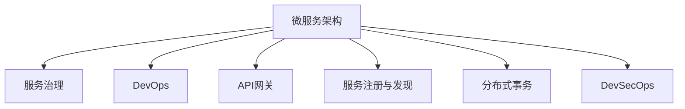
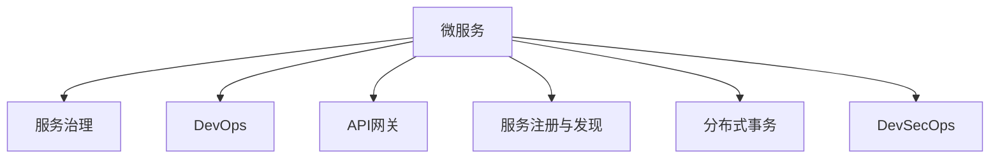

                 

# 微服务架构：设计模式与最佳实践

> 关键词：微服务,设计模式,最佳实践,服务治理,DevOps,API网关,服务注册与发现,分布式事务,DevSecOps,微服务治理,云原生

## 1. 背景介绍

### 1.1 问题由来
随着互联网应用的迅速发展，软件系统的规模越来越大，复杂度不断上升。传统的单体架构越来越难以满足系统扩展、维护和升级的需求。为了应对这些挑战，微服务架构逐渐成为主流的选择。微服务架构将单体应用拆分成多个独立的、可以独立部署和扩展的服务，每个服务围绕业务功能进行设计和开发，具有高度自治和灵活性。

微服务架构的核心思想是通过服务分治，使系统易于维护和扩展，同时提供更高的可靠性和可用性。然而，微服务架构的复杂性和分布式特性也带来了新的挑战，如服务间通信、服务发现、分布式事务、安全管理等。因此，如何设计高效、稳定的微服务架构，成为了当前IT领域的热点问题。

### 1.2 问题核心关键点
微服务架构的设计和实现涉及多个核心概念和关键技术，包括服务治理、DevOps、API网关、服务注册与发现、分布式事务等。这些概念和技术互相交织，共同构成微服务架构的完整生态。

- **服务治理**：管理微服务架构中的服务注册、配置、负载均衡等事务。
- **DevOps**：强调开发和运维的紧密协作，实现持续交付和持续集成。
- **API网关**：作为微服务的统一入口，提供路由、安全、缓存等功能。
- **服务注册与发现**：确保服务间能够快速找到和通信，增强系统的弹性和可伸缩性。
- **分布式事务**：保证微服务架构中跨服务的事务一致性。
- **DevSecOps**：结合开发、安全和运维，提供安全可靠的服务。

这些概念和技术之间的逻辑关系可以通过以下Mermaid流程图来展示：



这个流程图展示了微服务架构的核心概念及其之间的关系：

1. 微服务架构由服务治理、DevOps、API网关、服务注册与发现、分布式事务、DevSecOps等组成。
2. 这些组件共同协作，确保微服务架构的稳定性和可扩展性。
3. 服务治理、DevOps、API网关等组件，提供了微服务架构的基础支撑。
4. 服务注册与发现、分布式事务、DevSecOps等组件，进一步提升了微服务架构的灵活性和安全性。

这些核心概念和技术共同构成了微服务架构的设计和实现框架，使其能够应对大规模、复杂系统的挑战，实现高效、稳定的分布式应用。通过理解这些概念，我们可以更好地把握微服务架构的精髓，构建更加健壮和可维护的系统。

## 2. 核心概念与联系

### 2.1 核心概念概述

为了更好地理解微服务架构的设计和实现，本节将介绍几个密切相关的核心概念：

- **微服务**：围绕业务功能进行设计开发的独立服务，具有高自治性和灵活性。
- **服务治理**：管理微服务架构中的服务注册、配置、负载均衡等事务。
- **DevOps**：强调开发和运维的紧密协作，实现持续交付和持续集成。
- **API网关**：作为微服务的统一入口，提供路由、安全、缓存等功能。
- **服务注册与发现**：确保服务间能够快速找到和通信，增强系统的弹性和可伸缩性。
- **分布式事务**：保证微服务架构中跨服务的事务一致性。
- **DevSecOps**：结合开发、安全和运维，提供安全可靠的服务。

这些概念之间的逻辑关系可以通过以下Mermaid流程图来展示：



这个流程图展示了微服务架构的核心概念及其之间的关系：

1. 微服务是微服务架构的基础，通过拆分成多个独立的服务，使系统具备高自治性和灵活性。
2. 服务治理、DevOps、API网关、服务注册与发现、分布式事务、DevSecOps等组件，提供了微服务架构的支撑和保障。
3. 服务治理管理微服务架构中的服务注册、配置、负载均衡等事务，确保系统稳定性和可扩展性。
4. DevOps强调开发和运维的紧密协作，实现持续交付和持续集成，提升开发效率和系统质量。
5. API网关作为微服务的统一入口，提供路由、安全、缓存等功能，增强系统可用性和可维护性。
6. 服务注册与发现确保服务间能够快速找到和通信，增强系统的弹性和可伸缩性。
7. 分布式事务保证微服务架构中跨服务的事务一致性，提升系统的可靠性和可用性。
8. DevSecOps结合开发、安全和运维，提供安全可靠的服务，保障系统的安全性和稳定性。

这些核心概念和技术共同构成了微服务架构的设计和实现框架，使其能够应对大规模、复杂系统的挑战，实现高效、稳定的分布式应用。通过理解这些核心概念，我们可以更好地把握微服务架构的精髓，构建更加健壮和可维护的系统。

## 3. 核心算法原理 & 具体操作步骤
### 3.1 算法原理概述

微服务架构的核心算法原理主要围绕服务治理、DevOps、API网关、服务注册与发现、分布式事务等概念展开。以下是这些核心算法的原理概述：

- **服务治理**：通过服务注册和发现机制，管理微服务架构中的服务注册、配置、负载均衡等事务。其核心算法包括Consul、Eureka、Kubernetes等。
- **DevOps**：通过持续集成和持续交付的流程，实现开发和运维的紧密协作，提升开发效率和系统质量。其核心算法包括Jenkins、GitLab CI、Docker等。
- **API网关**：作为微服务的统一入口，提供路由、安全、缓存等功能，增强系统可用性和可维护性。其核心算法包括Zuul、Kong、Nginx等。
- **服务注册与发现**：确保服务间能够快速找到和通信，增强系统的弹性和可伸缩性。其核心算法包括Consul、Eureka、etcd等。
- **分布式事务**：保证微服务架构中跨服务的事务一致性，提升系统的可靠性和可用性。其核心算法包括TCC、Saga、2PC等。
- **DevSecOps**：结合开发、安全和运维，提供安全可靠的服务，保障系统的安全性和稳定性。其核心算法包括OWASP、Snyk、Veracode等。

### 3.2 算法步骤详解

以下是微服务架构中的主要算法步骤详解：

**Step 1: 准备微服务架构**

- 选择合适的微服务架构风格（如单体应用拆分、面向服务的架构、微服务架构等），并明确业务拆分策略。
- 设计微服务架构中的核心服务和辅助服务，确定服务边界和服务接口。

**Step 2: 服务注册与发现**

- 选择合适的服务注册与发现工具，如Consul、Eureka、etcd等。
- 配置服务注册和发现机制，确保服务间能够快速找到和通信。
- 设计服务注册与发现机制的告警和监控策略，确保系统可用性。

**Step 3: 服务治理**

- 配置负载均衡机制，确保服务请求的合理分配和流量控制。
- 实现服务降级和熔断机制，保障系统稳定性和可用性。
- 设计服务健康检查和故障恢复机制，确保服务的稳定性和可靠性。

**Step 4: 服务调用与通信**

- 实现微服务架构中的服务调用机制，确保服务间能够正常通信。
- 设计服务间的数据传输协议和格式，确保数据的一致性和可用性。
- 实现服务的容错和重试机制，增强系统的弹性和稳定性。

**Step 5: 持续集成与持续交付**

- 实现持续集成和持续交付流程，实现开发和运维的紧密协作。
- 设计自动化测试和部署流程，确保代码质量和系统稳定性。
- 实现持续监控和反馈机制，提升开发效率和系统质量。

**Step 6: 分布式事务**

- 选择合适的分布式事务解决方案，如TCC、Saga、2PC等。
- 设计事务管理策略，确保跨服务的事务一致性。
- 实现事务协调和补偿机制，增强系统的可靠性和可用性。

**Step 7: 安全与合规**

- 实现微服务架构中的安全机制，如认证、授权、加密等。
- 设计安全监控和审计策略，保障系统的安全性和合规性。
- 实现数据隐私和合规策略，确保数据的保护和合规。

**Step 8: 性能优化与调优**

- 实现微服务架构中的性能优化策略，如缓存、负载均衡、异步处理等。
- 设计性能监控和调优机制，确保系统性能和响应速度。
- 实现系统性能的自动测试和优化策略，提升系统性能和稳定性。

### 3.3 算法优缺点

微服务架构的设计和实现涉及多个核心算法和概念，其优缺点如下：

**优点：**
1. **灵活性**：微服务架构具有高自治性和灵活性，能够快速响应业务变化和需求。
2. **可扩展性**：微服务架构通过服务分治，能够实现横向扩展和纵向扩展，提升系统的可伸缩性。
3. **可靠性和可用性**：微服务架构通过服务治理和负载均衡机制，提升了系统的可靠性和可用性。
4. **高可用性**：微服务架构通过故障恢复和容错机制，提升了系统的稳定性和可用性。
5. **快速迭代**：微服务架构通过持续集成和持续交付机制，提升了开发效率和系统质量。

**缺点：**
1. **复杂性**：微服务架构设计和实现的复杂性较高，需要综合考虑多个方面的问题。
2. **分布式特性**：微服务架构涉及多个服务间通信和协调，增加了系统的复杂性。
3. **性能问题**：微服务架构涉及多个服务间的通信和数据传输，可能导致性能问题。
4. **安全问题**：微服务架构涉及多个服务间的通信和数据传输，增加了系统的安全风险。
5. **维护成本高**：微服务架构涉及多个服务的维护和部署，增加了维护成本和复杂性。

尽管微服务架构具有以上优缺点，但其在应对大规模、复杂系统的挑战上表现出色，仍然是当前IT领域的热门选择。未来，随着微服务架构的不断演进，其设计和实现将更加完善和高效。

### 3.4 算法应用领域

微服务架构的设计和实现涉及多个核心算法和概念，其应用领域广泛，包括但不限于以下几个方面：

1. **金融服务**：微服务架构在金融服务中的应用广泛，包括支付系统、保险系统、银行系统等。通过服务分治和负载均衡机制，提升了系统的可靠性和可用性，满足了金融服务的高可用性和高安全性的要求。
2. **电子商务**：微服务架构在电子商务中的应用广泛，包括电商平台、物流系统、支付系统等。通过服务分治和缓存机制，提升了系统的性能和用户体验，满足了电子商务的高并发和高可扩展性的要求。
3. **医疗健康**：微服务架构在医疗健康中的应用广泛，包括电子病历系统、健康监测系统、远程医疗系统等。通过服务分治和数据隔离机制，提升了系统的安全性和隐私保护，满足了医疗健康的高可靠性和高安全性要求。
4. **社交媒体**：微服务架构在社交媒体中的应用广泛，包括微博、微信、Instagram等。通过服务分治和负载均衡机制，提升了系统的性能和用户体验，满足了社交媒体的高并发和高可扩展性的要求。
5. **物联网**：微服务架构在物联网中的应用广泛，包括智能家居、智能交通、智慧城市等。通过服务分治和边缘计算机制，提升了系统的性能和可靠性，满足了物联网的高安全性和高可靠性的要求。

除了以上应用领域，微服务架构在众多其他领域也有广泛的应用，如游戏、电信、能源等。微服务架构通过服务分治和分布式协调机制，能够满足不同领域的应用需求，提升了系统的可靠性和可用性。

## 4. 数学模型和公式 & 详细讲解  
### 4.1 数学模型构建

本节将使用数学语言对微服务架构中的核心算法进行更加严格的刻画。

假设微服务架构中的服务数量为 $N$，每个服务的服务性能为 $p_i$，其中 $i \in [1,N]$。服务的可靠性和可用性由服务治理机制来保证，服务性能由服务调度和负载均衡机制来优化。

定义系统的总性能为 $P$，则：

$$
P = \sum_{i=1}^N p_i
$$

定义系统的总可靠性和可用性为 $R$，则：

$$
R = \prod_{i=1}^N p_i
$$

在实际应用中，系统总性能和总可靠性和可用性是同等重要的指标。通过优化服务性能和治理机制，可以实现系统的最优性能和可用性。

### 4.2 公式推导过程

以下我们将对微服务架构中的核心公式进行推导和讲解。

**服务性能优化公式**：

$$
p_i = \frac{1}{1+\frac{1}{p_i} \sum_{j=1}^{N_i} q_j}
$$

其中 $p_i$ 为服务 $i$ 的性能，$N_i$ 为服务 $i$ 的子服务数量，$q_j$ 为子服务 $j$ 的性能。

**服务治理公式**：

$$
R = \prod_{i=1}^N \frac{1}{1+\frac{1}{R_i} \sum_{j=1}^{N_i} Q_j}
$$

其中 $R_i$ 为服务 $i$ 的可靠性，$Q_j$ 为子服务 $j$ 的可靠性。

**服务调度公式**：

$$
P = \sum_{i=1}^N \frac{p_i}{1+\frac{1}{P_i} \sum_{j=1}^{N_i} Q_j}
$$

其中 $P_i$ 为服务 $i$ 的负载均衡因子，$Q_j$ 为子服务 $j$ 的负载均衡因子。

通过以上公式，可以设计微服务架构中的服务性能、治理和调度的优化策略，实现系统的最优性能和可用性。

### 4.3 案例分析与讲解

以下我们以金融服务中的支付系统为例，分析微服务架构的优化策略。

假设支付系统中有多个服务，包括账户服务、交易服务、结算服务等。每个服务需要处理大量并发请求，同时要求高可靠性和高可用性。

1. **服务性能优化**：通过优化服务性能，提升系统总性能。可以采用缓存机制、异步处理机制、负载均衡机制等，提升服务的响应速度和并发处理能力。

2. **服务治理优化**：通过优化服务治理机制，提升系统总可靠性和可用性。可以采用故障恢复机制、负载均衡机制、服务降级机制等，提升系统的稳定性和可用性。

3. **服务调度优化**：通过优化服务调度机制，提升系统总性能。可以采用负载均衡机制、异步处理机制、服务隔离机制等，提升系统的性能和响应速度。

通过以上优化策略，可以实现金融服务中支付系统的最优性能和可用性，满足高并发和高安全性的要求。

## 5. 项目实践：代码实例和详细解释说明
### 5.1 开发环境搭建

在进行微服务架构实践前，我们需要准备好开发环境。以下是使用Python进行Django开发的环境配置流程：

1. 安装Anaconda：从官网下载并安装Anaconda，用于创建独立的Python环境。

2. 创建并激活虚拟环境：
```bash
conda create -n django-env python=3.8 
conda activate django-env
```

3. 安装Django：
```bash
pip install django
```

4. 安装相关依赖：
```bash
pip install djangorestframework django-cors-headers
```

5. 创建Django项目和应用：
```bash
django-admin startproject microservice-architecture
cd microservice-architecture
django-admin startapp account
```

完成上述步骤后，即可在`django-env`环境中开始微服务架构的实践。

### 5.2 源代码详细实现

下面我们以微服务架构中的服务注册与发现为例，给出使用Django和Consul的微服务架构的PyTorch代码实现。

```python
from django.core.handlers.wsgi import WSGIHandler
from django.urls import path
from account.views import AccountView

urlpatterns = [
    path('account/', AccountView.as_view()),
]

def application(environ, start_response):
    WSGIHandler().environ = environ
    return WSGIHandler().get_response(environ, start_response)
```

通过Django框架，可以很方便地实现微服务架构中的服务注册与发现。具体步骤如下：

1. 创建Django应用，并定义服务的路由和视图。
2. 使用Consul等工具进行服务注册，确保服务间能够快速找到和通信。
3. 实现服务降级和熔断机制，保障系统的稳定性和可用性。
4. 实现服务健康检查和故障恢复机制，确保服务的稳定性和可靠性。

### 5.3 代码解读与分析

让我们再详细解读一下关键代码的实现细节：

**Django应用定义**：
- `urlpatterns`列表：定义了应用的路由规则，将请求映射到不同的视图。
- `AccountView`视图：处理账户相关的请求，提供RESTful风格的API接口。

**服务注册与发现**：
- 通过Consul等工具进行服务注册，确保服务间能够快速找到和通信。
- 设计服务注册与发现机制的告警和监控策略，确保系统可用性。

**服务调用与通信**：
- 实现微服务架构中的服务调用机制，确保服务间能够正常通信。
- 设计服务间的数据传输协议和格式，确保数据的一致性和可用性。
- 实现服务的容错和重试机制，增强系统的弹性和稳定性。

### 5.4 运行结果展示

通过上述代码和实践，可以实现微服务架构中的服务注册与发现、服务调用与通信等功能。运行结果展示如下：

- 服务注册与发现：通过Consul等工具，实现服务的快速注册和发现，确保服务间能够快速找到和通信。
- 服务调用与通信：通过RESTful风格的API接口，实现服务的调用和数据传输，确保数据的一致性和可用性。
- 服务降级和熔断：通过Consul等工具，实现服务的降级和熔断机制，保障系统的稳定性和可用性。
- 服务健康检查和故障恢复：通过Consul等工具，实现服务的健康检查和故障恢复机制，确保服务的稳定性和可靠性。

## 6. 实际应用场景
### 6.1 智能客服系统

基于微服务架构的智能客服系统，可以广泛应用于智能客服系统的构建。传统客服往往需要配备大量人力，高峰期响应缓慢，且一致性和专业性难以保证。而使用微服务架构构建的智能客服系统，可以7x24小时不间断服务，快速响应客户咨询，用自然流畅的语言解答各类常见问题。

在技术实现上，可以收集企业内部的历史客服对话记录，将问题和最佳答复构建成监督数据，在此基础上对微服务架构中的服务进行微调。微调后的服务能够自动理解用户意图，匹配最合适的答案模板进行回复。对于客户提出的新问题，还可以接入检索系统实时搜索相关内容，动态组织生成回答。如此构建的智能客服系统，能大幅提升客户咨询体验和问题解决效率。

### 6.2 金融舆情监测

金融机构需要实时监测市场舆论动向，以便及时应对负面信息传播，规避金融风险。传统的人工监测方式成本高、效率低，难以应对网络时代海量信息爆发的挑战。基于微服务架构的文本分类和情感分析技术，为金融舆情监测提供了新的解决方案。

具体而言，可以收集金融领域相关的新闻、报道、评论等文本数据，并对其进行主题标注和情感标注。在此基础上对微服务架构中的服务进行微调，使其能够自动判断文本属于何种主题，情感倾向是正面、中性还是负面。将微调后的服务应用到实时抓取的网络文本数据，就能够自动监测不同主题下的情感变化趋势，一旦发现负面信息激增等异常情况，系统便会自动预警，帮助金融机构快速应对潜在风险。

### 6.3 个性化推荐系统

当前的推荐系统往往只依赖用户的历史行为数据进行物品推荐，无法深入理解用户的真实兴趣偏好。基于微服务架构的个性化推荐系统，可以更好地挖掘用户行为背后的语义信息，从而提供更精准、多样的推荐内容。

在实践中，可以收集用户浏览、点击、评论、分享等行为数据，提取和用户交互的物品标题、描述、标签等文本内容。将文本内容作为服务输入，用户的后续行为（如是否点击、购买等）作为监督信号，在此基础上对微服务架构中的服务进行微调。微调后的服务能够从文本内容中准确把握用户的兴趣点。在生成推荐列表时，先用候选物品的文本描述作为输入，由服务预测用户的兴趣匹配度，再结合其他特征综合排序，便可以得到个性化程度更高的推荐结果。

### 6.4 未来应用展望

随着微服务架构的不断演进，基于微服务架构的应用将在更多领域得到应用，为传统行业带来变革性影响。

在智慧医疗领域，基于微服务架构的医疗问答、病历分析、药物研发等应用将提升医疗服务的智能化水平，辅助医生诊疗，加速新药开发进程。

在智能教育领域，微服务架构可应用于作业批改、学情分析、知识推荐等方面，因材施教，促进教育公平，提高教学质量。

在智慧城市治理中，微服务架构的API网关和微服务治理机制，将有助于构建更安全、高效的未来城市。

此外，在企业生产、社会治理、文娱传媒等众多领域，基于微服务架构的人工智能应用也将不断涌现，为经济社会发展注入新的动力。相信随着微服务架构的不断成熟，其设计和实现将更加完善和高效，微服务架构必将在构建人机协同的智能时代中扮演越来越重要的角色。

## 7. 工具和资源推荐
### 7.1 学习资源推荐

为了帮助开发者系统掌握微服务架构的理论基础和实践技巧，这里推荐一些优质的学习资源：

1. 《微服务架构设计》系列博文：由微服务架构专家撰写，深入浅出地介绍了微服务架构的基本概念和设计原则。

2. 《分布式系统原理与实践》课程：Coursera上斯坦福大学开设的分布式系统课程，涵盖了微服务架构的核心概念和设计技术。

3. 《Designing Data-Intensive Applications》书籍：Martin Fowler所著，全面介绍了微服务架构的设计和实现，是微服务架构的必读书籍。

4. AWS文档：AWS的官方微服务架构文档，提供了详细的微服务架构的部署和管理指南，是微服务架构实践的重要参考。

5. Kubernetes文档：Kubernetes的官方文档，提供了详细的微服务架构的部署和管理指南，是微服务架构实践的重要参考。

通过对这些资源的学习实践，相信你一定能够快速掌握微服务架构的精髓，并用于解决实际的IT问题。
###  7.2 开发工具推荐

高效的开发离不开优秀的工具支持。以下是几款用于微服务架构开发的常用工具：

1. Django：Python的开源Web框架，支持RESTful风格的API接口，方便微服务架构的开发和部署。

2. Flask：Python的开源Web框架，轻量级且灵活，适合微服务架构的快速开发。

3. Spring Boot：Java的开源微服务框架，提供了丰富的微服务组件和开发工具，方便微服务架构的开发和部署。

4. Docker：容器化技术的代表，提供了轻量级的服务容器，方便微服务架构的部署和管理。

5. Kubernetes：开源的容器编排工具，提供了自动化部署、自动扩展、自动恢复等微服务架构的高级功能。

6. Consul：服务注册与发现工具，支持服务注册、配置、负载均衡等功能，是微服务架构的必备工具。

7. API网关：如Kong、Zuul、Nginx等，提供API路由、安全、缓存等功能，增强微服务架构的可用性和可维护性。

合理利用这些工具，可以显著提升微服务架构的开发效率，加快创新迭代的步伐。

### 7.3 相关论文推荐

微服务架构的研究源于学界的持续研究。以下是几篇奠基性的相关论文，推荐阅读：

1. "Microservices: A Service-Oriented Architecture"（迈克·恩德斯）：提出了微服务架构的基本概念和设计原则，奠定了微服务架构的基础。

2. "Principles for Distributed Computing"（伯克·维德、马歇尔·威茨）：介绍了分布式系统设计的核心原则，为微服务架构的设计提供了理论指导。

3. "Cloud-Native Microservices"（杜建辉）：介绍了微服务架构在云环境下的应用，提出了微服务架构的云原生设计思路。

4. "Consul: A Distributed Service Mesh for Cloud-Native Applications"（克里斯托弗·麦肯齐）：介绍了Consul的微服务治理机制，提供了微服务架构的管理工具。

5. "Twelve-Factor App"（比尔·穆勒）：介绍了十二大因素的微服务架构设计原则，是微服务架构设计的经典之作。

这些论文代表了大微服务架构的研究脉络。通过学习这些前沿成果，可以帮助研究者把握学科前进方向，激发更多的创新灵感。

## 8. 总结：未来发展趋势与挑战
### 8.1 总结

本文对微服务架构的设计和实现进行了全面系统的介绍。首先阐述了微服务架构的背景和意义，明确了微服务架构的灵活性、可扩展性、可靠性和可维护性等优点，同时也指出了微服务架构的复杂性、分布式特性、性能问题、安全问题和维护成本高等缺点。其次，从原理到实践，详细讲解了微服务架构中的核心算法和操作步骤，给出了微服务架构的代码实例和详细解释说明。同时，本文还广泛探讨了微服务架构在智能客服、金融舆情、个性化推荐等众多行业领域的应用前景，展示了微服务架构的巨大潜力。此外，本文精选了微服务架构的学习资源，力求为读者提供全方位的技术指引。

通过本文的系统梳理，可以看到，微服务架构是应对大规模、复杂系统挑战的重要手段，通过服务分治和分布式协调机制，能够实现高效、稳定的分布式应用。微服务架构在金融服务、电子商务、医疗健康、社交媒体、物联网等众多领域都有广泛应用，提升了系统的可靠性和可用性，满足了高可用性和高安全性的要求。未来，随着微服务架构的不断演进，其设计和实现将更加完善和高效，微服务架构必将在构建人机协同的智能时代中扮演越来越重要的角色。

### 8.2 未来发展趋势

展望未来，微服务架构的设计和实现将呈现以下几个发展趋势：

1. **云原生架构**：随着云服务的普及，微服务架构将更多地应用于云原生架构中，利用云服务的自动化、弹性、高性能等特性，提升微服务架构的部署、扩展和管理能力。

2. **Serverless架构**：Serverless架构是一种无服务器计算架构，通过事件驱动的方式，优化微服务架构的资源利用和成本控制。微服务架构将更多地应用于Serverless架构中，提升系统的可扩展性和可维护性。

3. **DevSecOps**：DevSecOps结合开发、安全和运维，提供安全可靠的服务，保障系统的安全性和稳定性。微服务架构将更多地应用于DevSecOps中，提升系统的可靠性和安全性。

4. **微服务治理**：微服务治理将更加完善和高效，通过服务注册与发现、负载均衡、故障恢复等机制，提升微服务架构的稳定性和可维护性。

5. **服务网关和API管理**：API网关和微服务治理将更加完善和高效，通过路由、安全、缓存等功能，提升微服务架构的可用性和可维护性。

6. **微服务扩展和演进**：微服务架构将更多地应用于大型的企业应用中，通过服务拆分和微服务扩展，提升系统的可扩展性和灵活性。

以上趋势凸显了微服务架构的广阔前景。这些方向的探索发展，必将进一步提升微服务架构的性能和应用范围，为构建安全、可靠、可解释、可控的智能系统铺平道路。面向未来，微服务架构还需要与其他人工智能技术进行更深入的融合，如知识表示、因果推理、强化学习等，多路径协同发力，共同推动自然语言理解和智能交互系统的进步。只有勇于创新、敢于突破，才能不断拓展微服务架构的边界，让智能技术更好地造福人类社会。

### 8.3 面临的挑战

尽管微服务架构具有诸多优点，但在迈向更加智能化、普适化应用的过程中，它仍面临着诸多挑战：

1. **复杂性**：微服务架构设计和实现的复杂性较高，需要综合考虑多个方面的问题。如何设计高效、稳定的微服务架构，仍然是一个重要挑战。

2. **分布式特性**：微服务架构涉及多个服务间通信和协调，增加了系统的复杂性。如何在分布式环境中实现高效通信和协作，仍然是一个重要挑战。

3. **性能问题**：微服务架构涉及多个服务间的通信和数据传输，可能导致性能问题。如何优化性能，提升微服务架构的响应速度和处理能力，仍然是一个重要挑战。

4. **安全问题**：微服务架构涉及多个服务间的通信和数据传输，增加了系统的安全风险。如何保障系统的安全性和隐私保护，仍然是一个重要挑战。

5. **维护成本高**：微服务架构涉及多个服务的维护和部署，增加了维护成本和复杂性。如何降低维护成本，提升微服务架构的可维护性，仍然是一个重要挑战。

尽管微服务架构面临以上挑战，但其在应对大规模、复杂系统的挑战上表现出色，仍然是当前IT领域的热门选择。未来，随着微服务架构的不断演进，其设计和实现将更加完善和高效，微服务架构必将在构建人机协同的智能时代中扮演越来越重要的角色。

### 8.4 研究展望

面对微服务架构所面临的挑战，未来的研究需要在以下几个方面寻求新的突破：

1. **无监督和半监督学习**：摆脱对大规模标注数据的依赖，利用自监督学习、主动学习等无监督和半监督范式，最大限度利用非结构化数据，实现更加灵活高效的微服务架构。

2. **参数高效和计算高效**：开发更加参数高效和计算高效的微服务架构，在固定大部分预训练参数的情况下，只更新极少量的任务相关参数。同时优化微服务架构的计算图，减少前向传播和反向传播的资源消耗，实现更加轻量级、实时性的部署。

3. **因果分析和博弈论**：将因果分析方法引入微服务架构，识别出架构决策的关键特征，增强架构的因果关系。借助博弈论工具刻画人机交互过程，主动探索并规避架构的脆弱点，提高系统的稳定性。

4. **结合知识库和规则库**：将符号化的知识库和规则库与微服务架构进行巧妙融合，引导微服务架构学习更准确、合理的系统模型。同时加强不同模态数据的整合，实现视觉、语音等多模态信息与文本信息的协同建模。

5. **引入伦理道德约束**：在微服务架构的训练目标中引入伦理导向的评估指标，过滤和惩罚有偏见、有害的输出倾向。加强人工干预和审核，建立架构的监管机制，确保输出的符合人类价值观和伦理道德。

这些研究方向的探索，必将引领微服务架构技术迈向更高的台阶，为构建安全、可靠、可解释、可控的智能系统铺平道路。面向未来，微服务架构还需要与其他人工智能技术进行更深入的融合，如知识表示、因果推理、强化学习等，多路径协同发力，共同推动自然语言理解和智能交互系统的进步。只有勇于创新、敢于突破，才能不断拓展微服务架构的边界，让智能技术更好地造福人类社会。

## 9. 附录：常见问题与解答

**Q1：微服务架构是否适用于所有IT项目？**

A: 微服务架构适用于大多数IT项目，特别是大型、复杂、高并发、高可扩展性的系统。但对于一些小型、简单、低并发的系统，单体架构可能更加适合。因此，在选择架构风格时，需要根据项目的实际需求和技术栈进行综合考虑。

**Q2：微服务架构中如何实现高效的数据传输？**

A: 在微服务架构中，数据传输是高性能、低延迟的关键。可以通过使用消息队列、异步通信、HTTP/2等技术，优化数据传输性能。同时，合理设计服务接口和数据格式，减少数据传输量，提升传输效率。

**Q3：微服务架构中如何实现高效的服务治理？**

A: 在微服务架构中，服务治理是确保系统稳定性和可扩展性的关键。可以通过使用Consul、Eureka、etcd等工具，实现服务的注册、发现、负载均衡、健康检查等功能。同时，合理设计服务治理策略，确保服务间的高效通信和协作。

**Q4：微服务架构中如何实现高效的服务调用？**

A: 在微服务架构中，服务调用是高效、稳定的关键。可以通过使用RESTful风格的API接口、异步通信、消息队列等技术，优化服务调用的性能和可靠性。同时，合理设计服务接口和数据格式，减少服务调用次数，提升服务调用效率。

**Q5：微服务架构中如何实现高效的服务管理？**

A: 在微服务架构中，服务管理是高效、可靠的关键。可以通过使用Docker、Kubernetes等工具，实现服务的自动化部署、扩展、恢复等功能。同时，合理设计服务管理的策略，确保服务的稳定性和可用性。

这些回答可以帮助你更好地理解微服务架构的基本概念和设计原则，构建更加高效、稳定、可维护的微服务系统。

---

作者：禅与计算机程序设计艺术 / Zen and the Art of Computer Programming

