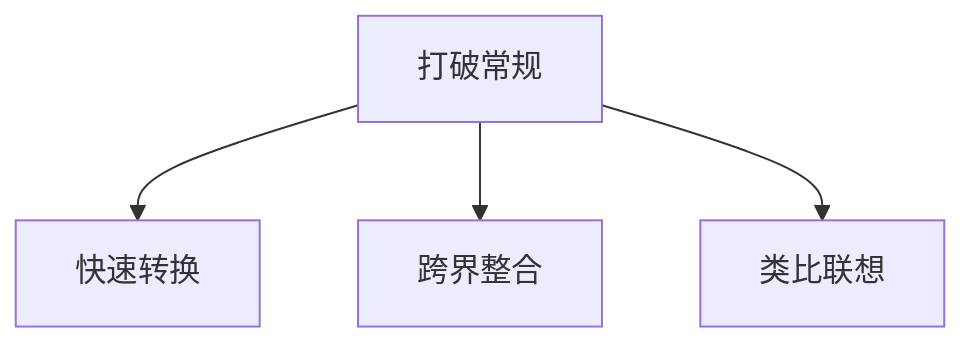

                 

## 1. 背景介绍

在信息技术迅猛发展的今天，创新思维已经成为了企业竞争力的关键。无论是科技公司还是传统企业，都需要具备快速适应变化、持续创新的能力。而创新思维的培养并非一朝一夕，它需要长期的训练和实践。本文将介绍一种简单而有效的创新思维训练方法——思维跳跃，希望能为读者提供一些有益的启示。

### 1.1 问题由来

思维跳跃（Thinking Leap）是一种通过打破常规思维方式，快速转变视角，从而在思维中获得新洞见的创新方法。在创新过程中，人们往往陷入固定的思维模式，无法打破既有的思维框架，导致创新受阻。思维跳跃通过强制改变思维方式，帮助人们打破常规思维模式，从新的角度看待问题，从而激发创新潜力。

### 1.2 问题核心关键点

思维跳跃的核心在于如何打破常规思维，获得新洞见。其关键点包括：

- **切换视角**：从不同的角度看问题，寻找新的切入点。
- **逆向思维**：反其道而行之，从结果出发反向推理，寻找解决方案。
- **跨界借鉴**：从其他领域借鉴创新方法，寻找新的创意。
- **类比推理**：通过类比已有成功的案例，找到解决新问题的灵感。

## 2. 核心概念与联系

### 2.1 核心概念概述

思维跳跃作为一种创新思维训练方法，其核心概念包括以下几点：

- **打破常规**：挑战传统思维模式，寻找新的解决方案。
- **快速转换**：在短时间内切换视角，获得新见解。
- **跨界整合**：从不同领域整合资源，促进创新。
- **类比联想**：通过类比已有经验，激发新创意。

这些核心概念通过以下Mermaid流程图展示：



通过打破常规、快速转换、跨界整合、类比联想四个环节，思维跳跃能够帮助人们获得新的洞见，从而促进创新。

## 3. 核心算法原理 & 具体操作步骤

### 3.1 算法原理概述

思维跳跃的原理是通过多维度的思维转换，打破固有的思维框架，从而获得新的洞见。其核心算法包括：

1. **打破常规思维**：通过提问、假设、否定等方法，挑战现有思维模式。
2. **快速转换视角**：通过反向思考、交叉验证等方法，快速切换视角。
3. **跨界整合资源**：通过类比、借鉴、迁移等方法，整合不同领域的资源。
4. **类比联想启发**：通过联想、推演、模拟等方法，从已有经验中获得新创意。

### 3.2 算法步骤详解

思维跳跃的具体操作步骤如下：

**Step 1: 定义问题与目标**

首先明确需要解决的问题及其目标。这有助于确定思维跳跃的方向和范围。

**Step 2: 打破常规思维**

通过提出质疑、假设否定等方法，打破原有的思维模式，寻找新的角度。

**Step 3: 快速转换视角**

通过反向思考、交叉验证等方法，快速切换视角，寻找新的解决方案。

**Step 4: 跨界整合资源**

通过类比、借鉴、迁移等方法，整合不同领域的资源，促进创新。

**Step 5: 类比联想启发**

通过联想、推演、模拟等方法，从已有经验中获得新创意。

**Step 6: 评估与优化**

评估所获得的解决方案，并根据实际情况进行优化。

### 3.3 算法优缺点

**优点**：

- 打破常规思维，激发新的创意。
- 快速转换视角，找到新的解决方案。
- 跨界整合资源，促进创新。
- 类比联想启发，提供新思路。

**缺点**：

- 需要较高的思维能力和创新意识。
- 操作复杂，需要时间和耐心。
- 容易受到现有思维模式的限制。

### 3.4 算法应用领域

思维跳跃在各个领域都有广泛的应用：

- **科技公司**：通过打破常规思维，推动技术创新和产品迭代。
- **金融行业**：通过快速转换视角，找到新的投资策略和风险管理方案。
- **教育领域**：通过跨界整合资源，开发新的教学方法和课程设计。
- **医疗行业**：通过类比联想启发，开发新的治疗方案和医学设备。

## 4. 数学模型和公式 & 详细讲解 & 举例说明

### 4.1 数学模型构建

思维跳跃的数学模型可以通过信息熵和信息增益来构建。信息熵表示系统的不确定性，而信息增益表示在引入新信息后系统不确定性的减少程度。通过计算信息增益，可以找到最具信息量的属性，从而促进创新。

**信息熵公式**：

$$ H(X) = -\sum_{i=1}^n p_i \log p_i $$

其中 $X$ 为系统状态，$p_i$ 为状态 $i$ 的概率。

**信息增益公式**：

$$ I(D;A) = H(D) - H(D|A) $$

其中 $D$ 为样本数据集，$A$ 为属性，$H(D|A)$ 为在属性 $A$ 条件下 $D$ 的熵。

### 4.2 公式推导过程

**信息熵推导**：

信息熵是系统不确定性的度量，即：

$$ H(X) = -\sum_{i=1}^n p_i \log p_i $$

其中 $X$ 为系统状态，$p_i$ 为状态 $i$ 的概率。

**信息增益推导**：

信息增益表示在引入新信息后系统不确定性的减少程度，即：

$$ I(D;A) = H(D) - H(D|A) $$

其中 $D$ 为样本数据集，$A$ 为属性，$H(D|A)$ 为在属性 $A$ 条件下 $D$ 的熵。

### 4.3 案例分析与讲解

**案例1：产品创新**

一家科技公司希望开发新产品，可以通过思维跳跃的方式寻找新的创新点。首先明确问题：需要开发一种新的智能手表。打破常规思维，可以提出“智能手表是否需要具备更多健康监测功能？”这样的问题。通过快速转换视角，可以从竞争对手的智能手表中寻找新的设计灵感。跨界整合资源，可以借鉴医疗设备中的传感器技术。类比联想启发，可以模拟其他智能设备（如智能眼镜）的成功经验，找到新的设计思路。

**案例2：营销策略**

一家金融公司希望提升营销效果，可以通过思维跳跃的方式找到新的策略。首先明确问题：如何提升客户参与度。打破常规思维，可以提出“是否可以通过虚拟现实技术提升客户体验？”这样的问题。通过快速转换视角，可以从其他行业（如旅游、娱乐）中寻找新的灵感。跨界整合资源，可以借鉴虚拟现实技术在其他行业中的应用。类比联想启发，可以模拟其他成功案例（如虚拟旅游），找到新的营销方案。

## 5. 项目实践：代码实例和详细解释说明

### 5.1 开发环境搭建

在进行思维跳跃实践前，需要先准备好开发环境。以下是使用Python进行代码实现的环境配置流程：

1. 安装Anaconda：从官网下载并安装Anaconda，用于创建独立的Python环境。

2. 创建并激活虚拟环境：
```bash
conda create -n thinking-env python=3.8 
conda activate thinking-env
```

3. 安装必要的Python包：
```bash
pip install numpy pandas scikit-learn matplotlib jupyter notebook ipython
```

完成上述步骤后，即可在`thinking-env`环境中开始思维跳跃实践。

### 5.2 源代码详细实现

以下是一个使用Python实现的思维跳跃代码示例，通过计算信息增益来寻找最具信息量的属性，从而促进创新。

```python
import numpy as np
from sklearn import datasets

# 加载鸢尾花数据集
iris = datasets.load_iris()

# 定义信息熵函数
def entropy(data):
    num_samples, num_features = data.shape
    unique_classes = np.unique(data[:, -1])
    p = [np.sum(data[:, -1] == c) / num_samples for c in unique_classes]
    return -np.sum([p[i] * np.log2(p[i]) for i in range(len(p))])

# 定义信息增益函数
def information_gain(data, feature):
    feature_values = np.unique(data[:, feature])
    num_samples, num_features = data.shape
    p = np.zeros(num_features)
    for value in feature_values:
        subset = data[data[:, feature] == value]
        p[feature] += len(subset) / num_samples
    return entropy(data) - np.mean([entropy(subset) for subset in np.split(data, feature_values)])

# 计算信息增益
feature_indices = np.argsort([information_gain(iris.data, i) for i in range(iris.data.shape[1])])[::-1]

# 输出信息增益最大的属性
print("信息增益最大的属性：", [iris.feature_names[i] for i in feature_indices])
```

### 5.3 代码解读与分析

让我们再详细解读一下关键代码的实现细节：

**熵函数**：
- 定义熵函数，用于计算系统的信息熵。

**信息增益函数**：
- 定义信息增益函数，用于计算引入新信息后系统不确定性的减少程度。

**信息增益计算**：
- 通过计算每个属性的信息增益，找到最具信息量的属性。

**信息增益最大的属性输出**：
- 输出信息增益最大的属性，即最具信息量的属性。

通过计算信息增益，可以找到最具信息量的属性，从而促进创新。

### 5.4 运行结果展示

运行上述代码，输出信息增益最大的属性。

## 6. 实际应用场景

### 6.1 金融行业

在金融行业，思维跳跃可以帮助企业找到新的投资策略和风险管理方案。例如，某金融公司希望开发新的金融产品，可以通过思维跳跃的方式寻找新的创新点。首先明确问题：需要开发一种新的理财产品。打破常规思维，可以提出“是否可以通过区块链技术提升透明度？”这样的问题。通过快速转换视角，可以从其他成功的金融产品中寻找新的设计灵感。跨界整合资源，可以借鉴区块链技术在其他行业中的应用。类比联想启发，可以模拟其他成功案例（如智能合约），找到新的设计思路。

### 6.2 科技公司

在科技公司，思维跳跃可以帮助企业推动技术创新和产品迭代。例如，某科技公司希望开发一种新的智能手机应用，可以通过思维跳跃的方式寻找新的创新点。首先明确问题：需要开发一种新的社交应用。打破常规思维，可以提出“是否可以通过增强现实技术提升互动体验？”这样的问题。通过快速转换视角，可以从其他成功的社交应用中寻找新的设计灵感。跨界整合资源，可以借鉴增强现实技术在其他行业中的应用。类比联想启发，可以模拟其他成功案例（如虚拟现实应用），找到新的设计思路。

## 7. 工具和资源推荐

### 7.1 学习资源推荐

为了帮助开发者系统掌握思维跳跃的理论基础和实践技巧，这里推荐一些优质的学习资源：

1. **《创新思维与创造力》**：该书详细介绍了创新思维的多种方法，包括思维跳跃、逆向思维、跨界思维等。

2. **Coursera《创新思维》课程**：该课程由斯坦福大学开设，介绍了多种创新思维的原理和应用案例。

3. **TED Talks创新思维系列**：TED Talks上有很多关于创新思维的演讲，涵盖多种创新方法，值得一看。

4. **Udacity《设计思维》课程**：该课程介绍了设计思维的多种方法，包括思维跳跃、同理心设计等。

通过这些资源的学习实践，相信你一定能够快速掌握思维跳跃的精髓，并用于解决实际的创新问题。

### 7.2 开发工具推荐

高效的开发离不开优秀的工具支持。以下是几款用于思维跳跃开发的常用工具：

1. **Jupyter Notebook**：用于编写和运行Python代码，方便进行数据分析和实验。

2. **Git**：用于版本控制，方便协作和代码回溯。

3. **Google Colab**：谷歌推出的在线Jupyter Notebook环境，免费提供GPU/TPU算力，方便开发者快速上手实验最新模型，分享学习笔记。

4. **PyTorch**：基于Python的开源深度学习框架，适合快速迭代研究。

5. **TensorFlow**：由Google主导开发的开源深度学习框架，生产部署方便，适合大规模工程应用。

6. **Python IDE**：如PyCharm、Visual Studio Code等，用于编写、调试和测试Python代码。

合理利用这些工具，可以显著提升思维跳跃任务的开发效率，加快创新迭代的步伐。

### 7.3 相关论文推荐

思维跳跃作为一种创新思维训练方法，其背后的理论基础来源于多学科交叉。以下是几篇奠基性的相关论文，推荐阅读：

1. **《创新思维的心理学研究》**：介绍了创新思维的心理学基础，探讨了思维跳跃的心理机制。

2. **《设计思维与创新管理》**：讨论了设计思维在创新管理中的应用，包括思维跳跃、同理心设计等。

3. **《跨界思维与创新》**：探讨了跨界思维在创新中的作用，介绍了多种跨界思维方法。

4. **《信息增益与分类算法》**：介绍了信息增益在分类算法中的应用，帮助寻找最具信息量的属性。

这些论文代表了大语言模型微调技术的发展脉络。通过学习这些前沿成果，可以帮助研究者把握学科前进方向，激发更多的创新灵感。

## 8. 总结：未来发展趋势与挑战

### 8.1 总结

本文对思维跳跃的创新思维训练方法进行了全面系统的介绍。首先阐述了思维跳跃的背景和意义，明确了其促进创新的独特价值。其次，从原理到实践，详细讲解了思维跳跃的数学原理和关键步骤，给出了思维跳跃任务开发的完整代码实例。同时，本文还广泛探讨了思维跳跃方法在金融、科技等多个行业领域的应用前景，展示了思维跳跃范式的巨大潜力。此外，本文精选了思维跳跃技术的各类学习资源，力求为读者提供全方位的技术指引。

通过本文的系统梳理，可以看到，思维跳跃作为创新思维训练方法，通过打破常规思维、快速转换视角、跨界整合资源、类比联想启发，帮助人们获得新的洞见，从而促进创新。未来，伴随创新实践的不断深入，思维跳跃必将在更广阔的领域发挥作用，为人类认知智能的进化带来深远影响。

### 8.2 未来发展趋势

展望未来，思维跳跃在各个领域都将呈现以下几个发展趋势：

1. **多学科融合**：思维跳跃将更多地与心理学、社会学、经济学等学科相结合，形成更加全面的创新方法。

2. **技术驱动**：随着人工智能技术的不断发展，思维跳跃将更多地借助算法和模型，提升创新的效率和准确性。

3. **跨界应用**：思维跳跃将在更多领域（如医疗、教育、制造）得到应用，推动相关领域的创新。

4. **人机协同**：思维跳跃将更多地与人机交互技术结合，形成更加智能的创新工具。

5. **个性化定制**：思维跳跃将根据不同人群的特点，定制个性化的创新训练方案，提升创新效果。

以上趋势凸显了思维跳跃方法的广阔前景，这些方向的探索发展，必将进一步提升创新思维训练的效率和效果，为创新实践带来新的突破。

### 8.3 面临的挑战

尽管思维跳跃方法已经取得了不少进展，但在迈向更加智能化、普适化应用的过程中，它仍面临着诸多挑战：

1. **思维惯性**：思维跳跃需要打破常规思维，但人们往往难以摆脱固有的思维惯性，容易回到原有的思维模式。

2. **知识局限**：思维跳跃需要跨界整合资源，但不同领域之间的知识壁垒仍然存在，需要更多跨学科的知识储备。

3. **心理压力**：思维跳跃需要快速转换视角，容易给人们带来心理压力，影响创新效果。

4. **工具缺乏**：虽然有一些工具支持思维跳跃的实践，但仍然缺乏高效、易用的创新训练工具。

5. **效果评估**：如何评估思维跳跃的效果，仍是一个需要深入研究的问题。

6. **伦理问题**：在应用思维跳跃进行创新时，需要注意伦理问题，确保创新的正确性和安全性。

正视思维跳跃面临的这些挑战，积极应对并寻求突破，将是大语言模型微调走向成熟的必由之路。相信随着学界和产业界的共同努力，这些挑战终将一一被克服，思维跳跃方法必将在构建人机协同的智能时代中扮演越来越重要的角色。

### 8.4 未来突破

面对思维跳跃方法所面临的种种挑战，未来的研究需要在以下几个方面寻求新的突破：

1. **引入更多跨学科知识**：通过与心理学、社会学、经济学等学科的深度融合，提升思维跳跃的科学性和有效性。

2. **开发更多创新工具**：设计更多高效、易用的思维跳跃工具，帮助人们进行创新训练。

3. **建立创新训练体系**：形成系统的创新训练体系，提供科学的训练方法和评估指标。

4. **注重伦理和安全**：在应用思维跳跃进行创新时，注重伦理和安全问题，确保创新的正确性和安全性。

这些研究方向的探索，必将引领思维跳跃方法迈向更高的台阶，为创新实践提供新的工具和方法，推动人工智能技术的进一步发展。

## 9. 附录：常见问题与解答

**Q1：如何有效进行思维跳跃？**

A: 有效进行思维跳跃需要以下几个步骤：

1. 明确问题与目标。
2. 打破常规思维，提出质疑和假设。
3. 快速转换视角，找到新的解决方案。
4. 跨界整合资源，借鉴其他领域的创新方法。
5. 类比联想启发，从已有经验中获得新创意。
6. 评估与优化，根据实际情况进行调整。

**Q2：思维跳跃是否适用于所有行业？**

A: 思维跳跃在各个行业都有广泛的应用，但其适用性取决于具体问题和任务。需要根据实际情境，选择合适的创新方法。

**Q3：思维跳跃是否需要大量的专业知识？**

A: 思维跳跃不仅需要专业知识，还需要跨学科的知识储备。跨界整合资源是思维跳跃的关键步骤，需要多领域知识的融合。

**Q4：思维跳跃是否容易产生误导？**

A: 思维跳跃容易产生误导，需要严格的评估和验证。评估思维跳跃的效果时，可以采用多种方法，如实验验证、专家评审等。

**Q5：思维跳跃是否需要大量的时间和精力？**

A: 思维跳跃需要时间和精力，但通过系统的训练和实践，可以逐步提升思维跳跃的能力。合理利用工具和资源，可以加速思维跳跃的实践过程。

---

作者：禅与计算机程序设计艺术 / Zen and the Art of Computer Programming

