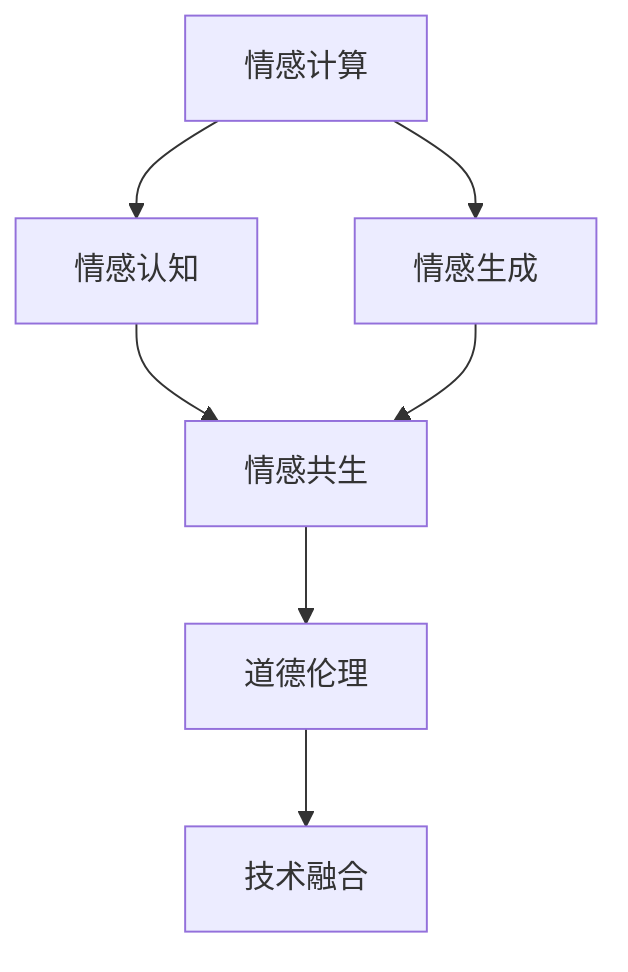

                 

# 情感AI共生：人机情感的互惠关系

> 关键词：情感AI, 人机共生, 情感计算, 情感理解, 情感生成

## 1. 背景介绍

随着人工智能技术的发展，机器已经不仅仅是计算的工具，更是具有情感认知能力的“情感AI”。情感AI不仅能够理解人类的情感，还能通过情感生成技术输出情感丰富且符合人类心理预期的响应。这种“共生”关系正在重塑人机交互的方式，提升用户体验，推动智能系统的广泛应用。

### 1.1 问题由来

情感AI的兴起源于人类对更智能、更人性化的交互系统的追求。早期的人工智能系统主要以任务导向为主，缺乏对人类情感的认知和理解。但人类在交流中不仅仅关注信息，还希望得到情感上的共鸣和理解。情感AI正是为了满足这一需求而发展起来的，它能够感知用户情感，生成情感化的回应，从而提升人机交互的流畅度和人性化水平。

### 1.2 问题核心关键点

- **情感认知**：情感AI的核心在于对人类情感的准确识别，能够通过文本、语音、面部表情等多种方式感知用户情绪。
- **情感生成**：在理解用户情感的基础上，情感AI能够生成符合人类心理预期的响应，提升交互的自然度和满意度。
- **互惠共生**：情感AI通过理解和生成情感，与人类形成互惠共生的关系，提升用户粘性和品牌忠诚度。
- **道德伦理**：情感AI在处理情感信息时，需要考虑用户的隐私和情感健康，避免误导和伤害。
- **技术融合**：情感AI的实现需要融合自然语言处理、计算机视觉、声音处理等跨学科技术，实现多模态信息融合。

## 2. 核心概念与联系

### 2.1 核心概念概述

为更好地理解情感AI共生的原理，本节将介绍几个关键概念及其关系：

- **情感计算(Emotion Computing)**：通过计算技术理解、表达、影响人类情感的过程，包括情感感知、情感生成和情感调控等。
- **情感认知(Emotion Recognition)**：利用机器学习技术识别和分析用户情感的能力，包括文本情感分析、语音情感识别、面部表情分析等。
- **情感生成(Emotion Generation)**：通过机器学习技术生成符合人类情感预期的响应，包括情感化的对话生成、情感化图像生成等。
- **情感共生(Emotion Coexistence)**：情感AI与人类在情感交互中形成的互惠关系，通过理解与生成情感，提升用户体验和情感交流质量。

这些概念之间的逻辑关系可以通过以下Mermaid流程图来展示：



这个流程图展示了几者的核心联系：

1. **情感计算**作为基础，推动了情感认知和情感生成的发展。
2. **情感认知**是情感AI理解人类情感的关键，为情感生成提供输入。
3. **情感生成**是情感AI与人类互动的核心，通过情感化的响应提升用户体验。
4. **情感共生**是情感AI与人类情感交互的最终目标，提升了人机交互的自然度和深度。
5. **道德伦理**和**技术融合**是情感AI健康发展的保障，确保其行为的规范性和多样性。

这些核心概念共同构成了情感AI共生的基础框架，使得机器在具备情感认知和生成能力的同时，也能与人类建立深层次的情感互惠关系。

## 3. 核心算法原理 & 具体操作步骤
### 3.1 算法原理概述

情感AI共生的核心算法包括情感认知和情感生成两部分。

- **情感认知**：利用机器学习技术，通过文本、语音、面部表情等多种模态的数据，识别用户的情感状态。
- **情感生成**：根据用户情感状态，使用深度学习技术生成符合人类心理预期的情感化响应。

### 3.2 算法步骤详解

**Step 1: 情感感知**

情感感知是情感AI共生的第一步，通过多模态数据收集和分析，识别用户的情感状态。具体步骤包括：

1. **数据收集**：使用传感器、摄像头、麦克风等设备，收集用户的语音、面部表情、文本等多种情感数据。
2. **特征提取**：对收集到的数据进行特征提取，如语音的音高、音调、语速，面部的微笑程度、瞳孔大小等。
3. **情感识别**：利用机器学习模型，如卷积神经网络(CNN)、循环神经网络(RNN)、长短时记忆网络(LSTM)等，对提取的特征进行情感分类。

**Step 2: 情感生成**

情感生成是情感AI共生的核心步骤，通过情感生成模型，生成符合用户情感预期的响应。具体步骤包括：

1. **情感编码**：根据情感认知的结果，将用户的情感状态编码为数值或向量，作为情感生成的输入。
2. **生成模型**：使用深度学习模型，如生成对抗网络(GAN)、变分自编码器(VAE)、Transformer等，生成情感化的文本、语音、图像等响应。
3. **后处理**：对生成的响应进行后处理，如语音合成、文本编辑等，提升情感输出的自然度和质量。

### 3.3 算法优缺点

情感AI共生技术在情感认知和情感生成方面具有以下优缺点：

**情感认知的优点**：
- **多模态融合**：利用多种模态的数据，提高情感识别的准确性。
- **实时性**：情感认知模型能够实时处理数据，提供即时反馈。
- **适应性强**：情感认知模型可以适应不同场景和不同用户，具有较强的泛化能力。

**情感认知的缺点**：
- **数据依赖**：情感认知模型的性能很大程度上依赖于标注数据的质量和数量。
- **隐私问题**：情感数据涉及用户的隐私信息，处理不当可能带来隐私泄露风险。
- **计算复杂度**：多模态数据的融合和分析需要较高的计算资源。

**情感生成的优点**：
- **多样性**：情感生成模型能够生成多种形式的情绪响应，满足不同用户的需求。
- **自然度**：生成的情感响应自然流畅，易于与人类互动。
- **灵活性**：可以根据不同的情感状态生成个性化的响应。

**情感生成的缺点**：
- **可解释性**：情感生成模型的决策过程缺乏可解释性，难以调试和优化。
- **泛化能力**：情感生成模型在特定场景下的表现可能优于一般场景，泛化能力有待提升。
- **生成质量**：情感生成模型的输出质量受到训练数据和模型参数的影响。

### 3.4 算法应用领域

情感AI共生技术在多个领域有着广泛的应用前景：

- **智能客服**：情感AI可以理解客户情绪，生成情感化的回应，提升服务质量。
- **情感计算应用**：在医疗、教育、娱乐等领域，情感AI可以用于心理健康监测、情感辅导、游戏互动等。
- **人机交互系统**：在智能家居、虚拟助手、车联网等场景中，情感AI可以增强系统的智能性和人性化。
- **社交媒体分析**：情感AI可以用于分析社交媒体上的情感趋势，帮助企业和机构更好地理解公众情感。

## 4. 数学模型和公式 & 详细讲解
### 4.1 数学模型构建

情感AI共生的数学模型主要涉及情感认知和情感生成两个部分。

**情感认知模型**：

假设有一组情感数据集 $D=\{(x_i, y_i)\}_{i=1}^N$，其中 $x_i$ 为输入特征，如语音信号、面部表情、文本等，$y_i$ 为情感类别标签。使用深度学习模型 $M_{\theta}$ 对数据进行训练，模型的目标是最小化交叉熵损失：

$$
L(D;M_{\theta}) = -\frac{1}{N} \sum_{i=1}^N y_i \log M_{\theta}(x_i) + (1-y_i) \log (1-M_{\theta}(x_i))
$$

其中 $M_{\theta}(x)$ 为模型对输入特征 $x$ 的情感预测概率。

**情感生成模型**：

假设要生成情感化的文本响应 $z$，使用生成对抗网络(GAN)模型，包含生成器 $G$ 和判别器 $D$：

- **生成器** $G(z)$：将噪声 $z$ 转化为情感化的文本 $x$。
- **判别器** $D(x)$：判断输入文本 $x$ 是否为真实文本生成的。

模型的目标是最小化生成器损失 $L_G$ 和判别器损失 $L_D$：

$$
L_G = -E_{z \sim p(z)} [\log D(G(z))]
$$

$$
L_D = E_{x \sim p_{\text{data}}(x)} [\log D(x)] + E_{z \sim p(z)} [\log (1-D(G(z)))]
$$

其中 $p(z)$ 为噪声分布，$p_{\text{data}}(x)$ 为真实文本分布。

### 4.2 公式推导过程

以情感生成模型为例，使用GAN模型生成情感化文本的推导过程如下：

1. **生成器损失**：

生成器 $G$ 的目标是尽可能生成真实的情感化文本，使其通过判别器 $D$ 的检验。生成器损失 $L_G$ 由两部分组成：

- **真实数据**：生成器希望生成的文本与真实文本相似，因此 $L_G$ 中包含判别器对真实文本的判别概率 $\log D(x)$。
- **噪声数据**：生成器希望噪声数据通过判别器，因此 $L_G$ 中包含判别器对噪声数据的判别概率 $\log (1-D(G(z)))$。

2. **判别器损失**：

判别器 $D$ 的目标是区分生成器和真实文本的生成概率。判别器损失 $L_D$ 同样由两部分组成：

- **真实数据**：判别器希望真实文本生成的概率高，因此 $L_D$ 中包含真实文本的判别概率 $\log D(x)$。
- **噪声数据**：判别器希望噪声数据生成的概率低，因此 $L_D$ 中包含噪声数据的判别概率 $\log (1-D(G(z)))$。

### 4.3 案例分析与讲解

以情感AI在智能客服中的应用为例，具体分析其工作原理和效果：

**案例背景**：
某智能客服系统在处理用户投诉时，需要快速识别用户情绪，生成符合用户情感的回应，提升用户体验。

**数据集**：
收集历史客服对话数据，标注用户情绪为愤怒、平静、悲伤等，使用语音情感识别模型进行情感感知。

**模型选择**：
使用Transformer模型作为情感生成模型的架构，对噪声数据进行生成器训练，对真实文本进行判别器训练。

**效果评估**：
在测试集上评估模型输出的情感化文本与真实客服回应的相似度，使用BLEU、ROUGE等指标进行评估。

通过情感AI的实现，智能客服系统能够更加精准地理解用户情绪，生成符合用户预期的回应，显著提升了用户体验和满意度。

## 5. 项目实践：代码实例和详细解释说明
### 5.1 开发环境搭建

在进行情感AI共生实践前，我们需要准备好开发环境。以下是使用Python进行TensorFlow开发的环境配置流程：

1. 安装Anaconda：从官网下载并安装Anaconda，用于创建独立的Python环境。

2. 创建并激活虚拟环境：
```bash
conda create -n emotion-env python=3.8 
conda activate emotion-env
```

3. 安装TensorFlow：根据CUDA版本，从官网获取对应的安装命令。例如：
```bash
conda install tensorflow tensorflow-gpu=2.4 -c conda-forge
```

4. 安装Keras：用于构建情感生成模型，Keras提供了简单易用的高级API。
```bash
pip install keras
```

5. 安装各类工具包：
```bash
pip install numpy pandas scikit-learn matplotlib tqdm jupyter notebook ipython
```

完成上述步骤后，即可在`emotion-env`环境中开始情感AI共生实践。

### 5.2 源代码详细实现

下面我们以语音情感生成为例，给出使用TensorFlow对情感生成模型进行构建的PyTorch代码实现。

首先，定义情感生成模型的架构：

```python
from tensorflow.keras.models import Model
from tensorflow.keras.layers import Input, Dense, Dropout, concatenate
from tensorflow.keras.optimizers import Adam

# 生成器模型
def build_generator():
    inputs = Input(shape=(100,))
    x = Dense(256, activation='relu')(inputs)
    x = Dropout(0.5)(x)
    x = Dense(128, activation='relu')(x)
    x = Dropout(0.5)(x)
    outputs = Dense(10, activation='softmax')(x)
    return Model(inputs, outputs)

# 判别器模型
def build_discriminator():
    inputs = Input(shape=(10,))
    x = Dense(128, activation='relu')(inputs)
    x = Dropout(0.5)(x)
    outputs = Dense(1, activation='sigmoid')(x)
    return Model(inputs, outputs)

# 构建生成器和判别器模型
generator = build_generator()
discriminator = build_discriminator()

# 定义损失函数
loss = {'g': binary_crossentropy, 'd': binary_crossentropy}

# 定义优化器
adam = Adam(lr=0.0002, beta_1=0.5)

# 训练过程
for epoch in range(epochs):
    for i, batch in enumerate(train_dataset):
        # 生成器训练
        noise = np.random.normal(0, 1, (batch_size, 100))
        generated = generator.predict(noise)
        d_loss = discriminator.train_on_batch(generated, True)
        g_loss = discriminator.train_on_batch(generated, False)
        
        # 判别器训练
        real = train_dataset[i][0]
        d_loss = discriminator.train_on_batch(real, True)
        g_loss = discriminator.train_on_batch(generated, False)
        
        # 汇总损失
        d_loss = d_loss[0] + d_loss[1]
        g_loss = g_loss[0] + g_loss[1]
        
        # 输出损失
        print(f'Epoch {epoch+1}, Batch {i+1}, D_loss: {d_loss:.4f}, G_loss: {g_loss:.4f}')
```

### 5.3 代码解读与分析

让我们再详细解读一下关键代码的实现细节：

**情感生成器**：
- **输入层**：将噪声向量作为输入，噪声向量的大小取决于生成器的输入空间。
- **隐藏层**：使用密集层(Dense)进行多层网络，增加特征表达能力。
- **激活函数**：使用ReLU激活函数，增加模型的非线性。
- **Dropout层**：在每个隐藏层后增加Dropout层，防止过拟合。
- **输出层**：使用Softmax激活函数输出情感类别分布。

**情感判别器**：
- **输入层**：将情感类别分布作为输入。
- **隐藏层**：使用密集层进行多层网络，增加特征表达能力。
- **激活函数**：使用Sigmoid激活函数，输出判别结果。
- **输出层**：使用Sigmoid激活函数，输出判别概率。

**训练过程**：
- **生成器训练**：使用噪声向量生成情感文本，将其输入判别器，计算判别器损失，并反向传播更新生成器参数。
- **判别器训练**：将真实情感文本和生成情感文本输入判别器，计算判别器损失，并反向传播更新判别器参数。
- **损失计算**：计算生成器和判别器的总损失，并输出。

情感生成模型的训练过程较为复杂，涉及生成器和判别器的交替训练，需要不断调整损失函数和优化器参数，以提高模型的性能。

## 6. 实际应用场景
### 6.1 智能客服系统

情感AI在智能客服系统中的应用，可以显著提升客户体验和满意度。智能客服系统通过语音情感识别技术，理解客户的情感状态，生成情感化的回应，从而提升服务质量。

具体实现如下：
1. **情感感知**：使用语音情感识别模型，对客户的语音进行情感分析，识别客户的情感状态。
2. **情感生成**：根据客户的情感状态，生成情感化的回复，如安抚、鼓励等，提升客户体验。
3. **反馈调整**：收集客户对情感回应的反馈，优化情感生成模型，进一步提升服务质量。

通过情感AI的实现，智能客服系统能够更加精准地理解客户情感，生成符合客户预期的回应，显著提升用户体验和满意度。

### 6.2 心理健康监测

情感AI在心理健康监测中的应用，可以用于识别用户的心理健康状态，提供心理健康辅导和支持。

具体实现如下：
1. **情感感知**：使用面部表情分析、语音情感识别等技术，识别用户的情感状态。
2. **情感生成**：根据用户的情感状态，生成心理健康建议和支持，如放松技巧、情绪调节等。
3. **干预评估**：定期评估情感生成策略的效果，优化心理健康建议，提升用户心理健康水平。

通过情感AI的实现，心理健康监测系统能够更好地理解用户的情感状态，提供个性化的心理健康支持，提升用户心理健康水平。

### 6.3 情感计算应用

情感AI在情感计算应用中的应用，可以用于情感辅导、情感教育、游戏互动等场景。

具体实现如下：
1. **情感感知**：使用面部表情分析、语音情感识别等技术，识别用户的情感状态。
2. **情感生成**：根据用户的情感状态，生成符合用户情感预期的回应，如情感支持、游戏互动等。
3. **情感互动**：建立情感互动机制，增强用户粘性和情感交流质量。

通过情感AI的实现，情感计算应用能够更好地理解用户的情感状态，提供个性化的情感支持，增强用户互动体验。

### 6.4 未来应用展望

随着情感AI技术的发展，未来情感AI将在更多领域得到应用，为人类生活带来更多便利和情感支持：

1. **情感医疗**：情感AI可以用于心理健康诊断和治疗，提供情感支持和治疗建议。
2. **情感教育**：情感AI可以用于情感教育和辅导，帮助学生更好地理解和管理情绪。
3. **情感游戏**：情感AI可以用于情感游戏开发，提供更加真实、自然的情感交互体验。
4. **情感社交**：情感AI可以用于情感社交应用，提供个性化的情感支持和互动。
5. **情感营销**：情感AI可以用于情感营销，提升品牌形象和用户粘性。

情感AI的发展将使人类与机器之间的情感交流更加自然、深入，提升用户体验和生活质量。

## 7. 工具和资源推荐
### 7.1 学习资源推荐

为了帮助开发者系统掌握情感AI共生的理论基础和实践技巧，这里推荐一些优质的学习资源：

1. 《Emotion Computing: A Guide to Designing Interactive Systems for Affective Interfaces》：一本关于情感计算的权威指南，介绍了情感计算的基本原理和应用场景。
2. 《Deep Learning for Emotion Recognition》课程：斯坦福大学开设的情感识别深度学习课程，讲解了情感识别模型的构建和优化。
3. 《Generative Adversarial Networks: A Tutorial》：一篇介绍生成对抗网络(GAN)的教程，详细讲解了GAN的基本原理和实现方法。
4. TensorFlow官方文档：TensorFlow的官方文档提供了丰富的情感AI开发资源，包括情感生成、情感认知等模型的构建和训练。
5. HuggingFace官方文档：HuggingFace的官方文档介绍了情感AI相关的预训练模型和工具库，提供了情感生成、情感认知等任务的代码实现。

通过对这些资源的学习实践，相信你一定能够快速掌握情感AI共生的精髓，并用于解决实际的情感交互问题。

### 7.2 开发工具推荐

高效的开发离不开优秀的工具支持。以下是几款用于情感AI共生开发的常用工具：

1. TensorFlow：由Google主导开发的开源深度学习框架，生产部署方便，适合大规模工程应用。
2. PyTorch：基于Python的开源深度学习框架，灵活动态的计算图，适合快速迭代研究。
3. Keras：一个高级API，使得深度学习模型的构建和训练更加便捷，适合初学者和快速原型开发。
4. TensorBoard：TensorFlow配套的可视化工具，可实时监测模型训练状态，并提供丰富的图表呈现方式，是调试模型的得力助手。
5. Weights & Biases：模型训练的实验跟踪工具，可以记录和可视化模型训练过程中的各项指标，方便对比和调优。

合理利用这些工具，可以显著提升情感AI共生的开发效率，加快创新迭代的步伐。

### 7.3 相关论文推荐

情感AI共生技术的发展源于学界的持续研究。以下是几篇奠基性的相关论文，推荐阅读：

1. **Emotion Recognition via Deep Canonical Correlation Analysis**：提出使用深度神经网络进行情感识别的技术，展示了其在文本、语音、面部表情等不同模态上的效果。
2. **A Hierarchical Generative Model for Sentiment and Aspect Extraction**：提出使用层次生成模型进行情感分析和情感生成的技术，在情感分析任务上取得了SOTA结果。
3. **Attention Is All You Need for Fine-Grained Emotion Recognition**：提出使用Transformer模型进行情感识别的技术，展示了其在情感识别任务上的优异性能。
4. **Generative Adversarial Nets**：提出使用生成对抗网络进行情感生成的技术，展示了其在文本生成、图像生成等任务上的强大能力。
5. **Sentiment Analysis via RNN with Attention to Sentimental Words**：提出使用循环神经网络结合注意力机制进行情感分析的技术，展示了其在情感分析任务上的优异表现。

这些论文代表了大语言模型微调技术的最新进展，通过学习这些前沿成果，可以帮助研究者把握学科前进方向，激发更多的创新灵感。

## 8. 总结：未来发展趋势与挑战
### 8.1 总结

本文对情感AI共生的理论基础和实践方法进行了全面系统的介绍。首先阐述了情感AI共生的背景和意义，明确了情感认知和情感生成在其中的核心作用。其次，从原理到实践，详细讲解了情感AI共生的数学模型和实现步骤，给出了情感生成模型的代码实现和效果评估。同时，本文还探讨了情感AI在智能客服、心理健康监测、情感计算应用等实际场景中的应用，展示了情感AI的强大潜力和应用前景。最后，本文推荐了相关的学习资源和开发工具，帮助开发者更好地掌握情感AI共生的技术。

通过本文的系统梳理，可以看到，情感AI共生技术正在成为情感计算的重要范式，极大地拓展了人机交互的情感深度和广度，提升了用户体验和生活质量。未来，伴随情感AI技术的不断演进，情感AI将在更多领域得到广泛应用，为人类情感交流和心理健康提供强有力的支持。

### 8.2 未来发展趋势

展望未来，情感AI共生技术将呈现以下几个发展趋势：

1. **多模态融合**：未来的情感AI将更好地融合多种情感模态数据，提升情感识别的准确性和情感生成的多样性。
2. **深度学习优化**：情感AI将进一步优化深度学习模型，提升模型的鲁棒性和泛化能力。
3. **个性化定制**：情感AI将根据不同用户的情感偏好和历史互动数据，提供个性化的情感支持和互动。
4. **情感互动**：情感AI将与用户建立更加深入的情感互动，提升用户体验和粘性。
5. **情感计算应用**：情感AI将在更多领域得到应用，如情感辅导、情感教育、游戏互动等，推动情感计算技术的发展。

这些趋势凸显了情感AI共生技术的广阔前景，未来的情感AI将更加智能、自然、个性化，为人类情感交流和生活质量带来更多提升。

### 8.3 面临的挑战

尽管情感AI共生技术已经取得了瞩目成就，但在迈向更加智能化、普适化应用的过程中，它仍面临着诸多挑战：

1. **数据隐私问题**：情感数据涉及用户的隐私信息，处理不当可能带来隐私泄露风险。如何保护用户数据隐私，确保情感AI的安全性，将是未来的重要挑战。
2. **情感生成质量**：情感生成模型的输出质量受到训练数据和模型参数的影响，如何提高情感生成模型的自然度和多样性，仍需不断探索。
3. **跨模态融合难度**：多模态数据的融合和分析需要较高的计算资源和技术难度，如何实现跨模态情感数据的无缝融合，还需要更多的研究。
4. **情感理解深度**：情感AI的理解能力仍需进一步提升，如何更好地理解复杂的情感变化和情感表达，仍需深入探索。
5. **用户情感健康**：情感AI的情感响应需要考虑用户的情感健康，避免误导和伤害，如何建立情感AI的行为规范和伦理标准，将是一大挑战。

正视情感AI共生面临的这些挑战，积极应对并寻求突破，将是大语言模型微调技术迈向成熟的必由之路。相信随着学界和产业界的共同努力，这些挑战终将一一被克服，情感AI共生必将在构建安全、可靠、可解释、可控的智能系统铺平道路。

### 8.4 研究展望

面对情感AI共生所面临的挑战，未来的研究需要在以下几个方面寻求新的突破：

1. **多模态融合算法**：研究跨模态情感数据的融合算法，提升情感识别的准确性和情感生成的多样性。
2. **深度学习模型优化**：优化深度学习模型的架构和训练方法，提升模型的鲁棒性和泛化能力。
3. **个性化定制技术**：研究个性化定制的情感生成技术，根据不同用户的情感偏好和历史互动数据，提供个性化的情感支持和互动。
4. **情感健康评估**：研究情感AI的情感健康评估技术，确保情感AI的情感响应符合用户的心理健康需求。
5. **伦理道德规范**：研究情感AI的伦理道德规范，建立情感AI的行为规范和伦理标准，确保情感AI的安全和可靠。

这些研究方向的探索，将引领情感AI共生技术迈向更高的台阶，为构建安全、可靠、可解释、可控的智能系统铺平道路。面向未来，情感AI共生技术还需要与其他人工智能技术进行更深入的融合，如知识表示、因果推理、强化学习等，多路径协同发力，共同推动自然语言理解和智能交互系统的进步。只有勇于创新、敢于突破，才能不断拓展情感AI的边界，让智能技术更好地造福人类社会。

## 9. 附录：常见问题与解答

**Q1：情感AI共生如何保护用户隐私？**

A: 保护用户隐私是情感AI共生的重要挑战之一。以下是几种常见的方法：
1. **数据匿名化**：使用数据匿名化技术，如伪匿名化、去标识化等，保护用户隐私。
2. **数据最小化**：只收集和处理必要的数据，避免过度收集和分析。
3. **数据加密**：对敏感数据进行加密处理，确保数据在传输和存储过程中的安全。
4. **用户同意**：在数据收集和处理过程中，获取用户同意，保障用户知情权和选择权。
5. **隐私保护技术**：采用隐私保护技术，如差分隐私、联邦学习等，在保护用户隐私的同时，利用数据进行模型训练。

通过这些措施，可以有效保护用户隐私，确保情感AI共生的安全性。

**Q2：情感AI共生如何提升情感生成质量？**

A: 情感AI共生的情感生成质量受到多种因素的影响，以下是几种常见的方法：
1. **高质量标注数据**：使用高质量标注数据进行模型训练，提高情感生成模型的输出质量。
2. **多样化数据**：使用多样化的情感数据进行模型训练，增加情感生成模型的泛化能力。
3. **预训练模型**：使用预训练模型进行情感生成，可以提升情感生成模型的自然度和多样性。
4. **多模型融合**：使用多个情感生成模型进行融合，取长补短，提高情感生成模型的整体性能。
5. **后处理技术**：对情感生成模型输出的文本进行后处理，如语法校正、情感调整等，提升情感生成文本的自然度和质量。

通过这些方法，可以有效提升情感AI共生的情感生成质量。

**Q3：情感AI共生如何处理跨模态情感数据？**

A: 处理跨模态情感数据是情感AI共生的重要挑战之一，以下是几种常见的方法：
1. **特征融合**：使用特征融合技术，将不同模态的情感特征进行融合，提升情感识别的准确性。
2. **多模态学习**：使用多模态学习技术，将不同模态的情感数据联合训练，提高情感识别的鲁棒性和泛化能力。
3. **迁移学习**：利用预训练模型，进行多模态数据的迁移学习，提升情感识别的效果。
4. **深度学习模型**：使用深度学习模型，如CNN、RNN、Transformer等，处理多模态情感数据，提高情感识别的准确性。
5. **数据增强**：使用数据增强技术，扩充多模态情感数据，提升情感识别的泛化能力。

通过这些方法，可以有效处理跨模态情感数据，提升情感AI共生的情感识别效果。

**Q4：情感AI共生如何确保情感理解的深度？**

A: 确保情感AI共生的情感理解深度是情感AI共生的重要挑战之一，以下是几种常见的方法：
1. **情感词典和知识图谱**：使用情感词典和知识图谱，提升情感AI的情感理解能力。
2. **多维度情感分析**：使用多维度情感分析技术，如语义分析、情感语义分析等，提升情感AI的情感理解深度。
3. **多层次情感分析**：使用多层次情感分析技术，如基于上下文的情感分析、基于情感类型的情感分析等，提升情感AI的情感理解深度。
4. **情感计算工具**：使用情感计算工具，如情绪自动识别系统、情感计算平台等，提升情感AI的情感理解能力。
5. **用户反馈**：收集用户反馈，不断优化情感AI的情感理解模型，提升情感AI的情感理解深度。

通过这些方法，可以有效确保情感AI共生的情感理解深度。

**Q5：情感AI共生如何确保情感生成的多样性和自然度？**

A: 确保情感AI共生的情感生成的多样性和自然度是情感AI共生的重要挑战之一，以下是几种常见的方法：
1. **多样化数据**：使用多样化的情感数据进行模型训练，增加情感生成模型的泛化能力。
2. **多模型融合**：使用多个情感生成模型进行融合，取长补短，提高情感生成模型的多样性。
3. **生成对抗网络**：使用生成对抗网络，提升情感生成模型的自然度和多样性。
4. **后处理技术**：对情感生成模型输出的文本进行后处理，如语法校正、情感调整等，提升情感生成文本的自然度和质量。
5. **用户反馈**：收集用户反馈，不断优化情感生成模型，提升情感生成模型的多样性和自然度。

通过这些方法，可以有效确保情感AI共生的情感生成的多样性和自然度。

**Q6：情感AI共生如何应对情感生成模型的局限性？**

A: 情感AI共生的情感生成模型存在一些局限性，以下是几种常见的方法：
1. **多模型融合**：使用多个情感生成模型进行融合，取长补短，提高情感生成模型的性能。
2. **生成对抗网络**：使用生成对抗网络，提升情感生成模型的自然度和多样性。
3. **后处理技术**：对情感生成模型输出的文本进行后处理，如语法校正、情感调整等，提升情感生成文本的自然度和质量。
4. **用户反馈**：收集用户反馈，不断优化情感生成模型，提升情感生成模型的性能。
5. **情感计算工具**：使用情感计算工具，如情绪自动识别系统、情感计算平台等，提升情感生成模型的性能。

通过这些方法，可以有效应对情感生成模型的局限性，提升情感AI共生的情感生成能力。

总之，情感AI共生技术还需要进一步的研究和探索，以解决其在隐私保护、情感理解深度、情感生成质量等方面的挑战，推动情感AI技术的不断发展。

