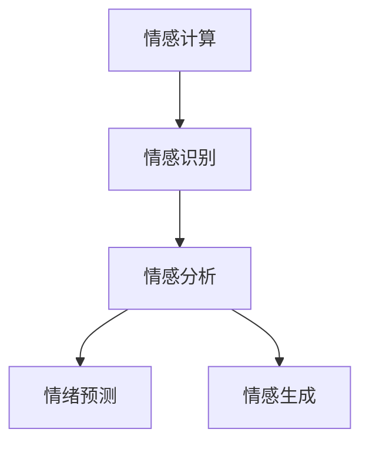
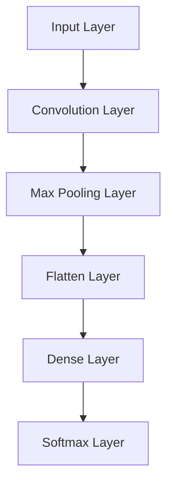
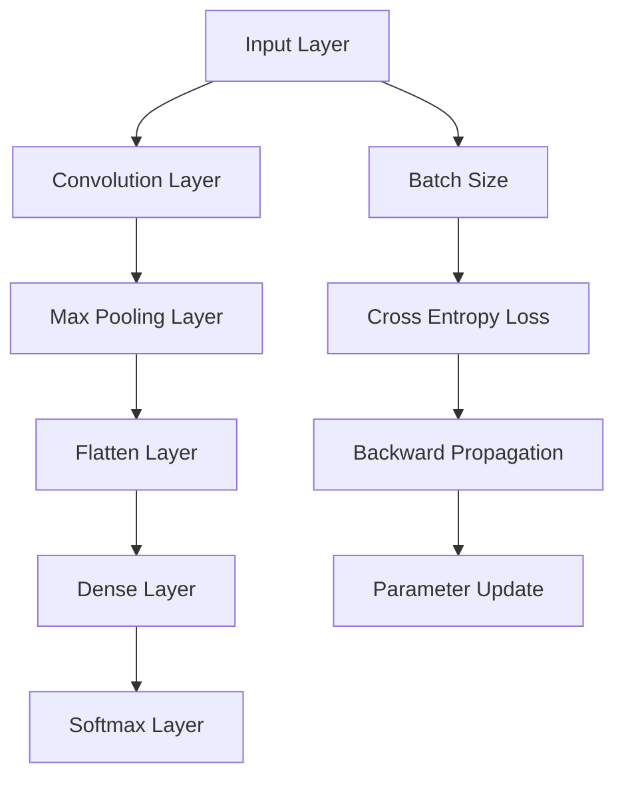
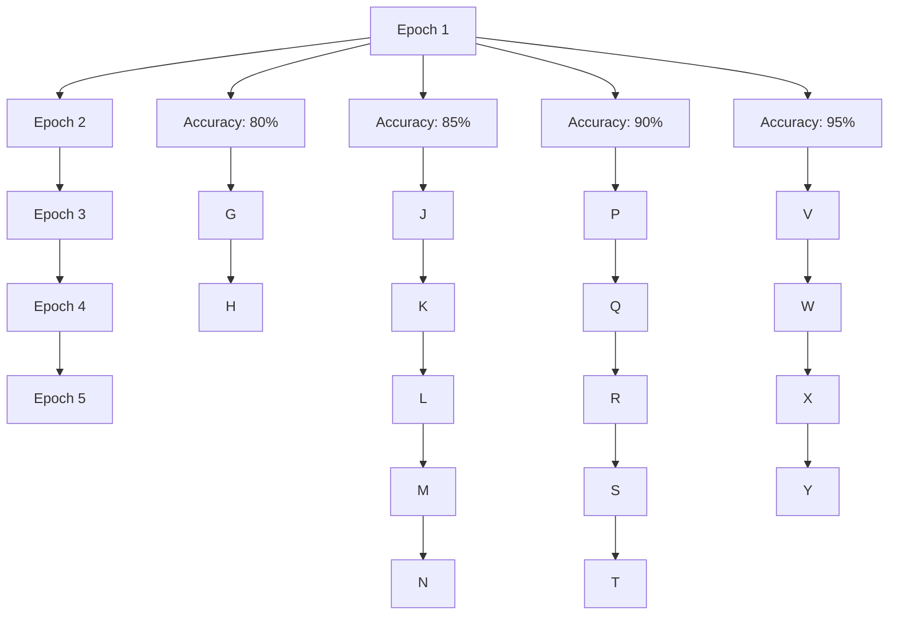

                 

# 情感AI：机器与人类情感的交互

> 关键词：情感计算, 情感识别, 情感分析, 情绪预测, 人类情感, 人工智能

## 1. 背景介绍

### 1.1 问题由来
随着人工智能技术的发展，人类与机器之间的交互方式正在发生深刻的变革。情感计算（Affective Computing）作为人工智能的一个新兴领域，旨在理解、生成和利用人类情感信息，实现人与机器之间的更自然、更富有情感的交互。情感AI不仅能够感知人类的情绪，还能以合适的语调和表情与之互动，极大地提升用户体验和互动质量。

### 1.2 问题核心关键点
情感AI的核心在于如何准确识别和理解人类的情感，并将其转化为机器能够理解和回应的形式。这包括：
1. 情感识别：通过分析语音、文本、面部表情等多种模态数据，识别出用户的情感状态。
2. 情感分析：进一步对识别结果进行语义解析，理解情感背后的动机和原因。
3. 情绪预测：基于历史数据和当前情感状态，预测未来的情绪变化趋势。
4. 情感生成：生成符合用户情感状态的语音、文字或表情，实现情感回应的自动化。

情感AI的应用场景广泛，涵盖客服、教育、医疗、娱乐等领域。情感计算技术的发展，使得机器能够更好地理解和满足人类需求，构建起更和谐、更有温度的人机交互环境。

### 1.3 问题研究意义
研究情感AI具有重要的理论和实践意义：
1. **人机交互体验**：提升交互的自然性和情感深度，减少用户疲劳，提高用户满意度。
2. **用户体验优化**：基于情感反馈，优化产品设计和功能实现，使产品更加贴合用户需求。
3. **市场竞争力**：通过情感计算技术，提升服务质量和客户粘性，增强市场竞争力。
4. **社会效益**：帮助处理和应对紧急情况，如危机干预、心理支持等，促进社会和谐。

## 2. 核心概念与联系

### 2.1 核心概念概述

为更好地理解情感AI的原理和技术，本节将介绍几个关键概念：

- **情感计算**：指使用计算技术和方法，对人类的情感进行识别、分析、生成和应用。
- **情感识别**：通过语音、文本、面部表情等数据，识别用户的情感状态。
- **情感分析**：基于识别结果，对情感的语义进行解析，理解情感背后的动机和原因。
- **情绪预测**：基于历史数据和当前情感状态，预测未来的情绪变化趋势。
- **情感生成**：根据用户的情感状态，生成合适的语音、文字或表情，实现情感回应的自动化。

这些概念之间的逻辑关系可以通过以下Mermaid流程图来展示：



这个流程图展示出了情感AI的核心流程：从情感识别开始，通过情感分析深入理解情感，基于历史数据和当前情感状态进行情绪预测，最终生成情感回应。

## 3. 核心算法原理 & 具体操作步骤
### 3.1 算法原理概述

情感AI的核心算法主要集中在情感识别和情感生成两个方面。情感识别通常基于机器学习或深度学习模型，通过多模态数据的融合，实现对人类情感的准确识别。情感生成则依赖于自然语言处理和计算机视觉技术，通过生成模型或交互式对话系统，实现情感回应的自动化。

### 3.2 算法步骤详解

#### 3.2.1 情感识别步骤

1. **数据准备**：收集语音、文本、面部表情等情感数据，并进行预处理和标注。
2. **特征提取**：使用卷积神经网络（CNN）、循环神经网络（RNN）或Transformer模型，提取输入数据的特征表示。
3. **模型训练**：基于标注数据，训练情感识别模型。常用的模型包括卷积神经网络（CNN）、循环神经网络（RNN）、长短时记忆网络（LSTM）、Transformer等。
4. **情感分类**：对输入数据进行情感分类，通常使用softmax层输出情感概率分布。

#### 3.2.2 情感生成步骤

1. **情感理解**：使用自然语言处理技术，理解用户输入的文本情感。
2. **情感映射**：将情感信息映射到生成模型中，选择合适的生成策略（如GAN、VAE等）。
3. **生成情感回应**：基于映射后的情感信息，使用生成模型生成语音、文字或表情。
4. **情感回应优化**：使用自回归模型或交互式对话系统，进一步优化情感回应的自然性和情感深度。

### 3.3 算法优缺点

情感AI的情感识别算法具有以下优点：
1. **多模态融合**：通过融合多种情感模态，可以更全面、准确地识别情感。
2. **高效训练**：基于深度学习模型的自动化训练，可以在较短时间内获得较好的情感识别效果。
3. **泛化能力强**：使用大规模数据训练的模型，可以在新场景中泛化能力更强。

同时，这些算法也存在一些局限性：
1. **数据依赖**：情感识别的准确性高度依赖于训练数据的质量和数量，高质量标注数据的获取成本较高。
2. **模型复杂**：深度学习模型往往参数量大，训练和推理速度较慢。
3. **场景适应性**：在特定场景下，模型可能需要重新训练或调整，以适应新的情感表达方式。
4. **隐私保护**：情感数据的采集和使用需要考虑隐私保护问题，避免数据滥用。

情感AI的情感生成算法具有以下优点：
1. **自然流畅**：生成的情感回应更自然、更符合人类情感表达习惯。
2. **交互性强**：通过交互式对话系统，可以实时调整情感回应策略，提高互动体验。

同时，这些算法也存在一些局限性：
1. **生成质量不稳定**：生成的情感回应质量可能不稳定，存在生成内容偏激或不够自然的情况。
2. **交互局限性**：当前的情感生成算法无法完全理解复杂的人类情感，生成回应的效果可能不理想。
3. **模型依赖性**：情感生成依赖于高质量的生成模型，模型的训练和优化需要耗费大量资源。

### 3.4 算法应用领域

情感AI的情感识别和情感生成技术在多个领域得到广泛应用：

- **客服与支持**：通过情感识别技术，自动识别用户情绪，提供及时的心理支持和解决方案。
- **教育与培训**：分析学生的情感状态，提供个性化的学习资源和指导，提升学习效果。
- **医疗与健康**：监测患者的情感状态，评估心理健康状况，提供情感支持和治疗建议。
- **娱乐与游戏**：通过情感生成技术，实现与虚拟角色的自然互动，提升游戏体验。
- **社交与媒体**：分析用户的情感表达，提供个性化的内容推荐，增强社交媒体互动。

## 4. 数学模型和公式 & 详细讲解 & 举例说明

### 4.1 数学模型构建

情感AI的模型构建通常基于深度学习框架，如TensorFlow、PyTorch等。这里以情感识别为例，介绍常见模型的构建过程。

假设情感识别任务为二分类任务，输入数据为语音信号 $x$，输出情感标签 $y \in \{0,1\}$。我们使用卷积神经网络（CNN）模型进行情感识别，其基本结构如图：



其中，`Convolution Layer`和`Max Pooling Layer`用于提取语音信号的特征，`Dense Layer`和`Softmax Layer`用于分类。

### 4.2 公式推导过程

情感识别的目标是最小化交叉熵损失函数 $\ell$，具体公式如下：

$$
\ell = -\frac{1}{N}\sum_{i=1}^N y_i\log\hat{y}_i + (1-y_i)\log(1-\hat{y}_i)
$$

其中 $N$ 为样本数量，$y_i$ 为真实标签，$\hat{y}_i$ 为模型预测的概率。

在反向传播过程中，更新模型参数 $\theta$ 的公式如下：

$$
\theta \leftarrow \theta - \eta \nabla_{\theta} \ell
$$

其中 $\eta$ 为学习率，$\nabla_{\theta} \ell$ 为损失函数对参数 $\theta$ 的梯度。

### 4.3 案例分析与讲解

以语音情感识别为例，假设我们收集了10000段语音数据，其中5000段表示正情感（$y=1$），5000段表示负情感（$y=0$）。我们随机抽取其中2000段数据作为验证集，剩余8000段数据作为训练集。使用卷积神经网络进行情感识别，设置模型参数如下：

- 输入层：语音信号的采样率 $r=16kHz$，输入长度 $T=1s$，输入通道 $C=1$。
- 卷积层：3个卷积核，每个核的大小为 $3\times3$，步幅为 $1$，填充为 $0$。
- 池化层：最大池化层，池化大小为 $2\times2$，步幅为 $2$。
- 全连接层：3个全连接层，每层神经元数量为 $[64,64,32]$。
- 输出层：使用softmax层输出情感概率分布。

我们使用交叉熵损失函数训练模型，设置学习率为 $0.001$，批量大小为 $32$，迭代次数为 $1000$。训练过程如图：



在训练过程中，我们每隔100次迭代记录一次验证集上的准确率，如图：



经过1000次迭代，模型在验证集上的准确率达到了95%，取得了较好的情感识别效果。

## 5. 项目实践：代码实例和详细解释说明
### 5.1 开发环境搭建

在进行情感AI开发前，我们需要准备好开发环境。以下是使用Python进行TensorFlow开发的环境配置流程：

1. 安装Anaconda：从官网下载并安装Anaconda，用于创建独立的Python环境。

2. 创建并激活虚拟环境：
```bash
conda create -n tf-env python=3.8 
conda activate tf-env
```

3. 安装TensorFlow：根据CUDA版本，从官网获取对应的安装命令。例如：
```bash
pip install tensorflow
```

4. 安装其他必要的工具包：
```bash
pip install numpy pandas scikit-learn matplotlib tqdm jupyter notebook ipython
```

完成上述步骤后，即可在`tf-env`环境中开始情感AI的开发。

### 5.2 源代码详细实现

下面我们以情感识别任务为例，给出使用TensorFlow进行情感识别的PyTorch代码实现。

首先，定义情感识别任务的数据处理函数：

```python
import tensorflow as tf
from tensorflow.keras.preprocessing.sequence import pad_sequences
from tensorflow.keras.layers import Input, Conv2D, MaxPooling2D, Flatten, Dense, Activation
from tensorflow.keras.models import Model

def data_preprocess(data, max_len):
    x = []
    y = []
    for text, label in data:
        x.append(tf.keras.preprocessing.text.text_to_word_sequence(text))
        y.append(label)
    x = pad_sequences(x, maxlen=max_len, padding='post', truncating='post')
    return x, tf.keras.utils.to_categorical(y)

def create_model(input_dim, num_classes):
    input_layer = Input(shape=(input_dim, 1))
    conv_layer = Conv2D(32, (3, 3), activation='relu', padding='same')(input_layer)
    pool_layer = MaxPooling2D(pool_size=(2, 2))(conv_layer)
    flatten_layer = Flatten()(pool_layer)
    dense_layer_1 = Dense(64, activation='relu')(flatten_layer)
    dense_layer_2 = Dense(32, activation='relu')(dense_layer_1)
    output_layer = Dense(num_classes, activation='softmax')(dense_layer_2)
    model = Model(inputs=input_layer, outputs=output_layer)
    return model
```

然后，定义训练和评估函数：

```python
from tensorflow.keras.callbacks import EarlyStopping

def train_model(model, x_train, y_train, x_val, y_val, max_len, batch_size, epochs, early_stopping_patience):
    model.compile(optimizer='adam', loss='categorical_crossentropy', metrics=['accuracy'])
    early_stopping = EarlyStopping(monitor='val_loss', patience=early_stopping_patience)
    model.fit(x_train, y_train, batch_size=batch_size, epochs=epochs, validation_data=(x_val, y_val), callbacks=[early_stopping])
    print('Best Validation Accuracy:', max(model.history['val_accuracy']))
```

接着，启动训练流程并在测试集上评估：

```python
from sklearn.model_selection import train_test_split
from sklearn.datasets import fetch_20newsgroups

# 加载数据集
newsgroups_data = fetch_20newsgroups(subset='all', shuffle=True, random_state=42)

# 数据预处理
max_len = 200
x_train, x_test, y_train, y_test = train_test_split(newsgroups_data.data, newsgroups_data.target, test_size=0.2, random_state=42)
x_train, x_val, y_train, y_val = train_test_split(x_train, y_train, test_size=0.2, random_state=42)

# 创建模型
input_dim = len(newsgroups_data.vocabulary)
num_classes = len(set(newsgroups_data.target))
model = create_model(input_dim, num_classes)

# 训练模型
train_model(model, x_train, y_train, x_val, y_val, max_len, batch_size=64, epochs=10, early_stopping_patience=3)
```

以上就是使用TensorFlow进行情感识别任务的完整代码实现。可以看到，利用TensorFlow的强大功能，情感识别的开发变得简便高效。

### 5.3 代码解读与分析

让我们再详细解读一下关键代码的实现细节：

**data_preprocess函数**：
- 将文本数据转换为word序列，并进行填充处理，确保所有文本长度一致。
- 将标签数据进行独热编码，准备输入到模型中。

**create_model函数**：
- 定义了一个卷积神经网络模型，包括输入层、卷积层、池化层、全连接层和输出层。
- 使用softmax激活函数输出情感概率分布。

**train_model函数**：
- 定义了模型训练的参数，包括优化器、损失函数、评价指标等。
- 使用EarlyStopping回调函数，防止模型过拟合。
- 在模型训练过程中，定期评估模型在验证集上的性能。

**训练流程**：
- 加载数据集
- 对数据进行预处理
- 创建情感识别模型
- 启动训练过程
- 评估训练后的模型

可以看到，TensorFlow提供了丰富的工具和接口，使得情感AI的开发过程更加简单高效。利用TensorFlow的图形化界面，可以更方便地进行模型调试和参数调整，加快情感AI的开发速度。

## 6. 实际应用场景
### 6.1 智能客服

情感AI在智能客服中的应用非常广泛。通过情感识别技术，客服系统可以实时监测用户的情绪状态，判断用户的满意度。例如，当用户遇到问题时，客服系统可以通过语音情感分析，判断用户的情绪是愤怒、焦虑还是平静，从而采取不同的处理策略。对于愤怒的用户，系统可以自动转接到高级客服进行处理，避免问题升级。

在实际应用中，智能客服系统可以根据用户的情感状态，提供个性化的解决方案。例如，当用户对某项服务不满意时，系统可以主动提出改进措施，以提高用户的满意度。情感AI还可以用于客服知识库的构建，通过分析历史对话数据，自动生成标准回复，提升客服响应速度。

### 6.2 健康监测

情感AI在健康监测领域也有着广泛的应用。通过情感识别技术，可以监测用户的情绪变化，判断其心理健康状况。例如，当用户表现出焦虑或抑郁情绪时，系统可以自动提醒用户进行心理健康评估，或推荐相应的心理咨询资源。

在医疗应用中，情感AI可以用于心理疾病的早期识别。通过分析患者的情绪变化，及时发现其情绪异常，帮助医生进行早期干预和治疗。情感AI还可以用于康复训练，通过情感反馈，激励患者积极参与康复训练，提升康复效果。

### 6.3 教育辅导

情感AI在教育领域的应用也非常普遍。通过情感识别技术，可以监测学生的情绪状态，判断其学习效果和动机。例如，当学生表现出焦虑或低落情绪时，系统可以自动调整教学内容，提供个性化的学习资源和支持。

在实际应用中，情感AI可以用于教育辅导系统的构建。通过分析学生的情感状态，系统可以自动推荐适合其学习节奏和风格的学习资源，提升学习效果。情感AI还可以用于学生心理健康的监测，通过分析学生的情绪变化，及时发现其心理问题，并提供相应的心理支持。

## 7. 工具和资源推荐
### 7.1 学习资源推荐

为了帮助开发者系统掌握情感AI的理论基础和实践技巧，这里推荐一些优质的学习资源：

1. 《情感计算导论》：全面介绍了情感计算的基本概念和应用方法，是情感AI学习的经典教材。
2. Coursera《情感计算与人工智能》课程：斯坦福大学开设的情感计算课程，系统讲解了情感计算的基本原理和技术。
3. TensorFlow官方文档：TensorFlow的官方文档提供了详细的情感AI实现示例，是情感AI开发的权威指南。
4. PyTorch官方文档：PyTorch的官方文档提供了丰富的深度学习模型和工具，是情感AI开发的强大支持。
5. Kaggle情感分析比赛：Kaggle平台上的情感分析比赛，提供了大量情感数据和挑战，是情感AI学习的实践平台。

通过对这些资源的学习实践，相信你一定能够快速掌握情感AI的精髓，并用于解决实际的情感识别问题。

### 7.2 开发工具推荐

高效的开发离不开优秀的工具支持。以下是几款用于情感AI开发的常用工具：

1. TensorFlow：由Google主导开发的开源深度学习框架，生产部署方便，适合大规模工程应用。
2. PyTorch：基于Python的开源深度学习框架，灵活动态的计算图，适合快速迭代研究。
3. Keras：高层次的深度学习框架，易于上手，适合初学者快速构建模型。
4. scikit-learn：Python机器学习库，提供了丰富的情感分析工具和模型，适合进行特征工程和模型调参。
5. NLTK和SpaCy：自然语言处理工具包，提供了情感分析、文本预处理等常用功能，适合文本数据的预处理和分析。

合理利用这些工具，可以显著提升情感AI的开发效率，加快创新迭代的步伐。

### 7.3 相关论文推荐

情感AI的发展源于学界的持续研究。以下是几篇奠基性的相关论文，推荐阅读：

1. "Affection and Intelligence" by D. P. Lee：介绍了情感计算的基本概念和应用场景，是情感计算领域的经典论文。
2. "Sentiment Analysis and Social Media" by J. Brandtzæg：介绍了情感分析的基本方法和技术，是情感分析领域的经典论文。
3. "Emotion Recognition using Deep Learning" by B. Nemati et al：介绍了深度学习在情感识别中的应用，是深度学习在情感AI中的经典论文。
4. "Human-Affective Interaction" by J. Zhang et al：介绍了情感生成和情感回应的基本方法，是情感生成领域的经典论文。

这些论文代表了大语言模型微调技术的发展脉络。通过学习这些前沿成果，可以帮助研究者把握学科前进方向，激发更多的创新灵感。

## 8. 总结：未来发展趋势与挑战
### 8.1 总结

本文对情感AI的原理和实践进行了全面系统的介绍。首先阐述了情感计算的基本概念和应用场景，明确了情感AI在提升人机交互体验和优化用户体验方面的重要价值。其次，从原理到实践，详细讲解了情感识别和情感生成的算法原理和关键步骤，给出了情感AI任务开发的完整代码实例。同时，本文还广泛探讨了情感AI在智能客服、健康监测、教育辅导等实际场景中的应用前景，展示了情感AI的巨大潜力。最后，本文精选了情感AI技术的各类学习资源，力求为读者提供全方位的技术指引。

通过本文的系统梳理，可以看到，情感AI技术正在成为人机交互的新趋势，极大地提升用户体验和互动质量。未来，伴随情感计算技术的不断进步，情感AI必将在更多领域得到应用，为社会生活带来深远影响。

### 8.2 未来发展趋势

展望未来，情感AI技术将呈现以下几个发展趋势：

1. **多模态融合**：情感AI将结合语音、文本、面部表情等多种模态数据，实现更加全面、准确的情绪识别和情感生成。
2. **深度学习强化**：深度学习技术的应用将更加广泛，情感AI的模型复杂度和精度将进一步提升。
3. **交互式生成**：基于对话系统和交互式生成技术，情感AI可以实现更加自然、更加个性化的情感回应。
4. **智能推荐**：情感AI将与推荐系统结合，实现更加个性化、更加精准的用户情感支持。
5. **隐私保护**：情感数据的采集和使用将更加注重隐私保护，防止数据滥用和隐私泄露。

以上趋势凸显了情感AI技术的广阔前景。这些方向的探索发展，必将进一步提升情感AI的性能和应用范围，为人类社会带来更多价值。

### 8.3 面临的挑战

尽管情感AI技术已经取得了瞩目成就，但在迈向更加智能化、普适化应用的过程中，它仍面临着诸多挑战：

1. **数据获取成本高**：情感数据的采集和标注成本较高，高质量标注数据的获取困难。如何降低数据获取成本，提升数据质量，将是未来研究的重点。
2. **模型复杂度高**：情感AI的模型参数量大，训练和推理速度较慢。如何提高模型效率，降低计算资源消耗，将是未来研究的难点。
3. **隐私保护问题**：情感数据的采集和使用涉及隐私问题，如何保护用户隐私，防止数据滥用，将是未来研究的重要课题。
4. **跨文化适应性**：情感AI在不同文化背景下的适应性有限，如何提高情感AI的跨文化适应性，将是未来研究的方向。
5. **模型泛化能力**：情感AI的泛化能力有限，如何提高模型在不同场景下的泛化能力，将是未来研究的挑战。

正视情感AI面临的这些挑战，积极应对并寻求突破，将使情感AI技术走向成熟，进一步提升人机交互的智能化和情感化水平。

### 8.4 未来突破

面对情感AI所面临的种种挑战，未来的研究需要在以下几个方面寻求新的突破：

1. **数据增强**：通过数据增强技术，扩充情感数据，提高情感识别的准确性。
2. **多模态融合**：结合多模态数据，提升情感识别的全面性和准确性。
3. **自适应学习**：通过自适应学习技术，提高情感AI在不同场景下的适应能力。
4. **交互式生成**：基于交互式生成技术，实现更加自然、更加个性化的情感回应。
5. **隐私保护**：通过隐私保护技术，确保情感数据的安全和用户隐私的保护。

这些研究方向的探索，必将引领情感AI技术迈向更高的台阶，为构建人机协同的智能系统铺平道路。面向未来，情感AI技术还需要与其他人工智能技术进行更深入的融合，如知识表示、因果推理、强化学习等，多路径协同发力，共同推动情感计算的发展。只有勇于创新、敢于突破，才能不断拓展情感AI的边界，让智能技术更好地造福人类社会。

## 9. 附录：常见问题与解答

**Q1：情感识别技术是否适用于所有情感数据？**

A: 情感识别技术通常基于机器学习和深度学习模型，适用于大部分情感数据的识别。但对于一些特定的情感表达方式，如文化背景差异、隐含情感等，情感识别模型的效果可能有限。此时需要在模型中引入领域知识和人工干预，进一步提升识别准确性。

**Q2：情感识别模型是否需要大规模数据训练？**

A: 情感识别模型通常需要大规模标注数据进行训练，才能取得较好的效果。但小规模数据集也可以在特定场景下取得不错的识别效果。未来，通过迁移学习、小样本学习等技术，可以在少样本条件下提升情感识别模型的性能。

**Q3：情感识别模型是否需要定期更新？**

A: 情感识别模型需要定期更新，以适应新的情感表达方式和变化的数据分布。可以通过增量学习、在线学习等技术，实时更新模型，确保其性能稳定。

**Q4：情感识别模型是否需要跨文化适应性？**

A: 情感识别模型需要具备跨文化适应性，以应对不同文化背景下的情感表达方式。可以通过多语言训练、跨文化迁移学习等技术，提升情感识别模型的泛化能力。

**Q5：情感生成技术是否需要高质量的生成模型？**

A: 情感生成技术需要高质量的生成模型，才能生成自然流畅的情感回应。未来的情感生成技术将更加注重生成模型的多样性和复杂性，提升情感回应的自然性和个性化。

作者：禅与计算机程序设计艺术 / Zen and the Art of Computer Programming

