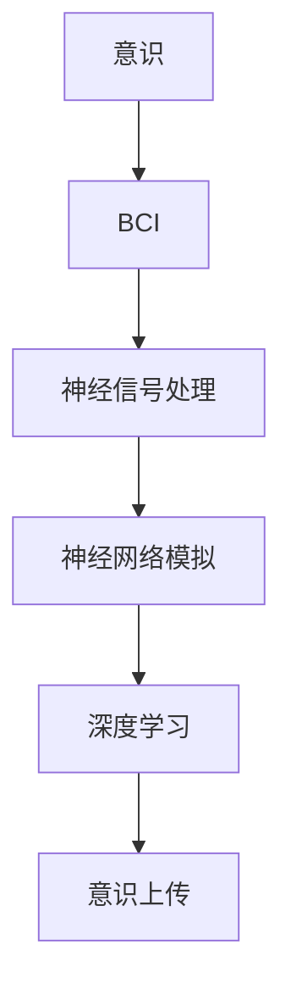

                 

# 意识上传：AI时代的永生幻想

## 1. 背景介绍

### 1.1 问题由来

随着科技的迅猛发展，人工智能（AI）已经在众多领域展示了其强大的潜力。从语音识别、图像处理到自动驾驶、医疗诊断，AI技术正在逐步改变人们的生活方式。然而，这些技术还远远未能触及到人类最核心、最神秘的领域——意识。意识的本质是什么？我们能否上传意识？这些思考涉及哲学、神经科学、计算机科学等多个学科，引发了广泛的讨论和研究。

近年来，随着脑机接口（Brain-Computer Interface, BCI）技术的进步，科学家们已经能够实现对人类大脑信号的初步解读和控制。例如，通过头皮电极、植入式电极等方式，研究人员已经能够从大脑中捕捉到较为精细的神经活动信号，并实现简单的手势识别、打字等功能。这些成果为意识上传提供了技术基础，让人们开始思考是否可以将人类的意识“数字化”，实现某种形式的“永生”。

### 1.2 问题核心关键点

意识上传的核心问题包括以下几个方面：

- **意识本质**：意识的本质是什么？它是由神经元的活动、化学物质的变化还是某种高级认知功能所驱动？
- **数据采集**：如何准确、高效地采集大脑信号，避免神经活动噪声的影响？
- **数据处理**：如何对采集到的神经数据进行处理，提取出代表意识的关键信息？
- **数据存储**：如何存储这些海量的神经数据，保证其完整性和可读性？
- **数据恢复**：如何将存储的数据重新转换为意识，实现意识上传？
- **伦理道德**：意识上传涉及许多伦理和道德问题，例如隐私保护、人格延续、意识自由等。

本文将重点讨论意识上传的核心技术和伦理问题，探讨其在AI时代的可能性与挑战。

## 2. 核心概念与联系

### 2.1 核心概念概述

为了深入理解意识上传，我们需要首先了解一些相关的核心概念：

- **意识**：人类对周围环境、自我和内在状态的感知、认知和情感体验的总和。
- **脑机接口（BCI）**：通过外部设备记录和解读大脑信号，实现对神经系统的直接控制的技术。
- **神经信号处理**：对大脑采集到的神经信号进行处理，提取出有用的信息，如神经元放电频率、相位同步性等。
- **神经网络模拟**：利用人工神经网络模拟大脑的神经元活动，试图重现意识过程。
- **深度学习**：一种强大的机器学习技术，通过多层神经网络的学习，能够从原始数据中提取高级特征。
- **意识上传**：将人类的意识“数字化”并存储在计算机或其他媒介中，在需要时能够重新恢复的技术。

这些概念之间的关系可以通过以下Mermaid流程图来展示：



这个流程图展示了从意识的采集、处理、模拟到上传的过程，各个环节紧密联系，共同构成了意识上传的完整流程。

## 3. 核心算法原理 & 具体操作步骤
### 3.1 算法原理概述

意识上传的核心算法原理可以分为以下几个步骤：

1. **数据采集**：使用脑机接口技术，如头皮电极、植入式电极等，采集大脑信号。
2. **神经信号处理**：通过信号预处理、特征提取等技术，从采集到的信号中提取有用的信息，如神经元放电频率、相位同步性等。
3. **神经网络模拟**：利用深度学习等技术，建立神经网络模型，模拟大脑的神经元活动，尝试重现意识的生成和表现。
4. **意识上传**：将处理后的神经信号数据存储在计算机或其他媒介中，以便在未来需要时重新恢复。

### 3.2 算法步骤详解

#### 3.2.1 数据采集

数据采集是意识上传的第一步。脑机接口技术的发展使得从大脑中捕捉信号成为可能。以下是一些常见的数据采集方法：

- **头皮电极**：将非侵入式电极放置在头皮上，通过捕捉头皮表面电位来解读大脑信号。
- **植入式电极**：将电极植入到大脑内部，直接记录神经元的电活动。
- **磁共振成像（MRI）**：通过捕捉大脑的磁场变化，间接推断神经活动。
- **脑电图（EEG）**：记录头皮表面的电活动，用于分析神经信号。

#### 3.2.2 神经信号处理

采集到的神经信号通常包含大量的噪声和冗余信息，需要进行预处理和特征提取，以提取出有用的信息。以下是一些常见的处理技术：

- **信号预处理**：包括去噪、滤波、归一化等操作，去除无关信号。
- **特征提取**：通过时频分析、小波变换等技术，提取出代表意识的关键特征。
- **模式识别**：使用机器学习算法，如支持向量机（SVM）、卷积神经网络（CNN）等，对特征进行分类和识别。

#### 3.2.3 神经网络模拟

神经网络模拟是通过人工神经网络重现大脑的神经元活动，试图理解意识的生成过程。以下是一些常见的神经网络模型：

- **递归神经网络（RNN）**：能够处理序列数据，模拟大脑中的时间依赖性。
- **卷积神经网络（CNN）**：用于图像和语音处理，能够捕捉局部特征。
- **深度信念网络（DBN）**：一种生成模型，能够学习数据的概率分布。

#### 3.2.4 意识上传

意识上传的最终目的是将处理后的神经信号数据存储在计算机或其他媒介中，以便在未来需要时重新恢复。以下是一些常见的数据存储技术：

- **硬盘存储**：传统的机械硬盘或固态硬盘，用于长期存储大量数据。
- **云存储**：利用云服务提供商的存储空间，实现数据的分布式存储。
- **量子存储**：利用量子比特（qubit）实现超高密度的数据存储。
- **脑机接口数据中心**：专门存储和管理脑机接口数据的数据中心，提供实时访问和分析服务。

### 3.3 算法优缺点

意识上传技术具有以下优点：

- **实现意识数字化**：通过脑机接口和神经信号处理，可以将人类的意识数字化，实现某种形式的“永生”。
- **科研价值**：意识上传技术为神经科学和脑机接口研究提供了新的数据来源和研究方向。
- **医疗应用**：意识上传技术可以为神经系统疾病、脑损伤等提供新的治疗方法，帮助恢复患者的功能。

但同时也存在一些缺点：

- **技术复杂性**：意识上传技术涉及多学科的交叉，技术难度高，实施复杂。
- **伦理道德问题**：意识上传涉及到隐私保护、人格延续、意识自由等问题，引发广泛的伦理道德讨论。
- **数据安全性**：存储的神经数据可能被黑客攻击、数据泄露等安全问题威胁。
- **数据完整性**：长时间的存储可能导致数据质量下降，影响恢复的准确性。

### 3.4 算法应用领域

意识上传技术虽然目前还在探索阶段，但其应用前景广泛，涉及多个领域：

- **医疗**：通过意识上传技术，可以为神经系统疾病患者提供新的治疗方法，帮助恢复记忆和功能。
- **心理学**：意识上传技术可以为心理治疗提供新的手段，帮助患者进行心理调节和康复。
- **教育**：通过意识上传技术，可以为学习者提供更加个性化的学习体验，提高学习效果。
- **娱乐**：意识上传技术可以为虚拟现实、游戏等领域提供新的体验，创造出全新的娱乐方式。
- **科研**：意识上传技术可以为神经科学研究提供新的数据来源，推动认知科学的进步。

## 4. 数学模型和公式 & 详细讲解 & 举例说明

### 4.1 数学模型构建

意识上传的数学模型可以从神经信号处理和神经网络模拟两个方面来构建。以下是一些常见的数学模型：

- **神经元模型**：用于描述单个神经元的活动和状态。
- **神经网络模型**：用于模拟大脑的神经网络结构，如多层感知器（MLP）、卷积神经网络（CNN）等。
- **深度学习模型**：用于处理复杂的数据，如卷积神经网络（CNN）、循环神经网络（RNN）等。

### 4.2 公式推导过程

#### 4.2.1 神经元模型

神经元模型是描述单个神经元活动的基本模型。神经元接受来自其他神经元的输入信号，通过激活函数（如sigmoid函数）处理后，输出到下一层神经元。以下是神经元模型的公式：

$$
y = f(w \cdot x + b)
$$

其中 $y$ 为输出，$x$ 为输入，$w$ 为权重，$b$ 为偏置，$f$ 为激活函数。

#### 4.2.2 神经网络模型

神经网络模型由多个神经元组成，通过连接权重的调整，实现复杂的数据处理。以下是卷积神经网络（CNN）的基本公式：

$$
y = \max(\sigma(\sum_{i=1}^{C}w_i \cdot f(x_i) + b))
$$

其中 $y$ 为输出，$\sigma$ 为激活函数，$w_i$ 为权重，$x_i$ 为输入，$C$ 为输出通道数。

#### 4.2.3 深度学习模型

深度学习模型通过多层神经元的叠加，实现对复杂数据的高级处理。以下是深度信念网络（DBN）的公式：

$$
p(y|x) = \prod_{t=1}^{T}p(y_t|y_{t-1},x)
$$

其中 $p(y|x)$ 为输出概率，$T$ 为时间步数，$y_t$ 为时间步 $t$ 的输出，$y_{t-1}$ 为时间步 $t-1$ 的输出。

### 4.3 案例分析与讲解

#### 4.3.1 脑机接口信号处理

脑机接口信号处理是意识上传的重要组成部分。以下是一个简单的脑电图（EEG）信号处理案例：

1. **信号采集**：通过头皮电极采集脑电信号。
2. **信号预处理**：去除噪声，归一化信号。
3. **特征提取**：使用小波变换提取时频特征。
4. **模式识别**：使用支持向量机（SVM）进行分类识别。

#### 4.3.2 神经网络模拟

神经网络模拟是意识上传的核心技术。以下是一个简单的深度信念网络（DBN）模拟案例：

1. **数据输入**：将采集到的脑电信号作为输入。
2. **网络训练**：通过无监督学习训练DBN模型，学习数据分布。
3. **数据生成**：使用训练好的DBN模型生成新的脑电信号，模拟意识过程。

## 5. 项目实践：代码实例和详细解释说明

### 5.1 开发环境搭建

在开发意识上传项目前，我们需要准备好开发环境。以下是使用Python进行TensorFlow开发的环境配置流程：

1. 安装Anaconda：从官网下载并安装Anaconda，用于创建独立的Python环境。

2. 创建并激活虚拟环境：
```bash
conda create -n tf-env python=3.8 
conda activate tf-env
```

3. 安装TensorFlow：根据CUDA版本，从官网获取对应的安装命令。例如：
```bash
conda install tensorflow==2.6
```

4. 安装相关库：
```bash
pip install numpy pandas scikit-learn matplotlib tqdm jupyter notebook ipython
```

完成上述步骤后，即可在`tf-env`环境中开始项目开发。

### 5.2 源代码详细实现

下面我们以神经网络模拟为例，给出使用TensorFlow实现深度信念网络（DBN）的代码实现。

```python
import tensorflow as tf
import numpy as np

# 定义深度信念网络模型
class DBN(tf.keras.Model):
    def __init__(self, input_dim, hidden_dim, output_dim):
        super(DBN, self).__init__()
        self.encoder = tf.keras.Sequential([
            tf.keras.layers.Dense(hidden_dim, activation='sigmoid', input_shape=(input_dim,)),
            tf.keras.layers.Dense(hidden_dim, activation='sigmoid')
        ])
        self.decoder = tf.keras.Sequential([
            tf.keras.layers.Dense(output_dim, activation='sigmoid')
        ])

    def call(self, x):
        hidden = self.encoder(x)
        output = self.decoder(hidden)
        return output

# 训练深度信念网络
def train_dbn(data, epochs=100, batch_size=32):
    model = DBN(input_dim=100, hidden_dim=128, output_dim=100)
    optimizer = tf.keras.optimizers.Adam(learning_rate=0.01)

    # 数据预处理
    x_train, y_train = data[:, :100], data[:, 100:]

    # 模型训练
    for epoch in range(epochs):
        for i in range(0, len(x_train), batch_size):
            x_batch = x_train[i:i+batch_size]
            y_batch = y_train[i:i+batch_size]

            with tf.GradientTape() as tape:
                y_pred = model(x_batch)
                loss = tf.keras.losses.mse(y_batch, y_pred)

            gradients = tape.gradient(loss, model.trainable_variables)
            optimizer.apply_gradients(zip(gradients, model.trainable_variables))

    return model
```

以上就是使用TensorFlow实现深度信念网络（DBN）的完整代码实现。可以看到，利用TensorFlow的高级API，神经网络模型的定义和训练变得简洁高效。

### 5.3 代码解读与分析

让我们再详细解读一下关键代码的实现细节：

**DBN类**：
- `__init__`方法：定义神经网络的编码器和解码器，使用sigmoid激活函数。
- `call`方法：定义前向传播过程，通过编码器生成隐层特征，再通过解码器生成输出。

**train_dbn函数**：
- 使用TensorFlow的高级API定义深度信念网络模型。
- 定义训练过程中的优化器、损失函数等关键组件。
- 使用小批量梯度下降策略，逐步更新模型参数。

**训练流程**：
- 定义训练的轮数和批次大小。
- 循环迭代训练数据，每次训练一个批次。
- 计算损失，反向传播更新模型参数。
- 重复上述过程直至收敛。

## 6. 实际应用场景

### 6.1 医疗康复

意识上传技术在医疗领域具有广阔的应用前景。通过意识上传，可以为神经系统疾病患者提供新的治疗手段，帮助恢复记忆和功能。例如，对于阿尔茨海默病（AD）等认知障碍患者，意识上传技术可以通过记录和重现其大脑活动，辅助医生进行精确诊断和治疗。

具体而言，可以采集患者在特定任务下的脑电信号，通过深度学习等技术提取关键特征，建立神经网络模型。将训练好的模型应用于其他患者的数据，可以预测患者的认知状态，指导医生的诊断和治疗。此外，意识上传技术还可以用于康复训练，帮助患者逐步恢复记忆和功能。

### 6.2 心理健康

意识上传技术在心理健康领域也具有重要应用。通过意识上传，可以为心理治疗提供新的手段，帮助患者进行心理调节和康复。例如，对于抑郁症等心理疾病患者，意识上传技术可以通过记录和重现其大脑活动，分析其情绪变化规律，提供个性化的心理辅导和治疗方案。

具体而言，可以采集患者在不同情绪状态下的脑电信号，通过深度学习等技术提取情绪特征，建立神经网络模型。将训练好的模型应用于其他患者的数据，可以预测患者的情绪状态，指导心理医生的治疗方案。此外，意识上传技术还可以用于心理评估，帮助心理医生更准确地评估患者心理健康状态。

### 6.3 教育和培训

意识上传技术在教育领域也具有重要应用。通过意识上传，可以为学习者提供更加个性化的学习体验，提高学习效果。例如，对于远程教育，意识上传技术可以通过记录和重现学生的大脑活动，分析其学习状态和认知规律，提供个性化的学习方案。

具体而言，可以采集学生在在线学习过程中的脑电信号，通过深度学习等技术提取学习特征，建立神经网络模型。将训练好的模型应用于其他学生的数据，可以预测学生的学习状态，指导教师的教学方案。此外，意识上传技术还可以用于学习评估，帮助教师更准确地评估学生学习效果。

## 7. 工具和资源推荐

### 7.1 学习资源推荐

为了帮助开发者系统掌握意识上传的理论基础和实践技巧，这里推荐一些优质的学习资源：

1. **《深度学习》系列书籍**：由深度学习领域权威专家撰写，系统介绍了深度学习的基本概念和经典模型，是入门深度学习的必备资料。

2. **Coursera《深度学习专项课程》**：斯坦福大学开设的深度学习课程，涵盖从基础到高级的多个主题，提供了丰富的实验和案例。

3. **arXiv上的最新论文**：arXiv是一个开放的学术论文库，涵盖了深度学习、神经科学、脑机接口等领域的最新研究成果，是跟踪前沿技术的最佳途径。

4. **NIPS和ICML会议论文集**：NIPS和ICML是神经科学和机器学习领域的顶级会议，每年发布的论文代表了当前领域的研究前沿，是了解最新技术的重要渠道。

5. **Github上的开源项目**：Github上汇聚了大量的开源项目和代码，包括脑机接口技术、深度学习模型等，是学习和参考的最佳资源。

通过对这些资源的学习实践，相信你一定能够快速掌握意识上传技术的精髓，并用于解决实际的NLP问题。

### 7.2 开发工具推荐

高效的开发离不开优秀的工具支持。以下是几款用于意识上传开发的常用工具：

1. **TensorFlow**：由Google主导开发的开源深度学习框架，功能丰富，支持GPU加速，适合大规模工程应用。

2. **Keras**：基于TensorFlow的高层API，提供了简洁易用的接口，适合快速迭代研究。

3. **PyTorch**：由Facebook主导开发的深度学习框架，支持动态计算图，适合灵活的模型设计和调试。

4. **Python Jupyter Notebook**：一种轻量级的交互式开发环境，支持代码执行、数据可视化等功能，适合快速原型开发。

5. **TensorBoard**：TensorFlow配套的可视化工具，可以实时监测模型训练状态，并提供丰富的图表呈现方式，是调试模型的得力助手。

合理利用这些工具，可以显著提升意识上传任务的开发效率，加快创新迭代的步伐。

### 7.3 相关论文推荐

意识上传技术的发展源于学界的持续研究。以下是几篇奠基性的相关论文，推荐阅读：

1. **《A Survey on Brain-Computer Interface Systems for Consciousness Transfer》**：总结了意识上传技术的最新进展和未来发展方向，是了解该领域的权威综述。

2. **《Cognitive Science of Consciousness》**：由神经科学家、心理学家和计算机科学家共同撰写，探讨了意识的本质和机制，为意识上传技术提供了理论基础。

3. **《Deep Learning for Brain-Computer Interface》**：探讨了深度学习技术在脑机接口中的应用，展示了其在小样本数据上的强大潜力。

4. **《Consciousness Upload: A Deep Learning Approach》**：介绍了一种基于深度学习的意识上传方法，展示了其在脑电信号处理和神经网络模拟方面的最新进展。

这些论文代表了大语言模型微调技术的发展脉络。通过学习这些前沿成果，可以帮助研究者把握学科前进方向，激发更多的创新灵感。

## 8. 总结：未来发展趋势与挑战

### 8.1 研究成果总结

本文对意识上传技术进行了全面系统的介绍，重点讨论了其核心技术和伦理问题。通过系统梳理，可以看到意识上传技术在AI时代具有广阔的应用前景，但也面临诸多挑战。

### 8.2 未来发展趋势

展望未来，意识上传技术将呈现以下几个发展趋势：

1. **技术进步**：随着脑机接口技术的进步，数据采集的精度和效率将显著提高。同时，深度学习等技术的发展也将为意识上传提供更强大的支持。

2. **跨学科融合**：意识上传技术将更多地与神经科学、心理学、伦理学等领域结合，推动跨学科研究。

3. **应用拓展**：意识上传技术将在医疗、心理健康、教育等领域得到广泛应用，为人类生活带来更多便利和帮助。

4. **伦理规范**：随着意识上传技术的不断发展，相关伦理规范将逐渐建立，引导技术的健康发展。

### 8.3 面临的挑战

尽管意识上传技术已经取得了一定进展，但在实现过程中仍面临许多挑战：

1. **技术复杂性**：意识上传技术涉及多学科的交叉，技术难度高，实施复杂。

2. **伦理道德问题**：意识上传技术涉及隐私保护、人格延续、意识自由等问题，引发广泛的伦理道德讨论。

3. **数据安全性**：存储的神经数据可能被黑客攻击、数据泄露等安全问题威胁。

4. **数据完整性**：长时间的存储可能导致数据质量下降，影响恢复的准确性。

### 8.4 研究展望

面对意识上传面临的挑战，未来的研究需要在以下几个方面寻求新的突破：

1. **多模态数据融合**：将视觉、听觉、触觉等多种模态数据融合，提升意识上传的准确性和鲁棒性。

2. **自适应学习**：开发自适应学习算法，根据不同患者的个体差异，定制个性化的意识上传方案。

3. **透明性和可解释性**：增强意识上传过程的透明性和可解释性，便于医生和患者理解和信任。

4. **伦理和法律框架**：建立完善的伦理和法律框架，确保意识上传技术的合理应用和数据安全。

这些研究方向的探索，必将引领意识上传技术迈向更高的台阶，为人类认知智能的进化带来深远影响。面向未来，意识上传技术还需要与其他人工智能技术进行更深入的融合，如知识表示、因果推理、强化学习等，多路径协同发力，共同推动人工智能技术的发展。只有勇于创新、敢于突破，才能不断拓展意识上传技术的边界，让智能技术更好地造福人类社会。

## 9. 附录：常见问题与解答

**Q1：意识上传是否可能实现？**

A: 目前，意识上传技术还在探索阶段，实现难度极高。尽管有许多科学家和研究机构在积极探索，但还未有实质性的突破。未来的技术进步和社会共识可能会改变这一现状，但短期内意识上传的实现仍面临诸多挑战。

**Q2：意识上传技术涉及哪些伦理问题？**

A: 意识上传技术涉及诸多伦理问题，包括隐私保护、人格延续、意识自由等。如何保护用户的隐私，避免其意识被滥用；如何确保上传意识的主权，防止其被强制上传；如何在上传意识的过程中，保持用户的意识自由，避免其被剥夺。这些都是亟待解决的重要伦理问题。

**Q3：意识上传技术对医疗和心理健康有何影响？**

A: 意识上传技术可以为神经系统疾病患者提供新的治疗手段，帮助恢复记忆和功能，从而提高医疗效果和患者生活质量。同时，意识上传技术还可以为心理治疗提供新的手段，帮助患者进行心理调节和康复，提高心理健康水平。

**Q4：意识上传技术在实际应用中存在哪些技术挑战？**

A: 意识上传技术在实际应用中存在许多技术挑战，包括数据采集的精度和效率、深度学习模型的训练复杂性、数据存储的安全性等。如何提高数据采集的精度和效率，减少神经数据噪声的影响；如何设计高效的深度学习模型，实现对复杂数据的高级处理；如何保护存储的神经数据，防止数据泄露和攻击。这些都是需要解决的关键技术问题。

**Q5：意识上传技术的未来发展方向有哪些？**

A: 意识上传技术的未来发展方向包括技术进步、跨学科融合、应用拓展、伦理规范等。如何通过技术进步提升意识上传的精度和效率；如何将意识上传技术与其他学科结合，推动跨学科研究；如何在医疗、心理健康等领域推广应用意识上传技术；如何建立完善的伦理和法律框架，确保技术合理应用。这些方向都将引领意识上传技术的发展方向。

作者：禅与计算机程序设计艺术 / Zen and the Art of Computer Programming

