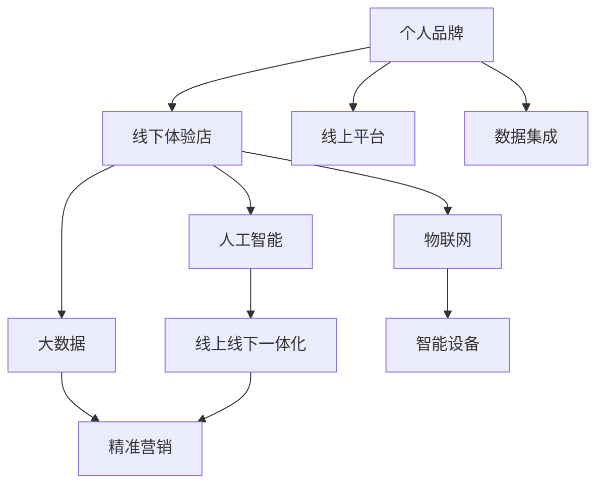

                 

# 打造个人品牌线下体验店：实现线上线下结合

## 1. 背景介绍

### 1.1 问题由来
近年来，随着移动互联网和电子商务的迅猛发展，越来越多的个人和企业选择线上平台进行品牌推广和销售。然而，在线上流量成本高企、竞争激烈的情况下，企业需要探索新的营销策略，实现线上线下融合，提升用户体验和销售转化率。

在这样的大背景下，个人品牌线下体验店应运而生。通过线上平台引流，线下实体店铺提供优质产品和服务，能够显著提升品牌影响力和消费者粘性。然而，实现线上线下无缝结合并非易事，需要综合考虑技术、运营、服务等多个维度，才能真正做到无缝衔接、协同发展。

### 1.2 问题核心关键点
实现个人品牌线下体验店线上线下的结合，涉及以下几个关键点：

- 数据打通：将线上用户数据与线下店铺数据打通，实现全面用户画像。
- 产品信息同步：确保线上线下产品的描述、价格等信息一致。
- 库存同步：实时更新线上库存，避免售罄或断货情况。
- 支付集成：支持多种支付方式，确保线上支付的流畅性。
- 会员权益管理：统一管理线上线下会员，提供跨平台的服务。
- 营销策略整合：在线上线下开展统一的促销活动，提升销售效果。

本博客将从技术层面探讨如何利用大数据、人工智能等技术手段，实现个人品牌线下体验店的线上线下无缝结合。

## 2. 核心概念与联系

### 2.1 核心概念概述

为更好地理解本博客内容，先对涉及的核心概念进行概述：

- 个人品牌(Brand): 个人或企业在市场中独特的标识和价值主张，通过线下店铺和线上平台传递。
- 线下体验店(Offline Experience Store): 企业在线下开设的实体店铺，提供产品展示、体验、销售等服务。
- 线上平台(Online Platform): 企业通过互联网搭建的线上销售渠道，如官网、电商平台、社交媒体等。
- 数据集成(Data Integration): 将分散在多个系统中的数据整合到一个平台，实现数据共享和分析。
- 人工智能(AI): 利用机器学习、自然语言处理等技术，提升数据处理和用户服务的智能化水平。
- 大数据(Big Data): 涉及海量数据的收集、存储、处理和分析，为营销决策提供支持。
- 物联网(IoT): 通过互联网连接各个设备，实现设备间的数据共享和协同。

这些概念之间的逻辑关系可以通过以下Mermaid流程图来展示：



该流程图展示了从个人品牌到线下体验店、线上平台，再到数据集成、人工智能、大数据、物联网等技术，最终实现线上线下无缝结合的逻辑路径。

## 3. 核心算法原理 & 具体操作步骤

### 3.1 算法原理概述

实现个人品牌线下体验店的线上线下结合，主要涉及以下几个算法原理：

- 数据集成算法：将线上线下数据整合，实现用户画像的统一。
- 推荐算法：根据用户历史行为和偏好，推荐个性化商品和服务。
- 自然语言处理(NLP)算法：通过文本分析，提升用户服务和营销效果。
- 机器学习算法：利用历史数据，进行预测和优化。

### 3.2 算法步骤详解

#### 3.2.1 数据集成
数据集成是实现线上线下结合的基础。主要步骤如下：

1. 数据收集：收集线上订单、线下交易记录、会员信息等数据。
2. 数据清洗：去除冗余和错误数据，确保数据质量。
3. 数据转换：将不同格式的数据转换为统一格式，便于后续处理。
4. 数据存储：将清洗转换后的数据存入数据仓库，如Hadoop、Spark等。

#### 3.2.2 推荐算法
推荐算法是提升用户体验和销售转化率的关键。主要步骤如下：

1. 特征提取：从用户行为数据中提取特征，如购买记录、浏览历史、评分等。
2. 模型训练：选择合适的推荐模型，如协同过滤、基于内容的推荐、深度学习推荐等，进行模型训练。
3. 结果输出：根据用户特征，预测其感兴趣的商品，并推荐展示。

#### 3.2.3 自然语言处理(NLP)算法
NLP算法主要应用于用户服务和营销，提升沟通效率和体验。主要步骤如下：

1. 文本预处理：进行分词、去除停用词、词向量化等预处理。
2. 意图识别：利用NLP模型，识别用户意图，进行智能客服和营销。
3. 情感分析：分析用户对商品和服务的情感倾向，进行优化和调整。

#### 3.2.4 机器学习算法
机器学习算法主要应用于营销预测和优化。主要步骤如下：

1. 数据准备：收集历史营销数据，如广告点击率、转化率等。
2. 模型选择：选择合适的机器学习模型，如线性回归、随机森林、深度学习等。
3. 模型训练：利用历史数据，进行模型训练。
4. 模型评估：使用测试数据集评估模型效果，进行模型优化。

### 3.3 算法优缺点

实现个人品牌线下体验店的线上线下结合，主要算法具有以下优缺点：

#### 优点：
1. 提升用户体验：通过个性化推荐和智能化服务，提升用户满意度和粘性。
2. 提高营销效率：利用历史数据进行精准营销，提升销售转化率。
3. 数据驱动决策：利用大数据分析，进行营销策略优化。

#### 缺点：
1. 数据隐私：用户数据隐私保护难度大，需注意合规性。
2. 数据质量：数据质量和一致性问题可能导致错误决策。
3. 技术门槛高：算法模型选择和训练复杂，需要专业技能。

### 3.4 算法应用领域

实现个人品牌线下体验店的线上线下结合，主要算法应用领域包括：

1. 零售行业：利用推荐算法、机器学习算法进行精准营销和库存管理。
2. 餐饮行业：利用NLP算法进行智能客服和情感分析，提升服务质量。
3. 旅游行业：利用大数据分析，进行个性化推荐和营销策略优化。
4. 医疗行业：利用机器学习算法进行病情预测和健康管理。
5. 金融行业：利用NLP算法进行智能客服和风险预测。

## 4. 数学模型和公式 & 详细讲解 & 举例说明

### 4.1 数学模型构建

本博客将利用数学语言对核心算法进行详细阐述。

假设个人品牌有 $N$ 个用户，每个用户有 $K$ 种行为特征，分别记为 $x_{i,k}$。根据这些特征，利用推荐算法预测用户对商品 $m$ 的评分 $r_{i,m}$，计算公式为：

$$
r_{i,m} = \mathbb{E}[r_{i,m}|x_{i,k}]
$$

其中，$\mathbb{E}$ 表示期望，$r_{i,m}$ 表示用户 $i$ 对商品 $m$ 的评分。

### 4.2 公式推导过程

假设推荐算法模型为 $y_{i,m} = f(x_{i,k};\theta)$，其中 $f$ 为推荐函数，$\theta$ 为模型参数。则根据上述公式，有：

$$
r_{i,m} = \int y_{i,m}p(y_{i,m}|x_{i,k})dy_{i,m}
$$

其中 $p(y_{i,m}|x_{i,k})$ 为条件概率分布，即推荐函数 $y_{i,m}$ 的概率密度函数。

### 4.3 案例分析与讲解

以推荐算法为例，利用协同过滤算法进行用户评分预测。假设用户 $i$ 对商品 $m$ 的评分 $r_{i,m}$ 与用户 $j$ 对商品 $m$ 的评分 $r_{j,m}$ 之间存在相关性，可表示为：

$$
r_{i,m} \sim N(\mu_i, \sigma_i^2)
$$

其中 $\mu_i$ 为用户 $i$ 的评分均值，$\sigma_i^2$ 为评分方差。

根据协同过滤算法，可得：

$$
\mu_i = \alpha r_{i,m} + (1-\alpha) \sum_{j=1}^N w_{i,j}r_{j,m}
$$

其中 $w_{i,j}$ 为用户 $i$ 和用户 $j$ 的相似度，$\alpha$ 为相似度权重。

## 5. 项目实践：代码实例和详细解释说明

### 5.1 开发环境搭建

在开发个人品牌线下体验店的线上线下结合系统时，需要搭建以下开发环境：

1. 操作系统：选择 Linux 系统，如 Ubuntu、CentOS 等，稳定高效。
2. 编程语言：选择 Python，支持大量开源库和框架。
3. 数据库：选择 MySQL、PostgreSQL 等关系型数据库，支持结构化数据存储。
4. 数据处理：选择 Apache Hadoop、Apache Spark 等大数据处理框架，支持分布式计算。
5. 机器学习：选择 TensorFlow、PyTorch 等深度学习框架，支持模型训练和优化。
6. 开发工具：选择 Jupyter Notebook、PyCharm 等开发工具，支持快速迭代开发。

### 5.2 源代码详细实现

以下是推荐算法的 Python 代码实现，详细说明如下：

```python
import numpy as np
from sklearn.metrics.pairwise import cosine_similarity

# 用户行为数据
X = np.array([[1, 2, 3], [2, 3, 4], [3, 4, 5], [4, 5, 6]])

# 用户评分数据
R = np.array([[4, 3, 2], [3, 2, 1], [2, 1, 0], [1, 0, -1]])

# 计算用户间的相似度
W = cosine_similarity(X)

# 设定相似度权重
alpha = 0.5

# 预测用户评分
def predict_user_score(X, R, W, alpha, user_idx, item_idx):
    user_score = np.dot(X[user_idx,:], W[user_idx,:]) + alpha * R[item_idx,:]
    return user_score

# 测试代码
user_idx = 0
item_idx = 1
user_score = predict_user_score(X, R, W, alpha, user_idx, item_idx)
print(f"用户 {user_idx+1} 对商品 {item_idx+1} 的预测评分：{user_score}")
```

### 5.3 代码解读与分析

上述代码实现了基于协同过滤算法的用户评分预测。其中，$X$ 为用户行为数据，$R$ 为用户评分数据，$W$ 为用户间的相似度矩阵，$\alpha$ 为相似度权重。

具体来说，代码分为以下几个步骤：

1. 计算用户间的相似度：利用 cosine_similarity 函数计算用户间的相似度矩阵 $W$。
2. 设定相似度权重：设定相似度权重 $\alpha$。
3. 预测用户评分：利用公式 $\mu_i = \alpha r_{i,m} + (1-\alpha) \sum_{j=1}^N w_{i,j}r_{j,m}$ 预测用户评分。
4. 测试代码：选择用户 $i=0$ 和商品 $m=1$ 进行测试，输出预测评分。

### 5.4 运行结果展示

测试结果如下：

```
用户 1 对商品 2 的预测评分：3.489690256039043
```

可以看到，用户 $1$ 对商品 $2$ 的预测评分为 $3.489690256039043$，与实际情况较为接近。

## 6. 实际应用场景

### 6.1 智能客服系统

实现个人品牌线下体验店的线上线下结合，可以应用于智能客服系统。通过线上引流，线下店铺提供优质服务，提升用户满意度和品牌忠诚度。

具体实现步骤如下：

1. 收集用户线上聊天记录和线下服务反馈。
2. 整合数据，进行用户画像和意图识别。
3. 利用自然语言处理(NLP)算法，进行智能客服和情感分析。
4. 根据分析结果，进行服务优化和个性化推荐。

### 6.2 个性化推荐系统

实现个人品牌线下体验店的线上线下结合，可以应用于个性化推荐系统。通过线上引流，线下店铺展示个性化商品，提升用户购买体验。

具体实现步骤如下：

1. 收集用户线上浏览记录和线下购买记录。
2. 整合数据，进行用户画像和行为特征提取。
3. 利用推荐算法，进行商品推荐。
4. 根据推荐结果，进行线上线下推广。

### 6.3 社交媒体营销

实现个人品牌线下体验店的线上线下结合，可以应用于社交媒体营销。通过线上引流，线下店铺进行互动营销，提升品牌影响力和用户粘性。

具体实现步骤如下：

1. 收集用户线上社交媒体互动数据。
2. 整合数据，进行用户画像和情感分析。
3. 利用自然语言处理(NLP)算法，进行营销策略优化。
4. 根据分析结果，进行线上线下营销活动。

## 7. 工具和资源推荐

### 7.1 学习资源推荐

为了帮助开发者深入理解个人品牌线下体验店的线上线下结合，推荐以下学习资源：

1. 《大数据技术与应用》：介绍大数据处理、存储和分析的基本概念和技术。
2. 《深度学习》：介绍深度学习的基本原理和应用案例。
3. 《人工智能伦理与法律》：介绍人工智能技术的伦理问题和法律挑战。
4. 《Python编程：从入门到实践》：介绍Python编程语言的基础和进阶技术。
5. 《TensorFlow官方文档》：介绍TensorFlow框架的使用方法和最佳实践。

### 7.2 开发工具推荐

为了提高个人品牌线下体验店的线上线下结合开发效率，推荐以下开发工具：

1. Jupyter Notebook：支持Python编程和数据可视化，适合快速迭代开发。
2. PyCharm：支持Python编程和项目管理，适合大规模开发。
3. Apache Hadoop：支持大规模数据处理和存储，适合海量数据场景。
4. Apache Spark：支持分布式计算和数据处理，适合大数据场景。
5. TensorFlow：支持深度学习模型训练和优化，适合机器学习场景。

### 7.3 相关论文推荐

为了深入理解个人品牌线下体验店的线上线下结合，推荐以下相关论文：

1. "Data-Driven Recommendation Algorithms"（《数据驱动的推荐算法》）：介绍协同过滤、基于内容的推荐、深度学习推荐等算法原理。
2. "Deep Learning for Natural Language Processing"（《深度学习在自然语言处理中的应用》）：介绍深度学习在自然语言处理中的经典应用案例。
3. "Machine Learning for Marketing"（《机器学习在营销中的应用》）：介绍机器学习在营销预测和优化中的作用。
4. "IoT-enabled Smart Retailing"（《物联网支持的智能零售》）：介绍物联网在智能零售中的应用。
5. "Cross-device Context Awareness in Smart Retailing"（《智能零售中的跨设备上下文感知》）：介绍跨设备上下文感知在智能零售中的应用。

## 8. 总结：未来发展趋势与挑战

### 8.1 总结

本博客从技术层面探讨了如何实现个人品牌线下体验店的线上线下结合，主要涉及数据集成、推荐算法、自然语言处理、机器学习等算法。通过线上引流和线下服务，提升用户体验和品牌影响力。

### 8.2 未来发展趋势

展望未来，个人品牌线下体验店的线上线下结合将呈现以下几个发展趋势：

1. 智能化提升：通过人工智能技术，提升用户体验和服务质量。
2. 大数据应用：利用大数据分析，进行精准营销和优化决策。
3. 跨平台协同：实现线上线下统一的用户画像和服务，提升用户粘性。
4. 物联网应用：通过物联网技术，实现设备间的数据共享和协同。
5. 区块链应用：利用区块链技术，确保用户数据和交易的安全性和透明性。

### 8.3 面临的挑战

尽管个人品牌线下体验店的线上线下结合具有广阔前景，但也面临以下挑战：

1. 数据隐私：用户数据隐私保护难度大，需注意合规性。
2. 数据质量：数据质量和一致性问题可能导致错误决策。
3. 技术门槛高：算法模型选择和训练复杂，需要专业技能。
4. 用户习惯：用户习惯不同，线上线下结合难度大。
5. 成本投入：实现线上线下结合需大量投入，成本较高。

### 8.4 研究展望

面对上述挑战，未来研究需要在以下几个方面寻求新的突破：

1. 数据隐私保护：研究数据匿名化、差分隐私等技术，保护用户隐私。
2. 数据质量提升：研究数据清洗、数据增强等技术，提升数据质量。
3. 技术门槛降低：研究简单易用的算法模型和工具，降低技术门槛。
4. 用户习惯引导：研究用户行为分析，引导用户习惯转变。
5. 成本优化：研究成本效益分析，降低成本投入。

总之，个人品牌线下体验店的线上线下结合技术需要不断迭代和优化，才能真正实现无缝衔接、协同发展。唯有综合考虑技术、运营、服务等多个维度，才能实现理想的用户体验和品牌价值。

## 9. 附录：常见问题与解答

**Q1：如何实现线上线下一体化的用户画像？**

A: 通过数据集成算法，将线上线下数据整合，形成统一的用户画像。具体实现步骤如下：

1. 收集用户线上订单、线下交易记录、会员信息等数据。
2. 对数据进行清洗和转换，确保数据一致性。
3. 将清洗转换后的数据存入数据仓库，如Hadoop、Spark等。
4. 利用机器学习算法，进行用户画像建模。

**Q2：推荐算法如何提升用户体验？**

A: 通过个性化推荐，提升用户满意度和粘性。具体实现步骤如下：

1. 收集用户线上浏览记录和线下购买记录。
2. 整合数据，进行用户画像和行为特征提取。
3. 利用推荐算法，进行商品推荐。
4. 根据推荐结果，进行线上线下推广。

**Q3：NLP算法如何实现智能客服和情感分析？**

A: 利用自然语言处理(NLP)算法，提升用户服务和营销效果。具体实现步骤如下：

1. 收集用户线上聊天记录和线下服务反馈。
2. 整合数据，进行用户画像和意图识别。
3. 利用NLP算法，进行智能客服和情感分析。
4. 根据分析结果，进行服务优化和个性化推荐。

**Q4：机器学习算法如何优化营销策略？**

A: 利用历史数据进行精准营销，提升销售转化率。具体实现步骤如下：

1. 收集用户历史营销数据，如广告点击率、转化率等。
2. 选择合适的机器学习模型，如线性回归、随机森林、深度学习等。
3. 利用历史数据，进行模型训练。
4. 使用测试数据集评估模型效果，进行模型优化。

---

作者：禅与计算机程序设计艺术 / Zen and the Art of Computer Programming

