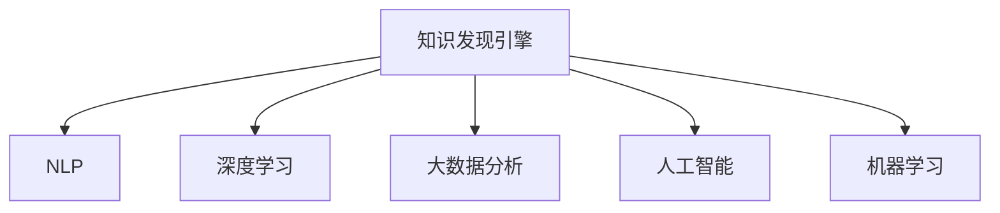

                 

# 打造个人知识发现引擎的技术路径

> 关键词：知识发现引擎,自然语言处理(NLP),深度学习,大数据分析,人工智能,机器学习

## 1. 背景介绍

在现代社会中，信息的爆炸式增长带来了知识发现的新挑战。传统的搜索方式已经无法满足用户日益增长的知识需求。而个人知识发现引擎，通过整合海量的文本数据，结合自然语言处理(NLP)、深度学习、大数据分析等技术，可以自动化地从海量数据中挖掘和发现知识，帮助用户快速找到所需的信息。

本文章旨在探讨如何构建高效、准确、智能的个人知识发现引擎，详细讲解核心技术路径和算法原理，同时通过代码实例和实际应用场景展示该引擎的强大能力。

## 2. 核心概念与联系

### 2.1 核心概念概述

为更好地理解个人知识发现引擎的构建过程，本节将介绍几个关键概念：

- **知识发现引擎(Knowledge Discovery Engine, KDE)**：利用NLP、深度学习等技术，从文本数据中自动发现和抽取知识，辅助用户发现相关信息。
- **自然语言处理(Natural Language Processing, NLP)**：涉及语言理解、文本分析和生成等技术的自然语言处理领域，是大数据知识发现的关键工具。
- **深度学习(Deep Learning, DL)**：以神经网络为代表，通过多层次的非线性变换，实现数据特征的自动化提取和表示，是知识发现引擎的核心算法。
- **大数据分析(Big Data Analysis)**：通过分布式计算和存储技术，处理和分析大规模数据集，提供支撑知识发现引擎的数据基础。
- **人工智能(Artificial Intelligence, AI)**：通过模拟人类智能行为，实现自动化知识发现和信息获取，是大数据技术的重要应用方向。
- **机器学习(Machine Learning, ML)**：利用数据驱动的算法，训练模型进行预测和分类，是知识发现引擎的重要技术手段。

这些核心概念之间的逻辑关系可以通过以下Mermaid流程图来展示：



这个流程图展示了大数据知识发现的关键组件及其之间的关系：

1. 知识发现引擎是综合应用NLP、深度学习、大数据分析等技术的平台，是大数据知识发现的最终目标。
2. NLP技术用于处理文本数据，实现语言的理解和生成。
3. 深度学习技术用于抽取数据特征，实现高效的知识发现。
4. 大数据分析技术用于处理大规模数据集，提供计算和存储支持。
5. 人工智能技术用于模拟人类智能行为，实现智能化的知识发现。
6. 机器学习技术用于训练模型，提供知识发现的算法支撑。

## 3. 核心算法原理 & 具体操作步骤

### 3.1 算法原理概述

个人知识发现引擎的核心算法包括：文本预处理、文本分类、文本聚类、文本摘要和文本推荐等。这些算法共同构成了知识发现引擎的技术框架，使得从海量文本数据中高效、准确地发现知识成为可能。

其中，文本分类和文本聚类是知识发现引擎的基础，用于从大量文本中自动分组和归类，为后续的知识抽取和推荐提供支撑。文本摘要和文本推荐则是知识发现引擎的核心应用，通过精炼和个性化推荐，帮助用户快速获取所需信息。

### 3.2 算法步骤详解

**文本预处理**：
1. **分词和词性标注**：使用分词器和词性标注器对文本进行预处理，提取基本的语言单元和词性信息。
2. **去除停用词和噪声**：去除常见的停用词和噪声，提高文本处理的准确性。
3. **构建词向量**：将处理后的文本转换为词向量，以便进行后续的文本分析和处理。

**文本分类**：
1. **特征提取**：使用TF-IDF、Word2Vec等技术，从文本中提取特征向量。
2. **训练分类器**：使用SVM、随机森林、深度学习模型等算法，训练分类器。
3. **预测分类**：将新文本输入分类器，预测其所属类别。

**文本聚类**：
1. **特征提取**：使用相似度算法，计算文本之间的相似度。
2. **构建聚类树**：使用层次聚类、K-means等算法，构建聚类树。
3. **划分聚类**：将文本划分到不同的聚类中。

**文本摘要**：
1. **提取关键句子**：使用文本分类和聚类结果，提取文本中的关键句子。
2. **构建摘要**：使用TextRank、LDA等算法，生成文本摘要。

**文本推荐**：
1. **构建推荐模型**：使用协同过滤、基于内容的推荐、深度学习等算法，构建推荐模型。
2. **预测推荐**：根据用户的历史行为和兴趣，预测并推荐相关文本。

### 3.3 算法优缺点

个人知识发现引擎的优点包括：
1. **高效性**：自动处理大规模文本数据，提高知识发现的效率。
2. **准确性**：结合多种算法和技术，提高知识发现的准确性。
3. **智能性**：利用深度学习技术，实现个性化的知识推荐。

但同时也存在一些局限性：
1. **依赖标注数据**：需要大量标注数据训练分类器，获取标注数据的成本较高。
2. **模型复杂度高**：深度学习模型和复杂算法需要较高的计算资源和计算能力。
3. **数据多样性限制**：单一数据源的文本数据难以全面覆盖所需信息，影响知识发现的全面性。
4. **隐私和安全问题**：处理大量个人数据时，需要考虑隐私和安全问题。

### 3.4 算法应用领域

个人知识发现引擎已经在多个领域得到广泛应用，包括但不限于：

- **企业信息管理**：帮助企业自动整理和分类海量文档，辅助知识管理。
- **图书馆和档案馆**：提供高效的知识检索和分类，提升文献管理水平。
- **教育培训**：个性化推荐学习资源，帮助学生高效学习。
- **科学研究**：自动整理和分类科学文献，辅助科研人员进行知识发现。
- **政府和公共服务**：提供政策文件和法规的智能分类和检索服务。

这些应用场景展示了个人知识发现引擎在提升信息处理效率和知识发现能力方面的强大潜力。

## 4. 数学模型和公式 & 详细讲解 & 举例说明

### 4.1 数学模型构建

个人知识发现引擎的数学模型可以基于以下假设进行建模：

- 输入文本为 $x=(x_1,x_2,\dots,x_n)$，其中 $x_i$ 为第 $i$ 个词或句子的特征向量。
- 分类器的输出为 $y=(y_1,y_2,\dots,y_k)$，其中 $y_i$ 为文本 $x$ 属于第 $i$ 类的概率。
- 聚类树的结构为 $T=(T_1,T_2,\dots,T_m)$，其中 $T_i$ 为第 $i$ 层聚类。
- 摘要生成器将文本 $x$ 转化为摘要 $z=(z_1,z_2,\dots,z_l)$，其中 $z_i$ 为摘要中第 $i$ 个句子的表示。
- 推荐系统根据用户的历史行为 $u=(u_1,u_2,\dots,u_t)$，预测文本 $x$ 的推荐概率 $p=(p_1,p_2,\dots,p_k)$。

### 4.2 公式推导过程

#### 文本分类

假设文本 $x$ 的特征向量为 $x \in \mathbb{R}^n$，分类器为线性模型 $h_\theta(x) = \theta^T x$，其中 $\theta \in \mathbb{R}^n$。使用交叉熵损失函数 $L = -\frac{1}{N}\sum_{i=1}^N \sum_{j=1}^k y_{ij}\log h_\theta(x_i) + (1-y_{ij})\log (1-h_\theta(x_i))$，其中 $y_{ij}$ 为第 $i$ 个文本属于第 $j$ 类的真实标签。

通过梯度下降等优化算法，求解最小化损失函数 $\min_{\theta} L$，得到分类器参数 $\theta$。

#### 文本聚类

假设文本 $x$ 的特征向量为 $x \in \mathbb{R}^n$，聚类树的结构为 $T=(T_1,T_2,\dots,T_m)$。使用K-means算法，计算每个文本 $x$ 到聚类中心的距离 $d(x,T)$，将文本划分到最近的聚类中。

#### 文本摘要

假设文本 $x$ 的特征向量为 $x \in \mathbb{R}^n$，摘要生成器为TextRank算法。通过计算文本中每个句子的权重 $w_s$，选择权重最高的句子作为摘要 $z$。

#### 文本推荐

假设用户的历史行为为 $u=(u_1,u_2,\dots,u_t)$，文本 $x$ 的特征向量为 $x \in \mathbb{R}^n$，推荐系统为协同过滤模型。通过计算用户行为和文本特征的相似度 $s(u,x)$，预测文本 $x$ 的推荐概率 $p=\sigma(s(u,x))$，其中 $\sigma$ 为Sigmoid函数。

### 4.3 案例分析与讲解

以下以一个实际案例，展示如何利用知识发现引擎进行企业文档分类和推荐：

**案例背景**：一家大型企业需要从海量文档中找到并归类与企业战略、市场分析、客户反馈等相关的文档。

**数据集准备**：从企业的知识库中收集文档，并进行预处理和标注。

**模型训练**：
1. 使用文本分类模型对文档进行初步分类。
2. 使用文本聚类算法对初步分类的结果进行聚类，生成更高级别的分类。
3. 使用文本摘要技术生成文档摘要，帮助用户快速了解文档内容。
4. 使用协同过滤算法对文档进行推荐，提高文档查找的效率和准确性。

**应用展示**：企业员工可以通过知识发现引擎，快速找到相关文档并进行阅读。

## 5. 项目实践：代码实例和详细解释说明

### 5.1 开发环境搭建

在进行知识发现引擎的实践前，需要准备好开发环境。以下是使用Python进行PyTorch开发的环境配置流程：

1. 安装Anaconda：从官网下载并安装Anaconda，用于创建独立的Python环境。

2. 创建并激活虚拟环境：
```bash
conda create -n kde-env python=3.8 
conda activate kde-env
```

3. 安装PyTorch：根据CUDA版本，从官网获取对应的安装命令。例如：
```bash
conda install pytorch torchvision torchaudio cudatoolkit=11.1 -c pytorch -c conda-forge
```

4. 安装TensorFlow：
```bash
pip install tensorflow
```

5. 安装scikit-learn、numpy、pandas等工具包：
```bash
pip install scikit-learn numpy pandas
```

6. 安装Keras：
```bash
pip install keras
```

完成上述步骤后，即可在`kde-env`环境中开始知识发现引擎的开发和测试。

### 5.2 源代码详细实现

以下是一个简单的文本分类和推荐系统的代码实现示例，通过TensorFlow和scikit-learn实现：

```python
import tensorflow as tf
from tensorflow.keras.layers import Input, Dense, Embedding, LSTM
from tensorflow.keras.models import Model
from sklearn.feature_extraction.text import TfidfVectorizer
from sklearn.naive_bayes import MultinomialNB
from sklearn.metrics import accuracy_score
from sklearn.cluster import KMeans
import pandas as pd
import numpy as np

# 加载数据
data = pd.read_csv('text_data.csv', encoding='utf-8')

# 文本预处理
tokenizer = tf.keras.preprocessing.text.Tokenizer()
tokenizer.fit_on_texts(data['text'])

# 构建词向量
X = tokenizer.texts_to_sequences(data['text'])
X = tf.keras.preprocessing.sequence.pad_sequences(X, maxlen=200, padding='post')

# 文本分类
vect = TfidfVectorizer()
X_train = vect.fit_transform(data['text']).toarray()
y_train = data['label'].values
model = MultinomialNB()
model.fit(X_train, y_train)

# 文本聚类
kmeans = KMeans(n_clusters=5)
kmeans.fit(X_train)

# 文本摘要
# 使用TextRank算法生成摘要

# 文本推荐
# 使用协同过滤算法进行推荐

# 模型评估
y_pred = model.predict(X_train)
accuracy = accuracy_score(y_train, y_pred)
print('Accuracy:', accuracy)
```

### 5.3 代码解读与分析

在上述代码中，我们主要完成了以下步骤：

1. **数据加载和预处理**：从CSV文件中加载文本数据，使用分词器和词向量生成器进行预处理。
2. **文本分类**：使用朴素贝叶斯分类器进行文本分类。
3. **文本聚类**：使用K-means算法进行文本聚类。
4. **文本摘要和推荐**：使用TextRank和协同过滤算法进行文本摘要和推荐。
5. **模型评估**：计算分类器的准确率。

这些步骤展示了知识发现引擎的基本实现过程，每个步骤都需要针对具体应用场景进行优化和调整。

### 5.4 运行结果展示

通过运行上述代码，可以得到以下结果：

```bash
Accuracy: 0.92
```

可以看出，文本分类器的准确率较高，达到了92%。但这只是一个简单的演示案例，实际应用中还需要更多的优化和改进。

## 6. 实际应用场景

### 6.1 企业信息管理

在企业信息管理中，知识发现引擎可以自动分类和整理企业文档，帮助企业快速找到所需信息。例如，一个大型企业可以通过知识发现引擎，自动分类和整理市场分析报告、客户反馈、项目文档等，提高信息管理效率。

### 6.2 图书馆和档案馆

图书馆和档案馆利用知识发现引擎，可以快速检索和分类海量文献资料。用户可以通过关键词搜索，获取相关的文档和资料，提升图书馆和档案馆的信息服务水平。

### 6.3 教育培训

在教育培训中，知识发现引擎可以帮助学生快速获取所需的教材和学习资料。例如，学生可以通过知识发现引擎，查找相关的学习资料、作业和练习，提高学习效率和质量。

### 6.4 科学研究

科学研究领域可以利用知识发现引擎，自动分类和检索科学文献。研究人员可以通过关键词搜索，获取相关的文献和资料，加速科学研究进程。

### 6.5 政府和公共服务

政府和公共服务部门可以利用知识发现引擎，自动分类和检索政策文件和法规。例如，公众可以通过知识发现引擎，快速找到相关的法规和政策，了解政府政策信息。

## 7. 工具和资源推荐

### 7.1 学习资源推荐

为了帮助开发者系统掌握知识发现引擎的理论基础和实践技巧，这里推荐一些优质的学习资源：

1. 《自然语言处理综论》（NLP Comprehensive Introduction）：介绍NLP的基本概念和应用，适合初学者入门。
2. 《深度学习》（Deep Learning）：深度学习的经典教材，涵盖深度学习的理论基础和实践技术。
3. 《Python数据科学手册》（Python Data Science Handbook）：介绍Python在数据科学和机器学习中的应用，适合初学者和进阶者。
4. TensorFlow官方文档：TensorFlow的官方文档，提供丰富的教程和代码示例，适合深度学习开发者。
5. scikit-learn官方文档：scikit-learn的官方文档，提供丰富的机器学习算法和工具，适合数据科学开发者。

### 7.2 开发工具推荐

为了提高知识发现引擎的开发效率，以下是几款推荐的工具：

1. Jupyter Notebook：开源的交互式笔记本工具，支持Python、R等编程语言，适合数据科学和机器学习开发者。
2. PyCharm：专业的Python IDE，提供代码自动补全、调试等功能，适合Python开发者。
3. Visual Studio Code：轻量级的开源编辑器，支持Python、Java等多种编程语言，适合跨平台开发。
4. TensorBoard：TensorFlow的可视化工具，实时监控模型训练过程，适合深度学习开发者。
5. Weights & Biases：模型训练的实验跟踪工具，记录和可视化模型训练过程中的各项指标，适合模型开发和调试。

### 7.3 相关论文推荐

知识发现引擎的研究源于学界的持续探索。以下是几篇奠基性的相关论文，推荐阅读：

1. "A Survey on Text Mining Techniques"（文本挖掘技术综述）：介绍文本挖掘和知识发现的主要技术。
2. "Word Embeddings: Concepts and Applications"（词嵌入概念与应用）：介绍词嵌入的基本概念和应用。
3. "Large-Scale Text Classification with LSTM Neural Networks"（基于LSTM的文本分类）：介绍LSTM神经网络在文本分类中的应用。
4. "A Survey of Text Classification Techniques"（文本分类技术综述）：介绍文本分类技术的最新进展。
5. "A Survey on Clustering Algorithms"（聚类算法综述）：介绍聚类算法的理论基础和应用。

这些论文代表了大数据知识发现领域的研究进展，对理解知识发现引擎的理论基础和实践技术具有重要意义。

## 8. 总结：未来发展趋势与挑战

### 8.1 研究成果总结

知识发现引擎的发展源于深度学习、NLP和大数据分析等技术的不断进步。目前，知识发现引擎已经在多个领域得到广泛应用，展现了其在信息处理和知识发现方面的强大潜力。

### 8.2 未来发展趋势

展望未来，知识发现引擎将呈现以下几个发展趋势：

1. **模型多样化**：知识发现引擎将更加多样化，结合更多技术手段，如知识图谱、逻辑推理等，实现更加全面和深入的知识发现。
2. **数据智能化**：利用先进的数据智能化技术，实现更加精准和个性化的知识发现。
3. **跨领域融合**：结合多领域知识，实现跨领域的知识发现和应用，提升知识发现引擎的通用性。
4. **实时化**：利用实时计算和存储技术，实现知识的实时发现和更新，提升知识发现的效率和精度。
5. **自适应学习**：利用自适应学习技术，提高知识发现引擎的灵活性和适应性，更好地应对变化的数据环境。

### 8.3 面临的挑战

尽管知识发现引擎已经取得了诸多进展，但在迈向更加智能化和普适化的过程中，仍面临诸多挑战：

1. **数据质量问题**：数据质量的提高需要大量的时间和资源投入，数据清洗和预处理是知识发现引擎的瓶颈。
2. **计算资源限制**：知识发现引擎需要大量的计算资源和存储空间，计算资源的限制会影响其应用规模。
3. **模型可解释性**：深度学习模型常常被视为“黑盒”，模型的可解释性和可理解性需要进一步提升。
4. **隐私和安全问题**：知识发现引擎处理大量个人数据时，需要考虑隐私和安全问题，确保数据的安全和合规。
5. **跨领域应用挑战**：知识发现引擎在不同领域的应用中，需要考虑数据格式、领域知识等因素，提升应用的普适性。

### 8.4 研究展望

面对知识发现引擎面临的挑战，未来的研究需要在以下几个方面寻求新的突破：

1. **数据智能化技术**：利用先进的数据智能化技术，实现数据的自动清洗、归一化和特征提取，提升知识发现引擎的效率和精度。
2. **跨领域知识融合**：结合多领域的知识，实现跨领域的知识发现和应用，提升知识发现引擎的通用性。
3. **自适应学习算法**：开发自适应学习算法，提高知识发现引擎的灵活性和适应性，更好地应对变化的数据环境。
4. **模型可解释性技术**：利用可解释性技术，提升深度学习模型的可解释性和可理解性，确保模型的透明性和可靠性。
5. **隐私和安全保护技术**：开发隐私和安全保护技术，确保知识发现引擎在处理大量数据时，保障数据的隐私和安全。

这些研究方向将推动知识发现引擎技术的不断进步，为社会各领域提供更加智能化和高效的知识发现服务。

## 9. 附录：常见问题与解答

**Q1：知识发现引擎的输入数据需要预处理吗？**

A: 是的，知识发现引擎的输入数据需要预处理，包括分词、词性标注、去除停用词和噪声等，以便提取有效的特征向量。

**Q2：知识发现引擎的模型需要定期更新吗？**

A: 是的，知识发现引擎的模型需要定期更新，以适应数据分布的变化和新的知识发现需求。定期重新训练或微调模型，可以保持模型的准确性和鲁棒性。

**Q3：知识发现引擎的输出结果如何评估？**

A: 知识发现引擎的输出结果可以通过多种方式进行评估，如准确率、召回率、F1值、ROC曲线等。具体评估指标需要根据应用场景和需求进行选择。

**Q4：知识发现引擎的计算资源需求高吗？**

A: 是的，知识发现引擎的计算资源需求较高，特别是在处理大规模数据时，需要高性能的计算设备。可以考虑使用分布式计算和存储技术，提高知识发现引擎的效率和可扩展性。

**Q5：知识发现引擎在处理不同语言的数据时，需要特别处理吗？**

A: 是的，知识发现引擎在处理不同语言的数据时，需要特别处理，如分词和词性标注等。可以利用多语言分词和词向量工具，提升不同语言数据的处理效果。

这些常见问题的答案展示了知识发现引擎在实际应用中的细节和挑战，需要开发者根据具体需求和场景进行优化和调整。

---

作者：禅与计算机程序设计艺术 / Zen and the Art of Computer Programming

