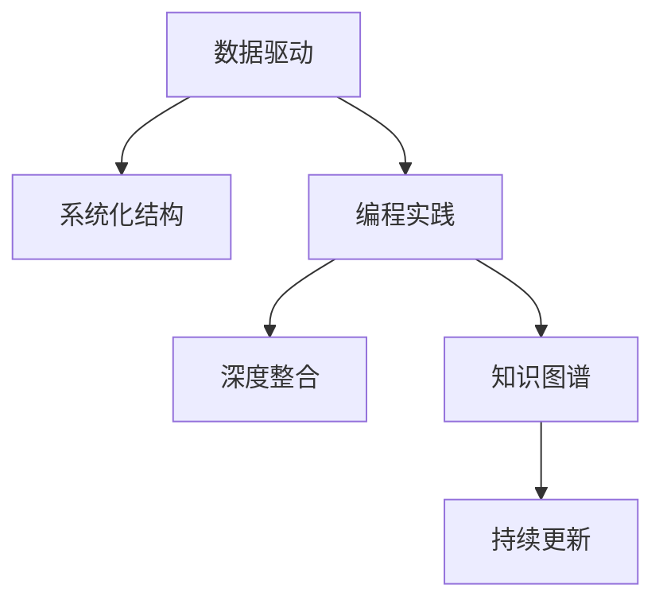

                 

# 打造个人知识图谱:程序员的实践之路

> 关键词：知识图谱,程序员,图谱构建,编程实践,数据驱动,学习提升,应用场景,工具资源,未来展望,挑战与解决

## 1. 背景介绍

### 1.1 问题由来
在当今信息爆炸的时代，知识和技能更新迭代的速度越来越快。程序员作为软件开发的核心力量，面对技术栈更新、行业需求变化等挑战，需要不断提升个人能力，构建完善的知识体系，以应对快速变化的技术环境。然而，传统知识积累方法，如读书、课程、笔记等，难以系统化、结构化地管理个人的知识图谱。个人知识图谱的构建成为提升职业竞争力和技术视野的重要工具。

### 1.2 问题核心关键点
个人知识图谱的构建，通过将零散的知识点系统化、结构化，帮助程序员更好地理解、记忆和应用知识。其主要关键点包括：

- **数据驱动**：收集和整理编程实践中的数据，作为知识图谱的构建基础。
- **系统化结构**：将知识按照一定的逻辑结构组织，便于检索和应用。
- **深度整合**：将代码、论文、项目实践等不同形式的知识，有机整合到图谱中。
- **持续更新**：随着知识的变化和个人的成长，知识图谱需要不断更新，保持其时效性和实用性。

构建个人知识图谱，不仅能够提升编程技能，还能在实际项目中更快地解决问题，推动技术创新，增强团队协作，提升工作效率。

### 1.3 问题研究意义
构建个人知识图谱，有助于程序员：

- **加速学习**：通过系统化的知识管理，快速查找所需知识，加速学习速度。
- **提高效率**：构建高效的知识检索系统，减少重复劳动，提升开发效率。
- **促进创新**：将知识图谱与实际项目相结合，推动技术创新和应用。
- **增强竞争力**：构建完善的知识体系，提升个人职业竞争力和技术视野。
- **促进团队合作**：共享知识图谱，提升团队协作和知识共享。

## 2. 核心概念与联系

### 2.1 核心概念概述

构建个人知识图谱涉及多个核心概念：

- **知识图谱(Knowledge Graph)**：通过实体、关系和属性，将知识系统化表示，便于检索和推理。
- **程序员(Programmer)**：软件开发领域的从业者，需要掌握编程语言、框架、工具、算法等多方面的知识。
- **编程实践(Programming Practice)**：包括代码编写、调试、测试、部署等实际开发中的经验和技巧。
- **数据驱动(Data-Driven)**：通过数据统计、分析，构建知识图谱，避免主观偏见。
- **系统化结构(Systematic Structure)**：将知识点按照一定的逻辑组织，便于检索和应用。
- **深度整合(Deep Integration)**：将不同形式的知识整合到图谱中，如代码、论文、项目经验等。
- **持续更新(Continuous Update)**：随着知识的变化和个人的成长，定期更新知识图谱。

这些核心概念之间的逻辑关系可以通过以下Mermaid流程图来展示：



这个流程图展示了个构建知识图谱的各个核心概念及其之间的关系：

1. 通过数据驱动收集和整理编程实践中的数据。
2. 将知识点按照系统化结构组织，便于检索和应用。
3. 深度整合不同形式的知识，如代码、论文、项目经验等。
4. 随着知识的变化和个人的成长，持续更新知识图谱。

## 3. 核心算法原理 & 具体操作步骤

### 3.1 算法原理概述

构建个人知识图谱，本质上是一个知识抽取、组织和表示的过程。其核心思想是：通过编程实践中的数据，构建一个结构化的知识图谱，便于检索和应用。

形式化地，假设编程实践中的数据为 $D=\{d_i\}_{i=1}^N$，其中每个数据点 $d_i$ 包括多个属性，如代码片段、问题描述、解决方案等。知识图谱 $G=(E, R, A)$ 中，$E$ 为实体集，$R$ 为关系集，$A$ 为属性集。构建知识图谱的过程为：

1. **数据抽取**：从编程实践数据中抽取实体和关系。
2. **关系标注**：为抽取的关系标注属性。
3. **图谱构建**：将抽取的实体和关系，按照一定的逻辑结构，构建知识图谱。
4. **图谱更新**：随着新知识的出现，定期更新知识图谱。

### 3.2 算法步骤详解

构建个人知识图谱，一般包括以下几个关键步骤：

**Step 1: 数据收集和预处理**
- 收集编程实践中的数据，如代码片段、问题描述、解决方案、文档等。
- 对数据进行清洗、整理，去除无关噪声，确保数据质量。

**Step 2: 实体抽取与关系标注**
- 使用命名实体识别(NER)和关系抽取(RE)技术，从编程实践中抽取实体和关系。
- 对抽取的关系标注属性，如问题类型、解决方案类型、代码类型等。

**Step 3: 知识图谱构建**
- 将抽取的实体和关系，按照一定的逻辑结构构建知识图谱。例如，按照问题-解决方案、编程语言-工具等维度组织。
- 使用图形数据库或可视化工具，如Neo4j、Gephi等，存储和展示知识图谱。

**Step 4: 图谱查询与推理**
- 定义查询语言或API接口，支持通过关键字、实体、关系等进行知识图谱的检索。
- 使用图谱推理引擎，支持基于图谱的关系推理和实体关联。

**Step 5: 图谱更新与维护**
- 定期收集新的编程实践数据，更新知识图谱。
- 通过持续迭代，完善图谱结构和推理逻辑。

### 3.3 算法优缺点

构建个人知识图谱，具有以下优点：

1. **系统化管理**：将知识系统化组织，便于检索和应用。
2. **结构化展示**：使用图形数据库和可视化工具，便于理解和管理。
3. **跨领域融合**：支持不同领域和技术的融合，提升知识覆盖面。
4. **动态更新**：随着新知识的产生，持续更新图谱，保持其时效性。

同时，该方法也存在一定的局限性：

1. **数据收集成本高**：构建知识图谱需要大量编程实践数据，收集和整理成本较高。
2. **图谱构建复杂**：需要一定的技术背景，构建过程复杂，易出错。
3. **图谱更新难度大**：随着知识的变化和个人的成长，更新图谱需要持续投入。

尽管存在这些局限性，但通过合理的工具和流程，这些挑战是可以克服的。

### 3.4 算法应用领域

个人知识图谱构建方法，已经在多个领域得到了应用，如：

- **软件开发**：提升编程技能，提高开发效率。
- **技术博客**：系统化整理博客内容，便于阅读和分享。
- **技术培训**：构建课程和案例库，支持技术培训和学习。
- **知识分享**：在团队或社区中分享知识，促进知识传播。
- **项目管理**：构建项目文档和代码库，支持项目管理。

除了上述这些典型应用外，个人知识图谱还被创新性地应用到更多场景中，如代码导航、技术趋势分析、AI应用探索等，为技术创新和知识传播提供了新的工具。

## 4. 数学模型和公式 & 详细讲解  
### 4.1 数学模型构建

构建个人知识图谱，可以抽象为一个三元组表示的图形结构，即 $G=(E, R, A)$，其中：

- $E$ 为实体集，每个实体 $e \in E$ 表示一个知识点。
- $R$ 为关系集，每条关系 $r \in R$ 表示知识点之间的关联。
- $A$ 为属性集，每个属性 $a \in A$ 表示知识点的特定属性。

形式化地，知识图谱的构建过程可以表示为：

1. **数据抽取**：从编程实践数据中抽取实体 $E$ 和关系 $R$。
2. **关系标注**：为抽取的关系标注属性 $A$。
3. **图谱构建**：将实体 $E$ 和关系 $R$ 按照一定的逻辑结构构建知识图谱 $G$。
4. **图谱更新**：随着新知识的出现，定期更新图谱。

### 4.2 公式推导过程

以下我们以编程实践数据为例，推导知识图谱的构建过程。

假设编程实践数据 $D=\{d_i\}_{i=1}^N$，其中每个数据点 $d_i$ 包含多个属性，如代码片段、问题描述、解决方案等。从数据中抽取实体和关系，并标注属性，形式化表示为：

$$
E = \bigcup_{d_i \in D} \{e_i\} \quad \text{其中} \quad e_i \in \mathbb{E}
$$

$$
R = \bigcup_{d_i \in D} \{r_i\} \quad \text{其中} \quad r_i \in \mathbb{R}
$$

$$
A = \bigcup_{r_i \in R} \{a_i\} \quad \text{其中} \quad a_i \in \mathbb{A}
$$

构建知识图谱 $G=(E, R, A)$，将抽取的实体和关系按照一定的逻辑结构组织。例如，按照问题-解决方案、编程语言-工具等维度组织。形式化表示为：

$$
G = (E, R, A)
$$

其中 $E$、$R$、$A$ 的具体表示形式可以根据实际需求设计。

### 4.3 案例分析与讲解

以下通过一个简单的案例，展示如何构建一个基于编程实践的知识图谱。

**案例背景**：
假设我们收集了一些编程实践数据，内容涉及Python编程语言和常见的框架（如Django、Flask）。数据点包括代码片段、问题描述和解决方案。

**数据抽取**：
1. 从数据中抽取实体 $E$：
   - 问题实体：例如 "Python Flask 调试问题"、"Python Django 数据库连接问题" 等。
   - 解决方案实体：例如 "使用DEBUG模式"、"配置数据库连接" 等。
   - 代码片段实体：例如 "```python def get_object(request): return object.get(request) ```" 等。
   - 工具实体：例如 "Django"、"Flask" 等。
2. 从数据中抽取关系 $R$：
   - 实体间的关系：例如 "有解决方案"、"使用" 等。
   - 属性关系：例如 "编程语言"、"框架" 等。
3. 标注属性 $A$：
   - 问题实体的属性：例如 "问题类型"、"复杂度" 等。
   - 解决方案实体的属性：例如 "解决方法类型"、"难度" 等。
   - 代码片段的属性：例如 "代码语言"、"功能" 等。
   - 工具的属性：例如 "功能"、"版本" 等。

**图谱构建**：
1. 将问题实体和解决方案实体按照 "问题-解决方案" 关系组织，构建图谱。
2. 将代码片段实体按照 "使用" 关系，连接对应的编程语言和框架实体。
3. 将工具实体按照 "使用" 关系，连接对应的编程语言和框架实体。

**图谱查询与推理**：
1. 定义查询语言或API接口，支持通过关键字、实体、关系等进行知识图谱的检索。例如，查询 "Python Django 数据库连接问题" 的解决方案。
2. 使用图谱推理引擎，支持基于图谱的关系推理和实体关联。例如，推导出 "Python Flask 调试问题" 的解决方案。

## 5. 项目实践：代码实例和详细解释说明
### 5.1 开发环境搭建

在进行知识图谱构建实践前，我们需要准备好开发环境。以下是使用Python进行PyTorch开发的环境配置流程：

1. 安装Anaconda：从官网下载并安装Anaconda，用于创建独立的Python环境。

2. 创建并激活虚拟环境：
```bash
conda create -n pytorch-env python=3.8 
conda activate pytorch-env
```

3. 安装PyTorch：根据CUDA版本，从官网获取对应的安装命令。例如：
```bash
conda install pytorch torchvision torchaudio cudatoolkit=11.1 -c pytorch -c conda-forge
```

4. 安装图形数据库和可视化工具：
```bash
pip install neo4j
pip install gephi
```

完成上述步骤后，即可在`pytorch-env`环境中开始知识图谱构建实践。

### 5.2 源代码详细实现

这里我们以编程实践数据构建知识图谱为例，给出使用PyTorch进行知识图谱构建的代码实现。

首先，定义实体和关系的Python类：

```python
from py2neo import Graph, Node, Relationship

class NodeType:
    PROBLEM = 'Problem'
    SOLUTION = 'Solution'
    CODE = 'Code'
    TOOL = 'Tool'

class RelationshipType:
    HAS = 'Has'
    USES = 'Uses'

class KnowledgeGraph:
    def __init__(self, graph_uri):
        self.graph = Graph(graph_uri)

    def add_node(self, node_type, name, attributes=None):
        if node_type == NodeType.PROBLEM:
            entity = Node(NodeType.PROBLEM, name=name, **attributes)
        elif node_type == NodeType.SOLUTION:
            entity = Node(NodeType.SOLUTION, name=name, **attributes)
        elif node_type == NodeType.CODE:
            entity = Node(NodeType.CODE, name=name, **attributes)
        elif node_type == NodeType.TOOL:
            entity = Node(NodeType.TOOL, name=name, **attributes)
        else:
            raise ValueError(f"Invalid node type: {node_type}")
        self.graph.create(entity)

    def add_relationship(self, start_node_type, start_node_name, end_node_type, end_node_name, relationship_type, attributes=None):
        if start_node_type == NodeType.PROBLEM and end_node_type == NodeType.SOLUTION:
            relationship = Relationship(start_node_name, relationship_type, end_node_name, **attributes)
        elif start_node_type == NodeType.SOLUTION and end_node_type == NodeType.CODE:
            relationship = Relationship(start_node_name, relationship_type, end_node_name, **attributes)
        elif start_node_type == NodeType.CODE and end_node_type == NodeType.TOOL:
            relationship = Relationship(start_node_name, relationship_type, end_node_name, **attributes)
        else:
            raise ValueError(f"Invalid relationship type: {start_node_type} - {end_node_type} - {relationship_type}")
        self.graph.create(relationship)

# 示例代码实现
graph_uri = "bolt://localhost:7687"
kg = KnowledgeGraph(graph_uri)

# 添加问题节点
kg.add_node(NodeType.PROBLEM, "Python Django 数据库连接问题", attributes={"问题描述": "连接 Django 应用程序到 MySQL 数据库"})

# 添加解决方案节点
kg.add_node(NodeType.SOLUTION, "配置数据库连接", attributes={"解决方案描述": "配置 Django 应用的 DATABASES 配置项"})

# 添加代码片段节点
kg.add_node(NodeType.CODE, "```python def get_object(request): return object.get(request) ```", attributes={"代码语言": "Python", "功能": "获取对象"})

# 添加工具节点
kg.add_node(NodeType.TOOL, "Django", attributes={"工具名称": "Django", "功能": "Web 框架"})

# 添加关系
kg.add_relationship(start_node_type=NodeType.PROBLEM, start_node_name="Python Django 数据库连接问题", end_node_type=NodeType.SOLUTION, end_node_name="配置数据库连接", relationship_type=RelationshipType.HAS, attributes={"复杂度": 2})

kg.add_relationship(start_node_type=NodeType.SOLUTION, start_node_name="配置数据库连接", end_node_type=NodeType.CODE, end_node_name="```python def get_object(request): return object.get(request) ```", relationship_type=RelationshipType.USES, attributes={"难度": 3})

kg.add_relationship(start_node_type=NodeType.CODE, start_node_name="```python def get_object(request): return object.get(request) ```", end_node_type=NodeType.TOOL, end_node_name="Django", relationship_type=RelationshipType.USES, attributes={"版本": "3.2"})
```

### 5.3 代码解读与分析

让我们再详细解读一下关键代码的实现细节：

**KnowledgeGraph类**：
- `__init__`方法：初始化Neo4j图形数据库。
- `add_node`方法：向图谱中添加节点，并指定节点类型和属性。
- `add_relationship`方法：向图谱中添加关系，并指定起始节点、结束节点、关系类型和属性。

**实体和关系类型**：
- `NodeType`类：定义节点类型。
- `RelationshipType`类：定义关系类型。

**示例代码实现**：
- 创建知识图谱实例，并添加问题、解决方案、代码片段和工具等节点。
- 添加 "有解决方案" 关系，连接问题节点和解决方案节点。
- 添加 "使用" 关系，连接解决方案节点和代码片段节点，连接代码片段节点和工具节点。

## 6. 实际应用场景
### 6.1 智能推荐系统

构建个人知识图谱，可以应用于智能推荐系统，通过分析用户行为和偏好，推荐合适的编程资源和学习路径。智能推荐系统通过分析用户对代码、文章、课程等资源的交互记录，构建用户知识图谱，并结合知识图谱进行推荐。

例如，通过分析用户阅读的代码片段、提交的问题和解决方案，可以构建用户知识图谱。在用户学习新主题时，推荐相关的代码片段、文章和课程，帮助用户快速掌握新知识。

### 6.2 技术博客

技术博客作者可以构建自己的知识图谱，系统化整理博客内容，便于读者查找和引用。通过构建博客知识图谱，可以清晰展示不同文章之间的关系，如引用关系、技术栈依赖关系等。

例如，博客作者可以记录每篇文章的主题、关键词、引用链接等，构建博客知识图谱。在撰写新文章时，可以从图谱中快速获取相关参考资料，避免重复劳动。

### 6.3 技术培训

构建知识图谱，可以帮助技术培训团队系统化整理课程和案例，支持技术培训和学习。通过构建课程和案例知识图谱，可以清晰展示不同课程和案例之间的关系，如课程之间的依赖关系、案例的代码示例等。

例如，技术培训团队可以收集编程实践数据，构建课程和案例知识图谱。在课程培训时，可以通过图谱快速查找相关的案例和代码示例，提升培训效果。

### 6.4 未来应用展望

随着知识图谱技术的不断发展，其应用场景将更加广泛。未来，知识图谱将在更多领域得到应用，如：

- **人工智能**：构建知识图谱，支持AI模型训练和推理。
- **医学**：构建医疗知识图谱，支持诊断和治疗决策。
- **金融**：构建金融知识图谱，支持风险评估和投资决策。
- **法律**：构建法律知识图谱，支持法律咨询和合同审核。
- **教育**：构建教育知识图谱，支持个性化学习和智能辅导。

## 7. 工具和资源推荐
### 7.1 学习资源推荐

为了帮助开发者系统掌握知识图谱的理论基础和实践技巧，这里推荐一些优质的学习资源：

1. **《图灵机器学习》**：深度学习领域的经典书籍，详细介绍了图谱构建、图谱推理、图谱学习等核心概念。
2. **《知识图谱理论与应用》**：系统介绍知识图谱的理论基础和应用实例，涵盖图谱构建、图谱查询、图谱应用等多个方面。
3. **Coursera 图谱课程**：斯坦福大学开设的《Graph Neural Networks》课程，介绍图谱神经网络的基本原理和应用。
4. **Kaggle 图谱竞赛**：参与Kaggle的图谱竞赛，实战练习图谱构建和图谱查询技能。
5. **TensorFlow 图谱工具包**：TensorFlow提供的图谱工具包，支持图谱的构建、查询和训练。

通过对这些资源的学习实践，相信你一定能够快速掌握知识图谱的精髓，并用于解决实际的编程问题。

### 7.2 开发工具推荐

高效的开发离不开优秀的工具支持。以下是几款用于知识图谱构建开发的常用工具：

1. **Neo4j**：商业级图形数据库，支持图谱的构建、查询和存储。
2. **Gephi**：开源图形可视化工具，支持图形数据的展示和分析。
3. **TinkerPop**：图形数据处理的Java库，支持图谱的构建、查询和处理。
4. **Jupyter Notebook**：交互式编程环境，适合知识图谱构建的交互式开发。
5. **Python 图谱库**：如PyGraphviz、NetworkX等，支持图形数据的处理和展示。

合理利用这些工具，可以显著提升知识图谱构建的开发效率，加快创新迭代的步伐。

### 7.3 相关论文推荐

知识图谱和编程实践的融合，是当前学术界和工业界研究的热点。以下是几篇奠基性的相关论文，推荐阅读：

1. **《知识图谱在推荐系统中的应用》**：详细介绍了知识图谱在推荐系统中的应用，包括图谱构建、图谱查询和推荐算法。
2. **《基于图谱的编程实践数据分析》**：研究了编程实践数据中的实体和关系，构建了编程实践知识图谱。
3. **《编程实践中的图谱构建与推理》**：研究了编程实践中的实体和关系，通过图谱推理解决编程问题。
4. **《智能推荐系统中的知识图谱应用》**：探讨了知识图谱在智能推荐系统中的应用，包括图谱构建、图谱查询和推荐算法。
5. **《编程实践中的知识图谱构建与学习》**：研究了编程实践中的实体和关系，通过知识图谱提升学习效果。

这些论文代表了大语言模型微调技术的发展脉络。通过学习这些前沿成果，可以帮助研究者把握学科前进方向，激发更多的创新灵感。

## 8. 总结：未来发展趋势与挑战

### 8.1 总结

本文对基于编程实践的数据构建个人知识图谱的方法进行了全面系统的介绍。首先阐述了知识图谱的构建背景和意义，明确了知识图谱在提升编程技能、提高开发效率等方面的重要价值。其次，从原理到实践，详细讲解了知识图谱的数学模型和构建步骤，给出了知识图谱构建的完整代码实例。同时，本文还广泛探讨了知识图谱在智能推荐、技术博客、技术培训等多个领域的应用前景，展示了知识图谱技术的广阔前景。

通过本文的系统梳理，可以看到，基于编程实践的知识图谱构建，能够系统化管理知识，提升学习效率，支持智能推荐等应用。随着知识图谱技术的不断发展，其在更多领域的应用将不断拓展，为各行各业带来变革性影响。

### 8.2 未来发展趋势

展望未来，知识图谱技术将呈现以下几个发展趋势：

1. **自动化构建**：借助自然语言处理和语义理解技术，自动从文本数据中抽取实体和关系，构建知识图谱。
2. **跨领域融合**：将不同领域和类型的数据，如文本、图像、音频等，融合到知识图谱中，提升知识覆盖面。
3. **实时更新**：构建实时更新的知识图谱，能够动态响应新知识，保持图谱的时效性和实用性。
4. **图谱推理**：引入因果推理、对比学习等方法，提升图谱推理和实体关联的能力，增强知识图谱的解释性和可信度。
5. **可视化展示**：使用可视化工具，如Gephi、D3.js等，动态展示知识图谱的变化，增强知识理解和学习体验。
6. **知识图谱应用**：知识图谱将在更多领域得到应用，如AI、医疗、金融等，为各行各业带来变革性影响。

以上趋势凸显了知识图谱技术的广阔前景。这些方向的探索发展，必将进一步提升知识图谱的应用效果，推动知识图谱技术在各个领域的深度融合。

### 8.3 面临的挑战

尽管知识图谱技术已经取得了瞩目成就，但在迈向更加智能化、普适化应用的过程中，它仍面临着诸多挑战：

1. **数据收集成本高**：构建知识图谱需要大量数据，收集和整理成本较高。
2. **图谱构建复杂**：需要一定的技术背景，构建过程复杂，易出错。
3. **图谱更新难度大**：随着新知识的出现，更新图谱需要持续投入。
4. **图谱推理复杂**：复杂的图谱推理逻辑，需要优化算法和模型，避免推理过程中的错误。
5. **图谱可视化困难**：可视化展示复杂，需要选择合适的工具和算法，保证展示效果。
6. **图谱应用场景局限**：不同类型的图谱，需要针对具体应用场景进行优化，推广应用难度大。

尽管存在这些挑战，但通过合理的工具和流程，这些挑战是可以克服的。

### 8.4 研究展望

面对知识图谱面临的挑战，未来的研究需要在以下几个方面寻求新的突破：

1. **自动化知识图谱构建**：利用自然语言处理和语义理解技术，自动从文本数据中抽取实体和关系，构建知识图谱。
2. **跨领域知识融合**：将不同领域和类型的数据，如文本、图像、音频等，融合到知识图谱中，提升知识覆盖面。
3. **实时知识图谱更新**：构建实时更新的知识图谱，能够动态响应新知识，保持图谱的时效性和实用性。
4. **高效的图谱推理算法**：引入因果推理、对比学习等方法，提升图谱推理和实体关联的能力，增强知识图谱的解释性和可信度。
5. **知识图谱可视化技术**：使用可视化工具，动态展示知识图谱的变化，增强知识理解和学习体验。
6. **知识图谱应用场景拓展**：研究知识图谱在不同领域的应用场景，如AI、医疗、金融等，推动知识图谱技术在各行各业的落地应用。

这些研究方向的探索，必将引领知识图谱技术迈向更高的台阶，为各行各业带来变革性影响。面向未来，知识图谱技术还需要与其他人工智能技术进行更深入的融合，如自然语言处理、机器学习、深度学习等，多路径协同发力，共同推动人工智能技术的发展。

## 9. 附录：常见问题与解答

**Q1：如何构建高质量的知识图谱？**

A: 构建高质量的知识图谱，需要遵循以下几个步骤：

1. **数据收集**：收集高质量的编程实践数据，确保数据的准确性和完整性。
2. **数据清洗**：对数据进行清洗，去除无关噪声，确保数据质量。
3. **实体抽取**：使用命名实体识别(NER)和关系抽取(RE)技术，从数据中抽取实体和关系。
4. **关系标注**：为抽取的关系标注属性，如问题类型、解决方案类型等。
5. **图谱构建**：将抽取的实体和关系，按照一定的逻辑结构构建知识图谱。
6. **图谱更新**：随着新知识的出现，定期更新知识图谱。

**Q2：如何使用知识图谱进行智能推荐？**

A: 知识图谱可用于智能推荐系统，通过分析用户行为和偏好，推荐合适的编程资源和学习路径。具体步骤如下：

1. **用户建模**：构建用户知识图谱，记录用户的编程实践数据。
2. **资源建模**：构建编程资源知识图谱，记录代码片段、文章、课程等资源的信息。
3. **关系计算**：通过图谱查询和推理，计算用户与资源之间的相似度。
4. **推荐算法**：根据相似度计算结果，推荐相关的资源。

**Q3：如何构建可视化知识图谱？**

A: 构建可视化知识图谱，可以使用以下工具和技术：

1. **Gephi**：开源图形可视化工具，支持图形数据的展示和分析。
2. **D3.js**：JavaScript库，支持动态展示知识图谱的变化。
3. **Tableau**：商业可视化工具，支持多维度数据展示。

在构建可视化知识图谱时，需要选择合适的展示方式和算法，确保展示效果和用户体验。

**Q4：知识图谱在技术博客中的应用场景是什么？**

A: 技术博客作者可以构建自己的知识图谱，系统化整理博客内容，便于读者查找和引用。通过构建博客知识图谱，可以清晰展示不同文章之间的关系，如引用关系、技术栈依赖关系等。

**Q5：知识图谱在技术培训中的应用场景是什么？**

A: 技术培训团队可以构建课程和案例知识图谱，支持技术培训和学习。通过构建课程和案例知识图谱，可以清晰展示不同课程和案例之间的关系，如课程之间的依赖关系、案例的代码示例等。

通过对这些资源的学习实践，相信你一定能够快速掌握知识图谱的精髓，并用于解决实际的编程问题。

---

作者：禅与计算机程序设计艺术 / Zen and the Art of Computer Programming

