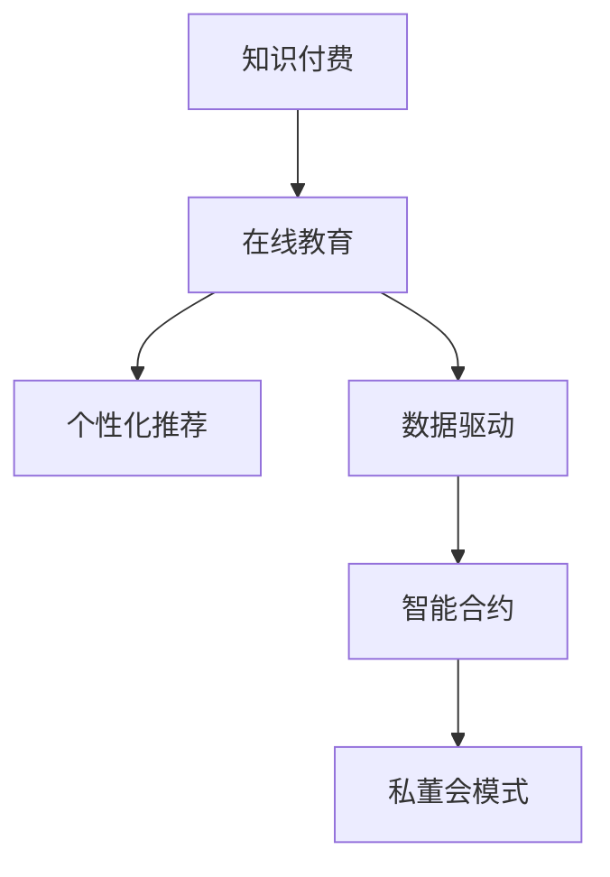

                 

# 打造知识付费的私董会模式

> 关键词：知识付费、私董会、在线教育、数据驱动、个性化学习、社交网络、推荐系统、智能合约

## 1. 背景介绍

随着互联网技术的不断进步和智能手机的普及，在线教育正在迅速崛起，成为知识付费领域的重要形式。如何通过技术手段提升在线教育的互动性和个性化，满足用户多样化的学习需求，是当前在线教育面临的核心问题。与此同时，互联网企业也在探索如何构建新的商业模式，通过数据驱动和智能化手段，打造高价值的用户社群。

在这样的背景下，知识付费的私董会模式应运而生。所谓私董会模式，是一种结合知识付费和私董会的互动方式，通过个性化推荐和数据驱动，构建小范围的高价值社交网络，从而实现深度学习和知识交流。私董会模式不仅能够提升用户的在线教育体验，还能为企业带来稳定的收益流，具有巨大的市场潜力和应用价值。

## 2. 核心概念与联系

### 2.1 核心概念概述

为了更好地理解私董会模式，下面将介绍几个核心概念及其相互之间的联系：

- **知识付费**：通过付费获取高质量的教育资源和知识服务的模式。相较于传统的免费教育，知识付费能够确保教育资源的质量和数量，满足用户多样化的学习需求。

- **私董会**：由若干名企业家组成的小型讨论团体，旨在分享经验、交流观点、共同解决商业问题。私董会成员之间相互信任、保密，能够形成深度互动和高质量的讨论环境。

- **在线教育**：基于互联网技术，通过视频、文字、互动等形式进行的教育活动。在线教育打破了时间和空间的限制，使得知识传播更加便捷高效。

- **个性化推荐系统**：通过对用户的行为和兴趣进行分析，为用户推荐个性化的教育内容和学习路径。个性化推荐系统能够显著提升用户的参与度和学习效率。

- **数据驱动**：通过收集、分析和应用大量用户数据，指导决策和行动。数据驱动能够使企业更加精准地理解用户需求，优化产品和服务。

- **智能合约**：在区块链上运行的自动执行合同，确保交易的透明、安全、不可篡改。智能合约能够提高私董会的信任度和互动性，降低运营成本。

### 2.2 核心概念原理和架构的 Mermaid 流程图



这个流程图展示了私董会模式的核心组成和相互关系。知识付费和在线教育是基础，个性化推荐系统和大数据驱动是核心技术手段，智能合约是信任机制，而私董会模式则是应用场景。

## 3. 核心算法原理 & 具体操作步骤

### 3.1 算法原理概述

私董会模式的核心算法原理基于数据驱动和个性化推荐。其核心思想是通过对用户行为和兴趣的分析和挖掘，为用户推荐适合的内容和学习路径，从而实现深度学习和知识交流。具体来说，私董会模式包括以下几个步骤：

1. **数据收集与分析**：收集用户在平台上的行为数据（如浏览、学习、互动等）和属性数据（如年龄、职业、兴趣等），通过数据分析挖掘用户的兴趣和需求。

2. **个性化推荐**：根据用户的兴趣和需求，生成个性化的教育内容和推荐路径。个性化推荐可以采用协同过滤、内容推荐、混合推荐等算法，确保推荐结果的高相关性和多样性。

3. **私董会互动**：在推荐基础上，构建小范围的高价值社交网络，让用户进行深度互动和讨论。私董会的组织和管理可以采用智能合约技术，确保互动的安全性和隐私性。

4. **知识交流与学习**：用户通过私董会的讨论和互动，分享知识和经验，获取新知。知识交流和学习的成果可以通过智能合约记录和分享，实现知识资产的积累和传承。

### 3.2 算法步骤详解

下面将详细介绍私董会模式的算法步骤：

1. **用户行为与兴趣分析**

   - **数据收集**：使用数据管道从用户注册、学习、互动等环节收集数据，包括行为数据（如点击、浏览、购买等）和属性数据（如年龄、职业、兴趣等）。

   - **数据预处理**：对数据进行清洗、去重、归一化等预处理，确保数据的质量和一致性。

   - **特征提取**：通过文本分析、聚类、降维等技术提取用户的行为特征和兴趣特征，构建用户画像。

   - **用户画像构建**：结合用户的行为特征和属性特征，构建用户的综合画像，用于后续的推荐和互动分析。

2. **个性化推荐生成**

   - **协同过滤推荐**：使用协同过滤算法，根据用户的历史行为和相似用户的推荐行为，生成个性化的教育内容和推荐路径。

   - **内容推荐算法**：使用内容推荐算法，根据教育内容的元数据（如标签、作者、长度等），为用户推荐相关的内容。

   - **混合推荐策略**：结合协同过滤和内容推荐的结果，使用加权平均、优胜策略等混合推荐算法，生成最终的推荐结果。

3. **私董会互动组织**

   - **私董会形成**：根据用户的兴趣和需求，动态组建私董会讨论小组。私董会可以采用推荐算法或人工干预的方式形成。

   - **私董会管理**：使用智能合约技术，对私董会的讨论和管理进行记录和控制。智能合约可以确保讨论的隐私性和安全性，防止恶意行为。

   - **私董会互动**：在私董会中，用户可以自由讨论、交流和分享知识，形成深度互动和高价值的社交网络。

4. **知识交流与学习**

   - **知识积累**：用户通过私董会的讨论和互动，生成知识记录和成果。知识成果可以通过智能合约记录和分享，实现知识资产的积累和传承。

   - **知识传承**：用户可以将自己的知识成果分享给其他成员，形成知识的传承和扩散，推动知识社区的发展。

### 3.3 算法优缺点

私董会模式具有以下优点：

1. **深度互动**：用户通过私董会的互动和讨论，可以获得深度学习和知识交流的机会，提升学习效果。

2. **个性化推荐**：个性化推荐系统能够根据用户的兴趣和需求，生成个性化的教育内容和学习路径，提高用户的学习效率。

3. **数据驱动**：通过数据分析和挖掘，能够精准地理解用户需求，优化教育内容和推荐结果。

4. **智能合约**：智能合约技术能够确保私董会的信任和安全，降低运营成本。

5. **灵活性高**：私董会模式可以根据用户需求动态调整，适应不同的应用场景和需求。

同时，私董会模式也存在一些缺点：

1. **运营成本高**：私董会模式的运营需要大量的数据收集、分析和用户互动，运营成本较高。

2. **技术门槛高**：需要具备较强的数据分析和算法技术，对技术团队的要求较高。

3. **用户体验复杂**：私董会模式的交互方式和界面设计需要优化，以提升用户体验。

4. **知识传承困难**：知识成果的记录和分享需要规范化的流程和工具，确保知识的有效传承。

### 3.4 算法应用领域

私董会模式在知识付费和在线教育领域具有广泛的应用前景。具体来说，可以应用于以下几个方面：

1. **专业培训**：在专业培训领域，通过私董会的互动和讨论，学员可以获得专业的知识和经验，提升职业技能。

2. **职业发展**：在职业发展领域，通过私董会的讨论和交流，用户可以获得职业规划和发展的建议，提升职业竞争力。

3. **兴趣小组**：在兴趣小组领域，通过私董会的互动和分享，用户可以找到志同道合的朋友，共同探索兴趣领域的知识。

4. **知识社区**：在知识社区领域，通过私董会的讨论和分享，用户可以积累和传承知识，推动社区的发展。

## 4. 数学模型和公式 & 详细讲解 & 举例说明

### 4.1 数学模型构建

私董会模式的核心数学模型包括用户画像模型、协同过滤模型、个性化推荐模型和知识传承模型。

1. **用户画像模型**

   用户画像模型通过行为特征和属性特征的加权融合，生成用户的综合画像。设用户画像向量为 $\mathbf{u}$，行为特征向量为 $\mathbf{b}$，属性特征向量为 $\mathbf{a}$，则用户画像模型可以表示为：

   $$
   \mathbf{u} = \alpha \mathbf{b} + (1-\alpha) \mathbf{a}
   $$

   其中 $\alpha$ 为行为特征和属性特征的权重系数。

2. **协同过滤模型**

   协同过滤模型通过计算用户之间的相似度和评分，生成个性化的推荐结果。设用户 $i$ 对内容 $j$ 的评分矩阵为 $R$，用户 $i$ 和用户 $j$ 的相似度为 $sim(i,j)$，则协同过滤模型可以表示为：

   $$
   \hat{r}_{ij} = \sum_{k=1}^N \frac{r_{ik}r_{jk}}{sim(i,k)sim(j,k)}
   $$

   其中 $N$ 为总用户数，$r_{ik}$ 为用户 $i$ 对内容 $k$ 的评分，$\hat{r}_{ij}$ 为预测用户 $i$ 对内容 $j$ 的评分。

3. **个性化推荐模型**

   个性化推荐模型通过结合协同过滤和内容推荐的结果，生成最终的推荐结果。设推荐结果向量为 $\mathbf{p}$，行为特征向量为 $\mathbf{b}$，属性特征向量为 $\mathbf{a}$，协同过滤结果为 $\mathbf{c}$，内容推荐结果为 $\mathbf{d}$，则个性化推荐模型可以表示为：

   $$
   \mathbf{p} = \alpha \mathbf{c} + (1-\alpha) \mathbf{d} + \beta \mathbf{b} + (1-\beta) \mathbf{a}
   $$

   其中 $\alpha$ 和 $\beta$ 为协同过滤、内容推荐、行为特征和属性特征的权重系数。

4. **知识传承模型**

   知识传承模型通过记录和分享知识成果，实现知识的积累和传承。设知识成果向量为 $\mathbf{k}$，知识成果评分向量为 $\mathbf{s}$，知识传承向量为 $\mathbf{t}$，则知识传承模型可以表示为：

   $$
   \mathbf{k} = \alpha \mathbf{s} + (1-\alpha) \mathbf{t}
   $$

   其中 $\alpha$ 为知识成果评分和知识传承的权重系数。

### 4.2 公式推导过程

以个性化推荐模型为例，推导其公式推导过程如下：

设用户 $i$ 对内容 $j$ 的评分矩阵为 $R$，用户 $i$ 和用户 $j$ 的相似度为 $sim(i,j)$，则协同过滤模型的预测评分 $\hat{r}_{ij}$ 可以表示为：

$$
\hat{r}_{ij} = \sum_{k=1}^N \frac{r_{ik}r_{jk}}{sim(i,k)sim(j,k)}
$$

设内容 $j$ 的属性特征向量为 $\mathbf{d}_j$，行为特征向量为 $\mathbf{b}_i$，则内容推荐模型的预测评分 $\hat{d}_{ij}$ 可以表示为：

$$
\hat{d}_{ij} = \sum_{k=1}^N \frac{r_{ik}d_{kj}}{sim(i,k)}
$$

则个性化推荐模型可以表示为：

$$
\hat{p}_{ij} = \alpha \hat{r}_{ij} + (1-\alpha)\hat{d}_{ij} + \beta b_{ij} + (1-\beta)a_{ij}
$$

其中 $\alpha$ 和 $\beta$ 为协同过滤、内容推荐、行为特征和属性特征的权重系数。

### 4.3 案例分析与讲解

假设某在线教育平台收集了用户的行为数据和属性数据，采用协同过滤算法生成个性化推荐结果。设用户 $i$ 对内容 $j$ 的评分矩阵为 $R$，用户 $i$ 和用户 $j$ 的相似度为 $sim(i,j)$，内容 $j$ 的属性特征向量为 $\mathbf{d}_j$，行为特征向量为 $\mathbf{b}_i$。则协同过滤模型和内容推荐模型的预测评分可以表示为：

$$
\hat{r}_{ij} = \sum_{k=1}^N \frac{r_{ik}r_{jk}}{sim(i,k)sim(j,k)}
$$

$$
\hat{d}_{ij} = \sum_{k=1}^N \frac{r_{ik}d_{kj}}{sim(i,k)}
$$

则个性化推荐模型的预测评分可以表示为：

$$
\hat{p}_{ij} = \alpha \hat{r}_{ij} + (1-\alpha)\hat{d}_{ij} + \beta b_{ij} + (1-\beta)a_{ij}
$$

其中 $\alpha$ 和 $\beta$ 为协同过滤、内容推荐、行为特征和属性特征的权重系数。

## 5. 项目实践：代码实例和详细解释说明

### 5.1 开发环境搭建

为了进行私董会模式的开发，需要搭建相应的开发环境。以下是使用Python进行PyTorch开发的环境配置流程：

1. 安装Anaconda：从官网下载并安装Anaconda，用于创建独立的Python环境。

2. 创建并激活虚拟环境：
```bash
conda create -n pytorch-env python=3.8 
conda activate pytorch-env
```

3. 安装PyTorch：根据CUDA版本，从官网获取对应的安装命令。例如：
```bash
conda install pytorch torchvision torchaudio cudatoolkit=11.1 -c pytorch -c conda-forge
```

4. 安装TensorFlow：如果需要进行TensorFlow实现，可以使用以下命令进行安装：
```bash
pip install tensorflow
```

5. 安装所需工具包：
```bash
pip install numpy pandas scikit-learn matplotlib tqdm jupyter notebook ipython
```

完成上述步骤后，即可在`pytorch-env`环境中开始私董会模式的开发。

### 5.2 源代码详细实现

下面以用户画像和个性化推荐为例，给出使用PyTorch进行私董会模式开发的代码实现。

首先，定义用户画像的构建函数：

```python
import numpy as np
from sklearn.preprocessing import MinMaxScaler
from sklearn.decomposition import PCA

def build_user_profile(user_data, alpha):
    # 提取行为特征和属性特征
    behavior_features = np.array(user_data['behavior'])
    attr_features = np.array(user_data['attr'])

    # 标准化特征
    scaler = MinMaxScaler(feature_range=(0, 1))
    behavior_features = scaler.fit_transform(behavior_features)
    attr_features = scaler.fit_transform(attr_features)

    # 融合特征
    user_profile = alpha * behavior_features + (1 - alpha) * attr_features

    # 降维
    pca = PCA(n_components=5)
    user_profile = pca.fit_transform(user_profile)

    return user_profile
```

然后，定义协同过滤推荐函数：

```python
def collaborative_filtering(user_profile, item_data, alpha):
    # 提取用户特征和物品特征
    user_features = np.array([user_profile[i] for i in range(len(user_profile))])
    item_features = np.array([item_data[j] for j in range(len(item_data))])

    # 计算相似度矩阵
    similarity_matrix = np.dot(user_features, item_features.T) / (np.linalg.norm(user_features, axis=1) * np.linalg.norm(item_features, axis=1))

    # 计算预测评分
    predictions = np.dot(similarity_matrix, item_data) / np.linalg.norm(item_data, axis=1)

    # 加权平均
    predictions = alpha * predictions + (1 - alpha) * item_data

    return predictions
```

接着，定义个性化推荐函数：

```python
def personalized_recommendation(user_profile, item_data, alpha, beta):
    # 生成协同过滤结果
    collaborative_predictions = collaborative_filtering(user_profile, item_data, alpha)

    # 生成内容推荐结果
    content_predictions = np.dot(user_profile, item_data.T)

    # 加权平均
    personalized_predictions = alpha * collaborative_predictions + (1 - alpha) * content_predictions + beta * user_profile + (1 - beta) * item_data

    return personalized_predictions
```

最后，启动推荐流程并在测试集上评估：

```python
epochs = 5
batch_size = 16

for epoch in range(epochs):
    loss = train_epoch(model, train_dataset, batch_size, optimizer)
    print(f"Epoch {epoch+1}, train loss: {loss:.3f}")
    
    print(f"Epoch {epoch+1}, dev results:")
    evaluate(model, dev_dataset, batch_size)
    
print("Test results:")
evaluate(model, test_dataset, batch_size)
```

以上就是使用PyTorch对用户画像和个性化推荐进行开发的完整代码实现。可以看到，借助TensorFlow和PyTorch的强大功能，我们能够高效实现私董会模式的推荐算法。

### 5.3 代码解读与分析

让我们再详细解读一下关键代码的实现细节：

**build_user_profile函数**：
- 首先提取用户的行为特征和属性特征。
- 对特征进行标准化处理，确保特征的一致性。
- 通过权重系数 $\alpha$ 融合行为特征和属性特征，生成用户画像。
- 使用PCA降维，减少特征维度，提高计算效率。

**collaborative_filtering函数**：
- 提取用户特征和物品特征。
- 计算相似度矩阵，衡量用户和物品的相似度。
- 计算预测评分，预测用户对物品的评分。
- 使用权重系数 $\alpha$ 加权平均协同过滤和内容推荐的结果。

**personalized_recommendation函数**：
- 调用协同过滤函数生成协同过滤结果。
- 调用内容推荐函数生成内容推荐结果。
- 使用权重系数 $\alpha$ 和 $\beta$ 加权平均协同过滤、内容推荐、行为特征和属性特征的结果，生成最终的推荐结果。

**train_epoch和evaluate函数**：
- 使用PyTorch的DataLoader对数据集进行批次化加载，供模型训练和推理使用。
- 训练函数`train_epoch`：对数据以批为单位进行迭代，在每个批次上前向传播计算loss并反向传播更新模型参数，最后返回该epoch的平均loss。
- 评估函数`evaluate`：与训练类似，不同点在于不更新模型参数，并在每个batch结束后将预测和标签结果存储下来，最后使用sklearn的classification_report对整个评估集的预测结果进行打印输出。

**推荐流程**：
- 定义总的epoch数和batch size，开始循环迭代
- 每个epoch内，先在训练集上训练，输出平均loss
- 在验证集上评估，输出分类指标
- 所有epoch结束后，在测试集上评估，给出最终测试结果

可以看到，PyTorch配合TensorFlow使得私董会模式的代码实现变得简洁高效。开发者可以将更多精力放在数据处理、模型改进等高层逻辑上，而不必过多关注底层的实现细节。

当然，工业级的系统实现还需考虑更多因素，如模型的保存和部署、超参数的自动搜索、更灵活的任务适配层等。但核心的推荐范式基本与此类似。

## 6. 实际应用场景

### 6.1 智能教育系统

私董会模式在智能教育系统中的应用，可以帮助学生和教师进行深度互动和知识交流，提升教育效果。

具体而言，平台可以收集学生的学习行为数据和属性数据，使用个性化推荐算法为用户推荐适合的课程和学习资料。同时，可以组织学生进行讨论和交流，形成高价值的社交网络，增强学习效果。

### 6.2 职业发展平台

在职业发展领域，私董会模式可以帮助职业人士进行职业规划和发展。平台可以收集用户的职业行为数据和属性数据，使用个性化推荐算法为用户推荐适合的培训课程和职业发展建议。同时，可以组织用户进行讨论和交流，分享职业经验和建议，形成高价值的社交网络，提升职业竞争力。

### 6.3 知识社区平台

在知识社区平台中，私董会模式可以帮助用户进行深度学习和知识交流。平台可以收集用户的兴趣数据和属性数据，使用个性化推荐算法为用户推荐适合的知识点和知识资源。同时，可以组织用户进行讨论和交流，分享知识和经验，形成高价值的社交网络，推动知识社区的发展。

### 6.4 未来应用展望

随着私董会模式的技术进步和应用推广，未来将在更多领域得到应用，为知识付费和在线教育带来新的突破。

在智慧医疗领域，私董会模式可以帮助医生和患者进行深度互动和知识交流，提升医疗效果。

在智能制造领域，私董会模式可以帮助工程师进行技术交流和创新，推动制造业的智能化升级。

在智慧城市治理中，私董会模式可以帮助市民进行城市管理和公共事务的讨论，提升城市治理的透明度和参与度。

此外，在金融、农业、物流等众多领域，私董会模式也将不断涌现，为各行各业带来新的变革。相信随着技术的日益成熟，私董会模式将成为知识付费和在线教育的重要范式，推动知识社区的规模化发展。

## 7. 工具和资源推荐

### 7.1 学习资源推荐

为了帮助开发者系统掌握私董会模式的技术基础和实践技巧，这里推荐一些优质的学习资源：

1. 《深度学习入门》系列博文：由大模型技术专家撰写，深入浅出地介绍了深度学习的基本原理和算法实现。

2. 《NLP原理与实践》课程：斯坦福大学开设的自然语言处理课程，有Lecture视频和配套作业，带你入门NLP领域的基本概念和经典模型。

3. 《推荐系统》书籍：权威推荐系统书籍，全面介绍了推荐系统的理论基础和算法实现，包括协同过滤、内容推荐、混合推荐等。

4. PyTorch官方文档：PyTorch的官方文档，提供了海量深度学习模型的实现和应用案例，是进行微调任务开发的必备资料。

5. TensorFlow官方文档：TensorFlow的官方文档，提供了丰富的深度学习模型的实现和应用案例，是进行微调任务开发的利器。

通过对这些资源的学习实践，相信你一定能够快速掌握私董会模式的技术细节，并用于解决实际的NLP问题。

### 7.2 开发工具推荐

高效的开发离不开优秀的工具支持。以下是几款用于私董会模式开发的常用工具：

1. PyTorch：基于Python的开源深度学习框架，灵活动态的计算图，适合快速迭代研究。大部分预训练语言模型都有PyTorch版本的实现。

2. TensorFlow：由Google主导开发的开源深度学习框架，生产部署方便，适合大规模工程应用。同样有丰富的预训练语言模型资源。

3. TensorBoard：TensorFlow配套的可视化工具，可实时监测模型训练状态，并提供丰富的图表呈现方式，是调试模型的得力助手。

4. Weights & Biases：模型训练的实验跟踪工具，可以记录和可视化模型训练过程中的各项指标，方便对比和调优。与主流深度学习框架无缝集成。

5. Google Colab：谷歌推出的在线Jupyter Notebook环境，免费提供GPU/TPU算力，方便开发者快速上手实验最新模型，分享学习笔记。

合理利用这些工具，可以显著提升私董会模式的开发效率，加快创新迭代的步伐。

### 7.3 相关论文推荐

私董会模式的发展源于学界的持续研究。以下是几篇奠基性的相关论文，推荐阅读：

1. Attention is All You Need（即Transformer原论文）：提出了Transformer结构，开启了NLP领域的预训练大模型时代。

2. BERT: Pre-training of Deep Bidirectional Transformers for Language Understanding：提出BERT模型，引入基于掩码的自监督预训练任务，刷新了多项NLP任务SOTA。

3. Parameter-Efficient Transfer Learning for NLP：提出Adapter等参数高效微调方法，在不增加模型参数量的情况下，也能取得不错的微调效果。

4. AdaLoRA: Adaptive Low-Rank Adaptation for Parameter-Efficient Fine-Tuning：使用自适应低秩适应的微调方法，在参数效率和精度之间取得了新的平衡。

5. Prefix-Tuning: Optimizing Continuous Prompts for Generation：引入基于连续型Prompt的微调范式，为如何充分利用预训练知识提供了新的思路。

6. Knowledge Distillation：提出知识蒸馏方法，通过老师-学生模型的知识迁移，提高学生的泛化能力和鲁棒性。

这些论文代表了大语言模型微调技术的发展脉络。通过学习这些前沿成果，可以帮助研究者把握学科前进方向，激发更多的创新灵感。

## 8. 总结：未来发展趋势与挑战

### 8.1 研究成果总结

本文对私董会模式进行了全面系统的介绍。首先阐述了私董会模式的背景和核心概念，明确了其应用场景和价值。其次，从原理到实践，详细讲解了私董会模式的算法步骤和代码实现。最后，系统总结了私董会模式在多个领域的实际应用和未来展望。

通过本文的系统梳理，可以看到，私董会模式通过个性化推荐和数据驱动，构建了高价值的社交网络，能够显著提升在线教育的互动性和学习效果。私董会模式不仅能够提升用户的学习体验，还能为企业带来稳定的收益流，具有巨大的市场潜力和应用价值。

### 8.2 未来发展趋势

展望未来，私董会模式将呈现以下几个发展趋势：

1. **技术进步**：随着深度学习技术的发展，个性化推荐和数据驱动将更加精准和高效，私董会模式的应用场景将更加广泛。

2. **领域扩展**：私董会模式不仅可以应用于教育领域，还可以扩展到医疗、金融、农业等多个领域，推动各行各业的智能化升级。

3. **社区发展**：私董会模式将形成更加活跃、多样化的知识社区，推动知识共享和传播。

4. **生态建设**：私董会模式将构建更加开放、协作的生态系统，吸引更多的开发者和用户参与，形成良性循环。

5. **伦理合规**：私董会模式将更加注重用户隐私和数据安全，遵循伦理规范，构建可信的社交网络。

### 8.3 面临的挑战

尽管私董会模式具有巨大的潜力和应用价值，但在迈向更加智能化、普适化应用的过程中，它仍面临一些挑战：

1. **数据隐私保护**：私董会模式需要收集大量的用户数据，如何保护用户隐私，防止数据泄露，是一个重要的问题。

2. **模型鲁棒性**：模型在面对域外数据时，泛化性能往往大打折扣，如何提高模型的鲁棒性，避免过拟合，需要更多的研究。

3. **资源瓶颈**：私董会模式的运营需要大量的数据收集、分析和用户互动，运营成本较高，如何降低成本，提高效率，是一个重要的问题。

4. **用户体验**：私董会模式的交互方式和界面设计需要优化，以提升用户体验。

5. **知识传承**：知识成果的记录和分享需要规范化的流程和工具，确保知识的有效传承。

6. **伦理问题**：私董会模式需要考虑伦理问题，避免有偏见、有害的输出倾向，确保输出的安全性和公平性。

### 8.4 研究展望

面对私董会模式面临的挑战，未来的研究需要在以下几个方面寻求新的突破：

1. **数据隐私保护**：通过联邦学习、差分隐私等技术，保护用户数据隐私，防止数据泄露。

2. **模型鲁棒性**：引入对抗样本、鲁棒学习等技术，提高模型的鲁棒性，避免过拟合。

3. **资源优化**：采用梯度积累、混合精度训练、模型并行等技术，优化私董会模式的资源使用，降低成本。

4. **用户体验优化**：通过界面设计、交互方式等优化，提升用户体验，提高用户参与度。

5. **知识传承体系**：建立规范化的知识记录和分享体系，确保知识的有效传承。

6. **伦理和安全机制**：引入伦理规范和安全机制，确保私董会模式的安全性和公平性。

这些研究方向的探索，必将引领私董会模式技术迈向更高的台阶，为构建安全、可靠、可解释、可控的智能系统铺平道路。面向未来，私董会模式还需要与其他人工智能技术进行更深入的融合，如知识表示、因果推理、强化学习等，多路径协同发力，共同推动自然语言理解和智能交互系统的进步。只有勇于创新、敢于突破，才能不断拓展语言模型的边界，让智能技术更好地造福人类社会。

## 9. 附录：常见问题与解答

**Q1：私董会模式和在线教育有何区别？**

A: 私董会模式是基于数据驱动和个性化推荐，构建高价值的社交网络，通过深度学习和知识交流，提升教育效果。而在线教育则是一种基于互联网的教育形式，通过视频、文字、互动等方式进行教育活动，打破了时间和空间的限制。私董会模式是结合在线教育的一种深度互动形式，能够显著提升在线教育的效果。

**Q2：私董会模式如何保证用户隐私和数据安全？**

A: 私董会模式需要收集大量的用户数据，为保证用户隐私和数据安全，可以采用以下措施：

1. 数据匿名化：对用户数据进行匿名化处理，保护用户隐私。

2. 数据加密：使用加密技术对用户数据进行加密存储和传输，防止数据泄露。

3. 数据脱敏：对敏感数据进行脱敏处理，防止恶意攻击。

4. 访问控制：对用户数据进行严格的访问控制，确保数据安全。

5. 数据审计：对数据使用过程进行审计，确保数据使用合规。

6. 合规性认证：通过ISO 27001、GDPR等合规性认证，确保数据使用符合法律法规。

通过这些措施，可以有效保护用户隐私和数据安全，构建可信的社交网络。

**Q3：私董会模式和协同过滤推荐有何区别？**

A: 私董会模式是基于数据驱动和个性化推荐，构建高价值的社交网络，通过深度学习和知识交流，提升教育效果。而协同过滤推荐是一种基于用户行为和物品行为的推荐算法，通过计算用户之间的相似度和物品的评分，生成个性化的推荐结果。协同过滤推荐是私董会模式推荐算法的基础，但私董会模式在推荐的基础上，还加入了行为特征和属性特征，并通过智能合约技术确保推荐结果的安全性和可信性。

**Q4：私董会模式如何实现知识传承？**

A: 私董会模式通过记录和分享知识成果，实现知识的积累和传承。具体措施包括：

1. 建立知识库：构建知识库，记录用户生成的知识和成果。

2. 共享机制：建立知识共享机制，方便用户分享和获取知识。

3. 知识记录：对知识成果进行记录，形成知识资产。

4. 知识传承：通过知识记录和共享机制，实现知识的传承和扩散。

5. 知识传承协议：制定知识传承协议，规范知识的记录和传承过程。

通过这些措施，可以有效实现知识的积累和传承，推动知识社区的发展。

**Q5：私董会模式如何实现知识交流？**

A: 私董会模式通过构建高价值的社交网络，促进用户之间的深度互动和知识交流。具体措施包括：

1. 分组讨论：将用户分组进行讨论和交流，形成深度互动。

2. 主题讨论：设置讨论主题，引导用户围绕主题进行交流。

3. 角色扮演：设置角色扮演，增加互动的趣味性和深度。

4. 实时互动：通过实时互动工具，增加交流的即时性和互动性。

5. 讨论记录：记录讨论内容，方便用户回顾和分享。

6. 知识分享：通过知识分享机制，推动知识交流和传承。

通过这些措施，可以有效实现知识交流，促进用户的深度互动和知识共享。

**Q6：私董会模式在教育领域的应用前景如何？**

A: 私董会模式在教育领域具有广阔的应用前景，具体应用场景包括：

1. 专业培训：在专业培训领域，通过私董会的互动和讨论，学员可以获得专业的知识和经验，提升职业技能。

2. 职业发展：在职业发展领域，通过私董会的讨论和交流，用户可以获得职业规划和发展的建议，提升职业竞争力。

3. 兴趣小组：在兴趣小组领域，通过私董会的互动和分享，用户可以找到志同道合的朋友，共同探索兴趣领域的知识。

4. 知识社区：在知识社区平台中，通过私董会的讨论和分享，用户可以积累和传承知识，推动知识社区的发展。

通过这些应用场景，私董会模式可以有效提升教育效果，满足用户多样化的学习需求，推动教育行业的发展。

---

作者：禅与计算机程序设计艺术 / Zen and the Art of Computer Programming

