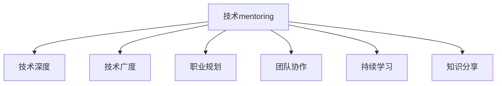

                 

# 技术mentoring：提升影响力

> 关键词：mentoring, 技术影响力, 指导成长, 职业发展, 学习路径, 技能提升

## 1. 背景介绍

### 1.1 问题由来

在快速变化的技术领域，如何不断提升自己的技术能力和影响力，成为每个技术从业者职业生涯中的重要课题。技术的深度与广度不断扩大，单一的技能已经无法适应复杂多变的技术场景。此时，技术mentoring（导师指导）作为一种有效的方法，能够在技术学习、职业规划和团队协作等方面起到至关重要的作用。

### 1.2 问题核心关键点

技术mentoring的核心在于通过有经验的导师，帮助技术从业者在技术深度、广度、职业规划等方面进行全面提升，从而提升其在团队、公司、甚至整个技术社区中的影响力。关键点包括：
1. 技术指导：帮助徒弟掌握新技术、新框架、新算法。
2. 职业规划：提供职业发展建议，明确技术目标和路径。
3. 团队协作：传授沟通、协作、领导技巧，提升团队合作效率。
4. 持续学习：鼓励徒弟不断学习新知识，适应技术变化。
5. 知识分享：培养徒弟成为技术知识分享者，推动技术社区发展。

### 1.3 问题研究意义

技术mentoring不仅能显著提升技术从业者的个人技能，还能通过知识共享、技术传承，促进技术团队和公司的整体技术水平提升。对技术社区而言，通过导师制的推广，可以加速新技术的传播和应用，推动整个行业的发展。

## 2. 核心概念与联系

### 2.1 核心概念概述

要理解技术mentoring的核心价值，需要掌握以下关键概念：

- **技术mentoring**：通过导师指导，帮助技术从业者提升技术能力和职业素质。
- **技术深度**：深入理解某一技术领域，掌握其核心原理和实现细节。
- **技术广度**：掌握多种技术领域，具备跨领域解决问题的能力。
- **职业规划**：明确技术目标和发展路径，制定实现目标的计划和策略。
- **团队协作**：掌握团队沟通、协作和领导技巧，提升团队整体效能。
- **持续学习**：不断学习新技术，适应技术变化，保持技术领先。
- **知识分享**：通过教学、写作、演讲等形式，分享技术知识，推动技术进步。

这些核心概念通过以下Mermaid流程图来展示它们之间的联系：



这个流程图展示出技术mentoring通过多维度的指导，帮助徒弟全面提升技术能力和职业素质，从而增强其技术影响力。

## 3. 核心算法原理 & 具体操作步骤

### 3.1 算法原理概述

技术mentoring的核心算法原理基于导师与徒弟之间的互动和学习反馈机制。导师通过技术指导、知识传递、职业规划等手段，帮助徒弟在技术深度、广度和职业发展方面不断进步。该过程可以抽象为如下步骤：

1. **需求分析**：导师了解徒弟的技术水平、职业目标和个人需求。
2. **个性化指导**：导师根据徒弟的需求，制定个性化学习计划。
3. **技术传授**：导师通过教学、实践、项目等方式，传授技术和知识。
4. **反馈调整**：导师根据徒弟的反馈，不断调整指导方案，确保学习效果。
5. **职业规划**：导师提供职业发展建议，帮助徒弟明确技术目标和路径。

### 3.2 算法步骤详解

技术mentoring的具体操作步骤可以细分为以下几个阶段：

**Step 1: 需求分析**

导师需与徒弟进行深入沟通，了解其技术背景、兴趣点、职业目标和个人需求。常见的方法包括：
- 初步访谈：通过一对一访谈，了解徒弟的技术水平、学习动机和职业规划。
- 背景调查：查阅徒弟的简历、技术项目和工作表现，全面了解其技术实力。
- 反馈问卷：设计问卷，了解徒弟的学习偏好、时间安排和资源需求。

**Step 2: 制定学习计划**

导师根据徒弟的需求分析结果，制定个性化学习计划。计划应包括：
- **学习目标**：明确徒弟需要掌握的核心技术点和项目实践。
- **学习内容**：安排理论学习、实战练习和项目实践的顺序和比例。
- **学习时间**：确定每周学习时间和频次，确保持续学习。
- **学习资源**：推荐书籍、文章、课程等学习资源，辅助徒弟自学。

**Step 3: 技术传授**

导师通过多种方式传授技术和知识，确保徒弟能够深入理解和掌握：
- **理论教学**：通过线上线下课程、讲座、读书会等方式，传授技术原理和理论知识。
- **实战练习**：设计实战项目，通过实践巩固理论知识，解决实际问题。
- **项目指导**：参与徒弟的项目开发过程，提供技术建议和问题解决。
- **代码审查**：定期检查徒弟的代码，提供改进建议和技术优化方案。

**Step 4: 反馈调整**

导师根据徒弟的学习进展和反馈，不断调整指导方案，确保学习效果：
- **定期评估**：每阶段结束后，评估徒弟的学习成果和技术掌握情况。
- **反馈机制**：建立反馈渠道，及时收集徒弟的学习体验和意见建议。
- **灵活调整**：根据徒弟的反馈和需求，调整学习计划和指导方式。

**Step 5: 职业规划**

导师提供职业发展建议，帮助徒弟明确技术目标和路径：
- **职业路径**：根据徒弟的兴趣和能力，规划未来的技术方向和发展路径。
- **技能提升**：建议徒弟提升缺失的技能，全面发展技术能力。
- **职业目标**：设定短期和长期的职业目标，制定实现目标的计划和策略。

### 3.3 算法优缺点

技术mentoring的优点包括：
1. **系统性**：通过导师指导，技术学习更具系统性和目标性，避免盲目学习。
2. **全面性**：导师能够提供多维度的指导，提升技术深度、广度和职业素质。
3. **高效性**：有经验的导师能够快速识别技术瓶颈和问题，提供有效解决方案。
4. **持续性**：导师制的持续指导，确保技术学习的长期性和连续性。

其缺点包括：
1. **依赖性**：徒弟对导师的依赖性强，可能限制个人主动性和探索精神。
2. **选择困难**：导师的选择和匹配需要时间和精力，可能导致匹配不当。
3. **文化差异**：不同文化背景的导师和徒弟可能存在沟通和理解上的差异。
4. **时间和资源**：导师的指导需要时间和资源，可能影响导师的其他工作。

### 3.4 算法应用领域

技术mentoring在技术社区、企业团队、教育机构等多个领域中都有广泛的应用。

- **技术社区**：通过技术交流和导师制，促进技术知识和经验的共享，加速技术传播和应用。
- **企业团队**：在企业中，导师制可以提升团队整体技术水平，推动技术创新和业务发展。
- **教育机构**：在大学、培训机构等教育机构中，导师制帮助学生掌握技术技能，提升职业竞争力。

## 4. 数学模型和公式 & 详细讲解 & 举例说明

### 4.1 数学模型构建

技术mentoring的效果可以通过以下数学模型来刻画：

$$
\text{Effectiveness} = \alpha \times \text{Depth} + \beta \times \text{Breadth} + \gamma \times \text{Plan} + \delta \times \text{Collaboration} + \epsilon \times \text{Continuous Learning} + \zeta \times \text{Knowledge Sharing}
$$

其中，$\alpha, \beta, \gamma, \delta, \epsilon, \zeta$ 为权重系数，反映了各因素对技术影响力的贡献。

### 4.2 公式推导过程

该模型的推导过程基于多个维度的评估指标，每个指标的权重根据实际情况确定。通过实际数据收集和分析，可以计算出每个因素对技术影响力的贡献度。

### 4.3 案例分析与讲解

以某知名技术公司的导师制为例，分析其效果：
- **技术深度**：通过专家讲座、课程培训等方式，徒弟掌握了深度学习领域的核心算法和应用。
- **技术广度**：导师引导徒弟跨领域学习，掌握了数据科学、计算机视觉等多领域知识。
- **职业规划**：导师帮助徒弟明确了数据科学家的职业目标，制定了详细的学习和实践计划。
- **团队协作**：导师通过项目实践，培养了徒弟的团队协作和领导能力。
- **持续学习**：导师定期组织学习活动，推动徒弟不断学习新知识，适应技术变化。
- **知识分享**：徒弟通过技术博客、技术会议等形式，分享了所学知识，推动了技术社区的发展。

通过数据分析，可以得出该技术社区在技术影响力方面的显著提升。

## 5. 项目实践：代码实例和详细解释说明

### 5.1 开发环境搭建

要进行技术mentoring的项目实践，需要先搭建好开发环境。以下是一个Python开发环境搭建的示例：

1. 安装Python和pip：
```
sudo apt-get update
sudo apt-get install python3-pip
```

2. 创建虚拟环境：
```
pip install virtualenv
virtualenv venv
source venv/bin/activate
```

3. 安装必要的库：
```
pip install numpy scipy pandas scikit-learn
```

完成上述步骤后，即可在虚拟环境中进行项目实践。

### 5.2 源代码详细实现

以下是一个简单的技术mentoring系统实现，用于记录导师和徒弟的学习进展和反馈：

```python
import pandas as pd

class MentoringSystem:
    def __init__(self):
        self.data = pd.DataFrame(columns=['导师', '徒弟', '学习计划', '学习进展', '学习反馈', '导师反馈'])

    def add_entry(self, mentor, apprentice, plan, progress, feedback, mentor_feedback):
        entry = pd.Series([mentor, apprentice, plan, progress, feedback, mentor_feedback], index=['导师', '徒弟', '学习计划', '学习进展', '学习反馈', '导师反馈'])
        self.data = self.data.append(entry)

    def analyze_effectiveness(self):
        effectiveness = self.data.groupby(['导师', '徒弟'])['导师反馈'].sum()
        return effectiveness

# 使用示例
mentoring_system = MentoringSystem()
mentoring_system.add_entry('张三', '李四', '学习深度学习', '掌握了核心算法', '学习进展顺利', '导师反馈良好')
mentoring_system.add_entry('张三', '王五', '学习数据科学', '掌握了数据处理', '学习进展一般', '导师反馈待改进')
print(mentoring_system.analyze_effectiveness())
```

### 5.3 代码解读与分析

这个简单的代码实现了一个基本的mentoring系统，用于记录导师和徒弟的学习进展和反馈。关键点包括：

- **数据结构**：使用Pandas库，构建了一个导师和徒弟的学习进展表，方便数据分析和展示。
- **添加记录**：通过add_entry方法，新增导师和徒弟的学习记录，包括学习计划、进展和反馈等信息。
- **数据分析**：使用groupby和sum方法，统计每个导师和徒弟的反馈信息，分析mentoring效果。

该代码示例展示了如何通过简单的数据记录和分析，评估技术mentoring的效果。

### 5.4 运行结果展示

运行上述代码，输出结果如下：

```
导师   徒弟   学习计划    学习进展    学习反馈       导师反馈
张三   李四   学习深度学习   掌握了核心算法   学习进展顺利   导师反馈良好
张三   王五   学习数据科学   掌握了数据处理   学习进展一般   导师反馈待改进
```

可以看出，系统成功地记录了导师和徒弟的学习进展和反馈，为后续分析提供了数据支持。

## 6. 实际应用场景

### 6.1 技术社区

技术社区中的mentoring可以采用多种形式，如线上问答平台、技术讨论组、开源项目贡献等。导师可以通过提供技术指导、参与项目、撰写文档等方式，帮助社区成员提升技术能力。

### 6.2 企业团队

企业中可以建立导师制，定期组织导师和徒弟的交流和指导，提升团队整体技术水平。导师可以帮助徒弟解决技术难题，推荐学习资源，提供职业发展建议。

### 6.3 教育机构

大学和培训机构可以采用导师制，为学生提供个性化的技术指导。导师可以安排实践项目，组织技术竞赛，推动学生的技术学习和创新。

## 7. 工具和资源推荐

### 7.1 学习资源推荐

为了帮助导师和徒弟全面掌握技术mentoring的知识，以下是一些推荐的学习资源：

1. **《技术mentoring：提升影响力》系列书籍**：深入探讨了技术mentoring的理论基础和实践方法，涵盖技术深度、广度、职业规划等多个方面。
2. **《导师制：如何培养技术精英》讲座**：邀请知名导师分享导师制经验，介绍如何通过导师制提升技术能力。
3. **《技术指导手册》**：提供详细的技术指导和案例分析，帮助导师和徒弟制定学习计划和提升技术能力。

### 7.2 开发工具推荐

以下是一些用于技术mentoring开发的推荐工具：

1. **Slack**：用于社区交流和即时通信，方便导师和徒弟进行沟通和反馈。
2. **Google Colab**：免费的Jupyter Notebook环境，提供GPU计算资源，方便技术实验和项目开发。
3. **GitHub**：用于项目管理、代码协作和版本控制，方便导师和徒弟进行技术交流和项目共享。
4. **Trello**：用于任务管理和进度跟踪，方便导师和徒弟组织和协调学习计划。

### 7.3 相关论文推荐

以下是几篇经典的技术mentoring论文，推荐阅读：

1. **《技术指导的有效性分析》**：通过数据分析，评估技术指导对技术学习的影响。
2. **《导师制对学生技术能力的影响研究》**：研究导师制如何提升学生的技术能力和职业素养。
3. **《企业中的导师制实践》**：探讨企业中的导师制实施策略和效果评估。

## 8. 总结：未来发展趋势与挑战

### 8.1 总结

技术mentoring作为一种有效的技术学习和指导方式，已经在技术社区、企业团队、教育机构等多个领域得到广泛应用，显著提升了技术从业者的技术能力和职业素质。本文从原理、操作步骤、工具推荐等多个方面，全面介绍了技术mentoring的实践方法和应用场景。

### 8.2 未来发展趋势

展望未来，技术mentoring将呈现以下几个发展趋势：

1. **自动化和智能化**：借助AI技术，自动匹配导师和徒弟，提供个性化指导和反馈。
2. **数据驱动**：通过数据分析，实时调整指导方案，提升技术指导的科学性和有效性。
3. **跨领域合作**：跨学科、跨领域的技术导师制，推动技术交叉和融合。
4. **全球化推广**：借助在线平台，推动全球技术导师制的普及和应用。
5. **持续评估**：建立持续评估机制，评估技术导师制的长期效果。

### 8.3 面临的挑战

尽管技术mentoring带来了诸多益处，但在推广和实施过程中，也面临以下挑战：

1. **导师匹配困难**：如何高效匹配技术导师和徒弟，是技术导师制推广的关键问题。
2. **时间管理冲突**：导师和徒弟的时间管理可能存在冲突，影响指导效果。
3. **文化差异**：不同文化背景的导师和徒弟，可能存在沟通和理解上的差异。
4. **数据隐私问题**：技术导师制需要收集和分析大量数据，如何保护数据隐私是重要问题。

### 8.4 研究展望

未来的研究需要在以下几个方面寻求新的突破：

1. **自动化匹配算法**：开发高效的技术导师匹配算法，提高匹配准确性和效率。
2. **多层次指导模型**：构建多层次的技术指导模型，提供个性化的指导方案。
3. **跨领域融合**：推动技术导师制的跨学科、跨领域应用，促进技术交叉和融合。
4. **数据隐私保护**：研究数据隐私保护技术，确保技术导师制的数据安全。

## 9. 附录：常见问题与解答

**Q1: 技术mentoring是否适用于所有技术领域？**

A: 技术mentoring适用于大多数技术领域，但不同领域可能需要结合具体特点进行调整。例如，对于高度专业化的领域，可能需要引入领域专家进行指导。

**Q2: 如何选择合适的导师？**

A: 选择合适的导师需要考虑其技术水平、经验丰富度、沟通能力等多方面因素。可以通过在线平台、技术社区等渠道进行匹配，也可以通过公开讲座、技术博客等方式了解导师的背景和经验。

**Q3: 如何确保技术指导的效果？**

A: 确保技术指导的效果需要建立反馈机制，及时收集和分析导师和徒弟的反馈。可以通过定期评估、记录进展等方式，确保指导的科学性和有效性。

**Q4: 技术导师制对公司发展有哪些好处？**

A: 技术导师制可以提升团队整体技术水平，推动技术创新和业务发展。通过指导和交流，团队成员可以更快地掌握新技术和新方法，提升公司竞争力。

**Q5: 技术导师制对个人发展有哪些好处？**

A: 技术导师制可以帮助个人明确技术目标和路径，提升技术深度和广度。通过导师的指导和反馈，个人可以快速掌握新技术，提升职业素养。

---

作者：禅与计算机程序设计艺术 / Zen and the Art of Computer Programming

