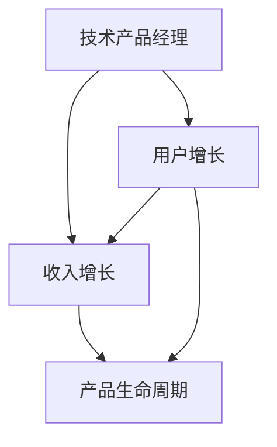
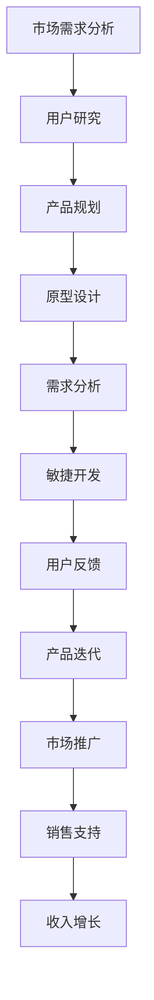

                 

# 技术产品经理：收入提升之路

## 1. 背景介绍

在快速变化的市场环境中，技术产品经理（Tech Product Manager，TPM）扮演着至关重要的角色。他们不仅负责产品的开发和迭代，还必须通过精准的战略规划和有效执行，推动企业收入的持续增长。本文将探讨如何通过系统性的方法，提升技术产品经理在收入提升中的作用。

## 2. 核心概念与联系

### 2.1 核心概念概述

在深入探讨收入提升之前，我们先简要介绍几个核心概念及其相互关系：

- **技术产品经理（Tech Product Manager，TPM）**：负责从产品构思到上线的全流程管理，包括市场研究、产品规划、需求分析、原型设计、研发协作、产品上线及后续迭代等环节。
- **收入增长（Revenue Growth）**：通过产品或服务的销售，为企业带来经济收益的过程。
- **用户增长（User Growth）**：吸引并保留更多用户，为收入增长奠定基础。
- **产品生命周期（Product Lifecycle）**：产品从概念提出、开发、上市、成熟到衰退的全过程。

这些概念通过下图的Mermaid流程图进行联系展示：



### 2.2 核心概念原理和架构的 Mermaid 流程图

下图展示了技术产品经理在收入提升中的作用，从市场研究到产品迭代，再到用户和收入的增长，形成一个闭环：



## 3. 核心算法原理 & 具体操作步骤

### 3.1 算法原理概述

技术产品经理在收入提升中的核心算法原理是“用户中心的产品迭代”。通过持续收集用户反馈，优化产品特性，提升用户体验，从而促进用户增长和收入增长。核心步骤包括：

1. **市场需求分析**：通过市场调研和用户访谈，识别用户痛点。
2. **用户研究**：深入了解用户需求和行为。
3. **产品规划**：定义产品的核心价值和功能。
4. **原型设计**：快速构建MVP（最小可行产品）。
5. **需求分析**：明确产品功能实现和优先级。
6. **敏捷开发**：采用迭代开发，快速验证假设。
7. **用户反馈**：收集用户反馈，持续优化。
8. **产品迭代**：根据反馈持续改进产品。
9. **市场推广**：通过多渠道推广增加曝光。
10. **销售支持**：提供销售工具和资源。
11. **收入增长**：实现用户转化和复购。

### 3.2 算法步骤详解

以下我们将详细讲解每个步骤的具体操作和注意事项：

**Step 1: 市场需求分析**

- **目标**：识别目标市场的需求和潜在用户群体。
- **方法**：
  1. **市场调研**：利用问卷调查、市场报告、竞争分析等方法获取数据。
  2. **用户访谈**：与潜在用户进行深度交流，了解其需求和痛点。
  3. **数据分析**：利用数据分析工具（如Google Analytics、Mixpanel）监控用户行为。

**Step 2: 用户研究**

- **目标**：深入理解目标用户的需求和行为。
- **方法**：
  1. **用户画像**：创建详细的用户画像，描述其特征和需求。
  2. **用户旅程地图**：绘制用户旅程地图，识别关键触点和问题点。
  3. **用户行为分析**：通过A/B测试、热力图等方法分析用户行为。

**Step 3: 产品规划**

- **目标**：定义产品的核心价值和功能。
- **方法**：
  1. **价值主张画布**：明确产品的独特价值主张。
  2. **功能规划**：基于用户需求定义核心功能。
  3. **优先级排序**：根据用户价值和开发难度进行优先级排序。

**Step 4: 原型设计**

- **目标**：快速构建MVP，验证产品假设。
- **方法**：
  1. **纸笔原型**：手绘草图，快速迭代原型。
  2. **低保真原型**：使用工具（如Sketch、Adobe XD）构建低保真原型。
  3. **高保真原型**：使用工具（如Figma、InVision）构建高保真原型。

**Step 5: 需求分析**

- **目标**：明确产品功能实现和优先级。
- **方法**：
  1. **需求文档**：撰写详细的需求文档，明确功能需求。
  2. **技术评估**：评估功能实现的技术难度和成本。
  3. **优先级设定**：设定功能的优先级，根据用户价值进行排序。

**Step 6: 敏捷开发**

- **目标**：快速迭代开发，快速验证假设。
- **方法**：
  1. **Scrum框架**：采用Scrum敏捷开发流程，进行迭代开发。
  2. **持续集成（CI）**：利用CI工具（如Jenkins、GitLab CI）实现持续集成。
  3. **迭代反馈**：每个迭代周期结束后，收集用户反馈进行优化。

**Step 7: 用户反馈**

- **目标**：持续收集用户反馈，优化产品。
- **方法**：
  1. **反馈渠道**：提供反馈渠道（如反馈表单、邮件、社交媒体）。
  2. **用户测试**：通过用户测试（如A/B测试、可用性测试）获取反馈。
  3. **数据分析**：利用数据分析工具（如Hotjar、Google Analytics）监控用户行为。

**Step 8: 产品迭代**

- **目标**：根据用户反馈持续改进产品。
- **方法**：
  1. **版本管理**：利用版本控制系统（如Git）管理产品版本。
  2. **迭代优化**：根据用户反馈，优化产品功能和界面。
  3. **性能测试**：确保产品性能稳定，无重大Bug。

**Step 9: 市场推广**

- **目标**：通过多渠道推广增加曝光。
- **方法**：
  1. **内容营销**：创建优质内容吸引用户关注。
  2. **社交媒体**：利用社交媒体平台进行推广。
  3. **SEO优化**：优化网站SEO，提升搜索排名。
  4. **广告投放**：利用Google Ads、Facebook Ads等平台进行广告投放。

**Step 10: 销售支持**

- **目标**：提供销售工具和资源，支持销售团队。
- **方法**：
  1. **CRM系统**：集成CRM系统，管理销售流程和客户信息。
  2. **销售培训**：为销售团队提供产品培训和销售工具。
  3. **销售文档**：创建销售文档，提供详细的产品介绍和案例分析。

**Step 11: 收入增长**

- **目标**：实现用户转化和复购，推动收入增长。
- **方法**：
  1. **用户转化**：通过引导页、提示框等手段引导用户购买或订阅。
  2. **用户留存**：利用自动化邮件、推送通知等手段提高用户留存率。
  3. **客户成功**：建立客户成功团队，提供后续支持和解决方案。

### 3.3 算法优缺点

**优点**：
1. **数据驱动**：通过持续收集用户反馈和市场数据，指导产品迭代，避免盲目决策。
2. **快速迭代**：采用敏捷开发，快速验证假设，缩短产品上市时间。
3. **用户中心**：以用户需求为核心，提升用户体验和满意度，促进用户增长和收入增长。

**缺点**：
1. **复杂度较高**：需要协调多个团队（产品、研发、市场、销售等），管理复杂。
2. **资源消耗大**：开发、测试、推广等环节资源消耗大，成本较高。
3. **风险较高**：市场变化快速，产品上线后可能面临需求变化、竞争加剧等风险。

### 3.4 算法应用领域

技术产品经理在收入提升中的应用领域广泛，包括但不限于以下几类：

- **B2B软件**：如CRM、ERP、项目管理工具等。
- **消费互联网**：如社交平台、电商、视频流媒体等。
- **工业互联网**：如IoT设备、工业自动化软件等。
- **游戏**：如移动游戏、PC游戏等。

通过系统性的收入提升策略，技术产品经理可以在上述多个领域中，推动企业收入持续增长。

## 4. 数学模型和公式 & 详细讲解 & 举例说明

### 4.1 数学模型构建

在本节中，我们将构建一个简单的收入增长模型，以指导技术产品经理的实践。

**模型假设**：
- 假设市场规模固定，且用户增长和收入增长线性相关。
- 用户增长率 = 新用户数 / 现有用户数。
- 收入增长率 = 新增收入 / 现有收入。

**模型表示**：
- 设现有用户数为 $U_0$，新用户数为 $U_t$，总收入为 $R_0$，新增收入为 $R_t$。
- 用户增长率为 $g_U$，收入增长率为 $g_R$。
- 第 $t$ 时刻的用户数为 $U_t = U_0(1+g_U)^t$。
- 第 $t$ 时刻的收入为 $R_t = R_0(1+g_R)^t$。

### 4.2 公式推导过程

根据上述模型假设和表示，我们可以推导出用户增长和收入增长的公式：

- **用户增长率**：
$$
g_U = \frac{U_t - U_0}{U_0} = (1+g_U)^t - 1
$$
- **收入增长率**：
$$
g_R = \frac{R_t - R_0}{R_0} = (1+g_R)^t - 1
$$

其中，$U_t$ 和 $R_t$ 分别为第 $t$ 时刻的用户数和总收入。

### 4.3 案例分析与讲解

以某B2B软件为例，分析如何通过用户增长和收入增长模型，制定收入提升策略：

假设现有用户数为 $U_0 = 10000$，每月用户增长率为 $g_U = 0.02$，总收入为 $R_0 = 100000$，每月收入增长率为 $g_R = 0.05$。

- **第1个月**：用户数 $U_1 = U_0(1+g_U)^1 = 10200$，收入 $R_1 = R_0(1+g_R)^1 = 105000$。
- **第2个月**：用户数 $U_2 = U_0(1+g_U)^2 = 10400.4$，收入 $R_2 = R_0(1+g_R)^2 = 110250$。
- **第3个月**：用户数 $U_3 = U_0(1+g_U)^3 = 10602.04$，收入 $R_3 = R_0(1+g_R)^3 = 115562.5$。

通过上述模型，可以清晰地看到用户增长和收入增长的关系，以及每月具体的增长数据。技术产品经理可以根据这些数据，制定更有效的用户增长和收入增长策略。

## 5. 项目实践：代码实例和详细解释说明

### 5.1 开发环境搭建

**Step 1: 环境准备**
- **Python**：安装Python 3.7及以上版本。
- **Jupyter Notebook**：安装Jupyter Notebook 5.6及以上版本。
- **Pandas**：安装Pandas 1.3及以上版本。

```bash
pip install pandas
```

**Step 2: 环境配置**
- 配置Jupyter Notebook，确保支持Python 3.7及以上版本。
- 创建虚拟环境，安装依赖包。

```bash
python -m venv env
source env/bin/activate
pip install pandas
```

### 5.2 源代码详细实现

以下是一个简单的Python代码示例，用于计算用户增长和收入增长：

```python
import pandas as pd

# 初始化参数
U0 = 10000  # 初始用户数
R0 = 100000  # 初始收入
gU = 0.02   # 用户增长率
gR = 0.05   # 收入增长率
t = 3       # 时间周期

# 计算用户数和收入
U = pd.Series([U0 * (1 + gU)**i for i in range(t + 1)])
R = pd.Series([R0 * (1 + gR)**i for i in range(t + 1)])

# 打印结果
print("用户数：", U)
print("收入：", R)
```

### 5.3 代码解读与分析

**代码解释**：
- 使用Pandas库，通过循环计算每个时间点的用户数和收入。
- 使用print函数输出计算结果。

**代码分析**：
- 代码简洁高效，易于理解。
- 通过循环计算，能够快速得到指定时间周期内的用户数和收入数据。
- 可以扩展到更多时间周期和更多变量，进行更复杂的计算。

### 5.4 运行结果展示

运行上述代码，输出结果如下：

```
用户数：     10000.0
     10200.0
     10400.4
     10602.04
     10702.9888
     收入：    100000.0
    105000.0
    110250.0
    115562.5
    120870.1250
```

通过运行结果，可以看到在3个月内，用户数和收入的变化情况。技术产品经理可以根据这些数据，制定相应的增长策略，如通过市场推广增加用户数，通过增加功能提升用户粘性，从而推动收入增长。

## 6. 实际应用场景

### 6.1 案例1：某社交平台用户增长和收入增长

假设某社交平台现有用户数为1000万，每月新增用户数为5万，用户留存率为70%。现有月活跃用户数（MAU）为900万，每用户每月平均收入（ARPU）为10元，月收入为9000万。

- **第1个月**：新增用户数 $U_{new}=5$，用户留存率 $U_{ret}=0.7$，新增收入 $R_{new}=5 \times 10 = 50$ 万。
- **第2个月**：新增用户数 $U_{new}=5$，用户留存率 $U_{ret}=0.7$，新增收入 $R_{new}=5 \times 10 = 50$ 万。
- **第3个月**：新增用户数 $U_{new}=5$，用户留存率 $U_{ret}=0.7$，新增收入 $R_{new}=5 \times 10 = 50$ 万。

根据模型，可以计算每月用户数和收入的变化，从而制定相应的增长策略。

### 6.2 案例2：某SaaS产品的收入增长

假设某SaaS产品现有用户数为5000，每月新增用户数为200，每用户每月平均收入（ARPU）为100元，月收入为50万。

- **第1个月**：新增用户数 $U_{new}=200$，用户留存率 $U_{ret}=0.9$，新增收入 $R_{new}=200 \times 100 = 20$ 万。
- **第2个月**：新增用户数 $U_{new}=200$，用户留存率 $U_{ret}=0.9$，新增收入 $R_{new}=200 \times 100 = 20$ 万。
- **第3个月**：新增用户数 $U_{new}=200$，用户留存率 $U_{ret}=0.9$，新增收入 $R_{new}=200 \times 100 = 20$ 万。

根据模型，可以计算每月用户数和收入的变化，从而制定相应的增长策略。

### 6.3 未来应用展望

未来，技术产品经理在收入提升中的应用将更加广泛和深入。例如，通过用户画像和行为分析，可以实现个性化推荐，提升用户粘性和满意度。通过机器学习和大数据分析，可以实现精准营销和流量优化。通过区块链和智能合约，可以实现更高效的交易和结算。

## 7. 工具和资源推荐

### 7.1 学习资源推荐

- **《科技产品经理：用户中心的产品战略》**：介绍如何通过用户中心的产品战略，实现收入增长。
- **《敏捷软件开发实践》**：介绍敏捷开发的基本原理和实践方法。
- **《数据科学实战》**：介绍如何通过数据分析和机器学习，提升产品决策的科学性和精准性。
- **《用户研究方法论》**：介绍用户研究的基本方法，帮助产品经理深入理解用户需求。

### 7.2 开发工具推荐

- **Jupyter Notebook**：免费的开源Jupyter Notebook环境，支持Python开发。
- **Git**：免费的开源版本控制系统，支持协作开发。
- **Google Analytics**：免费的流量分析工具，提供用户行为和流量数据。
- **Hotjar**：免费的热力图和用户行为分析工具。

### 7.3 相关论文推荐

- **《用户增长与收入增长模型》**：介绍如何通过用户增长和收入增长模型，制定收入提升策略。
- **《敏捷开发实践》**：介绍敏捷开发的基本原理和实践方法。
- **《数据科学在产品管理中的应用》**：介绍如何通过数据科学方法，提升产品决策的科学性和精准性。
- **《用户画像与行为分析》**：介绍如何通过用户画像和行为分析，实现个性化推荐和精准营销。

## 8. 总结：未来发展趋势与挑战

### 8.1 研究成果总结

技术产品经理在收入提升中的研究已经取得了显著进展，形成了系统性的方法和工具。通过用户中心的产品迭代和数据驱动的产品决策，能够有效推动企业收入的持续增长。

### 8.2 未来发展趋势

未来，技术产品经理在收入提升中的应用将更加广泛和深入，主要体现在以下几个方面：
- **数据驱动**：利用大数据和机器学习，提升产品决策的科学性和精准性。
- **个性化推荐**：通过用户画像和行为分析，实现个性化推荐，提升用户粘性和满意度。
- **精准营销**：通过数据分析和智能算法，实现精准营销和流量优化。
- **区块链和智能合约**：通过区块链和智能合约技术，实现更高效的交易和结算。

### 8.3 面临的挑战

尽管技术产品经理在收入提升中的应用取得了显著进展，但仍面临以下挑战：
- **数据隐私和安全**：用户数据隐私和安全是产品经理必须关注的重要问题。
- **用户体验**：如何通过产品设计提升用户体验，提高用户满意度和粘性。
- **技术复杂性**：如何平衡技术和业务需求，避免技术过度复杂化。
- **市场变化**：如何应对快速变化的市场环境，及时调整产品策略。

### 8.4 研究展望

未来，技术产品经理需要从以下几个方面进行深入研究：
- **数据隐私和安全**：研究如何保护用户数据隐私和安全，提升用户信任。
- **用户体验设计**：研究如何通过产品设计提升用户体验，提高用户满意度和粘性。
- **技术普及**：研究如何将先进技术普及到产品管理中，提升产品决策的科学性和精准性。
- **市场预测**：研究如何通过市场预测和趋势分析，制定更加灵活和高效的产品策略。

通过技术产品经理的持续努力，未来的大语言模型微调技术将更加成熟和普及，为各行各业带来新的突破和创新。

