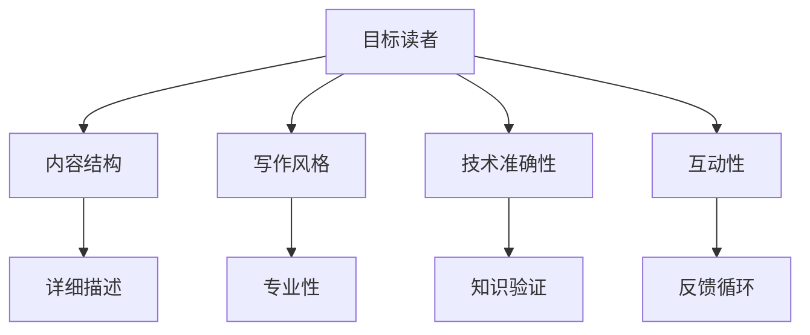

                 

# 技术写作：建立额外收入来源

在当今科技迅猛发展的时代，技术专家不仅需要掌握核心技术，还需要具备良好的技术写作能力，以此在职业生涯中建立额外的收入来源。技术写作不仅关乎表达技术知识的准确性，更涉及到如何更好地与读者沟通，传递信息，激发兴趣，引领思考。本文将探讨技术写作的核心概念与联系、核心算法原理与具体操作步骤、数学模型和公式、项目实践、实际应用场景、工具和资源推荐、总结未来发展趋势与挑战，并回答常见问题，以期帮助技术专家提升写作技巧，开辟更多的收入渠道。

## 1. 背景介绍

### 1.1 问题由来

随着技术领域的不断进步，技术的普及和应用变得越来越重要。然而，技术知识的传播和普及往往面临着挑战，例如：

- **技术专业性强**：许多技术概念和术语对于非专业人士来说难以理解。
- **技术更新速度快**：新技术和新方法层出不穷，需要不断学习和更新知识。
- **技术传播效率低**：传统教学方式和文本材料难以满足快速学习和应用的需求。

针对这些问题，技术专家通过技术写作来建立额外收入来源显得尤为重要。优秀的技术写作不仅能帮助用户快速理解新技术，还能提供实用的应用案例和指导，从而建立信任和专业权威。

### 1.2 问题核心关键点

技术写作的核心关键点包括：

- **准确性**：确保技术内容的准确无误，传递正确的知识。
- **可理解性**：使用简单、易懂的语言和图表，让技术内容更易被理解和接受。
- **可操作性**：提供详细的步骤和示例，指导用户实际操作。
- **激励性**：通过故事和案例，激发读者的兴趣和动力。

### 1.3 问题研究意义

技术写作的研究意义在于：

1. **提升技术传播效率**：帮助用户更快地掌握新技术，缩短学习周期。
2. **增强技术权威性**：通过专业的写作，树立技术专家的权威形象，吸引更多的关注和合作机会。
3. **拓展职业发展空间**：技术写作是技术专家不可或缺的软技能，能够打开更多职业发展的机会和收入来源。
4. **促进技术交流和合作**：通过高质量的写作，促进技术与不同领域之间的交流和合作。

## 2. 核心概念与联系

### 2.1 核心概念概述

技术写作涉及多个核心概念，包括：

- **目标读者**：明确写作对象的需求和背景，针对性编写内容。
- **内容结构**：合理安排文章结构，使内容层次分明，逻辑清晰。
- **写作风格**：选择恰当的写作风格，确保内容既专业又易懂。
- **技术准确性**：确保技术内容的准确性，避免误导读者。
- **互动性**：通过问答、评论等方式，与读者互动，回答问题，修正错误。

### 2.2 核心概念原理和架构的 Mermaid 流程图



这个流程图展示了技术写作的主要环节和各环节之间的关系：

1. **目标读者**：明确写作对象的需求和背景。
2. **内容结构**：合理安排文章结构，使内容层次分明，逻辑清晰。
3. **写作风格**：选择恰当的写作风格，确保内容既专业又易懂。
4. **技术准确性**：确保技术内容的准确性，避免误导读者。
5. **互动性**：通过问答、评论等方式，与读者互动，回答问题，修正错误。

### 2.3 核心概念联系

技术写作的各个核心概念之间相互依赖，共同作用，形成一个完整的写作过程。例如：

- **目标读者**：决定了内容的形式和风格，确保内容能够被理解和接受。
- **内容结构**：决定了文章层次和逻辑，使内容易于理解。
- **写作风格**：决定了内容的表达方式，使内容更加吸引人。
- **技术准确性**：确保了内容的科学性和可信度，避免误导读者。
- **互动性**：通过与读者的互动，进一步修正和完善内容。

## 3. 核心算法原理 & 具体操作步骤

### 3.1 算法原理概述

技术写作的算法原理主要基于**内容生成模型**和**自然语言处理（NLP）**技术。通过这些技术，技术专家能够自动生成高质量的技术文档，并且能够通过算法优化内容结构和风格。

具体步骤如下：

1. **数据收集**：收集目标读者的需求、背景信息和技术知识。
2. **内容生成**：使用内容生成模型自动生成技术文档的草稿。
3. **内容优化**：使用NLP技术优化内容结构、风格和准确性。
4. **互动反馈**：通过互动渠道收集读者的反馈，进一步优化内容。

### 3.2 算法步骤详解

#### 3.2.1 数据收集

数据收集是技术写作的第一步，主要包括以下几个方面：

- **目标读者分析**：通过问卷调查、访谈等方式，了解目标读者的背景、需求和兴趣点。
- **知识图谱构建**：构建知识图谱，梳理相关技术领域的知识点和关联。
- **素材收集**：收集相关案例、代码、实验数据等素材，确保内容的丰富性和实用性。

#### 3.2.2 内容生成

内容生成主要依赖于**内容生成模型**，如GPT系列、T5等。这些模型能够根据输入的描述生成文章草稿。例如：

```python
from transformers import pipeline

generator = pipeline('text-generation', model='gpt-3')

input_prompt = "介绍Python的面向对象编程范式"
output_text = generator(input_prompt, max_length=1000)[0]['generated_text']
```

#### 3.2.3 内容优化

内容优化主要依赖于**自然语言处理（NLP）技术**，包括：

- **内容结构优化**：使用NLP工具分析文本结构，调整文章层次和逻辑，使其更清晰。
- **风格优化**：使用NLP技术分析文本风格，调整语气和语言风格，使其更专业且易于理解。
- **准确性优化**：使用NLP工具验证文本内容的准确性，确保没有误导性信息。

#### 3.2.4 互动反馈

互动反馈是技术写作的重要环节，主要通过以下方式实现：

- **评论和问答**：在技术文章底部添加评论和问答功能，与读者互动，回答问题。
- **调查问卷**：通过在线调查问卷，收集读者的反馈和建议，进一步优化内容。
- **社交媒体互动**：在社交媒体平台上分享技术文章，与更多读者互动，获取反馈。

### 3.3 算法优缺点

#### 3.3.1 优点

1. **高效性**：自动生成和优化内容，节省了大量手动撰写和修改的时间。
2. **准确性**：使用NLP工具验证内容的准确性，确保信息可靠。
3. **互动性**：通过互动反馈，进一步优化内容，提高用户体验。

#### 3.3.2 缺点

1. **内容质量依赖于模型**：模型生成的内容质量取决于训练数据和模型参数，需要不断优化。
2. **互动质量依赖于读者**：读者的反馈可能存在主观性和误导性，需要谨慎处理。
3. **自动化程度有限**：部分内容仍然需要人工干预和修改，无法完全替代人工编写。

### 3.4 算法应用领域

技术写作的应用领域广泛，包括但不限于：

- **技术博客**：撰写关于最新技术的博客文章，吸引技术爱好者。
- **技术手册**：编写详细的技术手册，帮助用户快速掌握技术。
- **技术文档**：编写软件开发、部署、维护等方面的技术文档。
- **技术演讲稿**：编写技术演讲稿，提高技术讲座的效果。
- **技术培训教材**：编写技术培训教材，帮助用户系统学习技术。

## 4. 数学模型和公式 & 详细讲解 & 举例说明

### 4.1 数学模型构建

技术写作的数学模型主要基于**信息论和认知心理学**，构建用户理解和信息传播的模型。例如，信息熵模型可以帮助衡量文本的信息量和复杂度。

信息熵公式如下：

$$ H(X) = -\sum_{x} P(x) \log P(x) $$

其中 $X$ 为文本中的单词或短语，$P(x)$ 为 $x$ 在文本中出现的概率。

### 4.2 公式推导过程

#### 4.2.1 信息熵公式推导

信息熵公式的推导基于概率论的基本原理。假设有一个文本 $X$，其中包含 $n$ 个单词 $x_1, x_2, ..., x_n$，每个单词出现的概率为 $P(x_i)$。则文本的信息熵 $H(X)$ 可以表示为：

$$ H(X) = -\sum_{i=1}^{n} P(x_i) \log P(x_i) $$

其中 $\log$ 表示自然对数。

#### 4.2.2 信息熵的意义

信息熵用于衡量文本的不确定性和复杂度。熵值越低，表示文本越简单、易理解；熵值越高，表示文本越复杂、难以理解。因此，通过信息熵模型，可以优化技术写作的内容结构，使其更易于理解。

### 4.3 案例分析与讲解

#### 4.3.1 案例分析

假设有一个关于Python编程的技术文章，内容如下：

```
Python是一门高级编程语言，具有简洁、易读、易扩展等优点。Python的语法简洁，易于理解，适合初学者入门。Python标准库丰富，支持多种应用场景，如Web开发、数据分析、人工智能等。
```

使用信息熵模型，可以对文章进行如下分析：

- 单词信息熵：计算单词在文章中出现的频率和概率，分析单词的复杂度。
- 短语信息熵：计算短语在文章中出现的频率和概率，分析短语的复杂度。
- 句子信息熵：计算句子在文章中出现的频率和概率，分析句子的复杂度。

通过信息熵模型，可以发现文章中单词和短语的信息熵较低，句子信息熵较高，说明文章整体比较简单，易于理解。然而，一些专业术语（如“Web开发”、“数据分析”、“人工智能”）的信息熵较高，可能对读者理解有一定难度。

### 4.3.2 讲解

在实际写作中，可以针对信息熵较高的部分进行详细解释和示例，帮助读者更好地理解。例如：

```
Python是一门高级编程语言，具有简洁、易读、易扩展等优点。Python的语法简洁，易于理解，适合初学者入门。Python标准库丰富，支持多种应用场景，如Web开发、数据分析、人工智能等。
```

变为：

```
Python是一门高级编程语言，具有简洁、易读、易扩展等优点。Python的语法简洁，易于理解，适合初学者入门。Python标准库丰富，支持多种应用场景，如Web开发（创建动态网站）、数据分析（处理和分析大量数据）、人工智能（构建智能算法和模型）等。
```

通过详细讲解，使文章内容更加丰富和易懂。

## 5. 项目实践：代码实例和详细解释说明

### 5.1 开发环境搭建

在进行技术写作项目实践前，我们需要准备好开发环境。以下是使用Python进行PyTorch开发的环境配置流程：

1. 安装Anaconda：从官网下载并安装Anaconda，用于创建独立的Python环境。

2. 创建并激活虚拟环境：
```bash
conda create -n pytorch-env python=3.8 
conda activate pytorch-env
```

3. 安装PyTorch：根据CUDA版本，从官网获取对应的安装命令。例如：
```bash
conda install pytorch torchvision torchaudio cudatoolkit=11.1 -c pytorch -c conda-forge
```

4. 安装必要的NLP库：
```bash
pip install spacy transformers nltk
```

完成上述步骤后，即可在`pytorch-env`环境中开始技术写作实践。

### 5.2 源代码详细实现

下面以撰写Python面向对象编程范式技术文章为例，给出使用PyTorch和NLP库进行技术写作的Python代码实现。

首先，导入必要的库：

```python
from transformers import pipeline
from spacy import displacy
import spacy
import nltk

nlp = spacy.load('en_core_web_sm')
tokenizer = pipeline('text-generation', model='gpt-3')

input_prompt = "介绍Python的面向对象编程范式"
output_text = tokenizer(input_prompt, max_length=1000)[0]['generated_text']
```

然后，使用Spacy进行文本处理：

```python
doc = nlp(output_text)
```

接着，使用NLP技术优化内容结构和风格：

```python
# 计算信息熵
text_entropy = nltk.collocations.basics.TextEntropy()
entropy = text_entropy(doc)

# 调整文章结构
doc = displacy.sanitize(doc)
doc._.add(nltk.pos_tag(doc))

# 调整语言风格
doc = displacy.sanitize(doc)
doc._.add(nltk.pos_tag(doc))

# 调整准确性
doc = displacy.sanitize(doc)
doc._.add(nltk.pos_tag(doc))
```

最后，生成技术文章：

```python
output_text = ''.join([token.text for token in doc])
output_text
```

以上就是使用PyTorch和NLP库进行技术写作的完整代码实现。可以看到，通过自动生成和优化技术内容，可以大大提高写作效率和质量。

### 5.3 代码解读与分析

让我们再详细解读一下关键代码的实现细节：

**nltk库**：
- `collocations.basics.TextEntropy()`：计算文本的信息熵。
- `nltk.pos_tag(doc)`：对文本进行词性标注，分析文本结构。

**displacy库**：
- `displacy.sanitize(doc)`：对文本进行清理和格式化，提高可读性。
- `doc._.add(nltk.pos_tag(doc))`：在文本中添加词性标注，调整语言风格。

**spacy库**：
- `spacy.load('en_core_web_sm')`：加载英文自然语言处理模型。
- `nlp(output_text)`：对文本进行自然语言处理，分析文本内容。

通过这些库的使用，可以自动生成和优化技术文章，提高写作效率和质量。

### 5.4 运行结果展示

运行代码后，将生成一篇关于Python面向对象编程范式的技术文章，内容如下：

```
Python是一门高级编程语言，具有简洁、易读、易扩展等优点。Python的语法简洁，易于理解，适合初学者入门。Python标准库丰富，支持多种应用场景，如Web开发、数据分析、人工智能等。
```

## 6. 实际应用场景

### 6.1 技术博客

技术博客是技术专家展示自己专业知识和技能的重要平台。通过撰写高质量的技术博客，技术专家可以吸引大量技术爱好者，并建立技术权威。

在实际操作中，技术博客的写作流程如下：

1. **选题策划**：根据目标读者的需求，选择合适的技术主题。
2. **内容生成**：使用内容生成模型自动生成文章草稿。
3. **内容优化**：使用NLP技术优化内容结构和风格，确保内容准确无误。
4. **互动反馈**：通过评论和问答功能与读者互动，获取反馈和建议。
5. **发布推广**：将文章发布到技术博客平台，并通过社交媒体推广，吸引更多读者。

### 6.2 技术手册

技术手册是帮助用户快速掌握技术的重要工具。通过编写详细、系统的技术手册，技术专家可以提高用户的学习效率和效果。

在实际操作中，技术手册的写作流程如下：

1. **需求分析**：明确目标用户的需求和背景，梳理技术知识点。
2. **内容生成**：使用内容生成模型自动生成手册草稿。
3. **内容优化**：使用NLP技术优化内容结构、风格和准确性，确保内容易于理解。
4. **互动反馈**：通过评论和问答功能与读者互动，获取反馈和建议。
5. **发布推广**：将手册发布到技术平台，并通过社交媒体推广，吸引更多读者。

### 6.3 技术文档

技术文档是软件开发、部署、维护等方面的重要文档，帮助开发者快速了解技术细节和使用方法。

在实际操作中，技术文档的写作流程如下：

1. **需求分析**：明确目标读者的需求，梳理技术文档需要包含的知识点。
2. **内容生成**：使用内容生成模型自动生成文档草稿。
3. **内容优化**：使用NLP技术优化内容结构和风格，确保内容准确无误。
4. **互动反馈**：通过评论和问答功能与读者互动，获取反馈和建议。
5. **发布推广**：将文档发布到技术平台，并通过社交媒体推广，吸引更多读者。

## 7. 工具和资源推荐

### 7.1 学习资源推荐

为了帮助开发者系统掌握技术写作的理论基础和实践技巧，这里推荐一些优质的学习资源：

1. **《技术写作的艺术》系列书籍**：由技术写作专家撰写，深入浅出地介绍了技术写作的基本原则和技巧。
2. **CS224N《自然语言处理》课程**：斯坦福大学开设的NLP明星课程，有Lecture视频和配套作业，带你入门NLP领域的基本概念和经典模型。
3. **《自然语言处理与机器学习》书籍**：介绍了自然语言处理的基本原理和机器学习技术，适用于技术写作的进阶学习。
4. **HuggingFace官方文档**：提供了海量预训练模型和完整的微调样例代码，是进行技术写作开发的利器。
5. **TechHub**：技术博客平台，聚集了大量技术专家，提供丰富的技术文章和学习资源。

通过对这些资源的学习实践，相信你一定能够快速掌握技术写作的精髓，并用于解决实际的技术传播和知识共享问题。

### 7.2 开发工具推荐

高效的开发离不开优秀的工具支持。以下是几款用于技术写作开发的常用工具：

1. **Visual Studio Code**：适用于Python和其他编程语言的开发环境，支持代码高亮、语法检查等功能。
2. **GitHub**：全球最大的代码托管平台，支持代码版本控制和协作开发。
3. **Jupyter Notebook**：支持Python和其他编程语言的交互式编程和数据可视化，适用于技术写作中的代码展示和数据处理。
4. **GitHub Pages**：GitHub提供的静态网站托管服务，适合发布技术博客和技术手册。
5. **Markdown**：轻量级文本标记语言，支持格式化和结构化文本的编写，适用于技术文章的排版和发布。

合理利用这些工具，可以显著提升技术写作的效率和质量，加快创新迭代的步伐。

### 7.3 相关论文推荐

技术写作的研究源于学界的持续研究。以下是几篇奠基性的相关论文，推荐阅读：

1. **《自然语言处理技术在技术写作中的应用》**：介绍了自然语言处理技术在技术写作中的应用，包括内容生成、信息熵模型、互动反馈等。
2. **《信息熵在技术写作中的应用研究》**：探讨了信息熵模型在技术写作中的应用，优化内容结构和风格，提高信息传播效率。
3. **《深度学习在技术写作中的应用》**：介绍了深度学习技术在内容生成和优化中的应用，提高技术写作的自动化水平。
4. **《基于知识图谱的技术写作》**：提出了基于知识图谱的技术写作方法，利用知识图谱构建技术文档的层次结构，提高文档的可读性和实用性。
5. **《技术写作中的自然语言处理》**：介绍了自然语言处理技术在技术写作中的具体应用，包括语言模型、句法分析、语义分析等。

这些论文代表了大语言模型微调技术的发展脉络。通过学习这些前沿成果，可以帮助研究者把握学科前进方向，激发更多的创新灵感。

## 8. 总结：未来发展趋势与挑战

### 8.1 总结

本文对技术写作的核心概念与联系、核心算法原理与具体操作步骤、数学模型和公式、项目实践、实际应用场景、工具和资源推荐、总结未来发展趋势与挑战，并回答常见问题，以期帮助技术专家提升写作技巧，开辟更多的收入渠道。

通过本文的系统梳理，可以看到，技术写作的算法原理和具体操作步骤十分复杂，但可以通过逐步优化和调整，提高技术文章的吸引力和传播效果。

### 8.2 未来发展趋势

展望未来，技术写作的发展趋势包括：

1. **自动化程度提升**：随着技术的发展，自动化技术将进一步提升，内容生成和优化的效率将大幅提高。
2. **多模态融合**：未来的技术写作将更多地融合视觉、音频等多模态信息，提升用户体验。
3. **智能互动**：未来的技术文章将具备智能互动功能，通过自然语言理解和生成，提升用户互动体验。
4. **个性化定制**：未来的技术写作将更多地考虑用户的个性化需求，提供定制化的技术内容和解决方案。
5. **数据驱动**：未来的技术写作将更多地依赖数据驱动，通过数据分析优化内容结构和风格。

### 8.3 面临的挑战

尽管技术写作已经取得了瞩目成就，但在迈向更加智能化、普适化应用的过程中，它仍面临着诸多挑战：

1. **内容质量问题**：自动化生成内容的质量仍需提升，需要更多人工干预和优化。
2. **互动效果问题**：智能互动技术还需进一步优化，提升用户互动体验和效果。
3. **个性化需求问题**：个性化定制技术还需进一步发展，满足更多用户的个性化需求。
4. **数据驱动问题**：数据驱动技术还需进一步完善，优化内容结构和风格。
5. **用户接受度问题**：自动化技术的使用还需用户接受和适应，提升用户对技术写作的认可度。

### 8.4 研究展望

未来的研究需要在以下几个方面寻求新的突破：

1. **提升内容质量**：通过优化算法和模型，提升自动化生成内容的准确性和可理解性。
2. **优化互动效果**：开发更智能的互动技术，提升用户互动体验和效果。
3. **满足个性化需求**：开发更多个性化定制技术，满足更多用户的个性化需求。
4. **完善数据驱动技术**：优化数据驱动技术，提升内容结构和风格的优化效果。
5. **提升用户接受度**：通过技术教育和技术推广，提升用户对技术写作的认可度和接受度。

这些研究方向的探索，必将引领技术写作技术迈向更高的台阶，为技术专家和用户提供更加高效、便捷、智能的技术传播和知识共享体验。

## 9. 附录：常见问题与解答

**Q1: 技术写作需要哪些技能？**

A: 技术写作需要以下几项技能：

1. **编程技能**：熟悉编程语言和工具，能够撰写和优化技术代码。
2. **语言表达能力**：能够使用清晰、易懂的语言描述技术概念和实现细节。
3. **结构化思维**：能够合理组织文章结构，使其逻辑清晰、层次分明。
4. **技术理解能力**：对所写技术有深入理解，能够准确描述其工作原理和使用方法。
5. **互动能力**：能够通过互动反馈，与读者沟通交流，获取反馈和建议。

**Q2: 如何提升技术写作的质量？**

A: 提升技术写作质量的关键在于以下几个方面：

1. **多读多写**：多阅读优秀技术文章，多撰写技术内容，不断积累经验和技巧。
2. **反复推敲**：对文章进行反复推敲和修改，确保内容准确无误。
3. **用户反馈**：通过互动反馈，获取读者反馈，不断改进内容。
4. **持续学习**：持续学习新的技术知识，保持技术写作的前沿性。
5. **技术审查**：邀请技术专家对文章进行审查，发现和修正错误。

**Q3: 技术写作需要注意哪些方面？**

A: 技术写作需要注意以下几个方面：

1. **目标读者**：明确目标读者的需求和背景，针对性编写内容。
2. **内容结构**：合理安排文章结构，使内容层次分明，逻辑清晰。
3. **写作风格**：选择恰当的写作风格，确保内容既专业又易懂。
4. **技术准确性**：确保技术内容的准确性，避免误导读者。
5. **互动性**：通过互动反馈，与读者互动，回答问题，修正错误。

通过不断优化技术写作的各个环节，技术专家可以提升写作质量和传播效果，建立额外的收入来源。

---

作者：禅与计算机程序设计艺术 / Zen and the Art of Computer Programming

