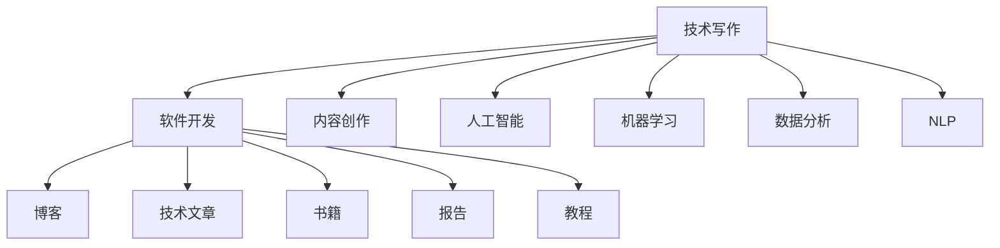

                 

# 技术写作：程序员的副业选择

> 关键词：技术写作, 程序员副业, 软件开发, 计算机编程, 内容创作, 人工智能, 机器学习, 数据分析, 自然语言处理

## 1. 背景介绍

### 1.1 问题由来
在当今信息化时代，程序员已成为推动科技进步、经济发展的核心力量之一。然而，尽管程序员的职业生涯光明，却也面临着种种挑战：长时的工作压力、技术快速迭代、知识更新速度加快等。这些问题使得很多程序员开始寻求副业，以提升个人收入、拓展技能边界、增强职业稳定性。

其中，技术写作成为了许多程序员的重要副业选择。技术写作不仅可以帮助程序员在已有技术积累的基础上进一步提升影响力，还能将其知识技能转化为变现的手段。技术写作形式多样，如博客、技术文章、书籍、报告、教程等，为广大程序员提供了广阔的创作空间。

### 1.2 问题核心关键点
技术写作作为程序员的副业，其关键点在于如何有效整合现有技术知识和语言表达能力，通过高质量的技术文章，分享专业见解，吸引读者关注，提升个人影响力。以下是技术写作成功与否的几个关键因素：

1. **专业性**：确保文章内容的专业性和准确性，涵盖最新的技术趋势、最佳实践、开发技巧等。
2. **可读性**：内容应结构清晰、语言简明、逻辑连贯，便于读者理解和吸收。
3. **实用性**：文章应提供具体的应用场景、案例分析，让读者能够直接应用到工作中。
4. **互动性**：通过评论、讨论、问答等方式，增强与读者的互动，提升文章的活跃度。
5. **营销推广**：学会在合适的平台发布内容，如GitHub、CSDN、博客园、知乎等，吸引更多流量。

### 1.3 问题研究意义
选择技术写作作为副业，不仅可以提升程序员的专业知识和写作能力，还能通过分享知识和经验，构建自己的技术影响力，进而扩展职业道路。同时，技术写作还能帮助程序员跳出单一技术限制，深入探索计算机科学的各个领域，如软件开发、机器学习、自然语言处理等，提升综合素质。

技术写作的副业选择，对于提升程序员的个人品牌价值、拓展职业发展空间、提高生活质量等方面，均具有重要的现实意义。通过持续写作和分享，程序员可以在自己的专业领域内获得更大的话语权，甚至可以成为该领域的意见领袖。

## 2. 核心概念与联系

### 2.1 核心概念概述

为更好地理解技术写作的副业选择，本节将介绍几个密切相关的核心概念：

- **技术写作（Technical Writing）**：以技术性内容为核心，通过文字表达技术观点和解决方案的写作形式。包括博客、技术文章、书籍、报告、教程等。
- **副业（Side Hustle）**：利用业余时间进行的非主业收入获取方式，通过技术写作获得的额外收入。
- **软件开发（Software Development）**：涉及计算机科学原理和软件开发技术的应用，以编程实现为目的。
- **计算机编程（Computer Programming）**：使用程序设计语言编写程序，以实现特定功能的过程。
- **内容创作（Content Creation）**：创作各种形式的内容，如文章、视频、音频等，以传递信息、观点和知识为目的。
- **人工智能（Artificial Intelligence, AI）**：研究、开发用于模拟、延伸和扩展人类智能的技术和系统。
- **机器学习（Machine Learning, ML）**：使计算机系统通过数据学习，提升性能和效率的算法和理论。
- **数据分析（Data Analysis）**：通过数据挖掘、处理和可视化，提取有价值的信息和洞察力。
- **自然语言处理（Natural Language Processing, NLP）**：使计算机理解、处理和生成人类语言的技术。

这些核心概念之间的逻辑关系可以通过以下Mermaid流程图来展示：



这个流程图展示了一名程序员如何将技术写作与软件开发、内容创作、人工智能、机器学习、数据分析和自然语言处理等多个领域进行整合，进行副业探索。

## 3. 核心算法原理 & 具体操作步骤
### 3.1 算法原理概述

技术写作作为程序员的副业，本质上是一种知识传播和内容创作的过程。其核心思想是通过写作，将技术知识转换为易懂的文本形式，传达给读者，解决其遇到的技术难题。

形式化地，设程序员已有的技术知识为 $K$，写作技能为 $W$，文章读者为 $R$，文章内容为 $C$。技术写作的目标是通过写作技能 $W$，将技术知识 $K$ 转换为文章内容 $C$，以解决读者 $R$ 的技术问题。

技术写作的优化目标是最小化读者困惑度，即文章内容 $C$ 应能够清晰、准确地传达技术知识 $K$，帮助读者解决实际问题。

### 3.2 算法步骤详解

技术写作的副业选择一般包括以下几个关键步骤：

**Step 1: 确定写作主题**
- 从个人兴趣、专业领域、市场需求等方面，选择具有实际应用价值的写作主题。
- 确保主题具有足够的深度和广度，能够吸引特定读者群体的关注。

**Step 2: 积累和梳理知识**
- 收集相关领域的文档、书籍、论文、博客等资料，梳理并理解核心知识和技术细节。
- 掌握领域内的最新发展趋势、最佳实践和开发技巧。

**Step 3: 设计文章结构**
- 确定文章的引入、主体和结论部分，并细化每个部分的具体内容。
- 设计合适的章节标题和副标题，保证文章结构清晰、逻辑连贯。

**Step 4: 编写和校对文章**
- 按照设计好的结构，依次撰写文章的各个部分。
- 反复校对文章内容，确保技术准确、语言流畅、表达清晰。
- 引入示例代码、图表等辅助材料，提升文章的可读性。

**Step 5: 发布和推广文章**
- 选择适合的平台进行发布，如博客、技术文章网站、技术社区等。
- 积极参与平台内的讨论和互动，提升文章的曝光度。
- 通过社交媒体、邮件列表等渠道进行推广，吸引更多读者。

**Step 6: 持续改进**
- 根据读者的反馈，不断改进和优化文章内容。
- 定期更新文章，保持内容的时效性和相关性。
- 探索新的写作方式和格式，如视频博客、播客等，丰富内容形式。

### 3.3 算法优缺点

技术写作作为程序员的副业，具有以下优点：
1. 提升专业影响力。通过高质量的技术文章，程序员可以在专业领域内建立良好的声誉和影响力。
2. 增加收入来源。通过广告、赞助、付费阅读等方式，获取额外的收入。
3. 拓展技能边界。写作过程中涉及内容创作、市场营销等多元技能，有助于提升综合素质。
4. 缓解职业压力。副业可以带来额外的收入和成就感，减轻主要工作的压力。

同时，技术写作也存在一些缺点：
1. 时间和精力投入。高质量的技术文章需要大量的时间和精力投入，可能会对主业产生一定的影响。
2. 内容要求高。技术文章的准确性和实用性要求较高，需要在专业知识方面持续深造。
3. 竞争激烈。技术写作领域竞争激烈，需要不断创新和优化内容，才能脱颖而出。
4. 结果不确定。文章是否能吸引大量读者，获得高曝光度，存在不确定性。

尽管存在这些缺点，技术写作作为程序员的副业，仍是一种具有巨大潜力的职业选择。通过合理规划和管理时间，很多程序员可以兼顾主业和副业，实现双赢。

### 3.4 算法应用领域

技术写作作为程序员的副业，不仅适用于技术博客、技术文章等传统形式，还可以扩展到以下领域：

- **书籍编写**：撰写技术书籍，系统介绍特定技术领域的知识体系和应用场景。
- **技术报告**：为企业或学术机构撰写技术报告，总结和展示最新研究成果。
- **编程教程**：通过视频、图文等形式，制作编程教程，帮助新手快速入门。
- **在线课程**：创建线上课程，教授编程技巧、算法设计和软件开发方法。
- **技术社区贡献**：参与技术社区的问答、讨论、编程挑战等活动，分享知识和经验。
- **技术咨询**：为企业提供技术咨询、解决方案和培训服务，帮助其提升技术水平。

除了上述这些常见形式外，技术写作还可应用于技术演讲、技术博客、开源项目文档、技术白皮书等，为程序员提供了多样化的副业选择。

## 4. 数学模型和公式 & 详细讲解 & 举例说明（备注：数学公式请使用latex格式，latex嵌入文中独立段落使用 $$，段落内使用 $)
### 4.1 数学模型构建

设技术写作副业的效果为 $E$，写作主题的相关度为 $T$，读者数量 $N$，文章曝光度 $V$，读者互动度 $I$。根据信息论和传播学原理，技术写作的效果 $E$ 可以表示为：

$$
E = T \times V \times I
$$

其中：
- $T$ 为写作主题与读者需求的相关度。相关度越高，文章阅读的转化率越高。
- $V$ 为文章在平台上的曝光度。曝光度越高，文章的阅读量越大。
- $I$ 为读者与文章的互动度。互动度越高，文章的传播效果越好。

### 4.2 公式推导过程

将公式 $E = T \times V \times I$ 展开，可得到：

$$
E = (C_1 + C_2 + C_3 + \dots + C_n) \times (P_1 + P_2 + P_3 + \dots + P_m) \times (C_4 + C_5 + C_6 + \dots + C_k)
$$

其中，$C_i$ 代表写作主题的各个子主题，$P_j$ 代表文章的各个传播渠道，$C_l$ 代表读者的互动方式。

通过上述模型，可以更好地理解和优化技术写作的效果。实际中，程序员需要通过数据统计和分析，调整写作主题、优化传播渠道、提升互动方式，以最大化技术写作的副业收益。

### 4.3 案例分析与讲解

假设某程序员从软件开发领域中选择技术写作作为副业，确定主题为“Python高级编程技巧”。通过以下步骤进行优化：

1. **确定写作主题**：选择软件开发中的“Python高级编程技巧”，结合市场需求和自身技术积累，确定写作方向。

2. **积累和梳理知识**：收集相关领域的书籍、博客、论文等资料，梳理并理解Python高级编程技巧的核心知识和技术细节。

3. **设计文章结构**：确定文章的引入、主体和结论部分，并细化每个部分的具体内容。文章结构为：
   - 引入：简述Python在软件开发中的地位和重要性。
   - 主体：
     1. 装饰器高级应用
     2. 元类编程
     3. 异步编程
     4. 并发编程
     5. 性能优化
   - 结论：总结Python高级编程技巧的实际应用案例，鼓励读者深入学习。

4. **编写和校对文章**：按照设计好的结构，撰写文章的各个部分，并进行反复校对，确保技术准确、语言流畅、表达清晰。

5. **发布和推广文章**：选择适合的平台进行发布，如博客、技术文章网站、技术社区等，积极参与平台内的讨论和互动，提升文章的曝光度。通过社交媒体、邮件列表等渠道进行推广，吸引更多读者。

6. **持续改进**：根据读者的反馈，不断改进和优化文章内容。定期更新文章，保持内容的时效性和相关性。

最终，该程序员通过技术写作不仅提升了自己的专业影响力，还获得了额外的收入来源，并拓展了技能边界。

## 5. 项目实践：代码实例和详细解释说明
### 5.1 开发环境搭建

在进行技术写作的副业实践前，我们需要准备好开发环境。以下是使用Python进行技术写作的开发环境配置流程：

1. 安装Anaconda：从官网下载并安装Anaconda，用于创建独立的Python环境。

2. 创建并激活虚拟环境：
```bash
conda create -n pytech-env python=3.8 
conda activate pytech-env
```

3. 安装必要的Python包：
```bash
pip install flask markdown ipynb jupyter nbconvert 
```

4. 准备技术写作环境：
```bash
pip install nbconvert -U
pip install nbflow
```

完成上述步骤后，即可在`pytech-env`环境中开始技术写作的副业实践。

### 5.2 源代码详细实现

下面我们以编写一篇关于“Python高级编程技巧”的技术博客为例，给出使用Markdown和Jupyter Notebook进行技术写作的代码实现。

首先，创建一个Markdown文件，作为博客草稿：

```markdown
# Python高级编程技巧

## 简介

Python是一种广泛使用的编程语言，以其简洁、高效、可读性强而著称。本文将介绍几种高级编程技巧，帮助读者深入理解Python的强大功能和灵活性。

## 目录

1. 装饰器高级应用
2. 元类编程
3. 异步编程
4. 并发编程
5. 性能优化

## 1. 装饰器高级应用

装饰器是Python中一种强大的语法特性，可以用于修改或增强函数的功能。常见的装饰器有`@staticmethod`、`@classmethod`、`@property`等。

## 2. 元类编程

元类是Python中的高级特性，用于定义类的行为。通过元类，可以实现自定义的类创建逻辑，增强类的灵活性。

## 3. 异步编程

异步编程是Python中一种高效的并发编程方式，通过`asyncio`库实现，可以避免阻塞I/O操作，提高程序的响应速度。

## 4. 并发编程

并发编程是Python中一种高级的编程模式，通过`threading`、`multiprocessing`等模块实现，可以提升程序的性能和资源利用率。

## 5. 性能优化

性能优化是每个Python开发者都应关注的话题。通过合理使用Cython、Numba等工具，可以显著提升Python代码的执行效率。

## 结论

通过掌握这些Python高级编程技巧，读者可以更加高效地使用Python进行开发，提升程序性能和代码质量。
```

然后，使用Jupyter Notebook对该Markdown文件进行渲染：

```bash
jupyter nbconvert --to markdown --template basic inputfile.md outputfile.md
```

接着，在Jupyter Notebook中编辑代码，添加必要的Python代码：

```python
import numpy as np
from sympy import symbols, integrate

# 示例代码1：装饰器高级应用
def my_decorator(func):
    def wrapper():
        print("Before function execution")
        func()
        print("After function execution")
    return wrapper

@my_decorator
def my_function():
    print("Inside function")

my_function()

# 示例代码2：元类编程
class MyMeta(type):
    def __new__(cls, name, bases, attrs):
        attrs['metadata'] = {'key': 'value'}
        return super().__new__(cls, name, bases, attrs)

class MyClass(metaclass=MyMeta):
    pass

print(MyClass.metadata)

# 示例代码3：异步编程
import asyncio

async def my_async_function():
    print("Starting function")
    await asyncio.sleep(1)
    print("Function complete")

asyncio.run(my_async_function())

# 示例代码4：并发编程
import threading

def my_thread_function():
    print("Starting thread function")
    print("Thread function complete")

thread = threading.Thread(target=my_thread_function)
thread.start()
thread.join()

# 示例代码5：性能优化
from numba import jit

@jit
def my_performance_optimized_function(x):
    return np.sin(x)

result = my_performance_optimized_function(0.1)
print(result)
```

### 5.3 代码解读与分析

让我们再详细解读一下关键代码的实现细节：

**Markdown文件**：
- 定义了博客的标题、简介、目录等内容。
- 详细介绍了Python的高级编程技巧，包括装饰器、元类、异步编程、并发编程和性能优化等。

**Jupyter Notebook代码**：
- 示例代码1：使用装饰器对函数进行增强，打印函数执行前后信息。
- 示例代码2：定义了一个元类，在类创建时添加自定义元数据，并实例化一个类查看元数据。
- 示例代码3：使用异步编程，定义了一个异步函数并运行。
- 示例代码4：使用并发编程，定义了一个线程并启动运行。
- 示例代码5：使用NumPy的JIT加速器，对函数进行性能优化，并计算结果。

这些示例代码涵盖了Python中的一些高级特性，并通过Markdown和Jupyter Notebook的形式，向读者展示了如何通过技术写作将技术知识转化为可读、可执行的内容。

通过Python代码的实际应用，读者可以更好地理解这些高级特性的使用方法和效果。代码解读与分析可以帮助读者更深入地理解技术写作中的技术和内容。

## 6. 实际应用场景
### 6.1 技术博客

技术博客是技术写作最常见的形式之一，通过撰写博客文章，程序员可以分享自己的技术见解、经验教训和实际项目中的问题解决过程。技术博客不仅有助于提升个人专业影响力，还能吸引大量同行和潜在客户关注。

例如，某程序员可以在博客中分享自己使用机器学习解决数据分类问题的经验，详细介绍项目背景、算法选择、数据预处理、模型训练和结果分析等步骤。通过分享这些内容，该程序员不仅展示了自己的技术能力，还能吸引其他数据科学家和机器学习爱好者阅读和讨论。

### 6.2 技术文章

技术文章通常针对特定的技术领域，深入探讨相关技术细节和实际应用场景。技术文章可以以单篇或系列的形式发布，帮助读者系统学习某一领域内的知识。

例如，某程序员可以撰写一篇关于“如何使用TensorFlow进行图像识别”的技术文章，详细介绍TensorFlow的基本原理、常用模型和应用案例。通过技术文章，读者可以系统了解图像识别技术，并尝试在自己的项目中应用。

### 6.3 技术书籍

技术书籍是技术写作的高级形式，通过系统介绍某一领域内的知识体系，帮助读者全面掌握相关技术。技术书籍通常需要大量的研究、实验和写作投入，但其市场价值和社会影响力也更大。

例如，某程序员可以编写一本关于“Python高级编程技巧”的技术书籍，详细讲解Python的高级特性和实际应用案例。通过技术书籍，读者可以系统学习Python的高级编程技巧，提升编程技能和项目开发能力。

### 6.4 未来应用展望

随着技术的不断进步，技术写作的形式和内容也在不断演进。未来，技术写作将更多地融合多媒体元素，如视频、音频、动画等，提升内容的表现力和互动性。同时，技术写作还将与其他技术和学科进行更深入的结合，如人工智能、自然语言处理等，拓展内容创作的边界。

技术写作的未来应用场景将更加多样和广泛，涵盖更多行业和领域。通过持续创新和优化，技术写作不仅能帮助程序员提升自身技能，还能为社会带来更多的技术价值。

## 7. 工具和资源推荐
### 7.1 学习资源推荐

为了帮助开发者系统掌握技术写作的理论基础和实践技巧，这里推荐一些优质的学习资源：

1. 《写作的艺术：程序员的写作指南》：详细讲解技术写作的基本原则和实践技巧，帮助程序员提升写作能力。
2. 《自然语言处理入门》：介绍自然语言处理的基本概念和实际应用，为技术写作提供语言学背景。
3. 《Python高级编程技巧》：系统讲解Python的高级特性和编程技巧，帮助程序员掌握Python的高级编程能力。
4. 《机器学习实战》：通过实际项目案例，讲解机器学习的基本原理和实际应用，为技术写作提供技术支持。
5. 《软件工程：构建可维护的系统和架构》：介绍软件工程的原理和实践，提升程序员的系统设计和开发能力。

通过对这些资源的学习实践，相信你一定能够快速掌握技术写作的精髓，并用于解决实际的NLP问题。

### 7.2 开发工具推荐

高效的开发离不开优秀的工具支持。以下是几款用于技术写作开发的常用工具：

1. GitHub：全球最大的代码托管平台，支持版本控制、协作开发、代码审查等功能，方便技术写作的团队协作。
2. Visual Studio Code：轻量级的代码编辑器，支持丰富的扩展和插件，适用于编写代码和文档。
3. Markdown编辑器：如Typora、MkDocs等，支持Markdown语法和文件渲染，方便技术写作和博客发布。
4. LaTeX：专业的排版工具，支持数学公式和复杂文档排版，适用于编写技术书籍和报告。
5. Jupyter Notebook：交互式的编程环境，支持代码和文档的混合编写，适用于技术文章和教学。

合理利用这些工具，可以显著提升技术写作的开发效率，加快创新迭代的步伐。

### 7.3 相关论文推荐

技术写作作为程序员的副业，其发展得益于学界的持续研究。以下是几篇奠基性的相关论文，推荐阅读：

1. 《技术写作在软件开发中的应用》：介绍了技术写作的基本概念和实践方法，为技术写作提供了理论基础。
2. 《机器学习与技术写作的融合》：探讨了机器学习技术在技术写作中的应用，如自动摘要、生成式写作等。
3. 《自然语言处理在技术写作中的应用》：介绍了自然语言处理技术在技术写作中的作用，如文本分类、信息抽取等。
4. 《软件工程师的技术写作实践》：介绍了程序员在技术写作中的实际经验和方法，提供了具体的技术写作案例。
5. 《技术写作的未来发展趋势》：分析了技术写作的最新发展趋势，为技术写作的未来探索提供了方向。

这些论文代表了大语言模型微调技术的发展脉络。通过学习这些前沿成果，可以帮助研究者把握学科前进方向，激发更多的创新灵感。

## 8. 总结：未来发展趋势与挑战

### 8.1 总结

本文对技术写作作为程序员副业的选择进行了全面系统的介绍。首先阐述了技术写作在提升程序员专业影响力、增加收入来源、拓展技能边界等方面的重要性。其次，从原理到实践，详细讲解了技术写作的数学模型和操作步骤，给出了技术写作的代码实例。同时，本文还广泛探讨了技术写作在技术博客、技术文章、技术书籍等多个领域的应用前景，展示了技术写作的巨大潜力。

通过本文的系统梳理，可以看到，技术写作作为程序员的副业，不仅是一种知识传播和内容创作的过程，更是一种提升自身素质、拓展职业道路的重要手段。技术写作的前景广阔，未来的发展空间巨大。

### 8.2 未来发展趋势

展望未来，技术写作作为程序员的副业，将呈现以下几个发展趋势：

1. 内容形式多样化。技术写作将不仅限于文本形式，还将融合多媒体元素，如视频、音频、动画等，提升内容的表现力和互动性。
2. 技术融合深入。技术写作将与其他技术和学科进行更深入的结合，如人工智能、自然语言处理等，拓展内容创作的边界。
3. 内容创作平台多样化。技术写作将不再局限于传统的博客、网站等平台，还将拓展到社交媒体、视频平台、知识分享平台等新形式。
4. 内容个性化。技术写作将更加注重内容的个性化和定制化，根据读者的需求和兴趣，提供更加精准和有用的内容。
5. 内容质量提升。技术写作将更加注重内容的深度和广度，提升写作质量，提供更具价值的技术见解和解决方案。

这些趋势凸显了技术写作作为程序员副业的选择具有广阔的前景。通过不断创新和优化，技术写作必将在提升程序员的影响力和拓展职业发展方面发挥更大的作用。

### 8.3 面临的挑战

尽管技术写作作为程序员的副业具有广阔的发展前景，但在实际操作中仍面临一些挑战：

1. 时间和精力投入。高质量的技术文章需要大量的时间和精力投入，可能会对主业产生一定的影响。
2. 内容质量要求高。技术文章的内容要求高度专业化和准确性，需要在专业知识方面持续深造。
3. 竞争激烈。技术写作领域竞争激烈，需要不断创新和优化内容，才能脱颖而出。
4. 读者需求多变。技术写作需要根据读者反馈，持续优化和调整内容，以满足读者的需求。

尽管存在这些挑战，技术写作作为程序员的副业，仍是一种具有巨大潜力的职业选择。通过合理规划和管理时间，很多程序员可以兼顾主业和副业，实现双赢。

### 8.4 研究展望

面对技术写作面临的挑战，未来的研究需要在以下几个方面寻求新的突破：

1. 探索自动生成和辅助写作工具。开发自动生成技术，如自然语言生成(NLG)、自动摘要等，提升写作效率和内容质量。
2. 引入交互式内容设计。通过设计交互式内容，提升读者参与度和内容的互动性。
3. 开发个性化推荐系统。利用机器学习技术，根据读者的兴趣和需求，推荐个性化的内容，提升阅读体验。
4. 融合多模态信息。将文本、图片、视频等多种信息形式融合，提升内容的表达力和感染力。
5. 加强内容安全。在技术写作中引入安全机制，防止恶意内容和虚假信息的传播。

这些研究方向的探索，必将引领技术写作技术迈向更高的台阶，为程序员提供更加多样化的副业选择。面向未来，技术写作技术还需要与其他技术和学科进行更深入的融合，共同推动技术写作的进步。

## 9. 附录：常见问题与解答

**Q1：如何平衡主业和副业？**

A: 技术写作作为程序员的副业，需要合理安排时间和精力，避免对主业产生负面影响。建议每周固定时间进行副业写作，并设定明确的目标和计划，逐步积累经验和影响力。同时，注意主业与副业的结合，通过副业提升主业的效率和质量。

**Q2：如何提高技术写作的内容质量？**

A: 提高技术写作的内容质量，需要不断学习和积累知识，持续关注行业动态，参与社区讨论和交流。写作前，要仔细梳理知识点，确保内容的准确性和实用性。写作中，要使用简洁明了的语言，结构清晰，逻辑连贯，增加示例和图表等辅助材料。写作后，要反复校对和修订，确保技术准确、语言流畅、表达清晰。

**Q3：如何获取更多的读者关注？**

A: 获取更多的读者关注，需要积极参与社区互动，定期发布高质量的内容。可以通过社交媒体、邮件列表、技术社区等渠道进行推广，吸引更多读者。同时，积极参与线上线下技术交流活动，提升个人知名度和影响力。

**Q4：如何应对技术写作的挑战？**

A: 应对技术写作的挑战，需要制定明确的目标和计划，合理分配时间和精力。写作前，要明确写作主题和目标读者，确保内容的相关性和实用性。写作中，要不断学习和积累知识，提升自身素质和写作能力。写作后，要积极获取读者反馈，不断优化和改进内容。

这些问题的解答，可以为技术写作作为程序员副业的选择提供指导和建议，帮助程序员更好地实现主业和副业的双赢。

---

作者：禅与计算机程序设计艺术 / Zen and the Art of Computer Programming

