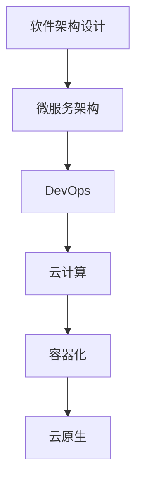

                 

# 技术分享：从线下到线上的转变

## 1. 背景介绍

### 1.1 问题由来
在过去的数十年中，计算机科学领域的众多进步和创新几乎完全集中在提高计算能力上。CPU、GPU的性能飞速提升，使得复杂算法和数据处理变得前所未有的高效。然而，这些进步并未充分应用到软件应用的实际使用上。软件系统依然常常面临低效、复杂、难维护等诸多问题。

### 1.2 问题核心关键点
软件架构与设计是构建高效、可维护、可扩展的软件系统的基石。然而，由于技术演进和需求变化的双重影响，软件架构的演进也面临着新的挑战。以下将详细探讨这些挑战，并提出一些创新思路与解决方案。

## 2. 核心概念与联系

### 2.1 核心概念概述
以下是一些涉及从线下到线上转变的核心概念：

- **软件架构设计**：软件架构是指软件系统的整体结构和组件划分。良好的架构设计可以提高系统的可维护性、可扩展性、可测试性等关键特性。
- **微服务架构**：微服务架构是一种将软件系统分解为多个独立服务的架构风格。每个服务负责单一职责，通过API进行通信，使得系统具有更高的灵活性和可维护性。
- **DevOps**：DevOps是一种开发与运维融合的文化，旨在通过持续集成、持续交付和持续监控等实践，提升软件交付的速度和质量。
- **云计算**：云计算是指通过互联网提供按需、灵活、可扩展的IT资源服务。云计算技术为软件的线上化提供了强有力的支持。
- **容器化**：容器化是指将应用程序及其依赖打包到容器镜像中，通过容器引擎进行管理和运行。容器化技术使得软件的部署、扩展和管理更为方便和高效。

这些概念在技术演进过程中逐渐融合，使得软件系统可以从线下部署逐步过渡到线上部署，实现更高的灵活性、可维护性和可扩展性。

### 2.2 核心概念原理和架构的 Mermaid 流程图


## 3. 核心算法原理 & 具体操作步骤
### 3.1 算法原理概述

从线下到线上转变的过程，可以理解为软件架构从单体应用向微服务架构的演变。这一演变基于以下几个核心原理：

1. **服务解耦**：将单体应用分解为多个独立服务，每个服务专注于单一职责，提高系统灵活性和可维护性。
2. **服务编排**：通过API网关和微服务架构，实现服务之间的灵活调用和组合，形成更复杂的服务链。
3. **容器化部署**：将服务打包成容器镜像，通过容器引擎进行管理和调度，使得服务部署和扩展更为高效。
4. **持续交付与运维**：通过DevOps实践，实现代码自动化构建、测试和部署，以及持续监控和故障恢复，提升软件交付速度和质量。

### 3.2 算法步骤详解

1. **需求分析与架构设计**：
   - 对现有系统进行需求分析和现状评估，确定系统架构的目标和方向。
   - 基于业务需求，设计整体架构，包括服务划分、通信协议、数据存储等关键组件。

2. **服务拆分与微服务设计**：
   - 将单体应用拆分为多个独立服务，每个服务聚焦于单一职责。
   - 定义服务的接口和依赖关系，设计服务的内部结构和业务逻辑。

3. **服务编排与API网关**：
   - 设计API网关，实现服务的统一管理和调度。
   - 配置服务的路由、限流、负载均衡等策略，提升系统的可靠性和可扩展性。

4. **容器化部署与容器引擎**：
   - 将服务打包成容器镜像，通过容器引擎（如Docker、Kubernetes）进行管理和调度。
   - 配置容器的资源限制、健康检查等参数，实现服务的弹性伸缩和自愈机制。

5. **持续交付与自动化**：
   - 配置持续集成和持续交付系统，自动化代码构建、测试和部署流程。
   - 实现持续监控和故障恢复机制，确保系统的高可用性和稳定性。

6. **DevOps文化与实践**：
   - 建立DevOps文化，推动开发与运维团队的紧密协作。
   - 引入持续集成、持续交付、持续监控等DevOps实践，提升软件交付速度和质量。

### 3.3 算法优缺点

微服务架构和DevOps文化在提升软件系统的灵活性、可维护性和可扩展性方面具有显著优势：

**优点**：
- 服务解耦使得系统更具灵活性和可维护性，可快速迭代和扩展新功能。
- 容器化部署和容器引擎使得服务部署和管理更为高效，支持弹性伸缩和自愈机制。
- DevOps实践提升软件交付速度和质量，实现持续监控和故障恢复。

**缺点**：
- 服务解耦带来服务间通信复杂性，需要合理设计API网关和服务编排。
- 容器化部署和容器引擎引入新的技术栈和维护成本，需妥善处理容器间通信和数据共享。
- DevOps实践需充分整合开发和运维团队，实现高效协作和信息共享。

### 3.4 算法应用领域

微服务架构和DevOps文化在多个领域都有广泛的应用：

- **金融行业**：金融系统需具备高可用性和高性能，微服务架构和DevOps实践可实现快速迭代和弹性伸缩。
- **电商行业**：电商系统需支持高并发和数据量大，微服务架构和DevOps实践可实现高可用和快速扩展。
- **互联网行业**：互联网产品需快速迭代和持续优化，微服务架构和DevOps实践可实现灵活部署和持续监控。

## 4. 数学模型和公式 & 详细讲解 & 举例说明

### 4.1 数学模型构建

微服务架构和DevOps文化的数学模型可以从以下几个方面构建：

- **系统可靠性模型**：定义系统各组件的可靠性指标和依赖关系，通过可靠性理论分析系统整体可靠性。
- **性能模型**：描述系统各组件的性能瓶颈和性能提升策略，通过负载均衡和弹性伸缩技术提升系统性能。
- **成本模型**：分析微服务架构和DevOps实践对软件开发的成本影响，通过成本效益分析优化资源配置。

### 4.2 公式推导过程

以系统可靠性模型为例，假设系统包含三个服务S1、S2、S3，其可靠性分别为R1、R2、R3，相互依赖关系如下：

- S1服务依赖于S2服务，可靠性为R12。
- S3服务依赖于S1和S2服务，可靠性为R13。

则系统整体的可靠性R可表示为：

$$
R = R1 \times R2 \times (1 - (1 - R1)(1 - R2)P)
$$

其中，P为服务间的故障转移概率，可设置为0.5。

### 4.3 案例分析与讲解

假设某电商系统由订单服务、支付服务和物流服务组成。订单服务依赖于支付服务，支付服务依赖于订单服务和物流服务。各服务的可靠性如下：

- 订单服务的可靠性为0.95，支付服务的可靠性为0.90，物流服务的可靠性为0.92。
- 订单服务依赖于支付服务的故障转移概率为0.1，支付服务依赖于订单服务和物流服务的故障转移概率均为0.2。

通过上述公式计算，该电商系统的整体可靠性为：

$$
R = 0.95 \times 0.90 \times (1 - (1 - 0.95)(1 - 0.90)0.1) = 0.9253
$$

这意味着该电商系统整体可靠性的期望值为92.53%。在系统设计时，需进一步优化各服务的可靠性指标和依赖关系，确保整体系统的可靠性。

## 5. 项目实践：代码实例和详细解释说明

### 5.1 开发环境搭建

以下是使用Python和Docker搭建微服务系统的开发环境：

1. 安装Anaconda：
```bash
conda create -n py36 python=3.6
conda activate py36
```

2. 安装Docker和Docker Compose：
```bash
sudo apt-get install docker-ce
sudo apt-get install docker-compose
```

3. 创建项目目录，编写Dockerfile：
```dockerfile
FROM python:3.6-slim
WORKDIR /app
COPY . /app
RUN pip install -r requirements.txt
EXPOSE 5000
CMD ["python", "app.py"]
```

4. 编写应用代码，如一个简单的微服务：

```python
from flask import Flask, request, jsonify

app = Flask(__name__)

@app.route('/')
def hello():
    return jsonify({'message': 'Hello, World!'})

if __name__ == '__main__':
    app.run(host='0.0.0.0', port=5000)
```

5. 创建Docker Compose文件：
```yaml
version: '3'
services:
  app:
    build: .
    ports:
      - "5000:5000"
```

6. 运行Docker Compose：
```bash
docker-compose up
```

### 5.2 源代码详细实现

以下是一个简单的订单服务API，使用Flask和Gunicorn搭建：

```python
from flask import Flask, request, jsonify

app = Flask(__name__)

@app.route('/order', methods=['POST'])
def create_order():
    data = request.json
    # 处理订单请求
    return jsonify({'message': 'Order created successfully'})

if __name__ == '__main__':
    app.run(host='0.0.0.0', port=5000)
```

### 5.3 代码解读与分析

代码部分从简单到复杂，从单个服务到多服务架构，逐步展示微服务架构的实现过程。

1. **Flask框架**：Flask是一个轻量级的Web框架，适合快速开发微服务应用。通过Flask，可以快速搭建RESTful API，处理HTTP请求。

2. **Gunicorn**：Gunicorn是一个Python Web服务器，支持异步处理和负载均衡，适合部署在Docker容器中。

3. **Docker容器**：Docker容器提供了一个独立的运行环境，使得微服务的应用部署和扩展更为方便。通过Docker Compose，可以轻松管理多个容器的编排和调度。

### 5.4 运行结果展示

使用Docker Compose启动应用，访问http://localhost:5000/order，可看到返回的JSON格式响应：

```json
{"message": "Order created successfully"}
```

## 6. 实际应用场景

### 6.1 金融系统

金融系统需要支持高并发和大规模交易，微服务架构和DevOps文化可以提升系统的可靠性和可维护性。

- **服务拆分**：将金融系统拆分为交易服务、清算服务、风控服务等独立服务，每个服务专注于单一职责。
- **API网关**：设计API网关，实现交易、清算、风控等服务的统一管理和调度。
- **容器化部署**：将服务打包成容器镜像，通过Kubernetes进行管理和调度，实现弹性伸缩和自愈机制。
- **持续交付与运维**：通过CI/CD和DevOps实践，实现快速迭代和持续监控，提升系统性能和可靠性。

### 6.2 电商系统

电商系统需支持高并发和海量用户访问，微服务架构和DevOps文化可以提升系统的可扩展性和灵活性。

- **服务拆分**：将电商系统拆分为商品服务、订单服务、支付服务、物流服务等独立服务。
- **API网关**：设计API网关，实现商品、订单、支付、物流等服务的统一管理和调度。
- **容器化部署**：将服务打包成容器镜像，通过Docker和Kubernetes进行管理和调度，实现弹性伸缩和自愈机制。
- **持续交付与运维**：通过CI/CD和DevOps实践，实现快速迭代和持续监控，提升系统性能和可靠性。

### 6.3 互联网产品

互联网产品需快速迭代和持续优化，微服务架构和DevOps文化可以提升系统的灵活性和可维护性。

- **服务拆分**：将互联网产品拆分为用户服务、内容服务、广告服务、推荐服务等多个独立服务。
- **API网关**：设计API网关，实现用户、内容、广告、推荐等服务的统一管理和调度。
- **容器化部署**：将服务打包成容器镜像，通过Docker和Kubernetes进行管理和调度，实现弹性伸缩和自愈机制。
- **持续交付与运维**：通过CI/CD和DevOps实践，实现快速迭代和持续监控，提升系统性能和可靠性。

## 7. 工具和资源推荐

### 7.1 学习资源推荐

1. **《微服务架构：原理与实践》**：一书详细介绍了微服务架构的设计原则、实施策略和案例分析。
2. **《DevOps实践指南》**：一书系统介绍了DevOps文化的核心实践，包括持续集成、持续交付、持续监控等。
3. **《Docker官方文档》**：Docker官方文档提供了丰富的教程和实践案例，适合初学者快速上手。
4. **《Kubernetes官方文档》**：Kubernetes官方文档提供了详细的部署指南和最佳实践，适合运维工程师深入学习。

### 7.2 开发工具推荐

1. **Flask**：轻量级的Web框架，适合快速开发微服务API。
2. **Gunicorn**：高性能的Python Web服务器，支持异步处理和负载均衡。
3. **Docker**：轻量级的容器化解决方案，适合微服务应用的快速部署和扩展。
4. **Kubernetes**：强大的容器编排工具，支持弹性伸缩、服务发现、负载均衡等。

### 7.3 相关论文推荐

1. **《Microservices: A service-centric approach to building software and systems》**：提供了微服务架构的详细介绍和最佳实践。
2. **《DevOps: A literature review》**：系统回顾了DevOps文化的核心实践和学术研究。
3. **《Containerization of microservices》**：探讨了微服务应用如何通过容器化实现高效部署和管理。
4. **《Service Mesh for Microservices》**：介绍了服务网格（Service Mesh）技术，进一步提升微服务系统的性能和可靠性。

## 8. 总结：未来发展趋势与挑战

### 8.1 研究成果总结

微服务架构和DevOps文化在提升软件系统的灵活性、可维护性和可扩展性方面具有显著优势，已成为现代软件系统的主流架构风格。其主要成果包括：

- **服务解耦**：将单体应用拆分为多个独立服务，提高系统的灵活性和可维护性。
- **容器化部署**：通过容器引擎实现服务的弹性伸缩和自愈机制，提升系统性能和可靠性。
- **持续交付与运维**：通过CI/CD和DevOps实践，实现快速迭代和持续监控，提升软件交付速度和质量。

### 8.2 未来发展趋势

未来，微服务架构和DevOps文化将继续发展，展现出以下几个趋势：

1. **微服务治理**：引入API网关、服务发现、配置管理、负载均衡等治理工具，提升微服务系统的管理能力。
2. **服务网格**：通过服务网格（如Istio）实现服务的统一管理和调度，提升系统性能和可靠性。
3. **云原生**：微服务架构与云计算的深度融合，实现更加高效、弹性的云原生应用。
4. **边缘计算**：将微服务架构扩展到边缘计算平台，实现低延迟、高可靠性的服务部署。
5. **DevOps自动化**：进一步引入自动化工具和流程，实现端到端的自动化交付和运维。

### 8.3 面临的挑战

尽管微服务架构和DevOps文化在提升系统性能和可靠性方面取得了显著成效，但仍面临以下挑战：

1. **服务间通信**：微服务之间的通信复杂度增加，需合理设计API网关和服务编排。
2. **容器间通信**：容器之间的通信和数据共享需优化，避免通信瓶颈和数据不一致。
3. **自动化运维**：自动化运维需进一步优化，确保系统的稳定性和可维护性。
4. **DevOps协作**：DevOps团队需进一步整合，实现高效协作和信息共享。

### 8.4 研究展望

未来的研究将主要集中在以下几个方面：

1. **微服务治理**：探索更多高效的服务治理工具和机制，提升微服务系统的管理能力。
2. **服务网格**：进一步研究服务网格的实现和优化，提升微服务系统的性能和可靠性。
3. **云原生**：探索微服务架构与云计算的深度融合，实现更加高效、弹性的云原生应用。
4. **边缘计算**：将微服务架构扩展到边缘计算平台，实现低延迟、高可靠性的服务部署。
5. **自动化运维**：进一步优化自动化运维工具和流程，确保系统的稳定性和可维护性。
6. **DevOps协作**：探索更多高效协作的DevOps实践，实现高效协作和信息共享。

## 9. 附录：常见问题与解答

**Q1: 如何设计合理的微服务架构？**

A: 设计微服务架构需考虑以下几个关键点：
1. 服务边界：根据业务需求，合理划分服务的边界，避免过细或过粗。
2. 接口定义：明确服务的接口定义和通信协议，确保服务间的协作和互操作性。
3. 数据管理：设计合理的数据模型和存储策略，避免跨服务的数据依赖和一致性问题。
4. 安全性：引入安全性机制，如认证、授权、加密等，保障服务的安全性。

**Q2: DevOps文化如何与微服务架构结合？**

A: DevOps文化与微服务架构的结合需注意以下几点：
1. 自动化构建和测试：通过CI/CD工具，实现代码自动化构建、测试和部署。
2. 持续监控和运维：引入持续监控工具，实时监控系统性能和异常，快速响应和恢复。
3. 协作和沟通：建立开发与运维团队的高效协作机制，实现信息共享和决策统一。

**Q3: 如何优化微服务架构的服务间通信？**

A: 优化微服务架构的服务间通信需注意以下几点：
1. 选择合适的通信协议，如REST、gRPC等，提升通信效率和可靠性。
2. 设计合理的负载均衡策略，避免单点故障和性能瓶颈。
3. 引入API网关，实现服务的统一管理和调度，简化服务间通信。

**Q4: 如何优化微服务架构的容器间通信？**

A: 优化微服务架构的容器间通信需注意以下几点：
1. 使用容器间的通信工具，如Docker、Kubernetes，提升容器间通信效率和可靠性。
2. 设计合理的容器编排策略，避免容器间的数据依赖和一致性问题。
3. 引入网络隔离和安全机制，保障容器间通信的安全性。

**Q5: 如何优化微服务架构的持续交付与运维？**

A: 优化微服务架构的持续交付与运维需注意以下几点：
1. 引入持续交付工具，实现代码的自动化构建、测试和部署。
2. 引入持续监控工具，实时监控系统性能和异常，快速响应和恢复。
3. 建立DevOps文化，推动开发与运维团队的紧密协作，实现高效交付和运维。

---

作者：禅与计算机程序设计艺术 / Zen and the Art of Computer Programming

