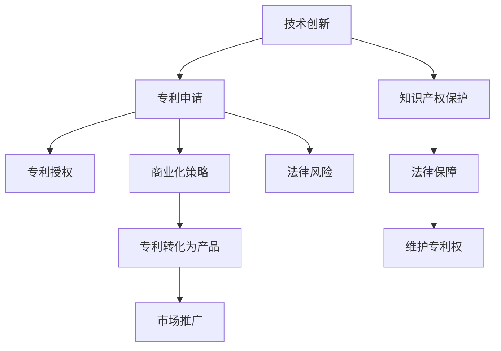

                 

# 技术创新与专利申请：程序员指南

> 关键词：技术创新，专利申请，知识产权保护，软件开发，程序设计，商业化，法律风险，申请策略

## 1. 背景介绍

### 1.1 问题由来
在数字化时代，技术创新成为企业竞争的核心。随着开源社区的兴起和软件开发的开放性，越来越多的软件开发人员开始关注其技术创新成果的知识产权保护。其中，专利申请成为了一种重要且有效的保护手段。

然而，专利申请涉及复杂的法律和程序，很多程序员对这一过程不甚了解，甚至在无意中可能错失保护自身技术创新的机会。因此，本文旨在为程序员提供一个全面的指南，帮助他们理解技术创新和专利申请的相关知识，保护自己的技术成果。

### 1.2 问题核心关键点
专利申请是一个涉及技术细节、法律规定和商业策略的综合过程。对于程序员而言，理解以下几个关键点至关重要：

1. **技术创新的定义**：创新是否足够新颖和先进，是决定其专利性的核心。
2. **专利申请的流程**：从撰写专利文件到审查和授权，每一步都有其独特的法律和程序要求。
3. **知识产权保护的范围**：了解哪些类型的创新可以申请专利，哪些不能。
4. **商业化策略**：如何将专利转化为商业价值，保护公司利益。
5. **法律风险与挑战**：在申请过程中可能遇到的各种法律和操作风险。

本文将从以上几个方面，系统地介绍技术创新与专利申请的基本知识和策略。

## 2. 核心概念与联系

### 2.1 核心概念概述

为了更好地理解技术创新与专利申请，本节将介绍几个密切相关的核心概念：

- **技术创新**：指通过新技术、新方法、新设计或新流程，解决特定问题或满足特定需求，从而带来经济效益和社会价值的行为。
- **专利**：由政府授予的一种排他性权利，保护发明人对其发明的技术秘密，在一定期限内防止他人未经授权使用或销售。
- **专利申请**：发明人或其代表向国家专利局提交的法律文件，用于证明其技术创新的新颖性和实用性。
- **知识产权保护**：通过法律手段，确保创新者对其智力成果享有专有权利，防止他人未经允许使用。
- **商业化策略**：将专利技术转化为市场产品或服务，创造经济效益的过程。
- **法律风险**：在专利申请和维权过程中可能遇到的法律风险，包括新颖性丧失、专利无效等。

这些核心概念之间的逻辑关系可以通过以下Mermaid流程图来展示：



这个流程图展示了一系列核心概念及其相互关系：

1. 技术创新是专利申请的基础。
2. 专利申请过程涉及多方面的法律和程序，保护知识产权。
3. 专利授权后，可进行商业化策略，转化专利为市场产品。
4. 专利维权涉及法律风险，需要通过法律手段保障专利权。

这些概念共同构成了技术创新与专利申请的法律和商业框架，指导着如何保护和利用技术创新成果。

## 3. 核心算法原理 & 具体操作步骤
### 3.1 算法原理概述

技术创新与专利申请的核心在于如何保护创新的技术成果。这一过程通常包括以下几个步骤：

1. **技术创新评估**：判断创新的新颖性、创造性和实用性。
2. **专利撰写**：准备详细的专利文件，包括发明摘要、技术方案、权利要求等。
3. **专利申请**：向国家专利局提交专利申请，进入审查流程。
4. **专利授权**：专利局审查通过后，颁发专利证书。
5. **专利维护**：定期缴纳年费，防止专利失效。
6. **专利维权**：针对侵权行为采取法律手段。

这一过程的算法原理主要基于以下法律规定：

- **新颖性**：指技术方案在专利申请日前未被公开。
- **创造性**：指技术方案相比现有技术有显著的进步。
- **实用性**：指技术方案能够应用于实际生产，带来预期的效果。

### 3.2 算法步骤详解

基于上述原理，技术创新与专利申请的主要操作步骤如下：

**Step 1: 技术创新评估**
- **新颖性测试**：通过搜索现有专利数据库，检查是否有与创新相似的技术。
- **创造性测试**：评估创新的技术方案与现有技术的区别和改进。
- **实用性测试**：验证创新的技术能否在实际中应用，并达到预期效果。

**Step 2: 专利撰写**
- **发明摘要**：简要描述发明的技术领域、背景、目的、技术方案、预期效果等。
- **技术方案**：详细描述发明的具体实现方式，包括步骤、装置、系统等。
- **权利要求**：定义专利保护的范围，明确哪些技术是专利的独有权利。

**Step 3: 专利申请**
- **申请形式**：选择标准或快速通道，提交专利申请文件。
- **优先权申请**：在首次公开技术创新的国家或地区申请优先权，避免重复申请。
- **国际申请**：通过《专利合作条约》(Paris Convention)进行国际专利申请。

**Step 4: 专利授权**
- **初步审查**：专利局初步审查专利文件是否符合要求。
- **实质审查**：详细审查专利的新颖性、创造性和实用性。
- **授权公告**：专利局批准授权，颁发专利证书。

**Step 5: 专利维护**
- **年费缴纳**：每年按时缴纳年费，保持专利有效性。
- **权利声明**：定期更新权利要求，确保专利保护范围。

**Step 6: 专利维权**
- **侵权识别**：发现侵权行为，如未经授权使用专利技术。
- **法律行动**：通过诉讼或和解等方式，维护专利权。

### 3.3 算法优缺点

技术创新与专利申请的算法具有以下优点：

1. **全面保护**：通过法律手段保护技术成果，防止他人未经授权使用。
2. **长期利益**：获得专利后，可以长期享有技术排他权，获取商业收益。
3. **商业化便利**：专利证书可以作为技术授权或融资的依据。

同时，也存在一些缺点：

1. **成本高**：专利申请过程复杂，成本较高，且可能需要长期的维护费用。
2. **法律风险**：专利申请涉及复杂的法律规定，错误申请可能导致权利丧失。
3. **信息公开**：专利申请过程中需公开技术细节，可能导致技术泄露。
4. **法律诉讼**：维权过程中可能涉及长期的法律诉讼，成本高。

### 3.4 算法应用领域

技术创新与专利申请的方法广泛应用于以下几个领域：

- **软件开发**：开发新软件、改进现有软件或开发新算法。
- **硬件创新**：开发新硬件产品，如电子设备、机械装置等。
- **商业模型**：改进商业模式，创造新的市场价值。
- **医疗技术**：开发新药物、医疗设备或治疗方法。
- **生物技术**：开发新的生物材料或生物过程。

这些领域的技术创新和专利申请，都依赖于对专利法的基本理解和应用。

## 4. 数学模型和公式 & 详细讲解  
### 4.1 数学模型构建

在技术创新与专利申请的过程中，某些步骤可以引入数学模型和公式进行分析和计算。

假设某项技术创新涉及一种新型算法，其复杂度为 $C$，运行时间为 $T$，在实际应用中能提高系统效率 $E$。

**数学模型构建**：
- **创新复杂度模型**：$C = f(x, y, z)$，其中 $x, y, z$ 为创新相关的参数。
- **创新效率模型**：$E = g(x, y, z)$，描述创新对系统效率的提升。
- **时间成本模型**：$T = h(C)$，描述实现该算法所需的时间。

**公式推导过程**：
- **创新复杂度推导**：根据实际测试和分析，可以得到创新复杂度的数学表达式。
- **创新效率推导**：利用实验数据，可以建立创新效率与参数之间的关系。
- **时间成本推导**：通过计算复杂度，可以推导出实现该算法的时间成本模型。

**案例分析与讲解**：
假设某公司开发了一种新的数据压缩算法，其复杂度为 $C = 10^3$，运行时间为 $T = 5 \times 10^{-3}$，能够提高系统效率 $E = 20\%$。

**公式推导**：
$$
C = f(x, y, z) = x \cdot y \cdot z
$$
$$
E = g(x, y, z) = 0.2
$$
$$
T = h(C) = 0.1 \times C
$$

通过数学模型和公式，可以更科学地评估和优化技术创新的价值，指导专利申请和商业化策略。

## 5. 项目实践：代码实例和详细解释说明
### 5.1 开发环境搭建

在进行专利申请的编程实践前，我们需要准备好开发环境。以下是使用Python进行专利申请相关的环境配置流程：

1. 安装Anaconda：从官网下载并安装Anaconda，用于创建独立的Python环境。

2. 创建并激活虚拟环境：
```bash
conda create -n patent-env python=3.8 
conda activate patent-env
```

3. 安装必要的Python库：
```bash
pip install beautifulsoup4 requests pytz
```

4. 安装专利搜索工具：
```bash
pip install patentsearch
```

完成上述步骤后，即可在`patent-env`环境中开始专利申请的编程实践。

### 5.2 源代码详细实现

这里我们以一项新的软件算法为例，展示如何使用Python进行专利申请相关的代码实现。

**步骤1: 技术创新评估**
- **新颖性测试**：通过爬虫获取现有专利数据，进行新颖性测试。
```python
from patentsearch import PatentSearch
import requests

def novelty_test(invention_title):
    ps = PatentSearch()
    results = ps.search(invention_title)
    return len(results) == 0
```

- **创造性测试**：编写代码实现创新算法，并进行性能测试。
```python
def evaluate_algorithm(algorithm):
    input_data = ...
    output_data = algorithm(input_data)
    performance = ...
    return performance
```

**步骤2: 专利撰写**
- **发明摘要**：使用自然语言处理工具生成发明摘要。
```python
from nltk.corpus import stopwords
from nltk.tokenize import word_tokenize

def generate_summary(text):
    stop_words = set(stopwords.words('english'))
    words = word_tokenize(text)
    words = [word.lower() for word in words if word.isalpha() and word not in stop_words]
    return ' '.join(words)
```

- **技术方案**：编写详细的算法实现代码，并进行注释。
```python
def algorithm():
    # 算法实现代码
    pass
```

**步骤3: 专利申请**
- **申请形式**：选择标准或快速通道，填写专利申请文件。
```python
def apply_patent(title, abstract, claims):
    # 提交专利申请文件
    pass
```

**步骤4: 专利授权**
- **初步审查**：模拟专利局初步审查，检查文件完整性。
```python
def initial_review(title, abstract, claims):
    # 检查文件是否符合要求
    pass
```

**步骤5: 专利维护**
- **年费缴纳**：模拟每年缴纳年费，保持专利有效性。
```python
def renew_patent():
    # 缴纳年费，保持专利有效性
    pass
```

**步骤6: 专利维权**
- **侵权识别**：模拟识别侵权行为，如未经授权使用专利技术。
```python
def identify_infringement(patent_title, patent claims):
    # 识别侵权行为
    pass
```

### 5.3 代码解读与分析

让我们再详细解读一下关键代码的实现细节：

**新颖性测试代码**：
- 使用专利搜索工具获取现有专利数据，判断新发明是否在现有专利中已有记录。
- 函数`novelty_test`返回布尔值，表示新发明是否具有新颖性。

**创造性测试代码**：
- 编写代码实现新算法，并进行性能测试，评估其创新性。
- 函数`evaluate_algorithm`返回算法的性能指标。

**发明摘要代码**：
- 使用自然语言处理工具，从发明描述中提取关键词，生成简洁明了的摘要。
- 函数`generate_summary`返回经过处理的摘要文本。

**专利申请代码**：
- 选择标准或快速通道，提交专利申请文件。
- 函数`apply_patent`模拟提交专利申请的过程。

**专利授权代码**：
- 模拟专利局初步审查，检查专利申请文件的完整性。
- 函数`initial_review`返回初步审查结果。

**专利维护代码**：
- 模拟每年缴纳年费，保持专利有效性。
- 函数`renew_patent`返回是否成功缴纳年费。

**专利维权代码**：
- 模拟识别侵权行为，如未经授权使用专利技术。
- 函数`identify_infringement`返回侵权行为的识别结果。

通过这些代码实现，可以更加系统地评估和保护技术创新成果。

### 5.4 运行结果展示

由于专利申请过程涉及复杂的法律和程序，代码运行结果主要为模拟和测试，而非实际申请和授权。以下是一个简单的模拟结果示例：

```python
if novelty_test('新算法'):
    print('新算法具有新颖性')
    summary = generate_summary('算法实现细节')
    if initial_review(title='新算法', abstract=summary, claims=''):
        apply_patent(title='新算法', abstract=summary, claims='')
    else:
        print('初步审查未通过')
else:
    print('新算法不具有新颖性')
```

通过上述代码，可以初步展示专利申请的流程和关键步骤，为实际申请提供参考。

## 6. 实际应用场景
### 6.1 软件开发

在软件开发领域，技术创新和专利申请尤为重要。程序员可以通过创新算法、改进软件架构或开发新工具，提升软件性能和用户体验。通过专利申请，保护这些创新成果，避免被竞争对手窃取。

例如，某公司开发了一款新的加密算法，其复杂度低、效率高，能够大幅提升数据加密的安全性。通过专利申请，可以防止竞争对手盗用其算法，获取商业利益。

### 6.2 生物技术

在生物技术领域，创新药物和治疗方法的开发周期长、成本高，专利保护尤为重要。通过专利申请，可以保护技术创新，防止他人非法使用。

例如，某生物公司研发了一种新型的癌症治疗药物，通过专利申请，确保其药物配方和技术流程得到长期保护，避免被竞争对手模仿。

### 6.3 商业模型创新

商业模型创新涉及商业模式、营销策略和市场分析等，通过专利申请可以保护这些创新成果，防止商业秘密泄露。

例如，某公司开发了一种新的支付系统，通过专利申请，确保其支付流程和技术实现得到保护，防止被竞争对手抄袭。

## 7. 工具和资源推荐
### 7.1 学习资源推荐

为了帮助开发者系统掌握技术创新与专利申请的理论基础和实践技巧，这里推荐一些优质的学习资源：

1. **《专利法》教材**：了解专利法的基本法律框架和规定。
2. **专利代理人培训课程**：通过官方或第三方平台，学习专利代理人相关的培训课程。
3. **专利数据库**：如美国专利商标局(USPTO)、中国专利局(CNIPA)，可以查询现有专利和申请数据。
4. **专利申请指南**：如美国专利局(USPTO)提供的专利申请指南，帮助了解申请流程和要求。
5. **开源专利申请工具**：如PatentMachine等工具，提供自动化的专利申请和维护功能。

通过对这些资源的学习实践，相信你一定能够全面掌握技术创新与专利申请的精髓，保护好自己的技术成果。
###  7.2 开发工具推荐

高效的开发离不开优秀的工具支持。以下是几款用于专利申请开发的常用工具：

1. **GitHub**：代码托管平台，用于版本控制和协作开发。
2. **Jupyter Notebook**：交互式编程环境，支持Python代码编写和展示。
3. **Google Colab**：免费的在线Jupyter Notebook环境，支持GPU/TPU算力，方便进行大规模计算和模拟。
4. **Patent Machine**：自动化的专利申请和维护工具，提高效率和准确性。
5. **LegalZoom**：提供专利申请和法律咨询的在线平台，方便用户自行申请。

合理利用这些工具，可以显著提升专利申请的开发效率，加快创新迭代的步伐。

### 7.3 相关论文推荐

技术创新与专利申请的研究源于学界的持续研究。以下是几篇奠基性的相关论文，推荐阅读：

1. **"Patent law: from the perspective of technical innovation"**：分析专利法如何保护技术创新，提供理论基础。
2. **"The role of patents in innovation"**：探讨专利对技术创新的推动作用，提供实际案例。
3. **"How to write a patent"**：详细讲解专利撰写技巧，提供实用的指导。
4. **"Patent strategy for innovation"**：讨论专利策略的制定和执行，提供商业视角。
5. **"Legal and economic analysis of patent protection"**：分析专利保护的法律法规和经济影响，提供全面的分析。

这些论文代表了大语言模型微调技术的发展脉络。通过学习这些前沿成果，可以帮助研究者把握学科前进方向，激发更多的创新灵感。

## 8. 总结：未来发展趋势与挑战
### 8.1 总结

本文对技术创新与专利申请的基本知识和策略进行了全面系统的介绍。首先阐述了技术创新与专利申请的背景和意义，明确了创新保护的重要性。其次，从原理到实践，详细讲解了专利申请的法律和程序要求，提供了代码实现的示例。同时，本文还探讨了专利申请在软件开发、生物技术、商业模型等多个领域的应用前景，展示了专利申请的广泛价值。

通过本文的系统梳理，可以看到，技术创新与专利申请为软件开发人员提供了有效的法律手段，保护其技术成果，推动技术进步。未来，随着技术创新的不断加速和法律环境的逐步完善，专利申请将更广泛地应用于各个行业，为人类社会的进步和繁荣做出重要贡献。

### 8.2 未来发展趋势

展望未来，技术创新与专利申请将呈现以下几个发展趋势：

1. **创新速度加快**：随着AI和自动化技术的发展，技术创新速度将显著加快，更多新型技术将涌现。
2. **全球化专利保护**：通过国际专利条约，更多国家和地区将加强知识产权保护，实现全球专利网络的互联互通。
3. **开源与闭源并行**：开源与闭源技术并行发展，形成更丰富的技术生态。
4. **法律与技术的融合**：法律环境将不断完善，促进技术创新与专利申请的良性循环。
5. **数据驱动的专利申请**：利用大数据和人工智能技术，优化专利申请流程，提高效率和准确性。

这些趋势将推动技术创新与专利申请进入新的发展阶段，为人类社会的创新和发展带来更多机遇。

### 8.3 面临的挑战

尽管技术创新与专利申请的前景广阔，但在迈向更加智能化、普适化应用的过程中，它仍面临诸多挑战：

1. **法律环境的不确定性**：各国专利法差异较大，申请过程可能存在法律风险。
2. **申请成本高昂**：专利申请涉及复杂的法律和程序，费用较高，且需要持续维护。
3. **技术复杂性**：专利申请涉及复杂的法律和技术细节，需要专业知识和经验。
4. **商业化难度**：将专利技术转化为市场产品，可能面临市场接受度、市场竞争等多方面挑战。
5. **法律诉讼风险**：维权过程中可能涉及长期的法律诉讼，成本高昂。

解决这些挑战需要多方协同努力，包括政府、企业和法律界的共同推动。只有不断优化专利申请流程，降低成本，提高效率，才能更好地保护技术创新成果。

### 8.4 研究展望

未来，技术创新与专利申请的研究将不断深入，探索更多前沿领域和创新方向：

1. **法律与技术的融合**：深入研究专利法与技术创新的融合，探索更加高效、便捷的申请和维权方式。
2. **数据驱动的专利申请**：利用大数据和人工智能技术，优化专利申请流程，提高效率和准确性。
3. **跨领域的专利合作**：通过国际专利条约，实现跨领域、跨国的专利合作，促进技术创新与知识产权保护。
4. **新兴技术的专利保护**：研究新兴技术的专利保护策略，如区块链、量子计算等，确保其知识产权得到保护。

这些研究方向将进一步推动技术创新与专利申请的发展，为人类社会的科技进步和创新提供有力保障。

## 9. 附录：常见问题与解答

**Q1: 技术创新与专利申请的流程是怎样的？**

A: 技术创新与专利申请的流程主要包括：技术创新评估、专利撰写、专利申请、专利授权、专利维护和专利维权。每个步骤都有其独特的法律和程序要求，需要仔细准备和执行。

**Q2: 专利申请的优先权是什么？**

A: 专利申请的优先权是指在首次公开技术创新的国家或地区申请专利，可以获得优先权，避免在其他国家重复申请。通过优先权，可以在全球范围内保护技术创新。

**Q3: 如何撰写专利申请文件？**

A: 专利申请文件包括发明摘要、技术方案、权利要求等，需要详细描述技术创新的具体细节。撰写过程中要注意格式和要求的合规性，确保申请文件完整、准确。

**Q4: 专利申请的维护费用是多少？**

A: 专利申请的维护费用因国家和地区而异。通常需要每年按时缴纳年费，费用较高，但也是维持专利有效性的必要条件。

**Q5: 如何处理专利侵权行为？**

A: 专利侵权行为可以通过法律手段进行处理，如诉讼、和解等方式，维护专利权。同时，需要收集证据，证明侵权行为的存在和性质。

通过这些常见问题的解答，可以帮助程序员更好地理解和应对专利申请过程中的各种挑战，保护好自己的技术创新成果。

