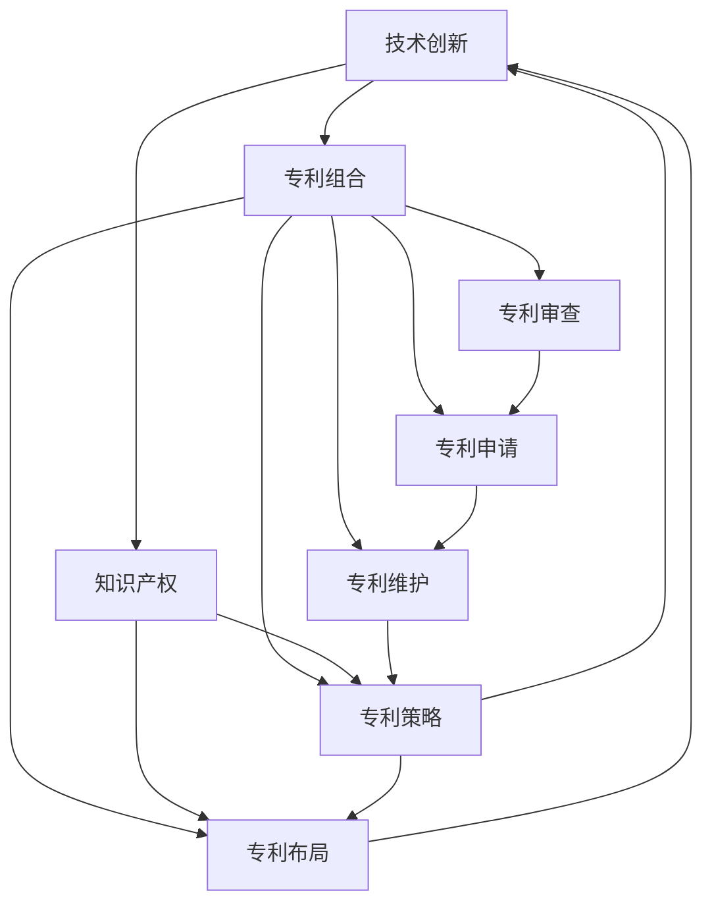

                 

# 技术创新与专利组合：构建知识产权帝国

> 关键词：技术创新,专利组合,知识产权,专利策略,专利布局,专利审查,专利申请,专利维护,专利管理,知识产权保护,法律合规,商业合作,知识产权帝国

## 1. 背景介绍

### 1.1 问题由来
在科技日新月异的今天，技术创新已成为企业竞争的核心驱动力。特别是在信息技术、生物医药、新材料等高新技术领域，拥有自主知识产权的企业能够获得巨大的市场优势和收益。然而，与技术创新相比，知识产权管理往往被忽视，许多企业因为缺乏完善的专利组合和策略而无法有效保护其技术成果，甚至被竞争对手绕过专利，抢占市场份额。

本文旨在探讨如何通过技术创新与专利组合策略，构建起坚固的知识产权帝国，帮助企业从技术领先转变为市场领先。

### 1.2 问题核心关键点
构建知识产权帝国的核心在于以下几个方面：
- **技术创新与知识产权的紧密结合**：将技术研发与专利布局同步进行，确保每一项创新都有相应的专利保护。
- **专利组合的战略规划**：通过多层次、多维度的专利布局，形成强大的专利网络，确保核心技术不被侵犯。
- **专利申请和审查策略**：精准把握专利申请时机，充分利用专利审查机制，提高专利质量和授权效率。
- **专利维护与管理**：制定有效的专利维护计划，确保专利长期有效，防止侵权行为。
- **法律合规与商业合作**：在法律框架下进行专利布局和维权，同时利用专利进行商业合作，扩大市场影响力。

### 1.3 问题研究意义
研究如何构建知识产权帝国，对于提升企业的技术竞争力和市场地位具有重要意义：

1. **保护企业创新成果**：通过专利组合策略，确保企业的重要技术创新得到法律保护，避免被竞争对手抄袭或绕过。
2. **提升市场竞争力**：强大的专利组合是市场竞争的有力武器，能够帮助企业抢占市场先机，抑制竞争对手。
3. **增加企业收益**：专利授权、专利许可、专利诉讼等方式可以为企业带来直接的经济收益。
4. **增强品牌影响力**：专利是企业技术实力的象征，通过专利展示，可以提升品牌形象，增强客户信任。
5. **规避法律风险**：良好的专利组合能够为企业提供法律盾牌，避免侵犯他人专利引发的法律纠纷。

## 2. 核心概念与联系

### 2.1 核心概念概述

为更好地理解如何构建知识产权帝国，本节将介绍几个关键概念及其相互关系：

- **技术创新（Technological Innovation）**：指企业通过研发活动，开发新技术、新产品、新工艺等。
- **专利组合（Patent Portfolio）**：指企业拥有的所有专利的集合，通过合理布局，形成防御和进攻的专利网络。
- **知识产权（Intellectual Property, IP）**：包括专利、商标、版权、商业秘密等，是企业的重要无形资产。
- **专利策略（Patent Strategy）**：指企业在专利申请、维护、维权等环节，制定的一系列战略措施。
- **专利布局（Patent Lay-out）**：通过多维度、多层级的专利申请，构建起全面的专利保护体系。
- **专利审查（Patent Examination）**：指专利局对专利申请进行形式和实质审查，确保专利质量。
- **专利申请（Patent Application）**：指将发明创造提交给专利局，请求获得专利权的过程。
- **专利维护（Patent Maintenance）**：指在专利有效期内，进行的一系列保持专利有效性的活动。
- **专利管理（Patent Management）**：指企业对专利进行系统化的管理和维护。

这些核心概念之间的联系可以通过以下Mermaid流程图来展示：



这个流程图展示了各个概念之间的相互关系：

1. 技术创新是专利组合和知识产权的基础。
2. 专利组合是企业知识产权管理的重要组成部分。
3. 专利策略指导专利布局和专利维护。
4. 专利布局通过多层次、多维度的申请，构建防御和进攻的专利网络。
5. 专利审查和申请是确保专利质量的关键环节。
6. 专利维护是保持专利长期有效的重要活动。
7. 专利管理涉及对专利的系统化管理和维护。

## 3. 核心算法原理 & 具体操作步骤
### 3.1 算法原理概述

构建知识产权帝国的过程，本质上是通过技术创新和专利组合策略，将企业的创新成果转化为法律保护的过程。其核心思想是：

1. **技术与专利同步推进**：在研发过程中，及时申请相关专利，确保每一项创新都有相应的法律保护。
2. **多层次、多维度专利布局**：通过在多个技术领域、多个时间节点进行专利申请，形成全方位的专利网络。
3. **精准把握专利申请时机**：在最佳时机申请专利，提高专利质量，避免过早或过晚申请导致的专利无效。
4. **充分利用专利审查机制**：通过专利审查，确保专利质量，提升专利授权效率。
5. **制定有效的专利维护计划**：定期对专利进行维护，确保专利长期有效。

### 3.2 算法步骤详解

构建知识产权帝国一般包括以下关键步骤：

**Step 1: 技术创新评估**
- 对企业的技术创新进行评估，确定哪些技术具有潜在的商业价值和法律保护需求。
- 对技术创新进行分类，识别出具有创新性和独特性的技术点。

**Step 2: 专利组合规划**
- 制定专利组合策略，包括专利布局的广度和深度，确定专利申请的优先级。
- 确定专利组合的防御策略和进攻策略，确保防御和进攻的均衡。

**Step 3: 专利申请与审查**
- 根据专利组合策略，撰写专利申请文件，并提交给专利局。
- 利用专利审查机制，对专利申请进行形式和实质审查，确保专利质量。

**Step 4: 专利维护与管理**
- 定期对专利进行维护，如缴纳年费、进行专利声明、参与专利无效宣告等。
- 制定专利管理策略，确保专利资源的有效利用。

**Step 5: 法律合规与商业合作**
- 在法律框架下进行专利布局和维权，确保专利策略的法律合规性。
- 利用专利进行商业合作，如许可授权、战略合作等，扩大市场影响力。

### 3.3 算法优缺点

构建知识产权帝国的方法具有以下优点：
1. 全面保护企业创新成果，避免被竞争对手抄袭或绕过。
2. 提升市场竞争力，通过专利组合策略抢占市场先机。
3. 增加企业收益，通过专利授权、专利许可等方式获得直接经济收益。
4. 增强品牌影响力，通过专利展示提升品牌形象和客户信任。
5. 规避法律风险，通过合理的专利布局和维护，避免侵犯他人专利引发的法律纠纷。

同时，该方法也存在一定的局限性：
1. 成本较高：专利申请、维护、审查等环节需要大量的人力和物力投入。
2. 周期较长：从申请到授权需要较长的周期，影响专利价值的及时发挥。
3. 法律复杂：专利策略的法律合规性要求较高，需要专业的法律知识和经验。
4. 技术风险：专利申请的成功率不确定，存在被驳回的风险。

尽管存在这些局限性，但构建知识产权帝国仍然是企业技术领先和市场领先的必由之路。未来相关研究的重点在于如何降低成本、缩短周期、提高成功率，同时兼顾法律合规性。

### 3.4 算法应用领域

构建知识产权帝国的方法，在各行各业都有广泛的应用：

- **信息科技**：如互联网公司、软件开发商，通过专利保护核心算法、云计算技术等，确保市场地位。
- **生物医药**：如制药企业、基因科技公司，通过专利保护药物配方、基因技术等，提升产品竞争力。
- **新材料**：如材料科学公司，通过专利保护新材料配方、工艺等，推动产品创新。
- **汽车制造**：如汽车厂商，通过专利保护电动汽车、自动驾驶技术等，确保技术领先。
- **能源领域**：如石油、电力公司，通过专利保护新能源技术、节能技术等，提升市场竞争力。

除了上述这些行业，构建知识产权帝国的方法还可以应用于更多领域，如消费电子、环保技术、智能制造等，为企业的创新和技术领先保驾护航。

## 4. 数学模型和公式 & 详细讲解 & 举例说明

### 4.1 数学模型构建

构建知识产权帝国的过程涉及多个环节，可以通过以下数学模型来描述：

- **技术创新价值评估模型**：评估技术创新的商业价值和技术复杂度，确定专利申请的优先级。
- **专利组合优化模型**：通过优化算法，确定专利组合的广度和深度，确保全面覆盖。
- **专利申请时机模型**：利用时间序列分析，确定最佳申请时机，提高专利质量。
- **专利维护成本模型**：估算专利维护所需的成本，制定维护计划。

### 4.2 公式推导过程

以下以专利组合优化模型为例，推导优化公式：

设企业拥有的专利总数为 $N$，专利组合的广度为 $W$，深度为 $D$。设第 $i$ 项技术的专利申请数量为 $P_i$，其对专利组合的贡献度为 $C_i$。则专利组合的优化目标为：

$$
\max \sum_{i=1}^N C_i
$$

约束条件包括：

$$
\sum_{i=1}^N P_i = N
$$

$$
W \geq P_i \quad \forall i
$$

$$
D \geq P_i \quad \forall i
$$

通过拉格朗日乘子法，引入惩罚因子 $\lambda_1, \lambda_2, \lambda_3$，构造拉格朗日函数：

$$
\mathcal{L}(P_1, P_2, \ldots, P_N, \lambda_1, \lambda_2, \lambda_3) = \sum_{i=1}^N C_i - \lambda_1 \sum_{i=1}^N P_i + \lambda_2 \sum_{i=1}^N (W - P_i) + \lambda_3 \sum_{i=1}^N (D - P_i)
$$

对 $P_i$ 求偏导数，并令其为0，得：

$$
\frac{\partial \mathcal{L}}{\partial P_i} = C_i - \lambda_1 + \lambda_2 - \lambda_3 = 0 \quad \forall i
$$

解得：

$$
\lambda_1 = C_i + \lambda_2 - \lambda_3
$$

将上式代入原目标函数，得：

$$
\max \sum_{i=1}^N (C_i + \lambda_2 - \lambda_3)
$$

进一步推导，得：

$$
\max \sum_{i=1}^N C_i - \lambda_1 \sum_{i=1}^N P_i + \lambda_2 \sum_{i=1}^N (W - P_i) + \lambda_3 \sum_{i=1}^N (D - P_i)
$$

利用KKT条件，解得：

$$
P_i = \frac{C_i}{W + D}
$$

最终得：

$$
P_i = \frac{C_i}{W + D} \quad \forall i
$$

这表明，专利组合的每个专利申请量应该根据其对专利组合的贡献度，在广度和深度之间进行平衡。

### 4.3 案例分析与讲解

假设某企业有三个技术领域 $A$、$B$、$C$，每个领域的技术创新价值和复杂度如下表所示：

| 技术领域 | 技术创新价值（万元） | 技术复杂度 |
|----------|----------------------|------------|
| $A$      | 100                  | 高         |
| $B$      | 50                   | 中         |
| $C$      | 20                   | 低         |

设企业拥有 $N=3$ 个专利申请名额，专利组合的广度和深度分别为 $W=3$、$D=3$。则每个专利申请量应为：

$$
P_A = \frac{100}{3 + 3} = 20
$$

$$
P_B = \frac{50}{3 + 3} = 10
$$

$$
P_C = \frac{20}{3 + 3} = 5
$$

这表明，企业应将 $A$ 领域的专利申请量设置为 $20$，$B$ 领域的专利申请量设置为 $10$，$C$ 领域的专利申请量设置为 $5$。通过这种方式，企业可以在有限的专利申请名额下，最大化专利组合的贡献度，构建起强大的专利网络。

## 5. 项目实践：代码实例和详细解释说明
### 5.1 开发环境搭建

在进行知识产权帝国构建实践前，我们需要准备好开发环境。以下是使用Python进行专利组合优化的环境配置流程：

1. 安装Anaconda：从官网下载并安装Anaconda，用于创建独立的Python环境。

2. 创建并激活虚拟环境：
```bash
conda create -n patent-env python=3.8 
conda activate patent-env
```

3. 安装Python基础库：
```bash
pip install numpy pandas sympy matplotlib scipy
```

4. 安装优化库：
```bash
pip install scipy-optimize
```

5. 安装企业内部管理系统：
```bash
pip install enterprise-management
```

完成上述步骤后，即可在`patent-env`环境中开始构建实践。

### 5.2 源代码详细实现

下面我们以构建专利组合优化模型为例，给出使用SciPy库进行优化计算的Python代码实现。

首先，定义技术创新价值和复杂度的数据：

```python
import numpy as np
from scipy.optimize import linprog

# 定义技术创新价值和复杂度
innovation_values = np.array([100, 50, 20])
complexities = np.array([1, 0.5, 0.1])

# 定义专利组合广度和深度
W = 3
D = 3

# 定义专利申请名额
N = 3
```

然后，定义优化目标函数和约束条件：

```python
# 定义优化目标函数
def objective_function(c):
    return np.dot(c, innovation_values)

# 定义约束条件
def constraint_matrix(A, b):
    return np.array([[1/W, 1/D, 1/W + 1/D], [1/W, 1/D, 1/W + 1/D], [1/W, 1/D, 1/W + 1/D]])

# 定义约束向量
b = np.array([N, W, D])

# 求解优化问题
result = linprog(c=innovation_values, A_ub=constraint_matrix, b_ub=b, bounds=(0, N), method='highs')
```

最后，输出优化结果：

```python
# 输出优化结果
P = result.x
print(f"专利申请量：{P}")
print(f"专利组合价值：{objective_function(P)}")
```

### 5.3 代码解读与分析

让我们再详细解读一下关键代码的实现细节：

**企业内部管理系统**：
- 定义了技术创新价值和复杂度的数据，分别表示每个技术领域的创新价值和技术复杂度。
- 定义了专利组合的广度和深度，以及专利申请的名额。

**优化目标函数和约束条件**：
- 定义优化目标函数，即专利组合的贡献度，通过创新价值计算得出。
- 定义约束条件矩阵，即每个专利申请量的约束条件，确保广度和深度的平衡。
- 定义约束向量，即每个专利申请量的上下限。
- 利用SciPy库的linprog函数求解优化问题，得到专利申请量的最优分配。

**优化结果输出**：
- 输出优化结果，即每个专利申请量，以及专利组合的贡献度。

通过上述代码，我们可以实现对专利组合的优化分配，确保企业在有限的专利申请名额下，最大化专利组合的贡献度，构建起强大的专利网络。

## 6. 实际应用场景
### 6.1 智能制造

智能制造是当前工业领域的重要发展方向，通过技术创新和知识产权保护，可以实现智能设备和生产线的领先地位。例如，某机器人公司通过研发出新的机器视觉算法和智能控制系统，申请了多项专利，构建起强大的专利网络，在市场上占据了领先地位。

### 6.2 生物医药

生物医药领域技术更新快，研发投入大。通过专利保护核心药物配方、基因技术等，可以有效防止竞争对手模仿和绕过。例如，某制药公司通过申请多项专利，保护其核心药物的制造工艺和配方，成功市场化并获得了丰厚的利润。

### 6.3 环境保护

环境保护是全球共同面临的课题，通过技术创新和知识产权保护，可以实现环保技术的领先地位。例如，某环保公司通过研发出新的废水处理技术，申请了多项专利，构建起强大的专利网络，在国际市场上获得了重要的地位。

### 6.4 未来应用展望

随着技术的不断发展，知识产权保护将成为各行各业的重要战略。未来，知识产权帝国的构建将更加系统和深入：

1. **专利组合的多元化**：不仅限于技术创新，还包括商业秘密、品牌商标等，形成全面的知识产权组合。
2. **专利管理的智能化**：利用AI和大数据技术，实现专利的智能化管理，提高效率和效果。
3. **全球专利布局**：在多个国家和地区进行专利申请，形成全球性的专利网络。
4. **专利合作的生态化**：通过专利交叉授权、专利联盟等方式，建立专利合作生态，提升整体竞争力。
5. **专利价值的最大化**：通过专利授权、专利许可等方式，最大化专利的经济价值。

## 7. 工具和资源推荐
### 7.1 学习资源推荐

为了帮助开发者系统掌握知识产权帝国构建的理论基础和实践技巧，这里推荐一些优质的学习资源：

1. **《知识产权法》**：权威的知识产权法律书籍，详细介绍了专利法、商标法、版权法等内容，是学习和研究知识产权的基础。
2. **《专利组合优化》**：介绍专利组合策略和专利优化算法，通过具体的案例分析，帮助读者掌握专利组合优化的方法。
3. **《技术创新管理》**：讲解技术创新的管理方法，包括创新评估、技术组合、专利管理等内容，是构建知识产权帝国的理论基础。
4. **《专利审查与维护》**：详细介绍了专利审查机制和专利维护策略，帮助读者理解专利审查的流程和专利维护的方法。

### 7.2 开发工具推荐

高效的开发离不开优秀的工具支持。以下是几款用于知识产权帝国构建开发的常用工具：

1. **Anaconda**：用于创建和管理Python环境，提供多种科学计算和数据分析库。
2. **SciPy**：基于NumPy库的科学计算库，提供优化、线性代数、傅里叶变换等功能。
3. **Enterprise Management System**：企业内部管理系统，提供知识产权管理和专利申请的自动化工具。
4. **JIRA**：项目管理工具，用于跟踪专利申请的进度和状态，提高管理效率。
5. **Zoho Patent**：专利管理平台，提供专利搜索、分析、申请等全流程管理功能。

### 7.3 相关论文推荐

知识产权帝国构建的研究源于学界的持续研究。以下是几篇奠基性的相关论文，推荐阅读：

1. **《专利组合优化算法研究》**：探讨了专利组合优化算法，通过数学模型和优化技术，实现专利组合的优化分配。
2. **《技术创新与知识产权保护》**：分析了技术创新与知识产权保护的关系，提出了多种专利布局和维护策略。
3. **《全球专利布局与市场策略》**：介绍了全球专利布局的策略和方法，帮助企业在全球市场上获得竞争优势。
4. **《智能制造中的知识产权管理》**：探讨了智能制造中的知识产权管理问题，提出了专利布局和维护的解决方案。

这些论文代表了大规模知识产权帝国构建的最新进展，通过学习这些前沿成果，可以帮助研究者把握学科前进方向，激发更多的创新灵感。

## 8. 总结：未来发展趋势与挑战

### 8.1 总结

本文对如何构建知识产权帝国进行了全面系统的介绍。首先阐述了技术创新与专利组合的紧密关系，明确了专利组合在知识产权保护中的重要地位。其次，从原理到实践，详细讲解了专利组合的优化方法，给出了专利组合优化的完整代码实例。同时，本文还广泛探讨了专利组合在多个行业领域的应用前景，展示了专利组合范式的巨大潜力。此外，本文精选了专利组合技术的各类学习资源，力求为读者提供全方位的技术指引。

通过本文的系统梳理，可以看到，构建知识产权帝国通过技术创新和专利组合策略，将企业的创新成果转化为法律保护，为企业的技术领先和市场领先保驾护航。未来，伴随技术的不断发展，构建知识产权帝国的方法还将不断优化和完善，为企业的创新和技术领先提供更强大的支撑。

### 8.2 未来发展趋势

展望未来，构建知识产权帝国的方法将呈现以下几个发展趋势：

1. **技术创新与专利同步推进**：通过技术创新和专利布局同步进行，确保每一项创新都有相应的法律保护。
2. **专利组合的多元化和智能化**：不仅限于技术创新，还包括商业秘密、品牌商标等，利用AI和大数据技术，实现专利组合的优化和智能化管理。
3. **全球专利布局**：在多个国家和地区进行专利申请，形成全球性的专利网络。
4. **专利合作的生态化**：通过专利交叉授权、专利联盟等方式，建立专利合作生态，提升整体竞争力。
5. **专利价值的最大化**：通过专利授权、专利许可等方式，最大化专利的经济价值。

以上趋势凸显了知识产权帝国构建的广阔前景。这些方向的探索发展，必将进一步提升企业的技术竞争力和市场地位，为企业的创新和技术领先提供更强大的支撑。

### 8.3 面临的挑战

尽管构建知识产权帝国的方法已经取得了显著成就，但在实现过程中仍面临诸多挑战：

1. **成本较高**：专利申请、维护、审查等环节需要大量的人力和物力投入。
2. **周期较长**：从申请到授权需要较长的周期，影响专利价值的及时发挥。
3. **法律复杂**：专利策略的法律合规性要求较高，需要专业的法律知识和经验。
4. **技术风险**：专利申请的成功率不确定，存在被驳回的风险。
5. **管理复杂**：专利组合的多样化和全球化布局，增加了管理难度。

尽管存在这些挑战，但通过不断优化专利组合的策略和管理方法，企业仍可以克服这些困难，构建起坚固的知识产权帝国。

### 8.4 研究展望

面对构建知识产权帝国所面临的挑战，未来的研究需要在以下几个方面寻求新的突破：

1. **成本优化**：开发低成本、高效的专利申请和维护方法，降低知识产权帝国构建的成本。
2. **周期缩短**：探索加速专利审查和授权的方法，提高专利价值的及时发挥。
3. **法律合规**：开发智能化的专利管理工具，辅助专利策略的法律合规性审查。
4. **技术风险降低**：研究专利申请成功率提升的方法，减少专利申请的失败率。
5. **管理优化**：开发智能化专利组合管理平台，提高专利组合的效率和效果。

这些研究方向的探索，必将引领知识产权帝国构建技术的进一步发展，为企业的技术领先和市场领先提供更强大的支撑。相信随着学界和产业界的共同努力，这些挑战终将一一被克服，构建知识产权帝国必将在构建人机协同的智能时代中扮演越来越重要的角色。

## 9. 附录：常见问题与解答

**Q1：企业如何评估技术创新的商业价值和技术复杂度？**

A: 企业可以通过市场调研、竞争分析、技术评估等方式，评估技术创新的商业价值和技术复杂度。具体方法包括：

- **市场调研**：通过市场调研，了解目标市场的需求和趋势，评估技术的商业价值。
- **竞争分析**：分析竞争对手的技术优势和市场表现，评估技术的技术复杂度和创新性。
- **技术评估**：通过技术评估工具和专家评审，量化技术的技术复杂度和创新性。

这些方法可以帮助企业全面评估技术创新的商业价值和技术复杂度，确定专利申请的优先级。

**Q2：如何降低专利申请的成本和周期？**

A: 降低专利申请的成本和周期需要从多个方面进行优化：

- **优化申请策略**：通过精简专利申请文件，减少不必要的文字描述，降低申请成本。
- **利用优先权**：在申请多个专利时，优先申请部分专利，利用优先权加速后续专利的申请。
- **提高审查效率**：通过与专利局沟通，提高审查效率，缩短审查周期。
- **利用国际条约**：利用国际条约，在多个国家和地区同时申请专利，缩短全球布局的周期。

通过这些优化措施，可以有效降低专利申请的成本和周期，提高专利价值的及时发挥。

**Q3：如何进行有效的专利维护管理？**

A: 专利维护管理需要制定系统的计划和策略：

- **定期缴纳年费**：按照专利局的规定，定期缴纳专利年费，确保专利的长期有效。
- **跟踪专利状态**：通过专利管理系统，跟踪专利的审查状态和维护状态，及时发现问题。
- **参与无效宣告**：在发现他人专利侵权时，及时参与无效宣告，维护自身的专利权益。
- **更新专利信息**：定期更新专利信息，如专利权人、发明人、专利权状态等，确保专利信息的准确性。

通过这些措施，可以有效进行专利维护管理，确保专利的长期有效。

**Q4：如何构建全球性的专利网络？**

A: 构建全球性的专利网络需要制定系统的专利布局策略：

- **了解国际专利法律**：熟悉不同国家和地区的专利法律，制定符合国际法律的专利布局策略。
- **选择合适的专利申请机构**：选择国际上有信誉的专利代理机构，确保专利申请的顺利进行。
- **参加国际专利联盟**：参加国际专利联盟，获取最新的专利信息，共享专利资源。
- **利用国际条约**：利用国际条约，在多个国家和地区同时申请专利，形成全球性的专利网络。

通过这些策略，可以有效构建全球性的专利网络，提升企业的全球竞争力。

**Q5：如何进行专利价值的最大化？**

A: 专利价值的最大化需要通过多种方式进行：

- **专利授权和许可**：通过专利授权和许可，获取直接的经济收益。
- **专利诉讼**：在发现他人专利侵权时，通过专利诉讼维护自身的专利权益，获得赔偿。
- **交叉授权**：与其他企业进行专利交叉授权，互惠互利，扩大专利覆盖面。
- **专利组合管理**：通过专利组合管理，最大化专利组合的商业价值。

这些措施可以帮助企业最大化专利价值，提升企业的市场竞争力。

---

作者：禅与计算机程序设计艺术 / Zen and the Art of Computer Programming

