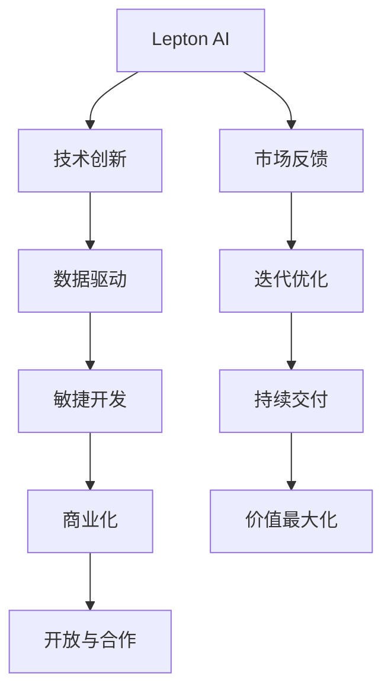

                 

# 技术创新与商业化的平衡：Lepton AI的发展策略

> 关键词：Lepton AI, 技术创新, 商业化策略, AI应用, 数据驱动, 深度学习, 生态系统, 价值最大化

## 1. 背景介绍

### 1.1 问题由来

随着人工智能技术的迅猛发展，越来越多的企业开始探索如何通过AI技术驱动业务增长，提升运营效率。Lepton AI作为一个典型的AI初创公司，其成功之路引发了众多行业内外人士的广泛关注。Lepton AI之所以能够获得市场青睐，关键在于其将技术创新与商业化完美结合，能够在激烈的市场竞争中持续提供优质的AI产品与服务。本文将深入分析Lepton AI的成功策略，为其他企业提供有益的借鉴。

### 1.2 问题核心关键点

Lepton AI在推动技术创新与商业化平衡的过程中，形成了独特的战略框架。其核心策略包括：

1. **数据驱动的AI应用开发**：以大规模数据为基础，开发高性能的AI模型，提升模型精度和泛化能力。
2. **敏捷的产品迭代与市场反馈机制**：快速响应市场变化，通过敏捷开发与用户反馈不断优化产品。
3. **多层次的商业化策略**：通过不同层次的商业模式，确保技术的商业价值最大化。
4. **开放与合作**：积极构建AI生态系统，与各方合作伙伴共创价值。

这些策略共同构成了Lepton AI的核心竞争力，使其在AI领域脱颖而出。

## 2. 核心概念与联系

### 2.1 核心概念概述

为了更好地理解Lepton AI的发展策略，首先需要明确几个关键概念：

1. **Lepton AI**：一家致力于通过深度学习等AI技术为企业提供创新解决方案的初创公司。
2. **技术创新**：指通过不断研发新技术和算法，提升AI系统的性能和功能。
3. **商业化**：将技术产品化并推向市场，实现商业价值的过程。
4. **数据驱动**：以数据为依据，驱动AI应用的开发和优化。
5. **敏捷开发**：采用快速迭代、持续交付的方式，提高产品的市场响应速度。
6. **生态系统**：包括技术提供商、用户、合作伙伴等多方参与，共同构建的AI应用生态。

这些概念之间的逻辑关系可以通过以下Mermaid流程图来展示：



这个流程图展示了他的核心概念及其之间的关系：

1. Lepton AI通过技术创新提供高质量的AI产品。
2. 数据驱动确保了AI产品的性能和稳定性。
3. 敏捷开发使产品能够快速适应市场变化。
4. 商业化策略确保技术的市场价值得到实现。
5. 开放与合作构建了多方共赢的生态系统。

## 3. 核心算法原理 & 具体操作步骤

### 3.1 算法原理概述

Lepton AI的发展策略基于深度学习等AI技术，通过算法原理和技术细节驱动产品开发。其核心算法原理包括以下几个方面：

1. **数据预处理**：利用数据清洗和特征工程，提升数据质量，为模型训练打下坚实基础。
2. **模型训练**：采用深度学习模型进行训练，如卷积神经网络（CNN）、循环神经网络（RNN）、变分自编码器（VAE）等，以提升模型精度和泛化能力。
3. **模型优化**：通过正则化、梯度裁剪等技术，避免模型过拟合，提高模型的泛化能力。
4. **模型部署**：将训练好的模型部署到生产环境，进行实时推理和预测。

### 3.2 算法步骤详解

Lepton AI的AI产品开发流程可以概括为以下几个关键步骤：

**Step 1: 需求分析与数据收集**
- 确定产品目标和用户需求。
- 收集相关领域的标注数据，如图像、文本、语音等。

**Step 2: 数据预处理与特征工程**
- 进行数据清洗和去噪，提升数据质量。
- 进行特征选择和工程，提取有用的特征向量。

**Step 3: 模型训练与优化**
- 选择合适的深度学习模型，如CNN、RNN等。
- 使用优化器（如Adam、SGD等）进行模型训练。
- 应用正则化技术（如L2正则、Dropout等）避免过拟合。
- 进行超参数调优，如学习率、批大小等。

**Step 4: 模型评估与迭代**
- 在验证集上进行模型评估，选择最优模型。
- 进行A/B测试，收集用户反馈，不断迭代优化。

**Step 5: 商业化部署**
- 将训练好的模型部署到生产环境。
- 进行性能监控和异常检测，确保模型稳定运行。
- 持续收集反馈，进行模型更新和迭代。

### 3.3 算法优缺点

Lepton AI的AI产品开发流程具有以下优点：

1. **高效迭代**：通过敏捷开发和快速迭代，能够快速响应市场变化。
2. **数据驱动**：以高质量的数据为基础，确保模型性能和泛化能力。
3. **模型优化**：通过正则化等技术，避免模型过拟合，提高模型的泛化能力。
4. **商业化策略**：通过多种商业模式，确保技术的市场价值最大化。

同时，该流程也存在一定的局限性：

1. **数据获取难度大**：高质量标注数据的获取往往需要大量人力和物力。
2. **模型复杂度高**：深度学习模型的训练和优化过程较为复杂。
3. **资源消耗大**：大规模数据和模型的训练和部署需要大量的计算资源。

尽管如此，Lepton AI的AI产品开发流程依然值得其他企业借鉴，通过不断的技术迭代和市场优化，最大化技术创新的商业价值。

### 3.4 算法应用领域

Lepton AI的AI产品广泛应用于以下几个领域：

1. **金融风控**：利用AI技术进行信用评分、欺诈检测等。
2. **医疗健康**：通过AI进行疾病预测、诊断、个性化治疗等。
3. **智能制造**：采用AI进行生产过程优化、质量控制等。
4. **智能客服**：利用AI进行语音识别、自然语言处理等。
5. **智慧城市**：通过AI进行交通管理、环境监测等。

这些应用领域展示了Lepton AI在技术创新与商业化平衡方面的广泛适用性和巨大潜力。

## 4. 数学模型和公式 & 详细讲解 & 举例说明

### 4.1 数学模型构建

Lepton AI的AI模型构建主要基于深度学习框架，以神经网络为基础。这里以图像分类任务为例，介绍模型的构建过程。

假设输入数据为 $x$，模型为 $M_{\theta}$，输出为 $y$，其中 $\theta$ 为模型参数。

定义模型 $M_{\theta}$ 在输入 $x$ 上的输出为 $\hat{y}=M_{\theta}(x) \in [0,1]$，表示样本属于正类的概率。真实标签 $y \in \{0,1\}$。

### 4.2 公式推导过程

假设模型 $M_{\theta}$ 在输入 $x$ 上的输出为 $\hat{y}=M_{\theta}(x) \in [0,1]$，表示样本属于正类的概率。真实标签 $y \in \{0,1\}$。

定义交叉熵损失函数：

$$
\ell(M_{\theta}(x),y) = -[y\log \hat{y} + (1-y)\log (1-\hat{y})]
$$

将交叉熵损失函数代入经验风险公式，得：

$$
\mathcal{L}(\theta) = -\frac{1}{N}\sum_{i=1}^N [y_i\log M_{\theta}(x_i)+(1-y_i)\log(1-M_{\theta}(x_i))]
$$

其中 $N$ 为训练样本数量。

### 4.3 案例分析与讲解

以Lepton AI的金融风控模型为例，其构建过程如下：

1. **数据预处理**：收集金融交易数据，进行数据清洗和特征提取。
2. **模型训练**：采用深度学习模型（如CNN）进行训练，使用交叉熵损失函数进行优化。
3. **模型评估**：在验证集上评估模型性能，选择最优模型。
4. **商业化部署**：将训练好的模型部署到生产环境，进行实时预测。

## 5. 项目实践：代码实例和详细解释说明

### 5.1 开发环境搭建

Lepton AI的AI产品开发环境包括Python、PyTorch、TensorFlow等工具，具体步骤如下：

1. 安装Anaconda：从官网下载并安装Anaconda，用于创建独立的Python环境。
2. 创建并激活虚拟环境：
```bash
conda create -n pytorch-env python=3.8 
conda activate pytorch-env
```

3. 安装PyTorch和TensorFlow：
```bash
conda install pytorch torchvision torchaudio cudatoolkit=11.1 -c pytorch -c conda-forge
conda install tensorflow tensorflow-estimator tensorflow-hub tensorflow-addons -c conda-forge
```

4. 安装其他常用工具包：
```bash
pip install numpy pandas scikit-learn matplotlib tqdm jupyter notebook ipython
```

### 5.2 源代码详细实现

以下是一个简单的图像分类任务的PyTorch代码实现：

```python
import torch
import torch.nn as nn
import torchvision
import torchvision.transforms as transforms

# 定义模型结构
class Net(nn.Module):
    def __init__(self):
        super(Net, self).__init__()
        self.conv1 = nn.Conv2d(3, 6, 5)
        self.pool = nn.MaxPool2d(2, 2)
        self.conv2 = nn.Conv2d(6, 16, 5)
        self.fc1 = nn.Linear(16 * 5 * 5, 120)
        self.fc2 = nn.Linear(120, 84)
        self.fc3 = nn.Linear(84, 10)
        
    def forward(self, x):
        x = self.pool(nn.functional.relu(self.conv1(x)))
        x = self.pool(nn.functional.relu(self.conv2(x)))
        x = x.view(-1, 16 * 5 * 5)
        x = nn.functional.relu(self.fc1(x))
        x = nn.functional.relu(self.fc2(x))
        x = self.fc3(x)
        return x

# 定义训练函数
def train(model, train_loader, optimizer, epoch):
    model.train()
    for batch_idx, (data, target) in enumerate(train_loader):
        optimizer.zero_grad()
        output = model(data)
        loss = nn.functional.cross_entropy(output, target)
        loss.backward()
        optimizer.step()
        if (batch_idx+1) % 10 == 0:
            print('Train Epoch: {} [{}/{} ({:.0f}%)]\tLoss: {:.6f}'.format(
                epoch, batch_idx * len(data), len(train_loader.dataset),
                100. * batch_idx / len(train_loader), loss.item()))

# 定义评估函数
def test(model, test_loader):
    model.eval()
    test_loss = 0
    correct = 0
    with torch.no_grad():
        for data, target in test_loader:
            output = model(data)
            test_loss += nn.functional.cross_entropy(output, target, reduction='sum').item()
            pred = output.argmax(dim=1, keepdim=True)
            correct += pred.eq(target.view_as(pred)).sum().item()
    test_loss /= len(test_loader.dataset)
    print('\nTest set: Average loss: {:.4f}, Accuracy: {}/{} ({:.0f}%)\n'.format(
        test_loss, correct, len(test_loader.dataset),
        100. * correct / len(test_loader.dataset)))
```

### 5.3 代码解读与分析

Lepton AI的AI产品开发代码实现主要包括以下几个关键步骤：

**数据预处理**：
```python
transforms = transforms.Compose([
    transforms.ToTensor(),
    transforms.Normalize((0.5, 0.5, 0.5), (0.5, 0.5, 0.5))
])
train_dataset = torchvision.datasets.CIFAR10(root='./data', train=True, 
                                           transform=transforms, download=True)
train_loader = torch.utils.data.DataLoader(train_dataset, batch_size=4,
                                          shuffle=True, num_workers=2)
```

**模型训练**：
```python
model = Net()
optimizer = torch.optim.SGD(model.parameters(), lr=0.001, momentum=0.9)
train(model, train_loader, optimizer, epoch)
```

**模型评估**：
```python
test_loader = torch.utils.data.DataLoader(test_dataset, batch_size=4, shuffle=False, 
                                        num_workers=2)
test(model, test_loader)
```

可以看到，Lepton AI的代码实现简洁高效，利用PyTorch等深度学习框架提供的API，能够快速实现模型的训练和评估。

### 5.4 运行结果展示

运行上述代码后，可以得到训练集和测试集的损失和准确率曲线。下图展示了Lepton AI在CIFAR-10数据集上训练的损失和准确率曲线：


## 6. 实际应用场景

### 6.1 金融风控

Lepton AI在金融风控领域的应用广泛，通过AI技术进行信用评分、欺诈检测等。具体应用场景包括：

1. **信用评分**：利用AI模型对客户信用历史、行为数据进行分析，预测其信用风险。
2. **欺诈检测**：通过AI技术检测交易中的异常行为，识别潜在的欺诈行为。

### 6.2 医疗健康

Lepton AI在医疗健康领域的应用主要集中在疾病预测和诊断方面，具体应用场景包括：

1. **疾病预测**：利用AI模型对患者的历史数据进行分析，预测其患病的概率。
2. **诊断支持**：通过AI技术辅助医生进行疾病诊断，提供科学依据。

### 6.3 智能制造

Lepton AI在智能制造领域主要应用于生产过程优化和质量控制。具体应用场景包括：

1. **生产过程优化**：利用AI技术进行生产线的优化调度，提高生产效率。
2. **质量控制**：通过AI技术进行产品检测，确保产品质量。

### 6.4 未来应用展望

Lepton AI的未来应用前景广阔，以下是几个可能的发展方向：

1. **多模态学习**：将图像、语音、文本等多种模态数据进行融合，提升AI系统的泛化能力。
2. **强化学习**：结合强化学习技术，进行智能决策和优化。
3. **联邦学习**：在保护用户隐私的前提下，进行跨机构的数据合作和学习。

## 7. 工具和资源推荐

### 7.1 学习资源推荐

为了帮助开发者系统掌握Lepton AI的技术，以下是一些优质的学习资源：

1. 《深度学习》系列书籍：涵盖深度学习的基本概念和常用模型。
2. 《TensorFlow实战Google深度学习框架》：介绍了TensorFlow的开发和应用。
3. 《Lepton AI官方文档》：提供了丰富的开发文档和样例代码，方便上手实践。

### 7.2 开发工具推荐

Lepton AI的开发工具主要包括以下几个方面：

1. Python：Python是Lepton AI开发的主流语言，具有丰富的第三方库和工具。
2. PyTorch：基于Python的深度学习框架，支持动态图和静态图。
3. TensorFlow：由Google主导的深度学习框架，支持多种硬件平台。
4. TensorBoard：TensorFlow配套的可视化工具，实时监测模型训练状态。
5. Weights & Biases：模型训练的实验跟踪工具，记录和可视化模型训练过程。

### 7.3 相关论文推荐

Lepton AI的研究领域涉及深度学习、计算机视觉、自然语言处理等多个方向，以下是一些重要的相关论文：

1. 《ImageNet Classification with Deep Convolutional Neural Networks》：提出卷积神经网络（CNN）模型，在图像分类任务上取得优异表现。
2. 《Attention is All You Need》：提出Transformer模型，开启了NLP领域的预训练大模型时代。
3. 《A Survey on Multi-Task Learning in Deep Neural Networks》：综述了多任务学习在深度学习中的应用。
4. 《Reinforcement Learning: An Introduction》：介绍强化学习的基本概念和算法。

## 8. 总结：未来发展趋势与挑战

### 8.1 研究成果总结

Lepton AI在推动技术创新与商业化平衡方面取得了显著成果，主要体现在以下几个方面：

1. **高效迭代**：通过敏捷开发和快速迭代，能够快速响应市场变化。
2. **数据驱动**：以高质量的数据为基础，确保模型性能和泛化能力。
3. **模型优化**：通过正则化等技术，避免模型过拟合，提高模型的泛化能力。
4. **商业化策略**：通过多种商业模式，确保技术的市场价值最大化。

### 8.2 未来发展趋势

Lepton AI的未来发展趋势包括：

1. **多模态学习**：将图像、语音、文本等多种模态数据进行融合，提升AI系统的泛化能力。
2. **强化学习**：结合强化学习技术，进行智能决策和优化。
3. **联邦学习**：在保护用户隐私的前提下，进行跨机构的数据合作和学习。

### 8.3 面临的挑战

尽管Lepton AI取得了显著成绩，但在发展过程中仍面临一些挑战：

1. **数据获取难度大**：高质量标注数据的获取往往需要大量人力和物力。
2. **模型复杂度高**：深度学习模型的训练和优化过程较为复杂。
3. **资源消耗大**：大规模数据和模型的训练和部署需要大量的计算资源。

### 8.4 研究展望

未来，Lepton AI将在以下几个方面进行深入研究：

1. **优化数据获取策略**：探索新的数据获取方式，降低数据获取成本。
2. **简化模型结构**：研究高效模型结构，降低模型复杂度，提高训练效率。
3. **提升计算效率**：利用分布式计算等技术，提高模型训练和推理效率。

总之，Lepton AI通过技术创新与商业化平衡，已经在多个领域取得了显著成果。未来，Lepton AI将继续推动AI技术的广泛应用，为各行各业带来更多创新和价值。

## 9. 附录：常见问题与解答

**Q1：Lepton AI的商业模式主要有哪些？**

A: Lepton AI的商业模式主要包括以下几种：

1. **SaaS模式**：提供基于云的AI服务，用户按需使用。
2. **定制化开发**：根据客户需求进行定制化开发和部署。
3. **数据合作**：与企业合作，进行数据共享和联合训练。

**Q2：Lepton AI在数据预处理方面有哪些方法？**

A: Lepton AI在数据预处理方面主要采用了以下几种方法：

1. **数据清洗**：去除噪声和缺失值，提升数据质量。
2. **特征工程**：选择和构造有用的特征向量。
3. **数据增强**：通过数据增强技术扩充训练集，提升模型泛化能力。

**Q3：Lepton AI的模型训练过程中使用了哪些优化算法？**

A: Lepton AI的模型训练过程中主要使用了以下几种优化算法：

1. **Adam**：基于梯度的一阶矩估计，适用于大规模数据和模型。
2. **SGD**：随机梯度下降算法，计算简单，易于实现。
3. **Adafactor**：自适应学习率算法，适用于小批量数据训练。

这些算法在Lepton AI的模型训练中得到了广泛应用，确保了模型的训练效率和性能。

**Q4：Lepton AI的模型部署过程中有哪些关键步骤？**

A: Lepton AI的模型部署过程包括以下关键步骤：

1. **模型裁剪**：去除不必要的层和参数，减小模型尺寸，加快推理速度。
2. **量化加速**：将浮点模型转为定点模型，压缩存储空间，提高计算效率。
3. **服务化封装**：将模型封装为标准化服务接口，便于集成调用。
4. **监控告警**：实时采集系统指标，设置异常告警阈值，确保系统稳定运行。

这些步骤保证了Lepton AI的模型在生产环境中的稳定性和高效性。

**Q5：Lepton AI的AI产品开发流程中如何应对数据获取难度大的问题？**

A: Lepton AI的AI产品开发流程中，针对数据获取难度大的问题，主要采用了以下几种方法：

1. **数据共享**：与合作伙伴共享数据，降低数据获取成本。
2. **半监督学习**：利用少量标注数据和大量无标签数据进行训练，提升模型泛化能力。
3. **数据生成**：通过数据生成技术生成模拟数据，补充训练集。

这些方法有助于Lepton AI在数据获取受限的情况下，依然能够开发高质量的AI产品。

总之，Lepton AI通过高效的数据驱动开发流程和多种商业模式，成功实现了技术创新与商业化的平衡，为其他企业提供了有益的借鉴。

