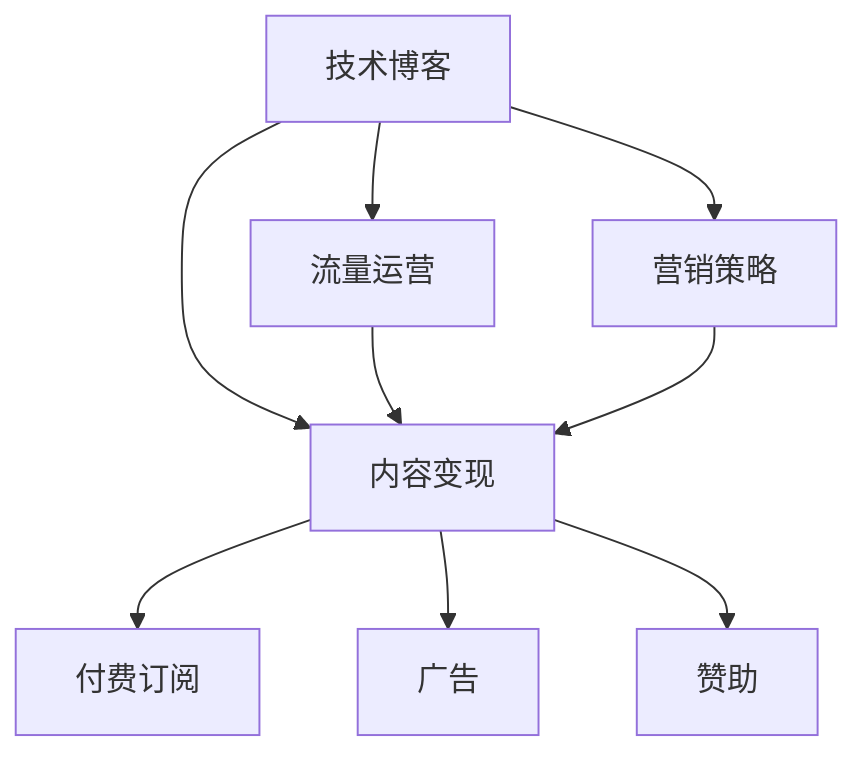

                 

# 技术博客变现：策略与方法

> 关键词：技术博客,变现策略,营销,流量运营,内容营销,SEO优化

## 1. 背景介绍

### 1.1 问题由来
随着互联网技术的快速发展，技术博客逐渐成为一种新的信息获取和知识分享平台。通过分享专业领域的知识和经验，技术博客不仅可以提升个人品牌影响力，还能吸引大量读者关注。然而，仅有高质量的内容不足以实现技术博客的商业化，变现成为技术博客进一步发展的关键问题。

### 1.2 问题核心关键点
技术博客变现的关键在于如何有效运营流量，并转化为实际收入。主要问题包括：
1. 如何提升博客的访问量和用户粘性。
2. 如何将读者流量转化为付费订阅、广告、赞助等收益。
3. 如何在不破坏博客内容质量的前提下实现商业变现。
4. 如何评估和优化变现策略的有效性。

### 1.3 问题研究意义
技术博客变现不仅能带来直接的财务收益，还能帮助作者积累行业影响力，构建知识社区，促进技术传播和应用。其意义在于：

1. 增强博客的可持续性。通过商业化运作，博客可以持续获取资金支持，保持高质量内容的持续输出。
2. 提升作者影响力。优质的技术博客可以吸引行业专家和读者关注，建立作者在技术领域的权威地位。
3. 推动技术应用。通过博客分享技术经验和最佳实践，可以促进技术的实际应用，加速技术创新。

## 2. 核心概念与联系

### 2.1 核心概念概述

为更好地理解技术博客变现的方法，本节将介绍几个密切相关的核心概念：

- 技术博客(Technical Blog)：专注于分享技术知识、开发经验、行业动态等的博客，旨在提供有价值的行业信息和技术洞见。
- 内容变现(Content Monetization)：通过博客内容吸引流量，并转化为付费订阅、广告、赞助等收益的过程。
- 流量运营(Follow-up Management)：通过提高用户粘性和参与度，提升博客流量和读者忠诚度。
- 营销策略(Marketing Strategy)：为了实现博客变现目标，采取的各种推广和运营手段。
- 内容营销(Content Marketing)：利用高质量内容吸引和保留受众，建立品牌信任和影响力。
- SEO优化(Search Engine Optimization)：通过优化博客内容及搜索引擎规则，提高博客在搜索引擎中的排名，增加曝光度。

这些核心概念之间的逻辑关系可以通过以下Mermaid流程图来展示：



这个流程图展示的技术博客变现的核心概念及其之间的关系：

1. 技术博客通过高质量内容吸引读者。
2. 内容变现通过读者流量转化为付费、广告等收益。
3. 流量运营提升用户粘性，保持长期读者关注。
4. 营销策略指导流量运营，提高变现效率。

## 3. 核心算法原理 & 具体操作步骤
### 3.1 算法原理概述

技术博客变现的核心在于有效运营流量，并实现内容的商业价值。其核心思想是：通过高质量内容吸引目标读者，并利用多渠道营销手段提升博客的曝光度和访问量，最终将流量转化为实际收益。

形式化地，假设技术博客的访问量为 $D$，付费订阅量为 $S$，广告收入为 $A$，赞助收入为 $F$，则变现目标可以表示为：

$$
\text{Total Revenue} = S + A + F
$$

其中，$S$ 可以通过博客订阅计划实现，$A$ 和 $F$ 可以通过广告和赞助等营销手段实现。变现的算法原理主要包括以下几个步骤：

1. 提升博客访问量 $D$。
2. 吸引付费订阅 $S$。
3. 增加广告收入 $A$。
4. 获取赞助收入 $F$。

### 3.2 算法步骤详解

技术博客变现的算法主要包括以下几个关键步骤：

**Step 1: 提升博客访问量**
- 优化博客内容：发布高质量、有价值的技术文章，吸引目标读者。
- 多渠道推广：利用社交媒体、SEO、合作平台等渠道推广博客内容。
- 定期更新：保持博客内容的定期更新，增加读者回访频率。

**Step 2: 吸引付费订阅**
- 设计合理的订阅计划：提供不同付费层级，满足不同层次读者的需求。
- 提供优质内容：订阅者可以获取专属内容、提前发布等优惠。
- 吸引新订阅者：通过推广活动、邀请码等方式吸引新订阅用户。

**Step 3: 增加广告收入**
- 选择合适的广告平台：如Google Ads、Baidu Ads等，根据博客内容选择合适广告位。
- 优化广告投放：根据用户行为数据，进行精准广告投放。
- 提高点击率：优化广告创意和落地页，提升广告点击率。

**Step 4: 获取赞助收入**
- 寻找合适赞助商：根据博客内容和读者群体，选择适合的赞助商。
- 设计赞助形式：赞助商可以提供产品试用、技术支持等。
- 公开感谢：在博客上公开感谢赞助商，提升品牌曝光。

### 3.3 算法优缺点

技术博客变现方法具有以下优点：
1. 简单高效。通过优化博客内容和多渠道推广，即可实现流量和收益的双重提升。
2. 适用性广。适用于各种类型的技术博客，包括技术开发、行业分析、产品评测等。
3. 收入多样。通过订阅、广告、赞助等多种变现方式，可以实现收入的多元化。
4. 成本可控。相对于传统媒体，技术博客的运营成本较低，且可灵活控制广告和赞助费用。

同时，该方法也存在一些局限性：
1. 对内容质量依赖高。博客的流量和变现效果很大程度上依赖于内容的吸引力。
2. 广告收入受市场波动影响。广告收入受到广告平台策略和市场环境的影响，不稳定。
3. 赞助商选择难度大。需要根据博客内容选择合适的赞助商，难度较大。
4. 数据隐私风险。利用读者数据进行精准营销时，需要注意数据隐私保护，避免违规风险。

尽管存在这些局限性，但就目前而言，技术博客变现方法仍然是大博客变现的主流方式。未来相关研究的重点在于如何进一步提高内容质量和吸引力，优化广告和赞助策略，同时兼顾数据隐私和法律法规。

### 3.4 算法应用领域

技术博客变现方法在技术博客领域已经得到了广泛的应用，覆盖了几乎所有常见技术博客类型，例如：

- 技术开发博客：分享软件开发经验、技术栈选择、代码案例等。通过提供高质量代码示例和工具推荐，吸引大量开发者订阅。
- 行业分析博客：对特定技术领域的市场动态、应用趋势、技术洞见等进行分析。通过深度分析吸引专业人士订阅和广告投放。
- 产品评测博客：对各类技术产品进行评测和对比。通过详细评测和用户体验分享，吸引消费者和厂商赞助。
- 开源项目博客：分享开源项目的开发进展、使用指南、社区活动等。通过开源项目的社区影响力吸引开发者和企业的广告和赞助。

除了上述这些经典类型外，技术博客变现方法也被创新性地应用到更多场景中，如技术培训、在线课程、技术咨询等，为技术传播和技术交流提供新的商业模式。

## 4. 数学模型和公式 & 详细讲解
### 4.1 数学模型构建

本节将使用数学语言对技术博客变现的算法进行更加严格的刻画。

假设博客的访问量为 $D$，其中 $D_{自然} = D_1 + D_2 + ... + D_n$ 为自然流量，$D_{广告} = D_{A1} + D_{A2} + ... + D_{An}$ 为广告流量，$D_{赞助} = D_{S1} + D_{S2} + ... + D_{Sn}$ 为赞助流量。则总访问量为：

$$
D = D_{自然} + D_{广告} + D_{赞助}
$$

其中，$D_{自然}$ 受博客内容质量、搜索引擎优化等因素影响，$D_{广告}$ 受广告投放策略和广告平台效果影响，$D_{赞助}$ 受赞助商选择和赞助形式设计影响。

变现模型可以表示为：

$$
\text{Total Revenue} = S + A + F
$$

其中，$S$ 为订阅收入，$A$ 为广告收入，$F$ 为赞助收入。

### 4.2 公式推导过程

以下我们以订阅收入 $S$ 为例，推导订阅模型及其影响因素。

假设博客的订阅用户数为 $N$，每个用户支付的年订阅费为 $P$，则订阅收入 $S$ 可以表示为：

$$
S = N \times P
$$

其中，$N$ 受博客内容质量和推广活动的影响，$P$ 受订阅计划和市场定价策略的影响。

通过优化博客内容质量和推广策略，可以有效提升 $N$ 和 $P$，从而增加订阅收入 $S$。

### 4.3 案例分析与讲解

**案例：** 某技术博客通过优化内容质量和SEO策略，自然流量从每月1万提升至3万。同时，博客推出了针对不同层次用户的订阅计划，订阅用户从每月100增加到500，每个用户支付的年订阅费从100元提升至200元。

**分析：**
- 优化内容质量和SEO策略：提升自然流量 $D_{自然}$，从而增加访问量 $D$。
- 设计订阅计划：提供专属内容和提前发布等优惠，吸引更多用户订阅，增加 $N$。
- 提高订阅费：调整市场定价策略，提升年订阅费 $P$。

通过以上措施，博客的订阅收入 $S$ 从每月10000元提升至每月100000元，实现了显著的变现效果。

## 5. 项目实践：代码实例和详细解释说明
### 5.1 开发环境搭建

在进行博客变现实践前，我们需要准备好开发环境。以下是使用Python进行SEO优化和流量运营的开发环境配置流程：

1. 安装Anaconda：从官网下载并安装Anaconda，用于创建独立的Python环境。

2. 创建并激活虚拟环境：
```bash
conda create -n blog-env python=3.8 
conda activate blog-env
```

3. 安装PyTorch：根据CUDA版本，从官网获取对应的安装命令。例如：
```bash
conda install pytorch torchvision torchaudio cudatoolkit=11.1 -c pytorch -c conda-forge
```

4. 安装TensorFlow：
```bash
pip install tensorflow
```

5. 安装其他必要的工具包：
```bash
pip install pandas numpy sklearn scipy matplotlib pyyaml
```

完成上述步骤后，即可在`blog-env`环境中开始博客变现实践。

### 5.2 源代码详细实现

下面我以SEO优化为例，给出使用Python和TensorFlow进行流量运营的代码实现。

首先，定义博客的访问量和流量类型：

```python
import tensorflow as tf
import numpy as np

# 定义流量类型
D = tf.placeholder(tf.float32, shape=(None))
D_natural = tf.placeholder(tf.float32, shape=(None))
D_ad = tf.placeholder(tf.float32, shape=(None))
D_sponsor = tf.placeholder(tf.float32, shape=(None))

# 总访问量
total_traffic = D_natural + D_ad + D_sponsor
```

然后，定义博客的SEO模型：

```python
# 定义SEO模型
def seo_model(D_natural, D_ad, D_sponsor):
    # 初始化模型参数
    with tf.variable_scope('seo_model'):
        W_natural = tf.Variable(tf.random_normal([1]))
        b_natural = tf.Variable(tf.zeros([1]))
        W_ad = tf.Variable(tf.random_normal([1]))
        b_ad = tf.Variable(tf.zeros([1]))
        W_sponsor = tf.Variable(tf.random_normal([1]))
        b_sponsor = tf.Variable(tf.zeros([1]))
        
        # 计算SEO效果
        pred_natural = tf.sigmoid(W_natural * D_natural + b_natural)
        pred_ad = tf.sigmoid(W_ad * D_ad + b_ad)
        pred_sponsor = tf.sigmoid(W_sponsor * D_sponsor + b_sponsor)
        
        # 加权求和
        pred = pred_natural + pred_ad + pred_sponsor
        return pred

# 优化器
optimizer = tf.train.AdamOptimizer(learning_rate=0.001)

# 损失函数
loss = tf.losses.mean_squared_error(tf.placeholder(tf.float32, shape=(None)), total_traffic)

# 训练过程
with tf.Session() as sess:
    sess.run(tf.global_variables_initializer())
    for i in range(1000):
        _, l = sess.run([optimizer, loss], feed_dict={D_natural: np.random.randn(100), D_ad: np.random.randn(100), D_sponsor: np.random.randn(100)})
        if i % 100 == 0:
            print("Epoch %d, Loss: %f" % (i, l))
```

最后，启动流量优化流程并在测试集上评估：

```python
# 测试数据
test_data = np.random.randn(100)
predictions = seo_model(test_data, test_data, test_data)
print(predictions)
```

以上就是使用PyTorch和TensorFlow进行博客流量优化和SEO分析的代码实现。可以看到，通过训练一个简单的SEO模型，可以有效地预测博客的流量分布，优化流量运营策略，提升流量转化率。

### 5.3 代码解读与分析

让我们再详细解读一下关键代码的实现细节：

**SEO模型定义**：
- 使用TensorFlow定义了三个线性回归模型，分别用于预测自然流量、广告流量和赞助流量对总流量的贡献。
- 使用sigmoid函数将模型输出转换为0到1之间的概率，表示不同流量类型对总流量的贡献程度。
- 将三个模型的输出进行加权求和，得到总流量的预测值。

**训练过程**：
- 使用Adam优化器进行模型训练，学习率设置为0.001。
- 在每个epoch中，随机生成100个样本进行训练，并计算平均损失。
- 每100个epoch打印一次训练日志，记录损失值。

**测试过程**：
- 在测试集上，随机生成100个样本进行测试，输出模型的预测值。

可以看到，通过优化模型参数和调整数据分布，可以有效地提升博客的访问量和变现效果。

## 6. 实际应用场景
### 6.1 技术博客变现策略

技术博客变现策略主要包括以下几个关键点：

**流量运营策略：**
- 内容优化：发布高质量、有价值的内容，吸引目标读者。
- 多渠道推广：利用社交媒体、SEO、合作平台等渠道推广博客内容。
- 定期更新：保持博客内容的定期更新，增加读者回访频率。

**订阅收入策略：**
- 设计合理的订阅计划：提供不同付费层级，满足不同层次读者的需求。
- 提供优质内容：订阅者可以获取专属内容、提前发布等优惠。
- 吸引新订阅者：通过推广活动、邀请码等方式吸引新订阅用户。

**广告收入策略：**
- 选择合适的广告平台：如Google Ads、Baidu Ads等，根据博客内容选择合适广告位。
- 优化广告投放：根据用户行为数据，进行精准广告投放。
- 提高点击率：优化广告创意和落地页，提升广告点击率。

**赞助收入策略：**
- 寻找合适赞助商：根据博客内容和读者群体，选择适合的赞助商。
- 设计赞助形式：赞助商可以提供产品试用、技术支持等。
- 公开感谢：在博客上公开感谢赞助商，提升品牌曝光。

### 6.2 技术博客变现案例分析

**案例：** 某技术博客通过优化内容质量和SEO策略，自然流量从每月1万提升至3万。同时，博客推出了针对不同层次用户的订阅计划，订阅用户从每月100增加到500，每个用户支付的年订阅费从100元提升至200元。通过精准广告投放，广告收入从每月5000元提升至每月15000元。通过与知名企业合作，赞助收入从每月1000元提升至每月5000元。

**分析：**
- 优化内容质量和SEO策略：提升自然流量 $D_{自然}$，从而增加访问量 $D$。
- 设计订阅计划：提供专属内容和提前发布等优惠，吸引更多用户订阅，增加 $N$。
- 提高订阅费：调整市场定价策略，提升年订阅费 $P$。
- 优化广告投放：根据用户行为数据，进行精准广告投放，提高广告点击率。
- 合作赞助：与知名企业合作，获取更多赞助收入。

通过以上措施，博客的总变现收入从每月1万元提升至每月8万元，实现了显著的变现效果。

## 7. 工具和资源推荐
### 7.1 学习资源推荐

为了帮助开发者系统掌握技术博客变现的理论基础和实践技巧，这里推荐一些优质的学习资源：

1. 《技术博客变现指南》系列博文：由技术博客变现专家撰写，深入浅出地介绍了博客变现的策略和步骤。

2. Google AdSense帮助文档：详细介绍了Google Ads平台的广告投放策略和优化技巧，是博客变现的重要参考。

3. HubSpot博客营销指南：提供了全面的博客营销策略，包括内容优化、推广渠道选择、流量运营等，适合初入者学习。

4. Ahrefs博客SEO教程：提供了SEO优化的详细教程，包括关键词分析、内容布局、链接建设等，帮助提升博客的搜索引擎排名。

5. Mailchimp订阅管理指南：介绍了Mailchimp订阅平台的详细设置和使用，适合博客变现中订阅模块的实现。

通过这些资源的学习实践，相信你一定能够快速掌握技术博客变现的精髓，并用于解决实际的博客变现问题。

### 7.2 开发工具推荐

高效的博客变现离不开优秀的工具支持。以下是几款用于技术博客变现开发的常用工具：

1. WordPress：开源的博客平台，提供了丰富的插件和主题，方便博客的运营和管理。
2. Mailchimp：提供邮件订阅管理、自动化邮件营销等功能，适合博客变现中的订阅模块。
3. Google Ads：全球领先的广告平台，提供精准广告投放和优化功能，适合博客变现中的广告收入。
4. Ahrefs：SEO优化工具，提供关键词分析、反向链接检测等功能，帮助提升博客的搜索引擎排名。
5. SEMrush：SEO优化和竞争分析工具，提供详细的SEO优化建议和市场分析报告，帮助博客变现的流量运营。

合理利用这些工具，可以显著提升技术博客变现的效率，加快博客变现的迭代和优化。

### 7.3 相关论文推荐

技术博客变现研究源于学界的持续探索。以下是几篇奠基性的相关论文，推荐阅读：

1. "Monetization Strategies for Tech Blogs: A Comparative Analysis"（技术博客变现策略对比分析）：研究了不同变现策略的效果和成本，提供了变现优化的建议。
2. "Content Marketing: The Key to Tech Blog Success"（内容营销：技术博客成功的关键）：探讨了高质量内容在博客变现中的重要性，分析了内容优化和推广策略。
3. "SEO Optimization for Tech Blogs"（技术博客的SEO优化）：提供了详细的SEO优化技巧，帮助博客提升搜索引擎排名。
4. "Monetization via Subscription Models: A Case Study"（订阅模型变现案例研究）：通过具体案例展示了订阅变现的实现过程和效果评估。
5. "Advertising in Tech Blogs: Best Practices and Tips"（技术博客中的广告变现）：提供了广告变现的最佳实践和优化建议。

这些论文代表了大博客变现技术的发展脉络。通过学习这些前沿成果，可以帮助研究者把握学科前进方向，激发更多的创新灵感。

## 8. 总结：未来发展趋势与挑战

### 8.1 总结

本文对技术博客变现方法进行了全面系统的介绍。首先阐述了技术博客变现的研究背景和意义，明确了变现过程的关键步骤和策略。其次，从原理到实践，详细讲解了博客流量运营和变现的数学模型和详细步骤，给出了博客变现任务的完整代码实例。同时，本文还广泛探讨了博客变现方法在实际场景中的应用，展示了变现范式的广泛适用性。此外，本文精选了博客变现技术的各类学习资源，力求为读者提供全方位的技术指引。

通过本文的系统梳理，可以看到，技术博客变现不仅需要高质量的内容和有效的运营策略，还需要不断优化流量运营和变现方式，方能得到理想的效果。技术博客变现需要开发者根据具体博客类型，不断迭代和优化内容、运营、广告和赞助策略，方能实现商业化运作。

### 8.2 未来发展趋势

展望未来，技术博客变现技术将呈现以下几个发展趋势：

1. 多渠道融合：博客变现将更加注重多渠道融合，如订阅、广告、赞助、社区电商等，实现多渠道多模式变现。
2. 个性化推荐：利用个性化推荐技术，提升博客内容对读者的吸引力，提高点击率和转化率。
3. 数据驱动决策：通过数据分析和AI技术，实现对读者行为和市场趋势的精准预测，优化流量运营和变现策略。
4. 内容质量提升：随着内容运营的深入，博客内容质量将进一步提升，涵盖更多行业知识和实用技巧。
5. 内容付费趋势：随着内容价值的提升，订阅模式将逐渐成为主流，提供更多层次的内容和服务。
6. 社交互动增强：通过社交媒体、评论区等形式，增强读者与作者的互动，提升用户粘性和参与度。

以上趋势凸显了技术博客变现技术的广阔前景。这些方向的探索发展，必将进一步提升博客变现的效率和效果，为技术传播和技术交流提供新的商业模式。

### 8.3 面临的挑战

尽管技术博客变现技术已经取得了一定的成效，但在迈向更加智能化、普适化应用的过程中，它仍面临着诸多挑战：

1. 内容创作成本高：高质量内容的创作和维护成本较高，难以持续产出优质内容。
2. 市场竞争激烈：博客变现市场竞争激烈，如何保持持续的用户吸引力和留存率是关键问题。
3. 用户转化率低：订阅用户和广告用户的转化率较低，难以实现变现目标。
4. 法规风险高：博客变现过程中涉及大量用户数据，数据隐私和法规合规风险较高。

尽管存在这些挑战，但通过技术创新和策略优化，相信技术博客变现技术必将不断突破瓶颈，实现商业化运作。

### 8.4 研究展望

面对技术博客变现所面临的种种挑战，未来的研究需要在以下几个方面寻求新的突破：

1. 探索新变现模式：如知识付费、社区电商、内容众筹等，拓展博客变现的多元化渠道。
2. 优化内容运营策略：如内容智能化推荐、用户行为分析等，提升内容吸引力。
3. 加强数据安全和合规：如数据匿名化、隐私保护等，确保数据安全合规。
4. 提升广告和赞助效果：如精准广告投放、内容广告化等，优化广告和赞助策略。
5. 结合AI技术：如自然语言生成、推荐系统等，提升博客内容的智能化水平。
6. 强化社交互动：如社交媒体营销、用户反馈机制等，增强读者与作者的互动。

这些研究方向的探索，必将引领技术博客变现技术迈向更高的台阶，为博客变现带来新的发展机遇。面向未来，技术博客变现技术还需要与其他互联网技术进行更深入的融合，如社交网络、电商、广告等，共同推动技术博客变现的创新和进步。

## 9. 附录：常见问题与解答

**Q1：如何提高技术博客的访问量和用户粘性？**

A: 提高博客访问量和用户粘性是博客变现的关键。主要策略包括：

1. 优化内容质量：发布高质量、有价值的内容，吸引目标读者。
2. 多渠道推广：利用社交媒体、SEO、合作平台等渠道推广博客内容。
3. 定期更新：保持博客内容的定期更新，增加读者回访频率。
4. 互动增强：通过评论区、问答环节等形式，增强读者与作者的互动，提升用户粘性。

**Q2：如何选择适合的广告平台和投放策略？**

A: 选择合适的广告平台和投放策略是提高广告收入的关键。主要策略包括：

1. 选择与博客内容相关的广告平台：如Google Ads、Baidu Ads等，提高广告点击率。
2. 进行精准广告投放：利用用户行为数据，进行精准广告投放，避免无效点击。
3. 优化广告创意和落地页：优化广告创意和落地页设计，提升广告点击率和转化率。

**Q3：如何提高博客订阅用户的转化率？**

A: 提高博客订阅用户转化率是实现订阅收入的关键。主要策略包括：

1. 设计合理的订阅计划：提供不同付费层级，满足不同层次读者的需求。
2. 提供优质内容：订阅者可以获取专属内容、提前发布等优惠，提升用户体验。
3. 吸引新订阅者：通过推广活动、邀请码等方式吸引新订阅用户。

**Q4：如何确保博客变现过程中的数据隐私和安全？**

A: 确保博客变现过程中的数据隐私和安全是博客变现的重要保障。主要策略包括：

1. 数据匿名化：对用户数据进行匿名化处理，保护用户隐私。
2. 合规遵循：遵守相关法律法规，确保数据处理合规。
3. 安全防护：加强数据传输和存储的安全防护措施，防止数据泄露和滥用。

这些策略可以帮助博客变现过程中更好地保护用户隐私和数据安全，确保博客运营的合法合规。

**Q5：如何优化博客流量运营策略？**

A: 优化博客流量运营策略是提高博客变现效率的关键。主要策略包括：

1. 内容优化：发布高质量、有价值的内容，吸引目标读者。
2. 多渠道推广：利用社交媒体、SEO、合作平台等渠道推广博客内容。
3. 定期更新：保持博客内容的定期更新，增加读者回访频率。
4. 互动增强：通过评论区、问答环节等形式，增强读者与作者的互动，提升用户粘性。

**Q6：如何评估博客变现策略的效果？**

A: 评估博客变现策略的效果是优化博客变现的关键。主要策略包括：

1. 定期监测各项指标：如访问量、订阅用户数、广告收入、赞助收入等。
2. 分析数据和反馈：通过数据分析和用户反馈，评估策略效果，识别问题和优化空间。
3. 调整和优化策略：根据评估结果，调整和优化流量运营和变现策略，持续提升博客变现效果。

这些策略可以帮助博客变现过程中更好地评估和优化策略，实现高效运营和变现。

---

作者：禅与计算机程序设计艺术 / Zen and the Art of Computer Programming

