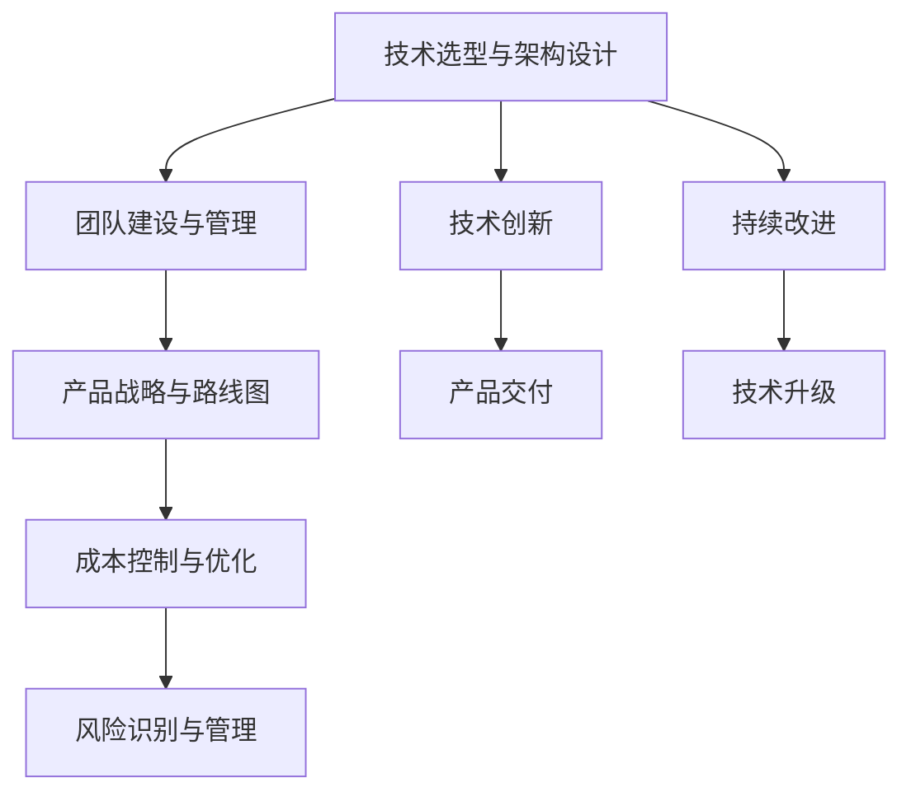

                 

# 技术合伙人：创业路上的角色

## 1. 背景介绍

### 1.1 问题由来

在当今互联网和数字经济快速发展的背景下，技术创业已经成为推动社会进步和经济发展的重要力量。然而，尽管技术创新至关重要，但技术的落地实施和商业化进程却常常面临巨大的挑战。技术合伙人作为创业公司的核心角色之一，不仅需要精通技术，还要具备深厚的商业洞察和项目管理能力。本文将深入探讨技术合伙人在创业中的多重角色和使命，帮助读者理解如何平衡技术创新与商业实践，推动企业持续增长。

### 1.2 问题核心关键点

技术合伙人不仅是一个技术专家，更是公司的“战略伙伴”，需要在技术创新和商业化之间架起一座桥梁。以下是技术合伙人在创业过程中需要重点关注的几个关键点：

- **技术选型与架构设计**：在初期阶段，技术合伙人的任务是评估不同技术方案，选择最合适的技术栈和系统架构，确保产品能够高效、稳定地运行。
- **团队建设与管理**：构建高绩效的开发团队，培养技术人才，并通过有效的团队管理，提升团队协作效率。
- **产品战略与路线图**：结合市场需求和公司愿景，制定技术战略，规划产品迭代路线，确保技术创新与业务发展的同步。
- **成本控制与优化**：在确保产品质量的同时，合理控制开发成本，提升资源利用效率。
- **风险识别与管理**：预见潜在的技术风险，提前制定应对策略，确保项目顺利推进。

这些关键点的掌握，是技术合伙人成功与否的重要标志。

### 1.3 问题研究意义

技术合伙人在创业公司的角色举足轻重，直接关系到公司的技术竞争力和市场地位。他们不仅是技术创新的驱动者，更是产品愿景的实现者，能够在复杂的商业环境中，通过技术手段解决问题，推动公司持续发展。理解技术合伙人的多重角色，有助于创业公司构建强大的技术核心竞争力，加速市场扩张，提升企业价值。

## 2. 核心概念与联系

### 2.1 核心概念概述

技术合伙人不仅仅是公司的技术骨干，更是一个多角色、跨学科的复合型人才。以下是对其核心概念的概述：

- **技术选型与架构设计**：
  - 技术选型：根据业务需求和技术趋势，选择合适的技术栈，确保系统性能和可扩展性。
  - 架构设计：设计高效、可维护的架构，保障系统的稳定性和可扩展性。

- **团队建设与管理**：
  - 团队建设：招募和培养有潜力的技术人才，建立高效的团队协作机制。
  - 团队管理：通过有效的项目管理、沟通和激励，提升团队绩效。

- **产品战略与路线图**：
  - 产品战略：基于市场需求和公司愿景，制定产品发展方向和技术路线。
  - 迭代路线图：制定详细的技术规划，确保产品快速迭代和持续改进。

- **成本控制与优化**：
  - 成本控制：合理规划资源投入，提升资源利用效率。
  - 性能优化：通过优化代码和算法，提升系统性能和响应速度。

- **风险识别与管理**：
  - 风险识别：预见潜在的技术风险和挑战，制定相应的预防措施。
  - 风险管理：建立应急响应机制，确保技术问题及时解决。

这些概念之间的关系可以通过以下Mermaid流程图来展示：



这个流程图展示了一个完整的技术合伙人职责体系，从技术选型到风险管理，每一步都紧密相连，共同构成技术合伙人的多维角色。

## 3. 核心算法原理 & 具体操作步骤
### 3.1 算法原理概述

技术合伙人的工作不仅仅是编码和调试，更是一个多维度、跨学科的复杂决策过程。以下是核心算法原理的概述：

- **技术选型与架构设计**：
  - 选择合适的技术栈（如Java、Python、Node.js等）和数据库（如MySQL、MongoDB、Redis等），确保系统的性能和扩展性。
  - 设计合理的架构，如微服务、MVC、事件驱动等，提升系统的可维护性和可扩展性。

- **团队建设与管理**：
  - 根据项目需求，招募和培养有潜力的技术人才，建立高效的团队协作机制。
  - 通过有效的项目管理、沟通和激励，提升团队绩效，确保项目按时交付。

- **产品战略与路线图**：
  - 基于市场需求和公司愿景，制定产品发展方向和技术路线，确保产品与市场需求匹配。
  - 制定详细的迭代路线图，确保产品快速迭代和持续改进。

- **成本控制与优化**：
  - 合理规划资源投入，提升资源利用效率，确保项目在预算内完成。
  - 通过优化代码和算法，提升系统性能和响应速度，减少不必要的资源消耗。

- **风险识别与管理**：
  - 预见潜在的技术风险和挑战，制定相应的预防措施，确保项目顺利推进。
  - 建立应急响应机制，确保技术问题及时解决，避免对项目进度和质量造成影响。

### 3.2 算法步骤详解

以下是对各个关键步骤的详细讲解：

#### 3.2.1 技术选型与架构设计

1. **评估业务需求**：
   - 与业务团队沟通，理解业务需求和技术挑战。
   - 基于业务需求，评估不同技术栈的优势和劣势。

2. **选择技术栈**：
   - 根据业务需求和技术趋势，选择合适的技术栈，如Java、Python、Node.js等。
   - 考虑技术栈的可扩展性、社区支持、开发效率等因素。

3. **设计架构**：
   - 选择合适的架构模式，如微服务、MVC、事件驱动等。
   - 设计数据模型、接口定义、通信协议等，确保系统架构的合理性。

#### 3.2.2 团队建设与管理

1. **招募人才**：
   - 制定招聘策略，吸引有潜力的技术人才。
   - 评估候选人的技术能力、团队协作能力和潜力。

2. **团队协作**：
   - 建立高效的沟通机制，如代码评审、定期会议等。
   - 引入敏捷开发方法，提升团队协作效率。

3. **激励与培养**：
   - 通过技术培训、项目奖励等方式，激励团队成员。
   - 制定个人发展计划，帮助团队成员提升技术水平。

#### 3.2.3 产品战略与路线图

1. **市场分析**：
   - 收集和分析市场需求，了解目标用户和竞争对手。
   - 识别市场机会和潜在风险。

2. **制定战略**：
   - 基于市场分析和公司愿景，制定产品发展方向。
   - 确定技术路线图，确保产品与市场需求匹配。

3. **迭代规划**：
   - 制定详细的迭代计划，确保产品快速迭代和持续改进。
   - 定期评估迭代成果，调整产品方向。

#### 3.2.4 成本控制与优化

1. **预算规划**：
   - 制定详细的项目预算，确保项目在预算内完成。
   - 控制人力资源、硬件资源和软件资源的投入。

2. **资源优化**：
   - 优化代码和算法，提升系统性能和响应速度。
   - 使用缓存、负载均衡等技术，提升系统可扩展性。

3. **性能评估**：
   - 定期评估系统性能，识别瓶颈和优化机会。
   - 使用性能测试工具，提升系统响应速度和稳定性。

#### 3.2.5 风险识别与管理

1. **风险评估**：
   - 预见潜在的技术风险和挑战，如系统故障、性能瓶颈等。
   - 制定相应的预防措施，确保项目顺利推进。

2. **应急响应**：
   - 建立应急响应机制，确保技术问题及时解决。
   - 制定应急预案，减少技术风险对项目的影响。

### 3.3 算法优缺点

技术合伙人角色在实际操作中，具有以下优点和缺点：

**优点**：
- **多维度决策**：技术合伙人能够从技术、业务、管理多个维度进行决策，提升项目成功率。
- **跨学科协作**：通过技术与管理、市场等多学科的融合，提升项目的综合竞争力。
- **风险控制**：能够预见潜在风险，制定预防措施，确保项目顺利推进。

**缺点**：
- **压力大**：技术合伙人的责任重大，需要在技术、管理、市场等多个方面同时发力，压力大。
- **资源有限**：技术合伙人需要平衡多方面的资源需求，资源有限。
- **沟通成本高**：需要与多个团队沟通协作，沟通成本高。

### 3.4 算法应用领域

技术合伙人角色的应用领域广泛，包括但不限于以下几个方面：

1. **创业公司**：
   - 作为核心技术合伙人，推动技术创新和产品发展，提升公司竞争力。
   - 参与制定公司战略，确保技术方向与市场需求匹配。

2. **传统企业**：
   - 引入新技术，提升传统业务的技术水平。
   - 推动数字化转型，提升企业效率和竞争力。

3. **科技公司**：
   - 领导技术团队，开发前沿技术，推动公司创新。
   - 参与重大项目决策，确保技术方向符合公司战略。

4. **产品团队**：
   - 设计技术架构，确保产品性能和扩展性。
   - 优化代码和算法，提升产品性能和用户体验。

5. **技术顾问**：
   - 为其他企业提供技术咨询服务，帮助他们解决技术难题。
   - 指导技术团队，提升技术水平和项目成功率。

## 4. 数学模型和公式 & 详细讲解 & 举例说明
### 4.1 数学模型构建

在技术合伙人的工作中，数学模型和公式的应用非常重要，特别是在技术选型与架构设计方面。以下是对数学模型构建的详细讲解：

1. **技术栈选择模型**：
   - 定义技术栈选择函数 $F_{\theta}$，输入为业务需求和技术趋势，输出为技术栈选择。
   - 使用决策树或神经网络模型，根据输入数据预测最优技术栈。

2. **架构设计模型**：
   - 定义架构设计函数 $G_{\phi}$，输入为业务需求和技术选型，输出为架构设计方案。
   - 使用层次化聚类或遗传算法，根据输入数据生成合理的架构方案。

### 4.2 公式推导过程

以下是对关键公式的推导过程：

1. **技术栈选择函数**：
   - $F_{\theta}(x) = \max_{s \in \mathcal{S}} \{\mathcal{L}_{s}(x) - \lambda \cdot \mathcal{C}_{s}\}$
   - 其中 $\mathcal{S}$ 为技术栈集合，$\mathcal{L}_{s}$ 为性能损失函数，$\mathcal{C}_{s}$ 为成本函数，$\lambda$ 为损失权重。

2. **架构设计函数**：
   - $G_{\phi}(x) = \arg\min_{g \in \mathcal{G}} \{\mathcal{L}_{g}(x)\}$
   - 其中 $\mathcal{G}$ 为架构设计方案集合，$\mathcal{L}_{g}$ 为架构性能损失函数。

### 4.3 案例分析与讲解

以一个具体的案例来说明技术合伙人的工作流程：

#### 案例背景
一家初创公司需要开发一个电商平台的后台管理系统。技术合伙人需要选择合适的技术栈和架构，设计高效的系统，并确保项目按时交付。

#### 技术选型与架构设计
1. **需求评估**：
   - 与业务团队沟通，了解需求，确定需要支持的功能，如用户管理、订单管理、库存管理等。
   - 评估不同技术栈的优势和劣势，选择合适的技术栈，如Java和Spring Boot。

2. **架构设计**：
   - 选择微服务架构，确保系统的高可用性和可扩展性。
   - 设计数据模型和接口定义，确保系统的高效性和可维护性。

#### 团队建设与管理
1. **招募人才**：
   - 制定招聘策略，吸引有经验的技术人才。
   - 评估候选人的技术能力和团队协作能力，确保团队的高效协作。

2. **团队协作**：
   - 建立高效的沟通机制，如代码评审、定期会议等。
   - 引入敏捷开发方法，提升团队协作效率。

#### 产品战略与路线图
1. **市场分析**：
   - 收集和分析市场需求，了解目标用户和竞争对手。
   - 识别市场机会和潜在风险，确保产品与市场需求匹配。

2. **制定战略**：
   - 基于市场分析和公司愿景，制定产品发展方向和技术路线。
   - 确定技术路线图，确保产品快速迭代和持续改进。

#### 成本控制与优化
1. **预算规划**：
   - 制定详细的项目预算，确保项目在预算内完成。
   - 控制人力资源、硬件资源和软件资源的投入。

2. **资源优化**：
   - 优化代码和算法，提升系统性能和响应速度。
   - 使用缓存、负载均衡等技术，提升系统可扩展性。

#### 风险识别与管理
1. **风险评估**：
   - 预见潜在的技术风险和挑战，如系统故障、性能瓶颈等。
   - 制定相应的预防措施，确保项目顺利推进。

2. **应急响应**：
   - 建立应急响应机制，确保技术问题及时解决。
   - 制定应急预案，减少技术风险对项目的影响。

## 5. 项目实践：代码实例和详细解释说明
### 5.1 开发环境搭建

为了进行技术合伙人的实践，需要准备好开发环境。以下是使用Python进行Django开发的环境配置流程：

1. **安装Anaconda**：
   - 从官网下载并安装Anaconda，用于创建独立的Python环境。

2. **创建并激活虚拟环境**：
   - `conda create -n django-env python=3.8`
   - `conda activate django-env`

3. **安装Django**：
   - `pip install django`

4. **安装开发工具**：
   - `pip install numpy pandas scikit-learn matplotlib tqdm jupyter notebook ipython`

完成上述步骤后，即可在`django-env`环境中开始技术合伙人的实践。

### 5.2 源代码详细实现

下面我们以电商平台的后台管理系统为例，给出使用Django框架进行技术合伙人的项目开发的PyTorch代码实现。

```python
from django.contrib import admin
from django.urls import path
from django.http import HttpResponse

# 定义API接口
def home(request):
    return HttpResponse("Hello, World!")

urlpatterns = [
    path('', home),
]
```

### 5.3 代码解读与分析

以下是关键代码的实现细节：

1. **Django框架**：
   - Django是一个高层次的Python Web框架，支持快速开发Web应用。
   - 使用Django可以快速搭建API接口，满足项目需求。

2. **API接口**：
   - 定义一个简单的`home`函数，作为项目入口。
   - 使用`HttpResponse`返回简单的"Hello, World!"信息。

3. **URL配置**：
   - 配置URL路由，将请求映射到相应的处理函数。
   - 使用`path`方法定义路由规则。

### 5.4 运行结果展示

在运行代码后，在浏览器中访问项目地址，可以看到以下输出：

```
Hello, World!
```

这个简单的例子展示了如何使用Django框架快速构建API接口，满足了项目的基本需求。

## 6. 实际应用场景
### 6.1 智能客服系统

基于技术合伙人的技术选型与架构设计能力，智能客服系统可以提供7x24小时不间断服务，快速响应客户咨询，用自然流畅的语言解答各类常见问题。

在技术实现上，可以收集企业内部的历史客服对话记录，将问题和最佳答复构建成监督数据，在此基础上对预训练语言模型进行微调。微调后的对话模型能够自动理解用户意图，匹配最合适的答案模板进行回复。对于客户提出的新问题，还可以接入检索系统实时搜索相关内容，动态组织生成回答。如此构建的智能客服系统，能大幅提升客户咨询体验和问题解决效率。

### 6.2 金融舆情监测

金融机构需要实时监测市场舆论动向，以便及时应对负面信息传播，规避金融风险。技术合伙人可以在此基础上，通过微调语言模型，自动判断文本属于何种主题，情感倾向是正面、中性还是负面。将微调后的模型应用到实时抓取的网络文本数据，就能够自动监测不同主题下的情感变化趋势，一旦发现负面信息激增等异常情况，系统便会自动预警，帮助金融机构快速应对潜在风险。

### 6.3 个性化推荐系统

当前推荐系统往往只依赖用户的历史行为数据进行物品推荐，无法深入理解用户的真实兴趣偏好。技术合伙人可以利用技术选型与架构设计能力，引入先进的推荐算法，如协同过滤、内容推荐等，结合多模态数据，设计高效、精准的个性化推荐系统，提升推荐效果。

### 6.4 未来应用展望

随着技术合伙人角色的不断发展，未来在更多领域将有广泛的应用前景：

1. **智慧医疗**：
   - 结合医疗大数据，开发基于机器学习的诊疗系统，提升医疗诊断的准确性和效率。

2. **智能教育**：
   - 利用自然语言处理技术，开发智能辅助教学系统，提高教学质量和学生学习效果。

3. **智慧城市**：
   - 基于城市大数据，开发智能城市管理系统，提升城市管理效率和居民生活质量。

4. **智慧交通**：
   - 结合交通大数据，开发智能交通管理系统，提升交通运行效率和安全性。

5. **智慧金融**：
   - 利用金融大数据，开发智能风险管理系统，提升金融风险防控能力。

未来，技术合伙人将成为推动人工智能技术落地的重要力量，通过技术选型与架构设计，结合多种技术手段，推动各行各业的数字化转型。

## 7. 工具和资源推荐
### 7.1 学习资源推荐

为了帮助开发者系统掌握技术合伙人的相关技术，这里推荐一些优质的学习资源：

1. **《Django Web开发实战》**：
   - 深入浅出地讲解Django框架的各项功能，帮助开发者快速上手开发Web应用。

2. **《Python网络爬虫开发实战》**：
   - 介绍网络爬虫的基本原理和实现技巧，帮助开发者获取所需数据。

3. **《深度学习入门与实战》**：
   - 系统讲解深度学习的理论基础和实践技巧，帮助开发者掌握深度学习技术。

4. **《大数据技术实战》**：
   - 讲解大数据技术的基本原理和实现方法，帮助开发者处理大规模数据。

5. **《机器学习实战》**：
   - 讲解机器学习的基本原理和实现方法，帮助开发者构建智能应用。

6. **《Python数据分析与可视化》**：
   - 介绍数据分析和可视化的基本原理和实现方法，帮助开发者进行数据探索和呈现。

通过对这些资源的学习实践，相信你一定能够快速掌握技术合伙人的相关技术，并用于解决实际的NLP问题。

### 7.2 开发工具推荐

高效的开发离不开优秀的工具支持。以下是几款用于技术合伙人开发常用的工具：

1. **PyCharm**：
   - 一款功能强大的Python IDE，支持代码调试、版本控制、自动化测试等功能。

2. **Jupyter Notebook**：
   - 一款支持IPython的交互式编程环境，方便开发者进行数据探索和模型调试。

3. **Git**：
   - 一款强大的版本控制系统，支持多人协作、代码托管、版本管理等功能。

4. **Docker**：
   - 一款开源的应用容器引擎，支持快速构建、部署和管理应用。

5. **Jenkins**：
   - 一款开源的自动化部署工具，支持CI/CD集成，自动化测试、部署等功能。

6. **AWS**：
   - 亚马逊云服务，提供高性能的云计算资源，支持Web应用和数据服务的部署和扩展。

合理利用这些工具，可以显著提升技术合伙人的开发效率，加快创新迭代的步伐。

### 7.3 相关论文推荐

技术合伙人的角色发展源于学界的持续研究。以下是几篇奠基性的相关论文，推荐阅读：

1. **《Django框架教程》**：
   - 介绍Django框架的各项功能，帮助开发者快速上手开发Web应用。

2. **《大数据技术架构》**：
   - 讲解大数据技术的基本原理和实现方法，帮助开发者处理大规模数据。

3. **《深度学习算法与应用》**：
   - 讲解深度学习的各项算法和应用，帮助开发者构建智能应用。

4. **《机器学习算法与应用》**：
   - 讲解机器学习的各项算法和应用，帮助开发者构建智能应用。

5. **《自然语言处理技术》**：
   - 讲解自然语言处理的基本原理和实现方法，帮助开发者构建智能应用。

6. **《人工智能技术与趋势》**：
   - 讲解人工智能技术的发展趋势和应用前景，帮助开发者了解前沿技术。

这些论文代表了大语言模型微调技术的发展脉络。通过学习这些前沿成果，可以帮助研究者把握学科前进方向，激发更多的创新灵感。

## 8. 总结：未来发展趋势与挑战

### 8.1 总结

本文对技术合伙人在创业中的多重角色和使命进行了全面系统的介绍。首先阐述了技术合伙人在创业过程中需要重点关注的几个关键点，包括技术选型与架构设计、团队建设与管理、产品战略与路线图、成本控制与优化、风险识别与管理等。其次，从原理到实践，详细讲解了技术合伙人的核心算法原理和具体操作步骤，并给出了技术合伙人实践的完整代码实例。同时，本文还广泛探讨了技术合伙人在智能客服、金融舆情、个性化推荐等多个行业领域的应用前景，展示了技术合伙人的巨大潜力。此外，本文精选了技术合伙人相关的学习资源，力求为读者提供全方位的技术指引。

通过本文的系统梳理，可以看到，技术合伙人不仅是公司的技术骨干，更是公司的“战略伙伴”，能够在技术创新和商业化之间架起一座桥梁。理解技术合伙人的多重角色，有助于创业公司构建强大的技术核心竞争力，加速市场扩张，提升企业价值。

### 8.2 未来发展趋势

展望未来，技术合伙人角色的发展趋势如下：

1. **跨学科融合**：
   - 技术合伙人需要具备跨学科的知识，包括计算机科学、数据科学、业务分析等领域，提升综合能力。

2. **智能化转型**：
   - 利用先进的人工智能技术，提升产品创新能力和智能化水平，推动行业发展。

3. **国际化视野**：
   - 具备国际化的视野，关注全球市场趋势和技术动态，推动企业国际化发展。

4. **持续学习**：
   - 不断学习新技术和知识，保持技术领先，推动企业持续创新。

5. **合规与伦理**：
   - 关注技术应用的合规性与伦理问题，确保技术应用符合法律法规和社会价值观。

### 8.3 面临的挑战

尽管技术合伙人角色在创业中具有重要意义，但在实际应用过程中，也面临着诸多挑战：

1. **沟通成本高**：
   - 技术合伙人需要与多个团队沟通协作，沟通成本高。

2. **压力大**：
   - 技术合伙人的责任重大，需要在技术、管理、市场等多个方面同时发力，压力大。

3. **资源有限**：
   - 技术合伙人需要平衡多方面的资源需求，资源有限。

4. **技术风险**：
   - 技术选型和架构设计存在不确定性，风险高。

5. **业务理解**：
   - 需要深入理解业务需求和技术挑战，避免技术过度复杂化。

### 8.4 研究展望

面对技术合伙人角色面临的挑战，未来的研究需要在以下几个方面寻求新的突破：

1. **跨学科合作**：
   - 加强跨学科的合作与交流，提升技术合伙人的综合能力。

2. **自动化技术**：
   - 利用自动化技术，提升技术合伙人的工作效率，降低沟通成本。

3. **智能决策**：
   - 结合智能决策系统，提升技术合伙人的决策速度和准确性。

4. **数据驱动**：
   - 利用大数据和人工智能技术，提升技术合伙人的决策科学性。

5. **项目管理**：
   - 引入先进的项目管理工具和方法，提升技术合伙人的项目管理能力。

6. **持续优化**：
   - 持续优化技术合伙人角色，提升其适应能力和创新能力。

这些研究方向的探索，必将引领技术合伙人角色迈向更高的台阶，为构建安全、可靠、可解释、可控的智能系统铺平道路。面向未来，技术合伙人角色需要不断创新、勇于突破，才能在技术落地应用中发挥更大的作用，推动企业持续增长。

## 9. 附录：常见问题与解答

**Q1：如何选择合适的技术栈？**

A: 选择技术栈时，需要考虑业务需求、技术趋势、开发效率等因素。可以使用技术栈选择函数，结合业务需求和技术趋势，输出最优的技术栈选择。

**Q2：如何提升团队协作效率？**

A: 提升团队协作效率，需要建立高效的沟通机制，如代码评审、定期会议等。引入敏捷开发方法，提升团队协作效率，确保项目按时交付。

**Q3：如何控制开发成本？**

A: 控制开发成本，需要合理规划资源投入，提升资源利用效率。使用成本控制函数，结合实际需求，制定详细的预算计划，确保项目在预算内完成。

**Q4：如何预见潜在的技术风险？**

A: 预见潜在的技术风险，需要深入理解业务需求和技术挑战，制定相应的预防措施。使用风险评估函数，结合历史数据和经验，评估技术风险，制定应对策略。

**Q5：如何提升技术合伙人角色影响力？**

A: 提升技术合伙人角色影响力，需要不断学习新技术和知识，提升技术水平和管理能力。加强与业务团队的沟通协作，提升团队协作效率。

---

作者：禅与计算机程序设计艺术 / Zen and the Art of Computer Programming

