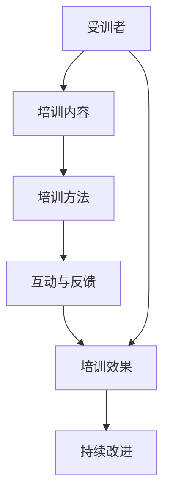

                 

# 技术培训：从受训者到培训者

> 关键词：技术培训,技术分享,知识传递,培训技巧,高效教学,评估反馈,持续改进

## 1. 背景介绍

### 1.1 问题由来

在现代企业的快速发展中，技术的快速迭代和应用成为了公司保持竞争力的关键。因此，技术培训成为了企业提升员工技能、推动业务创新的重要手段。然而，如何设计有效的技术培训课程，如何将复杂深奥的技术知识传授给受训者，是每个培训者面临的挑战。

### 1.2 问题核心关键点

技术培训的核心在于如何高效传递知识、提升受训者的实际能力，并且能够对培训效果进行评估和反馈。这其中涉及几个关键点：

- **培训内容设计**：需要根据实际业务需求和受训者的知识水平，设计有针对性的课程内容。
- **培训方法选择**：选择适合受训者特点的培训方法，如讲座、实践操作、案例分析等。
- **互动与反馈机制**：建立及时的互动和反馈机制，帮助受训者及时解决问题，提高学习效果。
- **效果评估与改进**：对培训效果进行科学评估，并根据反馈不断改进培训方案。

### 1.3 问题研究意义

有效的技术培训不仅可以提升员工的技能水平，增强团队战斗力，还能推动企业的创新和业务发展。具体而言：

1. **人才储备**：培训能够为公司培养出具备新技能的人才，增强公司的技术储备。
2. **业务升级**：通过技术培训，员工能够更快地掌握新技术和新方法，推动业务流程和产品线的升级。
3. **员工满意度**：有效的培训能够增强员工的职业发展感和归属感，提升工作满意度。
4. **创新驱动**：培训促进了知识的交流与分享，激发了员工的创新思维和创造力。
5. **市场竞争力**：技术培训有助于公司紧跟市场和技术趋势，保持竞争优势。

## 2. 核心概念与联系

### 2.1 核心概念概述

在技术培训中，涉及的核心概念包括：

- **受训者**：参与技术培训的员工，是知识传递的对象。
- **培训者**：设计和实施技术培训的专业人员，是知识传递的源头。
- **培训内容**：根据业务需求和受训者水平设计的内容体系。
- **培训方法**：用于传授知识的教学手段和方式。
- **互动与反馈**：受训者与培训者之间的互动和反馈机制。
- **效果评估**：衡量培训效果的科学方法。

### 2.2 核心概念原理和架构的 Mermaid 流程图



这个流程图展示了技术培训的基本流程：培训内容通过培训方法传递给受训者，并在此过程中建立互动与反馈机制，最后进行效果评估和持续改进。

## 3. 核心算法原理 & 具体操作步骤

### 3.1 算法原理概述

技术培训的算法原理主要是基于成人学习理论和行为科学的，其核心在于设计有意义的教学活动，引导受训者主动学习。

### 3.2 算法步骤详解

1. **需求分析**：
   - 进行受训者背景分析，了解其技术水平、兴趣和学习目标。
   - 确定培训内容的核心知识点和技能点。

2. **课程设计**：
   - 根据需求分析结果设计课程框架，包括理论课程和实践课程。
   - 设计具体的教学活动，如小组讨论、角色扮演、实战演练等。

3. **培训实施**：
   - 选择合适的培训方法，如案例分析、项目实践、模拟演练等。
   - 组织培训活动，引导受训者积极参与。

4. **互动与反馈**：
   - 在培训过程中设置问答环节、小组讨论等互动环节。
   - 定期收集受训者的反馈，调整培训内容和方法。

5. **效果评估**：
   - 使用测验、实战项目、学员自评等方式评估培训效果。
   - 分析评估结果，识别培训中的问题和不足。

6. **持续改进**：
   - 根据评估结果和反馈，不断改进课程设计和方法。
   - 进行后续跟踪和二次培训，巩固学习成果。

### 3.3 算法优缺点

技术培训的算法具有以下优点：

- **灵活性高**：可以根据不同受训者的需求和背景，灵活设计课程内容和教学方法。
- **互动性强**：通过互动与反馈机制，提高受训者的参与度和学习效果。
- **评估科学**：通过多种评估手段，确保培训效果的客观性和科学性。

但同时，也存在一些局限：

- **时间成本高**：设计和实施完整的培训流程，需要耗费大量的时间和资源。
- **评估难度大**：培训效果的多维度和复杂性，使得评估难度较大。
- **实施难度高**：培训需要精细的设计和组织，对培训者的能力要求较高。

### 3.4 算法应用领域

技术培训的应用领域非常广泛，以下是几个典型的例子：

1. **软件开发团队**：进行编程语言、框架和工具的培训，提升开发效率和代码质量。
2. **数据科学团队**：培训数据挖掘、机器学习和数据可视化技能，推动数据分析和业务决策。
3. **项目管理团队**：培训敏捷开发、项目管理工具和流程，提升项目管理水平和团队协作。
4. **客户支持团队**：培训客户沟通技巧、问题解决和客户关系管理，提高客户满意度和服务质量。
5. **市场营销团队**：培训数字营销工具、SEO优化和社交媒体营销，推动市场推广效果。

## 4. 数学模型和公式 & 详细讲解

### 4.1 数学模型构建

设技术培训的总体目标是提升受训者的技能水平 $S$，培训内容为 $C$，培训方法为 $M$，互动与反馈机制为 $I$，效果评估为 $E$，持续改进为 $C$。培训效果 $S$ 可以表示为：

$$
S = f(C, M, I, E)
$$

其中，$f$ 表示函数映射关系。

### 4.2 公式推导过程

设 $C_i$ 为第 $i$ 个培训模块，$M_j$ 为第 $j$ 个培训方法，$I_k$ 为第 $k$ 个互动环节，$E_l$ 为第 $l$ 个评估指标。则有：

$$
S = \sum_{i=1}^{n} \sum_{j=1}^{m} \sum_{k=1}^{p} \sum_{l=1}^{q} \alpha_i \beta_j \gamma_k \delta_l \times f(C_i, M_j, I_k, E_l)
$$

其中，$\alpha_i, \beta_j, \gamma_k, \delta_l$ 分别表示各个要素的权重，$f$ 表示具体的函数映射。

### 4.3 案例分析与讲解

以软件开发团队的技术培训为例，可以设计如下数学模型：

- $C$：课程内容，包括编程语言、框架、工具等。
- $M$：培训方法，如实战项目、案例分析、小组讨论等。
- $I$：互动与反馈，如现场问答、代码评审、项目回顾等。
- $E$：效果评估，如实战测试、项目展示、学员自评等。

通过构建数学模型，可以对培训效果进行量化评估和持续优化。

## 5. 项目实践：代码实例和详细解释说明

### 5.1 开发环境搭建

1. **选择开发平台**：可以选择企业内部的培训管理系统，或者使用开源的培训管理平台，如Moodle、EdX等。
2. **搭建服务器环境**：配置服务器和数据库，确保系统的稳定性和可扩展性。
3. **安装开发工具**：安装Python、JDK、IDE等开发工具，以及相关的开发框架和库。

### 5.2 源代码详细实现

以下是一个简单的技术培训管理系统源代码实现示例：

```python
# 导入必要的库
from flask import Flask, request, jsonify
from flask_sqlalchemy import SQLAlchemy

# 初始化 Flask 应用
app = Flask(__name__)

# 配置数据库连接
app.config['SQLALCHEMY_DATABASE_URI'] = 'sqlite:////tmp/test.db'
app.config['SQLALCHEMY_TRACK_MODIFICATIONS'] = False
db = SQLAlchemy(app)

# 定义课程表
class Course(db.Model):
    id = db.Column(db.Integer, primary_key=True)
    name = db.Column(db.String(100))
    description = db.Column(db.Text)
    methods = db.relationship('Method', backref='course', lazy=True)

# 定义方法表
class Method(db.Model):
    id = db.Column(db.Integer, primary_key=True)
    name = db.Column(db.String(100))
    course_id = db.Column(db.Integer, db.ForeignKey('course.id'))

# 定义数据表模型
db.create_all()

# 定义路由
@app.route('/courses', methods=['GET', 'POST'])
def courses():
    if request.method == 'GET':
        courses = Course.query.all()
        return jsonify([{'id': course.id, 'name': course.name, 'description': course.description} for course in courses])
    elif request.method == 'POST':
        data = request.json
        new_course = Course(name=data['name'], description=data['description'])
        db.session.add(new_course)
        db.session.commit()
        return jsonify({'message': 'Course added successfully'}), 201

# 运行应用
if __name__ == '__main__':
    app.run(debug=True)
```

### 5.3 代码解读与分析

**代码解读**：
- **环境搭建**：通过Flask框架搭建了一个简单的Web应用，使用SQLAlchemy作为数据库连接库。
- **模型定义**：定义了`Course`和`Method`两个数据表模型，用于存储课程和培训方法。
- **路由实现**：通过GET和POST方法，实现了对课程表的增删改查功能。

**代码分析**：
- **模块化设计**：通过将功能模块化，可以便于维护和扩展。
- **使用ORM**：使用SQLAlchemy的ORM框架，简化了数据库操作。
- **API接口**：提供了RESTful API接口，方便外部系统调用。

### 5.4 运行结果展示

运行上述代码后，可以通过访问`localhost:5000/courses`来查看和操作课程表。具体效果如图：

```plaintext
GET /courses
```

```json
[
    {"id": 1, "name": "Python Programming", "description": "Learn Python basics and advanced features."},
    {"id": 2, "name": "Web Development", "description": "Build web applications using Django and React."}
]
```

## 6. 实际应用场景

### 6.1 智慧教育

在智慧教育领域，技术培训已经成为提升教师教学能力和学生学习效果的重要手段。例如，在线教育平台可以设计针对性的培训课程，提升教师的在线教学技能和学生自主学习能力。

### 6.2 企业培训

在企业中，技术培训是提升员工技能、推动业务创新和团队协作的重要途径。例如，通过技术培训提升员工的数据分析能力，推动企业的数字化转型和智能化升级。

### 6.3 医疗健康

在医疗健康领域，技术培训可以提高医护人员的诊断和治疗技能，提升医疗服务的质量和效率。例如，通过培训提升医护人员的信息系统操作技能和数据分析能力，推动医疗行业的数字化发展。

### 6.4 金融服务

在金融服务领域，技术培训可以提升金融从业人员的技术水平和业务能力，提升金融服务的智能化和个性化水平。例如，通过培训提升理财顾问的金融科技工具使用技能，推动金融业务的创新和升级。

## 7. 工具和资源推荐

### 7.1 学习资源推荐

1. **Coursera**：提供各类在线课程，涵盖编程、数据科学、机器学习等领域。
2. **edX**：提供各类专业课程和证书，涵盖计算机科学、商业、人文等多个学科。
3. **Udacity**：提供基于项目的实战课程，涵盖编程、人工智能、数据科学等领域。
4. **Codecademy**：提供互动式编程学习平台，适合初学者和进阶者。
5. **Kaggle**：提供数据科学竞赛和数据集，提升数据处理和机器学习技能。

### 7.2 开发工具推荐

1. **Jupyter Notebook**：基于Web的交互式开发环境，支持Python、R、SQL等多种语言。
2. **Visual Studio Code**：轻量级且功能强大的开发工具，支持多种编程语言和框架。
3. **IntelliJ IDEA**：Java开发的主流IDE，支持Java、Kotlin、JavaScript等多种语言。
4. **PyCharm**：Python开发的IDE，支持Python、Django、Flask等多种框架。
5. **Sublime Text**：轻量级的文本编辑器，支持多种编程语言和插件。

### 7.3 相关论文推荐

1. **《Kaggle Data Science Competitions - A Taxonomy》**：介绍Kaggle数据科学竞赛的分类和分析，适合理解数据科学竞赛的学习路径。
2. **《Deep Learning Specialization by Andrew Ng》**：由Andrew Ng教授主讲的深度学习课程，涵盖深度学习的基础理论和实践应用。
3. **《Practical Deep Learning for Coders》**：由李沐主讲的深度学习实践课程，适合初学者和进阶者。
4. **《Programming Pearls》**：经典的技术书籍，涵盖算法、数据结构、编程技巧等多个方面。
5. **《Code Complete》**：经典的软件工程书籍，涵盖软件设计、编码规范、测试等多个方面。

## 8. 总结：未来发展趋势与挑战

### 8.1 总结

本文对技术培训的原理、方法和应用进行了全面系统的介绍。通过分析技术培训的核心概念和算法原理，给出了具体的实践方法和案例分析，提供了学习资源和开发工具的推荐，并展望了技术培训的未来发展趋势和面临的挑战。

### 8.2 未来发展趋势

展望未来，技术培训将呈现以下几个发展趋势：

1. **混合式培训**：结合线上和线下培训方式，提升培训效果和学习体验。
2. **个性化培训**：根据受训者的学习风格和背景，设计个性化的培训计划。
3. **数据驱动培训**：通过数据分析和评估，优化培训方案和学习效果。
4. **社会化学习**：利用社交网络和技术平台，促进知识共享和协作。
5. **VR/AR培训**：通过虚拟现实和增强现实技术，提升培训的沉浸感和互动性。

### 8.3 面临的挑战

尽管技术培训在当前的企业中得到了广泛应用，但仍面临一些挑战：

1. **培训内容设计**：如何根据实际需求和受训者特点，设计有针对性的培训内容，是关键问题。
2. **培训效果评估**：如何科学、客观地评估培训效果，识别培训中的问题和不足。
3. **培训者素质**：如何提高培训者的专业素质和教学能力，确保培训质量。
4. **资源投入**：如何平衡培训资源的投入和产出，避免资源的浪费和不足。
5. **学习动机**：如何激发受训者的学习动机和参与度，确保培训效果的最大化。

### 8.4 研究展望

未来，技术培训的研究可以从以下几个方向进行突破：

1. **混合式学习研究**：结合线上和线下培训的优势，探索混合式学习模式，提升学习效果。
2. **个性化学习研究**：通过数据挖掘和分析，实现个性化培训方案的设计和优化。
3. **数据驱动学习研究**：利用大数据和机器学习技术，优化培训效果和学习路径。
4. **社会化学习研究**：利用社交网络平台，促进知识共享和协作，提升学习体验。
5. **虚拟现实培训研究**：探索虚拟现实和增强现实技术在培训中的应用，提升培训的沉浸感和互动性。

通过不断突破和创新，技术培训必将推动企业员工的技能提升和业务发展，助力企业的数字化转型和智能化升级。

## 9. 附录：常见问题与解答

**Q1：如何选择适合受训者的培训方法？**

A: 选择适合受训者的培训方法需要考虑以下因素：
1. **受训者背景**：根据受训者的技术水平和职业特点，选择适合的方法。
2. **培训目标**：明确培训的具体目标和预期效果，选择相应的方法。
3. **培训环境**：考虑培训的环境和资源，选择合适的培训方式。

**Q2：如何进行有效的互动与反馈？**

A: 互动与反馈是培训效果的重要保障，具体措施包括：
1. **现场问答**：在培训过程中设置问答环节，及时解答受训者的问题。
2. **小组讨论**：通过小组讨论和协作，促进知识交流和应用。
3. **实战演练**：通过实战项目和模拟演练，巩固学习效果。
4. **在线平台**：利用在线平台和工具，收集受训者的反馈和建议。

**Q3：如何评估培训效果？**

A: 评估培训效果需要考虑多个维度，具体措施包括：
1. **知识测试**：通过测验和考试，评估受训者的知识掌握情况。
2. **实战项目**：通过实战项目，评估受训者的实际应用能力。
3. **学员自评**：通过学员自评和互评，了解受训者的学习体验和反馈。
4. **管理者评估**：通过管理者的观察和反馈，综合评估培训效果。

**Q4：如何持续改进培训方案？**

A: 持续改进是培训效果的重要保障，具体措施包括：
1. **数据分析**：通过数据分析，识别培训中的问题和不足。
2. **受训者反馈**：收集受训者的反馈和建议，优化培训方案。
3. **培训者改进**：提高培训者的专业素质和教学能力，确保培训质量。
4. **跟踪评估**：进行后续跟踪和二次培训，巩固学习成果。

**Q5：如何利用大数据提升培训效果？**

A: 利用大数据提升培训效果，具体措施包括：
1. **数据分析**：通过数据分析，优化培训内容和方法。
2. **个性化推荐**：利用推荐系统，推荐个性化的培训资源和内容。
3. **效果评估**：通过大数据分析，评估培训效果和学习路径。

总之，技术培训不仅需要精心设计和实施，还需要持续优化和改进，才能真正提升受训者的技能水平和学习效果。通过不断探索和创新，技术培训必将为企业的数字化转型和智能化升级提供有力支持。

---

作者：禅与计算机程序设计艺术 / Zen and the Art of Computer Programming

