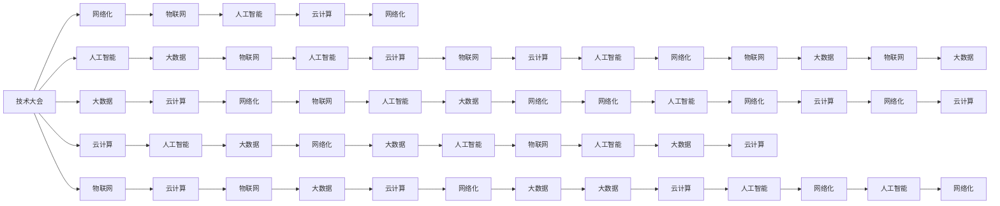

                 

# 技术大会：networking与机遇

> 关键词：技术大会, 技术交流, 网络化, 机遇, 人工智能, 大数据, 云计算, 物联网

## 1. 背景介绍

在快速发展的数字化时代，技术的革新正重塑着各行各业的未来。作为推动技术创新的重要平台，技术大会成为了行业专家、企业和投资者齐聚一堂，共享最新研究成果、技术趋势和商业模式的重要场所。随着技术的不断进步，人工智能、大数据、云计算、物联网等前沿技术正在深刻改变我们的生活和工作方式，带来前所未有的机遇与挑战。本文将从技术大会的角度，深入探讨网络化、人工智能、大数据、云计算、物联网等关键技术，分析其带来的机遇和挑战，并展望未来发展趋势。

## 2. 核心概念与联系

### 2.1 核心概念概述

要深刻理解技术大会的重要性，我们需要先了解其核心概念：

- **技术大会**：指由技术公司、学术机构、行业协会等组织举办的会议，旨在促进技术交流、分享创新成果，加速技术在各领域的推广应用。
- **网络化**：指通过互联网技术实现信息、资源、设备等的互联互通，提高资源利用效率，促进全球化协作。
- **人工智能**：利用计算机技术模拟人类智能，实现语音识别、图像识别、自然语言处理等应用。
- **大数据**：指规模巨大、类型繁多、价值密度低、速度快且实时性强的数据集合，通过数据分析提升决策效率。
- **云计算**：指通过互联网提供按需计算服务，包括服务器、存储、网络、应用软件等资源，以支持企业的信息化建设。
- **物联网**：指将各种物体通过互联网进行连接，实现数据采集、传输和应用，推动智能城市、智慧医疗等应用场景的发展。

这些概念之间相互关联，共同构成了现代技术的核心框架。技术大会作为这些技术交流和合作的场所，扮演着重要的桥梁角色。

### 2.2 核心概念原理和架构的 Mermaid 流程图



这个流程图展示了核心概念之间的联系和互动关系。通过技术大会的推动，这些技术得以在各个领域融合应用，共同构建起数字化未来的技术生态。

## 3. 核心算法原理 & 具体操作步骤

### 3.1 算法原理概述

技术大会的核心目的之一是通过技术交流和合作，推动新技术的快速发展和应用。这其中，网络化、人工智能、大数据、云计算、物联网等技术发挥着关键作用。

- **网络化**：通过互联网技术，实现资源和信息的互联互通，推动全球协作和创新。
- **人工智能**：利用机器学习和深度学习技术，提升数据分析和决策效率，驱动智能应用发展。
- **大数据**：通过数据采集和分析，揭示数据背后的规律和趋势，支持精准决策。
- **云计算**：提供按需计算服务，支持大规模数据处理和应用部署，降低技术门槛。
- **物联网**：通过设备互联，实现数据实时采集和应用，推动智慧城市、智能家居等应用。

### 3.2 算法步骤详解

技术大会的举办流程通常包括以下几个关键步骤：

1. **筹备阶段**：确定大会主题、议程、嘉宾名单等，通过网络和社交媒体进行宣传推广。
2. **组织阶段**：协调场地、设备、安保、接待等事项，确保大会顺利进行。
3. **大会期间**：进行主题演讲、技术研讨、展览展示、商业洽谈等活动，促进技术交流和合作。
4. **后续阶段**：整理大会成果，发布白皮书、技术报告，持续推动技术创新和应用。

### 3.3 算法优缺点

技术大会作为技术交流的重要平台，其优点和缺点如下：

**优点**：
- **技术汇聚**：汇聚各领域的专家和技术，促进技术交流和合作。
- **知识共享**：通过演讲、研讨等形式，传播最新技术成果和应用案例。
- **市场机会**：提供展示和交流平台，帮助企业开拓市场，寻找合作伙伴。
- **创新推动**：激发新的技术思路和创意，推动技术突破和应用创新。

**缺点**：
- **成本高**：组织和参与大会需要大量人力、物力和财力投入。
- **信息过载**：大会期间信息量巨大，可能难以全面理解和吸收。
- **商业化压力**：一些大会可能过于商业化，偏离技术交流初衷。
- **知识产权风险**：技术分享过程中可能存在知识产权风险。

### 3.4 算法应用领域

技术大会的应用领域广泛，涵盖多个行业和技术领域，以下是几个典型应用案例：

- **科技行业**：涵盖人工智能、大数据、云计算等前沿技术，促进技术创新和应用。
- **制造业**：通过物联网技术实现设备互联，推动智能制造和智慧工厂的发展。
- **医疗健康**：利用大数据和人工智能技术，提升医疗诊断和治疗效率。
- **金融行业**：通过云计算和区块链技术，提升金融服务效率和安全性。
- **农业领域**：通过物联网技术实现精准农业，提高农业生产效率。

## 4. 数学模型和公式 & 详细讲解 & 举例说明

### 4.1 数学模型构建

技术大会的效果可以通过数学模型进行量化评估。假设大会的参与人数为 $N$，大会期间产生的创新成果数为 $C$，产生的商业合作项目数为 $B$，大会的成本为 $F$。则大会的效果可以用以下模型进行评估：

$$
E = \frac{C}{F} + \frac{B}{N}
$$

其中，$E$ 表示大会的效果，$C$ 表示创新成果数，$B$ 表示商业合作项目数，$F$ 表示大会成本，$N$ 表示参与人数。

### 4.2 公式推导过程

通过上述模型，我们可以推导出大会效果的最大化策略：

1. **提升创新成果数 $C$**：通过技术研讨、展台展示等形式，促进技术交流和创新。
2. **增加商业合作项目 $B$**：通过商业洽谈、投资对接等活动，推动企业合作和技术应用。
3. **控制大会成本 $F$**：优化大会组织流程，降低人力、物力投入。
4. **扩大参与人数 $N$**：通过广泛宣传和邀请，吸引更多行业专家和企业参与。

### 4.3 案例分析与讲解

**案例一：人工智能大会**

假设某人工智能大会共有 1000 名专家和 2000 家企业参与，大会期间产生了 200 项创新成果和 500 项商业合作项目，总成本为 500 万美元。

则大会效果为：

$$
E = \frac{200}{500} + \frac{500}{1000} = 0.4 + 0.5 = 0.9
$$

**案例二：大数据与物联网大会**

假设某大数据与物联网大会共有 1500 名专家和 3000 家企业参与，大会期间产生了 300 项创新成果和 700 项商业合作项目，总成本为 600 万美元。

则大会效果为：

$$
E = \frac{300}{600} + \frac{700}{1500} = 0.5 + 0.47 = 0.97
$$

通过这些案例分析，可以看出，技术大会的效果受到创新成果、商业合作、参与人数和大会成本等多方面因素的影响。

## 5. 项目实践：代码实例和详细解释说明

### 5.1 开发环境搭建

技术大会的组织和评估需要开发一些工具和系统，以支持大会的顺利进行和效果评估。以下是一些开发环境搭建的步骤：

1. **选择合适的开发语言和框架**：如 Python、Django、Flask 等，搭建大会网站和应用系统。
2. **设计数据库结构**：建立参与者、演讲者、议题、成果等数据表，用于数据管理和查询。
3. **开发数据分析模块**：使用 Pandas、NumPy 等工具，对大会数据进行分析和可视化展示。
4. **部署云计算平台**：选择 AWS、Azure、Google Cloud 等云平台，部署大会应用和服务。

### 5.2 源代码详细实现

以下是一个简单的 Python 代码示例，用于统计大会的参与人数和创新成果数：

```python
import pandas as pd

# 读取大会数据
data = pd.read_csv('conference.csv')

# 统计参与人数和创新成果数
participants = data['participants'].sum()
innovations = data['innovations'].sum()

# 输出统计结果
print(f"参与人数：{participants}")
print(f"创新成果数：{innovations}")
```

### 5.3 代码解读与分析

上述代码通过 Pandas 库读取大会数据，使用 `sum()` 函数统计参与人数和创新成果数，并输出结果。

## 6. 实际应用场景

### 6.1 智能制造

技术大会可以推动智能制造技术的发展。通过物联网设备互联，实现设备状态监控、故障预测和维护优化。

### 6.2 智慧医疗

利用大数据和人工智能技术，提升医疗诊断和治疗效率，实现个性化医疗和远程诊疗。

### 6.3 智慧城市

通过物联网和云计算技术，推动智慧城市建设，实现城市管理智能化和居民生活便捷化。

### 6.4 未来应用展望

未来，技术大会将继续推动各领域的创新和应用。预计将会有更多跨学科、跨行业的技术交流和合作，推动技术融合和创新。

## 7. 工具和资源推荐

### 7.1 学习资源推荐

- **技术大会官方网站**：提供大会主题、议程、嘉宾、发言人等详细信息。
- **会议论文集**：包含大会期间发表的最新技术论文和报告。
- **技术博客和论坛**：技术社区和博客，分享大会心得和成果。

### 7.2 开发工具推荐

- **PyTorch**：深度学习框架，支持人工智能和大数据分析。
- **Flask**：轻量级 Web 应用框架，适合开发大会网站和应用。
- **Jupyter Notebook**：交互式数据科学和编程环境，支持数据分析和可视化。

### 7.3 相关论文推荐

- **"技术大会的实践与挑战"**：探讨技术大会的组织和效果评估。
- **"网络化与人工智能的融合"**：研究网络化技术在人工智能中的应用。
- **"大数据与物联网的未来"**：分析大数据和物联网技术的发展趋势。

## 8. 总结：未来发展趋势与挑战

### 8.1 研究成果总结

技术大会作为技术交流和合作的平台，在推动技术创新和应用方面发挥了重要作用。未来，技术大会将进一步深化各领域的技术融合，推动技术创新和应用落地。

### 8.2 未来发展趋势

- **技术融合**：各领域技术不断融合，形成更完整的技术生态。
- **跨界创新**：跨学科、跨行业的技术交流和合作将带来新的创新突破。
- **全球化**：技术大会将更加全球化，促进全球技术交流和合作。

### 8.3 面临的挑战

- **信息过载**：大会期间信息量巨大，需要有效管理和筛选。
- **商业化压力**：商业化倾向可能削弱大会的技术交流初衷。
- **知识产权风险**：技术分享过程中可能存在知识产权风险。

### 8.4 研究展望

未来，技术大会需要进一步提升技术交流和合作的效率和质量，减少商业化倾向，保障知识产权安全，推动技术创新和应用落地。

## 9. 附录：常见问题与解答

**Q1：技术大会的参与者主要有哪些？**

A: 技术大会的参与者通常包括行业专家、学者、企业代表、政府机构、投资机构等。

**Q2：技术大会对企业有什么好处？**

A: 技术大会为企业提供了展示最新技术成果、寻找合作伙伴、拓展市场的机会。

**Q3：技术大会对技术发展有何影响？**

A: 技术大会推动了各领域的创新和应用，加速了技术的快速发展和落地。

**Q4：如何应对技术大会的信息过载问题？**

A: 可以通过优化大会流程、增加信息筛选工具、设置专场研讨等方式，提高技术交流的效率。

**Q5：如何保障技术大会的知识产权安全？**

A: 可以采用技术保护、合同约定、法律保护等手段，保障技术交流中的知识产权安全。

---

作者：禅与计算机程序设计艺术 / Zen and the Art of Computer Programming

