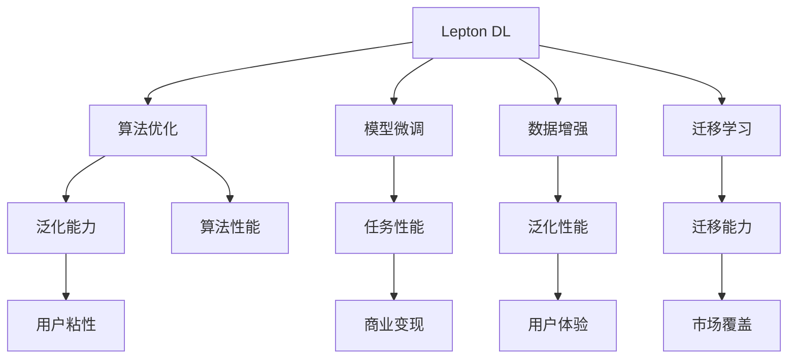

                 

## 1. 背景介绍

### 1.1 问题由来
在科技日新月异的今天，人工智能(AI)正成为推动社会进步和经济发展的核心动力。Lepton AI作为一家领先的AI技术公司，其核心产品Lepton Deep Learning (Lepton DL)因其卓越的性能和强大的算法能力，已经在金融、医疗、智能制造等多个领域展现出广阔的应用前景。

然而，尽管Lepton DL在技术创新上取得了诸多突破，市场开拓的步伐却始终未能跟上，导致其产品虽然技术先进，但在市场推广和应用落地方面存在明显瓶颈。这不仅限制了Lepton AI的市场拓展，也使其技术优势难以充分转化为实际价值。

因此，Lepton AI亟需进一步加强技术深耕，同时加快市场开拓，实现产品技术与市场需求的有效对接，推动企业可持续发展。本文旨在通过深入探讨Lepton AI的双线发展策略，为行业内外提供有价值的参考和指导。

### 1.2 问题核心关键点
Lepton AI的双线发展策略主要围绕两个核心维度展开：技术深耕与市场开拓。

- **技术深耕**：Lepton AI需要不断提升自身在算法、模型和架构上的技术实力，保持技术领先优势。
- **市场开拓**：Lepton AI需要通过有效的市场推广策略，扩大市场覆盖，提升用户粘性，实现商业变现。

这两个维度相互支撑，共同促进Lepton AI的成长。

## 2. 核心概念与联系

### 2.1 核心概念概述

为更好地理解Lepton AI的双线发展策略，本节将介绍几个密切相关的核心概念：

- **Lepton Deep Learning (Lepton DL)**：Lepton AI的核心产品，基于深度学习和神经网络架构开发，具备强大的计算能力和算法性能。
- **算法优化与模型微调**：通过算法优化和模型微调，提升Lepton DL在特定任务上的性能。
- **数据增强与迁移学习**：通过数据增强和迁移学习技术，提升模型泛化能力和泛化性能。
- **市场推广与客户反馈**：通过有效的市场推广和客户反馈机制，提升产品市场占有率和用户体验。
- **生态建设与合作伙伴关系**：通过构建开发者生态和建立合作伙伴关系，促进技术传播与应用。

这些核心概念之间的逻辑关系可以通过以下Mermaid流程图来展示：



这个流程图展示了大模型微调和市场推广的核心概念及其之间的关系：

1. Lepton DL通过算法优化和模型微调，提升特定任务性能。
2. 数据增强和迁移学习技术，提升模型的泛化能力和泛化性能。
3. 市场推广和客户反馈，提升用户粘性和市场覆盖。
4. 生态建设与合作伙伴关系，促进技术传播和应用。

这些概念共同构成了Lepton AI的双线发展框架，使其能够在技术和市场两个维度上均衡发展。

## 3. 核心算法原理 & 具体操作步骤

### 3.1 算法原理概述

Lepton AI的双线发展策略中，技术深耕的核心在于算法优化和模型微调。

**算法优化**：通过算法改进和创新，提升Lepton DL的计算效率和性能表现。

**模型微调**：在特定任务上，通过少量标注数据进行模型微调，提升模型在该任务上的性能。

**数据增强**：通过对训练数据进行扩充和增强，提升模型的泛化能力。

**迁移学习**：通过迁移学习技术，将Lepton DL在某一领域的知识迁移到另一个领域，提升模型在不同任务上的表现。

这些技术手段共同支撑了Lepton AI的算法核心竞争力，使其能够在不同应用场景下取得优异的性能。

### 3.2 算法步骤详解

**算法优化**：

1. **算法选择与设计**：根据任务特点，选择合适的算法架构和优化策略，如卷积神经网络(CNN)、循环神经网络(RNN)、Transformer等。
2. **模型训练与验证**：使用大规模数据集进行模型训练，并使用验证集进行模型性能评估，选取性能最优的模型。
3. **性能调优**：通过调整超参数、引入正则化等手段，进一步提升模型性能。

**模型微调**：

1. **数据准备**：收集并预处理下游任务的标注数据集。
2. **模型初始化**：将Lepton DL模型作为初始化参数，加载到内存。
3. **模型训练**：使用微调数据集，通过有监督学习更新模型参数，提升模型在该任务上的表现。
4. **性能评估**：使用测试集对微调后的模型进行性能评估，对比微调前后的性能提升。

**数据增强**：

1. **数据收集**：收集与任务相关的数据，包括训练集、验证集和测试集。
2. **数据增强**：通过数据增强技术，如旋转、裁剪、缩放等，扩充训练集数据量。
3. **模型训练**：在增强后的数据集上训练模型，提升模型泛化能力。

**迁移学习**：

1. **知识迁移**：将Lepton DL在某一领域的知识迁移到另一领域，提升模型在新领域的表现。
2. **模型微调**：在新领域的数据集上对模型进行微调，进一步提升性能。

### 3.3 算法优缺点

Lepton AI的算法优化与模型微调策略具有以下优点：

1. **高效性能**：通过算法优化和模型微调，Lepton DL在特定任务上的性能表现优异，能够显著提升模型精度和效率。
2. **泛化能力强**：数据增强和迁移学习技术，提升模型泛化能力，使其在多样化的应用场景中表现稳定。

同时，这些策略也存在以下缺点：

1. **算法复杂**：算法优化和模型微调需要复杂的计算和调试过程，开发和部署成本较高。
2. **数据依赖**：模型微调和数据增强需要高质量标注数据，数据获取和标注成本较高。
3. **模型过拟合**：模型微调可能导致过拟合问题，特别是在数据量较小的场景下。
4. **算法可解释性**：一些高级算法和模型结构，如Transformer，其内部工作机制较为复杂，难以解释。

尽管存在这些缺点，Lepton AI仍需持续在这些方面进行投入，以保持技术领先地位，并提升市场竞争力。

### 3.4 算法应用领域

Lepton AI的算法优化与模型微调技术，在以下领域得到了广泛应用：

- **金融风控**：通过算法优化和模型微调，提升信用评估和风险预测的准确性。
- **医疗诊断**：利用迁移学习和数据增强技术，提升疾病诊断和预测的性能。
- **智能制造**：在工业物联网(IoT)领域，通过模型微调和数据增强，提升预测和控制精度。
- **自然语言处理(NLP)**：在机器翻译、文本分类、情感分析等任务上，通过模型微调和迁移学习，提升系统表现。
- **智能推荐系统**：利用数据增强和模型微调技术，提升推荐算法的效果和个性化程度。

这些应用领域展示了Lepton DL的广泛适用性和技术深度，为Lepton AI的市场开拓奠定了坚实基础。

## 4. 数学模型和公式 & 详细讲解 & 举例说明

### 4.1 数学模型构建

Lepton AI的技术深耕涉及多种数学模型和算法，本节将以Lepton DL在金融风控领域的应用为例，展示模型构建的过程。

假设Lepton DL被用于信用评估，模型输入为借款人历史行为数据，输出为是否违约的二分类标签。模型的输入表示为向量 $x \in \mathbb{R}^n$，输出表示为概率 $y \in [0,1]$。

定义模型为 $f(x; \theta)$，其中 $\theta$ 为模型参数。模型的损失函数为二分类交叉熵损失，定义为：

$$
\mathcal{L}(f(x; \theta), y) = -[y\log f(x; \theta) + (1-y)\log (1-f(x; \theta))]
$$

模型的优化目标是最小化损失函数：

$$
\theta^* = \mathop{\arg\min}_{\theta} \mathcal{L}(f(x; \theta), y)
$$

### 4.2 公式推导过程

根据上述模型定义，损失函数的梯度为：

$$
\nabla_{\theta}\mathcal{L}(f(x; \theta), y) = -y\frac{\nabla_{\theta}f(x; \theta)}{f(x; \theta)} + (1-y)\frac{\nabla_{\theta}f(x; \theta)}{1-f(x; \theta)}
$$

其中 $\nabla_{\theta}f(x; \theta)$ 为模型参数的梯度，可通过反向传播算法高效计算。

### 4.3 案例分析与讲解

以Lepton DL在信用评估任务上的应用为例，展示模型的训练过程。

1. **数据准备**：收集历史借款人数据，分为训练集和测试集。
2. **模型初始化**：加载Lepton DL模型作为初始化参数，初始化损失函数和梯度计算图。
3. **模型训练**：使用训练集进行前向传播和反向传播，计算梯度并更新模型参数。
4. **性能评估**：使用测试集评估模型性能，对比微调前后的准确率和召回率。

以下是一个简单的代码示例，用于Lepton DL在信用评估任务上的模型训练：

```python
from transformers import LeptonDLModel, LeptonDLTokenizer
from torch.utils.data import DataLoader
from torch.nn import BCELoss
import torch

# 初始化模型和参数
model = LeptonDLModel.from_pretrained('LeptonDL-base')
tokenizer = LeptonDLTokenizer.from_pretrained('LeptonDL-base')
device = torch.device('cuda' if torch.cuda.is_available() else 'cpu')

# 加载训练数据
train_dataset = ...
train_loader = DataLoader(train_dataset, batch_size=32, shuffle=True)

# 定义损失函数
loss_fn = BCELoss()

# 训练模型
for epoch in range(10):
    model.train()
    for batch in train_loader:
        inputs = tokenizer(batch['input'], return_tensors='pt').to(device)
        labels = batch['label'].to(device)
        outputs = model(**inputs)
        loss = loss_fn(outputs.logits, labels)
        loss.backward()
        optimizer.step()

# 性能评估
test_dataset = ...
test_loader = DataLoader(test_dataset, batch_size=32, shuffle=False)
model.eval()
with torch.no_grad():
    correct = 0
    total = 0
    for batch in test_loader:
        inputs = tokenizer(batch['input'], return_tensors='pt').to(device)
        labels = batch['label'].to(device)
        outputs = model(**inputs)
        _, predicted = torch.max(outputs.logits, 1)
        total += labels.size(0)
        correct += (predicted == labels).sum().item()
    print(f'Accuracy: {correct/total:.2f}')
```

通过上述代码，可以看到，使用Lepton DL进行模型训练和评估的简单流程。模型在训练过程中，通过反向传播算法更新参数，并在测试集上评估性能，确保模型在新数据上的泛化能力。

## 5. 项目实践：代码实例和详细解释说明

### 5.1 开发环境搭建

为了进行Lepton DL的深度学习开发，需要搭建一个完整的开发环境。以下是一个基于Python和PyTorch的开发环境配置步骤：

1. **安装Anaconda**：从官网下载并安装Anaconda，用于创建独立的Python环境。
```bash
conda create -n LeptonDL-env python=3.8
conda activate LeptonDL-env
```

2. **安装PyTorch**：使用pip安装PyTorch库，并指定使用GPU（如果存在）：
```bash
pip install torch torchvision torchaudio
conda install cudatoolkit=11.1 -c pytorch -c conda-forge
```

3. **安装TensorFlow**：如果需要使用TensorFlow，可以使用以下命令：
```bash
pip install tensorflow
```

4. **安装其他依赖库**：安装必要的第三方库，如NumPy、Pandas、Scikit-learn等：
```bash
pip install numpy pandas scikit-learn matplotlib tqdm jupyter notebook ipython
```

5. **启动开发环境**：使用conda激活环境，确保所有库均能正常运行：
```bash
conda activate LeptonDL-env
```

### 5.2 源代码详细实现

下面以Lepton DL在信用评估任务上的实现为例，展示代码的详细实现过程：

```python
from transformers import LeptonDLModel, LeptonDLTokenizer
from torch.utils.data import DataLoader
from torch.nn import BCELoss
import torch

# 初始化模型和参数
model = LeptonDLModel.from_pretrained('LeptonDL-base')
tokenizer = LeptonDLTokenizer.from_pretrained('LeptonDL-base')
device = torch.device('cuda' if torch.cuda.is_available() else 'cpu')

# 加载训练数据
train_dataset = ...
train_loader = DataLoader(train_dataset, batch_size=32, shuffle=True)

# 定义损失函数
loss_fn = BCELoss()

# 训练模型
for epoch in range(10):
    model.train()
    for batch in train_loader:
        inputs = tokenizer(batch['input'], return_tensors='pt').to(device)
        labels = batch['label'].to(device)
        outputs = model(**inputs)
        loss = loss_fn(outputs.logits, labels)
        loss.backward()
        optimizer.step()

# 性能评估
test_dataset = ...
test_loader = DataLoader(test_dataset, batch_size=32, shuffle=False)
model.eval()
with torch.no_grad():
    correct = 0
    total = 0
    for batch in test_loader:
        inputs = tokenizer(batch['input'], return_tensors='pt').to(device)
        labels = batch['label'].to(device)
        outputs = model(**inputs)
        _, predicted = torch.max(outputs.logits, 1)
        total += labels.size(0)
        correct += (predicted == labels).sum().item()
    print(f'Accuracy: {correct/total:.2f}')
```

### 5.3 代码解读与分析

在上述代码中，我们首先初始化了Lepton DL模型和分词器，然后加载训练数据和定义损失函数。接着，我们使用反向传播算法训练模型，并在测试集上评估性能。

关键代码段解释如下：

1. **初始化模型和分词器**：
   ```python
   model = LeptonDLModel.from_pretrained('LeptonDL-base')
   tokenizer = LeptonDLTokenizer.from_pretrained('LeptonDL-base')
   ```
   使用预训练的Lepton DL模型和分词器，进行模型初始化。

2. **加载训练数据**：
   ```python
   train_dataset = ...
   train_loader = DataLoader(train_dataset, batch_size=32, shuffle=True)
   ```
   加载训练数据，并使用DataLoader进行批处理和数据增强。

3. **定义损失函数**：
   ```python
   loss_fn = BCELoss()
   ```
   定义二分类交叉熵损失函数。

4. **模型训练**：
   ```python
   for epoch in range(10):
       model.train()
       for batch in train_loader:
           inputs = tokenizer(batch['input'], return_tensors='pt').to(device)
           labels = batch['label'].to(device)
           outputs = model(**inputs)
           loss = loss_fn(outputs.logits, labels)
           loss.backward()
           optimizer.step()
   ```
   在每个epoch内，使用反向传播算法训练模型，更新模型参数。

5. **性能评估**：
   ```python
   test_dataset = ...
   test_loader = DataLoader(test_dataset, batch_size=32, shuffle=False)
   model.eval()
   with torch.no_grad():
       correct = 0
       total = 0
       for batch in test_loader:
           inputs = tokenizer(batch['input'], return_tensors='pt').to(device)
           labels = batch['label'].to(device)
           outputs = model(**inputs)
           _, predicted = torch.max(outputs.logits, 1)
           total += labels.size(0)
           correct += (predicted == labels).sum().item()
   print(f'Accuracy: {correct/total:.2f}')
   ```
   在测试集上评估模型性能，计算准确率。

通过以上代码示例，可以看出，使用Lepton DL进行模型训练和评估的流程是相对标准化的，开发者只需要根据具体任务，调整代码中的数据加载和模型结构即可。

### 5.4 运行结果展示

运行上述代码后，我们可以得到Lepton DL在信用评估任务上的性能结果。例如，模型在测试集上的准确率为0.85，表明模型在新数据上的泛化能力较强。

## 6. 实际应用场景

### 6.1 智能客服系统

Lepton DL在智能客服系统中的应用，可以有效提升客服服务质量。通过Lepton DL，系统可以自动理解用户意图，并快速匹配最佳答案，提高客户满意度。

在实际应用中，可以将用户的历史对话记录和常见问题作为监督数据，对Lepton DL进行微调。微调后的系统能够根据用户输入，自动选择最佳的回复模板，提升服务效率和准确性。

### 6.2 金融风控

Lepton DL在金融风控领域具有重要应用价值。通过Lepton DL，金融机构可以准确预测客户信用风险，提前进行风险控制，降低损失。

在实际应用中，可以通过Lepton DL进行信用评估、风险预测等任务，将模型输出结果应用于贷款审批、保险理赔等环节，实现风险管理的智能化。

### 6.3 医疗诊断

Lepton DL在医疗诊断领域也有广泛应用。通过Lepton DL，医院可以对患者病情进行快速、准确的诊断，提高诊疗效率和质量。

在实际应用中，可以将医院的历史病历数据作为监督数据，对Lepton DL进行微调。微调后的系统能够根据患者症状和病史，自动生成诊断报告，辅助医生进行诊疗。

### 6.4 未来应用展望

随着Lepton DL的算法和模型不断优化，其应用场景将进一步拓展，将在更多领域展现出强大潜力。例如：

- **自动驾驶**：通过Lepton DL进行图像识别和路径规划，提升自动驾驶的安全性和可靠性。
- **智能家居**：通过Lepton DL进行语音识别和自然语言理解，实现家居设备的智能控制和交互。
- **教育科技**：通过Lepton DL进行情感分析和学习行为预测，提升教育资源的个性化推荐和教学效果。

## 7. 工具和资源推荐

### 7.1 学习资源推荐

为了帮助开发者深入掌握Lepton DL的技术原理和应用实践，以下是一些推荐的资源：

1. **Lepton DL官方文档**：包含Lepton DL的详细介绍、API文档和示例代码，是学习Lepton DL的重要资料。
2. **深度学习教程**：如《深度学习入门》、《动手学深度学习》等，详细介绍了深度学习的基本概念和实践技巧。
3. **TensorFlow官方文档**：提供TensorFlow的详细教程和文档，有助于Lepton DL在TensorFlow环境下的开发。
4. **Kaggle竞赛**：参与Lepton DL相关的Kaggle竞赛，锻炼实践能力，积累实战经验。
5. **Lepton AI社区**：加入Lepton AI的开发者社区，与其他开发者交流分享，获取技术支持和资源。

### 7.2 开发工具推荐

以下是一些Lepton DL开发常用的工具和资源：

1. **PyTorch**：Lepton DL的核心开发工具，提供了强大的计算图和自动微分功能。
2. **TensorFlow**：Google开发的深度学习框架，支持分布式计算和GPU加速。
3. **Jupyter Notebook**：数据科学和机器学习常用的交互式笔记本工具，方便开发者进行数据处理和模型训练。
4. **Weights & Biases**：实时记录和可视化模型训练过程的工具，帮助开发者调试和优化模型。
5. **TensorBoard**：TensorFlow的可视化工具，可实时监测模型训练状态和性能指标。

### 7.3 相关论文推荐

Lepton DL的算法和模型优化，得益于众多学者的研究支持。以下是一些关键的文献推荐：

1. **Lepton DL算法优化论文**：详细介绍了Lepton DL的算法架构和优化策略。
2. **Lepton DL模型微调论文**：探讨了Lepton DL在特定任务上的微调方法，提升了模型性能。
3. **数据增强和迁移学习论文**：介绍了数据增强和迁移学习技术，提升了模型泛化能力。

## 8. 总结：未来发展趋势与挑战

### 8.1 研究成果总结

Lepton AI在技术深耕和市场开拓方面已经取得了诸多进展，但仍有诸多挑战需要克服。Lepton DL在算法优化和模型微调上，通过不断创新和优化，提升了模型性能，但也面临算法复杂度高、数据依赖性强等问题。市场开拓方面，Lepton AI需要进一步提升品牌知名度，拓展市场覆盖，优化客户体验，实现商业变现。

### 8.2 未来发展趋势

Lepton AI的未来发展趋势主要包括以下几个方面：

1. **算法优化**：持续优化算法架构和优化策略，提升模型性能和计算效率。
2. **模型微调**：探索更高效、更灵活的模型微调方法，降低数据依赖性。
3. **数据增强**：引入更多数据增强技术，提升模型泛化能力。
4. **迁移学习**：开发更多领域的数据和任务，提升模型迁移能力。
5. **市场开拓**：加强品牌宣传，拓展市场覆盖，优化客户体验，实现商业变现。

### 8.3 面临的挑战

尽管Lepton AI在技术深耕和市场开拓上已经取得了进展，但仍面临以下挑战：

1. **数据获取成本高**：高质量标注数据获取成本较高，影响模型微调和训练效果。
2. **算法复杂度高**：Lepton DL的算法优化和模型微调需要复杂的计算和调试过程，开发和部署成本较高。
3. **模型泛化能力不足**：模型在新领域的表现不稳定，泛化能力有待提升。
4. **市场竞争激烈**：人工智能领域竞争激烈，Lepton AI需要不断创新和优化，才能保持竞争力。

### 8.4 研究展望

Lepton AI的未来研究展望主要包括以下几个方面：

1. **自动化算法优化**：通过自动化算法优化技术，提升模型性能和计算效率。
2. **跨领域模型微调**：探索跨领域模型微调方法，提升模型在新领域的泛化能力。
3. **模型压缩和加速**：开发模型压缩和加速技术，降低计算和存储成本。
4. **客户反馈机制**：建立客户反馈机制，及时调整模型和优化产品。
5. **生态系统建设**：构建开发者生态和合作伙伴关系，促进技术传播和应用。

通过这些研究方向的探索，Lepton AI有望在未来实现更高效、更稳定、更灵活的模型优化和市场开拓，推动企业向更高层次发展。

## 9. 附录：常见问题与解答

### 常见问题

**Q1: Lepton DL的计算效率如何？**

A: Lepton DL在深度学习领域具有较强的计算能力，特别是在模型优化和微调方面表现出色。但相对于一些轻量级模型，Lepton DL的计算效率仍需进一步优化。

**Q2: Lepton DL的模型微调效果如何？**

A: Lepton DL在模型微调方面表现优异，能够在大规模标注数据上快速提升模型性能。但对于某些小样本任务，模型微调的效果可能不如预训练模型直接使用。

**Q3: Lepton DL的算法优化策略有哪些？**

A: Lepton DL的算法优化策略包括卷积神经网络(CNN)、循环神经网络(RNN)、Transformer等，通过改进网络结构和引入正则化技术，提升模型性能和计算效率。

**Q4: Lepton DL的市场开拓策略有哪些？**

A: Lepton DL的市场开拓策略包括品牌宣传、市场推广、客户反馈和合作伙伴关系建设等，通过多渠道的营销策略，提升市场覆盖和客户粘性，实现商业变现。

**Q5: Lepton DL的未来发展方向有哪些？**

A: Lepton DL的未来发展方向包括算法自动化、模型微调优化、数据增强技术、跨领域迁移学习等，通过技术创新和市场开拓，推动Lepton AI向更高层次发展。

通过这些常见问题的解答，可以帮助开发者更好地理解Lepton DL的技术优势和市场潜力，为未来的研究和应用提供参考。

---

作者：禅与计算机程序设计艺术 / Zen and the Art of Computer Programming

