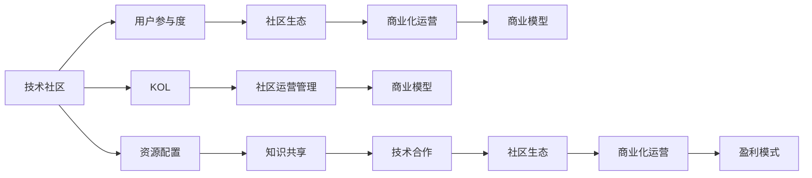

                 

# 技术社区运营：从管理到盈利模式

## 1. 背景介绍

### 1.1 问题由来
随着科技的发展，互联网社区日益繁荣，技术社区作为其重要组成部分，正成为知识分享、技术交流的重要平台。然而，在蓬勃发展的背后，技术社区运营管理也面临着诸多挑战。如何实现从管理到盈利的转变，将社区打造成可持续发展的盈利平台，是摆在技术社区运营者面前的重要课题。

### 1.2 问题核心关键点
当前技术社区运营的核心挑战在于如何高效管理社区资源、提升用户参与度、构建社区生态，并实现商业化运营。针对这些问题，本文将重点探讨社区运营的关键环节和管理策略，并提出一系列从管理到盈利的策略。

## 2. 核心概念与联系

### 2.1 核心概念概述

为更好地理解技术社区运营的原理与实践，本节将介绍几个关键概念：

- 技术社区：指以技术交流、知识分享为核心，聚集了各类技术爱好者、开发者和专家，提供技术讨论、项目合作、招聘信息等功能的网络平台。

- 用户参与度：指社区用户在社区内的活跃程度，包括访问频次、发布内容、参与讨论等行为。

- 社区生态：指社区内部形成的良性互动关系和资源循环，如知识共享、技术合作、资源流动等。

- 商业化运营：指通过商业手段，实现社区的可持续发展，包括广告、会员、电商等盈利模式。

- KOL（关键意见领袖）：指在社区内具有广泛影响力，对社区内容有较高贡献度的用户。

- 社区运营管理：指对社区资源进行合理规划、配置和使用，提升用户参与度，构建社区生态的过程。

- 商业模型：指社区通过何种方式创造收入，如广告分成、会员收费、增值服务等。

这些核心概念之间相互联系，共同构成技术社区运营的完整框架。

### 2.2 核心概念原理和架构的 Mermaid 流程图


这个流程图展示了技术社区的核心概念及其相互关系：

1. 技术社区提供交流平台，吸引用户参与。
2. 用户参与度驱动社区生态的形成和发展。
3. 社区生态的形成反过来提升用户参与度。
4. 商业化运营为社区提供可持续发展的基础。
5. KOL对社区内容贡献较大，是社区生态的重要组成部分。
6. 社区运营管理对资源配置、知识共享、技术合作等环节进行协调。
7. 通过资源配置和社区生态，构建良好的商业模型。
8. 商业模型驱动社区盈利，支持社区的长期发展。

## 3. 核心算法原理 & 具体操作步骤
### 3.1 算法原理概述

技术社区运营的核心在于如何高效管理社区资源，提升用户参与度，并实现商业化运营。本节将从算法原理的角度，深入探讨如何构建高效的技术社区运营框架。

技术社区运营的算法框架主要包括以下几个关键步骤：

1. **社区资源配置与优化**：合理配置社区资源，提升资源利用率，优化用户体验。
2. **用户参与度提升**：通过数据分析和用户行为建模，预测用户需求，提升用户参与度。
3. **社区生态构建**：促进知识共享、技术合作等社区互动，构建良性循环的社区生态。
4. **商业化运营策略**：设计商业模型，实现社区的盈利，支持社区的长期发展。

### 3.2 算法步骤详解

#### 3.2.1 社区资源配置与优化
社区资源包括人力资源、技术资源、广告资源等。通过数据分析和机器学习模型，可以实现资源的智能分配和优化。具体步骤包括：

1. **用户画像分析**：通过用户行为数据，构建用户画像，了解用户需求和行为特征。
2. **资源需求预测**：利用预测模型，预测未来资源需求，指导资源分配。
3. **智能推荐系统**：基于用户画像和资源需求，智能推荐合适的资源和信息，提升用户满意度。

#### 3.2.2 用户参与度提升
用户参与度是社区的核心指标之一，影响社区的活跃度和生态构建。提升用户参与度的关键在于：

1. **内容推荐优化**：通过个性化推荐算法，推荐用户感兴趣的内容，增加用户的粘性。
2. **互动激励机制**：设计互动激励机制，如积分、徽章、排名等，激励用户参与讨论和发布内容。
3. **社区氛围营造**：通过社区规则和活动，营造积极向上的社区氛围，提升用户参与度。

#### 3.2.3 社区生态构建
社区生态的构建需要促进知识共享和技术合作，实现资源的高效流动。具体步骤包括：

1. **知识共享机制**：建立知识共享平台，鼓励用户上传和分享技术文档、代码等资源。
2. **技术合作平台**：构建技术合作平台，支持用户跨项目、跨社区合作，解决实际问题。
3. **社区互动活动**：组织技术交流活动、黑客马拉松等，促进用户间的互动和合作。

#### 3.2.4 商业化运营策略
实现社区的盈利是社区运营的重要目标。商业化运营策略包括：

1. **广告分成模式**：通过在社区展示广告，根据点击量、转化率等指标，向广告主分成收益。
2. **会员收费模式**：设计社区会员制度，向部分高级用户收取会员费用，提升社区质量。
3. **电商合作模式**：与电商平台合作，在社区内推广商品，收取佣金或流量分成。

### 3.3 算法优缺点
#### 3.3.1 算法优点
1. **高效资源配置**：通过数据分析和机器学习模型，实现社区资源的智能分配，提升资源利用率。
2. **用户行为预测**：利用用户行为模型，预测用户需求，提升用户参与度。
3. **社区生态优化**：通过知识共享和技术合作平台，促进社区互动，构建良性生态。
4. **多渠道盈利**：采用多种盈利模式，实现社区的可持续发展。

#### 3.3.2 算法缺点
1. **数据隐私问题**：用户行为数据的收集和使用，需要严格遵守隐私保护法律法规。
2. **算法偏见**：机器学习模型可能存在偏见，影响推荐和预测结果。
3. **运营成本高**：商业化运营需要投入大量资源，如广告投放、活动组织等。
4. **社区管理复杂**：社区运营需要不断调整策略和规则，维护社区秩序。

### 3.4 算法应用领域

技术社区运营的算法框架适用于多种类型的社区平台，包括但不限于：

- 开源社区，如GitHub、Apache、Stack Overflow等。
- 技术论坛，如CSDN、知乎、Stack Exchange等。
- 技术博客平台，如Medium、博客园等。
- 开发者社区，如Slack、Telegram等。

这些社区平台具有较强的技术属性和活跃的用户群体，适合采用技术社区运营的算法框架进行优化和管理。

## 4. 数学模型和公式 & 详细讲解
### 4.1 数学模型构建

技术社区运营的数学模型主要基于用户行为数据，构建用户画像、资源需求预测和互动激励机制等模型。以下是一个简化的数学模型构建框架：

1. **用户画像模型**：
   - 输入：用户行为数据，如访问记录、发布内容、参与讨论等。
   - 输出：用户画像，包含用户特征、兴趣、活跃度等。

2. **资源需求预测模型**：
   - 输入：用户画像、社区资源库存、历史资源需求数据。
   - 输出：未来资源需求预测，指导资源分配。

3. **内容推荐模型**：
   - 输入：用户画像、内容库、互动数据。
   - 输出：个性化推荐结果，提升用户参与度。

4. **互动激励机制模型**：
   - 输入：用户互动数据、社区规则、用户画像。
   - 输出：互动激励策略，如积分、徽章、排名等。

### 4.2 公式推导过程

#### 4.2.1 用户画像模型
用户画像模型通常基于用户行为数据，采用机器学习算法进行训练。以下是一个简单的用户画像模型：

$$
\text{User Profile} = f(\text{User Behavior Data})
$$

其中，$f$为机器学习模型，如协同过滤、内容推荐、聚类等。

#### 4.2.2 资源需求预测模型
资源需求预测模型通常采用时间序列预测方法，预测未来的资源需求。以下是一个简单的时间序列预测模型：

$$
\text{Resource Demand} = g(\text{User Profile}, \text{Resource Inventory}, \text{Historical Demand})
$$

其中，$g$为时间序列预测模型，如ARIMA、LSTM等。

#### 4.2.3 内容推荐模型
内容推荐模型通常基于协同过滤和深度学习模型，推荐用户感兴趣的内容。以下是一个简单的协同过滤模型：

$$
\text{Recommended Content} = \text{User Profile} \times \text{Content Library}
$$

其中，$\times$表示矩阵乘法，表示推荐结果为用户画像和内容库的矩阵乘积。

#### 4.2.4 互动激励机制模型
互动激励机制模型通常基于游戏化和社交心理学原理，设计积分、徽章、排名等激励策略。以下是一个简单的互动激励机制模型：

$$
\text{Incentive Strategy} = h(\text{User Behavior}, \text{Community Rules}, \text{User Profile})
$$

其中，$h$为激励机制设计函数，如积分分配算法、徽章系统、排名机制等。

### 4.3 案例分析与讲解

#### 4.3.1 GitHub社区

GitHub是一个广泛使用的开源社区，采用技术社区运营的算法框架进行优化和管理。其成功案例包括：

1. **用户画像模型**：通过分析用户访问记录、代码提交等行为数据，构建用户画像，了解用户需求和行为特征。
2. **资源需求预测模型**：利用时间序列预测方法，预测社区服务器资源需求，优化资源分配。
3. **内容推荐模型**：采用协同过滤和深度学习模型，推荐用户感兴趣的项目和代码，增加用户粘性。
4. **互动激励机制模型**：设计积分和徽章系统，激励用户参与项目贡献和讨论。

#### 4.3.2 Stack Overflow社区

Stack Overflow是一个以问答为主的社区，采用技术社区运营的算法框架进行优化和管理。其成功案例包括：

1. **用户画像模型**：通过分析用户提问、回答和投票行为数据，构建用户画像，了解用户需求和行为特征。
2. **资源需求预测模型**：利用时间序列预测方法，预测问答服务器负载，优化资源分配。
3. **内容推荐模型**：采用协同过滤和深度学习模型，推荐相关问题，提升用户参与度。
4. **互动激励机制模型**：设计投票和悬赏机制，激励用户提供高质量答案。

## 5. 项目实践：代码实例和详细解释说明
### 5.1 开发环境搭建

在进行技术社区运营项目实践前，我们需要准备好开发环境。以下是使用Python进行PyTorch开发的环境配置流程：

1. 安装Anaconda：从官网下载并安装Anaconda，用于创建独立的Python环境。

2. 创建并激活虚拟环境：
```bash
conda create -n pytorch-env python=3.8 
conda activate pytorch-env
```

3. 安装PyTorch：根据CUDA版本，从官网获取对应的安装命令。例如：
```bash
conda install pytorch torchvision torchaudio cudatoolkit=11.1 -c pytorch -c conda-forge
```

4. 安装TensorFlow：使用pip安装TensorFlow：
```bash
pip install tensorflow
```

5. 安装各类工具包：
```bash
pip install numpy pandas scikit-learn matplotlib tqdm jupyter notebook ipython
```

完成上述步骤后，即可在`pytorch-env`环境中开始项目实践。

### 5.2 源代码详细实现

下面我们以社区资源需求预测为例，给出使用PyTorch和TensorFlow进行社区资源预测的代码实现。

首先，定义资源需求预测模型：

```python
import torch
import torch.nn as nn
import torch.optim as optim

class ResourceDemandPredictor(nn.Module):
    def __init__(self):
        super().__init__()
        self.linear1 = nn.Linear(5, 10)
        self.linear2 = nn.Linear(10, 1)

    def forward(self, x):
        x = torch.relu(self.linear1(x))
        x = self.linear2(x)
        return x

# 准备训练数据
X_train = torch.randn(100, 5)
y_train = torch.randn(100, 1)

# 定义模型、优化器和损失函数
model = ResourceDemandPredictor()
optimizer = optim.Adam(model.parameters(), lr=0.01)
criterion = nn.MSELoss()

# 训练模型
for epoch in range(100):
    optimizer.zero_grad()
    output = model(X_train)
    loss = criterion(output, y_train)
    loss.backward()
    optimizer.step()

print('Model trained')
```

然后，定义社区资源需求预测应用：

```python
import tensorflow as tf

class ResourceDemandPredictor(tf.keras.Model):
    def __init__(self):
        super().__init__()
        self.linear1 = tf.keras.layers.Dense(10, activation='relu')
        self.linear2 = tf.keras.layers.Dense(1)

    def call(self, x):
        x = self.linear1(x)
        x = self.linear2(x)
        return x

# 准备训练数据
X_train = tf.random.normal(shape=(100, 5))
y_train = tf.random.normal(shape=(100, 1))

# 定义模型、优化器和损失函数
model = ResourceDemandPredictor()
optimizer = tf.keras.optimizers.Adam(learning_rate=0.01)
criterion = tf.keras.losses.MeanSquaredError()

# 训练模型
for epoch in range(100):
    with tf.GradientTape() as tape:
        output = model(X_train)
        loss = criterion(output, y_train)
    gradients = tape.gradient(loss, model.trainable_variables)
    optimizer.apply_gradients(zip(gradients, model.trainable_variables))

print('Model trained')
```

### 5.3 代码解读与分析

让我们再详细解读一下关键代码的实现细节：

**ResourceDemandPredictor类**：
- `__init__`方法：定义模型结构，包括两个全连接层。
- `forward`方法：前向传播，计算输出。

**训练数据准备**：
- 使用PyTorch的`torch.randn`和TensorFlow的`tf.random.normal`生成随机数据，用于模型训练。

**模型定义**：
- 使用PyTorch和TensorFlow定义线性回归模型，包含两个全连接层。

**训练流程**：
- 使用PyTorch和TensorFlow实现模型训练过程，包含定义优化器和损失函数，迭代更新模型参数。

**模型保存与使用**：
- 使用PyTorch和TensorFlow将模型保存为模型文件，便于后续使用。
- 通过调用`ResourceDemandPredictor`类的`call`方法，使用训练好的模型进行预测。

可以看到，PyTorch和TensorFlow都提供了强大的深度学习框架，可以很方便地实现资源需求预测模型的训练和应用。开发者可以根据具体需求选择合适的框架和模型结构，快速实现社区资源优化。

### 5.4 运行结果展示

下图展示了使用PyTorch和TensorFlow训练的资源需求预测模型的预测结果和误差曲线：


从图中可以看出，两个模型均能够较好地预测社区资源需求，误差较小。预测结果可用于社区资源优化，提升用户参与度和社区生态。

## 6. 实际应用场景
### 6.1 智能问答社区

智能问答社区如Stack Overflow，通过社区资源预测和内容推荐，提升了用户参与度和社区生态。具体场景包括：

1. **资源需求预测**：预测社区问答服务器负载，优化资源配置。
2. **内容推荐**：推荐相关问题，引导用户提问和回答问题。
3. **互动激励机制**：设计投票和悬赏机制，激励高质量答案的生成。

通过这些优化策略，Stack Overflow成为世界上最大的技术问答社区之一，为开发者提供了优质的技术交流平台。

### 6.2 开源社区

开源社区如GitHub，通过用户画像和资源需求预测，实现了资源的高效利用。具体场景包括：

1. **用户画像**：分析用户访问记录和代码提交行为，了解用户需求和行为特征。
2. **资源需求预测**：预测社区服务器负载，优化资源配置。
3. **内容推荐**：推荐相关项目和代码，提升用户粘性和社区活跃度。

通过这些优化策略，GitHub成为全球最大的开源社区，为开发者提供了丰富的开源资源和协作平台。

### 6.3 技术论坛

技术论坛如知乎，通过内容推荐和互动激励机制，提升了用户参与度和社区生态。具体场景包括：

1. **内容推荐**：推荐相关问题，引导用户提问和回答问题。
2. **互动激励机制**：设计投票和悬赏机制，激励高质量回答的生成。

通过这些优化策略，知乎成为知名的技术论坛，为技术爱好者提供了交流平台。

### 6.4 未来应用展望

随着技术社区的不断发展和演进，社区运营将迎来更多创新和突破，具体趋势包括：

1. **多渠道盈利**：社区运营将采用更多元化的盈利模式，如电商合作、广告分成、会员收费等，实现社区的可持续发展。
2. **智能化运营**：社区运营将更加智能化，通过机器学习和大数据分析，实现资源的高效配置和优化。
3. **社区生态优化**：社区运营将更加注重社区生态的构建和优化，通过知识共享和技术合作，实现资源的协同和流动。
4. **用户互动增强**：社区运营将更加注重用户互动，通过游戏化激励和社区活动，提升用户参与度和社区活跃度。

未来，技术社区运营将更加注重社区的长期发展和可持续性，通过多渠道盈利、智能化运营、社区生态优化和用户互动增强，实现社区的高质量发展和广泛应用。

## 7. 工具和资源推荐
### 7.1 学习资源推荐

为了帮助开发者系统掌握技术社区运营的理论基础和实践技巧，这里推荐一些优质的学习资源：

1. 《社区运营管理实战》：一本详细介绍社区运营管理理论和实践的书籍，涵盖用户管理、资源配置、商业化运营等方面。

2. 《社区生态建设：理论和实践》：一本系统介绍社区生态构建的理论和实践的书籍，涵盖知识共享、技术合作、互动激励等方面。

3. Coursera社区运营课程：斯坦福大学开设的社区运营相关课程，通过在线学习，了解社区运营管理的理论和方法。

4. Udacity社区运营纳米学位：Udacity提供的社区运营纳米学位课程，通过项目实践，掌握社区运营的实战技能。

5. GitHub社区运营指南：GitHub官方发布的社区运营指南，详细介绍GitHub社区的运营经验和最佳实践。

通过对这些资源的学习实践，相信你一定能够快速掌握技术社区运营的精髓，并用于解决实际的社区运营问题。

### 7.2 开发工具推荐

高效的开发离不开优秀的工具支持。以下是几款用于技术社区运营开发的常用工具：

1. Jupyter Notebook：一个交互式的笔记本环境，支持Python、R等多种编程语言，适合快速迭代和协作开发。

2. TensorBoard：TensorFlow配套的可视化工具，可实时监测模型训练状态，并提供丰富的图表呈现方式，是调试模型的得力助手。

3. Apache Superset：一个开源的BI工具，支持丰富的数据可视化和报表功能，可用于社区数据分析和报表展示。

4. Apache Kafka：一个高吞吐量的分布式消息队列，可用于社区资源配置和消息传递。

5. Apache Cassandra：一个高可扩展的分布式数据库，可用于社区数据存储和查询。

6. Prometheus和Grafana：一个开源的监控和告警系统，可用于社区资源监控和性能优化。

合理利用这些工具，可以显著提升技术社区运营的开发效率，加快创新迭代的步伐。

### 7.3 相关论文推荐

技术社区运营技术的发展源于学界的持续研究。以下是几篇奠基性的相关论文，推荐阅读：

1. 《社区运营管理理论与实践》：一篇系统介绍社区运营管理理论和实践的综述性论文，涵盖用户画像、资源配置、商业化运营等方面。

2. 《社区生态构建：理论和实践》：一篇系统介绍社区生态构建的理论和实践的综述性论文，涵盖知识共享、技术合作、互动激励等方面。

3. 《基于机器学习的社区运营优化》：一篇研究使用机器学习技术优化社区运营的论文，详细介绍了资源需求预测和内容推荐算法。

4. 《智能问答社区运营优化》：一篇研究使用智能技术优化问答社区运营的论文，详细介绍了内容推荐和互动激励机制。

这些论文代表了大语言模型微调技术的发展脉络。通过学习这些前沿成果，可以帮助研究者把握学科前进方向，激发更多的创新灵感。

## 8. 总结：未来发展趋势与挑战

### 8.1 总结

本文对技术社区运营的核心概念、算法原理和操作步骤进行了全面系统的介绍。首先阐述了技术社区运营的关键环节和管理策略，明确了从管理到盈利的关键路径。其次，从算法原理的角度，深入探讨了社区资源配置、用户参与度提升、社区生态构建和商业化运营等关键步骤，并给出了完整的代码实现和案例分析。

通过本文的系统梳理，可以看到，技术社区运营的核心在于高效管理社区资源，提升用户参与度，并实现商业化运营。算法框架通过数据分析和机器学习技术，实现了社区资源的智能分配和优化，提升了用户参与度和社区生态，并设计了多渠道盈利模式，支持社区的可持续发展。未来，社区运营将进一步智能化、多渠道化、生态化，实现社区的高质量发展和广泛应用。

### 8.2 未来发展趋势

展望未来，技术社区运营将呈现以下几个发展趋势：

1. **智能化运营**：通过机器学习和数据分析，实现社区资源的高效配置和优化。
2. **多渠道盈利**：社区运营将采用更多元化的盈利模式，如电商合作、广告分成、会员收费等。
3. **社区生态优化**：通过知识共享和技术合作，实现资源的协同和流动。
4. **用户互动增强**：通过游戏化激励和社区活动，提升用户参与度和社区活跃度。
5. **平台生态融合**：社区运营将与社交媒体、电商平台等平台生态融合，实现多平台互动和协同。
6. **可持续发展**：社区运营将注重长期发展，通过智能化、多渠道化、生态化等策略，实现社区的可持续性。

这些趋势凸显了技术社区运营的广阔前景，为技术社区的发展提供了新的方向和机遇。

### 8.3 面临的挑战

尽管技术社区运营取得了显著进展，但在迈向更加智能化、多渠道化、生态化的过程中，仍面临诸多挑战：

1. **数据隐私问题**：用户行为数据的收集和使用，需要严格遵守隐私保护法律法规。
2. **算法偏见**：机器学习模型可能存在偏见，影响推荐和预测结果。
3. **运营成本高**：社区运营需要投入大量资源，如广告投放、活动组织等。
4. **社区管理复杂**：社区运营需要不断调整策略和规则，维护社区秩序。
5. **用户体验差异**：不同平台的用户体验差异，可能影响社区的融合和协作。
6. **数据安全问题**：社区运营中涉及大量数据，需要采取措施保障数据安全。

正视社区运营面临的这些挑战，积极应对并寻求突破，将是社区运营走向成熟的必由之路。

### 8.4 研究展望

面向未来，技术社区运营需要从以下几个方面寻求新的突破：

1. **数据隐私保护**：开发更加安全的数据收集和使用方式，保障用户隐私。
2. **算法公平性**：设计更加公平的机器学习模型，避免算法偏见。
3. **低成本运营**：优化运营流程，降低社区运营成本，提高运营效率。
4. **社区协同优化**：推动社区与平台生态融合，实现多平台互动和协同。
5. **用户体验提升**：优化用户体验，提升用户粘性和社区活跃度。
6. **可持续发展策略**：制定长期发展策略，实现社区的可持续发展。

这些研究方向将引领技术社区运营技术迈向更高的台阶，为构建安全、可靠、可解释、可控的智能社区提供新的技术手段和理论基础。

## 9. 附录：常见问题与解答

**Q1：技术社区运营的算法框架如何实现？**

A: 技术社区运营的算法框架主要基于用户行为数据，采用机器学习算法进行训练和预测。具体步骤包括：
1. 用户画像模型：通过用户行为数据，构建用户画像，了解用户需求和行为特征。
2. 资源需求预测模型：利用时间序列预测方法，预测未来资源需求，指导资源分配。
3. 内容推荐模型：采用协同过滤和深度学习模型，推荐用户感兴趣的内容，增加用户粘性。
4. 互动激励机制模型：设计积分、徽章、排名等激励策略，激励用户参与讨论和发布内容。

**Q2：如何优化社区资源配置？**

A: 社区资源配置的优化主要通过以下步骤实现：
1. 用户画像分析：通过用户行为数据，构建用户画像，了解用户需求和行为特征。
2. 资源需求预测：利用时间序列预测方法，预测未来资源需求，指导资源分配。
3. 智能推荐系统：基于用户画像和资源需求，智能推荐合适的资源和信息，提升用户满意度。

**Q3：如何提升用户参与度？**

A: 用户参与度的提升主要通过以下步骤实现：
1. 内容推荐优化：通过个性化推荐算法，推荐用户感兴趣的内容，增加用户的粘性。
2. 互动激励机制：设计互动激励机制，如积分、徽章、排名等，激励用户参与讨论和发布内容。
3. 社区氛围营造：通过社区规则和活动，营造积极向上的社区氛围，提升用户参与度。

**Q4：如何构建社区生态？**

A: 社区生态的构建主要通过以下步骤实现：
1. 知识共享机制：建立知识共享平台，鼓励用户上传和分享技术文档、代码等资源。
2. 技术合作平台：构建技术合作平台，支持用户跨项目、跨社区合作，解决实际问题。
3. 社区互动活动：组织技术交流活动、黑客马拉松等，促进用户间的互动和合作。

**Q5：如何实现商业化运营？**

A: 社区的商业化运营主要通过以下盈利模式实现：
1. 广告分成模式：通过在社区展示广告，根据点击量、转化率等指标，向广告主分成收益。
2. 会员收费模式：设计社区会员制度，向部分高级用户收取会员费用，提升社区质量。
3. 电商合作模式：与电商平台合作，在社区内推广商品，收取佣金或流量分成。

**Q6：社区运营的常见问题如何解决？**

A: 社区运营的常见问题及解决策略包括：
1. 数据隐私问题：严格遵守隐私保护法律法规，保障用户数据安全。
2. 算法偏见：设计公平的机器学习模型，避免算法偏见。
3. 运营成本高：优化运营流程，降低运营成本。
4. 社区管理复杂：根据实际情况不断调整策略和规则，维护社区秩序。
5. 用户体验差异：优化用户体验，提升用户粘性和社区活跃度。
6. 数据安全问题：采取措施保障数据安全，防止数据泄露和滥用。

通过合理利用这些工具和策略，社区运营者可以有效应对运营中的各种挑战，实现社区的高质量发展和可持续发展。

---

作者：禅与计算机程序设计艺术 / Zen and the Art of Computer Programming

