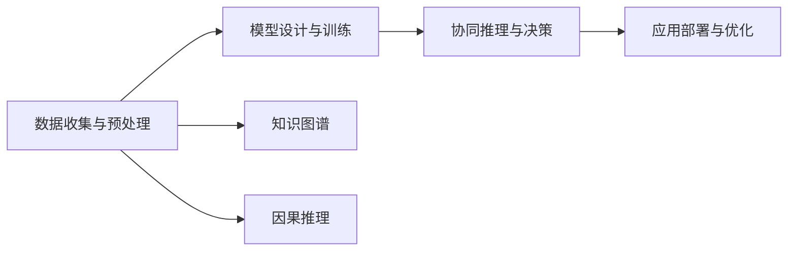

                 

# 探索人类潜力的无限可能：人类计算的新征程

在数字化时代的浪潮中，人工智能（AI）技术的迅猛发展正悄然重塑着我们对这个世界的认知。作为AI的基石，人类计算——即人类与机器协同解决复杂问题的过程——正引领我们迈向无限可能的新纪元。本文将深入探讨人类计算的概念、核心原理、操作步骤以及其在多个领域的广泛应用，展望未来发展趋势与挑战，旨在为各位读者描绘一幅人类计算的新蓝图。

## 1. 背景介绍

### 1.1 问题由来

随着信息技术的高速发展，数据的规模和复杂性不断攀升，传统的计算模式已难以应对。机器学习与深度学习的崛起，为解决复杂问题提供了新的视角。人类计算作为AI技术发展的关键环节，旨在将人类的直觉、经验和智慧与机器的学习能力相结合，从而实现对复杂问题的深度理解和高效解决。

### 1.2 问题核心关键点

人类计算的核心在于实现人类与机器的协同计算，借助AI的力量，将人类的经验与知识转化为可执行的算法和模型。这一过程通常包括以下几个关键步骤：

- 数据收集与预处理：获取高质量的数据，并进行清洗、标注等预处理。
- 模型设计与训练：选择合适的模型结构，使用大数据进行模型训练，优化模型参数。
- 协同推理与决策：将模型输出的结果与人类经验相结合，进行深度推理和综合决策。
- 应用部署与优化：将训练好的模型部署到实际应用中，持续收集反馈数据，优化模型性能。

通过这些步骤，人类计算可以高效地解决多种复杂问题，如自然语言处理、图像识别、智能推荐等，从而提升整体决策的质量和效率。

### 1.3 问题研究意义

研究人类计算对推动人工智能技术的发展、促进各行业的智能化转型具有重要意义：

- 降低开发成本：借助人类计算，可以在短时间内快速构建高质量的AI应用，大大缩短开发周期。
- 提升决策质量：将人类的直觉与机器的精确性相结合，可显著提升决策的全面性和准确性。
- 加速技术落地：人类计算通过简化模型训练和推理过程，加速了AI技术在实际应用中的落地。
- 拓展应用边界：人类计算不仅可以解决已知问题，还能探索未知领域，推动AI技术在更多领域的创新应用。
- 提升用户体验：将AI与人性化的交互设计结合，提升用户体验和满意度。

## 2. 核心概念与联系

### 2.1 核心概念概述

为更好地理解人类计算，本文将介绍几个核心概念及其相互联系：

- **人类计算（Human Computing）**：指将人类的直觉、经验和智慧与机器的学习能力相结合，通过协同计算解决复杂问题的过程。
- **机器学习（Machine Learning）**：指机器通过学习历史数据，自动改进算法以提高性能，而无需进行明确的编程。
- **深度学习（Deep Learning）**：一种特殊的机器学习技术，通过构建深层神经网络，实现对复杂数据的深度学习和表示。
- **协同推理（Cooperative Reasoning）**：指在多智能体系统（如人类与机器协同工作）中，通过协作实现更高效的推理和决策。
- **知识图谱（Knowledge Graph）**：一种结构化存储实体和关系的数据模型，用于支持知识驱动的AI应用。
- **因果推理（Causal Reasoning）**：指通过识别因果关系，理解和预测事件之间复杂的关系。

这些概念相互交织，共同构成了人类计算的基础架构。

### 2.2 核心概念原理和架构的 Mermaid 流程图



这个流程图展示了人类计算的主要流程和关键组件：

1. **数据收集与预处理（A）**：获取和处理数据，为后续计算提供基础。
2. **模型设计与训练（B）**：选择合适的模型结构，通过大数据训练优化。
3. **协同推理与决策（C）**：将机器的推理结果与人类经验结合，进行深度推理。
4. **应用部署与优化（D）**：将模型部署到实际应用中，持续优化性能。
5. **知识图谱（E）**：提供结构化知识支持推理。
6. **因果推理（F）**：理解和预测复杂因果关系。

这些组件共同作用，实现人类计算的全流程协同。

## 3. 核心算法原理 & 具体操作步骤

### 3.1 算法原理概述

人类计算的核心在于将人类的直觉与机器的计算能力相结合，通过协同计算解决复杂问题。这一过程通常分为以下几个步骤：

1. **数据收集与预处理**：获取高质量的数据，并进行清洗、标注等预处理。
2. **模型设计与训练**：选择合适的模型结构，使用大数据进行模型训练，优化模型参数。
3. **协同推理与决策**：将模型输出的结果与人类经验相结合，进行深度推理和综合决策。
4. **应用部署与优化**：将训练好的模型部署到实际应用中，持续收集反馈数据，优化模型性能。

### 3.2 算法步骤详解

1. **数据收集与预处理**：
   - 使用爬虫等工具从网络或数据库中获取数据。
   - 对数据进行清洗和标注，去除噪声和无用信息。
   - 将数据划分为训练集、验证集和测试集。

2. **模型设计与训练**：
   - 选择合适的模型结构，如深度神经网络。
   - 定义损失函数，如交叉熵损失、均方误差等。
   - 使用随机梯度下降等优化算法进行模型训练。
   - 监控训练过程，避免过拟合，定期在验证集上评估模型性能。

3. **协同推理与决策**：
   - 将机器的推理结果与人类经验结合，进行深度推理。
   - 使用因果推理等方法，理解复杂因果关系。
   - 综合考虑机器与人类观点，进行最终决策。

4. **应用部署与优化**：
   - 将训练好的模型部署到实际应用中。
   - 持续收集用户反馈和实际应用数据。
   - 根据反馈数据，优化模型参数，提升性能。

### 3.3 算法优缺点

**优点**：
- 高效解决复杂问题：通过结合人类的直觉和机器的计算能力，可高效解决多种复杂问题。
- 提升决策质量：将人类的经验和知识融入决策过程，提高决策的全面性和准确性。
- 加速技术落地：简化模型训练和推理过程，加速AI技术在实际应用中的落地。

**缺点**：
- 数据依赖性高：高质量数据是计算的基础，但数据获取和标注成本较高。
- 模型复杂度高：深度学习模型结构复杂，训练和推理资源消耗大。
- 推理速度慢：大规模神经网络计算量大，推理速度较慢。

### 3.4 算法应用领域

人类计算在多个领域都有广泛应用，包括但不限于：

- **自然语言处理（NLP）**：通过协同计算，实现自然语言的理解和生成，如机器翻译、情感分析、智能客服等。
- **计算机视觉（CV）**：结合人类的视觉经验和机器的计算能力，实现图像识别、物体检测等任务。
- **智能推荐系统**：通过协同推理，为用户提供个性化的产品或内容推荐。
- **金融分析**：结合机器学习和人类的金融知识，进行市场分析、风险预测等。
- **医疗诊断**：通过协同推理，辅助医生进行疾病诊断和治疗方案制定。
- **智能制造**：结合机器的计算能力和人类的工程经验，实现生产过程的智能化和优化。

## 4. 数学模型和公式 & 详细讲解 & 举例说明

### 4.1 数学模型构建

人类计算涉及的数学模型多种多样，这里以一个简单的协同推理模型为例进行说明。

设有一组训练数据 $(x_i, y_i)$，其中 $x_i$ 为输入，$y_i$ 为标签。设模型参数为 $\theta$，损失函数为 $L(\theta)$。人类计算的目标是最小化损失函数，即：

$$
\theta^* = \arg\min_{\theta} L(\theta)
$$

常用的损失函数包括交叉熵损失、均方误差损失等。在模型训练过程中，使用随机梯度下降等优化算法，最小化损失函数，更新模型参数。

### 4.2 公式推导过程

以交叉熵损失为例，其公式为：

$$
L(\theta) = -\frac{1}{N}\sum_{i=1}^N y_i \log \hat{y}_i + (1-y_i) \log (1-\hat{y}_i)
$$

其中 $\hat{y}_i$ 为模型在输入 $x_i$ 上的预测概率。

在模型训练过程中，使用随机梯度下降算法，更新模型参数 $\theta$：

$$
\theta \leftarrow \theta - \eta \nabla_{\theta} L(\theta)
$$

其中 $\eta$ 为学习率。

### 4.3 案例分析与讲解

考虑一个简单的文本分类任务，数据集包含正面和负面情感的评论。将评论作为输入 $x$，情感标签作为输出 $y$。首先，使用BERT等预训练模型作为初始化参数，然后在训练集上进行微调。微调的目标是最小化交叉熵损失函数。

在训练过程中，使用随机梯度下降算法，对模型参数 $\theta$ 进行更新。每轮更新后，使用验证集对模型性能进行评估，防止过拟合。

## 5. 项目实践：代码实例和详细解释说明

### 5.1 开发环境搭建

为进行人类计算的实践，需要搭建开发环境。以下是基于Python的开发环境配置流程：

1. 安装Anaconda：从官网下载并安装Anaconda，用于创建独立的Python环境。
2. 创建并激活虚拟环境：
   ```bash
   conda create -n human_computing python=3.8 
   conda activate human_computing
   ```
3. 安装必要的工具包：
   ```bash
   pip install numpy pandas scikit-learn transformers
   ```

完成上述步骤后，即可在`human_computing`环境中开始实践。

### 5.2 源代码详细实现

以下是一个简单的文本分类项目的代码实现：

```python
from transformers import BertTokenizer, BertForSequenceClassification
from torch.utils.data import Dataset, DataLoader
from sklearn.metrics import accuracy_score
import torch

# 数据准备
tokenizer = BertTokenizer.from_pretrained('bert-base-uncased')
train_dataset = ...
dev_dataset = ...
test_dataset = ...

# 模型初始化
model = BertForSequenceClassification.from_pretrained('bert-base-uncased', num_labels=2)

# 定义损失函数和优化器
loss_fn = torch.nn.CrossEntropyLoss()
optimizer = torch.optim.AdamW(model.parameters(), lr=1e-5)

# 训练过程
for epoch in range(10):
    train_loss = train_epoch(model, train_dataset, optimizer)
    dev_accuracy = evaluate(model, dev_dataset)
    print(f"Epoch {epoch+1}, train loss: {train_loss:.4f}, dev accuracy: {dev_accuracy:.4f}")

# 评估测试集
test_accuracy = evaluate(model, test_dataset)
print(f"Test accuracy: {test_accuracy:.4f}")
```

### 5.3 代码解读与分析

**数据准备**：
- 使用`BertTokenizer`对输入文本进行分词和编码。
- 将编码后的输入和标签组装为`Dataset`对象，用于训练和评估。

**模型初始化**：
- 使用`BertForSequenceClassification`加载预训练的BERT模型，并进行微调。

**训练过程**：
- 在每个epoch中，计算模型在训练集上的损失，并使用优化器更新模型参数。
- 在验证集上评估模型性能，防止过拟合。

**评估测试集**：
- 在测试集上评估模型性能，输出最终的测试准确率。

## 6. 实际应用场景

### 6.1 智能客服系统

智能客服系统通过结合机器学习和人类知识，实现自动回答用户咨询，提高服务效率和质量。例如，通过协同推理，系统可以根据用户的问题，结合预训练模型的输出，提供最相关的回答。

### 6.2 金融舆情监测

金融舆情监测系统通过自然语言处理和情感分析，实时监控市场动态，预测市场趋势。通过结合人类的金融知识和机器的学习能力，系统能够提供更准确的市场分析。

### 6.3 个性化推荐系统

个性化推荐系统通过协同推理，结合用户的浏览和购买历史，提供个性化的产品或内容推荐。系统可以根据用户的反馈，不断优化推荐模型，提升用户体验。

### 6.4 未来应用展望

未来，人类计算将在更多领域得到应用，为各行各业带来变革性影响。例如：

- **智慧医疗**：通过结合机器学习和人类医学知识，实现疾病的早期诊断和治疗方案制定。
- **智能交通**：通过协同推理，优化交通流量，提高道路通行效率。
- **智能制造**：结合机器的计算能力和人类的工程经验，实现生产过程的智能化和优化。
- **教育领域**：通过协同推理，提供个性化的学习建议和教育资源。
- **智慧城市**：结合机器学习和人类的城市规划知识，实现城市的智能化管理。

## 7. 工具和资源推荐

### 7.1 学习资源推荐

为了帮助开发者掌握人类计算的理论基础和实践技巧，推荐以下学习资源：

1. **《深度学习入门：基于Python的理论与实现》**：介绍深度学习的基本概念和实践技巧，适合初学者。
2. **《自然语言处理综论》**：系统介绍自然语言处理的基本理论和应用案例，适合进阶学习。
3. **《Python机器学习》**：介绍机器学习的基本算法和实践技巧，涵盖多个领域的机器学习应用。
4. **《PyTorch深度学习入门教程》**：由PyTorch官方提供，适合PyTorch初学者。
5. **Kaggle**：提供丰富的数据集和竞赛项目，适合实践和验证机器学习模型。

### 7.2 开发工具推荐

以下是一些常用的开发工具，帮助进行人类计算的实践：

1. **PyTorch**：灵活的深度学习框架，支持动态计算图。
2. **TensorFlow**：强大的深度学习框架，支持分布式计算。
3. **Transformers**：优秀的NLP工具库，支持多种预训练模型。
4. **Jupyter Notebook**：交互式的数据分析和代码编写平台，方便快速迭代。
5. **Google Colab**：免费的GPU计算环境，支持Python和TensorFlow。

### 7.3 相关论文推荐

人类计算的许多前沿研究都发表在学术论文中，推荐以下几篇：

1. **《人类计算：一种新型的计算模式》**：探讨人类计算的概念和应用前景。
2. **《因果推理与深度学习》**：介绍因果推理的基本概念和应用场景。
3. **《知识图谱与自然语言处理》**：探讨知识图谱在自然语言处理中的应用。
4. **《协同推理与人工智能》**：探讨协同推理在人工智能中的应用。
5. **《深度学习的伦理与安全性》**：讨论深度学习模型的伦理和安全问题。

## 8. 总结：未来发展趋势与挑战

### 8.1 研究成果总结

人类计算技术在多个领域都取得了显著进展，但仍然面临诸多挑战：

- **数据依赖性**：高质量数据是计算的基础，但数据获取和标注成本较高。
- **模型复杂性**：深度学习模型结构复杂，训练和推理资源消耗大。
- **推理速度慢**：大规模神经网络计算量大，推理速度较慢。

### 8.2 未来发展趋势

未来，人类计算技术将呈现以下发展趋势：

- **自动化和智能化**：通过自动化和智能化技术，降低人工干预，提升计算效率。
- **多模态融合**：结合视觉、语音、文本等多模态数据，提升模型的综合能力。
- **知识驱动**：引入知识图谱和因果推理，提升模型的推理能力和决策质量。
- **跨领域应用**：在更多领域中推广人类计算技术，推动智能化转型。

### 8.3 面临的挑战

尽管人类计算技术已经取得了显著进展，但在未来应用中仍面临以下挑战：

- **数据获取**：高质量数据的获取和标注成本较高，需要创新方法和技术。
- **模型复杂度**：深度学习模型的复杂度难以降低，需要更高效的计算方法和资源。
- **推理效率**：推理速度慢和资源消耗大是主要瓶颈，需要优化模型结构和推理过程。
- **可解释性**：模型输出缺乏可解释性，需要加强模型设计和解释性分析。
- **伦理和安全**：模型的伦理和安全问题亟需解决，需要严格的监管和规范。

### 8.4 研究展望

未来，人类计算技术需要在以下几个方面进行深入研究：

- **自动化技术**：发展自动化技术，降低人工干预，提升计算效率。
- **多模态融合**：实现视觉、语音、文本等多种模态数据的深度融合，提升综合能力。
- **知识驱动**：结合知识图谱和因果推理，提升模型的推理能力和决策质量。
- **跨领域应用**：推广人类计算技术到更多领域，推动智能化转型。

## 9. 附录：常见问题与解答

**Q1: 人类计算与人工智能有什么区别？**

A: 人类计算是一种结合人类直觉和机器学习能力的计算模式，强调人机协同；而人工智能侧重于通过机器学习实现自主决策和智能行为。

**Q2: 人类计算的核心算法有哪些？**

A: 人类计算的核心算法包括深度学习、协同推理、知识图谱、因果推理等。

**Q3: 如何提高人类计算的推理效率？**

A: 可以使用知识图谱和因果推理，提升模型的推理能力和决策质量。

**Q4: 人类计算有哪些应用场景？**

A: 人类计算的应用场景包括智能客服、金融舆情监测、个性化推荐、智能制造等。

**Q5: 人类计算面临哪些挑战？**

A: 人类计算面临的主要挑战包括数据依赖性高、模型复杂度高、推理速度慢等。

---

作者：禅与计算机程序设计艺术 / Zen and the Art of Computer Programming

