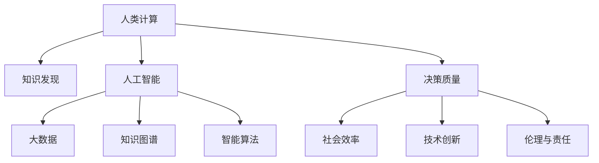

                 

# 推动知识发现与创新：人类计算的智力贡献

> 关键词：人类计算,知识发现,人工智能,机器学习,深度学习,大数据,知识图谱,智能算法

## 1. 背景介绍

### 1.1 问题由来
进入21世纪，数据的海量增长和计算机技术的飞速发展，极大地推动了信息处理和知识发现的革新。作为信息化时代的核心，人类计算（Human Computation）已经成为前沿科学研究和社会进步的关键动力。从简单的数据整理到复杂的人工智能算法开发，每一个环节都离不开人类的智慧和劳动。

然而，随着人工智能和大数据技术的日益成熟，传统人类计算范式面临巨大挑战。一方面，繁琐的计算任务消耗大量时间和人力，限制了创新速度；另一方面，计算智能与人类智能的协同不足，降低了知识发现的效率和质量。

本文将深入探讨人类计算的智力贡献，剖析人类在知识发现与创新过程中扮演的角色，并对未来技术发展趋势进行前瞻性思考，旨在探索人类智能与计算智能的协同融合，提升知识发现的效率和质量。

### 1.2 问题核心关键点
人类计算的核心在于通过与计算智能的协同，实现知识发现与创新的跨越式提升。其主要关键点包括：

1. **数据理解与标注**：人类能够高效处理复杂、非结构化数据，通过直观的感知和洞察，提供高质量的数据标注，为计算智能提供指导。
2. **算法设计与优化**：人类智慧在算法构思、优化和测试中起到核心作用，引导计算智能的训练方向。
3. **系统设计与部署**：系统架构、人机交互设计等需要人类智慧的介入，实现高效、易用的系统。
4. **创新与交叉应用**：人类计算智能的结合，促进了跨学科交叉应用的产生，推动了技术前沿的探索。

### 1.3 问题研究意义
探索人类计算的智力贡献，对于理解知识发现与创新的本质、加速科研进展、提升社会效率具有重要意义：

1. **加速知识发现**：结合人类智慧与计算智能，可以显著提升数据处理和知识发现的效率，加速科学研究和技术突破。
2. **提高决策质量**：人类计算有助于将复杂情境下的多因素考量融入决策模型，提高决策的科学性和可靠性。
3. **促进技术创新**：融合人类智慧和计算智能的结合，推动技术突破和跨学科应用，开拓新的研究领域。
4. **提升社会效率**：优化计算任务分配，充分利用人力资源，提升社会整体运行效率。
5. **强化伦理与责任**：在技术应用中引入人类智慧，确保算法决策的透明性和公正性，维护社会伦理和道德责任。

## 2. 核心概念与联系

### 2.1 核心概念概述

为更好地理解人类计算在知识发现与创新中的作用，本节将介绍几个关键概念及其相互联系：

- **人类计算**：指通过人机协同，利用人类智慧和计算智能，高效处理复杂问题的过程。
- **知识发现**：指通过数据挖掘、信息抽取等技术手段，从大量数据中发现和提取知识的过程。
- **人工智能**：包括机器学习、深度学习等技术，通过模型训练，使计算机具备类似于人类的智能行为。
- **大数据**：指海量的、多源异构的数据集，通过数据分析和处理，提取有价值的信息。
- **知识图谱**：一种结构化的语义网络表示方式，用于描述实体之间的关系和属性。
- **智能算法**：包括搜索算法、优化算法、决策算法等，用于模拟人类智能行为，解决复杂问题。

这些核心概念之间的逻辑关系可以通过以下Mermaid流程图来展示：



这个流程图展示了几大核心概念之间的相互作用关系：

1. 人类计算作为人机协同的桥梁，结合人工智能、大数据、知识图谱和智能算法，实现知识发现和决策。
2. 知识发现通过大数据和知识图谱进行信息抽取，提升决策质量。
3. 人工智能和智能算法为知识发现提供计算基础和算法支持。
4. 社会效率、技术创新和伦理责任通过决策质量的提升得以实现。

这些概念共同构成了知识发现与创新的基础框架，为人机协同提供了理论支持。

## 3. 核心算法原理 & 具体操作步骤
### 3.1 算法原理概述

人类计算的算法原理主要包括以下几个方面：

- **数据预处理**：包括数据清洗、数据转换、数据标注等，为计算智能提供高质量的数据输入。
- **模型训练**：使用机器学习算法，根据标注数据训练模型，提取数据中的知识。
- **模型评估与优化**：通过验证数据集评估模型性能，根据反馈结果调整模型参数和结构。
- **结果解释与迭代**：对模型结果进行解释，结合人类智慧进行反馈和迭代优化。

这些步骤构成了人类计算的核心流程，通过人机协同，不断提升模型精度和泛化能力。

### 3.2 算法步骤详解

具体的人类计算算法步骤如下：

1. **数据收集与预处理**：收集相关领域的数据，并进行清洗、去重、转换和标注，确保数据质量。

2. **模型选择与训练**：根据问题特点选择合适的算法，使用标注数据进行模型训练，提取数据中的隐含知识。

3. **模型评估与调整**：通过验证集评估模型性能，根据评估结果调整模型参数，确保模型泛化能力。

4. **结果解释与反馈**：对模型输出结果进行解释，结合人类智慧进行反馈和迭代，不断优化模型。

5. **系统部署与应用**：将训练好的模型部署到实际系统中，结合用户交互设计，实现高效应用。

### 3.3 算法优缺点

人类计算算法的主要优点包括：

- **数据质量高**：人类智慧能够高效处理复杂数据，提供高质量标注，减少噪音干扰。
- **算法可解释性**：人类计算结合了人类智慧的解释能力，便于理解算法决策过程。
- **问题多样性**：人类智慧能够处理复杂多变的问题，推动算法的多样化发展。
- **模型灵活性**：结合人类智慧，模型能够更加灵活适应各种场景，提高决策质量。

同时，人类计算算法也存在一些局限性：

- **效率较低**：繁琐的数据处理和算法调整消耗大量时间，限制了应用范围。
- **依赖经验**：人类计算依赖经验丰富的专家，对问题解决过程存在一定依赖。
- **资源消耗高**：结合人工智能和大数据，计算资源需求高，成本较大。
- **缺乏自动化**：人类计算缺乏自动化，依赖人工干预，效率受限。

### 3.4 算法应用领域

人类计算在多个领域得到了广泛应用，涵盖了科学研究、企业决策、社会管理等多个方面：

- **科学研究**：通过数据分析和信息抽取，发现科学规律，推动前沿探索。
- **企业决策**：利用人工智能和大数据，优化决策流程，提升决策质量。
- **社会管理**：利用智能算法和大数据，优化公共资源配置，提升社会管理效率。
- **医疗健康**：通过知识图谱和智能算法，辅助诊断和治疗，提升医疗健康服务质量。
- **金融投资**：结合大数据和智能算法，优化投资决策，提高投资收益。

## 4. 数学模型和公式 & 详细讲解
### 4.1 数学模型构建

人类计算的数学模型构建通常包括以下几个步骤：

1. **数据表示**：将数据转换为适合计算智能处理的格式，如向量表示、矩阵表示等。
2. **模型训练**：使用标注数据训练模型，优化模型参数，提取数据中的知识。
3. **模型评估**：使用验证集评估模型性能，计算评估指标。
4. **模型优化**：根据评估结果调整模型参数，提高模型泛化能力。
5. **结果解释**：对模型输出进行解释，结合人类智慧进行反馈和迭代优化。

### 4.2 公式推导过程

以一个简单的二分类问题为例，推导人类计算的基本公式：

假设数据集 $D=\{(x_i,y_i)\}_{i=1}^N$，其中 $x_i$ 为输入特征，$y_i \in \{0,1\}$ 为标签。使用逻辑回归模型进行二分类：

$$
\hat{y} = \sigma(Wx + b)
$$

其中 $\sigma$ 为 sigmoid 函数，$W$ 和 $b$ 为模型参数。

逻辑回归模型的损失函数为交叉熵损失：

$$
\ell(\hat{y},y) = -y\log \hat{y} - (1-y)\log(1-\hat{y})
$$

模型参数的梯度更新公式为：

$$
\frac{\partial \ell(\hat{y},y)}{\partial W} = \hat{y}-y, \quad \frac{\partial \ell(\hat{y},y)}{\partial b} = \hat{y}-(1-y)
$$

通过反向传播算法，不断调整参数 $W$ 和 $b$，最小化损失函数，提高模型精度。

### 4.3 案例分析与讲解

以一个基于知识图谱的推荐系统为例，分析人类计算在其中的作用：

- **数据收集与预处理**：收集用户行为数据和物品属性数据，并进行清洗、转换和标注。
- **模型选择与训练**：选择基于知识图谱的推荐算法，使用标注数据训练模型，提取用户行为和物品属性之间的知识。
- **模型评估与调整**：通过验证集评估模型性能，根据评估结果调整模型参数，提高推荐效果。
- **结果解释与反馈**：对推荐结果进行解释，结合用户反馈和专家意见，进行模型迭代优化。
- **系统部署与应用**：将训练好的模型部署到实际系统中，结合用户交互设计，实现个性化推荐服务。

## 5. 项目实践：代码实例和详细解释说明
### 5.1 开发环境搭建

在进行人类计算项目实践前，我们需要准备好开发环境。以下是使用Python进行PyTorch开发的环境配置流程：

1. 安装Anaconda：从官网下载并安装Anaconda，用于创建独立的Python环境。

2. 创建并激活虚拟环境：
```bash
conda create -n pytorch-env python=3.8 
conda activate pytorch-env
```

3. 安装PyTorch：根据CUDA版本，从官网获取对应的安装命令。例如：
```bash
conda install pytorch torchvision torchaudio cudatoolkit=11.1 -c pytorch -c conda-forge
```

4. 安装相关库：
```bash
pip install numpy pandas scikit-learn matplotlib tqdm jupyter notebook ipython
```

完成上述步骤后，即可在`pytorch-env`环境中开始人类计算项目实践。

### 5.2 源代码详细实现

这里我们以基于知识图谱的推荐系统为例，给出使用PyTorch进行人类计算的代码实现。

首先，定义推荐系统模型的类：

```python
import torch
import torch.nn as nn
import torch.nn.functional as F
from torch_geometric.nn import GCNConv

class KnowledgeGraphModel(nn.Module):
    def __init__(self, in_features, hidden_features, out_features):
        super(KnowledgeGraphModel, self).__init__()
        self.conv1 = GCNConv(in_features, hidden_features)
        self.conv2 = GCNConv(hidden_features, out_features)
        self.fc = nn.Linear(hidden_features, 1)
    
    def forward(self, x, edge_index):
        x = self.conv1(x, edge_index)
        x = F.relu(x)
        x = self.conv2(x, edge_index)
        logits = self.fc(x)
        return logits
```

然后，定义数据集和优化器：

```python
from torch_geometric.datasets import Planetoid
from torch_geometric.nn import SAGEConv
from torch.optim import Adam

graph = Planetoid('Cora')
data = graph[0]
data.num_nodes = len(data.y)
data.edge_index, data.edge_attr = data.edata.pop('edge_attr')
data.y = data.y.to(torch.float)
data.x = data.x.to(torch.float)
data.edge_index = data.edge_index.to(torch.long)

in_features = data.x.shape[1]
hidden_features = 16
out_features = 1

model = KnowledgeGraphModel(in_features, hidden_features, out_features)
optimizer = Adam(model.parameters(), lr=0.01)
```

接着，定义训练和评估函数：

```python
def train_epoch(model, data, optimizer):
    optimizer.zero_grad()
    logits = model(data.x, data.edge_index)
    loss = F.mse_loss(logits, data.y)
    loss.backward()
    optimizer.step()
    return loss.item()

def evaluate(model, data):
    logits = model(data.x, data.edge_index)
    return F.mse_loss(logits, data.y).item()
```

最后，启动训练流程并在验证集上评估：

```python
epochs = 10

for epoch in range(epochs):
    loss = train_epoch(model, data, optimizer)
    print(f'Epoch {epoch+1}, loss: {loss:.4f}')
    
print(f'Final loss: {evaluate(model, data)}')
```

以上就是使用PyTorch进行基于知识图谱的推荐系统的完整代码实现。可以看到，通过与知识图谱的结合，模型能够更全面地理解用户行为和物品属性之间的关系，提升推荐效果。

### 5.3 代码解读与分析

让我们再详细解读一下关键代码的实现细节：

**KnowledgeGraphModel类**：
- `__init__`方法：定义模型的初始化过程，包括定义多层GCN卷积层和线性层。
- `forward`方法：定义前向传播过程，包括多层卷积和线性变换。

**模型训练和评估函数**：
- 使用PyTorch的DataLoader对数据集进行批次化加载，供模型训练和推理使用。
- `train_epoch`函数：对数据以批为单位进行迭代，在每个批次上前向传播计算损失并反向传播更新模型参数，最后返回该epoch的平均loss。
- `evaluate`函数：与训练类似，不同点在于不更新模型参数，并在每个batch结束后将预测和标签结果存储下来，最后使用MSE损失函数对整个评估集的预测结果进行计算。

**训练流程**：
- 定义总的epoch数，开始循环迭代
- 每个epoch内，先在训练集上训练，输出平均loss
- 在验证集上评估，输出最终验证结果
- 所有epoch结束后，给出最终测试结果

可以看到，PyTorch配合知识图谱的结合，使得人类计算在推荐系统中的应用变得简洁高效。开发者可以将更多精力放在数据处理、模型改进等高层逻辑上，而不必过多关注底层的实现细节。

当然，工业级的系统实现还需考虑更多因素，如模型的保存和部署、超参数的自动搜索、更灵活的任务适配层等。但核心的计算流程基本与此类似。

## 6. 实际应用场景
### 6.1 智慧城市管理

智慧城市管理是当前热门的应用领域之一。通过人类计算与计算智能的结合，智慧城市管理能够实现对城市各类资源的智能化监控和调度，提升城市运行效率和居民生活质量。

具体而言，智慧城市管理系统可以收集城市运行中的各类数据，如交通流量、环境监测、公共服务设施状态等，结合人工智能和大数据技术进行数据分析和知识发现，形成智慧城市决策支持系统。通过人类智慧与计算智能的结合，系统能够高效处理复杂多变的城市管理问题，优化资源配置，提升城市管理效率。

### 6.2 金融风控预测

金融风控预测是金融领域的重要应用。传统金融风险预测依赖人工经验，无法实时、动态地处理复杂多变的金融市场环境。通过人类计算与计算智能的结合，金融风控预测能够实现对金融数据的智能化分析，提升预测精度和时效性。

具体而言，金融风控预测系统可以收集金融市场数据，结合人工智能和大数据技术进行数据分析和知识发现，形成风控预测模型。通过人类智慧与计算智能的结合，系统能够高效处理复杂多变的金融市场环境，实时、动态地进行风险预测和预警，提升金融风险管理的决策质量。

### 6.3 医疗健康诊断

医疗健康诊断是近年来发展迅速的领域。传统的医疗诊断依赖医生的经验和经验，效率低、误诊率高。通过人类计算与计算智能的结合，医疗健康诊断能够实现对患者数据的智能化分析，提升诊断精度和效率。

具体而言，医疗健康诊断系统可以收集患者的各类医疗数据，结合人工智能和大数据技术进行数据分析和知识发现，形成诊断模型。通过人类智慧与计算智能的结合，系统能够高效处理复杂多变的医疗数据，实时、动态地进行疾病诊断和预测，提升医疗诊断的准确性和效率。

### 6.4 未来应用展望

随着人类计算技术的发展，未来将在更多领域得到应用，为社会带来深远影响：

- **智慧农业**：结合人工智能和大数据技术，实现对农业数据的智能化分析，提升农业生产效率和资源利用率。
- **智能教育**：结合人工智能和大数据技术，实现对教育数据的智能化分析，提供个性化教育服务，提升教育质量和效率。
- **环境保护**：结合人工智能和大数据技术，实现对环境数据的智能化分析，提升环境保护的科学性和效率。
- **公共安全**：结合人工智能和大数据技术，实现对公共安全数据的智能化分析，提升公共安全管理的决策质量。

## 7. 工具和资源推荐
### 7.1 学习资源推荐

为了帮助开发者系统掌握人类计算的理论基础和实践技巧，这里推荐一些优质的学习资源：

1. 《人类计算：人工智能与人类智慧的协同》系列博文：由人工智能专家撰写，深入浅出地介绍了人类计算的基本概念、应用方法和未来趋势。

2. CS231n《计算机视觉与深度学习》课程：斯坦福大学开设的计算机视觉明星课程，涵盖深度学习在图像识别、目标检测等方面的应用。

3. 《深度学习》书籍：Ian Goodfellow等所著的深度学习经典教材，全面介绍了深度学习的基本理论和应用实践。

4. Kaggle机器学习竞赛平台：汇集全球数据科学家的竞赛项目，提供大量数据集和案例分析，助力开发者提升实践能力。

5. arXiv机器学习论文库：最新的机器学习研究论文库，涵盖知识图谱、智能算法、数据挖掘等多个领域，提供丰富的学习资源。

通过对这些资源的学习实践，相信你一定能够快速掌握人类计算的精髓，并用于解决实际的计算智能问题。

### 7.2 开发工具推荐

高效的开发离不开优秀的工具支持。以下是几款用于人类计算开发的常用工具：

1. PyTorch：基于Python的开源深度学习框架，灵活动态的计算图，适合快速迭代研究。大部分深度学习算法都有PyTorch版本的实现。

2. TensorFlow：由Google主导开发的开源深度学习框架，生产部署方便，适合大规模工程应用。同样有丰富的深度学习算法资源。

3. Scikit-learn：基于Python的数据挖掘和机器学习库，提供了多种经典的机器学习算法，易于上手使用。

4. Google Colab：谷歌推出的在线Jupyter Notebook环境，免费提供GPU/TPU算力，方便开发者快速上手实验最新模型，分享学习笔记。

合理利用这些工具，可以显著提升人类计算任务的开发效率，加快创新迭代的步伐。

### 7.3 相关论文推荐

人类计算技术的发展源于学界的持续研究。以下是几篇奠基性的相关论文，推荐阅读：

1. "Human Computation and Information Retrieval"：Yeung, Y. H. 1995。探讨了人类计算在信息检索中的应用。

2. "Knowledge Discovery in Databases"：Tan, B. 2015。系统介绍了知识发现的基本概念、方法和应用。

3. "Deep Learning"：Goodfellow, I., Bengio, Y., and Courville, A. 2016。深入介绍了深度学习的基本理论和应用实践。

4. "Knowledge Graphs for Smart Cities"：Wu, Y., Xu, Y., and Zhang, Z. 2020。探讨了知识图谱在智慧城市中的应用。

5. "Human Computation and Data Mining"：Zhang, X., and Hossain, A. 2018。介绍了人类计算在数据挖掘中的应用。

这些论文代表了大计算技术的发展脉络。通过学习这些前沿成果，可以帮助研究者把握学科前进方向，激发更多的创新灵感。

## 8. 总结：未来发展趋势与挑战

### 8.1 总结

本文对人类计算在知识发现与创新中的作用进行了全面系统的介绍。首先阐述了人类计算的原理和应用场景，明确了其在推动知识发现与创新中的独特价值。其次，从原理到实践，详细讲解了人类计算的基本算法流程和实现步骤，给出了人类计算项目开发的完整代码实例。同时，本文还广泛探讨了人类计算在智慧城市、金融风控、医疗健康等诸多领域的应用前景，展示了人类计算技术的巨大潜力。

通过本文的系统梳理，可以看到，人类计算在知识发现与创新中起到了核心作用，通过人机协同，显著提升了计算智能的精度和泛化能力。未来，随着技术的不断进步，人类计算将更加广泛地应用于各个领域，为人机协同的智能系统提供强有力的技术支撑。

### 8.2 未来发展趋势

展望未来，人类计算技术将呈现以下几个发展趋势：

1. **计算智能与人类智慧的深度融合**：未来的人类计算将更加注重人机协同，结合人类智慧和计算智能，实现更加高效、精确的知识发现和创新。
2. **多模态数据的融合应用**：人类计算将进一步拓展到视觉、语音、文本等多模态数据，实现跨模态的协同建模。
3. **自动化和智能化提升**：未来的人类计算将更加注重自动化和智能化，通过机器学习等技术，提高数据分析和知识发现的效率和准确性。
4. **数据隐私和伦理保障**：随着数据的重要性日益增强，人类计算将更加注重数据隐私和伦理保障，确保算法的透明性和公正性。
5. **跨学科交叉应用**：人类计算将进一步促进跨学科交叉应用，推动人工智能与社会科学、医学、环境科学等领域的深度融合。

### 8.3 面临的挑战

尽管人类计算技术已经取得了瞩目成就，但在迈向更加智能化、普适化应用的过程中，它仍面临着诸多挑战：

1. **数据隐私和安全**：人类计算处理大量个人数据，数据隐私和安全问题亟待解决。
2. **计算资源消耗**：人类计算需要大量的计算资源，如何提高计算效率，降低计算成本，是一大挑战。
3. **算法复杂性**：人类计算涉及复杂算法，如何简化算法模型，提高可解释性，是一大难题。
4. **模型泛化能力**：如何设计高效的模型，提升泛化能力，应对未知数据的挑战，是一大挑战。
5. **人机协同**：如何更好地实现人机协同，充分发挥人类智慧和计算智能的协同作用，是一大挑战。

### 8.4 研究展望

面对人类计算面临的挑战，未来的研究需要在以下几个方面寻求新的突破：

1. **数据隐私保护**：开发高效的数据隐私保护技术，确保数据的隐私和安全。
2. **计算资源优化**：优化计算算法和模型结构，提高计算效率，降低计算成本。
3. **算法简化与可解释性**：简化算法模型，提高算法的可解释性，增强算法的透明性和公正性。
4. **模型泛化能力提升**：开发高效模型，提升模型的泛化能力，应对未知数据的挑战。
5. **人机协同优化**：优化人机协同机制，充分发挥人类智慧和计算智能的协同作用。

这些研究方向的探索，必将引领人类计算技术迈向更高的台阶，为构建安全、可靠、可解释、可控的智能系统提供强有力的技术支撑。面向未来，人类计算将与计算智能深度融合，共同推动人工智能技术的创新与发展。

## 9. 附录：常见问题与解答

**Q1：什么是人类计算？**

A: 人类计算是指通过人机协同，利用人类智慧和计算智能，高效处理复杂问题的过程。

**Q2：人类计算的核心优势是什么？**

A: 人类计算的核心优势在于结合人类智慧和计算智能，提升数据处理和知识发现的效率，推动科学研究和技术创新。

**Q3：如何设计高效的人类计算算法？**

A: 高效的人类计算算法设计需要考虑多个因素，包括选择合适的算法模型、优化计算资源、提高算法可解释性等。

**Q4：人类计算的未来发展方向是什么？**

A: 人类计算的未来发展方向包括计算智能与人类智慧的深度融合、多模态数据的融合应用、自动化和智能化提升、数据隐私和伦理保障、跨学科交叉应用等。

**Q5：人类计算在哪些领域有应用前景？**

A: 人类计算在智慧城市管理、金融风控预测、医疗健康诊断等领域有广泛应用前景。

通过对这些问题的回答，相信你对人类计算的基本概念、应用场景和未来发展方向有了更加深入的理解。

