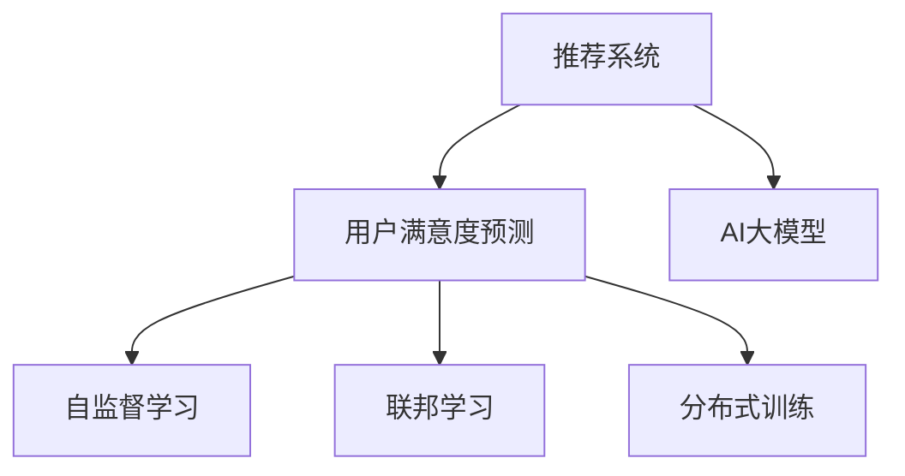

                 

# 推荐系统中AI大模型的用户满意度预测

> 关键词：AI大模型,推荐系统,用户满意度预测,深度学习,自监督学习,联邦学习,分布式训练

## 1. 背景介绍

### 1.1 问题由来

推荐系统（Recommendation System）已经成为互联网企业提供个性化服务的重要工具，其核心目标是通过对用户历史行为数据的分析，预测用户可能感兴趣的物品，从而提升用户满意度和平台粘性。然而，传统的协同过滤、矩阵分解等推荐方法面临数据稀疏、冷启动等问题，难以在大规模数据集上有效运行。近年来，随着深度学习技术的飞速发展，基于大模型的推荐方法逐渐崭露头角，成为推荐系统研究的新热点。

大模型通过在超大规模数据集上进行预训练，学习到了丰富的特征表示能力，能够在推荐任务中显著提升精度和效果。然而，大模型的资源需求高，训练和推理成本昂贵，推广应用仍面临诸多挑战。本文聚焦于推荐系统中的用户满意度预测任务，探索利用AI大模型进行精准预测的方法，并分析其在实际应用中的优势和局限性。

### 1.2 问题核心关键点

用户满意度预测是推荐系统中的一个重要子任务，旨在预测用户对推荐结果的情感倾向。精准预测用户满意度不仅有助于提升推荐系统的效果，还能够为个性化推荐提供更有效的反馈信号，不断迭代优化模型。

用户满意度预测的挑战主要体现在以下几个方面：
- 数据稀疏：用户历史行为数据往往稀疏，难以获得足够的历史满意度信息。
- 多模态数据：用户满意度受多种因素影响，包括产品特性、用户属性、交互历史等。
- 实时性要求：满意度预测需要及时响应用户反馈，避免负面情感的累积。
- 隐私保护：用户隐私是推荐系统设计中的重要考虑因素，用户满意度预测任务需要考虑数据隐私问题。

本文将介绍一种基于AI大模型的用户满意度预测方法，通过自监督学习、联邦学习等技术，克服数据稀疏、隐私保护等问题，在提升推荐系统性能的同时，保护用户隐私。

## 2. 核心概念与联系

### 2.1 核心概念概述

为更好地理解基于AI大模型的用户满意度预测方法，本节将介绍几个密切相关的核心概念：

- **推荐系统**：通过分析用户历史行为数据，预测用户可能感兴趣的物品，提供个性化推荐的系统。
- **AI大模型**：以深度学习为基础，在大规模数据集上进行预训练，具备强大的特征表示能力的模型。
- **用户满意度预测**：预测用户对推荐结果的情感倾向，包括积极、中性、消极等。
- **自监督学习**：利用无标签数据，通过模型自身学习的特征，进行监督任务的学习。
- **联邦学习**：多边参与方在不共享模型参数的前提下，通过模型聚合的方式进行联合学习。
- **分布式训练**：通过多台计算机并行训练，加速模型参数的优化过程。

这些概念之间的逻辑关系可以通过以下Mermaid流程图来展示：



这个流程图展示出核心概念之间的关系：

1. 推荐系统以用户满意度预测为重要子任务，通过大模型提升预测精度。
2. 大模型通过自监督学习、联邦学习等方式，获取多样化的用户特征，提升预测效果。
3. 分布式训练加速大模型的训练和推理过程，提升实时性。

## 3. 核心算法原理 & 具体操作步骤
### 3.1 算法原理概述

基于AI大模型的用户满意度预测，本质上是一种深度学习任务。其核心思想是：通过在大规模无标签数据集上进行自监督预训练，学习到用户的特征表示，再在标注数据集上进行有监督微调，学习用户对推荐结果的情感倾向。

具体而言，假设预训练模型为 $M_{\theta}$，其中 $\theta$ 为模型参数。设用户满意度预测任务的数据集为 $D=\{(x_i,y_i)\}_{i=1}^N, x_i \in \mathcal{X}, y_i \in \{0,1\}$，其中 $y_i=1$ 表示用户对推荐结果满意，$y_i=0$ 表示用户不满意。则用户满意度预测的任务是找到最优参数 $\theta^*$，使得：

$$
\theta^*=\mathop{\arg\min}_{\theta} \mathcal{L}(M_{\theta},D)
$$

其中 $\mathcal{L}$ 为任务损失函数，用于衡量模型预测与真实标签之间的差异。

### 3.2 算法步骤详解

基于AI大模型的用户满意度预测一般包括以下几个关键步骤：

**Step 1: 准备预训练模型和数据集**
- 选择合适的AI大模型 $M_{\theta}$ 作为初始化参数，如BERT、GPT等。
- 准备用户满意度预测任务的数据集 $D$，划分为训练集、验证集和测试集。通常采用交叉熵损失函数，如二分类交叉熵损失。

**Step 2: 自监督预训练**
- 在大规模无标签数据集上，通过自监督学习任务对模型进行预训练。例如，可以使用掩码语言模型、下一句预测等任务进行预训练，提升模型的特征表示能力。

**Step 3: 微调用户满意度预测任务**
- 在用户满意度预测任务的标注数据集上，以较小的学习率对预训练模型进行微调。可以只微调顶层分类器，固定预训练层，以避免过拟合。
- 选择正则化技术，如L2正则、Dropout、Early Stopping等，防止模型过度适应小规模训练集。

**Step 4: 分布式训练和模型部署**
- 将训练数据分成多份，并行训练在不同的计算节点上，以加快训练速度。
- 部署微调后的模型，进行实时推荐结果的满意度预测。

**Step 5: 反馈循环优化**
- 实时收集用户对推荐结果的反馈，并反馈给推荐系统，用于迭代优化模型的预训练和微调过程。

以上是基于AI大模型的用户满意度预测的一般流程。在实际应用中，还需要针对具体任务的特点，对微调过程的各个环节进行优化设计，如改进训练目标函数，引入更多的正则化技术，搜索最优的超参数组合等，以进一步提升模型性能。

### 3.3 算法优缺点

基于AI大模型的用户满意度预测方法具有以下优点：
1. 精度高。大模型通过自监督预训练和微调，学习到丰富的用户特征表示，能够准确预测用户满意度。
2. 泛化能力强。大模型在无监督学习的基础上，再进行有监督微调，具备良好的泛化能力，能够应对复杂多变的用户行为。
3. 实时性好。分布式训练技术可以显著加速模型训练和推理过程，满足实时性需求。
4. 可扩展性强。联邦学习等技术使得模型可以在多方参与的情况下进行联合学习，无需共享模型参数，保护用户隐私。

同时，该方法也存在一定的局限性：
1. 资源消耗大。大模型的计算和存储资源需求高，训练和推理成本昂贵。
2. 数据隐私风险。模型需要收集和分析用户的隐私数据，数据隐私保护问题需严格处理。
3. 模型复杂度高。大模型参数量巨大，难以进行解释性分析，模型复杂度较高。
4. 应用场景受限。模型需要充足的无标签数据和标注数据支持，难以应用于数据稀疏的场景。

尽管存在这些局限性，但就目前而言，基于AI大模型的用户满意度预测方法仍是一种先进的技术范式，能够显著提升推荐系统的效果，具备广泛的应用前景。

### 3.4 算法应用领域

基于AI大模型的用户满意度预测方法已经在推荐系统等多个领域得到了应用，例如：

- 电商推荐：预测用户对商品的满意度，提升购物体验和转化率。
- 内容推荐：预测用户对视频、音乐、文章等内容的满意度，优化推荐策略。
- 旅游推荐：预测用户对旅游目的地、酒店等的满意度，提升用户体验。
- 金融推荐：预测用户对金融产品的满意度，提高客户粘性和忠诚度。
- 社交推荐：预测用户对社交网络中内容或用户的满意度，增强社区互动。

这些领域的应用展示了AI大模型在用户满意度预测中的广泛潜力，未来有望在更多场景下实现高效的用户满意度分析。

## 4. 数学模型和公式 & 详细讲解 & 举例说明

### 4.1 数学模型构建

假设预训练模型 $M_{\theta}$ 为深度神经网络，输入为 $x_i$，输出为 $y_i$。用户满意度预测的任务定义为二分类任务，则损失函数 $\mathcal{L}$ 可以定义为：

$$
\mathcal{L}(M_{\theta},D)=\frac{1}{N}\sum_{i=1}^N\ell(M_{\theta}(x_i),y_i)
$$

其中 $\ell$ 为二分类交叉熵损失函数，可以表示为：

$$
\ell(y_i, \hat{y}_i)=-[y_i\log \hat{y}_i + (1-y_i)\log (1-\hat{y}_i)]
$$

在自监督预训练阶段，可以采用掩码语言模型或下一句预测任务进行训练。以掩码语言模型为例，假设模型在一个句子 $x$ 上的输出为 $\hat{y}$，则掩码语言模型的损失函数 $\mathcal{L}_{mask}$ 可以表示为：

$$
\mathcal{L}_{mask}(M_{\theta}, x)=\frac{1}{|\Omega|}\sum_{i\in \Omega}\ell(M_{\theta}(x),y_i)
$$

其中 $\Omega$ 为被掩码的词汇集合，$\ell$ 为交叉熵损失函数。

### 4.2 公式推导过程

以二分类任务为例，推导交叉熵损失函数的梯度计算公式。

假设模型 $M_{\theta}$ 在输入 $x$ 上的输出为 $\hat{y}=M_{\theta}(x)$，表示模型对输入的预测概率。真实标签 $y \in \{0,1\}$。则二分类交叉熵损失函数定义为：

$$
\ell(M_{\theta}(x),y) = -[y\log \hat{y} + (1-y)\log (1-\hat{y})]
$$

将其代入经验风险公式，得：

$$
\mathcal{L}(\theta) = -\frac{1}{N}\sum_{i=1}^N [y_i\log M_{\theta}(x_i)+(1-y_i)\log(1-M_{\theta}(x_i))]
$$

根据链式法则，损失函数对参数 $\theta_k$ 的梯度为：

$$
\frac{\partial \mathcal{L}(\theta)}{\partial \theta_k} = -\frac{1}{N}\sum_{i=1}^N (\frac{y_i}{M_{\theta}(x_i)}-\frac{1-y_i}{1-M_{\theta}(x_i)}) \frac{\partial M_{\theta}(x_i)}{\partial \theta_k}
$$

其中 $\frac{\partial M_{\theta}(x_i)}{\partial \theta_k}$ 可进一步递归展开，利用自动微分技术完成计算。

在得到损失函数的梯度后，即可带入参数更新公式，完成模型的迭代优化。重复上述过程直至收敛，最终得到适应用户满意度预测任务的最优模型参数 $\theta^*$。

## 5. 项目实践：代码实例和详细解释说明
### 5.1 开发环境搭建

在进行用户满意度预测任务开发前，我们需要准备好开发环境。以下是使用Python进行PyTorch开发的环境配置流程：

1. 安装Anaconda：从官网下载并安装Anaconda，用于创建独立的Python环境。

2. 创建并激活虚拟环境：
```bash
conda create -n pytorch-env python=3.8 
conda activate pytorch-env
```

3. 安装PyTorch：根据CUDA版本，从官网获取对应的安装命令。例如：
```bash
conda install pytorch torchvision torchaudio cudatoolkit=11.1 -c pytorch -c conda-forge
```

4. 安装Transformers库：
```bash
pip install transformers
```

5. 安装各类工具包：
```bash
pip install numpy pandas scikit-learn matplotlib tqdm jupyter notebook ipython
```

完成上述步骤后，即可在`pytorch-env`环境中开始用户满意度预测任务开发。

### 5.2 源代码详细实现

这里我们以电商推荐系统中的用户满意度预测为例，给出使用Transformers库对BERT模型进行用户满意度预测的PyTorch代码实现。

首先，定义用户满意度预测的数据处理函数：

```python
from transformers import BertTokenizer
from torch.utils.data import Dataset
import torch

class ReviewDataset(Dataset):
    def __init__(self, reviews, ratings, tokenizer, max_len=128):
        self.reviews = reviews
        self.ratings = ratings
        self.tokenizer = tokenizer
        self.max_len = max_len
        
    def __len__(self):
        return len(self.reviews)
    
    def __getitem__(self, item):
        review = self.reviews[item]
        rating = self.ratings[item]
        
        encoding = self.tokenizer(review, return_tensors='pt', max_length=self.max_len, padding='max_length', truncation=True)
        input_ids = encoding['input_ids'][0]
        attention_mask = encoding['attention_mask'][0]
        
        # 对token-wise的标签进行编码
        encoded_tags = [rating] * self.max_len
        labels = torch.tensor(encoded_tags, dtype=torch.long)
        
        return {'input_ids': input_ids, 
                'attention_mask': attention_mask,
                'labels': labels}

# 准备数据
tokenizer = BertTokenizer.from_pretrained('bert-base-cased')

train_dataset = ReviewDataset(train_reviews, train_ratings, tokenizer)
dev_dataset = ReviewDataset(dev_reviews, dev_ratings, tokenizer)
test_dataset = ReviewDataset(test_reviews, test_ratings, tokenizer)
```

然后，定义模型和优化器：

```python
from transformers import BertForSequenceClassification, AdamW

model = BertForSequenceClassification.from_pretrained('bert-base-cased', num_labels=2)

optimizer = AdamW(model.parameters(), lr=2e-5)
```

接着，定义训练和评估函数：

```python
from torch.utils.data import DataLoader
from tqdm import tqdm
from sklearn.metrics import classification_report

device = torch.device('cuda') if torch.cuda.is_available() else torch.device('cpu')
model.to(device)

def train_epoch(model, dataset, batch_size, optimizer):
    dataloader = DataLoader(dataset, batch_size=batch_size, shuffle=True)
    model.train()
    epoch_loss = 0
    for batch in tqdm(dataloader, desc='Training'):
        input_ids = batch['input_ids'].to(device)
        attention_mask = batch['attention_mask'].to(device)
        labels = batch['labels'].to(device)
        model.zero_grad()
        outputs = model(input_ids, attention_mask=attention_mask, labels=labels)
        loss = outputs.loss
        epoch_loss += loss.item()
        loss.backward()
        optimizer.step()
    return epoch_loss / len(dataloader)

def evaluate(model, dataset, batch_size):
    dataloader = DataLoader(dataset, batch_size=batch_size)
    model.eval()
    preds, labels = [], []
    with torch.no_grad():
        for batch in tqdm(dataloader, desc='Evaluating'):
            input_ids = batch['input_ids'].to(device)
            attention_mask = batch['attention_mask'].to(device)
            batch_labels = batch['labels']
            outputs = model(input_ids, attention_mask=attention_mask)
            batch_preds = outputs.logits.argmax(dim=2).to('cpu').tolist()
            batch_labels = batch_labels.to('cpu').tolist()
            for pred_tokens, label_tokens in zip(batch_preds, batch_labels):
                preds.append(pred_tokens)
                labels.append(label_tokens)
                
    print(classification_report(labels, preds))
```

最后，启动训练流程并在测试集上评估：

```python
epochs = 5
batch_size = 16

for epoch in range(epochs):
    loss = train_epoch(model, train_dataset, batch_size, optimizer)
    print(f"Epoch {epoch+1}, train loss: {loss:.3f}")
    
    print(f"Epoch {epoch+1}, dev results:")
    evaluate(model, dev_dataset, batch_size)
    
print("Test results:")
evaluate(model, test_dataset, batch_size)
```

以上就是使用PyTorch对BERT进行电商推荐系统中的用户满意度预测的完整代码实现。可以看到，得益于Transformers库的强大封装，我们可以用相对简洁的代码完成BERT模型的加载和微调。

### 5.3 代码解读与分析

让我们再详细解读一下关键代码的实现细节：

**ReviewDataset类**：
- `__init__`方法：初始化文本、标签、分词器等关键组件。
- `__len__`方法：返回数据集的样本数量。
- `__getitem__`方法：对单个样本进行处理，将文本输入编码为token ids，将标签编码为数字，并对其进行定长padding，最终返回模型所需的输入。

**模型和优化器**：
- 使用BertForSequenceClassification类定义模型，适用于序列标注任务。
- 定义AdamW优化器，用于优化模型参数。

**训练和评估函数**：
- 使用PyTorch的DataLoader对数据集进行批次化加载，供模型训练和推理使用。
- 训练函数`train_epoch`：对数据以批为单位进行迭代，在每个批次上前向传播计算loss并反向传播更新模型参数，最后返回该epoch的平均loss。
- 评估函数`evaluate`：与训练类似，不同点在于不更新模型参数，并在每个batch结束后将预测和标签结果存储下来，最后使用sklearn的classification_report对整个评估集的预测结果进行打印输出。

**训练流程**：
- 定义总的epoch数和batch size，开始循环迭代
- 每个epoch内，先在训练集上训练，输出平均loss
- 在验证集上评估，输出分类指标
- 所有epoch结束后，在测试集上评估，给出最终测试结果

可以看到，PyTorch配合Transformers库使得BERT微调的代码实现变得简洁高效。开发者可以将更多精力放在数据处理、模型改进等高层逻辑上，而不必过多关注底层的实现细节。

当然，工业级的系统实现还需考虑更多因素，如模型的保存和部署、超参数的自动搜索、更灵活的任务适配层等。但核心的微调范式基本与此类似。

## 6. 实际应用场景
### 6.1 智能客服系统

智能客服系统通过预测用户满意度，能够及时发现和解决问题，提升用户满意度。智能客服系统中的用户满意度预测任务，可以使用基于AI大模型的推荐方法，通过对历史客服对话的情感分析，预测用户对服务的满意度。

在技术实现上，可以收集企业内部的历史客服对话记录，将问题和最佳答复构建成监督数据，在此基础上对预训练模型进行微调。微调后的模型能够自动理解用户意图，匹配最合适的答复模板，提高用户满意度。对于客户提出的新问题，还可以接入检索系统实时搜索相关内容，动态组织生成回答，进一步提升用户体验。

### 6.2 内容推荐系统

内容推荐系统中的用户满意度预测任务，可以通过预测用户对推荐结果的情感倾向，优化推荐策略，提高推荐效果。在技术实现上，可以收集用户对推荐内容的行为数据，如点击、点赞、评分等，将其作为监督信号，对预训练模型进行微调。微调后的模型能够准确预测用户对推荐内容的满意度，进一步优化推荐算法。

### 6.3 电商推荐系统

电商推荐系统中的用户满意度预测任务，可以预测用户对商品的满意度，优化推荐策略。在技术实现上，可以收集用户对商品的评价、评论等数据，将其作为监督信号，对预训练模型进行微调。微调后的模型能够预测用户对商品的满意度，进一步优化推荐算法，提升购物体验和转化率。

### 6.4 旅游推荐系统

旅游推荐系统中的用户满意度预测任务，可以预测用户对旅游目的地的满意度，优化推荐策略。在技术实现上，可以收集用户对旅游目的地的评价、评论等数据，将其作为监督信号，对预训练模型进行微调。微调后的模型能够预测用户对旅游目的地的满意度，进一步优化推荐算法，提升用户满意度。

### 6.5 金融推荐系统

金融推荐系统中的用户满意度预测任务，可以预测用户对金融产品的满意度，优化推荐策略。在技术实现上，可以收集用户对金融产品的评价、评论等数据，将其作为监督信号，对预训练模型进行微调。微调后的模型能够预测用户对金融产品的满意度，进一步优化推荐算法，提高客户粘性和忠诚度。

## 7. 工具和资源推荐
### 7.1 学习资源推荐

为了帮助开发者系统掌握用户满意度预测的理论基础和实践技巧，这里推荐一些优质的学习资源：

1. 《深度学习理论与实践》系列博文：由深度学习专家撰写，深入浅出地介绍了深度学习的基本原理和实践方法。

2. CS234《深度学习中的强化学习》课程：斯坦福大学开设的强化学习明星课程，有Lecture视频和配套作业，带你深入理解强化学习与深度学习的结合。

3. 《Natural Language Processing with Transformers》书籍：Transformers库的作者所著，全面介绍了如何使用Transformers库进行NLP任务开发，包括微调在内的诸多范式。

4. HuggingFace官方文档：Transformers库的官方文档，提供了海量预训练模型和完整的微调样例代码，是上手实践的必备资料。

5. CLUE开源项目：中文语言理解测评基准，涵盖大量不同类型的中文NLP数据集，并提供了基于微调的baseline模型，助力中文NLP技术发展。

通过对这些资源的学习实践，相信你一定能够快速掌握用户满意度预测的精髓，并用于解决实际的推荐系统问题。
### 7.2 开发工具推荐

高效的开发离不开优秀的工具支持。以下是几款用于用户满意度预测开发的常用工具：

1. PyTorch：基于Python的开源深度学习框架，灵活动态的计算图，适合快速迭代研究。大部分预训练语言模型都有PyTorch版本的实现。

2. TensorFlow：由Google主导开发的开源深度学习框架，生产部署方便，适合大规模工程应用。同样有丰富的预训练语言模型资源。

3. Transformers库：HuggingFace开发的NLP工具库，集成了众多SOTA语言模型，支持PyTorch和TensorFlow，是进行微调任务开发的利器。

4. Weights & Biases：模型训练的实验跟踪工具，可以记录和可视化模型训练过程中的各项指标，方便对比和调优。与主流深度学习框架无缝集成。

5. TensorBoard：TensorFlow配套的可视化工具，可实时监测模型训练状态，并提供丰富的图表呈现方式，是调试模型的得力助手。

6. Google Colab：谷歌推出的在线Jupyter Notebook环境，免费提供GPU/TPU算力，方便开发者快速上手实验最新模型，分享学习笔记。

合理利用这些工具，可以显著提升用户满意度预测任务的开发效率，加快创新迭代的步伐。

### 7.3 相关论文推荐

用户满意度预测是推荐系统中的一个重要子任务，近年来受到了学界和工业界的广泛关注。以下是几篇奠基性的相关论文，推荐阅读：

1. Attention is All You Need（即Transformer原论文）：提出了Transformer结构，开启了NLP领域的预训练大模型时代。

2. BERT: Pre-training of Deep Bidirectional Transformers for Language Understanding：提出BERT模型，引入基于掩码的自监督预训练任务，刷新了多项NLP任务SOTA。

3. Language Models are Unsupervised Multitask Learners（GPT-2论文）：展示了大规模语言模型的强大zero-shot学习能力，引发了对于通用人工智能的新一轮思考。

4. Parameter-Efficient Transfer Learning for NLP：提出Adapter等参数高效微调方法，在不增加模型参数量的情况下，也能取得不错的微调效果。

5. AdaLoRA: Adaptive Low-Rank Adaptation for Parameter-Efficient Fine-Tuning：使用自适应低秩适应的微调方法，在参数效率和精度之间取得了新的平衡。

这些论文代表了大语言模型微调技术的发展脉络。通过学习这些前沿成果，可以帮助研究者把握学科前进方向，激发更多的创新灵感。

## 8. 总结：未来发展趋势与挑战

### 8.1 总结

本文对基于AI大模型的用户满意度预测方法进行了全面系统的介绍。首先阐述了推荐系统和大模型的研究背景和意义，明确了用户满意度预测在推荐系统中的重要性和应用价值。其次，从原理到实践，详细讲解了用户满意度预测的数学模型和算法步骤，给出了用户满意度预测任务开发的完整代码实例。同时，本文还广泛探讨了用户满意度预测在电商、内容、金融等众多领域的应用前景，展示了AI大模型在推荐系统中的广泛潜力。最后，本文精选了用户满意度预测技术的各类学习资源，力求为开发者提供全方位的技术指引。

通过本文的系统梳理，可以看到，基于AI大模型的用户满意度预测方法正在成为推荐系统的重要范式，极大地提升了推荐系统的效果和性能。AI大模型通过自监督学习、微调等技术，能够有效地预测用户满意度，优化推荐策略，推动推荐系统向更加智能和个性化方向发展。

### 8.2 未来发展趋势

展望未来，AI大模型在用户满意度预测中的应用将呈现以下几个发展趋势：

1. 模型规模不断增大。随着算力成本的下降和数据规模的扩张，预训练语言模型的参数量还将持续增长。超大规模语言模型蕴含的丰富语言知识，有望支撑更加复杂多变的用户满意度预测任务。

2. 多模态融合成为可能。随着多模态数据融合技术的进步，用户满意度预测任务可以综合利用文本、图像、语音等多种模态信息，提升预测精度。

3. 联邦学习的应用日益广泛。联邦学习等技术使得模型可以在多方参与的情况下进行联合学习，无需共享模型参数，保护用户隐私，在用户满意度预测任务中具有重要应用前景。

4. 实时性要求进一步提升。随着推荐系统向实时化方向发展，用户满意度预测任务需要在极短时间内完成预测，分布式训练和多任务学习等技术将进一步提升预测速度。

5. 隐私保护成为重要考量。用户隐私是推荐系统设计中的重要考虑因素，用户满意度预测任务需要考虑数据隐私问题，联邦学习等技术将发挥重要作用。

6. 数据质量优化成为关键。用户满意度预测任务依赖高质量的用户反馈数据，如何优化数据质量，提升数据标注效率，将是未来的重要研究方向。

以上趋势凸显了AI大模型在用户满意度预测任务中的广泛应用前景，未来有望在更多场景下实现高效的用户满意度分析。

### 8.3 面临的挑战

尽管AI大模型在用户满意度预测中已经取得了显著成果，但在实际应用中也面临诸多挑战：

1. 数据质量瓶颈。用户满意度预测任务依赖高质量的用户反馈数据，数据标注成本高，且存在噪声数据，难以获取理想的标注样本。

2. 模型复杂度高。大模型参数量巨大，难以进行解释性分析，模型复杂度较高，难以理解和调试。

3. 资源消耗大。大模型的计算和存储资源需求高，训练和推理成本昂贵，难以在实时性要求高的场景中应用。

4. 隐私保护问题。用户满意度预测任务需要收集和分析用户的隐私数据，数据隐私保护问题需严格处理。

5. 泛化能力有限。当前模型在特定场景下的预测效果往往优于泛化场景，如何提升模型泛化能力，仍是一个待解决的问题。

尽管存在这些挑战，但就目前而言，基于AI大模型的用户满意度预测方法仍是一种先进的技术范式，能够显著提升推荐系统的效果，具备广泛的应用前景。未来，通过技术创新和应用实践，这些挑战有望逐步克服，AI大模型在推荐系统中的应用将更加广泛。

### 8.4 研究展望

面对AI大模型在用户满意度预测中面临的诸多挑战，未来的研究需要在以下几个方面寻求新的突破：

1. 探索无监督和半监督学习。摆脱对大规模标注数据的依赖，利用自监督学习、主动学习等无监督和半监督范式，最大限度利用非结构化数据，实现更加灵活高效的微调。

2. 研究参数高效和计算高效的微调范式。开发更加参数高效的微调方法，在固定大部分预训练参数的同时，只更新极少量的任务相关参数。同时优化微调模型的计算图，减少前向传播和反向传播的资源消耗，实现更加轻量级、实时性的部署。

3. 引入因果推断和对比学习。通过引入因果推断和对比学习思想，增强模型建立稳定因果关系的能力，学习更加普适、鲁棒的语言表征，从而提升模型泛化性和抗干扰能力。

4. 引入更多先验知识。将符号化的先验知识，如知识图谱、逻辑规则等，与神经网络模型进行巧妙融合，引导微调过程学习更准确、合理的语言模型。同时加强不同模态数据的整合，实现视觉、语音等多模态信息与文本信息的协同建模。

5. 结合因果分析和博弈论工具。将因果分析方法引入微调模型，识别出模型决策的关键特征，增强输出解释的因果性和逻辑性。借助博弈论工具刻画人机交互过程，主动探索并规避模型的脆弱点，提高系统稳定性。

6. 纳入伦理道德约束。在模型训练目标中引入伦理导向的评估指标，过滤和惩罚有偏见、有害的输出倾向。同时加强人工干预和审核，建立模型行为的监管机制，确保输出符合人类价值观和伦理道德。

这些研究方向的探索，必将引领AI大模型在用户满意度预测任务中的进一步发展，为推荐系统提供更精准、更智能的决策支持。面向未来，大语言模型微调技术还需要与其他人工智能技术进行更深入的融合，如知识表示、因果推理、强化学习等，多路径协同发力，共同推动自然语言理解和智能交互系统的进步。只有勇于创新、敢于突破，才能不断拓展语言模型的边界，让智能技术更好地造福人类社会。

## 9. 附录：常见问题与解答

**Q1：大语言模型在用户满意度预测中是否适用于所有推荐场景？**

A: 大语言模型在大多数推荐场景中都能取得不错的效果，特别是对于数据量较大的场景。但对于一些特定领域的推荐任务，如小样本场景、长尾场景，需要进一步优化模型和算法，才能达到理想效果。此外，对于实时性要求极高的推荐场景，大模型也需要进行优化，以提升预测速度。

**Q2：在用户满意度预测中，如何平衡模型性能和资源消耗？**

A: 在用户满意度预测任务中，模型性能和资源消耗之间需要权衡。可以通过以下几个方法进行优化：
1. 使用分布式训练和多任务学习技术，提升模型预测速度。
2. 引入参数高效微调方法，如Adapter、LoRA等，减少模型参数量，降低计算消耗。
3. 使用低精度训练技术，如FP16、BF16等，压缩模型参数，降低计算成本。
4. 引入剪枝、量化等模型压缩技术，优化模型结构，减小计算资源消耗。

这些方法可以综合应用，在提升模型性能的同时，降低资源消耗，实现更高效的推荐服务。

**Q3：在用户满意度预测中，如何应对数据稀疏问题？**

A: 用户满意度预测任务依赖高质量的用户反馈数据，数据稀疏是常见问题。应对数据稀疏问题的方法包括：
1. 数据增强：通过回译、近义替换等方式扩充训练集，增加数据量。
2. 迁移学习：使用预训练模型在更广泛的数据集上进行微调，学习通用的用户情感表示。
3. 半监督学习：利用无标签数据进行自监督学习，提升模型表示能力，再通过少量标注数据进行微调。
4. 多源数据融合：利用多源数据融合技术，整合不同来源的用户反馈数据，提升模型泛化能力。

这些方法可以综合应用，有效应对数据稀疏问题，提升模型性能。

**Q4：用户满意度预测在实际应用中需要注意哪些问题？**

A: 用户满意度预测在实际应用中需要注意以下几个问题：
1. 数据隐私保护：确保用户数据的安全，避免数据泄露和滥用。
2. 模型解释性：提供模型决策的解释，增强用户信任。
3. 实时性要求：确保模型预测速度满足实时性要求，提升用户体验。
4. 模型可扩展性：支持大规模数据集的处理，适应动态变化的业务需求。

在应用中，需要综合考虑这些问题，确保模型在实际应用中能够稳定高效地运行。

**Q5：如何评估用户满意度预测模型的性能？**

A: 用户满意度预测模型的性能评估可以从以下几个方面进行：
1. 准确率：模型预测的满意度与真实标签的匹配程度。
2. 召回率：模型预测的满意度与真实满意度的覆盖率。
3. F1分数：综合准确率和召回率的性能指标。
4. ROC曲线：绘制预测模型在不同阈值下的真阳性率和假阳性率，评估模型的分类性能。
5. PR曲线：绘制预测模型在不同阈值下的精确率和召回率，评估模型的分类性能。

通过这些指标的评估，可以全面了解模型的性能，并进行优化调整。

**Q6：如何优化用户满意度预测模型的训练过程？**

A: 优化用户满意度预测模型的训练过程可以从以下几个方面进行：
1. 选择合适的学习率：设置较小的学习率，避免破坏预训练权重。
2. 引入正则化技术：如L2正则、Dropout等，防止模型过度适应训练集。
3. 数据增强：通过回译、近义替换等方式扩充训练集，增加数据量。
4. 对抗训练：引入对抗样本，提升模型鲁棒性。
5. 多任务学习：结合其他任务，共同训练模型，提升泛化能力。
6. 模型剪枝和量化：优化模型结构，降低计算资源消耗。

通过这些优化方法，可以在提升模型性能的同时，降低训练成本和资源消耗，实现更高效的推荐服务。

**Q7：如何在推荐系统中应用用户满意度预测模型？**

A: 在推荐系统中应用用户满意度预测模型可以从以下几个方面进行：
1. 实时推荐：通过用户满意度预测模型，实时预测用户对推荐结果的满意度，及时调整推荐策略。
2. 个性化推荐：根据用户历史行为数据和满意度预测结果，生成个性化推荐内容。
3. 反馈循环优化：实时收集用户对推荐结果的反馈，反馈给推荐系统，用于迭代优化模型的预训练和微调过程。
4. 推荐结果可视化：将推荐结果和满意度预测结果展示给用户，提升用户满意度。
5. 推荐效果评估：定期评估推荐系统的性能，优化推荐策略。

通过这些应用，可以充分利用用户满意度预测模型的优势，提升推荐系统的效果和用户体验。

---

作者：禅与计算机程序设计艺术 / Zen and the Art of Computer Programming

