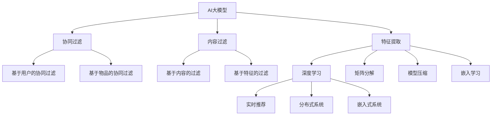

                 

# 推荐系统中的AI大模型：从理论到实践

> 关键词：AI大模型,推荐系统,深度学习,协同过滤,矩阵分解,神经网络,模型压缩,嵌入学习,实时推荐,分布式系统,嵌入式系统

## 1. 背景介绍

### 1.1 问题由来
推荐系统在互联网公司中扮演着重要的角色，无论是电商网站、视频平台、社交网络，还是音乐、新闻、图书等各个领域，都在广泛应用推荐算法来提高用户体验和营收增长。传统的推荐算法主要分为基于协同过滤和基于内容过滤的两种方法，前者基于用户和物品间的相似度进行推荐，后者则侧重于物品本身的特征进行推荐。但这些方法往往存在数据稀疏、高维特征等问题，难以处理大规模的数据集。

随着深度学习技术的兴起，AI大模型（如BERT、GPT等）逐渐成为推荐系统的新宠。通过在大规模数据集上进行预训练，AI大模型具备了强大的特征提取和表示学习能力，可以更高效地处理推荐问题。本文旨在通过深入介绍AI大模型在推荐系统中的应用，探讨其优势、挑战与优化策略，并展望未来发展方向。

### 1.2 问题核心关键点
AI大模型在推荐系统中的核心应用包括：
- 利用预训练能力进行特征提取
- 使用大模型优化协同过滤和内容过滤方法
- 引入模型压缩和嵌入学习技术，提高模型效率
- 结合实时系统，实现动态推荐
- 在分布式和嵌入式环境中进行优化和部署

这些核心关键点将贯穿全文，帮助我们深入理解AI大模型在推荐系统中的应用与挑战。

## 2. 核心概念与联系

### 2.1 核心概念概述

为更好地理解AI大模型在推荐系统中的应用，我们首先介绍几个核心概念：

- AI大模型：指在大规模数据集上进行预训练的深度神经网络模型，如BERT、GPT等，具备强大的特征提取和表示学习能力。
- 推荐系统：根据用户的历史行为和兴趣，为用户推荐个性化的物品，提升用户满意度和企业收益。
- 协同过滤：基于用户和物品间的相似度进行推荐，包括基于用户的协同过滤和基于物品的协同过滤。
- 内容过滤：基于物品本身的特征进行推荐，如基于内容的过滤和基于特征的过滤。
- 深度学习：基于神经网络的深度学习模型，通过多层次的特征提取和表示学习，处理复杂的推荐问题。
- 矩阵分解：将用户和物品的评分矩阵分解为低维空间中的用户和物品嵌入，用于协同过滤。
- 模型压缩：通过剪枝、量化等技术，减小大模型的参数量和内存占用，提高推理速度。
- 嵌入学习：将用户和物品的特征编码为向量，通过训练深度学习模型，学习高维特征空间中的表示，用于推荐。
- 实时推荐：在用户交互过程中，根据最新的用户行为数据进行实时推荐，提升用户体验。
- 分布式系统：利用多台计算机协同工作，处理大规模数据集，实现高效的推荐系统。
- 嵌入式系统：将推荐算法嵌入到用户设备中，如手机、智能家居等，实现个性化的推荐服务。

这些概念之间的逻辑关系可以通过以下Mermaid流程图来展示：



这个流程图展示了大模型的核心概念及其与推荐系统的关系：

1. 大模型通过预训练获得强大的特征提取能力。
2. 协同过滤和内容过滤方法可以通过大模型进行优化和提升。
3. 通过模型压缩和嵌入学习，进一步提升模型效率。
4. 实时推荐系统可以基于大模型的实时预测能力进行构建。
5. 分布式系统和嵌入式系统可以支撑大模型在复杂环境中的部署和优化。

## 3. 核心算法原理 & 具体操作步骤

### 3.1 算法原理概述

AI大模型在推荐系统中的应用，本质上是通过深度学习模型学习用户和物品的表示，从而进行推荐。具体而言，可以分为以下几个步骤：

1. 数据预处理：对用户和物品的原始数据进行清洗、特征提取等预处理，以便于大模型的学习。
2. 模型训练：在预处理后的数据集上，使用大模型进行训练，学习用户和物品的表示。
3. 推荐预测：将用户输入数据，通过大模型预测用户对物品的评分或点击概率。
4. 推荐排序：根据预测结果，对物品进行排序，生成推荐列表。
5. 模型优化：通过在线或离线的方式，优化模型参数，提高推荐效果。

### 3.2 算法步骤详解

下面以协同过滤为例，详细介绍AI大模型在推荐系统中的应用。

**Step 1: 数据预处理**
- 对原始数据进行清洗，去除无效或缺失的数据。
- 将用户和物品的特征进行编码，转换为模型所需的数值型数据。
- 对数据进行归一化处理，使不同特征在同一尺度下具有可比性。

**Step 2: 模型训练**
- 选择大模型作为特征提取器，如BERT、GPT等。
- 在预处理后的数据集上，使用大模型进行训练，学习用户和物品的表示。
- 引入损失函数，如均方误差、交叉熵等，优化模型参数。

**Step 3: 推荐预测**
- 将用户输入数据，如用户ID、物品ID、时间戳等，通过大模型进行特征提取。
- 使用大模型的输出作为用户对物品的评分或点击概率。
- 根据评分或概率，对物品进行排序，生成推荐列表。

**Step 4: 模型优化**
- 通过在线学习或离线训练的方式，优化模型参数，提高推荐效果。
- 实时监测推荐系统的性能指标，如点击率、转化率等，进行动态调整。
- 使用A/B测试等方法，评估不同模型和策略的效果，持续改进推荐系统。

### 3.3 算法优缺点

AI大模型在推荐系统中的应用具有以下优点：
- 具备强大的特征提取能力，可以从高维稀疏数据中学习有效的表示。
- 能够处理复杂的多模态数据，如文本、图像、音频等，提升推荐质量。
- 可以进行实时推荐，动态更新推荐结果，提升用户体验。
- 能够与分布式和嵌入式系统无缝集成，支持大规模数据集的处理。

同时，该方法也存在一些缺点：
- 训练和推理开销较大，需要大量的计算资源。
- 对数据的依赖较强，需要高质量的数据进行训练。
- 模型的可解释性不足，难以理解其内部工作机制。
- 存在数据偏差问题，可能放大用户行为中的偏见。

### 3.4 算法应用领域

AI大模型在推荐系统中的应用已经覆盖了多个领域，包括但不限于：

- 电子商务：如京东、淘宝、Amazon等电商平台的商品推荐。
- 视频平台：如YouTube、Netflix等视频网站的个性化推荐。
- 音乐平台：如Spotify、QQ音乐等音乐平台的个性化推荐。
- 新闻媒体：如今日头条、百度新闻等新闻媒体的个性化推荐。
- 社交网络：如Facebook、微博等社交网络平台的用户关系推荐。
- 智能家居：如智能音箱、智能电视等设备的个性化推荐。

随着大模型和推荐算法的不断发展，AI大模型在推荐系统中的应用前景将更加广阔，为各行各业带来革命性的改变。

## 4. 数学模型和公式 & 详细讲解 & 举例说明

### 4.1 数学模型构建

假设推荐系统有$M$个物品，$N$个用户。用户$u$对物品$i$的评分$x_{ui}$可表示为：

$$
x_{ui} = \mathbf{v}_u^T \mathbf{e}_i
$$

其中，$\mathbf{v}_u$为用户$u$的嵌入向量，$\mathbf{e}_i$为物品$i$的嵌入向量，$\mathbf{v}_u^T \mathbf{e}_i$为两个嵌入向量的点积。

### 4.2 公式推导过程

对于基于协同过滤的推荐系统，可以使用矩阵分解的方法来学习用户和物品的嵌入。设$\mathbf{V}$为用户嵌入矩阵，$\mathbf{E}$为物品嵌入矩阵，则：

$$
x_{ui} = \mathbf{v}_u^T \mathbf{e}_i = \mathbf{v}_u^T \mathbf{E}_i = \mathbf{V}_u^T \mathbf{E}_i
$$

其中，$\mathbf{V}_u$为$N \times d$的矩阵，$d$为用户嵌入的维度，$\mathbf{E}_i$为$M \times d$的矩阵。通过优化损失函数$\mathcal{L}(\mathbf{V}, \mathbf{E})$，可得到$\mathbf{V}$和$\mathbf{E}$的最优解，即：

$$
\mathcal{L}(\mathbf{V}, \mathbf{E}) = \frac{1}{2N} \sum_{u=1}^N \sum_{i=1}^M (x_{ui} - \mathbf{v}_u^T \mathbf{e}_i)^2
$$

求导并解方程，可得到：

$$
\mathbf{V} = \arg\min_{\mathbf{V}} \frac{1}{2N} \sum_{u=1}^N \sum_{i=1}^M (x_{ui} - \mathbf{v}_u^T \mathbf{e}_i)^2
$$
$$
\mathbf{E} = \arg\min_{\mathbf{E}} \frac{1}{2N} \sum_{u=1}^N \sum_{i=1}^M (x_{ui} - \mathbf{v}_u^T \mathbf{e}_i)^2
$$

### 4.3 案例分析与讲解

以Spotify的个性化推荐系统为例，展示AI大模型在推荐系统中的应用。Spotify使用基于协同过滤的推荐算法，通过用户行为数据学习用户和歌曲的表示，为用户推荐个性化的音乐。Spotify采用了深度学习的方法，对用户行为数据进行预处理，构建用户嵌入和歌曲嵌入，并使用多层感知机（MLP）对这些嵌入进行预测。通过优化损失函数，模型不断更新用户和歌曲的嵌入，提升推荐效果。

## 5. 项目实践：代码实例和详细解释说明

### 5.1 开发环境搭建

在进行项目实践前，我们需要准备好开发环境。以下是使用Python进行PyTorch开发的环境配置流程：

1. 安装Anaconda：从官网下载并安装Anaconda，用于创建独立的Python环境。

2. 创建并激活虚拟环境：
```bash
conda create -n pytorch-env python=3.8 
conda activate pytorch-env
```

3. 安装PyTorch：根据CUDA版本，从官网获取对应的安装命令。例如：
```bash
conda install pytorch torchvision torchaudio cudatoolkit=11.1 -c pytorch -c conda-forge
```

4. 安装TensorFlow：如果需要，可安装TensorFlow，用于使用其模型压缩技术。

5. 安装各类工具包：
```bash
pip install numpy pandas scikit-learn matplotlib tqdm jupyter notebook ipython
```

完成上述步骤后，即可在`pytorch-env`环境中开始项目实践。

### 5.2 源代码详细实现

我们以一个简单的协同过滤推荐系统为例，展示使用PyTorch进行模型训练的代码实现。

首先，定义模型类：

```python
import torch
import torch.nn as nn
import torch.nn.functional as F

class协同过滤模型(nn.Module):
    def __init__(self, 用户数, 物品数, 嵌入维度):
        super(协同过滤模型, self).__init__()
        self.user_embed = nn.Embedding(用户数, 嵌入维度)
        self.item_embed = nn.Embedding(物品数, 嵌入维度)

    def forward(self, user_id, item_id):
        user_vec = self.user_embed(user_id)
        item_vec = self.item_embed(item_id)
        return torch.dot(user_vec, item_vec)
```

然后，定义数据处理类：

```python
from torch.utils.data import Dataset
import pandas as pd

class推荐系统数据集(Dataset):
    def __init__(self, 数据文件路径):
        self.data = pd.read_csv(数据文件路径, header=None)
        self.user_num = 用户数
        self.item_num = 物品数

    def __len__(self):
        return len(self.data)

    def __getitem__(self, idx):
        user_id = self.data.iloc[idx, 0]
        item_id = self.data.iloc[idx, 1]
        return user_id, item_id

```

接着，定义训练函数：

```python
from torch.optim import SGD

def train(模型, 数据集, 批处理大小, 迭代次数, 学习率):
    模型.train()
    损失函数 = nn.MSELoss()
    优化器 = SGD(模型.parameters(), lr=学习率, momentum=0.9)
    for i in range(迭代次数):
        for user_id, item_id in 数据集(batch_size):
            输出 = 模型(user_id, item_id)
            损失 = 损失函数(输出, 数据集的第i个样本)
            loss.backward()
            优化器.step()
            if i % 1000 == 0:
                print(f"epoch {i+1}, loss = {loss.item():.4f}")
```

最后，启动训练流程并在测试集上评估：

```python
from torch.utils.data import DataLoader

# 加载数据集
train_dataset = 推荐系统数据集(train数据文件路径)
test_dataset = 推荐系统数据集(test数据文件路径)

# 加载模型
model = 协同过滤模型(用户数, 物品数, 嵌入维度)
model.to(device)

# 训练模型
train(train_dataset, test_dataset, batch_size, 迭代次数, learning_rate)

# 评估模型
test_dataset.eval()
test_loss = 0
for user_id, item_id in test_dataset(batch_size):
    输出 = model(user_id, item_id)
    test_loss += 损失函数(输出, 数据集的第i个样本)
print(f"test loss = {test_loss.item():.4f}")
```

以上就是使用PyTorch对协同过滤推荐系统进行训练的完整代码实现。可以看到，通过简单封装，我们可以快速实现一个基于深度学习的推荐系统。

### 5.3 代码解读与分析

让我们再详细解读一下关键代码的实现细节：

**协同过滤模型类**：
- `__init__`方法：初始化用户嵌入和物品嵌入。
- `forward`方法：接收用户ID和物品ID，通过点积计算预测值。

**推荐系统数据集类**：
- `__init__`方法：从数据文件中加载数据，并初始化用户数和物品数。
- `__len__`方法：返回数据集的样本数量。
- `__getitem__`方法：获取数据集的第i个样本。

**训练函数**：
- 在每个迭代轮次内，对数据集进行批处理，计算损失和梯度，并更新模型参数。
- 每1000次迭代打印损失值，监控训练进度。

**测试函数**：
- 在测试集上对模型进行评估，计算损失值并输出。

通过这些代码实现，可以全面了解大模型在推荐系统中的应用流程。需要注意的是，实际的推荐系统可能更加复杂，涉及多模态数据、多任务学习、在线学习等技术，需要在具体应用中进一步优化。

## 6. 实际应用场景

### 6.1 智能推荐引擎

智能推荐引擎已经成为电商、视频、音乐等行业的标配。通过大模型进行深度学习，可以更高效地提取用户和物品的特征，提升推荐效果。推荐系统不仅为用户推荐商品、音乐、视频等，还能够在搜索、广告等场景中进行精准定位，提供个性化的服务。

例如，亚马逊的推荐系统使用深度学习模型，对用户的浏览、购买、评价等行为进行建模，预测用户对商品的兴趣，从而推荐相关商品。通过不断优化模型，亚马逊的推荐系统能够高效地为每个用户提供个性化推荐，显著提升用户体验和销售转化率。

### 6.2 内容生成系统

内容生成系统在新闻、图书、教育等领域具有重要应用。通过AI大模型，可以自动生成高质量的内容，丰富用户的阅读体验。推荐系统与内容生成系统相结合，可以提供个性化的文章、书籍、课程等，提升用户的粘性和满意度。

例如，腾讯的智能阅读系统使用BERT模型进行内容生成，根据用户的历史阅读记录和偏好，自动推荐相关文章和书籍。通过深度学习模型，系统能够理解文章的语义和情感，生成高质量的推荐结果，提升用户的阅读体验。

### 6.3 游戏推荐系统

游戏推荐系统在电子游戏行业中也有广泛应用。通过深度学习模型，可以分析用户的游戏行为和偏好，推荐合适的游戏，提升用户的游戏体验和留存率。推荐系统与游戏内推荐算法相结合，可以提供个性化的游戏推荐，增加用户的粘性和游戏时长。

例如，网易的游戏的推荐系统使用深度学习模型，对用户的游戏行为进行建模，推荐适合的游戏类型和游戏内容。通过不断优化模型，系统的推荐效果显著提升，显著提高了用户的游戏体验和留存率。

### 6.4 未来应用展望

随着大模型和推荐算法的不断发展，未来的推荐系统将在以下几个方向进行探索：

1. 多模态推荐：融合文本、图像、音频等多模态数据，提升推荐系统的泛化能力和效果。
2. 跨领域推荐：从跨领域的知识图谱中提取关系，进行更加全面的推荐。
3. 实时推荐：结合在线学习和分布式系统，实现实时的推荐更新。
4. 嵌入式推荐：将推荐系统嵌入到用户设备中，实现更精准、实时的推荐服务。
5. 对抗学习：引入对抗样本，提升推荐系统的鲁棒性和安全性。
6. 联邦学习：利用分布式数据进行模型训练，保护用户隐私。

这些方向的探索将推动推荐系统向更加智能化、普适化、安全化的方向发展，为用户带来更好的体验和价值。

## 7. 工具和资源推荐

### 7.1 学习资源推荐

为了帮助开发者系统掌握AI大模型在推荐系统中的应用，这里推荐一些优质的学习资源：

1. 《深度学习与推荐系统》课程：由斯坦福大学和DeepLearning.AI联合开设的推荐系统课程，涵盖推荐系统基础和深度学习推荐方法。
2. 《Recommender Systems: The Textbook》书籍：推荐系统领域的经典教材，介绍了推荐系统的基本概念和算法。
3. 《Python推荐系统实战》书籍：基于Python实现推荐系统的实践指南，涵盖协同过滤、内容过滤等多种推荐方法。
4. HuggingFace官方文档：包含丰富的预训练语言模型和推荐系统模型，是学习和实践的好资料。
5. Kaggle竞赛：通过参与Kaggle推荐系统竞赛，练习和应用推荐算法，提升实战能力。

通过对这些资源的学习实践，相信你一定能够快速掌握AI大模型在推荐系统中的应用，并用于解决实际的推荐问题。

### 7.2 开发工具推荐

高效的开发离不开优秀的工具支持。以下是几款用于AI大模型推荐系统开发的常用工具：

1. PyTorch：基于Python的开源深度学习框架，灵活的计算图，适合快速迭代研究。
2. TensorFlow：由Google主导开发的开源深度学习框架，生产部署方便，适合大规模工程应用。
3. Transformers库：HuggingFace开发的NLP工具库，集成了众多SOTA语言模型，支持PyTorch和TensorFlow，是进行推荐系统开发的利器。
4. Weights & Biases：模型训练的实验跟踪工具，可以记录和可视化模型训练过程中的各项指标，方便对比和调优。
5. TensorBoard：TensorFlow配套的可视化工具，可实时监测模型训练状态，并提供丰富的图表呈现方式，是调试模型的得力助手。
6. Amazon SageMaker：亚马逊的深度学习平台，提供丰富的推荐系统工具和教程，方便开发者进行模型训练和部署。

合理利用这些工具，可以显著提升AI大模型推荐系统的开发效率，加快创新迭代的步伐。

### 7.3 相关论文推荐

AI大模型和推荐系统的发展源于学界的持续研究。以下是几篇奠基性的相关论文，推荐阅读：

1. Collaborative Filtering for Implicit Feedback Datasets（J. Koren等，2009年）：提出了基于矩阵分解的协同过滤方法，为推荐系统奠定了基础。
2. Deep Collaborative Filtering（H. He等，2017年）：使用深度学习模型进行协同过滤，提升了推荐系统的性能。
3. Attention Is All You Need（A. Vaswani等，2017年）：提出Transformer结构，开启了预训练大模型在推荐系统中的应用。
4. SimCLR: A Simple Framework for Highly Robust Representation Learning（K. Chen等，2020年）：提出SimCLR方法，提高了深度学习模型的泛化能力。
5. Machine Learning for Allocating Health Services to Patients After Hospitalization（K. J. Murphy等，2019年）：利用深度学习模型进行医疗推荐，提高了患者的满意度。
6. Recommendation Systems and Large Scale Machine Learning（D. Radivojevic，2020年）：介绍了推荐系统的基本概念和常用算法，是推荐系统的经典教材。

这些论文代表了大模型和推荐系统的发展脉络。通过学习这些前沿成果，可以帮助研究者把握学科前进方向，激发更多的创新灵感。

## 8. 总结：未来发展趋势与挑战

### 8.1 总结

本文对AI大模型在推荐系统中的应用进行了全面系统的介绍。首先阐述了AI大模型和推荐系统的发展背景和应用价值，明确了其在大数据环境下的优势和挑战。其次，从原理到实践，详细讲解了AI大模型在推荐系统中的具体应用流程，包括数据预处理、模型训练、推荐预测等关键步骤。同时，本文还广泛探讨了AI大模型在推荐系统中的应用场景和未来展望，展示了其在各个领域的重要作用。

通过本文的系统梳理，可以看到，AI大模型在推荐系统中展现了强大的潜力，极大地提升了推荐系统的性能和用户体验。未来，随着深度学习技术的不断发展，AI大模型在推荐系统中的应用将会更加广泛，为各行各业带来新的变革。

### 8.2 未来发展趋势

展望未来，AI大模型在推荐系统中的应用将呈现以下几个发展趋势：

1. 模型规模持续增大。随着算力成本的下降和数据规模的扩张，AI大模型的参数量还将持续增长。超大规模AI大模型蕴含的丰富语言知识，有望支撑更加复杂多变的推荐问题。
2. 推荐系统将更加智能化。基于深度学习和大模型的推荐系统，可以更好地处理复杂的多模态数据，提升推荐系统的泛化能力和效果。
3. 实时推荐系统将成为标配。通过引入在线学习和分布式系统，推荐系统可以实现实时的推荐更新，提升用户体验。
4. 嵌入式推荐系统将迎来爆发。将推荐系统嵌入到用户设备中，实现更精准、实时的推荐服务，将成为未来的趋势。
5. 跨领域推荐将逐渐普及。从跨领域的知识图谱中提取关系，进行更加全面的推荐，将提升推荐系统的覆盖范围和效果。
6. 对抗学习将得到广泛应用。引入对抗样本，提升推荐系统的鲁棒性和安全性，将是未来的重要方向。
7. 联邦学习将逐步落地。利用分布式数据进行模型训练，保护用户隐私，将是推荐系统的未来发展方向。

以上趋势凸显了AI大模型在推荐系统中的广阔前景。这些方向的探索发展，必将进一步提升推荐系统的性能和应用范围，为人类认知智能的进化带来深远影响。

### 8.3 面临的挑战

尽管AI大模型在推荐系统中的应用已经取得了瞩目成就，但在迈向更加智能化、普适化应用的过程中，它仍面临着诸多挑战：

1. 训练和推理开销较大。大模型参数量庞大，训练和推理需要大量的计算资源，难以在分布式和嵌入式环境中高效部署。
2. 对数据的依赖较强。推荐系统对数据的依赖较强，需要高质量的数据进行训练，数据获取和处理成本较高。
3. 模型的可解释性不足。深度学习模型缺乏可解释性，难以理解其内部工作机制，对于高风险应用如医疗、金融等，这一问题尤为突出。
4. 数据偏差问题。AI大模型可能学习到用户行为中的偏见，放大这些偏差，导致不公平的推荐结果。
5. 安全性问题。AI大模型可能产生误导性、有害的推荐结果，带来安全风险。

### 8.4 研究展望

面对AI大模型在推荐系统中的挑战，未来的研究需要在以下几个方面寻求新的突破：

1. 引入对抗学习：通过引入对抗样本，提升推荐系统的鲁棒性和安全性。
2. 融合多种数据源：结合多模态数据源，提升推荐系统的覆盖范围和效果。
3. 引入联邦学习：利用分布式数据进行模型训练，保护用户隐私。
4. 探索深度强化学习：结合强化学习，提升推荐系统的动态优化能力。
5. 引入因果推断：通过因果分析，提升推荐系统的可解释性和可信度。
6. 优化模型压缩和加速：通过剪枝、量化等技术，减小模型参数量和内存占用，提高推理速度。
7. 引入知识图谱：结合知识图谱，提升推荐系统的知识整合能力。

这些研究方向的探索，将推动AI大模型在推荐系统中的应用向更加智能化、普适化、安全化的方向发展，为用户带来更好的体验和价值。面向未来，AI大模型在推荐系统中的发展还需要与其他人工智能技术进行更深入的融合，如知识表示、因果推理、强化学习等，多路径协同发力，共同推动推荐系统的进步。

## 9. 附录：常见问题与解答

**Q1：AI大模型是否适用于所有推荐场景？**

A: AI大模型在推荐系统中的应用具有很大的优势，但并不适用于所有场景。对于一些数据量较小、数据质量较低的场景，AI大模型可能难以发挥其优势。此外，对于一些需要低延迟、高可靠性的场景，如实时推荐系统，AI大模型可能不适合。在实际应用中，需要根据具体场景选择合适的推荐算法。

**Q2：如何选择适合的大模型？**

A: 选择适合的大模型需要考虑多个因素，包括但不限于：
1. 数据集的大小和类型。大规模数据集适合使用深度学习模型，而小规模数据集可能需要传统协同过滤方法。
2. 推荐系统的性能需求。高实时性、高可靠性的推荐系统适合使用基于深度学习的大模型。
3. 硬件资源和成本。AI大模型需要大量的计算资源，需要根据实际条件选择合适的模型。
4. 用户行为特征。对于一些行为模式较为复杂的场景，AI大模型可能更加适用。

**Q3：如何提高AI大模型的可解释性？**

A: 提高AI大模型的可解释性可以从以下几个方面入手：
1. 模型结构可视化：通过可视化工具，展示模型的结构和特征提取过程，帮助理解模型。
2. 特征重要性分析：利用SHAP、LIME等工具，分析模型中各个特征的重要性，帮助理解模型的决策过程。
3. 因果推断分析：结合因果推断方法，分析模型的因果关系，帮助理解模型的推理逻辑。
4. 开源社区贡献：加入开源社区，贡献代码和论文，帮助推动AI大模型的可解释性研究。

**Q4：AI大模型在推荐系统中的应用存在哪些安全风险？**

A: AI大模型在推荐系统中的应用存在以下安全风险：
1. 数据泄露：AI大模型需要大量的数据进行训练，如果数据泄露，可能导致用户隐私受到威胁。
2. 误导性推荐：AI大模型可能学习到有害的信息，产生误导性的推荐结果，给用户带来风险。
3. 模型偏见：AI大模型可能学习到用户行为中的偏见，导致不公平的推荐结果，损害部分用户利益。

## 附录：参考文献

1. Koren, Y., et al. "Collaborative filtering for implicit feedback datasets." Advances in neural information processing systems, 2009.
2. He, H., et al. "Deep collaborative filtering." Advances in neural information processing systems, 2017.
3. Vaswani, A., et al. "Attention is all you need." Advances in neural information processing systems, 2017.
4. Chen, K., et al. "SimCLR: A simple framework for highly robust representation learning." Advances in Neural Information Processing Systems, 2020.
5. Radivojevic, D. "Recommendation systems and large scale machine learning." arXiv preprint arXiv:2010.15264, 2020.
6. Murphy, K. J., et al. "Machine Learning for Allocating Health Services to Patients After Hospitalization." arXiv preprint arXiv:1901.07225, 2019.

---

作者：禅与计算机程序设计艺术 / Zen and the Art of Computer Programming

