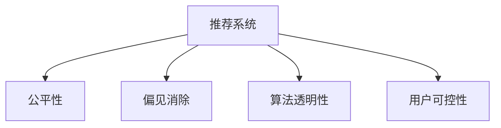

                 

# 推荐系统中的公平性与偏见消除

> 关键词：推荐系统,公平性,偏见消除,推荐算法,数据驱动

## 1. 背景介绍

### 1.1 问题由来

在数字化时代，推荐系统已经成为了互联网企业的核心竞争力。通过分析用户的历史行为数据，推荐系统能够精准地为用户推荐感兴趣的商品、内容等，极大地提升了用户体验和满意度。然而，随着推荐系统的广泛应用，人们逐渐发现系统推荐结果中的不公平和偏见问题，不仅会损害用户权益，还可能引发一系列的社会问题。

推荐系统中的不公平和偏见问题主要体现在两个方面：

1. **算法偏见**：推荐算法的设计、训练数据集存在偏见，导致模型在输出上表现出对某些群体的偏好或歧视。
2. **结果偏见**：推荐系统推荐的商品、内容等，反映了用户群体中的固有偏见，进一步加剧了社会的不公平现象。

这些问题引发了广泛的关注和讨论。为确保推荐系统公平、公正、透明，全球各大公司纷纷采取措施，从算法设计、数据治理、用户反馈等多个层面入手，以消除推荐系统中的偏见，促进公平性。

### 1.2 问题核心关键点

解决推荐系统中的公平性问题，首先需要明确以下几个关键点：

- **公平性**：推荐系统公平性指的是，无论用户的年龄、性别、种族、社会经济地位等，都能够获得同等质量和数量的推荐。
- **偏见消除**：推荐系统偏见消除指的是，识别和修正推荐算法和数据中存在的偏见，确保推荐结果对各类用户群体无歧视。
- **算法透明性**：推荐系统透明性指的是，能够清楚地解释推荐结果的生成逻辑，提高系统的可信度和用户满意度。
- **用户可控性**：推荐系统用户可控性指的是，用户能够自主调整推荐算法，控制推荐结果的公正性。

## 2. 核心概念与联系

### 2.1 核心概念概述

为了更好地理解推荐系统中的公平性与偏见消除，本节将介绍几个密切相关的核心概念：

- **推荐系统**：指基于用户历史行为数据，通过算法模型预测并推荐用户可能感兴趣的商品、内容等。
- **公平性**：指推荐系统在推荐过程中，不偏袒某个群体，不歧视某个群体。
- **偏见**：指推荐算法或数据集中存在的对某些群体的倾向性或歧视性。
- **算法透明性**：指推荐算法的生成逻辑、训练数据、参数设置等，能够被清楚解释和理解。
- **用户可控性**：指用户能够自主选择推荐算法，调整推荐结果，控制推荐的公正性。

这些核心概念之间的逻辑关系可以通过以下Mermaid流程图来展示：



这个流程图展示推荐系统中的核心概念及其之间的关系：

1. 推荐系统通过分析用户行为数据，推荐感兴趣的商品、内容等。
2. 公平性指的是推荐系统不偏袒任何群体，不歧视任何群体。
3. 偏见消除是通过算法和数据处理，识别并修正推荐系统中的偏见。
4. 算法透明性指的是推荐算法能够被清楚解释，用户能够理解其生成逻辑。
5. 用户可控性指的是用户能够自主选择推荐算法，调整推荐结果。

这些概念共同构成了推荐系统的公平性保障框架，使其能够在推荐过程中减少偏见，提升公平性。

## 3. 核心算法原理 & 具体操作步骤

### 3.1 算法原理概述

推荐系统中的公平性问题，核心在于识别和修正算法和数据中的偏见。基于此，推荐系统中的公平性消除，主要分为以下几个步骤：

1. **数据收集与清洗**：收集覆盖广泛用户群体的推荐数据，并对数据进行清洗，去除冗余和噪声。
2. **算法设计与训练**：设计和使用公平性友好的推荐算法，并对模型进行公平性约束。
3. **结果评估与调整**：使用公平性评估指标，评估推荐结果的公平性，并进行必要的调整。
4. **用户反馈与改进**：根据用户反馈，持续改进推荐算法和数据，提升公平性。

### 3.2 算法步骤详解

基于以上步骤，推荐系统中的公平性消除流程可以分为以下几个阶段：

**Step 1: 数据收集与清洗**

- 收集覆盖广泛用户群体的推荐数据，包括用户历史行为、商品属性、用户标签等。
- 清洗数据，去除缺失、错误、冗余数据，确保数据的质量和多样性。

**Step 2: 算法设计与训练**

- 设计和使用公平性友好的推荐算法，如公平性敏感的协同过滤、公平性意识的学习算法等。
- 在公平性约束下训练模型，使用公平性损失函数优化算法参数。

**Step 3: 结果评估与调整**

- 定义公平性评估指标，如平等性指标、多样性指标、代表性指标等。
- 使用这些指标评估推荐结果的公平性，找出存在偏见的部分。
- 根据评估结果，调整算法参数或重新设计模型，提升公平性。

**Step 4: 用户反馈与改进**

- 收集用户对推荐结果的反馈，了解偏见感知和满意度。
- 根据用户反馈，进一步优化推荐算法和数据，提升公平性。

### 3.3 算法优缺点

推荐系统中的公平性消除算法具有以下优点：

1. **提升公平性**：通过公平性约束和评估，显著提升推荐系统的公平性，减少偏见和歧视。
2. **增加多样性**：公平性友好的推荐算法，能够推荐更多样化的商品、内容，避免对特定群体的过度推荐。
3. **增强透明度**：通过公平性评估和算法透明性，提高用户对推荐系统的信任和满意度。
4. **提升用户体验**：通过消除偏见和提升多样性，使用户获得更加公平、公正的推荐服务。

同时，这些算法也存在一些局限性：

1. **计算复杂度高**：公平性友好的推荐算法，计算复杂度高，需要更多的计算资源和时间。
2. **模型训练难度大**：公平性约束和损失函数的引入，增加了模型训练的难度。
3. **数据质量要求高**：需要高质量、多样化的数据集，才能保证公平性消除的效果。
4. **用户可控性有限**：用户对推荐算法的可控性有限，难以完全自主调整推荐结果。

尽管存在这些局限性，但就目前而言，公平性消除算法仍是大规模推荐系统的有效手段。未来相关研究的重点在于如何进一步降低计算复杂度，提高模型训练效率，同时兼顾用户可控性和公平性。

### 3.4 算法应用领域

推荐系统中的公平性消除方法，已经在多个领域得到了广泛的应用，例如：

- 电商推荐：在电商平台上，通过公平性友好的推荐算法，推荐更多样化的商品给不同用户群体，减少性别、年龄、地域等方面的偏见。
- 内容推荐：在视频、音乐等娱乐平台，推荐更多元化的内容，避免对特定群体的推荐偏袒。
- 社交推荐：在社交网络中，推荐更加平衡的社交关系，避免对某些用户的过度推荐或忽略。
- 金融推荐：在金融理财平台，推荐更加公正的投资产品，避免对高风险人群的歧视。

除了上述这些领域外，公平性消除方法还将在更多场景中得到应用，如医疗推荐、教育推荐、政府服务等，为各个行业的数字化转型升级提供新的技术路径。

## 4. 数学模型和公式 & 详细讲解  
### 4.1 数学模型构建

本节将使用数学语言对推荐系统中的公平性与偏见消除进行更加严格的刻画。

记推荐系统为 $R$，用户集合为 $U$，商品集合为 $I$，用户历史行为为 $H_{u,i}$，推荐结果为 $R_{u,i}$。假设推荐系统中的偏见和歧视可以表示为一个向量 $\mathbf{b}$，其中 $b_k$ 表示对第 $k$ 个用户群体的偏见或歧视程度。

定义公平性损失函数为：

$$
L_{\text{fair}} = \sum_{u \in U} \sum_{i \in I} (b_u - R_{u,i})^2
$$

其中 $b_u$ 表示对用户 $u$ 的期望推荐，$R_{u,i}$ 表示对用户 $u$ 和商品 $i$ 的实际推荐结果。

### 4.2 公式推导过程

以下我们以协同过滤算法为例，推导公平性损失函数及其梯度的计算公式。

假设推荐系统使用协同过滤算法，用户 $u$ 和商品 $i$ 的协同过滤矩阵为 $C$，用户 $u$ 对商品 $i$ 的期望推荐 $b_u$ 表示为 $C_{u,i}$。则协同过滤算法的公平性损失函数为：

$$
L_{\text{fair}} = \sum_{u \in U} \sum_{i \in I} (C_{u,i} - R_{u,i})^2
$$

其中 $R_{u,i}$ 表示对用户 $u$ 和商品 $i$ 的实际推荐结果。

根据链式法则，公平性损失函数对协同过滤矩阵 $C$ 的梯度为：

$$
\frac{\partial L_{\text{fair}}}{\partial C} = -2 \sum_{u \in U} \sum_{i \in I} (C_{u,i} - R_{u,i}) \nabla_{C} C_{u,i}
$$

其中 $\nabla_{C} C_{u,i}$ 为协同过滤矩阵 $C$ 对协同过滤矩阵元素 $C_{u,i}$ 的梯度，可通过自动微分技术高效计算。

在得到公平性损失函数的梯度后，即可带入参数更新公式，完成模型的迭代优化。重复上述过程直至收敛，最终得到公平性友好的推荐矩阵 $C^*$。

## 5. 项目实践：代码实例和详细解释说明

### 5.1 开发环境搭建

在进行推荐系统公平性消除实践前，我们需要准备好开发环境。以下是使用Python进行推荐系统开发的环境配置流程：

1. 安装Anaconda：从官网下载并安装Anaconda，用于创建独立的Python环境。

2. 创建并激活虚拟环境：
```bash
conda create -n recommendation-env python=3.8 
conda activate recommendation-env
```

3. 安装推荐系统相关工具包：
```bash
pip install scipy pandas numpy scikit-learn pyspark
```

4. 安装PyTorch和TensorFlow：
```bash
pip install torch tensorflow
```

5. 安装推荐系统相关库：
```bash
pip install surprise fastFM lightfm recsys
```

完成上述步骤后，即可在`recommendation-env`环境中开始推荐系统公平性消除实践。

### 5.2 源代码详细实现

下面我们以协同过滤算法为例，给出使用PyTorch实现公平性友好的协同过滤算法的PyTorch代码实现。

首先，定义协同过滤算法：

```python
import torch
import torch.nn as nn
from surprise import Reader, Dataset
from surprise import KNNWithMeans

class FairCollaborativeFiltering(nn.Module):
    def __init__(self, num_users, num_items, num_factors):
        super().__init__()
        self.factors = nn.Embedding(num_users + num_items, num_factors)
        self.means = nn.Embedding(num_users + num_items, num_factors)
        self.bias = nn.Embedding(num_users + num_items, 1)
        
    def forward(self, u_i):
        u, i = u_i
        u_bias = self.bias(u)
        i_bias = self.bias(i)
        u_fact = self.factors(u)
        i_fact = self.factors(i)
        means = self.means(u) + self.means(i)
        bias = u_bias + i_bias
        pred = (u_fact * i_fact).sum(dim=1) + bias + means
        return pred
```

然后，定义公平性损失函数：

```python
import torch
import torch.nn as nn
import torch.optim as optim

class FairLoss(nn.Module):
    def __init__(self, mse_loss):
        super().__init__()
        self.mse_loss = mse_loss
        
    def forward(self, pred, target):
        return self.mse_loss(pred, target)
```

最后，训练公平性友好的协同过滤模型：

```python
# 加载数据集
reader = Reader(rating_scale=(1, 5))
data = Dataset.load_from_file('rating_data.txt', reader=reader)

# 划分训练集和测试集
trainset, testset = data.build_full_trainset().split_at(len(data))

# 定义模型和公平性损失函数
model = FairCollaborativeFiltering(num_users=len(trainset[u'uid'].unique()), 
                                  num_items=len(trainset[iid].unique()), 
                                  num_factors=64)
loss = nn.MSELoss()

# 定义优化器
optimizer = optim.Adam(model.parameters(), lr=0.001)

# 训练模型
for epoch in range(10):
    for u, i, r in trainset:
        pred = model(u_i)
        optimizer.zero_grad()
        loss_val = FairLoss(nn.MSELoss())(pred, r)
        loss_val.backward()
        optimizer.step()
    
    # 在测试集上评估公平性
    for u, i, r in testset:
        pred = model(u_i)
        loss_val = FairLoss(nn.MSELoss())(pred, r)
        print(f"Epoch {epoch+1}, test loss: {loss_val:.3f}")
```

以上就是使用PyTorch实现公平性友好的协同过滤算法的完整代码实现。可以看到，通过引入公平性损失函数，并在训练过程中最小化该损失函数，可以有效地提升推荐系统的公平性。

### 5.3 代码解读与分析

让我们再详细解读一下关键代码的实现细节：

**FairCollaborativeFiltering类**：
- `__init__`方法：初始化协同过滤矩阵、均值嵌入层和偏置嵌入层。
- `forward`方法：前向传播计算协同过滤矩阵的预测值。

**FairLoss类**：
- `__init__`方法：定义公平性损失函数，继承自PyTorch的nn.Module。
- `forward`方法：计算公平性损失函数，最小化预测值和真实值之间的均方误差。

**训练流程**：
- 加载数据集，使用Surprise库进行数据预处理。
- 定义协同过滤模型和公平性损失函数，并使用Adam优化器进行训练。
- 在每个epoch内，对训练集中的所有样本进行训练，并计算公平性损失。
- 在测试集上评估模型公平性，输出损失值。

可以看到，公平性友好的推荐系统开发，关键在于引入公平性损失函数，并在此基础上进行优化训练。通过不断调整模型参数，可以逐步提升推荐系统的公平性。

## 6. 实际应用场景

### 6.1 电商推荐

在电商平台上，推荐系统中的公平性问题尤为突出。不同性别的用户在商品推荐上存在显著差异，容易导致性别歧视。例如，某电商平台在推荐运动鞋时，往往更倾向于推荐男性用户喜欢的款式，而忽视女性用户的需求。通过引入公平性消除算法，电商平台可以显著改善推荐系统的公平性，推荐更多样化的商品，避免性别歧视。

具体而言，电商平台可以收集用户历史购物数据，进行数据清洗和预处理。在协同过滤模型的基础上，引入公平性损失函数，最小化性别偏见。通过不断训练和优化模型，使推荐系统能够更加公正地对待不同性别的用户，提升用户体验和满意度。

### 6.2 内容推荐

在视频、音乐等娱乐平台上，内容推荐系统的公平性问题同样值得关注。例如，某平台在推荐电影时，往往更倾向于推荐男性用户喜欢的动作片，而忽视女性用户对文艺片的偏好。通过公平性消除算法，娱乐平台可以确保推荐系统的公平性，推荐更多元化的内容，避免内容偏见。

具体而言，娱乐平台可以收集用户历史观看数据，进行数据清洗和预处理。在协同过滤或深度学习模型的基础上，引入公平性损失函数，最小化性别偏见。通过不断训练和优化模型，使推荐系统能够更加公正地对待不同性别的用户，提升内容推荐的公平性。

### 6.3 社交推荐

在社交网络中，推荐系统中的公平性问题同样不可忽视。例如，某社交平台在推荐好友时，往往更倾向于推荐与用户已有好友相似的用户，而忽视了不同群体之间的互动。通过公平性消除算法，社交平台可以确保推荐系统的公平性，推荐更加平衡的社交关系，避免社交偏见。

具体而言，社交平台可以收集用户好友关系和互动数据，进行数据清洗和预处理。在协同过滤或深度学习模型的基础上，引入公平性损失函数，最小化社交偏见。通过不断训练和优化模型，使推荐系统能够更加公正地对待不同群体的用户，提升社交推荐的公平性。

### 6.4 未来应用展望

随着推荐系统的广泛应用，公平性消除技术将在更多领域得到应用，为数字化转型升级提供新的技术路径。

在智慧城市治理中，推荐系统可以帮助城市管理者推荐更加均衡的服务设施，避免对某些群体的资源倾斜，促进公平和谐的社会治理。

在医疗健康领域，推荐系统可以推荐更加公平、公正的治疗方案，避免对某些群体的不公平对待，提升医疗服务的质量。

在金融理财领域，推荐系统可以推荐更加公正的投资产品，避免对高风险人群的歧视，促进金融市场的公平性。

此外，在教育、政府服务、媒体娱乐等多个领域，推荐系统中的公平性消除技术也将得到广泛应用，为社会公平和普惠服务提供新的解决方案。

## 7. 工具和资源推荐

### 7.1 学习资源推荐

为了帮助开发者系统掌握推荐系统中的公平性与偏见消除的理论基础和实践技巧，这里推荐一些优质的学习资源：

1. 《推荐系统:算法与实现》：斯坦福大学李宏毅教授的推荐系统课程，涵盖了推荐系统的基础算法和实践技巧。

2. 《推荐系统:理论与实践》：清华大学张俊林教授的推荐系统课程，深入讲解推荐系统的理论基础和应用场景。

3. 《推荐系统:算法与数据挖掘》：蒋岚等编著的书籍，系统介绍推荐系统的算法和数据挖掘技术。

4. 《推荐系统:技术与应用》：王晓江等编著的书籍，全面介绍了推荐系统的技术细节和应用案例。

5. arXiv和IEEE Xplore：这两个学术平台提供了大量推荐系统领域的学术论文，深入研究推荐系统的公平性问题。

通过对这些资源的学习实践，相信你一定能够快速掌握推荐系统中的公平性消除技术，并用于解决实际的推荐问题。

### 7.2 开发工具推荐

高效的开发离不开优秀的工具支持。以下是几款用于推荐系统开发的工具：

1. PyTorch和TensorFlow：这两个深度学习框架，支持高效的模型训练和优化，适用于推荐系统的开发。

2. Surprise：亚马逊开发的推荐系统开源工具包，支持多种推荐算法，提供丰富的评估指标。

3. LightFM：YouTube开发的推荐系统开源工具包，支持深度学习和协同过滤，适用于大规模推荐系统的开发。

4. FastFM：Facebook开发的推荐系统开源工具包，支持高效特征工程和稀疏矩阵计算，适用于推荐系统的高效优化。

5. RecSys：Recommender Systems的缩写，提供了丰富的推荐系统评估指标和可视化工具。

合理利用这些工具，可以显著提升推荐系统的开发效率，加快创新迭代的步伐。

### 7.3 相关论文推荐

推荐系统中的公平性消除技术，近年来得到了学界的广泛关注和研究。以下是几篇奠基性的相关论文，推荐阅读：

1. "Fairness in Recommendation: A Survey"（公平推荐：综述）：总结了推荐系统中公平性问题的研究现状和未来发展方向。

2. "Towards Fair and Transparent Recommendation Systems: A Survey"（公平透明推荐系统：综述）：深入讨论了推荐系统中的公平性和透明性问题。

3. "Bias Mitigation in Recommendation Systems: A Systematic Review"（推荐系统偏见消除：综述）：系统介绍了推荐系统中偏见消除的技术和实践。

4. "Algorithm-Agnostic Fairness"（算法无关的公平性）：提出了公平性友好的推荐算法，适用于不同的推荐系统框架。

5. "Fairness-aware Recommender Systems"（公平感知的推荐系统）：研究了在推荐系统中引入公平性约束的方法和效果。

这些论文代表了大规模推荐系统中的公平性消除技术的发展脉络。通过学习这些前沿成果，可以帮助研究者把握学科前进方向，激发更多的创新灵感。

## 8. 总结：未来发展趋势与挑战

### 8.1 总结

本文对推荐系统中的公平性与偏见消除问题进行了全面系统的介绍。首先阐述了推荐系统中的公平性和偏见消除的研究背景和意义，明确了公平性消除在提升推荐系统公正性、减少偏见和歧视方面的独特价值。其次，从原理到实践，详细讲解了公平性消除的数学原理和关键步骤，给出了公平性友好的推荐系统代码实现。同时，本文还广泛探讨了公平性消除方法在电商推荐、内容推荐、社交推荐等多个行业领域的应用前景，展示了公平性消除范式的广阔前景。最后，本文精选了公平性消除技术的各类学习资源，力求为读者提供全方位的技术指引。

通过本文的系统梳理，可以看到，公平性消除技术正在成为推荐系统的重要保障，极大地提升了推荐系统的公正性、透明性和可控性。未来，伴随推荐系统的广泛应用，公平性消除技术将在更多领域得到应用，为数字化转型升级提供新的技术路径。

### 8.2 未来发展趋势

展望未来，推荐系统中的公平性消除技术将呈现以下几个发展趋势：

1. **技术不断迭代**：随着推荐系统应用的深入，公平性消除技术将不断迭代优化，提高模型性能和公平性。

2. **算法多样化**：未来将涌现更多公平性友好的推荐算法，如公平性感知的学习算法、公平性敏感的协同过滤算法等，适应不同推荐系统需求。

3. **数据治理提升**：数据治理技术将得到更加广泛的应用，提升数据质量和多样性，进一步提高推荐系统的公平性。

4. **用户可控性增强**：推荐系统将提供更多的用户可控性，使用户能够自主选择推荐算法，调整推荐结果，提升公平性。

5. **跨平台协同**：不同平台和系统之间的协同推荐，将提高推荐系统的公平性和用户满意度。

6. **知识融合与推荐**：将外部知识库、逻辑规则等专家知识与推荐系统融合，提升推荐系统的公平性和多样性。

以上趋势凸显了公平性消除技术的广阔前景。这些方向的探索发展，必将进一步提升推荐系统的公平性，为用户带来更加公正、透明、可控的推荐服务。

### 8.3 面临的挑战

尽管公平性消除技术已经取得了显著进展，但在迈向更加智能化、普适化应用的过程中，它仍面临诸多挑战：

1. **数据质量问题**：推荐系统中的公平性消除，高度依赖高质量、多样化的数据集。然而，获取高质量数据集的成本和难度较大，限制了公平性消除技术的广泛应用。

2. **算法复杂性**：公平性消除算法计算复杂度高，需要更多的计算资源和时间，增加了系统开发的难度。

3. **模型训练难度大**：公平性约束和损失函数的引入，增加了模型训练的难度，需要更复杂的数据处理和优化技术。

4. **用户可控性有限**：用户对推荐算法的可控性有限，难以完全自主调整推荐结果，限制了公平性消除的效果。

5. **多模态融合困难**：推荐系统中的公平性消除，需要融合不同模态的数据，如文本、图像、语音等，增加了技术的复杂性。

尽管存在这些挑战，但通过持续的技术创新和优化，公平性消除技术仍有望在大规模推荐系统中得到广泛应用，提升推荐系统的公平性和用户满意度。

### 8.4 研究展望

面对推荐系统中的公平性消除面临的种种挑战，未来的研究需要在以下几个方面寻求新的突破：

1. **无监督与半监督公平性消除**：摆脱对大规模标注数据的依赖，利用自监督学习、主动学习等无监督和半监督范式，最大限度利用非结构化数据，实现更加灵活高效的公平性消除。

2. **模型压缩与加速**：开发更加参数高效和计算高效的公平性消除方法，减少模型训练的资源消耗，提高系统的性能和公平性。

3. **跨模态数据融合**：将文本、图像、语音等多模态信息与推荐系统融合，实现跨模态的公平性消除，提升推荐系统的多样性和公正性。

4. **分布式训练与推理**：引入分布式训练和推理技术，提高推荐系统的可扩展性和性能，适应大规模数据和用户需求。

5. **知识引导与推荐**：将符号化的先验知识，如知识图谱、逻辑规则等，与推荐系统融合，提升推荐系统的公平性和用户满意度。

6. **多平台协同推荐**：不同平台和系统之间的协同推荐，将提高推荐系统的公平性和用户满意度，推动推荐系统的广泛应用。

这些研究方向的探索，必将引领公平性消除技术迈向更高的台阶，为构建公平、透明、可控的智能推荐系统铺平道路。面向未来，公平性消除技术还需要与其他人工智能技术进行更深入的融合，如知识表示、因果推理、强化学习等，多路径协同发力，共同推动智能推荐系统的进步。只有勇于创新、敢于突破，才能不断拓展推荐系统的边界，让智能推荐更好地服务社会。

## 9. 附录：常见问题与解答

**Q1：推荐系统中的偏见来源有哪些？**

A: 推荐系统中的偏见主要来源于以下几个方面：

1. **训练数据偏见**：训练数据中存在的性别、种族、地域等方面的偏见，可能导致推荐结果也存在偏见。

2. **算法设计偏见**：推荐算法的设计中存在对某些群体的偏好或歧视，可能导致推荐结果不公平。

3. **用户行为偏见**：用户自身的偏好和行为可能存在偏见，导致推荐系统无法准确捕捉所有用户的兴趣。

4. **系统设计偏见**：推荐系统的设计和实现过程中可能存在隐性的偏见，导致推荐结果不公平。

了解偏见的来源，可以帮助我们更好地识别和消除偏见，提升推荐系统的公平性。

**Q2：如何识别推荐系统中的偏见？**

A: 识别推荐系统中的偏见，可以从以下几个方面入手：

1. **数据分布分析**：分析训练数据中各群体的分布情况，检查是否存在显著的偏差。

2. **模型输出分析**：分析推荐结果中各群体的分布情况，检查是否存在显著的偏见。

3. **用户反馈分析**：收集用户对推荐结果的反馈，了解用户对推荐系统的满意度。

4. **交叉验证分析**：使用交叉验证技术，检查推荐系统在不同数据集上的表现，检查是否存在显著的偏见。

通过以上方法，可以全面识别推荐系统中的偏见，为后续消除偏见提供基础。

**Q3：推荐系统中的公平性消除有哪些方法？**

A: 推荐系统中的公平性消除方法主要包括以下几种：

1. **协同过滤算法**：通过协同过滤算法，引入公平性损失函数，最小化推荐结果的性别偏见。

2. **深度学习算法**：使用深度学习算法，引入公平性约束，最小化推荐结果的性别偏见。

3. **数据增强方法**：通过数据增强技术，扩充训练集，减少数据偏见对推荐结果的影响。

4. **公平性友好的算法**：设计和使用公平性友好的推荐算法，如公平性感知的学习算法、公平性敏感的协同过滤算法等。

5. **用户可控性技术**：提供更多的用户可控性，使用户能够自主选择推荐算法，调整推荐结果，提升公平性。

通过以上方法，可以全面消除推荐系统中的偏见，提升推荐系统的公平性。

**Q4：推荐系统中的偏见消除有哪些应用场景？**

A: 推荐系统中的偏见消除方法，已经在多个领域得到了广泛的应用，例如：

1. **电商推荐**：在电商平台上，通过公平性友好的推荐算法，推荐更多样化的商品，避免性别歧视。

2. **内容推荐**：在视频、音乐等娱乐平台上，推荐更多元化的内容，避免内容偏见。

3. **社交推荐**：在社交网络中，推荐更加平衡的社交关系，避免社交偏见。

4. **医疗推荐**：在医疗健康领域，推荐更加公平、公正的治疗方案，避免对某些群体的不公平对待，提升医疗服务的质量。

5. **金融理财**：在金融理财领域，推荐更加公正的投资产品，避免对高风险人群的歧视，促进金融市场的公平性。

6. **政府服务**：在政府服务领域，推荐更加公平、公正的服务设施，避免对某些群体的资源倾斜，促进公平和谐的社会治理。

以上应用场景展示了推荐系统中的偏见消除技术，具有广泛的应用前景。

**Q5：推荐系统中的偏见消除有哪些挑战？**

A: 推荐系统中的偏见消除面临以下几个挑战：

1. **数据质量问题**：推荐系统中的公平性消除，高度依赖高质量、多样化的数据集。然而，获取高质量数据集的成本和难度较大，限制了公平性消除技术的广泛应用。

2. **算法复杂性**：公平性消除算法计算复杂度高，需要更多的计算资源和时间，增加了系统开发的难度。

3. **模型训练难度大**：公平性约束和损失函数的引入，增加了模型训练的难度，需要更复杂的数据处理和优化技术。

4. **用户可控性有限**：用户对推荐算法的可控性有限，难以完全自主调整推荐结果，限制了公平性消除的效果。

5. **多模态融合困难**：推荐系统中的公平性消除，需要融合不同模态的数据，如文本、图像、语音等，增加了技术的复杂性。

尽管存在这些挑战，但通过持续的技术创新和优化，公平性消除技术仍有望在大规模推荐系统中得到广泛应用，提升推荐系统的公平性和用户满意度。

**Q6：推荐系统中的偏见消除有哪些未来发展方向？**

A: 推荐系统中的偏见消除技术，未来可能朝着以下几个方向发展：

1. **无监督与半监督公平性消除**：摆脱对大规模标注数据的依赖，利用自监督学习、主动学习等无监督和半监督范式，最大限度利用非结构化数据，实现更加灵活高效的公平性消除。

2. **模型压缩与加速**：开发更加参数高效和计算高效的公平性消除方法，减少模型训练的资源消耗，提高系统的性能和公平性。

3. **跨模态数据融合**：将文本、图像、语音等多模态信息与推荐系统融合，实现跨模态的公平性消除，提升推荐系统的多样性和公正性。

4. **分布式训练与推理**：引入分布式训练和推理技术，提高推荐系统的可扩展性和性能，适应大规模数据和用户需求。

5. **知识引导与推荐**：将符号化的先验知识，如知识图谱、逻辑规则等，与推荐系统融合，提升推荐系统的公平性和用户满意度。

6. **多平台协同推荐**：不同平台和系统之间的协同推荐，将提高推荐系统的公平性和用户满意度，推动推荐系统的广泛应用。

这些方向展示了推荐系统中的偏见消除技术，具有广阔的发展前景。

---

作者：禅与计算机程序设计艺术 / Zen and the Art of Computer Programming

