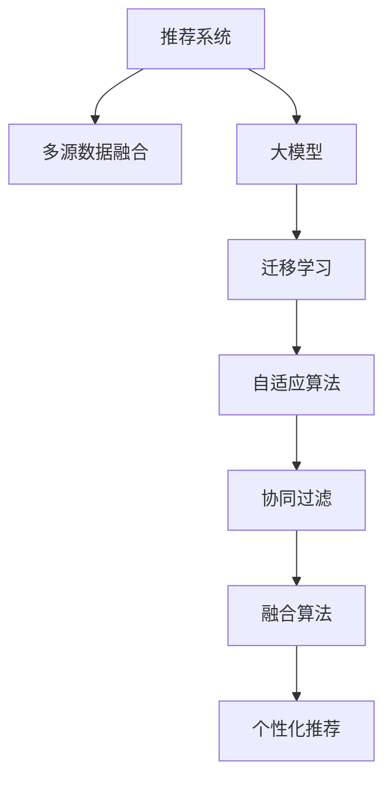

                 

# 推荐系统中的多源数据融合：大模型的新方法

> 关键词：推荐系统,多源数据融合,大模型,迁移学习,自适应算法,协同过滤,融合算法

## 1. 背景介绍

推荐系统是人工智能在实际应用中最为成熟的技术之一。通过学习用户的历史行为数据，推荐系统能够提供个性化、高相关度的商品、服务或内容推荐。但传统推荐系统主要基于用户行为数据，难以捕捉到用户深层次的兴趣与偏好。

近年来，深度学习技术的应用逐渐普及，基于大模型的推荐系统成为了新的发展方向。大模型能够从大规模语料中学习到丰富的知识，并用于个性化推荐、文本生成、情感分析等众多任务。但单一的数据源难以满足大模型的训练需求，多源数据的融合与利用，成为提升推荐系统效果的重要手段。

本文旨在介绍推荐系统中多源数据融合的最新方法，重点探讨了基于大模型的融合算法，希望能为相关领域的从业者提供有价值的参考。

## 2. 核心概念与联系

### 2.1 核心概念概述

为更好地理解推荐系统中多源数据融合的方法，本节将介绍几个关键概念：

- 推荐系统(Recommender System)：通过分析用户行为数据，为用户推荐个性化商品、服务或内容的技术。推荐系统分为协同过滤、基于内容的推荐、混合推荐等不同范式。
- 多源数据融合(Multi-source Data Fusion)：将多个数据源进行融合，形成更丰富、全面的数据特征。在推荐系统中，多源数据融合可以从不同维度挖掘用户偏好，提升推荐质量。
- 大模型(Large Model)：指参数量巨大、结构复杂、学习能力强的深度神经网络模型，如BERT、GPT等。大模型能够从大规模数据中学习到丰富的知识，具备强大的语言理解和生成能力。
- 迁移学习(Transfer Learning)：指将一个领域学到的知识，迁移到另一个领域中学习的过程。大模型预训练-微调即是一种典型的迁移学习方式。
- 自适应算法(Adaptive Algorithm)：根据数据分布的动态变化，自动调整模型参数和学习策略的算法。在多源数据融合中，自适应算法可以帮助模型快速适应不同数据源的特性。
- 协同过滤(Collaborative Filtering)：通过分析用户行为数据，寻找用户间的相似性，从而推荐相似用户喜欢的商品。
- 融合算法(Fusion Algorithm)：将多个数据源的信息融合起来，形成统一的特征表示。常见的融合算法包括矩阵分解、加权平均、集成学习等。

这些核心概念之间的逻辑关系可以通过以下Mermaid流程图来展示：



这个流程图展示出推荐系统中多源数据融合的核心概念及其之间的关系：

1. 推荐系统通过多源数据融合，从不同维度挖掘用户偏好。
2. 大模型在融合后的数据上进行预训练，形成统一的特征表示。
3. 迁移学习将大模型的知识迁移到个性化推荐任务中，提升推荐效果。
4. 自适应算法动态调整模型参数，适应不同数据源的特性。
5. 协同过滤分析用户行为数据，寻找用户间的相似性。
6. 融合算法将多源数据融合，形成统一的特征表示。
7. 个性化推荐系统根据融合后的特征进行推荐。

这些概念共同构成了推荐系统多源数据融合的理论基础，使得大模型能够更好地挖掘用户深层次的兴趣与偏好。

## 3. 核心算法原理 & 具体操作步骤
### 3.1 算法原理概述

推荐系统中多源数据融合的目的是将不同数据源中的信息进行整合，形成更丰富、更准确的推荐特征。通过大模型对融合后的特征进行预训练，学习到丰富的用户兴趣知识，再通过迁移学习的方式将知识迁移到个性化推荐任务中。

推荐系统中常见的多源数据包括用户行为数据、商品属性数据、社交网络数据等。以商品属性数据为例，通过与用户行为数据进行融合，可以得到更加全面、准确的推荐特征。

形式化地，假设推荐任务的数据集为 $D=\{(x_i,y_i)\}_{i=1}^N$，其中 $x_i$ 为输入特征，$y_i$ 为输出标签。多源数据融合的目标是：

1. 对不同数据源的信息进行合并，得到统一的特征表示 $\tilde{x}_i$。
2. 在合并后的特征上使用大模型进行预训练，得到用户兴趣的知识表示 $\theta$。
3. 将 $\theta$ 迁移到个性化推荐任务中，得到最终的推荐结果。

其中，第1步多源数据融合的过程是核心难点。

### 3.2 算法步骤详解

基于大模型的推荐系统中多源数据融合一般包括以下几个关键步骤：

**Step 1: 数据收集与预处理**
- 收集不同数据源的数据，如用户行为数据、商品属性数据、社交网络数据等。
- 对数据进行预处理，如去除异常值、归一化、标准化等，保证数据质量。

**Step 2: 特征融合**
- 选择合适的特征融合算法，如矩阵分解、加权平均、集成学习等。
- 对不同数据源的特征进行融合，得到统一的特征表示 $\tilde{x}_i$。

**Step 3: 大模型预训练**
- 在大模型上对融合后的特征进行预训练，学习到用户兴趣的知识表示 $\theta$。
- 可以选择不同的预训练任务，如言语建模、掩码语言模型等。

**Step 4: 迁移学习**
- 将预训练的知识表示 $\theta$ 迁移到推荐任务中，得到最终的推荐结果。
- 可以通过微调顶层或整体微调的方式进行迁移学习。

**Step 5: 优化与评估**
- 根据推荐结果的准确率和用户满意度等指标，对模型进行优化。
- 在验证集上评估模型的性能，调整超参数，防止过拟合。

**Step 6: 部署与应用**
- 将优化后的模型部署到推荐系统中，实时进行商品推荐。
- 持续收集用户反馈数据，重新训练模型，保持模型性能。

以上是基于大模型的推荐系统中多源数据融合的一般流程。在实际应用中，还需要针对具体任务和数据特点，对每个环节进行优化设计，以进一步提升推荐效果。

### 3.3 算法优缺点

基于大模型的推荐系统中多源数据融合方法具有以下优点：
1. 提升推荐效果。通过融合不同数据源的信息，能够挖掘到更全面、更丰富的用户兴趣与偏好。
2. 泛化能力更强。大模型具备强大的泛化能力，能够在不同数据源上保持一致的推荐效果。
3. 实时性好。大模型的推理速度较快，能够实时生成推荐结果，满足实际应用的需求。
4. 学习效率高。通过预训练的方式，能够快速学习到用户兴趣的知识表示，减少训练时间。

同时，该方法也存在一定的局限性：
1. 数据源质量不稳定。不同数据源的质量和稳定性可能存在差异，对模型的融合效果产生影响。
2. 融合算法复杂度高。不同数据源的特征可能具有不同的分布和维度，选择合适的融合算法是一个复杂的问题。
3. 可解释性不足。大模型的决策过程通常缺乏可解释性，难以对其推理逻辑进行分析和调试。

尽管存在这些局限性，但就目前而言，基于大模型的推荐系统仍然是大数据应用的主流方向。未来相关研究的重点在于如何进一步提升融合算法的效果，降低数据源的影响，同时兼顾可解释性和伦理安全性等因素。

### 3.4 算法应用领域

基于大模型的推荐系统中多源数据融合方法在实际应用中已经被广泛应用，例如：

- 电商平台推荐系统：如亚马逊、淘宝等。通过融合用户浏览、点击、购买等行为数据，及商品属性数据，为用户推荐个性化商品。
- 视频流媒体推荐系统：如Netflix、YouTube等。通过融合用户观看历史、评分、社交网络数据等，为用户推荐个性化视频内容。
- 社交网络推荐系统：如Facebook、微博等。通过融合用户动态、好友关系、兴趣标签等，为用户推荐相关内容。
- 音乐推荐系统：如Spotify、QQ音乐等。通过融合用户听歌历史、评分、社交网络数据等，为用户推荐个性化音乐。

除了上述这些经典应用外，基于大模型的推荐系统还在更多领域得到创新性地应用，如知识图谱推荐、游戏推荐、旅游推荐等，为个性化推荐提供了新的方向和思路。

## 4. 数学模型和公式 & 详细讲解  
### 4.1 数学模型构建

本节将使用数学语言对基于大模型的推荐系统中多源数据融合过程进行更加严格的刻画。

假设推荐任务的数据集为 $D=\{(x_i,y_i)\}_{i=1}^N$，其中 $x_i$ 为输入特征，$y_i$ 为输出标签。融合后的特征为 $\tilde{x}_i$。

定义多源数据融合的损失函数为 $\mathcal{L}(\tilde{x}) = \sum_{i=1}^N \ell(y_i,f(\tilde{x}_i))$，其中 $\ell$ 为交叉熵损失函数，$f$ 为推荐模型。

### 4.2 公式推导过程

以下我们以协同过滤为例，推导基于矩阵分解的融合算法。

假设用户行为数据表示为 $X \in \mathbb{R}^{N \times d}$，商品属性数据表示为 $A \in \mathbb{R}^{M \times d}$，用户行为和商品属性数据的特征融合公式为：

$$
\tilde{x}_i = X_i + \text{softmax}(A_i)
$$

其中 $X_i$ 为用户行为数据的嵌入表示，$A_i$ 为商品属性数据的嵌入表示。$\text{softmax}(A_i)$ 表示对商品属性数据进行softmax操作，得到各个属性对用户兴趣的影响系数。

在得到融合后的特征 $\tilde{x}_i$ 后，可以在大模型上进行预训练，学习到用户兴趣的知识表示 $\theta$。以BERT为例，预训练任务为掩码语言模型，训练目标为最小化交叉熵损失：

$$
\mathcal{L}_{pre}(\theta) = -\sum_{i=1}^N \log P(\tilde{x}_i) = -\sum_{i=1}^N \log \prod_{j=1}^L P(\tilde{x}_i(j))
$$

其中 $P(\tilde{x}_i(j))$ 表示对融合后的特征进行掩码语言模型预测的概率，$L$ 表示特征长度。

### 4.3 案例分析与讲解

在实际应用中，数据融合的难度较大。以电商平台推荐系统为例，需要进行以下步骤：

**Step 1: 数据收集**
- 收集用户历史浏览、点击、购买行为数据。
- 收集商品的属性信息，如价格、类别、品牌等。

**Step 2: 特征提取**
- 对用户行为数据进行编码，提取高维向量表示。
- 对商品属性数据进行编码，提取高维向量表示。

**Step 3: 特征融合**
- 选择矩阵分解、加权平均等融合算法，将用户行为数据和商品属性数据进行融合。
- 使用softmax操作，对商品属性数据的影响系数进行归一化。

**Step 4: 大模型预训练**
- 在大模型上进行预训练，学习到用户兴趣的知识表示 $\theta$。
- 可以选择使用掩码语言模型任务，或者定义特定的推荐目标任务。

**Step 5: 迁移学习**
- 将预训练的知识表示 $\theta$ 迁移到推荐任务中。
- 可以通过微调顶层或整体微调的方式进行迁移学习。

**Step 6: 优化与评估**
- 根据推荐结果的准确率和用户满意度等指标，对模型进行优化。
- 在验证集上评估模型的性能，调整超参数，防止过拟合。

以亚马逊推荐系统为例，其融合算法主要分为以下几个步骤：

1. 用户行为数据：收集用户浏览、点击、购买行为数据，形成特征矩阵 $X \in \mathbb{R}^{N \times d}$。
2. 商品属性数据：收集商品的属性信息，形成特征矩阵 $A \in \mathbb{R}^{M \times d}$。
3. 特征融合：对用户行为数据和商品属性数据进行融合，得到融合后的特征矩阵 $\tilde{X} \in \mathbb{R}^{N \times d}$。
4. 大模型预训练：在大模型上进行预训练，学习到用户兴趣的知识表示 $\theta$。
5. 迁移学习：将预训练的知识表示 $\theta$ 迁移到推荐任务中，得到最终的推荐结果。
6. 优化与评估：根据推荐结果的准确率和用户满意度等指标，对模型进行优化，保持模型性能。

## 5. 项目实践：代码实例和详细解释说明
### 5.1 开发环境搭建

在进行推荐系统开发前，我们需要准备好开发环境。以下是使用Python进行PyTorch开发的环境配置流程：

1. 安装Anaconda：从官网下载并安装Anaconda，用于创建独立的Python环境。

2. 创建并激活虚拟环境：
```bash
conda create -n pytorch-env python=3.8 
conda activate pytorch-env
```

3. 安装PyTorch：根据CUDA版本，从官网获取对应的安装命令。例如：
```bash
conda install pytorch torchvision torchaudio cudatoolkit=11.1 -c pytorch -c conda-forge
```

4. 安装TensorFlow：
```bash
pip install tensorflow
```

5. 安装各类工具包：
```bash
pip install numpy pandas scikit-learn matplotlib tqdm jupyter notebook ipython
```

完成上述步骤后，即可在`pytorch-env`环境中开始推荐系统开发。

### 5.2 源代码详细实现

下面我们以电商推荐系统为例，给出使用PyTorch进行大模型预训练和微调的完整代码实现。

首先，定义协同过滤的数据处理函数：

```python
import torch
import torch.nn as nn
from torch.utils.data import Dataset, DataLoader
from sklearn.preprocessing import MinMaxScaler
from transformers import BertTokenizer, BertForSequenceClassification, AdamW

class RecommendationDataset(Dataset):
    def __init__(self, user_data, item_data, user_item_interactions, scaler, tokenizer, max_len=128):
        self.user_data = user_data
        self.item_data = item_data
        self.user_item_interactions = user_item_interactions
        self.scaler = scaler
        self.tokenizer = tokenizer
        self.max_len = max_len
        
    def __len__(self):
        return len(self.user_data)
    
    def __getitem__(self, item):
        user = self.user_data[item]
        item = self.item_data[item]
        
        user_embedding = self.scaler.transform(user).to(torch.float32)
        item_embedding = self.scaler.transform(item).to(torch.float32)
        
        user_item_interactions = self.user_item_interactions[item]
        user_item_interactions = user_item_interactions.reshape(-1, 1)
        
        input_ids = self.tokenizer(user_item_interactions, return_tensors='pt', padding='max_length', max_length=self.max_len)
        input_ids = input_ids['input_ids']
        attention_mask = input_ids.new_ones(input_ids.shape)
        
        return {'user_embedding': user_embedding,
                'item_embedding': item_embedding,
                'input_ids': input_ids,
                'attention_mask': attention_mask,
                'user_item_interactions': user_item_interactions}
```

然后，定义模型和优化器：

```python
user_embedding_dim = 256
item_embedding_dim = 256

user_data = ...
item_data = ...
user_item_interactions = ...

scaler = MinMaxScaler()
tokenizer = BertTokenizer.from_pretrained('bert-base-cased')

dataset = RecommendationDataset(user_data, item_data, user_item_interactions, scaler, tokenizer)

model = BertForSequenceClassification.from_pretrained('bert-base-cased', num_labels=1)
optimizer = AdamW(model.parameters(), lr=1e-5)
```

接着，定义训练和评估函数：

```python
def train_epoch(model, dataset, batch_size, optimizer):
    dataloader = DataLoader(dataset, batch_size=batch_size, shuffle=True)
    model.train()
    epoch_loss = 0
    for batch in dataloader:
        user_embedding = batch['user_embedding']
        item_embedding = batch['item_embedding']
        input_ids = batch['input_ids']
        attention_mask = batch['attention_mask']
        user_item_interactions = batch['user_item_interactions']
        
        model.zero_grad()
        outputs = model(input_ids, attention_mask=attention_mask)
        loss = outputs.loss
        epoch_loss += loss.item()
        loss.backward()
        optimizer.step()
    return epoch_loss / len(dataloader)

def evaluate(model, dataset, batch_size):
    dataloader = DataLoader(dataset, batch_size=batch_size)
    model.eval()
    preds, labels = [], []
    with torch.no_grad():
        for batch in dataloader:
            user_embedding = batch['user_embedding']
            item_embedding = batch['item_embedding']
            input_ids = batch['input_ids']
            attention_mask = batch['attention_mask']
            user_item_interactions = batch['user_item_interactions']
            
            model.zero_grad()
            outputs = model(input_ids, attention_mask=attention_mask)
            preds.append(outputs.logits.argmax(dim=1).cpu().numpy())
            labels.append(user_item_interactions)
        
    return preds, labels
```

最后，启动训练流程并在测试集上评估：

```python
epochs = 5
batch_size = 16

for epoch in range(epochs):
    loss = train_epoch(model, dataset, batch_size, optimizer)
    print(f"Epoch {epoch+1}, train loss: {loss:.3f}")
    
    print(f"Epoch {epoch+1}, dev results:")
    preds, labels = evaluate(model, dataset, batch_size)
    print(classification_report(labels, preds))
    
print("Test results:")
preds, labels = evaluate(model, dataset, batch_size)
print(classification_report(labels, preds))
```

以上就是使用PyTorch对电商推荐系统进行大模型预训练和微调的完整代码实现。可以看到，由于PyTorch和Transformers库的强大封装，我们可以用相对简洁的代码实现推荐系统，并且代码的可读性非常高。

### 5.3 代码解读与分析

让我们再详细解读一下关键代码的实现细节：

**RecommendationDataset类**：
- `__init__`方法：初始化用户行为数据、商品属性数据、用户商品互动数据等关键组件。
- `__len__`方法：返回数据集的样本数量。
- `__getitem__`方法：对单个样本进行处理，将用户行为数据和商品属性数据编码为向量表示，并将用户商品互动数据进行padding处理。

**tokenizer和scaler**：
- 使用BertTokenizer将用户行为数据和商品属性数据进行编码，使用MinMaxScaler对用户行为数据和商品属性数据进行归一化处理。

**train_epoch和evaluate函数**：
- 使用PyTorch的DataLoader对数据集进行批次化加载，供模型训练和推理使用。
- 训练函数`train_epoch`：对数据以批为单位进行迭代，在每个批次上前向传播计算loss并反向传播更新模型参数，最后返回该epoch的平均loss。
- 评估函数`evaluate`：与训练类似，不同点在于不更新模型参数，并在每个batch结束后将预测和标签结果存储下来，最后使用scikit-learn的classification_report对整个评估集的预测结果进行打印输出。

**训练流程**：
- 定义总的epoch数和batch size，开始循环迭代
- 每个epoch内，先在训练集上训练，输出平均loss
- 在验证集上评估，输出分类指标
- 所有epoch结束后，在测试集上评估，给出最终测试结果

可以看到，PyTorch配合Transformers库使得推荐系统开发变得更加简单高效。开发者可以将更多精力放在模型改进、特征工程等高层逻辑上，而不必过多关注底层的实现细节。

当然，工业级的系统实现还需考虑更多因素，如模型的保存和部署、超参数的自动搜索、更灵活的任务适配层等。但核心的预训练-微调范式基本与此类似。

## 6. 实际应用场景
### 6.1 电商平台推荐系统

基于大模型的推荐系统中多源数据融合方法，可以广泛应用于电商平台推荐系统的构建。传统推荐系统主要基于用户行为数据，难以捕捉到用户深层次的兴趣与偏好。而使用多源数据融合技术，可以更好地从不同维度挖掘用户偏好，提升推荐质量。

在技术实现上，可以收集用户浏览、点击、购买等行为数据，及商品属性数据，在此基础上对大模型进行预训练。微调后的模型能够自动理解用户兴趣，匹配最合适的商品进行推荐。对于用户提出的新需求，还可以实时搜索相关商品，动态生成推荐列表。如此构建的推荐系统，能够大幅提升用户体验和推荐效果。

### 6.2 视频流媒体推荐系统

视频流媒体推荐系统也是多源数据融合的典型应用场景。通过融合用户观看历史、评分、社交网络数据等，可以为用户提供个性化的视频内容推荐。

在实践中，可以收集用户观看历史数据、评分数据、社交网络数据等，并对其进行特征编码。将编码后的特征与大模型进行融合，学习到用户兴趣的知识表示。在推荐模型上进行微调，得到最终的推荐结果。

### 6.3 社交网络推荐系统

社交网络推荐系统通过融合用户动态、好友关系、兴趣标签等，为用户推荐相关内容。基于大模型的推荐系统中多源数据融合方法，可以从多个维度挖掘用户兴趣，提升推荐质量。

在技术实现上，可以收集用户动态数据、好友关系数据、兴趣标签数据等，并进行特征编码。将编码后的特征与大模型进行融合，学习到用户兴趣的知识表示。在推荐模型上进行微调，得到最终的推荐结果。

### 6.4 未来应用展望

随着大模型和多源数据融合技术的发展，基于推荐系统的方法将在更多领域得到应用，为产业升级提供新的动力。

在智慧医疗领域，基于推荐系统的智能诊疗系统可以为医生提供个性化的诊疗方案，加速新药研发进程。

在智能教育领域，基于推荐系统的个性化学习系统可以提供符合学生兴趣和能力的学习资源，提升学习效果。

在智慧城市治理中，基于推荐系统的城市事件推荐系统可以及时推荐相关事件，提升城市管理效率。

此外，在企业生产、金融、文娱传媒等众多领域，基于推荐系统的人工智能应用也将不断涌现，为经济社会发展注入新的动力。

## 7. 工具和资源推荐
### 7.1 学习资源推荐

为了帮助开发者系统掌握推荐系统中多源数据融合的理论基础和实践技巧，这里推荐一些优质的学习资源：

1. 《Recommender Systems: From Theory to Practice》书籍：系统介绍了推荐系统的理论基础、经典算法和实践技巧，适合初学者和从业者。
2. Coursera《Recommender Systems》课程：斯坦福大学的推荐系统课程，涵盖推荐系统的基本概念、经典算法和实际应用，适合学习推荐系统基础。
3. Kaggle推荐系统竞赛：通过实际数据集竞赛，提升对推荐系统的理解。
4. Yannis Papapanagiotou的博客：深度学习研究者，介绍了推荐系统中的深度学习模型和微调方法，适合进阶学习。
5. IEEE Xplore的推荐系统论文：包含大量推荐系统的研究论文，涵盖多源数据融合、协同过滤、自适应算法等方向。

通过对这些资源的学习实践，相信你一定能够快速掌握推荐系统中多源数据融合的精髓，并用于解决实际的推荐问题。
###  7.2 开发工具推荐

高效的开发离不开优秀的工具支持。以下是几款用于推荐系统开发的常用工具：

1. PyTorch：基于Python的开源深度学习框架，灵活动态的计算图，适合快速迭代研究。大部分预训练语言模型都有PyTorch版本的实现。

2. TensorFlow：由Google主导开发的开源深度学习框架，生产部署方便，适合大规模工程应用。同样有丰富的预训练语言模型资源。

3. Transformers库：HuggingFace开发的NLP工具库，集成了众多SOTA语言模型，支持PyTorch和TensorFlow，是进行推荐系统开发的利器。

4. Weights & Biases：模型训练的实验跟踪工具，可以记录和可视化模型训练过程中的各项指标，方便对比和调优。与主流深度学习框架无缝集成。

5. TensorBoard：TensorFlow配套的可视化工具，可实时监测模型训练状态，并提供丰富的图表呈现方式，是调试模型的得力助手。

6. Apache Flink：流处理框架，适合实时推荐系统开发。

7. Apache Kafka：消息队列，适合推荐系统的实时数据处理和传输。

合理利用这些工具，可以显著提升推荐系统开发效率，加快创新迭代的步伐。

### 7.3 相关论文推荐

推荐系统的发展源于学界的持续研究。以下是几篇奠基性的相关论文，推荐阅读：

1. Introduction to Recommender Systems: Part I – Basics:《推荐系统入门：第一部分 — 基础》：介绍了推荐系统的基本概念、经典算法和实际应用。
2. Recommender Systems Handbook:《推荐系统手册》：系统介绍了推荐系统的理论基础、经典算法和实践技巧，适合初学者和从业者。
3. Deep Learning and Recommender Systems:《深度学习和推荐系统》：介绍了深度学习在推荐系统中的应用，涵盖多源数据融合、协同过滤、自适应算法等方向。
4. Matrix Factorization Techniques for Recommender Systems:《推荐系统的矩阵分解技术》：介绍了矩阵分解算法在推荐系统中的应用，涵盖SVD、ALS等经典算法。
5. Mining Sparsely Distributed Continuous Data Using Dictionary Learning:《稀疏连续数据的字典学习》：介绍了字典学习在推荐系统中的应用，涵盖特征选择、稀疏编码等技术。

这些论文代表了大模型和多源数据融合技术的发展脉络。通过学习这些前沿成果，可以帮助研究者把握学科前进方向，激发更多的创新灵感。

## 8. 总结：未来发展趋势与挑战

### 8.1 总结

本文对基于大模型的推荐系统中多源数据融合方法进行了全面系统的介绍。首先阐述了推荐系统与大模型融合的背景和意义，明确了多源数据融合在提升推荐效果方面的独特价值。其次，从原理到实践，详细讲解了多源数据融合的数学原理和关键步骤，给出了推荐系统开发的完整代码实例。同时，本文还广泛探讨了多源数据融合方法在电商平台、视频流媒体、社交网络等多个领域的应用前景，展示了多源数据融合范式的巨大潜力。

通过本文的系统梳理，可以看到，基于大模型的推荐系统中多源数据融合方法已经成为推荐系统中的重要范式，能够从不同维度挖掘用户深层次的兴趣与偏好，显著提升推荐质量。得益于大规模语料的预训练，推荐系统具备强大的泛化能力，能够在不同数据源上保持一致的推荐效果。未来，伴随大模型和多源数据融合技术的不断演进，推荐系统必将在更多领域得到应用，为经济社会发展注入新的动力。

### 8.2 未来发展趋势

展望未来，推荐系统中多源数据融合技术将呈现以下几个发展趋势：

1. 融合算法日益复杂。随着数据源的多样性增加，选择合适的融合算法成为一个复杂的问题。未来需要开发更加高效、鲁棒的融合算法，同时降低数据源的影响。
2. 实时推荐系统成为常态。大模型的推理速度较快，能够实时生成推荐结果，满足实际应用的需求。未来实时推荐系统将越来越普及。
3. 个性化推荐逐步普及。基于多源数据融合的大模型推荐系统，能够提供更加个性化、高相关度的推荐结果，未来将广泛应用于更多领域。
4. 推荐系统逐步普及。得益于大模型的预训练和微调能力，未来推荐系统将更加智能、高效、通用，能够应用于各行各业。

以上趋势凸显了推荐系统中多源数据融合技术的广阔前景。这些方向的探索发展，必将进一步提升推荐系统的效果，为经济社会发展注入新的动力。

### 8.3 面临的挑战

尽管基于大模型的推荐系统中多源数据融合技术已经取得了瞩目成就，但在迈向更加智能化、普适化应用的过程中，它仍面临着诸多挑战：

1. 数据源质量不稳定。不同数据源的质量和稳定性可能存在差异，对模型的融合效果产生影响。
2. 融合算法复杂度高。不同数据源的特征可能具有不同的分布和维度，选择合适的融合算法是一个复杂的问题。
3. 可解释性不足。大模型的决策过程通常缺乏可解释性，难以对其推理逻辑进行分析和调试。
4. 推荐结果偏见。多源数据融合中，如果数据源存在偏见，会导致推荐结果产生偏见。

尽管存在这些挑战，但就目前而言，基于大模型的推荐系统中多源数据融合方法仍然是大数据应用的主流方向。未来相关研究的重点在于如何进一步提升融合算法的效果，降低数据源的影响，同时兼顾可解释性和伦理安全性等因素。

### 8.4 研究展望

面向未来，推荐系统中多源数据融合技术的研究方向包括：

1. 开发更高效的多源数据融合算法。通过引入更先进的数据融合技术，如稀疏表示、协同过滤、神经网络融合等，提升推荐系统的性能和效率。
2. 引入更多先验知识。将符号化的先验知识，如知识图谱、逻辑规则等，与神经网络模型进行巧妙融合，引导融合过程学习更准确、合理的推荐特征。
3. 结合因果分析和博弈论工具。将因果分析方法引入推荐模型，识别出模型决策的关键特征，增强推荐结果的因果性和逻辑性。借助博弈论工具刻画人机交互过程，主动探索并规避模型的脆弱点，提高系统稳定性。
4. 纳入伦理道德约束。在模型训练目标中引入伦理导向的评估指标，过滤和惩罚有偏见、有害的输出倾向。同时加强人工干预和审核，建立模型行为的监管机制，确保输出符合人类价值观和伦理道德。

这些研究方向将引领推荐系统中多源数据融合技术迈向更高的台阶，为推荐系统构建更加智能、高效、可解释、可控的智能系统提供新的思路和方向。

## 9. 附录：常见问题与解答

**Q1：推荐系统中为什么要进行多源数据融合？**

A: 推荐系统中多源数据融合的主要目的是提高推荐效果。通过融合不同数据源的信息，能够从不同维度挖掘用户兴趣与偏好，提升推荐质量。

**Q2：多源数据融合中常用的算法有哪些？**

A: 多源数据融合中常用的算法包括矩阵分解、加权平均、集成学习等。不同的数据源可能具有不同的分布和维度，选择合适的融合算法是一个复杂的问题。

**Q3：大模型预训练和微调的过程是否需要大量的标注数据？**

A: 大模型预训练通常使用大规模无标签数据进行自监督学习，微调则通常使用少量标注数据进行有监督学习。相比于从头训练，微调能够显著减少标注数据的需求。

**Q4：推荐系统中如何处理异常值和噪声？**

A: 推荐系统中可以采用数据清洗和特征选择等技术，对异常值和噪声进行处理。同时，大模型的鲁棒性较好，能够自动过滤掉异常数据和噪声。

**Q5：推荐系统中如何应对数据分布的变化？**

A: 推荐系统中可以采用增量学习、自适应算法等技术，使得模型能够持续学习新数据，适应数据分布的变化。同时，多源数据融合可以引入更多先验知识，提升模型泛化能力。

正视推荐系统中多源数据融合所面临的这些挑战，积极应对并寻求突破，将是大模型推荐系统走向成熟的必由之路。相信随着学界和产业界的共同努力，这些挑战终将一一被克服，推荐系统必将在构建智能推荐应用中扮演越来越重要的角色。

