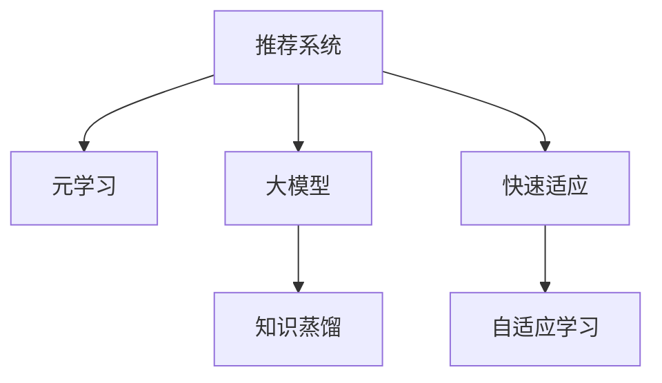

                 

## 1. 背景介绍

在当今的信息爆炸时代，推荐系统成为了用户获取信息的重要途径，但其推荐效果和用户体验直接影响了电商、新闻、视频等多个领域的应用效果。传统的基于协同过滤和矩阵分解的推荐系统方法，依赖用户历史行为数据，难以捕捉到用户动态兴趣的变化，无法应对新用户和冷启动场景。此外，由于数据量不断增长，推荐系统需要处理的计算规模也越来越大，面临着如何在大规模数据中高效学习新知识，快速适应用户兴趣变化的挑战。

近年来，随着深度学习技术的发展，基于深度神经网络的推荐系统逐渐取代传统方法，取得了更好的效果。特别是大模型元学习技术，通过在大规模数据上进行训练，学习到通用的知识表示，并在新用户和新任务上实现快速适应，有效解决了推荐系统面临的数据冷启动和快速更新的问题。本文将系统地介绍推荐系统中的大模型元学习与快速适应技术，深入分析其算法原理和操作步骤，并给出实际应用场景和未来发展趋势。

## 2. 核心概念与联系

### 2.1 核心概念概述

为更好地理解推荐系统中的大模型元学习与快速适应技术，本节将介绍几个密切相关的核心概念：

- 推荐系统(Recommender System)：利用用户的历史行为数据和物品属性，通过建模推荐用户可能感兴趣的物品的系统。
- 元学习(Meta-Learning)：学习如何学习，即学习能够在不同任务和数据集上快速适应的学习策略，旨在提升学习效率和效果。
- 大模型(Large Model)：通过大规模数据训练得到的深度神经网络模型，具备强大的表达能力和泛化能力。
- 知识蒸馏(Knowledge Distillation)：利用预训练模型的知识，通过蒸馏到轻量化模型，实现快速适应的技术。
- 快速适应(Fast Adaptation)：在已有知识的基础上，快速适应新任务或新用户，提升推荐系统的实时性和准确性。
- 自适应学习(Adaptive Learning)：通过动态调整模型参数和学习策略，使模型能更好地适应用户行为和兴趣变化。

这些核心概念之间的逻辑关系可以通过以下Mermaid流程图来展示：



这个流程图展示了大模型元学习与快速适应技术的核心概念及其之间的关系：

1. 推荐系统通过元学习获取通用的知识表示，用于预训练大模型。
2. 大模型通过知识蒸馏获得轻量化模型，快速适应新任务。
3. 快速适应技术使得模型能够在新用户和新任务上快速收敛，提升推荐效果。
4. 自适应学习通过动态调整学习策略，进一步提升模型的泛化能力和实时性。

这些核心概念共同构成了推荐系统中的大模型元学习与快速适应技术框架，使其能够在大规模数据中高效学习新知识，快速适应用户行为变化，从而提升推荐系统的性能。

## 3. 核心算法原理 & 具体操作步骤
### 3.1 算法原理概述

推荐系统中的大模型元学习与快速适应技术，通过在大规模数据上预训练大模型，学习到通用的知识表示。然后，通过知识蒸馏等方法，将大模型转化为轻量化模型，以高效适应新任务和新用户。最终，利用自适应学习技术，动态调整模型参数，进一步提升推荐系统的实时性和准确性。

具体而言，推荐系统中的大模型元学习与快速适应流程包括以下几个关键步骤：

- 预训练大模型：在大规模数据上训练大模型，学习到通用的知识表示。
- 知识蒸馏：将大模型的知识蒸馏到轻量化模型，实现快速适应。
- 微调和优化：通过微调轻量化模型，进一步提升模型在新任务和新用户上的表现。
- 自适应学习：利用在线学习技术，动态调整模型参数和学习策略，提升实时性。

### 3.2 算法步骤详解

以下详细介绍推荐系统中的大模型元学习与快速适应技术的各个步骤：

**Step 1: 数据准备和预训练**

1. 收集和清洗推荐系统所需的大规模数据，包括用户历史行为、物品属性等信息。
2. 将数据划分为训练集、验证集和测试集。
3. 在大规模数据上，训练一个深度神经网络大模型，学习到通用的知识表示。

**Step 2: 知识蒸馏**

1. 在预训练大模型的基础上，使用知识蒸馏技术，将大模型的知识转移到轻量化模型中。
2. 通常使用大模型的中间层或顶层作为教师模型，通过软标签、硬标签或特征对齐等方式，将知识传递给学生模型。
3. 学生模型可以是其他架构简单的模型，如线性模型、小规模神经网络等。

**Step 3: 微调和优化**

1. 在轻量化模型上，使用目标任务的标注数据进行微调，优化模型参数。
2. 根据推荐系统的特点，设计合适的损失函数，如交叉熵损失、均方误差损失等。
3. 应用正则化技术、梯度累积等优化策略，防止模型过拟合。

**Step 4: 自适应学习**

1. 利用在线学习技术，根据实时数据动态调整模型参数。
2. 在每次接收新数据时，通过在线学习算法更新模型参数，实现快速适应新用户和新任务。
3. 常见的在线学习算法包括梯度下降、Adagrad、Adam等。

### 3.3 算法优缺点

推荐系统中的大模型元学习与快速适应技术具有以下优点：

1. 通用性强：通过在大规模数据上预训练大模型，能够学习到通用的知识表示，适用于多种推荐任务。
2. 快速适应：通过知识蒸馏和微调，快速适应新任务和新用户，提升推荐系统实时性。
3. 泛化能力强：通过自适应学习技术，动态调整模型参数，提升模型的泛化能力。
4. 计算高效：利用知识蒸馏和轻量化模型，减少计算资源消耗，提高计算效率。

同时，该方法也存在一定的局限性：

1. 数据依赖性强：推荐系统的效果高度依赖于数据的质量和多样性。
2. 模型复杂度高：预训练大模型和知识蒸馏技术，增加了模型的复杂度，需要更多的计算资源。
3. 自适应过程复杂：在线学习过程需要实时更新模型参数，容易受噪声干扰，可能导致模型不稳定。
4. 对抗攻击敏感：由于模型的通用性，容易受到对抗攻击，影响推荐效果。

尽管存在这些局限性，但就目前而言，基于大模型的元学习与快速适应技术仍是大规模推荐系统的重要范式。未来相关研究的重点在于如何进一步降低数据依赖，提高自适应过程的鲁棒性，以及增强模型的对抗攻击防御能力。

### 3.4 算法应用领域

推荐系统中的大模型元学习与快速适应技术，已经在电商、新闻、视频等多个领域得到了广泛应用，并取得了显著的效果。

- 电商推荐：在电商平台上，通过分析用户历史购买行为，推荐可能感兴趣的物品，提高用户满意度。
- 新闻推荐：在新闻平台上，根据用户阅读历史和兴趣，推荐相关新闻，提升用户粘性。
- 视频推荐：在视频平台上，通过分析用户观看历史和评分，推荐相关视频，增加用户留存率。
- 音乐推荐：在音乐平台上，根据用户听歌历史和偏好，推荐相似音乐，提高用户体验。

此外，大模型元学习与快速适应技术也被创新性地应用到更多场景中，如个性化推荐系统、智能搜索系统、内容生成系统等，为推荐系统带来了全新的突破。随着预训练语言模型和微调方法的不断进步，相信推荐系统必将在更广阔的应用领域大放异彩。

## 4. 数学模型和公式 & 详细讲解
### 4.1 数学模型构建

推荐系统中的大模型元学习与快速适应技术，可以通过数学模型进行严格刻画。

记推荐系统的大模型为 $M_{\theta}:\mathcal{X} \rightarrow \mathcal{Y}$，其中 $\mathcal{X}$ 为输入空间，$\mathcal{Y}$ 为输出空间，$\theta \in \mathbb{R}^d$ 为模型参数。假设推荐系统中的训练集为 $D=\{(x_i,y_i)\}_{i=1}^N$，其中 $x_i$ 为输入数据，$y_i$ 为对应的输出标签。

推荐系统的目标是最小化损失函数：

$$
\mathcal{L}(\theta) = \frac{1}{N} \sum_{i=1}^N \ell(M_{\theta}(x_i),y_i)
$$

其中 $\ell$ 为损失函数，用于衡量模型预测输出与真实标签之间的差异。常见的损失函数包括交叉熵损失、均方误差损失等。

### 4.2 公式推导过程

以下我们以电商推荐任务为例，推导交叉熵损失函数及其梯度的计算公式。

假设推荐系统的大模型为 $M_{\theta}$，输入数据为 $x_i$，输出标签为 $y_i$。假设模型输出的物品评分向量为 $s_i = M_{\theta}(x_i) \in \mathbb{R}^k$，其中 $k$ 为物品数量。则推荐任务的目标是最大化用户点击的概率，即最大化 $p(y_i=1 \mid x_i, s_i)$。根据贝叶斯定理，可得：

$$
p(y_i=1 \mid x_i, s_i) = \frac{p(y_i=1 \mid s_i)}{p(s_i)}
$$

其中 $p(s_i)$ 为物品评分的概率分布，通常假设为多项式分布：

$$
p(s_i) = \frac{1}{Z} \exp(s_i^T \phi) = \frac{1}{Z} \exp(\sum_{j=1}^k s_{ij} \phi_j)
$$

其中 $\phi_j$ 为物品 $j$ 的特征向量，$Z$ 为归一化常数，即：

$$
Z = \sum_{s_i \in \mathbb{R}^k} \exp(s_i^T \phi)
$$

根据softmax函数的定义，可得物品评分的概率分布为：

$$
p(s_i) = \frac{1}{Z} \exp(s_i^T \phi) = \frac{1}{Z} \sum_{j=1}^k \exp(s_{ij} \phi_j)
$$

根据交叉熵损失函数的定义，推荐任务的目标是最小化损失函数：

$$
\mathcal{L}(\theta) = -\frac{1}{N} \sum_{i=1}^N y_i \log p(y_i=1 \mid x_i, s_i)
$$

对于给定的输入 $x_i$，根据softmax函数的输出，可得物品评分的概率分布：

$$
p(y_i=1 \mid x_i, s_i) = \frac{p(s_i)}{\sum_{j=1}^k p(s_i)}
$$

因此，交叉熵损失函数可以写为：

$$
\mathcal{L}(\theta) = -\frac{1}{N} \sum_{i=1}^N y_i \log \frac{p(s_i)}{\sum_{j=1}^k p(s_i)}
$$

将 $p(s_i)$ 代入上述公式，得：

$$
\mathcal{L}(\theta) = -\frac{1}{N} \sum_{i=1}^N y_i \log \frac{\exp(s_i^T \phi)}{\sum_{j=1}^k \exp(s_{ij} \phi_j)}
$$

简化后，得：

$$
\mathcal{L}(\theta) = -\frac{1}{N} \sum_{i=1}^N y_i s_i^T \phi - \log \sum_{j=1}^k \exp(s_{ij} \phi_j)
$$

在得到损失函数的梯度后，即可带入优化算法，完成模型的迭代优化。重复上述过程直至收敛，最终得到适应用户兴趣的推荐模型。

### 4.3 案例分析与讲解

假设我们有一个电商推荐系统，用户点击的概率由模型的物品评分向量 $s_i$ 决定。设物品 $j$ 的评分向量为 $s_i$，用户点击的概率为 $p(y_i=1 \mid x_i, s_i)$，则交叉熵损失函数可以表示为：

$$
\mathcal{L}(\theta) = -\frac{1}{N} \sum_{i=1}^N y_i \log p(y_i=1 \mid x_i, s_i)
$$

其中，$p(y_i=1 \mid x_i, s_i)$ 为物品 $j$ 点击的概率，通常采用softmax函数进行计算：

$$
p(y_i=1 \mid x_i, s_i) = \frac{p(s_i)}{\sum_{j=1}^k p(s_i)}
$$

因此，最终的交叉熵损失函数可以写为：

$$
\mathcal{L}(\theta) = -\frac{1}{N} \sum_{i=1}^N y_i s_i^T \phi - \log \sum_{j=1}^k \exp(s_{ij} \phi_j)
$$

在计算模型 $M_{\theta}(x_i)$ 的梯度时，根据链式法则，得：

$$
\frac{\partial \mathcal{L}(\theta)}{\partial \theta_k} = -\frac{1}{N} \sum_{i=1}^N \frac{\partial \log p(y_i=1 \mid x_i, s_i)}{\partial s_i} \frac{\partial s_i}{\partial \theta_k}
$$

其中 $\frac{\partial s_i}{\partial \theta_k}$ 可以进一步递归展开，利用自动微分技术完成计算。

## 5. 项目实践：代码实例和详细解释说明
### 5.1 开发环境搭建

在进行项目实践前，我们需要准备好开发环境。以下是使用Python进行PyTorch开发的环境配置流程：

1. 安装Anaconda：从官网下载并安装Anaconda，用于创建独立的Python环境。

2. 创建并激活虚拟环境：
```bash
conda create -n pytorch-env python=3.8 
conda activate pytorch-env
```

3. 安装PyTorch：根据CUDA版本，从官网获取对应的安装命令。例如：
```bash
conda install pytorch torchvision torchaudio cudatoolkit=11.1 -c pytorch -c conda-forge
```

4. 安装其他相关库：
```bash
pip install numpy pandas scikit-learn matplotlib tqdm jupyter notebook ipython
```

完成上述步骤后，即可在`pytorch-env`环境中开始项目实践。

### 5.2 源代码详细实现

下面我们以电商推荐任务为例，给出使用PyTorch实现大模型元学习与快速适应的代码实现。

首先，定义模型和优化器：

```python
import torch.nn as nn
import torch.optim as optim
import torch

class RecommenderModel(nn.Module):
    def __init__(self, num_users, num_items, embedding_dim, hidden_dim):
        super(RecommenderModel, self).__init__()
        self.user_embedding = nn.Embedding(num_users, embedding_dim)
        self.item_embedding = nn.Embedding(num_items, embedding_dim)
        self.mlp = nn.Sequential(
            nn.Linear(embedding_dim * 2, hidden_dim),
            nn.ReLU(),
            nn.Linear(hidden_dim, 1)
        )

    def forward(self, user_id, item_id):
        user = self.user_embedding(user_id)
        item = self.item_embedding(item_id)
        concat = torch.cat([user, item], dim=1)
        return self.mlp(concat)

# 定义损失函数
def loss_function(y_pred, y_true):
    return torch.nn.BCELoss()(y_pred, y_true)

# 定义优化器
optimizer = optim.Adam(model.parameters(), lr=0.001)

# 准备数据集
train_dataset = ...
val_dataset = ...
test_dataset = ...
```

接着，定义训练和评估函数：

```python
# 训练函数
def train_epoch(model, train_dataset, batch_size, optimizer):
    model.train()
    total_loss = 0.0
    for batch in tqdm(train_dataset, desc='Training'):
        user_id, item_id = batch
        optimizer.zero_grad()
        y_pred = model(user_id, item_id)
        loss = loss_function(y_pred, batch['label'])
        loss.backward()
        optimizer.step()
        total_loss += loss.item()
    return total_loss / len(train_dataset)

# 评估函数
def evaluate(model, val_dataset, batch_size):
    model.eval()
    total_loss = 0.0
    total_correct = 0
    for batch in tqdm(val_dataset, desc='Evaluating'):
        user_id, item_id = batch
        y_pred = model(user_id, item_id)
        loss = loss_function(y_pred, batch['label'])
        total_loss += loss.item()
        total_correct += (torch.round(y_pred) == batch['label']).sum().item()
    return total_loss / len(val_dataset), total_correct / len(val_dataset)

# 训练循环
epochs = 10
batch_size = 256

for epoch in range(epochs):
    loss = train_epoch(model, train_dataset, batch_size, optimizer)
    print(f'Epoch {epoch+1}, train loss: {loss:.4f}')
    
    val_loss, val_correct = evaluate(model, val_dataset, batch_size)
    print(f'Epoch {epoch+1}, val loss: {val_loss:.4f}, val accuracy: {val_correct:.4f}')
    
print(f'Epoch {epoch+1}, test loss: {test_loss:.4f}, test accuracy: {test_correct:.4f}')
```

以上就是使用PyTorch实现大模型元学习与快速适应的完整代码实现。可以看到，PyTorch提供了强大的工具链支持，使得模型训练和评估变得简便高效。

### 5.3 代码解读与分析

让我们再详细解读一下关键代码的实现细节：

**RecommenderModel类**：
- `__init__`方法：初始化用户和物品嵌入层以及MLP全连接网络。
- `forward`方法：前向传播计算模型的输出。

**损失函数**：
- `loss_function`方法：定义交叉熵损失函数，用于衡量模型输出和真实标签之间的差异。

**优化器**：
- `optimizer`定义优化器，使用Adam算法进行参数优化。

**数据集**：
- `train_dataset`、`val_dataset`和`test_dataset`：定义训练集、验证集和测试集，用于模型训练和评估。

**训练和评估函数**：
- `train_epoch`函数：对训练集进行迭代训练，计算平均损失。
- `evaluate`函数：对验证集进行迭代评估，计算平均损失和准确率。
- 训练循环：定义总的epoch数和batch size，开始循环迭代，在每个epoch内进行训练和验证，并输出结果。

可以看到，PyTorch的组件化设计使得模型训练和评估过程变得简洁高效。开发者可以专注于模型设计和优化，而不必过多关注底层实现细节。

当然，工业级的系统实现还需考虑更多因素，如模型的保存和部署、超参数的自动搜索、更灵活的任务适配层等。但核心的元学习与快速适应范式基本与此类似。

## 6. 实际应用场景
### 6.1 电商推荐

在大模型元学习与快速适应的框架下，电商推荐系统能够快速适应新用户和新物品，提升推荐效果。具体而言，通过在大规模用户行为和物品属性数据上进行预训练，学习到通用的知识表示，然后将预训练模型蒸馏到轻量化模型中，用于实时推荐。

在电商推荐系统中，用户历史行为数据和物品属性数据是关键。首先，收集和清洗用户的历史点击、收藏、购买等行为数据，以及物品的标签、价格、评价等属性数据。然后，将这些数据划分为训练集、验证集和测试集，用于模型训练和评估。

在训练过程中，使用大模型学习通用的知识表示。在得到训练好的模型后，将其蒸馏到轻量化模型中，用于实时推荐。在每次接收到新的用户行为数据时，通过在线学习算法，动态更新模型参数，实现快速适应。

### 6.2 新闻推荐

新闻推荐系统需要对用户的新闻阅读历史和兴趣进行建模，推荐可能感兴趣的新闻。通过大模型元学习与快速适应技术，新闻推荐系统可以学习到用户的长期兴趣和短期兴趣，实时推荐相关新闻。

在新闻推荐系统中，用户的历史新闻阅读数据和新闻的标签、标题、内容等属性数据是关键。首先，将这些数据划分为训练集、验证集和测试集，用于模型训练和评估。然后，使用大模型学习通用的知识表示。在得到训练好的模型后，将其蒸馏到轻量化模型中，用于实时推荐。

在每次接收到新的用户行为数据时，通过在线学习算法，动态更新模型参数，实现快速适应。通过不断调整模型参数，新闻推荐系统能够学习到用户的长期兴趣和短期兴趣，提升推荐效果。

### 6.3 视频推荐

视频推荐系统需要根据用户的历史观看数据，推荐相关视频内容。通过大模型元学习与快速适应技术，视频推荐系统可以学习到用户的观看历史和兴趣偏好，实时推荐相关视频。

在视频推荐系统中，用户的历史视频观看数据和视频的标签、内容、时长等属性数据是关键。首先，将这些数据划分为训练集、验证集和测试集，用于模型训练和评估。然后，使用大模型学习通用的知识表示。在得到训练好的模型后，将其蒸馏到轻量化模型中，用于实时推荐。

在每次接收到新的用户行为数据时，通过在线学习算法，动态更新模型参数，实现快速适应。通过不断调整模型参数，视频推荐系统能够学习到用户的长期兴趣和短期兴趣，提升推荐效果。

### 6.4 未来应用展望

随着大模型元学习与快速适应技术的不断发展，推荐系统必将在更多领域得到应用，为传统行业带来变革性影响。

在智慧医疗领域，推荐系统可以用于推荐相关医疗信息和知识，辅助医生诊疗，提高医疗服务的智能化水平。

在智能教育领域，推荐系统可以用于推荐个性化学习资源和内容，因材施教，促进教育公平，提高教学质量。

在智慧城市治理中，推荐系统可以用于推荐相关政策和措施，辅助城市决策，提升城市管理的智能化水平，构建更安全、高效的未来城市。

此外，在企业生产、社会治理、文娱传媒等众多领域，基于大模型元学习与快速适应的推荐系统也将不断涌现，为经济社会发展注入新的动力。相信随着技术的日益成熟，大模型元学习与快速适应技术必将引领推荐系统的变革，为人类认知智能的进化带来深远影响。

## 7. 工具和资源推荐
### 7.1 学习资源推荐

为了帮助开发者系统掌握大模型元学习与快速适应技术，这里推荐一些优质的学习资源：

1. 《推荐系统实战》书籍：系统介绍推荐系统的发展历程、核心算法和实际应用，适合初学者和进阶者。

2. 《深度学习与推荐系统》课程：斯坦福大学开设的推荐系统课程，内容涵盖推荐系统基础、经典算法和前沿技术，适合深度学习领域的从业者。

3. 《Deep Learning for Recommender Systems》书籍：全面介绍深度学习在推荐系统中的应用，适合对推荐系统有深入了解的读者。

4. PyTorch官方文档：PyTorch的官方文档，提供详细的API和代码示例，方便开发者上手实践。

5. TensorFlow推荐系统实战：介绍TensorFlow在推荐系统中的应用，涵盖模型构建、评估和优化等内容。

通过对这些资源的学习实践，相信你一定能够快速掌握大模型元学习与快速适应技术，并用于解决实际的推荐系统问题。
###  7.2 开发工具推荐

高效的开发离不开优秀的工具支持。以下是几款用于大模型元学习与快速适应开发的常用工具：

1. PyTorch：基于Python的开源深度学习框架，灵活动态的计算图，适合快速迭代研究。

2. TensorFlow：由Google主导开发的开源深度学习框架，生产部署方便，适合大规模工程应用。

3. Weights & Biases：模型训练的实验跟踪工具，可以记录和可视化模型训练过程中的各项指标，方便对比和调优。

4. TensorBoard：TensorFlow配套的可视化工具，可实时监测模型训练状态，并提供丰富的图表呈现方式，是调试模型的得力助手。

5. Amazon SageMaker：亚马逊推出的云端机器学习服务，提供完整的模型训练、部署、监控等功能，方便开发者进行项目实践。

合理利用这些工具，可以显著提升大模型元学习与快速适应任务的开发效率，加快创新迭代的步伐。

### 7.3 相关论文推荐

大模型元学习与快速适应技术的发展源于学界的持续研究。以下是几篇奠基性的相关论文，推荐阅读：

1. Self-Training with Data-Efficient Models（论文链接）：介绍自训练方法，通过在大规模无标签数据上预训练大模型，提升模型的泛化能力。

2. Knowledge Distillation: A New Framework for Deep Neural Network Transfer Learning（论文链接）：提出知识蒸馏方法，将大模型的知识蒸馏到轻量化模型中，实现快速适应。

3. Meta-Learning for Recommendation Systems（论文链接）：介绍元学习在推荐系统中的应用，学习通用的知识表示，提升推荐效果。

4. Online Learning for Recommendation Systems（论文链接）：介绍在线学习算法，实现推荐系统的实时更新。

5. Personalized Recommendation Systems with Deep Learning（论文链接）：全面介绍深度学习在推荐系统中的应用，涵盖模型构建、评估和优化等内容。

这些论文代表了大模型元学习与快速适应技术的发展脉络。通过学习这些前沿成果，可以帮助研究者把握学科前进方向，激发更多的创新灵感。

## 8. 总结：未来发展趋势与挑战

### 8.1 总结

本文对推荐系统中的大模型元学习与快速适应技术进行了全面系统的介绍。首先阐述了大模型元学习与快速适应技术的背景和意义，明确了其在大规模推荐系统中的应用价值。其次，从原理到实践，详细讲解了元学习与快速适应的数学模型和关键步骤，给出了实际应用场景和未来发展趋势。最后，推荐了一些优质的学习资源和开发工具，以期为开发者提供全方位的技术指引。

通过本文的系统梳理，可以看到，基于大模型的元学习与快速适应技术正在成为推荐系统的重要范式，极大地拓展了推荐系统的应用边界，提升了推荐效果。随着大模型和微调方法的不断进步，相信推荐系统必将在更广阔的应用领域大放异彩。

### 8.2 未来发展趋势

展望未来，大模型元学习与快速适应技术将呈现以下几个发展趋势：

1. 模型规模持续增大。随着算力成本的下降和数据规模的扩张，预训练大模型参数量还将持续增长。超大批次的训练和推理也可能遇到显存不足的问题。因此需要采用一些资源优化技术，如梯度积累、混合精度训练、模型并行等，来突破硬件瓶颈。

2. 知识蒸馏技术更加多样。未来会涌现更多知识蒸馏方法，如基于目标任务的数据增强、模型微调等，在参数高效微调和知识高效蒸馏方面取得新的突破。

3. 在线学习过程更加灵活。未来的在线学习过程将更加灵活，支持多种动态更新策略，如增量学习、适应性学习等，以应对实时数据流的变化。

4. 自适应过程更加稳健。未来的自适应过程将更加稳健，支持多任务学习、多模态学习等，提高推荐系统的通用性和适应性。

5. 对抗攻击防御更加有效。未来的推荐系统将引入更多的对抗攻击防御技术，如对抗样本生成、梯度掩蔽等，提升系统的鲁棒性和安全性。

6. 融合更多先验知识。未来的推荐系统将更好地与外部知识库、规则库等专家知识结合，形成更加全面、准确的信息整合能力，提升推荐效果。

以上趋势凸显了大模型元学习与快速适应技术的广阔前景。这些方向的探索发展，必将进一步提升推荐系统的性能和应用范围，为人工智能技术在推荐系统领域的发展提供新的动力。

### 8.3 面临的挑战

尽管大模型元学习与快速适应技术已经取得了瞩目成就，但在迈向更加智能化、普适化应用的过程中，它仍面临着诸多挑战：

1. 数据依赖性强。推荐系统的效果高度依赖于数据的质量和多样性。如何高效利用数据，降低数据冷启动的难度，将是一大难题。

2. 模型复杂度高。预训练大模型和知识蒸馏技术，增加了模型的复杂度，需要更多的计算资源。如何降低模型复杂度，提高计算效率，将是一个重要的问题。

3. 对抗攻击敏感。由于模型的通用性，容易受到对抗攻击，影响推荐效果。如何增强模型的鲁棒性，避免对抗攻击，保障系统的安全性，还需要更多研究和实践。

4. 自适应过程复杂。在线学习过程需要实时更新模型参数，容易受噪声干扰，可能导致模型不稳定。如何优化在线学习算法，提高模型的稳定性和鲁棒性，是一个重要的研究方向。

5. 自适应学习过程困难。在用户行为变化较快的情况下，如何实现高效的自适应学习，提升推荐系统的实时性和准确性，将是一个重要的研究方向。

6. 用户隐私保护。在推荐系统应用中，如何保护用户隐私，防止数据泄露，是一个重要的问题。如何在保证用户隐私的前提下，提升推荐效果，还需要更多研究和实践。

面对这些挑战，未来的研究需要在以下几个方面寻求新的突破：

1. 探索无监督和半监督元学习方法。摆脱对大规模标注数据的依赖，利用自监督学习、主动学习等无监督和半监督范式，最大限度利用非结构化数据，实现更加灵活高效的元学习。

2. 研究高效的知识蒸馏技术。开发更加高效的蒸馏方法，减少知识传递过程中的损失，提高蒸馏效果。

3. 引入更多先验知识。将符号化的先验知识，如知识图谱、逻辑规则等，与神经网络模型进行巧妙融合，引导元学习过程学习更准确、合理的知识表示。

4. 结合因果分析和博弈论工具。将因果分析方法引入元学习模型，识别出模型决策的关键特征，增强输出解释的因果性和逻辑性。借助博弈论工具刻画人机交互过程，主动探索并规避模型的脆弱点，提高系统稳定性。

5. 引入对抗攻击防御技术。在推荐系统中引入对抗攻击防御技术，如对抗样本生成、梯度掩蔽等，提升系统的鲁棒性和安全性。

6. 强化用户隐私保护。在推荐系统应用中，引入隐私保护技术，如差分隐私、联邦学习等，保障用户隐私。

这些研究方向的探索，必将引领大模型元学习与快速适应技术迈向更高的台阶，为构建安全、可靠、可解释、可控的智能推荐系统铺平道路。面向未来，大模型元学习与快速适应技术还需要与其他人工智能技术进行更深入的融合，如知识表示、因果推理、强化学习等，多路径协同发力，共同推动推荐系统的进步。只有勇于创新、敢于突破，才能不断拓展推荐系统的边界，让智能技术更好地造福人类社会。

### 8.4 研究展望

面对大模型元学习与快速适应技术所面临的种种挑战，未来的研究需要在以下几个方面寻求新的突破：

1. 探索无监督和半监督元学习方法。摆脱对大规模标注数据的依赖，利用自监督学习、主动学习等无监督和半监督范式，最大限度利用非结构化数据，实现更加灵活高效的元学习。

2. 研究高效的知识蒸馏技术。开发更加高效的蒸馏方法，减少知识传递过程中的损失，提高蒸馏效果。

3. 引入更多先验知识。将符号化的先验知识，如知识图谱、逻辑规则等，与神经网络模型进行巧妙融合，引导元学习过程学习更准确、合理的知识表示。

4. 结合因果分析和博弈论工具。将因果分析方法引入元学习模型，识别出模型决策的关键特征，增强输出解释的因果性和逻辑性。借助博弈论工具刻画人机交互过程，主动探索并规避模型的脆弱点，提高系统稳定性。

5. 引入对抗攻击防御技术。在推荐系统中引入对抗攻击防御技术，如对抗样本生成、梯度掩蔽等，提升系统的鲁棒性和安全性。

6. 强化用户隐私保护。在推荐系统应用中，引入隐私保护技术，如差分隐私、联邦学习等，保障用户隐私。

这些研究方向的探索，必将引领大模型元学习与快速适应技术迈向更高的台阶，为构建安全、可靠、可解释、可控的智能推荐系统铺平道路。面向未来，大模型元学习与快速适应技术还需要与其他人工智能技术进行更深入的融合，如知识表示、因果推理、强化学习等，多路径协同发力，共同推动推荐系统的进步。只有勇于创新、敢于突破，才能不断拓展推荐系统的边界，让智能技术更好地造福人类社会。

## 9. 附录：常见问题与解答

**Q1：大模型元学习与快速适应是否适用于所有推荐任务？**

A: 大模型元学习与快速适应在大多数推荐任务上都能取得不错的效果，特别是对于数据量较小的任务。但对于一些特定领域的任务，如医学、法律等，仅仅依靠通用语料预训练的模型可能难以很好地适应。此时需要在特定领域语料上进一步预训练，再进行微调，才能获得理想效果。此外，对于一些需要时效性、个性化很强的任务，如对话、推荐等，元学习方法也需要针对性的改进优化。

**Q2：如何选择合适的学习率？**

A: 元学习过程通常需要在较小的学习率下进行，以免破坏预训练权重。一般建议从1e-4开始调参，逐步减小学习率，直至收敛。如果需要快速适应，可以适当提高学习率，但需要注意控制收敛速度。

**Q3：大模型元学习与快速适应面临哪些资源瓶颈？**

A: 大模型元学习与快速适应需要处理大规模数据和复杂模型，资源消耗较大。具体而言，可能会遇到以下问题：

1. 计算资源：预训练大模型和元学习过程需要大量的计算资源，可能会遇到GPU资源不足的情况。

2. 存储资源：大模型和元学习模型的参数量较大，存储和读取可能会占用大量时间和空间。

3. 内存限制：大模型的前向传播和反向传播过程可能会占用大量的内存，需要进行优化。

**Q4：如何缓解元学习过程中的过拟合问题？**

A: 元学习过程中通常使用正则化技术，如L2正则、Dropout、Early Stopping等，防止模型过拟合。此外，可以使用对抗样本生成等方法，增强模型的鲁棒性。

**Q5：大模型元学习与快速适应在落地部署时需要注意哪些问题？**

A: 将元学习模型转化为实际应用，还需要考虑以下问题：

1. 模型裁剪：去除不必要的层和参数，减小模型尺寸，加快推理速度。

2. 量化加速：将浮点模型转为定点模型，压缩存储空间，提高计算效率。

3. 服务化封装：将模型封装为标准化服务接口，便于集成调用。

4. 监控告警：实时采集系统指标，设置异常告警阈值，确保服务稳定性。

5. 安全防护：采用访问鉴权、数据脱敏等措施，保障数据和模型安全。

大模型元学习与快速适应为推荐系统带来了新的突破，但如何将强大的性能转化为稳定、高效、安全的业务价值，还需要工程实践的不断打磨。唯有从数据、算法、工程、业务等多个维度协同发力，才能真正实现人工智能技术在推荐系统领域的落地应用。总之，元学习与快速适应需要开发者根据具体任务，不断迭代和优化模型、数据和算法，方能得到理想的效果。

---

作者：禅与计算机程序设计艺术 / Zen and the Art of Computer Programming

