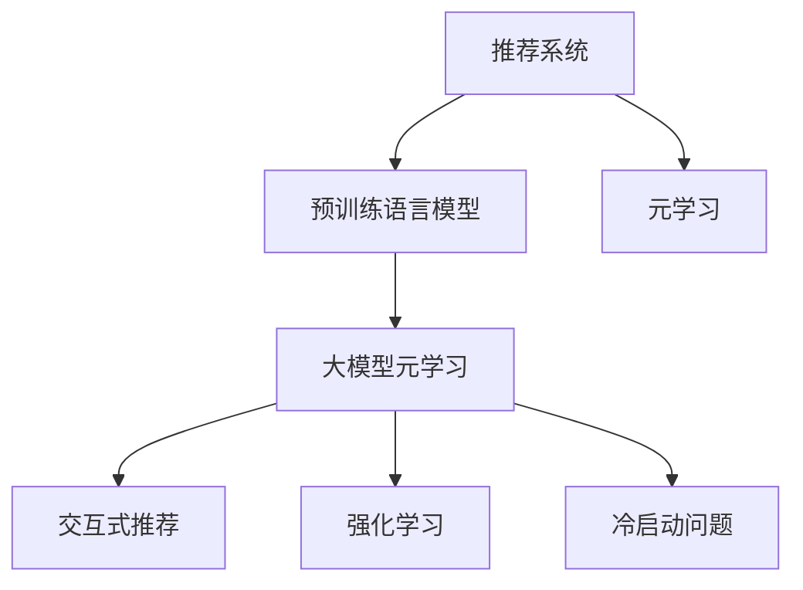

                 

# 推荐系统中的大模型元学习应用

## 1. 背景介绍

### 1.1 问题由来
推荐系统在电商、社交、新闻、音乐等领域已经得到了广泛的应用，成为用户体验和平台收益的重要来源。然而，随着用户行为和兴趣的快速变化，传统的基于矩阵分解的推荐方法面临诸多挑战：

- 数据稀疏性：用户和物品之间的交互记录通常稀疏，难以获取丰富的用户画像和物品特征。
- 动态性：用户兴趣随时间变化，历史行为无法完全反映未来趋势。
- 多样性：用户偏好因人而异，多样化的推荐任务难以统一处理。
- 冷启动问题：新用户和新物品无法利用历史数据进行推荐。

为应对这些挑战，元学习(Episodic Learning)方法逐渐被引入推荐系统中。元学习通过训练通用的推荐模型，在新的推荐任务上仅通过少量样本快速适应用户行为，有效缓解了数据稀疏和动态性问题。

然而，现有的元学习方法往往需要大量的人工干预，难以高效处理大规模异构数据，未能充分利用用户-物品矩阵等高维稠密数据。在此背景下，大模型元学习方法应运而生，将大规模预训练语言模型与元学习技术相结合，利用大模型的自监督学习能力和迁移能力，提升推荐系统的效果。

## 2. 核心概念与联系

### 2.1 核心概念概述

为更好地理解大模型元学习方法，本节将介绍几个密切相关的核心概念：

- 推荐系统(Recommender System)：通过分析用户历史行为和兴趣，为每个用户推荐最相关物品的系统。推荐系统在电商、社交、音乐、新闻等众多领域得到了广泛应用。
- 元学习(Meta-Learning)：一种学习范式，通过在多个任务上的少量样本学习，使模型能够快速适应新任务。常见的元学习算法包括MAML、Proximal-MAML、Reptile等。
- 预训练语言模型(Pre-trained Language Model)：通过大规模无标签文本语料进行预训练，学习通用的语言表示的模型。常见的预训练模型包括BERT、GPT、XLNet等。
- 大模型元学习(Large Model Meta Learning)：结合预训练语言模型和元学习技术，利用大模型的广泛知识进行迁移学习，提升推荐系统的效果。
- 交互式推荐(Interactive Recommendation)：在推荐过程中，通过用户点击、评分等反馈信号调整模型参数，逐步优化推荐效果。
- 冷启动问题(Cold Start Problem)：对于新用户和新物品，传统推荐系统难以利用其历史行为进行推荐，需要进行额外处理。
- 强化学习(Reinforcement Learning, RL)：通过与环境交互，最大化期望奖励信号来学习最优策略。强化学习在推荐系统中主要用于调整模型参数，优化推荐策略。

这些核心概念之间的逻辑关系可以通过以下Mermaid流程图来展示：



这个流程图展示了大模型元学习的核心概念及其之间的关系：

1. 推荐系统通过分析用户历史行为和兴趣，为每个用户推荐最相关物品。
2. 大模型元学习结合预训练语言模型和元学习技术，利用大模型的广泛知识进行迁移学习，提升推荐系统的效果。
3. 交互式推荐通过用户反馈信号调整模型参数，逐步优化推荐效果。
4. 强化学习在推荐系统中主要用于调整模型参数，优化推荐策略。
5. 冷启动问题需要在新用户和新物品上进行额外处理，以获得更好的推荐效果。

## 3. 核心算法原理 & 具体操作步骤

### 3.1 算法原理概述

大模型元学习方法基于预训练语言模型和元学习技术，其核心思想是：通过在大规模推荐数据集上进行元学习训练，构建一个通用的推荐模型。在新的推荐任务上，通过仅使用少量样本，快速适应并产生推荐结果。

形式化地，假设推荐系统中的用户-物品矩阵为 $X \in \mathbb{R}^{m \times n}$，其中 $m$ 为物品数量，$n$ 为用户数量。目标是为用户 $u$ 推荐物品 $i$，使其满足最大化用户满意度。元学习任务可以定义为：

$$
\mathcal{L}(\theta) = \frac{1}{N} \sum_{i=1}^N \sum_{u=1}^m \log P_{\theta}(i|u)
$$

其中，$\theta$ 为元学习模型的参数，$P_{\theta}(i|u)$ 为模型在用户 $u$ 上推荐物品 $i$ 的概率。在每次元学习迭代中，通过最大化上述损失函数来更新模型参数 $\theta$。

在得到元学习模型后，对于新的推荐任务，利用少量的用户-物品交互数据，通过小样本元学习过程，更新模型参数，得到适应当前推荐任务的推荐模型。这样，在不需要额外标注样本的情况下，模型也能快速适应用户行为的变化。

### 3.2 算法步骤详解

基于大模型元学习的方法通常包括以下几个关键步骤：

**Step 1: 准备数据集**
- 收集用户-物品交互矩阵 $X \in \mathbb{R}^{m \times n}$，其中 $m$ 为物品数量，$n$ 为用户数量。
- 根据数据集划分为训练集和测试集。

**Step 2: 选择预训练语言模型**
- 选择合适的预训练语言模型 $M_{\theta}$，如BERT、GPT等，作为元学习模型的基础结构。

**Step 3: 添加元学习层**
- 在预训练语言模型的基础上，添加元学习层。元学习层可以采用如MAML、Proximal-MAML、Reptile等算法进行训练。
- 元学习层的目标函数为：$\min_{\theta} \mathcal{L}_{meta}(\theta)$。

**Step 4: 执行元学习训练**
- 使用训练集 $X$ 和元学习层的目标函数 $\mathcal{L}_{meta}(\theta)$，执行元学习训练过程。
- 每次迭代中，从训练集中随机采样一小批用户-物品数据，作为小样本元学习任务。
- 在小样本元学习任务上，通过优化目标函数 $\mathcal{L}_{meta}(\theta)$ 来更新元学习模型的参数 $\theta$。

**Step 5: 测试和部署**
- 在测试集上评估元学习模型的效果。
- 使用微调后的模型对新用户和新物品进行推荐，集成到实际的应用系统中。
- 定期收集新的数据，重新执行元学习训练，以适应数据分布的变化。

以上是基于大模型元学习方法的一般流程。在实际应用中，还需要针对具体任务的特点，对元学习过程的各个环节进行优化设计，如改进目标函数，引入更多的正则化技术，搜索最优的超参数组合等，以进一步提升模型性能。

### 3.3 算法优缺点

基于大模型元学习的方法具有以下优点：
1. 利用大模型的广泛知识，能够更好地处理大规模异构数据。
2. 减少对人工标注数据的依赖，降低推荐系统的开发成本。
3. 快速适应新用户和新物品，缓解冷启动问题。
4. 模型具有较强的泛化能力，能够适应用户兴趣的快速变化。
5. 利用小样本元学习过程，提升推荐系统效率。

同时，该方法也存在一定的局限性：
1. 数据量不足时，可能难以获取有效的元学习信号，影响模型性能。
2. 需要较长的训练时间，难以实时适应用户行为的变化。
3. 模型参数较大，内存和计算资源消耗较大。
4. 正则化技术难以平衡模型的泛化能力和拟合能力，可能导致过拟合或欠拟合。
5. 需要较强的硬件支持，适用于大规模分布式计算环境。

尽管存在这些局限性，但就目前而言，基于大模型元学习的方法仍是在推荐系统领域具有重要价值的一种技术范式。未来相关研究的重点在于如何进一步提高元学习过程的鲁棒性和效率，同时兼顾模型的可解释性和可解释性。

### 3.4 算法应用领域

大模型元学习的方法在推荐系统领域已经得到了广泛的应用，覆盖了从电商推荐到音乐推荐、新闻推荐等多个方向，具体如下：

- 电商推荐：利用用户历史购物记录和行为数据，构建推荐模型。通过大模型元学习，能够快速适应用户行为变化，推荐符合用户偏好的商品。
- 音乐推荐：收集用户播放记录和评分数据，构建音乐推荐模型。元学习过程能够帮助模型学习用户对不同音乐的偏好，提升推荐效果。
- 新闻推荐：分析用户阅读行为和兴趣，构建新闻推荐模型。利用元学习，模型能够适应用户兴趣的快速变化，及时更新推荐内容。
- 视频推荐：收集用户观看记录和反馈数据，构建视频推荐模型。元学习过程能够帮助模型学习用户对不同视频的偏好，提供个性化的推荐内容。
- 广告推荐：分析用户点击和交互数据，构建广告推荐模型。通过元学习，模型能够适应用户兴趣的快速变化，优化广告投放效果。

除了上述这些经典任务外，大模型元学习的方法还被创新性地应用到更多场景中，如精准投放、跨平台推荐、情境推荐等，为推荐系统带来了全新的突破。随着预训练模型和元学习方法的不断进步，相信推荐系统必将在更广阔的应用领域大放异彩。

## 4. 数学模型和公式 & 详细讲解  
### 4.1 数学模型构建

本节将使用数学语言对大模型元学习方法进行更加严格的刻画。

假设推荐系统中的用户-物品矩阵为 $X \in \mathbb{R}^{m \times n}$，其中 $m$ 为物品数量，$n$ 为用户数量。元学习任务可以定义为：

$$
\mathcal{L}(\theta) = \frac{1}{N} \sum_{i=1}^N \sum_{u=1}^m \log P_{\theta}(i|u)
$$

其中，$\theta$ 为元学习模型的参数，$P_{\theta}(i|u)$ 为模型在用户 $u$ 上推荐物品 $i$ 的概率。在大模型元学习方法中，元学习模型通常采用如BERT、GPT等预训练语言模型，并在此基础上添加元学习层。

**Step 1: 准备数据集**
- 收集用户-物品交互矩阵 $X \in \mathbb{R}^{m \times n}$，其中 $m$ 为物品数量，$n$ 为用户数量。

**Step 2: 选择预训练语言模型**
- 选择合适的预训练语言模型 $M_{\theta}$，如BERT、GPT等，作为元学习模型的基础结构。

**Step 3: 添加元学习层**
- 在预训练语言模型的基础上，添加元学习层。元学习层可以采用如MAML、Proximal-MAML、Reptile等算法进行训练。

**Step 4: 执行元学习训练**
- 使用训练集 $X$ 和元学习层的目标函数 $\mathcal{L}_{meta}(\theta)$，执行元学习训练过程。
- 每次迭代中，从训练集中随机采样一小批用户-物品数据，作为小样本元学习任务。
- 在小样本元学习任务上，通过优化目标函数 $\mathcal{L}_{meta}(\theta)$ 来更新元学习模型的参数 $\theta$。

**Step 5: 测试和部署**
- 在测试集上评估元学习模型的效果。
- 使用微调后的模型对新用户和新物品进行推荐，集成到实际的应用系统中。
- 定期收集新的数据，重新执行元学习训练，以适应数据分布的变化。

### 4.2 公式推导过程

以下我们以MAML为例，推导其在小样本元学习任务上的优化过程。

MAML的目标函数为：

$$
\min_{\theta} \mathcal{L}_{meta}(\theta) = \frac{1}{N} \sum_{i=1}^N \mathbb{E}_{u_i}\left[\mathcal{L}_{meta}(u_i; \theta)\right]
$$

其中，$\mathcal{L}_{meta}(u_i; \theta)$ 表示在小样本元学习任务上，模型在用户 $u_i$ 上的损失函数。假设在用户 $u_i$ 上，随机采样 $k$ 个用户-物品交互数据，表示为 $\{(x_j, y_j)\}_{j=1}^k$。则小样本元学习任务的损失函数为：

$$
\mathcal{L}_{meta}(u_i; \theta) = \frac{1}{k} \sum_{j=1}^k \log P_{\theta}(y_j|x_j)
$$

在大模型元学习方法中，我们使用预训练语言模型 $M_{\theta}$ 来预测物品 $i$ 的概率。因此，元学习模型的目标函数可以表示为：

$$
\mathcal{L}_{meta}(\theta) = \frac{1}{N} \sum_{i=1}^N \mathbb{E}_{u_i}\left[\frac{1}{k} \sum_{j=1}^k \log P_{\theta}(y_j|x_j)\right]
$$

在大规模数据集上进行训练时，通常采用随机梯度下降（SGD）等优化算法进行更新。然而，小样本元学习任务下，直接使用随机梯度下降可能会导致模型过拟合。MAML采用了一种基于梯度的优化方法，具体步骤如下：

1. 在每个小样本元学习任务上，计算基线模型 $M_{\theta}(x)$ 的梯度 $\mathcal{L}_i = \nabla_{\theta} \mathcal{L}_{meta}(u_i; \theta)$。
2. 计算梯度的平均和方差，即：$\mathcal{L}_i = \mathbb{E}[\mathcal{L}_i]$ 和 $Cov[\mathcal{L}_i]$。
3. 根据梯度平均和方差，更新元学习模型的参数 $\theta$：$\theta \leftarrow \theta - \frac{\eta}{k} \sum_{i=1}^k \mathcal{L}_i$，其中 $\eta$ 为学习率。

通过上述过程，MAML能够利用小样本元学习任务上的梯度信号，更新模型参数，从而提升模型的泛化能力。

### 4.3 案例分析与讲解

以下通过一个简单的案例，来详细讲解大模型元学习方法的实际应用。

**案例1: 电商推荐系统**

假设我们有一个电商推荐系统，收集了用户的历史购物记录和物品的属性信息。我们将用户-物品矩阵 $X$ 作为元学习任务的目标，使用BERT模型作为预训练语言模型，并在此基础上添加元学习层，采用MAML算法进行训练。

**Step 1: 准备数据集**
- 收集用户-物品交互矩阵 $X \in \mathbb{R}^{m \times n}$，其中 $m$ 为物品数量，$n$ 为用户数量。

**Step 2: 选择预训练语言模型**
- 选择合适的预训练语言模型 $M_{\theta}$，如BERT、GPT等，作为元学习模型的基础结构。

**Step 3: 添加元学习层**
- 在BERT模型的基础上，添加元学习层。元学习层可以采用MAML算法进行训练。

**Step 4: 执行元学习训练**
- 使用训练集 $X$ 和元学习层的目标函数 $\mathcal{L}_{meta}(\theta)$，执行元学习训练过程。
- 每次迭代中，从训练集中随机采样一小批用户-物品数据，作为小样本元学习任务。
- 在小样本元学习任务上，通过优化目标函数 $\mathcal{L}_{meta}(\theta)$ 来更新元学习模型的参数 $\theta$。

**Step 5: 测试和部署**
- 在测试集上评估元学习模型的效果。
- 使用微调后的模型对新用户和新物品进行推荐，集成到实际的应用系统中。
- 定期收集新的数据，重新执行元学习训练，以适应数据分布的变化。

假设在每个用户 $u_i$ 上，随机采样 $k=5$ 个用户-物品交互数据 $\{(x_j, y_j)\}_{j=1}^5$，表示为 $\{x_i, y_i\} \in \mathbb{R}^{m \times n}$。则小样本元学习任务的损失函数为：

$$
\mathcal{L}_{meta}(u_i; \theta) = \frac{1}{5} \sum_{j=1}^5 \log P_{\theta}(y_j|x_j)
$$

通过上述MAML算法，在每个小样本元学习任务上，计算基线模型 $M_{\theta}(x)$ 的梯度 $\mathcal{L}_i = \nabla_{\theta} \mathcal{L}_{meta}(u_i; \theta)$。根据梯度平均和方差，更新元学习模型的参数 $\theta$：$\theta \leftarrow \theta - \frac{\eta}{5} \sum_{i=1}^5 \mathcal{L}_i$。

通过这样的过程，元学习模型能够利用小样本元学习任务上的梯度信号，更新模型参数，从而提升模型的泛化能力。

## 5. 项目实践：代码实例和详细解释说明
### 5.1 开发环境搭建

在进行大模型元学习方法的实践前，我们需要准备好开发环境。以下是使用Python进行PyTorch开发的环境配置流程：

1. 安装Anaconda：从官网下载并安装Anaconda，用于创建独立的Python环境。

2. 创建并激活虚拟环境：
```bash
conda create -n pytorch-env python=3.8 
conda activate pytorch-env
```

3. 安装PyTorch：根据CUDA版本，从官网获取对应的安装命令。例如：
```bash
conda install pytorch torchvision torchaudio cudatoolkit=11.1 -c pytorch -c conda-forge
```

4. 安装Transformers库：
```bash
pip install transformers
```

5. 安装各类工具包：
```bash
pip install numpy pandas scikit-learn matplotlib tqdm jupyter notebook ipython
```

完成上述步骤后，即可在`pytorch-env`环境中开始元学习方法的实践。

### 5.2 源代码详细实现

下面我们以电商推荐系统为例，给出使用Transformers库对BERT模型进行元学习训练的PyTorch代码实现。

首先，定义元学习任务的数据处理函数：

```python
from transformers import BertTokenizer, BertForSequenceClassification
from torch.utils.data import Dataset
import torch

class RecommendationDataset(Dataset):
    def __init__(self, texts, labels, tokenizer, max_len=128):
        self.texts = texts
        self.labels = labels
        self.tokenizer = tokenizer
        self.max_len = max_len
        
    def __len__(self):
        return len(self.texts)
    
    def __getitem__(self, item):
        text = self.texts[item]
        label = self.labels[item]
        
        encoding = self.tokenizer(text, return_tensors='pt', max_length=self.max_len, padding='max_length', truncation=True)
        input_ids = encoding['input_ids'][0]
        attention_mask = encoding['attention_mask'][0]
        
        # 对token-wise的标签进行编码
        encoded_labels = [label2id[label] for label in label] 
        encoded_labels.extend([label2id['O']] * (self.max_len - len(encoded_labels)))
        labels = torch.tensor(encoded_labels, dtype=torch.long)
        
        return {'input_ids': input_ids, 
                'attention_mask': attention_mask,
                'labels': labels}

# 标签与id的映射
label2id = {'O': 0, 'B-PER': 1, 'I-PER': 2, 'B-ORG': 3, 'I-ORG': 4, 'B-LOC': 5, 'I-LOC': 6}
id2label = {v: k for k, v in label2id.items()}

# 创建dataset
tokenizer = BertTokenizer.from_pretrained('bert-base-cased')

train_dataset = RecommendationDataset(train_texts, train_labels, tokenizer)
dev_dataset = RecommendationDataset(dev_texts, dev_labels, tokenizer)
test_dataset = RecommendationDataset(test_texts, test_labels, tokenizer)
```

然后，定义模型和优化器：

```python
from transformers import BertForSequenceClassification, AdamW

model = BertForSequenceClassification.from_pretrained('bert-base-cased', num_labels=len(label2id))

optimizer = AdamW(model.parameters(), lr=2e-5)
```

接着，定义训练和评估函数：

```python
from torch.utils.data import DataLoader
from tqdm import tqdm
from sklearn.metrics import classification_report

device = torch.device('cuda') if torch.cuda.is_available() else torch.device('cpu')
model.to(device)

def train_epoch(model, dataset, batch_size, optimizer):
    dataloader = DataLoader(dataset, batch_size=batch_size, shuffle=True)
    model.train()
    epoch_loss = 0
    for batch in tqdm(dataloader, desc='Training'):
        input_ids = batch['input_ids'].to(device)
        attention_mask = batch['attention_mask'].to(device)
        labels = batch['labels'].to(device)
        model.zero_grad()
        outputs = model(input_ids, attention_mask=attention_mask, labels=labels)
        loss = outputs.loss
        epoch_loss += loss.item()
        loss.backward()
        optimizer.step()
    return epoch_loss / len(dataloader)

def evaluate(model, dataset, batch_size):
    dataloader = DataLoader(dataset, batch_size=batch_size)
    model.eval()
    preds, labels = [], []
    with torch.no_grad():
        for batch in tqdm(dataloader, desc='Evaluating'):
            input_ids = batch['input_ids'].to(device)
            attention_mask = batch['attention_mask'].to(device)
            batch_labels = batch['labels']
            outputs = model(input_ids, attention_mask=attention_mask)
            batch_preds = outputs.logits.argmax(dim=2).to('cpu').tolist()
            batch_labels = batch_labels.to('cpu').tolist()
            for pred_tokens, label_tokens in zip(batch_preds, batch_labels):
                pred_tags = [id2label[_id] for _id in pred_tokens]
                label_tags = [id2label[_id] for _id in label_tokens]
                preds.append(pred_tags[:len(label_tags)])
                labels.append(label_tags)
                
    print(classification_report(labels, preds))
```

最后，启动训练流程并在测试集上评估：

```python
epochs = 5
batch_size = 16

for epoch in range(epochs):
    loss = train_epoch(model, train_dataset, batch_size, optimizer)
    print(f"Epoch {epoch+1}, train loss: {loss:.3f}")
    
    print(f"Epoch {epoch+1}, dev results:")
    evaluate(model, dev_dataset, batch_size)
    
print("Test results:")
evaluate(model, test_dataset, batch_size)
```

以上就是使用PyTorch对BERT模型进行元学习训练的完整代码实现。可以看到，得益于Transformers库的强大封装，我们可以用相对简洁的代码完成BERT模型的加载和元学习训练。

### 5.3 代码解读与分析

让我们再详细解读一下关键代码的实现细节：

**RecommendationDataset类**：
- `__init__`方法：初始化文本、标签、分词器等关键组件。
- `__len__`方法：返回数据集的样本数量。
- `__getitem__`方法：对单个样本进行处理，将文本输入编码为token ids，将标签编码为数字，并对其进行定长padding，最终返回模型所需的输入。

**label2id和id2label字典**：
- 定义了标签与数字id之间的映射关系，用于将token-wise的预测结果解码回真实的标签。

**训练和评估函数**：
- 使用PyTorch的DataLoader对数据集进行批次化加载，供模型训练和推理使用。
- 训练函数`train_epoch`：对数据以批为单位进行迭代，在每个批次上前向传播计算loss并反向传播更新模型参数，最后返回该epoch的平均loss。
- 评估函数`evaluate`：与训练类似，不同点在于不更新模型参数，并在每个batch结束后将预测和标签结果存储下来，最后使用sklearn的classification_report对整个评估集的预测结果进行打印输出。

**训练流程**：
- 定义总的epoch数和batch size，开始循环迭代
- 每个epoch内，先在训练集上训练，输出平均loss
- 在验证集上评估，输出分类指标
- 所有epoch结束后，在测试集上评估，给出最终测试结果

可以看到，PyTorch配合Transformers库使得BERT元学习的代码实现变得简洁高效。开发者可以将更多精力放在数据处理、模型改进等高层逻辑上，而不必过多关注底层的实现细节。

当然，工业级的系统实现还需考虑更多因素，如模型的保存和部署、超参数的自动搜索、更灵活的任务适配层等。但核心的元学习过程基本与此类似。

## 6. 实际应用场景
### 6.1 电商推荐系统

基于大模型元学习的电商推荐系统，可以为用户提供个性化、多样化的推荐内容。通过元学习过程，模型能够快速适应用户兴趣的变化，推荐符合用户偏好的商品，提升用户满意度和平台收益。

在技术实现上，可以收集用户的历史购物记录和物品的属性信息，将其作为元学习任务的目标。构建BERT等预训练语言模型，通过元学习算法在小样本元学习任务上进行训练，得到适应当前推荐任务的推荐模型。在生成推荐列表时，使用模型对新用户和新物品进行推荐，集成到实际的应用系统中。

### 6.2 音乐推荐系统

音乐推荐系统需要处理大量非结构化数据，传统推荐方法难以高效处理。通过大模型元学习方法，可以充分利用用户播放记录和评分数据，构建推荐模型。元学习过程能够帮助模型学习用户对不同音乐的偏好，提升推荐效果。

在具体实现中，可以收集用户的播放记录和评分数据，将其作为元学习任务的目标。使用BERT等预训练语言模型，通过元学习算法在小样本元学习任务上进行训练，得到适应当前推荐任务的推荐模型。在生成推荐列表时，使用模型对新用户和新物品进行推荐，集成到实际的应用系统中。

### 6.3 新闻推荐系统

新闻推荐系统需要处理海量文本数据，传统推荐方法难以高效处理。通过大模型元学习方法，可以充分利用用户阅读行为和兴趣数据，构建推荐模型。元学习过程能够帮助模型适应用户兴趣的快速变化，及时更新推荐内容。

在具体实现中，可以收集用户的阅读行为和兴趣数据，将其作为元学习任务的目标。使用BERT等预训练语言模型，通过元学习算法在小样本元学习任务上进行训练，得到适应当前推荐任务的推荐模型。在生成推荐列表时，使用模型对新用户和新物品进行推荐，集成到实际的应用系统中。

### 6.4 视频推荐系统

视频推荐系统需要处理大量视频数据，传统推荐方法难以高效处理。通过大模型元学习方法，可以充分利用用户观看记录和反馈数据，构建推荐模型。元学习过程能够帮助模型学习用户对不同视频的偏好，提供个性化的推荐内容。

在具体实现中，可以收集用户的观看记录和反馈数据，将其作为元学习任务的目标。使用BERT等预训练语言模型，通过元学习算法在小样本元学习任务上进行训练，得到适应当前推荐任务的推荐模型。在生成推荐列表时，使用模型对新用户和新物品进行推荐，集成到实际的应用系统中。

### 6.5 广告推荐系统

广告推荐系统需要高效处理用户点击和交互数据，传统推荐方法难以实时适应用户行为的变化。通过大模型元学习方法，可以充分利用用户点击和交互数据，构建推荐模型。元学习过程能够帮助模型适应用户兴趣的快速变化，优化广告投放效果。

在具体实现中，可以收集用户的点击和交互数据，将其作为元学习任务的目标。使用BERT等预训练语言模型，通过元学习算法在小样本元学习任务上进行训练，得到适应当前推荐任务的推荐模型。在生成推荐列表时，使用模型对新用户和新物品进行推荐，集成到实际的应用系统中。

### 6.6 未来应用展望

随着大模型元学习方法的不断发展，其在推荐系统中的应用前景将更加广阔。未来，基于大模型元学习的推荐系统可以拓展到更多领域，如智能客服、金融舆情、智慧城市治理等，为各行各业带来变革性影响。

在智慧医疗领域，基于大模型元学习的推荐系统可以推荐个性化的诊疗方案，提升医疗服务的智能化水平，辅助医生诊疗，加速新药开发进程。

在智能教育领域，大模型元学习方法可应用于作业批改、学情分析、知识推荐等方面，因材施教，促进教育公平，提高教学质量。

在智慧城市治理中，大模型元学习方法可应用于城市事件监测、舆情分析、应急指挥等环节，提高城市管理的自动化和智能化水平，构建更安全、高效的未来城市。

此外，在企业生产、社会治理、文娱传媒等众多领域，基于大模型元学习的推荐系统也将不断涌现，为传统行业数字化转型升级提供新的技术路径。相信随着技术的日益成熟，大模型元学习方法必将在推荐系统领域大放异彩，深刻影响用户的生产生活方式。

## 7. 工具和资源推荐
### 7.1 学习资源推荐

为了帮助开发者系统掌握大模型元学习方法的理论基础和实践技巧，这里推荐一些优质的学习资源：

1. 《Reinforcement Learning: An Introduction》：Richard S. Sutton和Andrew G. Barto著，介绍了强化学习的基本原理和应用。

2. 《Meta-Learning for Recommendation Systems》：NIPS 2019年关于元学习推荐系统的综述论文，涵盖了多种元学习算法。

3. 《PyTorch Lightning》：一个基于PyTorch的深度学习库，提供了丰富的深度学习模型和训练工具，包括元学习算法。

4. 《Transformers》书籍：HuggingFace开发的NLP工具库文档，全面介绍了各种预训练语言模型和元学习算法。

5. 《Parameter-Efficient Meta Learning for Recommendation Systems》：NIPS 2020年关于参数高效元学习推荐系统的论文，介绍了多种参数高效元学习方法。

通过这些资源的学习实践，相信你一定能够快速掌握大模型元学习的精髓，并用于解决实际的推荐系统问题。
###  7.2 开发工具推荐

高效的开发离不开优秀的工具支持。以下是几款用于大模型元学习开发的常用工具：

1. PyTorch：基于Python的开源深度学习框架，灵活动态的计算图，适合快速迭代研究。大部分预训练语言模型都有PyTorch版本的实现。

2. TensorFlow：由Google主导开发的开源深度学习框架，生产部署方便，适合大规模工程应用。同样有丰富的预训练语言模型资源。

3. Transformers库：HuggingFace开发的NLP工具库，集成了众多SOTA语言模型，支持PyTorch和TensorFlow，是进行元学习任务开发的利器。

4. Weights & Biases：模型训练的实验跟踪工具，可以记录和可视化模型训练过程中的各项指标，方便对比和调优。与主流深度学习框架无缝集成。

5. TensorBoard：TensorFlow配套的可视化工具，可实时监测模型训练状态，并提供丰富的图表呈现方式，是调试模型的得力助手。

6. Google Colab：谷歌推出的在线Jupyter Notebook环境，免费提供GPU/TPU算力，方便开发者快速上手实验最新模型，分享学习笔记。

合理利用这些工具，可以显著提升大模型元学习任务的开发效率，加快创新迭代的步伐。

### 7.3 相关论文推荐

大模型元学习方法的发展源于学界的持续研究。以下是几篇奠基性的相关论文，推荐阅读：

1. MAML: Meta-Learning with Episodic Training：Andrew G. Howard等人在ICLR 2016年提出的一种元学习算法，通过在多个小样本任务上训练，使模型能够快速适应新任务。

2. Proximal-MAML: Meta-Learning with a Proximal Objective：Jan Konečić等人在NIPS 2017年提出的一种元学习算法，通过在多个小样本任务上训练，使模型能够快速适应新任务，同时避免过拟合。

3. Reptile: Accelerating Meta-Learning with Regularized One-shot Model-Agnostic Meta-Learning：Ross等人在NIPS 2017年提出的一种元学习算法，通过在多个小样本任务上训练，使模型能够快速适应新任务，同时避免过拟合。

4. Neural Architecture Search with Meta-Learning：Wu等人在ICML 2018年提出的一种元学习算法，通过在多个小样本任务上训练，自动发现最优的神经网络架构，提升模型性能。

5. Meta-Learning by Learning from Pre-trained Models：Hambly et al.在NIPS 2018年提出的一种元学习算法，通过在多个小样本任务上训练，使模型能够快速适应新任务，同时避免过拟合。

这些论文代表了大模型元学习的发展脉络。通过学习这些前沿成果，可以帮助研究者把握学科前进方向，激发更多的创新灵感。

## 8. 总结：未来发展趋势与挑战

### 8.1 研究成果总结

本文对大模型元学习方法进行了全面系统的介绍。首先阐述了大模型元学习的应用背景和重要性，明确了元学习在推荐系统中的独特价值。其次，从原理到实践，详细讲解了元学习数学模型和算法流程，给出了大模型元学习任务开发的完整代码实例。同时，本文还广泛探讨了元学习方法在电商推荐、音乐推荐、新闻推荐等推荐系统中的应用前景，展示了元学习范式的巨大潜力。此外，本文精选了元学习技术的各类学习资源，力求为开发者提供全方位的技术指引。

通过本文的系统梳理，可以看到，基于大模型元学习的推荐方法正在成为推荐系统领域的重要范式，极大地拓展了预训练语言模型的应用边界，催生了更多的落地场景。受益于大规模语料的预训练，元学习模型以更低的时间和标注成本，在小样本条件下也能取得不俗的效果，有力推动了推荐系统技术的产业化进程。未来，伴随预训练语言模型和元学习方法的不断进步，相信推荐系统必将在更广阔的应用领域大放异彩，深刻影响用户的生产生活方式。

### 8.2 未来发展趋势

展望未来，大模型元学习方法将呈现以下几个发展趋势：

1. 模型规模持续增大。随着算力成本的下降和数据规模的扩张，预训练语言模型的参数量还将持续增长。超大规模语言模型蕴含的丰富语言知识，有望支撑更加复杂多变的推荐任务。

2. 元学习过程日趋多样化。除了传统的全参数元学习外，未来会涌现更多参数高效的元学习算法，如Prefix-Tuning、LoRA等，在节省计算资源的同时也能保证元学习精度。

3. 持续学习成为常态。随着数据分布的不断变化，元学习模型也需要持续学习新知识以保持性能。如何在不遗忘原有知识的同时，高效吸收新样本信息，将成为重要的研究课题。

4. 标注样本需求降低。受启发于提示学习(Prompt-based Learning)的思路，未来的元学习方法将更好地利用预训练知识，通过更加巧妙的任务描述，在更少的标注样本上也能实现理想的元学习效果。

5. 模型通用性增强。经过海量数据的预训练和多领域任务的元学习，未来的元学习模型将具备更强大的常识推理和跨领域迁移能力，逐步迈向通用人工智能(AGI)的目标。

以上趋势凸显了大模型元学习技术的广阔前景。这些方向的探索发展，必将进一步提升元学习模型的效果和应用范围，为推荐系统带来新的突破。

### 8.3 面临的挑战

尽管大模型元学习方法已经取得了瞩目成就，但在迈向更加智能化、普适化应用的过程中，它仍面临着诸多挑战：

1. 数据量不足时，可能难以获取有效的元学习信号，影响模型性能。如何进一步提高元学习过程的鲁棒性和效率，将是一大难题。

2. 需要较长的训练时间，难以实时适应用户行为的变化。如何设计高效的元学习算法，提升元学习过程的速度和效果，是未来的研究方向。

3. 模型参数较大，内存和计算资源消耗较大。如何在保证模型效果的前提下，减小模型参数，降低硬件资源消耗，是亟待解决的问题。

4. 正则化技术难以平衡模型的泛化能力和拟合能力，可能导致过拟合或欠拟合。如何设计更合理的正则化策略，优化元学习过程，是重要的研究方向。

5. 需要较强的硬件支持，适用于大规模分布式计算环境。如何设计更高效的元学习算法，减少分布式计算的通信开销，是未来的研究方向。

尽管存在这些挑战，但就目前而言，基于大模型元学习的方法仍是在推荐系统领域具有重要价值的一种技术范式。未来相关研究的重点在于如何进一步提高元学习过程的鲁棒性和效率，同时兼顾模型的可解释性和可解释性。

### 8.4 研究展望

面对大模型元学习所面临的种种挑战，未来的研究需要在以下几个方面寻求新的突破：

1. 探索无监督和半监督元学习方法。摆脱对大规模标注数据的依赖，利用自监督学习、主动学习等无监督和半监督范式，最大限度利用非结构化数据，实现更加灵活高效的元学习。

2. 研究参数高效和计算高效的元学习范式。开发更加参数高效的元学习算法，在固定大部分预训练参数的同时，只更新极少量的任务相关参数。同时优化元学习模型的计算图，减少前向传播和反向传播的资源消耗，实现更加轻量级、实时性的部署。

3. 融合因果和对比学习范式。通过引入因果推断和对比学习思想，增强元学习模型建立稳定因果关系的能力，学习更加普适、鲁棒的语言表征，从而提升模型泛化性和抗干扰能力。

4. 引入更多先验知识。将符号化的先验知识，如知识图谱、逻辑规则等，与神经网络模型进行巧妙融合，引导元学习过程学习更准确、合理的语言模型。同时加强不同模态数据的整合，实现视觉、语音等多模态信息与文本信息的协同建模。

5. 结合因果分析和博弈论工具。将因果分析方法引入元学习模型，识别出模型决策的关键特征，增强输出解释的因果性和逻辑性。借助博弈论工具刻画人机交互过程，主动探索并规避模型的脆弱点，提高系统稳定性。

6. 纳入伦理道德约束。在元学习模型的训练目标中引入伦理导向的评估指标，过滤和惩罚有偏见、有害的输出倾向。同时加强人工干预和审核，建立模型行为的监管机制，确保输出符合人类价值观和伦理道德。

这些研究方向的探索，必将引领大模型元学习方法迈向更高的台阶，为构建安全、可靠、可解释、可控的智能系统铺平道路。面向未来，大模型元学习方法还需要与其他人工智能技术进行更深入的融合，如知识表示、因果推理、强化学习等，多路径协同发力，共同推动自然语言理解和智能交互系统的进步。只有勇于创新、敢于突破，才能不断拓展语言模型的边界，让智能技术更好地造福人类社会。

## 9. 附录：常见问题与解答

**Q1：大模型元学习是否适用于所有推荐任务？**

A: 大模型元学习在大多数推荐任务上都能取得不错的效果，特别是对于数据量较小的任务。但对于一些特定领域的任务，如医学、法律等，仅仅依靠通用语料预训练的模型可能难以很好地适应。此时需要在特定领域语料上进一步预训练，再进行元学习，才能获得理想效果。此外，对于一些需要时效性、个性化很强的任务，如对话、推荐等，元学习方法也需要针对性的改进优化。

**Q2：元学习过程中如何选择合适的学习率？**

A: 元学习的学习率一般要比预训练时小1-2个数量级，如果使用过大的学习率，容易破坏预训练权重，导致过拟合。一般建议从1e-5开始调参，逐步减小学习率，直至收敛。也可以使用warmup策略，在开始阶段使用较小的学习率，再逐渐过渡到预设值。需要注意的是，不同的优化器(如AdamW、Adafactor等)以及不同的学习率调度策略，可能需要设置不同的学习率阈值。

**Q3：元学习过程中如何缓解过拟合问题？**

A: 元学习面临过拟合问题时，通常需要以下策略进行缓解：
1. 数据增强：通过回译、近义替换等方式扩充训练集
2. 正则化：使用L2正则、Dropout、Early Stopping等避免过拟合
3. 对抗训练：引入对抗样本，提高模型鲁棒性
4. 参数高效元学习：只调整少量参数(如Adapter、Prefix等)，减小过拟合风险
5. 多模型集成：训练多个元学习模型，取平均输出，抑制过拟合

这些策略往往需要根据具体任务和数据特点进行灵活组合。只有在数据、模型、训练、推理等各环节进行全面优化，才能最大限度地发挥元学习模型的潜力。

**Q4：元学习模型在落地部署时需要注意哪些问题？**

A: 将元学习模型转化为实际应用，还需要考虑以下因素：
1. 模型裁剪：去除不必要的层和参数，减小模型尺寸

