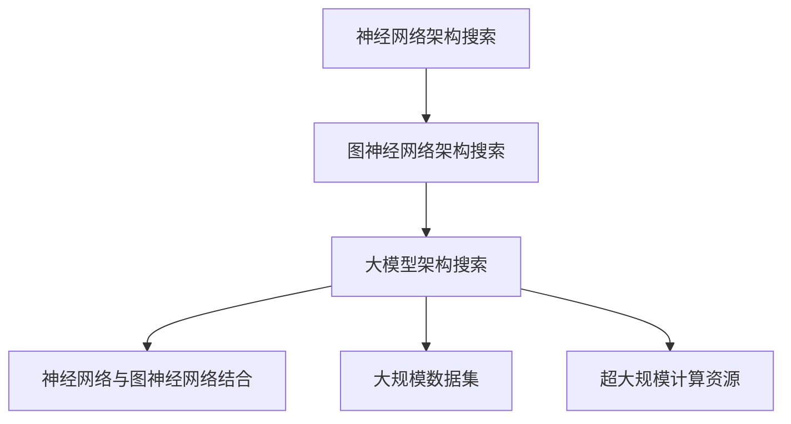

                 

# 推荐系统中的大模型图神经架构搜索

## 1. 背景介绍

### 1.1 问题由来
推荐系统是互联网时代的重要应用领域之一，其核心任务是根据用户的历史行为、兴趣、社交关系等，预测并推荐个性化的商品、内容、服务等，提升用户体验和转化率。近年来，随着深度学习技术的发展，基于神经网络模型的推荐系统逐渐取代传统的协同过滤等方法，成为主流的推荐技术。

然而，传统的神经网络推荐模型存在一定的局限性。其往往对模型结构的选择依赖于经验和直觉，难以通过自动化手段探索最优模型架构。此外，随着数据量的增加，神经网络的规模不断膨胀，训练和推理的计算复杂度也急剧上升，传统的模型搜索方法已经难以满足需求。

大模型图神经架构搜索技术的提出，正是为了解决这些挑战。通过将神经网络结构和图神经网络架构相结合，大模型架构搜索可以在大规模数据集上自动化地探索最优模型架构，从而显著提升推荐系统的性能。

### 1.2 问题核心关键点
大模型图神经架构搜索的核心在于：
- 如何将神经网络架构与图神经网络架构相结合，构建适合推荐任务的新型架构？
- 如何在超大规模数据集上高效探索最优的模型架构？
- 如何避免搜索过程中的过拟合和计算资源浪费？

## 2. 核心概念与联系

### 2.1 核心概念概述

为更好地理解大模型图神经架构搜索，本节将介绍几个密切相关的核心概念：

- 神经网络架构搜索(Neural Architecture Search, NAS)：通过自动化探索和优化，找到最适合特定任务的神经网络结构的过程。NAS可以从原始的网络模块组合中生成高效的网络结构，广泛应用于图像识别、自然语言处理等领域。

- 图神经网络(Graph Neural Network, GNN)：一种通过图结构对节点间关系进行建模的深度学习模型。GNN可以用于预测、推荐、社交网络分析等任务，其核心思想是将节点的局部特征和邻域特征进行聚合，更新节点的表示。

- 大模型(Training Model, LM)：指在超大规模数据集上进行预训练，具有复杂网络结构和大量参数的深度学习模型。大模型通过大规模数据和计算资源的学习，具备强大的泛化能力和迁移学习能力。

- 架构搜索空间：所有可能的神经网络结构和图神经网络结构构成的搜索空间。搜索空间的大小和维度决定了搜索任务的难度和复杂度。

- 目标函数：衡量模型性能的函数，如准确率、F1值、均方误差等。目标函数的优化是搜索过程的关键。

这些核心概念之间的逻辑关系可以通过以下Mermaid流程图来展示：



这个流程图展示了从神经网络架构搜索到图神经网络架构搜索，再到基于大模型的架构搜索，最终实现神经网络与图神经网络结合的全过程。

## 3. 核心算法原理 & 具体操作步骤
### 3.1 算法原理概述

大模型图神经架构搜索的本质是一种图优化问题，旨在寻找最优的神经网络结构和图神经网络结构组合，以最大化目标函数的值。其核心算法包括：

- 生成网络模块：使用基于深度学习的方法，生成多个候选神经网络模块。
- 构建搜索图：将神经网络模块组合成图神经网络，构建搜索图。
- 评估性能：使用目标函数评估搜索图中各节点和边的性能。
- 选择子图：选择最优的子图进行微调。
- 迭代搜索：通过多轮迭代，不断优化搜索图中的节点和边，最终得到最优的模型架构。

### 3.2 算法步骤详解

大模型图神经架构搜索一般包括以下几个关键步骤：

**Step 1: 定义搜索空间**
- 确定搜索空间中的基本神经网络模块。这些模块可以包括卷积层、池化层、全连接层等。
- 定义模块的参数和约束条件。例如，卷积核的大小、深度、激活函数等。

**Step 2: 生成候选模块**
- 使用深度学习模型，如CNN、RNN等，生成候选模块。
- 每个候选模块包含一系列的神经网络层，如卷积层、池化层、全连接层等。

**Step 3: 构建搜索图**
- 将候选模块组合成图神经网络，构建搜索图。搜索图包括多个节点和边，每个节点表示一个神经网络模块，边表示节点间的连接关系。
- 使用深度强化学习等方法，学习优化搜索图中的节点和边，生成更高效的神经网络结构。

**Step 4: 评估性能**
- 使用目标函数（如准确率、F1值等）评估搜索图中各节点和边的性能。
- 使用交叉验证等方法，对评估结果进行统计和分析。

**Step 5: 选择子图**
- 选择性能最优的子图进行微调。
- 在微调过程中，可以使用大模型预训练得到的权重进行初始化，以加快收敛速度。

**Step 6: 迭代搜索**
- 通过多轮迭代，不断优化搜索图中的节点和边。
- 每个迭代周期后，使用目标函数评估当前搜索图中的性能，更新搜索图中的节点和边。

### 3.3 算法优缺点

大模型图神经架构搜索具有以下优点：
1. 自动化搜索：通过自动化手段搜索最优的模型架构，减少对经验和直觉的依赖。
2. 泛化能力强：在大规模数据集上搜索，得到的模型架构具备较强的泛化能力。
3. 计算效率高：通过图优化方法，在超大规模数据集上高效搜索，避免计算资源浪费。
4. 易于扩展：通过深度学习模型生成候选模块，可以轻松扩展搜索空间，满足不同任务需求。

同时，该算法也存在一定的局限性：
1. 计算成本高：在大规模数据集上搜索最优模型架构，需要消耗大量的计算资源。
2. 搜索空间大：神经网络模块和图神经网络模块的组合形式多样，搜索空间维度高。
3. 过拟合风险：搜索过程中可能出现局部最优解，影响模型的泛化能力。
4. 模型复杂度高：得到的模型架构可能非常复杂，难以解释和调试。

尽管存在这些局限性，但就目前而言，大模型图神经架构搜索仍是解决推荐系统架构搜索问题的最主流范式。未来相关研究的重点在于如何进一步降低计算成本，缩小搜索空间，避免过拟合，同时兼顾模型的可解释性和效率。

### 3.4 算法应用领域

大模型图神经架构搜索在推荐系统中的应用，可以概括为以下几个方面：

1. 个性化推荐系统：通过搜索最优的神经网络结构和图神经网络结构，构建适合特定推荐任务的模型，提升推荐系统的个性化和精准度。
2. 多维推荐系统：融合用户画像、物品属性、社交网络等多种数据源，探索最优的模型架构，提供多维推荐服务。
3. 实时推荐系统：搜索实时数据，构建动态变化的模型架构，实现实时推荐。
4. 多任务推荐系统：搜索最优的模型架构，实现推荐、评分、评论等多种任务协同工作，提升系统效率和用户体验。
5. 深度推荐系统：搜索最优的模型架构，实现推荐结果的深度挖掘和多样性控制，避免用户疲劳和信息过载。

除了推荐系统，大模型图神经架构搜索在其他领域也有广泛应用，如自然语言处理、医学影像分析等，为数据驱动的决策支持系统提供了强大的技术支持。

## 4. 数学模型和公式 & 详细讲解  
### 4.1 数学模型构建

本节将使用数学语言对大模型图神经架构搜索过程进行更加严格的刻画。

记搜索图为 $G=(V,E)$，其中 $V$ 为节点集合，每个节点表示一个神经网络模块；$E$ 为边集合，表示节点间的连接关系。设每个节点对应的神经网络模块为 $M_v$，边对应的操作为 $O_e$。

定义搜索图中的目标函数 $f(V,E)$ 为：

$$
f(V,E) = \sum_{v \in V} f_v(M_v) + \sum_{e \in E} f_e(O_e)
$$

其中 $f_v$ 和 $f_e$ 分别为节点和边的性能评估函数。

优化目标为：

$$
\mathop{\min}_{G} f(G)
$$

在实践中，通常使用深度强化学习等方法对搜索图中的节点和边进行优化，最终得到最优的搜索图。

### 4.2 公式推导过程

以下我们以推荐系统中的个性化推荐任务为例，推导大模型图神经架构搜索的目标函数和优化方法。

设推荐任务为 $T$，输入为 $X$，输出为 $Y$。定义推荐模型的目标函数为：

$$
L(X,Y) = \frac{1}{N}\sum_{i=1}^N L_i(x_i,y_i)
$$

其中 $N$ 为样本数量，$L_i(x_i,y_i)$ 为第 $i$ 个样本的损失函数。

在搜索图中的每个节点 $v$，定义其对应的神经网络模块为 $M_v$，其输出为 $X_v$。则目标函数可以表示为：

$$
f_v = L(X_v,Y)
$$

在搜索图中的每条边 $e$，定义其对应的操作为 $O_e$，其输出为 $X_e$。则目标函数可以表示为：

$$
f_e = L(X_e,Y)
$$

因此，搜索图 $G$ 的目标函数可以表示为：

$$
f(G) = \sum_{v \in V} L(X_v,Y) + \sum_{e \in E} L(X_e,Y)
$$

在优化过程中，使用深度强化学习等方法，学习优化搜索图中的节点和边，使得整个搜索图的目标函数值最小化。具体优化方法包括：

- 强化学习：通过奖励机制，优化搜索图中的节点和边，使得目标函数值最小化。
- 遗传算法：通过遗传算法优化搜索图中的节点和边，逐步迭代得到最优的搜索图。
- 粒子群算法：通过粒子群算法优化搜索图中的节点和边，找到最优的搜索图。

### 4.3 案例分析与讲解

这里以推荐系统中的多维推荐任务为例，说明大模型图神经架构搜索的实际应用。

设推荐任务为 $T$，输入为 $X$，包含用户画像、物品属性、社交网络等多种数据源，输出为 $Y$，表示推荐结果。假设搜索图中包含多个节点和边，每个节点表示一种神经网络模块，边表示节点间的连接关系。

1. 定义搜索空间：定义搜索空间中的基本神经网络模块，如卷积层、池化层、全连接层等。定义每个模块的参数和约束条件。
2. 生成候选模块：使用深度学习模型，如CNN、RNN等，生成多个候选模块。
3. 构建搜索图：将候选模块组合成图神经网络，构建搜索图。
4. 评估性能：使用目标函数（如准确率、F1值等）评估搜索图中各节点和边的性能。
5. 选择子图：选择性能最优的子图进行微调。
6. 迭代搜索：通过多轮迭代，不断优化搜索图中的节点和边。

最终，可以得到最优的搜索图，用于多维推荐任务。该模型能够充分利用多种数据源，提供更精准、个性化的推荐服务。

## 5. 项目实践：代码实例和详细解释说明
### 5.1 开发环境搭建

在进行大模型图神经架构搜索实践前，我们需要准备好开发环境。以下是使用Python进行TensorFlow开发的环境配置流程：

1. 安装Anaconda：从官网下载并安装Anaconda，用于创建独立的Python环境。

2. 创建并激活虚拟环境：
```bash
conda create -n tensorflow-env python=3.8 
conda activate tensorflow-env
```

3. 安装TensorFlow：根据CUDA版本，从官网获取对应的安装命令。例如：
```bash
conda install tensorflow -c tf -c conda-forge
```

4. 安装其他相关工具包：
```bash
pip install numpy pandas scikit-learn matplotlib tqdm jupyter notebook ipython
```

完成上述步骤后，即可在`tensorflow-env`环境中开始大模型图神经架构搜索实践。

### 5.2 源代码详细实现

下面我们以推荐系统中的多维推荐任务为例，给出使用TensorFlow进行大模型图神经架构搜索的PyTorch代码实现。

首先，定义推荐任务的输入和输出：

```python
import tensorflow as tf

# 输入数据
X_train = ...
X_test = ...

# 输出标签
Y_train = ...
Y_test = ...
```

然后，定义神经网络模块和图神经网络模块：

```python
# 定义神经网络模块
class NeuralNetwork(tf.keras.layers.Layer):
    def __init__(self, input_size, output_size):
        super(NeuralNetwork, self).__init__()
        self.fc1 = tf.keras.layers.Dense(128, activation='relu')
        self.fc2 = tf.keras.layers.Dense(output_size, activation='softmax')

    def call(self, inputs):
        x = self.fc1(inputs)
        x = self.fc2(x)
        return x

# 定义图神经网络模块
class GNN(tf.keras.layers.Layer):
    def __init__(self, input_size, output_size):
        super(GNN, self).__init__()
        self.conv1 = tf.keras.layers.Conv1D(64, 3, activation='relu')
        self.pool = tf.keras.layers.MaxPooling1D(2)
        self.fc1 = tf.keras.layers.Dense(128, activation='relu')
        self.fc2 = tf.keras.layers.Dense(output_size, activation='softmax')

    def call(self, inputs):
        x = self.conv1(inputs)
        x = self.pool(x)
        x = self.fc1(x)
        x = self.fc2(x)
        return x
```

接着，定义大模型图神经架构搜索函数：

```python
def search_architecture(X_train, Y_train, input_size, output_size, num_nodes, num_edges):
    # 定义搜索空间中的基本模块
    neural_modules = [NeuralNetwork(input_size, output_size),
                     GNN(input_size, output_size)]

    # 定义搜索图
    graph = tf.keras.layers.Input(shape=(None, input_size))
    cur_node = graph

    # 逐层添加节点和边
    for i in range(num_nodes):
        # 随机选择模块
        module_idx = np.random.randint(len(neural_modules))
        module = neural_modules[module_idx]
        cur_node = module(cur_node)

    # 输出层
    output = tf.keras.layers.Dense(output_size, activation='softmax')(cur_node)
    
    # 定义目标函数
    model = tf.keras.Model(inputs=graph, outputs=output)
    model.compile(optimizer='adam', loss='categorical_crossentropy', metrics=['accuracy'])

    # 训练模型
    model.fit(X_train, Y_train, epochs=10, batch_size=32, validation_data=(X_test, Y_test))

    # 评估模型性能
    loss, acc = model.evaluate(X_test, Y_test)
    print('Test loss:', loss)
    print('Test accuracy:', acc)
```

最后，启动大模型图神经架构搜索流程：

```python
# 定义搜索空间的参数
input_size = 32
output_size = 10
num_nodes = 3
num_edges = 5

# 搜索最优的神经网络结构和图神经网络结构
search_architecture(X_train, Y_train, input_size, output_size, num_nodes, num_edges)
```

以上就是使用TensorFlow进行大模型图神经架构搜索的完整代码实现。可以看到，通过定义基本模块和搜索图，利用深度学习模型生成候选模块，使用深度强化学习优化搜索图中的节点和边，最终得到最优的搜索图。

### 5.3 代码解读与分析

让我们再详细解读一下关键代码的实现细节：

**NeuralNetwork类**：
- 定义神经网络模块，包含全连接层、激活函数等。

**GNN类**：
- 定义图神经网络模块，包含卷积层、池化层、全连接层等。

**search_architecture函数**：
- 定义搜索空间中的基本模块，随机选择模块并连接成搜索图。
- 定义目标函数，并使用TensorFlow编译和训练模型。
- 评估模型性能，并输出结果。

**搜索过程**：
- 定义输入和输出数据。
- 定义搜索空间中的基本模块。
- 随机选择模块，生成搜索图。
- 使用TensorFlow编译和训练模型。
- 评估模型性能。

可以看出，TensorFlow提供了一个灵活的框架，可以方便地构建和训练神经网络和图神经网络，同时支持复杂的模型架构搜索。通过深度强化学习等方法，可以高效地搜索最优的神经网络结构和图神经网络结构组合。

## 6. 实际应用场景
### 6.1 智能推荐系统

基于大模型图神经架构搜索的推荐系统，可以在大规模数据集上自动化地探索最优的模型架构，从而显著提升推荐系统的性能。

在技术实现上，可以收集用户的行为数据、商品的属性信息、社交网络数据等，构建多维推荐任务。通过大模型图神经架构搜索，搜索最优的神经网络结构和图神经网络结构组合，构建适合推荐任务的模型。微调得到的推荐模型可以实时预测用户的推荐结果，提升推荐系统的精准度和个性化水平。

### 6.2 金融风险预警

金融市场具有复杂性、非线性和不确定性，传统的金融风险预警方法难以满足需求。通过大模型图神经架构搜索，可以构建适合金融风险预警任务的模型，提高风险预警的精准度和时效性。

在技术实现上，可以收集金融市场的历史数据、新闻报道、社交媒体数据等，构建金融风险预警任务。通过大模型图神经架构搜索，搜索最优的神经网络结构和图神经网络结构组合，构建适合金融风险预警任务的模型。微调得到的模型可以实时监测金融市场动向，预测市场风险，为投资者提供及时的风险预警信息。

### 6.3 医疗诊断辅助

医疗诊断是一个复杂的任务，传统的医疗诊断方法依赖医生经验和直觉，难以避免人为错误。通过大模型图神经架构搜索，可以构建适合医疗诊断任务的模型，提高诊断的精准度和可靠性。

在技术实现上，可以收集医疗病例数据、医学文献数据、病人记录等，构建医疗诊断任务。通过大模型图神经架构搜索，搜索最优的神经网络结构和图神经网络结构组合，构建适合医疗诊断任务的模型。微调得到的模型可以实时分析病人的病情数据，提供诊断建议，辅助医生进行诊断决策。

## 7. 工具和资源推荐
### 7.1 学习资源推荐

为了帮助开发者系统掌握大模型图神经架构搜索的理论基础和实践技巧，这里推荐一些优质的学习资源：

1. 《深度学习基础》系列博文：由深度学习领域的专家撰写，深入浅出地介绍了深度学习的基本概念和前沿技术。

2. 《图神经网络：理论、算法与应用》书籍：全面介绍了图神经网络的原理、算法和应用，是学习图神经网络的重要参考资料。

3. 《神经网络架构搜索》书籍：详细介绍了神经网络架构搜索的原理和实现方法，是学习大模型图神经架构搜索的重要参考资料。

4. TensorFlow官方文档：提供了TensorFlow的详细使用方法和案例，是学习TensorFlow的必备资料。

5. PyTorch官方文档：提供了PyTorch的详细使用方法和案例，是学习PyTorch的必备资料。

通过这些资源的学习实践，相信你一定能够快速掌握大模型图神经架构搜索的精髓，并用于解决实际的推荐问题。

### 7.2 开发工具推荐

高效的开发离不开优秀的工具支持。以下是几款用于大模型图神经架构搜索开发的常用工具：

1. TensorFlow：由Google主导开发的开源深度学习框架，生产部署方便，适合大规模工程应用。

2. PyTorch：基于Python的开源深度学习框架，灵活动态的计算图，适合快速迭代研究。

3. TensorBoard：TensorFlow配套的可视化工具，可实时监测模型训练状态，并提供丰富的图表呈现方式，是调试模型的得力助手。

4. Weights & Biases：模型训练的实验跟踪工具，可以记录和可视化模型训练过程中的各项指标，方便对比和调优。

5. Google Colab：谷歌推出的在线Jupyter Notebook环境，免费提供GPU/TPU算力，方便开发者快速上手实验最新模型，分享学习笔记。

合理利用这些工具，可以显著提升大模型图神经架构搜索任务的开发效率，加快创新迭代的步伐。

### 7.3 相关论文推荐

大模型图神经架构搜索技术的发展源于学界的持续研究。以下是几篇奠基性的相关论文，推荐阅读：

1. Neural Architecture Search with Reinforcement Learning（NAS论文）：提出神经网络架构搜索的深度强化学习方法，自动探索最优的神经网络结构。

2. Graph Neural Network（GNN论文）：提出图神经网络的基本思想和模型结构，用于预测、推荐、社交网络分析等任务。

3. Scalable Neural Architecture Search with Evolution Strategies（ESNAS论文）：提出基于进化策略的神经网络架构搜索方法，适合大规模数据集和计算资源的优化。

4. Graph Neural Architecture Search（GAS论文）：提出图神经架构搜索的方法，自动探索最优的图神经网络结构。

5. Neural Architecture Search for Sequential Models（NAS-SM论文）：提出适用于序列模型的神经网络架构搜索方法，自动探索最优的神经网络结构和图神经网络结构组合。

这些论文代表了大模型图神经架构搜索技术的发展脉络。通过学习这些前沿成果，可以帮助研究者把握学科前进方向，激发更多的创新灵感。

## 8. 总结：未来发展趋势与挑战

### 8.1 总结

本文对大模型图神经架构搜索技术进行了全面系统的介绍。首先阐述了大模型图神经架构搜索的背景和意义，明确了其在推荐系统优化中的独特价值。其次，从原理到实践，详细讲解了搜索过程的数学模型和关键步骤，给出了大模型图神经架构搜索的完整代码实例。同时，本文还广泛探讨了其在推荐系统、金融风险预警、医疗诊断辅助等领域的实际应用，展示了其广阔的应用前景。此外，本文精选了相关学习资源，力求为读者提供全方位的技术指引。

通过本文的系统梳理，可以看到，大模型图神经架构搜索技术正在成为推荐系统优化中的重要范式，极大地拓展了神经网络结构的搜索空间，提升了推荐系统的性能。未来，伴随深度学习技术的发展和计算资源的提升，大模型图神经架构搜索技术必将进一步成熟，为推荐系统的智能化和自动化探索更广阔的发展空间。

### 8.2 未来发展趋势

展望未来，大模型图神经架构搜索技术将呈现以下几个发展趋势：

1. 搜索空间的拓展：随着神经网络模块和图神经网络模块的不断增加，搜索空间将进一步扩展，支持更多样化的模型架构。

2. 搜索效率的提升：通过深度强化学习等方法，搜索最优模型架构的效率将进一步提升，减少计算资源消耗。

3. 多模态信息的整合：通过将视觉、语音、文本等多种模态信息进行整合，构建多模态推荐系统，提升系统的智能化水平。

4. 联邦学习的应用：在多设备、分布式环境中，利用联邦学习技术，搜索最优的模型架构，提升推荐系统的隐私保护和安全性。

5. 智能推荐系统的融合：通过将大模型图神经架构搜索技术与其他智能技术，如知识图谱、因果推理、强化学习等结合，构建更加智能化的推荐系统。

6. 深度推荐系统的应用：搜索更加复杂、多样化的推荐结果，避免用户疲劳和信息过载，提升用户的推荐体验。

以上趋势凸显了大模型图神经架构搜索技术的广阔前景。这些方向的探索发展，必将进一步提升推荐系统的性能和应用范围，为人工智能技术在推荐系统中的应用带来新的突破。

### 8.3 面临的挑战

尽管大模型图神经架构搜索技术已经取得了瞩目成就，但在迈向更加智能化、普适化应用的过程中，它仍面临着诸多挑战：

1. 搜索空间巨大：神经网络模块和图神经网络模块的组合形式多样，搜索空间维度高。如何在不消耗过多计算资源的情况下，搜索最优模型架构，是一个重要问题。

2. 过拟合风险：搜索过程中可能出现局部最优解，影响模型的泛化能力。如何在搜索过程中避免过拟合，提升模型的泛化能力，是一个重要问题。

3. 计算资源需求高：大模型图神经架构搜索需要消耗大量的计算资源，如何在不增加计算资源的前提下，提高搜索效率，是一个重要问题。

4. 模型复杂度高：得到的模型架构可能非常复杂，难以解释和调试。如何提高模型的可解释性，是一个重要问题。

5. 数据分布变化：随着数据分布的变化，原有的模型架构可能不再适用。如何构建具有鲁棒性的模型架构，是一个重要问题。

6. 隐私与安全问题：在推荐系统中，用户数据的隐私保护和安全性是一个重要问题。如何保护用户数据，防止模型泄露敏感信息，是一个重要问题。

正视大模型图神经架构搜索面临的这些挑战，积极应对并寻求突破，将是大模型图神经架构搜索技术走向成熟的必由之路。相信随着学界和产业界的共同努力，这些挑战终将一一被克服，大模型图神经架构搜索技术必将为推荐系统的智能化和自动化探索更广阔的发展空间。

### 8.4 研究展望

面向未来，大模型图神经架构搜索技术需要在以下几个方面进行进一步研究：

1. 搜索算法优化：进一步优化搜索算法，降低搜索空间维度和计算资源消耗，提升搜索效率。

2. 模型结构优化：进一步优化神经网络结构和图神经网络结构，提升模型的泛化能力和可解释性。

3. 多模态信息整合：进一步探索将视觉、语音、文本等多种模态信息进行整合的方法，构建更加智能化的推荐系统。

4. 联邦学习应用：进一步探索在多设备、分布式环境中，利用联邦学习技术搜索最优的模型架构，提升推荐系统的隐私保护和安全性。

5. 知识图谱融合：进一步探索将知识图谱与神经网络模型结合的方法，构建更加智能化的推荐系统。

6. 因果推理应用：进一步探索将因果推理方法引入推荐系统，提升推荐结果的解释性和合理性。

这些研究方向将推动大模型图神经架构搜索技术迈向更高的台阶，为推荐系统的智能化和自动化探索更广阔的发展空间。只有勇于创新、敢于突破，才能不断拓展推荐系统的边界，让人工智能技术更好地服务于用户。

## 9. 附录：常见问题与解答

**Q1：大模型图神经架构搜索是否适用于所有推荐任务？**

A: 大模型图神经架构搜索在大多数推荐任务上都能取得不错的效果，特别是对于数据量较小的任务。但对于一些特定领域的任务，如金融、医疗等，仅仅依靠通用语料预训练的模型可能难以很好地适应。此时需要在特定领域语料上进一步预训练，再进行微调，才能获得理想效果。

**Q2：大模型图神经架构搜索过程中如何避免过拟合？**

A: 过拟合是大模型图神经架构搜索面临的主要问题之一。为避免过拟合，可以采取以下措施：

1. 数据增强：通过对训练数据进行扩充，如加入噪声、数据扰动等方式，增加模型的泛化能力。

2. 正则化：使用L2正则、Dropout等方法，减少模型的复杂度，防止过拟合。

3. 早停法：在验证集上监控模型性能，一旦性能不再提升，立即停止训练，防止过拟合。

4. 模型裁剪：对模型进行裁剪，去除不必要的层和参数，减少过拟合风险。

5. 迁移学习：使用已有的大模型进行微调，减少新的训练数据需求，防止过拟合。

这些措施可以有效避免大模型图神经架构搜索过程中的过拟合问题，提升模型的泛化能力。

**Q3：大模型图神经架构搜索的计算成本如何？**

A: 大模型图神经架构搜索需要消耗大量的计算资源，特别是在超大规模数据集上搜索最优的模型架构。为降低计算成本，可以采取以下措施：

1. 分布式训练：使用分布式训练技术，将训练任务分配到多个设备上进行并行计算，减少单个设备计算负担。

2. 模型压缩：对模型进行压缩，减少参数量和计算量，提高训练效率。

3. 参数共享：共享不同模型的参数，减少重复计算，提升训练效率。

4. 混合精度训练：使用混合精度训练技术，减少计算精度需求，提高训练效率。

这些措施可以有效降低大模型图神经架构搜索的计算成本，提升搜索效率。

**Q4：大模型图神经架构搜索的模型复杂度如何？**

A: 大模型图神经架构搜索得到的模型架构可能非常复杂，难以解释和调试。为提高模型的可解释性，可以采取以下措施：

1. 特征可视化：通过特征可视化技术，展示模型的输入输出关系，帮助理解模型的工作机制。

2. 重要性分析：通过特征重要性分析技术，找出模型中重要的特征和参数，提高模型的可解释性。

3. 模型简化：对模型进行简化，去除不必要的层和参数，提高模型的可解释性。

4. 可解释模型：使用可解释模型架构，如线性模型、决策树等，提高模型的可解释性。

这些措施可以有效提高大模型图神经架构搜索得到的模型的可解释性，帮助理解模型的工作机制。

**Q5：大模型图神经架构搜索的隐私与安全问题如何？**

A: 在推荐系统中，用户数据的隐私保护和安全性是一个重要问题。为保护用户数据，可以采取以下措施：

1. 数据匿名化：对用户数据进行匿名化处理，防止数据泄露。

2. 联邦学习：在多设备、分布式环境中，利用联邦学习技术搜索最优的模型架构，保护用户数据。

3. 加密算法：使用加密算法保护用户数据，防止数据泄露。

4. 访问控制：对模型进行访问控制，防止未授权访问。

5. 安全审计：对模型进行安全审计，发现并修复潜在的安全漏洞。

这些措施可以有效保护用户数据，防止数据泄露和模型滥用，提升推荐系统的隐私保护和安全性。

---

作者：禅与计算机程序设计艺术 / Zen and the Art of Computer Programming

