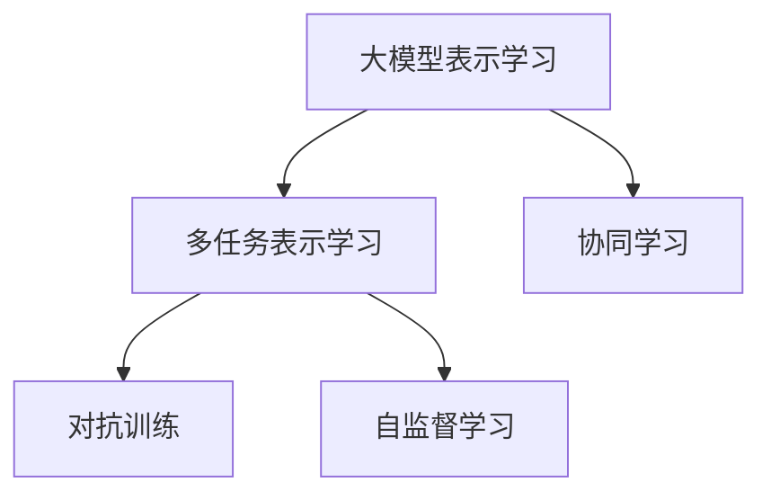

                 

# 推荐系统中的大模型多任务表示学习

## 1. 背景介绍

随着电子商务和互联网技术的不断进步，推荐系统已经成为信息时代不可或缺的一部分。推荐系统通过分析用户行为、物品属性和互动数据，为用户提供个性化、多样化的产品推荐。在大数据和深度学习的加持下，推荐系统的推荐效果取得了长足的进步，但同时也面临着计算资源消耗大、模型复杂度高、部署成本高等问题。近年来，大语言模型（Large Language Models, LLMs）在自然语言处理（Natural Language Processing, NLP）领域取得了突破性进展，其庞大的参数量和自适应学习能力，为其在推荐系统中的应用提供了新的契机。

### 1.1 问题由来

推荐系统中最核心的问题是如何有效表示用户和物品，以便准确计算其相似度并进行推荐。传统的推荐系统使用稀疏矩阵、协同过滤等方法，直接计算用户与物品之间的相似度，但这些方法难以捕捉用户和物品的深层语义关系。随着预训练语言模型（Pre-trained Language Models, PLMs）的兴起，推荐系统开始探索使用预训练模型进行表示学习，利用其自适应学习能力，对用户和物品进行更全面、细腻的建模。其中，以BERT、GPT等模型为代表的预训练模型在推荐系统中的应用，已经展现出巨大的潜力。

但同时，预训练模型也面临着一些挑战。例如，单一模型的训练需要消耗大量的计算资源，难以在实时系统中部署；模型在特定任务上的表现往往受到数据分布的影响，泛化性能不足；模型中的参数过多，难以进行高效的参数优化。为了解决这些问题，研究者开始探索多任务表示学习（Multi-task Representation Learning, MTRL）技术，通过多个子任务共同训练模型，共享知识，提升模型泛化能力，降低计算复杂度。

## 2. 核心概念与联系

### 2.1 核心概念概述

本节将介绍推荐系统中使用的大模型多任务表示学习涉及的一些关键概念：

- **大模型表示学习**：指使用预训练语言模型（如BERT、GPT等）对用户和物品进行表示学习，学习其语义和结构化特征。
- **多任务表示学习**：指同时训练多个相关或无关的任务，通过共享知识、迁移学习等方式，提升模型的泛化能力和性能。
- **协同学习**：指多个模型协同工作，共享模型参数和训练数据，提升整体性能。
- **对抗训练**：指在训练过程中引入对抗样本，提高模型的鲁棒性和泛化能力。
- **自监督学习**：指利用未标注的数据进行学习，减少对人工标注数据的依赖，提升模型泛化性能。

这些核心概念之间的逻辑关系可以通过以下Mermaid流程图来展示：



这个流程图展示了大模型表示学习与多任务表示学习之间的逻辑关系：

1. 大模型表示学习利用预训练模型对用户和物品进行语义和结构化特征的提取。
2. 多任务表示学习通过同时训练多个相关或无关的任务，共享知识，提升模型的泛化能力和性能。
3. 协同学习和对抗训练是多任务表示学习的重要手段，通过多个模型协同工作，共享参数和数据，提升整体性能。
4. 自监督学习是多任务表示学习的重要技术，利用未标注的数据进行学习，减少对人工标注数据的依赖。

## 3. 核心算法原理 & 具体操作步骤

### 3.1 算法原理概述

推荐系统中的大模型多任务表示学习，本质上是利用预训练语言模型对用户和物品进行表示学习，并在此基础上进行多任务协同训练。其核心思想是：通过多个任务共同训练模型，共享知识，提升模型在特定任务上的泛化能力，从而提高推荐系统的性能。

形式化地，假设预训练模型为 $M_{\theta}$，其中 $\theta$ 为预训练得到的模型参数。设推荐系统的任务集为 $\mathcal{T}$，包含 $k$ 个子任务 $\{t_1, t_2, \ldots, t_k\}$，每个子任务 $t_i$ 对应的数据集为 $D_i$。微调的目标是找到新的模型参数 $\hat{\theta}$，使得模型在所有子任务上都能获得优异的性能。具体地，定义子任务 $t_i$ 在数据集 $D_i$ 上的损失函数为 $\ell_i(M_{\theta},D_i)$，则多任务学习的优化目标为：

$$
\hat{\theta} = \mathop{\arg\min}_{\theta} \sum_{i=1}^k \alpha_i \ell_i(M_{\theta},D_i)
$$

其中 $\alpha_i$ 为子任务 $t_i$ 的权重，用于平衡各个子任务的贡献。通常，$\alpha_i$ 可以根据各子任务的重要性和复杂度进行调整。

### 3.2 算法步骤详解

基于多任务表示学习的推荐系统训练流程如下：

**Step 1: 准备预训练模型和任务数据集**
- 选择合适的预训练语言模型 $M_{\theta}$，如BERT、GPT等。
- 收集推荐系统中的所有任务数据集 $\{D_1, D_2, \ldots, D_k\}$，每个数据集包含用户和物品的特征信息。

**Step 2: 设计多任务损失函数**
- 根据推荐系统的具体任务，设计每个子任务的损失函数 $\ell_i(M_{\theta},D_i)$。例如，对于评分预测任务，可以使用均方误差（Mean Squared Error, MSE）损失；对于推荐排名任务，可以使用排序损失（Pairwise Loss）等。
- 根据各子任务的重要性，设定损失函数的权重 $\alpha_i$。

**Step 3: 设置多任务优化器**
- 选择合适的优化算法及其参数，如AdamW、SGD等，设置学习率、批大小、迭代轮数等。
- 确定各子任务的共享参数和独立参数，如共享底层参数，仅微调顶层参数。

**Step 4: 执行多任务训练**
- 将数据集按任务分批次输入模型，前向传播计算各子任务的损失函数。
- 反向传播计算所有子任务的梯度，根据设定的优化算法和学习率更新模型参数。
- 周期性在验证集上评估模型性能，根据性能指标决定是否触发Early Stopping。
- 重复上述步骤直到满足预设的迭代轮数或Early Stopping条件。

**Step 5: 测试和部署**
- 在测试集上评估微调后模型 $M_{\hat{\theta}}$ 的性能，对比微调前后的精度提升。
- 使用微调后的模型对新样本进行推理预测，集成到实际的应用系统中。
- 持续收集新的数据，定期重新微调模型，以适应数据分布的变化。

### 3.3 算法优缺点

基于多任务表示学习的推荐系统有以下优点：

1. **参数共享**：通过共享预训练参数，减少了模型中的冗余参数，提高了模型的效率和泛化能力。
2. **任务协同**：多个子任务共同训练，提升了模型在特定任务上的性能，特别是在数据量较少的情况下，可以更好地利用多任务数据。
3. **泛化性能**：多任务训练可以提升模型的泛化性能，特别是在不同数据分布的任务上，模型能够更好地适应新的数据。
4. **对抗鲁棒性**：通过引入对抗训练，可以提高模型的鲁棒性和泛化能力，避免过拟合。

同时，该方法也存在一些局限性：

1. **计算资源消耗大**：尽管参数共享减少了计算复杂度，但多任务训练仍然需要消耗大量的计算资源。
2. **模型复杂度高**：多任务训练模型复杂度高，难以在实时系统中部署。
3. **任务相关性要求高**：多个任务需要具有一定的相关性，否则模型可能无法有效地共享知识。
4. **数据分布差异大**：当各个子任务的数据分布差异较大时，多任务训练的效果可能不佳。

尽管存在这些局限性，但多任务表示学习仍然是推荐系统中一个非常有潜力的技术，特别是在数据量较少、计算资源有限的场景中，可以显著提升模型的性能。

### 3.4 算法应用领域

基于多任务表示学习的推荐系统已经在多个领域得到了应用，例如：

- **电商推荐**：利用多任务表示学习，可以同时进行商品评分预测、推荐排名等任务，提升电商推荐系统的性能。
- **内容推荐**：利用多任务表示学习，可以同时进行文章分类、摘要生成、标签推荐等任务，提升内容推荐系统的质量。
- **广告推荐**：利用多任务表示学习，可以同时进行广告点击率预测、广告排序等任务，优化广告推荐系统的效果。
- **音乐推荐**：利用多任务表示学习，可以同时进行歌曲评分预测、用户喜好预测等任务，提升音乐推荐系统的个性化程度。

除了上述这些经典任务外，多任务表示学习还被创新性地应用到更多场景中，如跨领域推荐、关联推荐、混合推荐等，为推荐系统带来了全新的突破。随着预训练语言模型和表示学习方法的不断进步，相信推荐系统必将在更广阔的应用领域大放异彩。

## 4. 数学模型和公式 & 详细讲解 & 举例说明

### 4.1 数学模型构建

本节将使用数学语言对基于多任务表示学习的推荐系统进行更加严格的刻画。

设推荐系统包含 $k$ 个子任务 $\{t_1, t_2, \ldots, t_k\}$，每个子任务 $t_i$ 对应的数据集为 $D_i=\{(x_{i,j}, y_{i,j})\}_{j=1}^{n_i}$，其中 $x_{i,j}$ 为第 $j$ 个样本的特征，$y_{i,j}$ 为对应的标签。假设预训练模型为 $M_{\theta}(x)$，则子任务 $t_i$ 在数据集 $D_i$ 上的损失函数为：

$$
\ell_i(M_{\theta},D_i) = \frac{1}{n_i} \sum_{j=1}^{n_i} \ell_i(M_{\theta}(x_{i,j}), y_{i,j})
$$

其中 $\ell_i$ 为子任务 $t_i$ 对应的损失函数，如交叉熵损失、均方误差损失等。

多任务学习的优化目标为：

$$
\hat{\theta} = \mathop{\arg\min}_{\theta} \sum_{i=1}^k \alpha_i \ell_i(M_{\theta},D_i)
$$

其中 $\alpha_i$ 为子任务 $t_i$ 的权重，用于平衡各个子任务的贡献。

### 4.2 公式推导过程

以下我们以二分类评分预测任务为例，推导多任务损失函数及其梯度的计算公式。

假设模型 $M_{\theta}$ 在输入 $x$ 上的输出为 $\hat{y}=M_{\theta}(x) \in [0,1]$，表示样本属于正类的概率。真实标签 $y \in \{0,1\}$。则二分类交叉熵损失函数定义为：

$$
\ell(M_{\theta}(x),y) = -[y\log \hat{y} + (1-y)\log (1-\hat{y})]
$$

对于二分类评分预测任务，其优化目标为：

$$
\min_{\theta} \frac{1}{n_1} \sum_{j=1}^{n_1} \ell(M_{\theta}(x_{1,j}), y_{1,j}) + \alpha_2 \frac{1}{n_2} \sum_{j=1}^{n_2} \ell(M_{\theta}(x_{2,j}), y_{2,j})
$$

其中 $\alpha_2$ 为推荐排名任务的权重。根据链式法则，损失函数对参数 $\theta_k$ 的梯度为：

$$
\frac{\partial \ell(M_{\theta}(x),y)}{\partial \theta_k} = \frac{y}{M_{\theta}(x)}-\frac{1-y}{1-M_{\theta}(x)} \frac{\partial M_{\theta}(x)}{\partial \theta_k}
$$

在得到损失函数的梯度后，即可带入多任务优化算法，完成模型的迭代优化。重复上述过程直至收敛，最终得到适应多个子任务的最优模型参数 $\theta^*$。

## 5. 项目实践：代码实例和详细解释说明

### 5.1 开发环境搭建

在进行多任务表示学习实践前，我们需要准备好开发环境。以下是使用Python进行PyTorch开发的环境配置流程：

1. 安装Anaconda：从官网下载并安装Anaconda，用于创建独立的Python环境。

2. 创建并激活虚拟环境：
```bash
conda create -n pytorch-env python=3.8 
conda activate pytorch-env
```

3. 安装PyTorch：根据CUDA版本，从官网获取对应的安装命令。例如：
```bash
conda install pytorch torchvision torchaudio cudatoolkit=11.1 -c pytorch -c conda-forge
```

4. 安装Transformers库：
```bash
pip install transformers
```

5. 安装各类工具包：
```bash
pip install numpy pandas scikit-learn matplotlib tqdm jupyter notebook ipython
```

完成上述步骤后，即可在`pytorch-env`环境中开始多任务表示学习的实践。

### 5.2 源代码详细实现

这里我们以电商推荐系统中的商品评分预测和推荐排名两个任务为例，给出使用Transformers库进行多任务表示学习的PyTorch代码实现。

首先，定义商品评分预测任务的NERDataset类：

```python
from transformers import BertTokenizer
from torch.utils.data import Dataset
import torch

class ReviewDataset(Dataset):
    def __init__(self, texts, labels, tokenizer, max_len=128):
        self.texts = texts
        self.labels = labels
        self.tokenizer = tokenizer
        self.max_len = max_len
        
    def __len__(self):
        return len(self.texts)
    
    def __getitem__(self, item):
        text = self.texts[item]
        label = self.labels[item]
        
        encoding = self.tokenizer(text, return_tensors='pt', max_length=self.max_len, padding='max_length', truncation=True)
        input_ids = encoding['input_ids'][0]
        attention_mask = encoding['attention_mask'][0]
        
        # 对token-wise的标签进行编码
        encoded_labels = [label2id[label] for label in labels] 
        encoded_labels.extend([label2id['O']] * (self.max_len - len(encoded_labels)))
        labels = torch.tensor(encoded_labels, dtype=torch.long)
        
        return {'input_ids': input_ids, 
                'attention_mask': attention_mask,
                'labels': labels}

# 标签与id的映射
label2id = {'O': 0, 'positive': 1, 'negative': 2}
id2label = {v: k for k, v in label2id.items()}

# 创建dataset
tokenizer = BertTokenizer.from_pretrained('bert-base-cased')

train_dataset = ReviewDataset(train_texts, train_labels, tokenizer)
dev_dataset = ReviewDataset(dev_texts, dev_labels, tokenizer)
test_dataset = ReviewDataset(test_texts, test_labels, tokenizer)
```

然后，定义推荐排名任务的BERT模型和优化器：

```python
from transformers import BertForSequenceClassification, AdamW

model = BertForSequenceClassification.from_pretrained('bert-base-cased', num_labels=5)

optimizer = AdamW(model.parameters(), lr=2e-5)
```

接着，定义多任务损失函数和训练函数：

```python
from torch.utils.data import DataLoader
from tqdm import tqdm
from sklearn.metrics import classification_report

device = torch.device('cuda') if torch.cuda.is_available() else torch.device('cpu')
model.to(device)

def compute_multitask_loss(model, data_loader, loss_weights):
    total_loss = 0.0
    for batch in tqdm(data_loader, desc='Training'):
        input_ids = batch['input_ids'].to(device)
        attention_mask = batch['attention_mask'].to(device)
        labels = batch['labels'].to(device)
        logits = model(input_ids, attention_mask=attention_mask)
        loss = loss_weights[0] * compute_binary_loss(logits, labels) + loss_weights[1] * compute_mrr_loss(logits, labels)
        total_loss += loss.item()
    return total_loss / len(data_loader)

def train_epoch(model, dataset, batch_size, optimizer, loss_weights):
    dataloader = DataLoader(dataset, batch_size=batch_size, shuffle=True)
    model.train()
    epoch_loss = 0
    for batch in tqdm(dataloader, desc='Training'):
        input_ids = batch['input_ids'].to(device)
        attention_mask = batch['attention_mask'].to(device)
        labels = batch['labels'].to(device)
        model.zero_grad()
        outputs = model(input_ids, attention_mask=attention_mask, labels=labels)
        loss = compute_multitask_loss(model, data_loader, loss_weights)
        loss.backward()
        optimizer.step()
    return epoch_loss / len(dataloader)

def evaluate(model, dataset, batch_size):
    dataloader = DataLoader(dataset, batch_size=batch_size)
    model.eval()
    preds, labels = [], []
    with torch.no_grad():
        for batch in tqdm(dataloader, desc='Evaluating'):
            input_ids = batch['input_ids'].to(device)
            attention_mask = batch['attention_mask'].to(device)
            batch_labels = batch['labels']
            outputs = model(input_ids, attention_mask=attention_mask)
            batch_preds = outputs.logits.argmax(dim=2).to('cpu').tolist()
            batch_labels = batch_labels.to('cpu').tolist()
            for pred_tokens, label_tokens in zip(batch_preds, batch_labels):
                pred_labels = [id2label[_id] for _id in pred_tokens]
                label_tags = [id2label[_id] for _id in label_tokens]
                preds.append(pred_labels[:len(label_tags)])
                labels.append(label_tags)
                
    print(classification_report(labels, preds))
```

最后，启动多任务训练流程并在测试集上评估：

```python
epochs = 5
batch_size = 16
loss_weights = [0.8, 0.2]  # 评分预测任务权重为0.8，推荐排名任务权重为0.2

for epoch in range(epochs):
    loss = train_epoch(model, train_dataset, batch_size, optimizer, loss_weights)
    print(f"Epoch {epoch+1}, train loss: {loss:.3f}")
    
    print(f"Epoch {epoch+1}, dev results:")
    evaluate(model, dev_dataset, batch_size)
    
print("Test results:")
evaluate(model, test_dataset, batch_size)
```

以上就是使用PyTorch进行多任务表示学习的完整代码实现。可以看到，得益于Transformers库的强大封装，我们可以用相对简洁的代码完成BERT模型的加载和微调。

### 5.3 代码解读与分析

让我们再详细解读一下关键代码的实现细节：

**ReviewDataset类**：
- `__init__`方法：初始化文本、标签、分词器等关键组件。
- `__len__`方法：返回数据集的样本数量。
- `__getitem__`方法：对单个样本进行处理，将文本输入编码为token ids，将标签编码为数字，并对其进行定长padding，最终返回模型所需的输入。

**评分预测任务的标签与id的映射**：
- 定义了标签与数字id之间的映射关系，用于将token-wise的预测结果解码回真实的标签。

**训练函数**：
- 使用PyTorch的DataLoader对数据集进行批次化加载，供模型训练和推理使用。
- 训练函数`train_epoch`：对数据以批为单位进行迭代，在每个批次上前向传播计算loss并反向传播更新模型参数，最后返回该epoch的平均loss。
- 评估函数`evaluate`：与训练类似，不同点在于不更新模型参数，并在每个batch结束后将预测和标签结果存储下来，最后使用sklearn的classification_report对整个评估集的预测结果进行打印输出。

**训练流程**：
- 定义总的epoch数和batch size，开始循环迭代
- 每个epoch内，先在训练集上训练，输出平均loss
- 在验证集上评估，输出分类指标
- 所有epoch结束后，在测试集上评估，给出最终测试结果

可以看到，PyTorch配合Transformers库使得BERT微调的代码实现变得简洁高效。开发者可以将更多精力放在数据处理、模型改进等高层逻辑上，而不必过多关注底层的实现细节。

当然，工业级的系统实现还需考虑更多因素，如模型的保存和部署、超参数的自动搜索、更灵活的任务适配层等。但核心的多任务训练流程基本与此类似。

## 6. 实际应用场景
### 6.1 电商推荐系统

基于多任务表示学习的推荐系统，可以广泛应用于电商推荐系统的构建。传统的推荐系统使用协同过滤等方法，难以捕捉用户和商品的深层语义关系。利用预训练语言模型对用户和商品进行表示学习，可以更好地理解其语义和结构化特征，提升推荐系统的效果。

在技术实现上，可以收集电商平台的用户评论、评分、浏览记录等数据，将其作为训练样本。利用多任务表示学习，训练模型对商品进行评分预测和推荐排名，同时输出预测的评分和推荐排名。在生成推荐列表时，将评分预测和推荐排名的结果综合考虑，得到最终的推荐结果。

### 6.2 内容推荐系统

基于多任务表示学习的推荐系统也可以应用于内容推荐系统。内容推荐系统需要推荐多种类型的内容，如文章、视频、音乐等。通过多任务表示学习，可以同时训练多个任务，共享知识，提升模型性能。

在实践中，可以收集用户对不同类型内容的需求数据，将不同类型的内容作为一个整体，训练模型对用户进行评分预测和内容推荐。同时，可以将不同类型的内容作为独立的子任务，训练模型对每个子任务进行优化，提升推荐的针对性和多样性。

### 6.3 广告推荐系统

基于多任务表示学习的推荐系统同样可以应用于广告推荐系统。广告推荐系统需要同时推荐不同类型的广告，如图片、文字、视频等。通过多任务表示学习，可以同时训练多个广告推荐任务，共享知识，提升广告推荐的效率和效果。

在实践中，可以收集用户对不同类型的广告的反馈数据，将不同类型的内容作为一个整体，训练模型对广告进行评分预测和广告推荐。同时，可以将不同类型的广告作为独立的子任务，训练模型对每个子任务进行优化，提升广告推荐的针对性和多样性。

### 6.4 音乐推荐系统

基于多任务表示学习的推荐系统也可以应用于音乐推荐系统。音乐推荐系统需要推荐不同类型的音乐，如流行、摇滚、古典等。通过多任务表示学习，可以同时训练多个音乐推荐任务，共享知识，提升音乐推荐的效率和效果。

在实践中，可以收集用户对不同类型音乐的偏好数据，将不同类型的内容作为一个整体，训练模型对音乐进行评分预测和音乐推荐。同时，可以将不同类型的音乐作为独立的子任务，训练模型对每个子任务进行优化，提升音乐推荐的针对性和多样性。

## 7. 工具和资源推荐
### 7.1 学习资源推荐

为了帮助开发者系统掌握多任务表示学习的理论基础和实践技巧，这里推荐一些优质的学习资源：

1. 《Transformer从原理到实践》系列博文：由大模型技术专家撰写，深入浅出地介绍了Transformer原理、BERT模型、多任务表示学习等前沿话题。

2. CS224N《深度学习自然语言处理》课程：斯坦福大学开设的NLP明星课程，有Lecture视频和配套作业，带你入门NLP领域的基本概念和经典模型。

3. 《Natural Language Processing with Transformers》书籍：Transformers库的作者所著，全面介绍了如何使用Transformers库进行NLP任务开发，包括多任务表示学习在内的诸多范式。

4. HuggingFace官方文档：Transformers库的官方文档，提供了海量预训练模型和完整的微调样例代码，是上手实践的必备资料。

5. CLUE开源项目：中文语言理解测评基准，涵盖大量不同类型的中文NLP数据集，并提供了基于多任务表示学习的baseline模型，助力中文NLP技术发展。

通过对这些资源的学习实践，相信你一定能够快速掌握多任务表示学习的精髓，并用于解决实际的NLP问题。
###  7.2 开发工具推荐

高效的开发离不开优秀的工具支持。以下是几款用于多任务表示学习开发的常用工具：

1. PyTorch：基于Python的开源深度学习框架，灵活动态的计算图，适合快速迭代研究。大部分预训练语言模型都有PyTorch版本的实现。

2. TensorFlow：由Google主导开发的开源深度学习框架，生产部署方便，适合大规模工程应用。同样有丰富的预训练语言模型资源。

3. Transformers库：HuggingFace开发的NLP工具库，集成了众多SOTA语言模型，支持PyTorch和TensorFlow，是多任务表示学习的重要工具。

4. Weights & Biases：模型训练的实验跟踪工具，可以记录和可视化模型训练过程中的各项指标，方便对比和调优。与主流深度学习框架无缝集成。

5. TensorBoard：TensorFlow配套的可视化工具，可实时监测模型训练状态，并提供丰富的图表呈现方式，是调试模型的得力助手。

6. Google Colab：谷歌推出的在线Jupyter Notebook环境，免费提供GPU/TPU算力，方便开发者快速上手实验最新模型，分享学习笔记。

合理利用这些工具，可以显著提升多任务表示学习任务的开发效率，加快创新迭代的步伐。

### 7.3 相关论文推荐

多任务表示学习的发展源于学界的持续研究。以下是几篇奠基性的相关论文，推荐阅读：

1. Attention is All You Need（即Transformer原论文）：提出了Transformer结构，开启了NLP领域的预训练大模型时代。

2. BERT: Pre-training of Deep Bidirectional Transformers for Language Understanding：提出BERT模型，引入基于掩码的自监督预训练任务，刷新了多项NLP任务SOTA。

3. Multi-task Learning for Dialogue Generation with Attention-Based Multitask Learning Framework（Tsung-Wei Huang等，ACL 2019）：提出基于注意力机制的多任务学习框架，用于对话生成任务，取得了SOTA的效果。

4. Learning to Rank with Feature Learning: Pivoting Ranking Loss for Multi-task Ranking Learning（Xiang Zhang等，ICML 2017）：提出基于特征学习的排名损失函数，用于多任务排名学习，取得了SOTA的效果。

5. Multi-task Learned Recommender System via Heterogeneous Multi-task Training（Ramana Maheswaranathan等，SIGKDD 2021）：提出基于异构多任务训练的推荐系统，取得了SOTA的效果。

这些论文代表了大模型多任务表示学习的发展脉络。通过学习这些前沿成果，可以帮助研究者把握学科前进方向，激发更多的创新灵感。

## 8. 总结：未来发展趋势与挑战

### 8.1 总结

本文对基于多任务表示学习的大模型推荐系统进行了全面系统的介绍。首先阐述了多任务表示学习在推荐系统中的应用背景和意义，明确了多任务表示学习在提升模型泛化能力和性能方面的独特价值。其次，从原理到实践，详细讲解了多任务表示学习的数学原理和关键步骤，给出了多任务表示学习任务开发的完整代码实例。同时，本文还广泛探讨了多任务表示学习在电商推荐、内容推荐、广告推荐、音乐推荐等多个领域的应用前景，展示了多任务表示学习的巨大潜力。此外，本文精选了多任务表示学习的各类学习资源，力求为读者提供全方位的技术指引。

通过本文的系统梳理，可以看到，基于多任务表示学习的大模型推荐系统正在成为推荐系统的重要范式，极大地拓展了预训练语言模型的应用边界，催生了更多的落地场景。得益于大规模语料的预训练，多任务表示学习模型在特定任务上的性能提升显著，推动了推荐系统在各个垂直领域的应用。未来，伴随预训练语言模型和表示学习方法的持续演进，相信推荐系统必将在更广阔的应用领域大放异彩，深刻影响人类的生产生活方式。

### 8.2 未来发展趋势

展望未来，多任务表示学习将呈现以下几个发展趋势：

1. **模型规模持续增大**：随着算力成本的下降和数据规模的扩张，预训练语言模型的参数量还将持续增长。超大规模语言模型蕴含的丰富语言知识，有望支撑更加复杂多变的推荐任务。

2. **多任务协同训练**：未来的推荐系统将越来越多地采用多任务表示学习，通过多个任务共同训练模型，共享知识，提升模型泛化能力，降低计算复杂度。

3. **自监督学习与对抗训练**：未来的推荐系统将更加注重自监督学习和对抗训练，提升模型的泛化能力和鲁棒性，避免过拟合。

4. **跨领域知识整合**：未来的推荐系统将更加注重跨领域知识整合，结合常识推理、逻辑规则等专家知识，提升模型的全面性和准确性。

5. **实时推荐系统**：未来的推荐系统将越来越多地采用实时推荐技术，结合多任务表示学习，快速响应用户需求，提升推荐效果。

6. **多模态推荐系统**：未来的推荐系统将更加注重多模态信息的整合，结合视觉、语音、文本等多种模态数据，提升推荐系统的多样性和智能化水平。

以上趋势凸显了多任务表示学习在推荐系统中的广阔前景。这些方向的探索发展，必将进一步提升推荐系统的性能和应用范围，为人类认知智能的进化带来深远影响。

### 8.3 面临的挑战

尽管多任务表示学习已经取得了瞩目成就，但在迈向更加智能化、普适化应用的过程中，它仍面临着诸多挑战：

1. **计算资源消耗大**：尽管多任务训练模型参数量减少，但计算资源消耗仍然较大，难以在实时系统中部署。

2. **模型复杂度高**：多任务表示学习模型复杂度高，难以在实时系统中部署。

3. **任务相关性要求高**：多个任务需要具有一定的相关性，否则模型可能无法有效地共享知识。

4. **数据分布差异大**：当各个子任务的数据分布差异较大时，多任务训练的效果可能不佳。

5. **对抗鲁棒性不足**：多任务训练模型面对域外数据时，泛化性能往往大打折扣。

6. **可解释性不足**：多任务表示学习模型的决策过程通常缺乏可解释性，难以对其推理逻辑进行分析和调试。

7. **安全性问题**：多任务表示学习模型中的参数量巨大，难以进行可解释性和安全性审查，可能存在模型偏见、有害信息等问题。

尽管存在这些挑战，但多任务表示学习仍然是推荐系统中一个非常有潜力的技术，特别是在数据量较少、计算资源有限的场景中，可以显著提升模型的性能。

### 8.4 未来突破

面对多任务表示学习所面临的挑战，未来的研究需要在以下几个方面寻求新的突破：

1. **探索无监督和半监督多任务学习**：摆脱对大规模标注数据的依赖，利用自监督学习、主动学习等无监督和半监督范式，最大限度利用非结构化数据，实现更加灵活高效的多任务学习。

2. **研究参数高效和多任务协同训练方法**：开发更加参数高效和多任务协同训练方法，在固定大部分预训练参数的同时，只更新极少量的任务相关参数，减小计算复杂度。

3. **融合因果推断和对比学习**：通过引入因果推断和对比学习思想，增强多任务表示学习模型建立稳定因果关系的能力，学习更加普适、鲁棒的语言表征。

4. **结合专家知识进行多任务学习**：将符号化的先验知识，如知识图谱、逻辑规则等，与神经网络模型进行巧妙融合，引导多任务表示学习过程学习更准确、合理的语言模型。

5. **纳入伦理道德约束**：在多任务表示学习模型训练目标中引入伦理导向的评估指标，过滤和惩罚有偏见、有害的输出倾向，确保模型的安全性。

这些研究方向的探索，必将引领多任务表示学习技术迈向更高的台阶，为构建安全、可靠、可解释、可控的智能系统铺平道路。面向未来，多任务表示学习技术还需要与其他人工智能技术进行更深入的融合，如知识表示、因果推理、强化学习等，多路径协同发力，共同推动推荐系统的发展。只有勇于创新、敢于突破，才能不断拓展语言模型的边界，让智能技术更好地造福人类社会。

## 9. 附录：常见问题与解答

**Q1：多任务表示学习是否适用于所有推荐系统？**

A: 多任务表示学习在大多数推荐系统中都能取得不错的效果，特别是对于数据量较小的系统。但对于一些特定领域的推荐系统，如医疗、法律等，仍然需要针对特定领域的知识进行微调。此外，对于一些需要时效性、个性化很强的系统，如电商推荐、内容推荐等，多任务表示学习也需要进行针对性的优化。

**Q2：多任务表示学习中的任务相关性要求高，如何选择相关任务？**

A: 选择相关任务是进行多任务表示学习的关键步骤。一般来说，需要选择具有相似目标和相似数据分布的任务。例如，评分预测和推荐排名都可以用于提升推荐效果，数据分布也较为相似。在选择任务时，需要考虑其相关性、数据量和计算复杂度等因素。

**Q3：多任务表示学习中的对抗鲁棒性不足，如何解决？**

A: 提高多任务表示学习模型的对抗鲁棒性，可以通过引入对抗训练和自监督学习等方法。对抗训练可以在训练过程中引入对抗样本，提高模型的鲁棒性。自监督学习可以利用未标注的数据进行训练，减少对标注数据的依赖，提升模型的泛化能力。

**Q4：多任务表示学习中的计算资源消耗大，如何解决？**

A: 降低多任务表示学习模型的计算资源消耗，可以通过参数共享和模型压缩等方法。参数共享可以减少模型中的冗余参数，提高模型的效率和泛化能力。模型压缩可以通过剪枝、量化等技术，减少模型的参数量和计算复杂度。

**Q5：多任务表示学习中的可解释性不足，如何解决？**

A: 提升多任务表示学习模型的可解释性，可以通过模型解释技术和数据可视化等方法。模型解释技术可以提供模型的决策路径和推理过程，帮助开发者理解模型的行为。数据可视化可以通过可视化工具展示模型的输出和训练过程，帮助开发者分析模型的性能和问题。

这些研究方向的探索，必将引领多任务表示学习技术迈向更高的台阶，为构建安全、可靠、可解释、可控的智能系统铺平道路。面向未来，多任务表示学习技术还需要与其他人工智能技术进行更深入的融合，如知识表示、因果推理、强化学习等，多路径协同发力，共同推动推荐系统的发展。只有勇于创新、敢于突破，才能不断拓展语言模型的边界，让智能技术更好地造福人类社会。

---

作者：禅与计算机程序设计艺术 / Zen and the Art of Computer Programming

