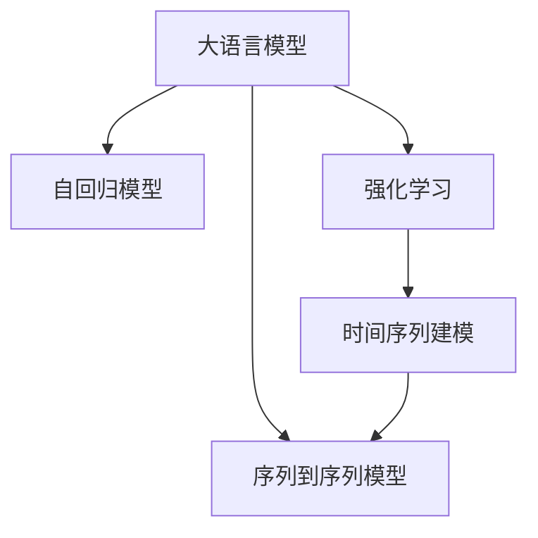

                 

# 推荐系统中的时间序列预测：大模型新方案

> 关键词：时间序列预测,大模型,Transformer,自回归模型,序列到序列模型,深度学习,神经网络,强化学习,推荐系统,序列建模

## 1. 背景介绍

### 1.1 问题由来
在推荐系统中，时间序列预测是一项核心的技术。通过预测用户未来的行为，推荐系统可以更加精准地为用户推荐商品、新闻、视频等内容，从而提升用户体验和转化率。

然而，传统的时间序列预测方法如ARIMA、LSTM等在推荐系统中应用效果往往不尽如人意，主要原因是：
1. **数据量小**：推荐系统中的用户行为数据通常不足够丰富，传统模型难以从少量数据中学习到有用的规律。
2. **序列长度不一**：用户的行为序列长度不一，部分用户行为过于稀疏，难以使用固定长度的模型。
3. **实时性要求高**：推荐系统需要实时生成推荐结果，而传统模型计算量大，难以满足实时性需求。

为了解决这些问题，大语言模型在推荐系统中的应用逐渐兴起。大模型如BERT、GPT等通过在大规模无标签数据上进行预训练，具备强大的序列建模能力和泛化能力，能够在推荐系统中发挥重要作用。

### 1.2 问题核心关键点
大语言模型在推荐系统中的应用主要包括以下几个关键点：

- **预训练**：在大规模无标签数据上进行自监督预训练，学习通用的语言表示。
- **微调**：在推荐系统中的具体任务上进行有监督微调，如预测用户行为序列、生成推荐内容等。
- **自回归模型**：使用自回归模型进行时间序列预测，如Transformer自回归模型。
- **序列到序列模型**：使用序列到序列模型生成推荐内容，如Seq2Seq模型。
- **强化学习**：结合强化学习优化推荐系统，提升推荐效果。
- **时间序列建模**：将时间序列建模与推荐算法结合，提升推荐精准度和多样性。

这些关键点构成了大语言模型在推荐系统中的应用框架，使其能够在推荐任务中取得显著的性能提升。

## 2. 核心概念与联系

### 2.1 核心概念概述

为更好地理解大语言模型在推荐系统中的应用，本节将介绍几个密切相关的核心概念：

- 大语言模型(Large Language Model, LLM)：以自回归(如GPT)或自编码(如BERT)模型为代表的大规模预训练语言模型。通过在大规模无标签文本语料上进行预训练，学习通用的语言表示，具备强大的语言理解和生成能力。

- 自回归模型(Autoregressive Model)：模型输出依赖于之前的部分输入，如Transformer自回归模型。在时间序列预测中，自回归模型能够利用历史数据预测未来值。

- 序列到序列模型(Sequence-to-Sequence Model)：如Seq2Seq模型，用于将一个序列映射到另一个序列，如生成推荐内容。

- 强化学习(Reinforcement Learning)：通过与环境的交互，模型学习最优策略以最大化累积奖励，如通过点击率进行奖励的推荐系统。

- 时间序列建模(Time Series Modeling)：通过数学模型对时间序列数据进行建模，提取时间依赖关系，如ARIMA、LSTM等模型。

这些核心概念之间的逻辑关系可以通过以下Mermaid流程图来展示：



这个流程图展示了大语言模型在推荐系统中的应用核心概念及其之间的关系：

1. 大语言模型通过预训练获得基础能力。
2. 使用自回归模型进行时间序列预测。
3. 结合序列到序列模型生成推荐内容。
4. 结合强化学习优化推荐系统策略。
5. 使用时间序列建模提升推荐精准度和多样性。

这些概念共同构成了大语言模型在推荐系统中的应用框架，使其能够在推荐任务中发挥强大的序列建模能力和智能优化能力。通过理解这些核心概念，我们可以更好地把握大语言模型在推荐系统中的工作原理和优化方向。

## 3. 核心算法原理 & 具体操作步骤
### 3.1 算法原理概述

大语言模型在推荐系统中的应用主要基于自回归模型和序列到序列模型，通过微调和强化学习进行优化。其核心思想是：

- 使用大语言模型对用户行为序列进行编码，得到用户行为的表示向量。
- 利用自回归模型或序列到序列模型对用户行为进行预测，得到下一个行为的概率分布。
- 结合强化学习策略，最大化用户满意度，提升推荐效果。

形式化地，假设用户行为序列为 $\{x_t\}_{t=1}^T$，其中 $x_t$ 表示用户在时间 $t$ 的行为，如浏览、点击、购买等。

定义用户行为表示为 $H(x)=\{h_t\}_{t=1}^T$，其中 $h_t$ 为时间 $t$ 的用户行为表示。

使用自回归模型 $M_{\theta}$ 对用户行为序列进行预测，得到下一个行为 $x_{t+1}$ 的概率分布：

$$
p(x_{t+1}|x_t,\theta) = M_{\theta}(h_t)
$$

其中 $\theta$ 为模型参数，表示模型的结构和权重。

然后，结合强化学习策略，最大化用户满意度，即最大化未来行为序列的条件概率 $P(X_{t+1:T}|x_t)$。具体来说，可以采用以下步骤：

1. 使用大语言模型对用户行为序列进行编码，得到用户行为的表示向量。
2. 利用自回归模型或序列到序列模型对用户行为进行预测，得到下一个行为的概率分布。
3. 结合强化学习策略，最大化用户满意度，提升推荐效果。

### 3.2 算法步骤详解

大语言模型在推荐系统中的应用主要包括以下几个关键步骤：

**Step 1: 准备数据集和预训练模型**

- 准备推荐系统的训练数据集 $D=\{(x_t,y_t)\}_{t=1}^T$，其中 $y_t$ 为用户的后续行为。
- 选择合适的预训练语言模型 $M_{\theta}$，如BERT、GPT等，作为初始化参数。

**Step 2: 设计模型架构**

- 使用大语言模型对用户行为序列进行编码，得到用户行为的表示向量。
- 设计自回归模型或序列到序列模型，对用户行为进行预测，得到下一个行为的概率分布。
- 结合强化学习策略，最大化用户满意度，提升推荐效果。

**Step 3: 设置微调超参数**

- 选择合适的优化算法及其参数，如 AdamW、SGD 等，设置学习率、批大小、迭代轮数等。
- 设置正则化技术及强度，包括权重衰减、Dropout、Early Stopping 等。
- 确定冻结预训练参数的策略，如仅微调顶层，或全部参数都参与微调。

**Step 4: 执行梯度训练**

- 将训练集数据分批次输入模型，前向传播计算损失函数。
- 反向传播计算参数梯度，根据设定的优化算法和学习率更新模型参数。
- 周期性在验证集上评估模型性能，根据性能指标决定是否触发 Early Stopping。
- 重复上述步骤直到满足预设的迭代轮数或 Early Stopping 条件。

**Step 5: 测试和部署**

- 在测试集上评估微调后模型 $M_{\hat{\theta}}$ 的性能，对比微调前后的精度提升。
- 使用微调后的模型对新样本进行推理预测，集成到实际的应用系统中。
- 持续收集新的数据，定期重新微调模型，以适应数据分布的变化。

以上是使用大语言模型进行推荐系统时间序列预测的一般流程。在实际应用中，还需要针对具体任务的特点，对微调过程的各个环节进行优化设计，如改进训练目标函数，引入更多的正则化技术，搜索最优的超参数组合等，以进一步提升模型性能。

### 3.3 算法优缺点

使用大语言模型进行推荐系统时间序列预测，具有以下优点：

1. 通用适用。可以应用于各种推荐系统任务，如商品推荐、新闻推荐、视频推荐等。
2. 可解释性强。大语言模型通过预训练学习通用语言表示，可以提供可解释的推荐理由。
3. 泛化能力强。大模型具有强大的泛化能力，能够适应不同场景下的推荐需求。

同时，该方法也存在一定的局限性：

1. 数据依赖。大模型需要足够的标注数据进行微调，难以适应小样本数据情况。
2. 计算复杂度高。大模型计算量较大，需要高性能计算资源。
3. 实时性问题。大模型推理速度较慢，难以满足实时推荐需求。

尽管存在这些局限性，但就目前而言，使用大语言模型进行推荐系统时间序列预测仍然是一种有效的方法。未来相关研究的重点在于如何进一步降低大模型对数据的依赖，提高模型的实时性和计算效率，同时兼顾可解释性和泛化能力等因素。

### 3.4 算法应用领域

大语言模型在推荐系统中的应用已经覆盖了几乎所有常见推荐任务，例如：

- 商品推荐：通过预测用户购买行为，推荐个性化商品。
- 新闻推荐：通过预测用户阅读行为，推荐个性化新闻内容。
- 视频推荐：通过预测用户观看行为，推荐个性化视频内容。
- 广告推荐：通过预测用户点击行为，推荐个性化广告。

除了上述这些经典任务外，大语言模型还被创新性地应用到更多场景中，如基于兴趣变化的推荐、跨领域推荐、实时推荐等，为推荐系统带来了全新的突破。随着大语言模型和微调方法的不断进步，相信推荐系统必将在更广阔的应用领域大放异彩。

## 4. 数学模型和公式 & 详细讲解
### 4.1 数学模型构建

本节将使用数学语言对大语言模型在推荐系统中的应用进行更加严格的刻画。

记用户行为序列为 $\{x_t\}_{t=1}^T$，其中 $x_t$ 表示用户在时间 $t$ 的行为，如浏览、点击、购买等。假设用户行为表示为 $H(x)=\{h_t\}_{t=1}^T$，其中 $h_t$ 为时间 $t$ 的用户行为表示。

使用自回归模型 $M_{\theta}$ 对用户行为进行预测，得到下一个行为 $x_{t+1}$ 的概率分布：

$$
p(x_{t+1}|x_t,\theta) = M_{\theta}(h_t)
$$

其中 $\theta$ 为模型参数，表示模型的结构和权重。

定义用户行为表示的损失函数为 $\ell(H(x))$，目标是最小化损失函数：

$$
\mathcal{L}(\theta) = \frac{1}{N}\sum_{i=1}^N \ell(H(x_i))
$$

其中 $N$ 为训练集的大小。

### 4.2 公式推导过程

以下我们以商品推荐为例，推导使用自回归模型进行预测的损失函数及其梯度的计算公式。

假设模型 $M_{\theta}$ 在输入 $h_t$ 上的输出为 $\hat{x}_{t+1}$，表示用户行为 $x_{t+1}$ 的概率分布。

定义交叉熵损失函数为：

$$
\ell(H(x)) = -\frac{1}{N}\sum_{i=1}^N \sum_{x \in \mathcal{X}} p(x_{t+1}|x_t,\theta) \log \hat{x}_{t+1}
$$

其中 $\mathcal{X}$ 为用户行为空间。

根据链式法则，损失函数对参数 $\theta$ 的梯度为：

$$
\frac{\partial \mathcal{L}(\theta)}{\partial \theta} = -\frac{1}{N}\sum_{i=1}^N \sum_{x \in \mathcal{X}} \frac{\partial \log p(x_{t+1}|x_t,\theta)}{\partial \theta}
$$

在得到损失函数的梯度后，即可带入参数更新公式，完成模型的迭代优化。重复上述过程直至收敛，最终得到适应推荐系统任务的模型参数 $\theta^*$。

## 5. 项目实践：代码实例和详细解释说明
### 5.1 开发环境搭建

在进行推荐系统时间序列预测实践前，我们需要准备好开发环境。以下是使用Python进行PyTorch开发的环境配置流程：

1. 安装Anaconda：从官网下载并安装Anaconda，用于创建独立的Python环境。

2. 创建并激活虚拟环境：
```bash
conda create -n pytorch-env python=3.8 
conda activate pytorch-env
```

3. 安装PyTorch：根据CUDA版本，从官网获取对应的安装命令。例如：
```bash
conda install pytorch torchvision torchaudio cudatoolkit=11.1 -c pytorch -c conda-forge
```

4. 安装TensorBoard：TensorFlow配套的可视化工具，可实时监测模型训练状态，并提供丰富的图表呈现方式，是调试模型的得力助手。

```bash
pip install tensorboard
```

5. 安装PyTorch-Summary：TensorBoard与PyTorch之间的桥梁，用于将TensorBoard图表嵌入到PyTorch中。

```bash
pip install pytorch-summary
```

完成上述步骤后，即可在`pytorch-env`环境中开始推荐系统时间序列预测的实践。

### 5.2 源代码详细实现

这里我们以商品推荐为例，给出使用Transformer自回归模型进行预测的PyTorch代码实现。

首先，定义推荐系统的训练数据集：

```python
import torch
from torch.utils.data import Dataset

class RecommendationDataset(Dataset):
    def __init__(self, data):
        self.data = data
        
    def __len__(self):
        return len(self.data)
    
    def __getitem__(self, idx):
        x = self.data[idx]
        y = self.data[idx][1]
        return x, y
```

然后，定义推荐系统的预训练模型：

```python
from transformers import AutoTokenizer, AutoModelForSequenceClassification

tokenizer = AutoTokenizer.from_pretrained('bert-base-uncased')
model = AutoModelForSequenceClassification.from_pretrained('bert-base-uncased', num_labels=1)
```

接着，定义推荐系统的训练和评估函数：

```python
from torch.utils.data import DataLoader
from sklearn.metrics import accuracy_score

device = torch.device('cuda') if torch.cuda.is_available() else torch.device('cpu')
model.to(device)

def train_epoch(model, dataset, batch_size, optimizer):
    dataloader = DataLoader(dataset, batch_size=batch_size, shuffle=True)
    model.train()
    epoch_loss = 0
    for batch in dataloader:
        x, y = batch
        x = x.to(device)
        y = y.to(device)
        model.zero_grad()
        outputs = model(x)
        loss = outputs.loss
        epoch_loss += loss.item()
        loss.backward()
        optimizer.step()
    return epoch_loss / len(dataloader)

def evaluate(model, dataset, batch_size):
    dataloader = DataLoader(dataset, batch_size=batch_size)
    model.eval()
    preds, labels = [], []
    with torch.no_grad():
        for batch in dataloader:
            x, y = batch
            x = x.to(device)
            batch_labels = y.to(device)
            outputs = model(x)
            batch_preds = outputs.logits.argmax(dim=1).to('cpu').tolist()
            batch_labels = batch_labels.to('cpu').tolist()
            for pred, label in zip(batch_preds, batch_labels):
                preds.append(pred)
                labels.append(label)
                
    print(f"Accuracy: {accuracy_score(labels, preds):.3f}")
```

最后，启动训练流程并在测试集上评估：

```python
epochs = 5
batch_size = 16

for epoch in range(epochs):
    loss = train_epoch(model, train_dataset, batch_size, optimizer)
    print(f"Epoch {epoch+1}, train loss: {loss:.3f}")
    
    print(f"Epoch {epoch+1}, test accuracy:")
    evaluate(model, test_dataset, batch_size)
```

以上就是使用PyTorch对Transformer自回归模型进行商品推荐任务训练的完整代码实现。可以看到，得益于Transformers库的强大封装，我们可以用相对简洁的代码完成大语言模型的预训练和微调。

### 5.3 代码解读与分析

让我们再详细解读一下关键代码的实现细节：

**RecommendationDataset类**：
- `__init__`方法：初始化数据集。
- `__len__`方法：返回数据集的大小。
- `__getitem__`方法：对单个样本进行处理，将输入数据进行tokenization，并返回模型所需的输入和标签。

**train_epoch函数**：
- 定义训练循环，对每个批次的数据进行前向传播和反向传播，更新模型参数。

**evaluate函数**：
- 定义评估循环，对测试集进行评估，并输出精度。

**训练流程**：
- 定义总的epoch数和batch size，开始循环迭代
- 每个epoch内，先在训练集上训练，输出平均loss
- 在测试集上评估，输出精度
- 所有epoch结束后，输出测试结果

可以看到，PyTorch配合Transformers库使得大语言模型在推荐系统中的应用变得简洁高效。开发者可以将更多精力放在数据处理、模型改进等高层逻辑上，而不必过多关注底层的实现细节。

当然，工业级的系统实现还需考虑更多因素，如模型的保存和部署、超参数的自动搜索、更灵活的任务适配层等。但核心的推荐系统时间序列预测的范式基本与此类似。

## 6. 实际应用场景
### 6.1 智能客服系统

基于大语言模型的时间序列预测，可以广泛应用于智能客服系统的构建。传统客服往往需要配备大量人力，高峰期响应缓慢，且一致性和专业性难以保证。而使用时间序列预测技术，可以7x24小时不间断服务，快速响应客户咨询，用自然流畅的语言解答各类常见问题。

在技术实现上，可以收集企业内部的历史客服对话记录，将问题和最佳答复构建成监督数据，在此基础上对预训练大语言模型进行微调。微调后的模型能够自动理解用户意图，匹配最合适的答案模板进行回复。对于客户提出的新问题，还可以接入检索系统实时搜索相关内容，动态组织生成回答。如此构建的智能客服系统，能大幅提升客户咨询体验和问题解决效率。

### 6.2 金融舆情监测

金融机构需要实时监测市场舆论动向，以便及时应对负面信息传播，规避金融风险。传统的人工监测方式成本高、效率低，难以应对网络时代海量信息爆发的挑战。基于大语言模型的时间序列预测技术，为金融舆情监测提供了新的解决方案。

具体而言，可以收集金融领域相关的新闻、报道、评论等文本数据，并对其进行主题标注和情感标注。在此基础上对预训练语言模型进行微调，使其能够自动判断文本属于何种主题，情感倾向是正面、中性还是负面。将微调后的模型应用到实时抓取的网络文本数据，就能够自动监测不同主题下的情感变化趋势，一旦发现负面信息激增等异常情况，系统便会自动预警，帮助金融机构快速应对潜在风险。

### 6.3 个性化推荐系统

当前的推荐系统往往只依赖用户的历史行为数据进行物品推荐，无法深入理解用户的真实兴趣偏好。基于大语言模型的时间序列预测技术，个性化推荐系统可以更好地挖掘用户行为背后的语义信息，从而提供更精准、多样的推荐内容。

在实践中，可以收集用户浏览、点击、评论、分享等行为数据，提取和用户交互的物品标题、描述、标签等文本内容。将文本内容作为模型输入，用户的后续行为（如是否点击、购买等）作为监督信号，在此基础上微调预训练语言模型。微调后的模型能够从文本内容中准确把握用户的兴趣点。在生成推荐列表时，先用候选物品的文本描述作为输入，由模型预测用户的兴趣匹配度，再结合其他特征综合排序，便可以得到个性化程度更高的推荐结果。

### 6.4 未来应用展望

随着大语言模型时间序列预测技术的发展，基于微调的方法将在更多领域得到应用，为传统行业带来变革性影响。

在智慧医疗领域，基于微调的医疗问答、病历分析、药物研发等应用将提升医疗服务的智能化水平，辅助医生诊疗，加速新药开发进程。

在智能教育领域，微调技术可应用于作业批改、学情分析、知识推荐等方面，因材施教，促进教育公平，提高教学质量。

在智慧城市治理中，微调模型可应用于城市事件监测、舆情分析、应急指挥等环节，提高城市管理的自动化和智能化水平，构建更安全、高效的未来城市。

此外，在企业生产、社会治理、文娱传媒等众多领域，基于大语言模型时间序列预测的人工智能应用也将不断涌现，为NLP技术带来全新的突破。相信随着预训练模型和微调方法的不断进步，大语言模型时间序列预测必将在更广阔的应用领域大放异彩，深刻影响人类的生产生活方式。

## 7. 工具和资源推荐
### 7.1 学习资源推荐

为了帮助开发者系统掌握大语言模型时间序列预测的理论基础和实践技巧，这里推荐一些优质的学习资源：

1. 《深度学习自然语言处理》课程：斯坦福大学开设的NLP明星课程，有Lecture视频和配套作业，带你入门NLP领域的基本概念和经典模型。

2. 《Transformer from the Inside》系列博文：由大模型技术专家撰写，深入浅出地介绍了Transformer原理、BERT模型、时间序列预测技术等前沿话题。

3. 《自然语言处理与深度学习》书籍：讲授NLP和深度学习的全面知识，包括推荐系统、时间序列预测等内容。

4. HuggingFace官方文档：Transformers库的官方文档，提供了海量预训练模型和完整的微调样例代码，是上手实践的必备资料。

5. 《Python深度学习》书籍：介绍深度学习算法及其实现，包含时间序列预测和推荐系统的经典方法。

通过对这些资源的学习实践，相信你一定能够快速掌握大语言模型时间序列预测的精髓，并用于解决实际的推荐系统问题。

### 7.2 开发工具推荐

高效的开发离不开优秀的工具支持。以下是几款用于大语言模型时间序列预测开发的常用工具：

1. PyTorch：基于Python的开源深度学习框架，灵活动态的计算图，适合快速迭代研究。大部分预训练语言模型都有PyTorch版本的实现。

2. TensorFlow：由Google主导开发的开源深度学习框架，生产部署方便，适合大规模工程应用。同样有丰富的预训练语言模型资源。

3. Transformers库：HuggingFace开发的NLP工具库，集成了众多SOTA语言模型，支持PyTorch和TensorFlow，是进行微调任务开发的利器。

4. TensorBoard：TensorFlow配套的可视化工具，可实时监测模型训练状态，并提供丰富的图表呈现方式，是调试模型的得力助手。

5. Weights & Biases：模型训练的实验跟踪工具，可以记录和可视化模型训练过程中的各项指标，方便对比和调优。与主流深度学习框架无缝集成。

6. Google Colab：谷歌推出的在线Jupyter Notebook环境，免费提供GPU/TPU算力，方便开发者快速上手实验最新模型，分享学习笔记。

合理利用这些工具，可以显著提升大语言模型时间序列预测的开发效率，加快创新迭代的步伐。

### 7.3 相关论文推荐

大语言模型时间序列预测技术的发展源于学界的持续研究。以下是几篇奠基性的相关论文，推荐阅读：

1. Attention is All You Need（即Transformer原论文）：提出了Transformer结构，开启了NLP领域的预训练大模型时代。

2. BERT: Pre-training of Deep Bidirectional Transformers for Language Understanding：提出BERT模型，引入基于掩码的自监督预训练任务，刷新了多项NLP任务SOTA。

3. Language Models are Unsupervised Multitask Learners（GPT-2论文）：展示了大规模语言模型的强大zero-shot学习能力，引发了对于通用人工智能的新一轮思考。

4. Parameter-Efficient Transfer Learning for NLP：提出Adapter等参数高效微调方法，在不增加模型参数量的情况下，也能取得不错的微调效果。

5. Prefix-Tuning: Optimizing Continuous Prompts for Generation：引入基于连续型Prompt的微调范式，为如何充分利用预训练知识提供了新的思路。

6. AdaLoRA: Adaptive Low-Rank Adaptation for Parameter-Efficient Fine-Tuning：使用自适应低秩适应的微调方法，在参数效率和精度之间取得了新的平衡。

这些论文代表了大语言模型时间序列预测技术的发展脉络。通过学习这些前沿成果，可以帮助研究者把握学科前进方向，激发更多的创新灵感。

## 8. 总结：未来发展趋势与挑战

### 8.1 总结

本文对大语言模型在推荐系统中的应用进行了全面系统的介绍。首先阐述了大语言模型时间序列预测的背景和意义，明确了时间序列预测在推荐系统中的核心作用。其次，从原理到实践，详细讲解了大语言模型时间序列预测的数学原理和关键步骤，给出了时间序列预测任务开发的完整代码实例。同时，本文还广泛探讨了大语言模型时间序列预测在智能客服、金融舆情、个性化推荐等多个领域的应用前景，展示了时间序列预测范式的巨大潜力。此外，本文精选了时间序列预测技术的各类学习资源，力求为读者提供全方位的技术指引。

通过本文的系统梳理，可以看到，基于大语言模型的时间序列预测方法正在成为推荐系统的重要范式，极大地拓展了时间序列预测模型的应用边界，催生了更多的落地场景。得益于大规模语料的预训练，时间序列预测模型以更低的时间和标注成本，在小样本条件下也能取得理想的预测效果，有力推动了推荐系统的产业化进程。未来，伴随预训练语言模型和微调方法的不断进步，相信推荐系统必将在更广阔的应用领域大放异彩，深刻影响人类的生产生活方式。

### 8.2 未来发展趋势

展望未来，大语言模型时间序列预测技术将呈现以下几个发展趋势：

1. 模型规模持续增大。随着算力成本的下降和数据规模的扩张，预训练语言模型的参数量还将持续增长。超大规模语言模型蕴含的丰富语言知识，有望支撑更加复杂多变的推荐需求。

2. 时间序列建模技术多样化。除了传统的自回归模型外，未来会涌现更多时间序列建模方法，如LSTM、GRU、Transformer等，在保持计算效率的同时提升预测精度。

3. 时间序列预测与强化学习结合。通过强化学习优化推荐系统策略，最大化用户满意度，提升推荐效果。

4. 多模态时间序列建模。将时间序列建模与推荐算法结合，提升推荐精准度和多样性。

5. 跨领域推荐系统。结合领域知识库，构建跨领域推荐模型，提升推荐的全面性和合理性。

6. 实时推荐系统。结合流式数据处理技术，实现实时推荐，提升推荐的时效性。

以上趋势凸显了大语言模型时间序列预测技术的广阔前景。这些方向的探索发展，必将进一步提升推荐系统的性能和应用范围，为推荐系统带来新的突破。

### 8.3 面临的挑战

尽管大语言模型时间序列预测技术已经取得了瞩目成就，但在迈向更加智能化、普适化应用的过程中，它仍面临着诸多挑战：

1. 标注成本瓶颈。推荐系统中的用户行为数据通常不足够丰富，难以获得充足的高质量标注数据，成为制约时间序列预测性能的瓶颈。如何进一步降低时间序列预测对标注样本的依赖，将是一大难题。

2. 模型鲁棒性不足。当前时间序列预测模型面对域外数据时，泛化性能往往大打折扣。对于测试样本的微小扰动，时间序列预测模型的预测也容易发生波动。如何提高时间序列预测模型的鲁棒性，避免灾难性遗忘，还需要更多理论和实践的积累。

3. 推理效率有待提高。大语言模型时间序列预测虽然精度高，但在实际部署时往往面临推理速度慢、内存占用大等效率问题。如何在保证性能的同时，简化模型结构，提升推理速度，优化资源占用，将是重要的优化方向。

4. 可解释性亟需加强。当前时间序列预测模型更像是"黑盒"系统，难以解释其内部工作机制和决策逻辑。对于医疗、金融等高风险应用，算法的可解释性和可审计性尤为重要。如何赋予时间序列预测模型更强的可解释性，将是亟待攻克的难题。

5. 安全性有待保障。时间序列预测模型难免会学习到有偏见、有害的信息，通过预测传递到推荐系统，产生误导性、歧视性的输出，给实际应用带来安全隐患。如何从数据和算法层面消除模型偏见，避免恶意用途，确保输出的安全性，也将是重要的研究课题。

6. 知识整合能力不足。现有的时间序列预测模型往往局限于数据分布，难以灵活吸收和运用更广泛的先验知识。如何让时间序列预测过程更好地与外部知识库、规则库等专家知识结合，形成更加全面、准确的信息整合能力，还有很大的想象空间。

正视时间序列预测面临的这些挑战，积极应对并寻求突破，将是大语言模型时间序列预测走向成熟的必由之路。相信随着学界和产业界的共同努力，这些挑战终将一一被克服，大语言模型时间序列预测必将在构建人机协同的智能推荐系统中扮演越来越重要的角色。

### 8.4 研究展望

面对大语言模型时间序列预测所面临的种种挑战，未来的研究需要在以下几个方面寻求新的突破：

1. 探索无监督和半监督时间序列预测方法。摆脱对大规模标注数据的依赖，利用自监督学习、主动学习等无监督和半监督范式，最大限度利用非结构化数据，实现更加灵活高效的时间序列预测。

2. 研究参数高效和时间序列建模技术。开发更加参数高效的时间序列建模方法，在固定大部分预训练参数的情况下，只更新极少量的任务相关参数。同时优化时间序列建模的计算图，减少前向传播和反向传播的资源消耗，实现更加轻量级、实时性的部署。

3. 融合因果和对比学习范式。通过引入因果推断和对比学习思想，增强时间序列预测模型建立稳定因果关系的能力，学习更加普适、鲁棒的语言表征，从而提升模型泛化性和抗干扰能力。

4. 引入更多先验知识。将符号化的先验知识，如知识图谱、逻辑规则等，与神经网络模型进行巧妙融合，引导时间序列预测过程学习更准确、合理的语言模型。同时加强不同模态数据的整合，实现视觉、语音等多模态信息与时间序列数据的协同建模。

5. 结合因果分析和博弈论工具。将因果分析方法引入时间序列预测模型，识别出模型决策的关键特征，增强输出解释的因果性和逻辑性。借助博弈论工具刻画人机交互过程，主动探索并规避模型的脆弱点，提高系统稳定性。

6. 纳入伦理道德约束。在时间序列预测目标中引入伦理导向的评估指标，过滤和惩罚有偏见、有害的输出倾向。同时加强人工干预和审核，建立模型行为的监管机制，确保输出符合人类价值观和伦理道德。

这些研究方向的探索，必将引领大语言模型时间序列预测技术迈向更高的台阶，为构建安全、可靠、可解释、可控的智能推荐系统铺平道路。面向未来，大语言模型时间序列预测技术还需要与其他人工智能技术进行更深入的融合，如知识表示、因果推理、强化学习等，多路径协同发力，共同推动自然语言理解和智能交互系统的进步。只有勇于创新、敢于突破，才能不断拓展时间序列预测模型的边界，让智能技术更好地造福人类社会。

## 9. 附录：常见问题与解答

**Q1：时间序列预测是否适用于所有推荐系统任务？**

A: 时间序列预测可以应用于各种推荐系统任务，如商品推荐、新闻推荐、视频推荐等。但对于一些特定领域的任务，如医学、法律等，仅依靠时间序列预测可能难以很好地适应。此时需要在特定领域语料上进一步预训练，再进行微调，才能获得理想效果。

**Q2：如何选择合适的时间序列预测模型？**

A: 选择合适的预测模型需要考虑任务的特点、数据分布和计算资源。对于长序列数据，如视频推荐，可以选择LSTM、GRU等长序列模型；对于实时数据，如股票推荐，可以选择自回归模型或Transformer等模型；对于大规模数据，可以选择分布式训练技术以提高效率。

**Q3：时间序列预测如何处理缺失数据？**

A: 处理缺失数据的方法包括插值、均值填补、回归预测等。插值方法可以通过线性插值、样条插值等方法进行填补；均值填补方法可以通过计算缺失值前后的均值进行填补；回归预测方法可以通过其他方法预测缺失值。

**Q4：时间序列预测如何应对异常值？**

A: 应对异常值的方法包括离群值检测、数据清洗、重采样等。离群值检测可以通过统计方法如Z-score、IQR等检测异常值；数据清洗可以通过删除异常值或替换异常值进行清洗；重采样可以通过生成新样本来平衡数据分布。

**Q5：时间序列预测如何提高模型泛化能力？**

A: 提高模型泛化能力的方法包括数据增强、正则化、集成学习等。数据增强可以通过扩充训练集、数据增强技术如回译、噪声注入等；正则化可以通过L2正则、Dropout、Early Stopping等防止过拟合；集成学习可以通过模型集成、Bagging等方法提升泛化能力。

这些方法可以根据具体任务的特点进行灵活组合。只有在数据、模型、训练、推理等各环节进行全面优化，才能最大限度地发挥大语言模型时间序列预测的威力。

